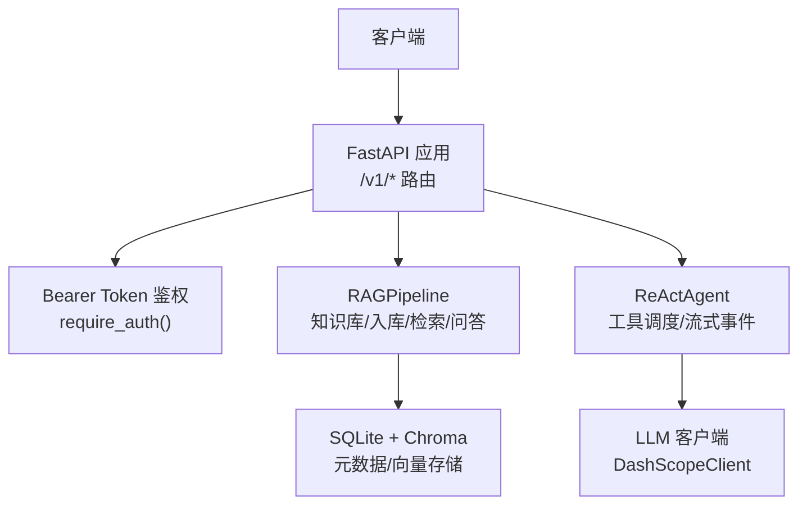
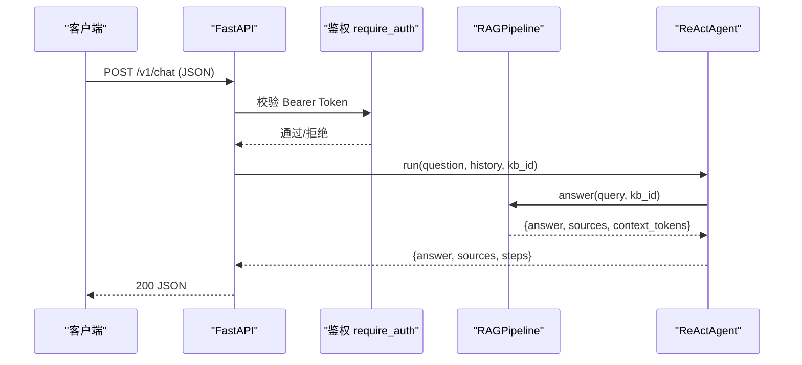
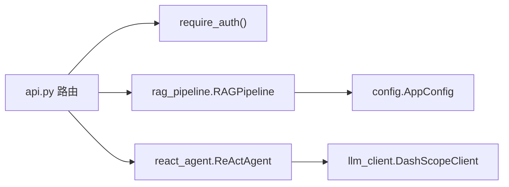

# API参考

<cite>
**本文引用的文件**
- [api.py](file://api.py)
- [config.py](file://config.py)
- [rag_pipeline.py](file://rag_pipeline.py)
- [react_agent.py](file://react_agent.py)
- [README.md](file://README.md)
</cite>

## 目录
1. [简介](#简介)
2. [项目结构](#项目结构)
3. [核心组件](#核心组件)
4. [架构总览](#架构总览)
5. [详细端点说明](#详细端点说明)
6. [依赖关系分析](#依赖关系分析)
7. [性能与限流](#性能与限流)
8. [故障排查指南](#故障排查指南)
9. [结论](#结论)
10. [附录：集成示例](#附录集成示例)

## 简介
本参考文档面向开发者，完整记录基于 FastAPI 的 REST API，包括知识库管理、文档操作与对话交互等接口。服务提供 /v1 版本前缀，支持可选的 Bearer Token 鉴权；默认单机运行，使用全局锁串行化读写以避免 SQLite/Chroma 并发问题。所有请求/响应均遵循 JSON 格式，错误统一通过 HTTPException 返回标准状态码与 detail 信息。

## 项目结构
- api.py：FastAPI 服务层，定义路由、数据模型、鉴权中间件与业务调用。
- rag_pipeline.py：RAG 管线（知识库管理、入库、检索、问答）。
- react_agent.py：Function Calling Agent（工具注册表、多步循环、事件流）。
- config.py：集中配置（从环境变量读取，含检索、切分、Agent 行为等参数）。
- README.md：快速开始、环境变量说明、curl 示例等。

图表来源
- [api.py:34-57](file://api.py#L34-L57)
- [rag_pipeline.py:196-200](file://rag_pipeline.py#L196-L200)
- [react_agent.py:144-158](file://react_agent.py#L144-L158)

章节来源
- [api.py:1-57](file://api.py#L1-L57)
- [README.md:50-65](file://README.md#L50-L65)

## 核心组件
- 鉴权机制：当设置环境变量 API_AUTH_TOKEN 时，所有 /v1 路由需携带 Authorization: Bearer <token>；未设置则放行（仅建议本机/内网调试）。
- 服务实例：模块级初始化 RAGPipeline 与 ReActAgent，避免重复创建资源。
- 数据模型：Pydantic 校验 ChatRequest、KbCreateRequest、UploadResponse 等。
- 错误处理：HTTPException 统一返回 4xx/5xx 及 detail 描述。

章节来源
- [api.py:31-57](file://api.py#L31-L57)
- [api.py:63-88](file://api.py#L63-L88)
- [api.py:90-93](file://api.py#L90-L93)

## 架构总览

图表来源
- [api.py:185-199](file://api.py#L185-L199)
- [react_agent.py:144-158](file://react_agent.py#L144-L158)
- [rag_pipeline.py:196-200](file://rag_pipeline.py#L196-L200)

## 详细端点说明

### 通用约定
- 版本策略：所有业务接口以 /v1 为前缀；健康检查 /health 不受版本限制。
- 鉴权：若设置了 API_AUTH_TOKEN，需在请求头中携带 Authorization: Bearer <token>。
- 内容类型：除上传接口外，均为 application/json。
- 错误格式：HTTP 异常统一返回 {detail: "..."}。
- 限流：当前版本未实现显式限流；生产环境建议在网关或反向代理层配置。

章节来源
- [api.py:31-57](file://api.py#L31-L57)
- [README.md:50-65](file://README.md#L50-L65)

### 健康检查
- 方法：GET
- 路径：/health
- 鉴权：不需要
- 请求体：无
- 响应体：{"status": "ok"}
- 状态码：200

章节来源
- [api.py:98-100](file://api.py#L98-L100)

### 知识库管理 API（/v1/kbs）

#### 列出知识库
- 方法：GET
- 路径：/v1/kbs
- 鉴权：需要（若启用）
- 请求体：无
- 响应体：数组，元素为知识库对象（包含 id、name、description 等字段）
- 状态码：200

章节来源
- [api.py:103-106](file://api.py#L103-L106)

#### 创建知识库
- 方法：POST
- 路径：/v1/kbs
- 鉴权：需要（若启用）
- 请求体：
  - name: 字符串，必填，长度 1-100
  - description: 字符串，可选，默认空
- 响应体：知识库对象（包含 id、name、description 等）
- 状态码：
  - 201：创建成功
  - 409：名称冲突或其他值错误
  - 401：鉴权失败（若启用）

章节来源
- [api.py:109-115](file://api.py#L109-L115)

#### 删除知识库
- 方法：DELETE
- 路径：/v1/kbs/{kb_id}
- 鉴权：需要（若启用）
- 路径参数：
  - kb_id: 字符串，知识库 ID
- 响应体：{"deleted": "<kb_id>"}
- 状态码：
  - 200：删除成功
  - 404：知识库不存在
  - 401：鉴权失败（若启用）

章节来源
- [api.py:118-123](file://api.py#L118-L123)

### 文档操作 API（/v1/kbs/{kb_id}/documents 与 /v1/documents）

#### 上传文档
- 方法：POST
- 路径：/v1/kbs/{kb_id}/documents
- 鉴权：需要（若启用）
- 路径参数：
  - kb_id: 字符串，知识库 ID
- 表单字段：
  - file: 二进制文件，必填（支持 txt/docx/pdf/md）
  - category: 字符串，可选
  - tags: 字符串，可选（逗号分隔）
- 响应体：
  - doc_id: 字符串
  - filename: 字符串
  - version: 整数（最新版本号）
- 状态码：
  - 200：上传并保存成功
  - 400：文件格式或内容错误
  - 404：知识库不存在
  - 401：鉴权失败（若启用）

章节来源
- [api.py:126-150](file://api.py#L126-L150)

#### 重新索引（入库）
- 方法：POST
- 路径：/v1/kbs/{kb_id}/ingest
- 鉴权：需要（若启用）
- 路径参数：
  - kb_id: 字符串，知识库 ID
- 响应体：入库结果对象（包含 message、error 等字段）
- 状态码：
  - 200：成功
  - 500：入库过程中发生错误
  - 404：知识库不存在
  - 401：鉴权失败（若启用）

章节来源
- [api.py:153-160](file://api.py#L153-L160)

#### 列出已索引文档
- 方法：GET
- 路径：/v1/kbs/{kb_id}/documents
- 鉴权：需要（若启用）
- 路径参数：
  - kb_id: 字符串，知识库 ID
- 响应体：数组，元素为文档对象（包含 id、filename、chunk_count、latest_version 等）
- 状态码：
  - 200：成功
  - 404：知识库不存在
  - 401：鉴权失败（若启用）

章节来源
- [api.py:163-167](file://api.py#L163-L167)

#### 获取知识库统计
- 方法：GET
- 路径：/v1/kbs/{kb_id}/stats
- 鉴权：需要（若启用）
- 路径参数：
  - kb_id: 字符串，知识库 ID
- 响应体：统计对象（如 documents、chunks 等）
- 状态码：
  - 200：成功
  - 404：知识库不存在
  - 401：鉴权失败（若启用）

章节来源
- [api.py:170-174](file://api.py#L170-L174)

#### 删除文档
- 方法：DELETE
- 路径：/v1/documents/{doc_id}
- 鉴权：需要（若启用）
- 路径参数：
  - doc_id: 字符串，文档 ID
- 响应体：{"deleted": "<doc_id>"}
- 状态码：
  - 200：删除成功
  - 404：文档不存在
  - 401：鉴权失败（若启用）

章节来源
- [api.py:177-182](file://api.py#L177-L182)

### 对话交互 API（/v1/chat）

#### 发送对话请求
- 方法：POST
- 路径：/v1/chat
- 鉴权：需要（若启用）
- 请求体：
  - question: 字符串，必填，长度 1-2000
  - history: 数组，可选，最近对话（user/assistant 交替的消息列表）
  - kb_id: 字符串，可选，指定知识库；不传则使用默认库
- 响应体：
  - answer: 字符串，回答内容
  - sources: 数组，引用来源（包含 citation、content、vector_score、bm25_score 等）
  - steps: 数组，Agent 执行轨迹（工具调用步骤）
  - kb_id: 字符串或空，本次使用的知识库 ID
- 状态码：
  - 200：成功
  - 400：question 为空或非法
  - 500：服务端内部错误（例如 LLM/检索异常）
  - 401：鉴权失败（若启用）

章节来源
- [api.py:63-76](file://api.py#L63-L76)
- [api.py:185-199](file://api.py#L185-L199)

## 依赖关系分析
- FastAPI 路由依赖 require_auth 进行鉴权。
- 路由调用 RAGPipeline 完成知识库管理、文档入库、检索与问答。
- ReActAgent 封装工具调度（知识库检索、天气查询、联网搜索），并通过 LLM 客户端与外部模型交互。
- 配置来自 AppConfig，控制检索阈值、上下文大小、Agent 最大步数等。

图表来源
- [api.py:31-57](file://api.py#L31-L57)
- [rag_pipeline.py:196-200](file://rag_pipeline.py#L196-L200)
- [react_agent.py:144-158](file://react_agent.py#L144-L158)
- [config.py:56-112](file://config.py#L56-L112)

章节来源
- [api.py:31-57](file://api.py#L31-L57)
- [config.py:56-112](file://config.py#L56-L112)

## 性能与限流
- 并发控制：使用线程锁 _service_lock 串行化读写，避免 SQLite/Chroma 并发访问问题。
- 检索优化：混合检索（向量+BM25）、RRF 融合、MMR 去重、相关性阈值过滤。
- 上下文预算：历史消息与检索片段按 token 预算裁剪，防止过长导致注意力稀释与成本上升。
- 限流机制：当前版本未内置限流；建议在网关层（如 Nginx、API Gateway）配置速率限制与熔断。

章节来源
- [api.py:31-32](file://api.py#L31-L32)
- [rag_pipeline.py:159-193](file://rag_pipeline.py#L159-L193)
- [config.py:76-112](file://config.py#L76-L112)

## 故障排查指南
- 401 鉴权失败：确认是否设置了 API_AUTH_TOKEN，并在请求头中正确携带 Authorization: Bearer <token>。
- 400 请求错误：检查 question 是否为空、文件类型是否受支持、表单字段是否正确。
- 404 资源不存在：确认 kb_id 或 doc_id 是否存在。
- 409 冲突：创建知识库时名称重复。
- 500 服务端错误：查看日志与 safe_error 输出，定位 LLM/检索/入库异常。
- 常见问题：
  - 向量相似度低于阈值：调整 RETRIEVAL_RELEVANCE_THRESHOLD。
  - 上下文过长：调整 HISTORY_MAX_TOKENS 与 RAG_CONTEXT_MAX_TOKENS。
  - 批量嵌入报错：调整 EMBEDDING_BATCH_SIZE（不超过 20）。

章节来源
- [api.py:42-50](file://api.py#L42-L50)
- [api.py:90-93](file://api.py#L90-L93)
- [api.py:114-115](file://api.py#L114-L115)
- [api.py:144-145](file://api.py#L144-L145)
- [api.py:158-159](file://api.py#L158-L159)
- [api.py:187-193](file://api.py#L187-L193)
- [config.py:95-112](file://config.py#L95-L112)

## 结论
该 API 提供了企业知识库管理与智能问答的核心能力，具备可选鉴权、混合检索、Agent 工具调度与可追溯引用。当前版本适合单机演示与内网部署；生产环境建议结合网关层实现鉴权扩展、限流与监控。

## 附录：集成示例

### 环境变量与启动
- 设置 API_AUTH_TOKEN 后启动服务：
  - uvicorn api:app --host 0.0.0.0 --port 8000
- 其他关键环境变量见配置说明（如 DASHSCOPE_API_KEY、RETRIEVAL_TOP_K 等）。

章节来源
- [README.md:50-65](file://README.md#L50-L65)
- [config.py:95-112](file://config.py#L95-L112)

### curl 示例

- 健康检查
  - GET http://localhost:8000/health

- 列出知识库
  - GET http://localhost:8000/v1/kbs
  - 若启用鉴权：添加 -H "Authorization: Bearer $API_AUTH_TOKEN"

- 创建知识库
  - POST http://localhost:8000/v1/kbs
  - 请求体：{"name": "产品知识", "description": "公司产品相关文档"}

- 删除知识库
  - DELETE http://localhost:8000/v1/kbs/{kb_id}

- 上传文档
  - POST http://localhost:8000/v1/kbs/{kb_id}/documents
  - 表单：file=@产品介绍.txt, category=产品, tags=手册,制度

- 重新索引
  - POST http://localhost:8000/v1/kbs/{kb_id}/ingest

- 列出已索引文档
  - GET http://localhost:8000/v1/kbs/{kb_id}/documents

- 获取统计
  - GET http://localhost:8000/v1/kbs/{kb_id}/stats

- 删除文档
  - DELETE http://localhost:8000/v1/documents/{doc_id}

- 对话问答
  - POST http://localhost:8000/v1/chat
  - 请求体：{"question": "公司主营产品是什么？", "kb_id": "default"}

章节来源
- [README.md:50-65](file://README.md#L50-L65)
- [api.py:98-199](file://api.py#L98-L199)

### Postman 集合建议
- 新建集合“智能文档助手 API”，基础地址：http://localhost:8000
- 在 Collection 级别设置环境变量：
  - API_AUTH_TOKEN：用于鉴权
- 在每个 /v1 请求的 Headers 中添加：
  - Authorization: Bearer {{API_AUTH_TOKEN}}
- 依次创建以下请求：
  - GET /health
  - GET /v1/kbs
  - POST /v1/kbs
  - DELETE /v1/kbs/{kb_id}
  - POST /v1/kbs/{kb_id}/documents（选择 form-data）
  - POST /v1/kbs/{kb_id}/ingest
  - GET /v1/kbs/{kb_id}/documents
  - GET /v1/kbs/{kb_id}/stats
  - DELETE /v1/documents/{doc_id}
  - POST /v1/chat（application/json）

[本节为集成指导，不直接分析具体代码文件]