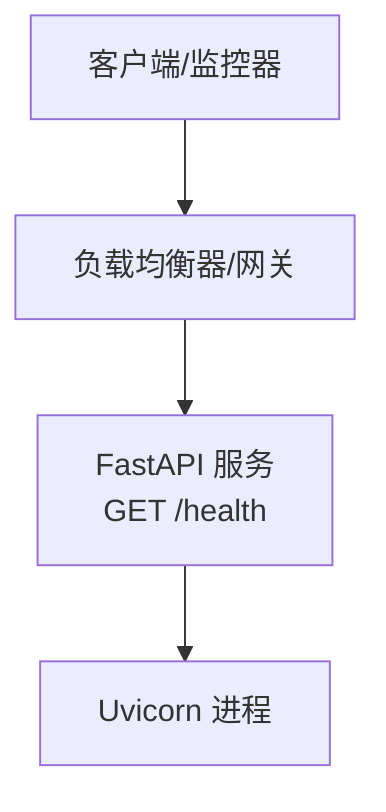
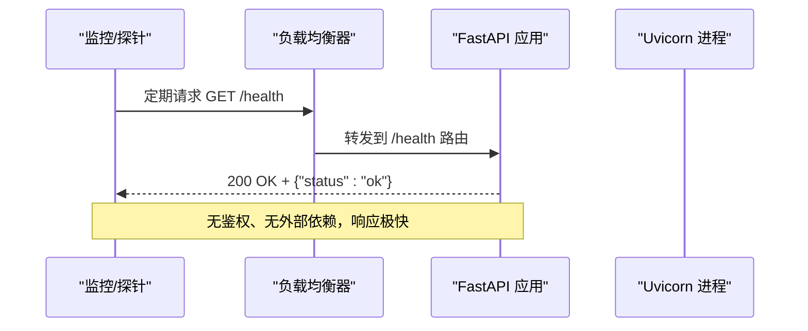

# 健康检查API

<cite>
**本文引用的文件**
- [api.py](file://api.py)
- [README.md](file://README.md)
</cite>

## 目录
1. [简介](#简介)
2. [项目结构](#项目结构)
3. [核心组件](#核心组件)
4. [架构总览](#架构总览)
5. [详细组件分析](#详细组件分析)
6. [依赖关系分析](#依赖关系分析)
7. [性能考虑](#性能考虑)
8. [故障排查指南](#故障排查指南)
9. [结论](#结论)
10. [附录](#附录)

## 简介
本参考文档面向服务运维与平台工程团队，说明项目中提供的健康检查端点 GET /health 的功能、用途与集成方式。该端点用于服务可用性监控与健康状态检查，返回简单的 JSON 对象，包含 status 字段，便于负载均衡器、容器编排系统（如 Kubernetes）以及监控系统进行快速探测。该端点无需认证即可访问，适合在公网或内网暴露给基础设施层调用。

## 项目结构
本项目使用 FastAPI 提供 REST API，健康检查端点定义在服务层模块中；应用通过 uvicorn 启动并监听端口。健康检查端点位于路由层，不依赖业务逻辑，响应体简单且稳定。

图表来源
- [api.py:98-100](file://api.py#L98-L100)
- [api.py:202-203](file://api.py#L202-L203)

章节来源
- [api.py:98-100](file://api.py#L98-L100)
- [api.py:202-203](file://api.py#L202-L203)
- [README.md:50-65](file://README.md#L50-L65)

## 核心组件
- 健康检查端点：GET /health
  - 功能：返回服务是否存活与可响应的基本状态。
  - 响应体：JSON 对象，包含 status 字段，值为 "ok"。
  - 鉴权：无需认证，任何客户端均可访问。
  - 用途：供负载均衡器、Kubernetes Readiness/Liveness Probe、Prometheus 等系统进行健康探测。
- 服务启动：通过 uvicorn 运行 FastAPI 应用，默认监听 0.0.0.0:8000。

章节来源
- [api.py:98-100](file://api.py#L98-L100)
- [api.py:202-203](file://api.py#L202-L203)
- [README.md:50-65](file://README.md#L50-L65)

## 架构总览
健康检查端点作为最轻量的入口，直接由 FastAPI 路由处理，不涉及知识库、向量检索或 LLM 调用，因此具备高可用性与低延迟特性。典型调用路径如下：

图表来源
- [api.py:98-100](file://api.py#L98-L100)
- [api.py:202-203](file://api.py#L202-L203)

## 详细组件分析

### 健康检查端点 GET /health
- 路由与方法：GET /health
- 鉴权策略：未配置 API_AUTH_TOKEN 时所有接口开放；即使配置了 Token，/health 也不受 require_auth 保护，保持无鉴权访问。
- 响应格式：
  - HTTP 状态码：200
  - Content-Type：application/json
  - 响应体示例：{"status": "ok"}
- 行为特征：
  - 无数据库、无网络 I/O、无复杂计算，仅返回固定 JSON。
  - 适合作为 Liveness/Readiness 探针与负载均衡健康检查。

章节来源
- [api.py:31-49](file://api.py#L31-L49)
- [api.py:98-100](file://api.py#L98-L100)

### 服务启动与监听
- 启动命令：uvicorn api:app --host 0.0.0.0 --port 8000
- 监听地址：0.0.0.0:8000，便于容器化与集群部署。
- 与 /health 的关系：/health 由 FastAPI 路由处理，启动后即刻可用。

章节来源
- [api.py:202-203](file://api.py#L202-L203)
- [README.md:50-65](file://README.md#L50-L65)

### 认证与安全边界
- 其他 /v1/* 接口可通过设置环境变量启用 Bearer Token 鉴权。
- /health 不受 require_auth 保护，确保监控与负载均衡器无需携带 Token 即可探测。
- 生产建议：将 /health 暴露给内部网络或网关，避免对外公开敏感信息。

章节来源
- [api.py:31-49](file://api.py#L31-L49)
- [api.py:98-100](file://api.py#L98-L100)

## 依赖关系分析
健康检查端点几乎无外部依赖，仅依赖 FastAPI 路由机制与 Python 标准库的 JSON 序列化。其稳定性与性能不依赖于 RAG 管线、Agent、向量存储或 LLM 客户端。

图表来源
- [api.py:98-100](file://api.py#L98-L100)

章节来源
- [api.py:98-100](file://api.py#L98-L100)

## 性能考虑
- 极低开销：无 I/O、无锁、无模型调用，响应时间通常在毫秒级。
- 高频探测友好：适合秒级甚至亚秒级的健康检查频率。
- 资源占用：CPU 与内存占用极低，不会因频繁探测影响主业务。
- 扩展性：在多副本部署下，每个实例独立响应 /health，负载均衡器可基于结果剔除异常实例。

[本节为通用性能指导，不直接分析具体代码]

## 故障排查指南
- 无法访问 /health
  - 确认服务已启动并监听 8000 端口。
  - 检查防火墙/安全组/网络策略是否放行 8000 端口。
  - 若通过反向代理（Nginx/Kong），确认代理规则正确转发 /health。
- 响应非 200
  - 检查进程是否崩溃或被 OOM Killer 终止。
  - 查看日志定位启动失败或依赖加载错误。
- 监控误报
  - 调整探针超时与重试次数，避免因瞬时抖动导致误判。
  - 结合业务指标（如 /v1/chat 成功率）综合判断服务健康。

[本节为通用故障排查指导，不直接分析具体代码]

## 结论
GET /health 是一个轻量、稳定、无需鉴权的健康检查端点，适用于负载均衡、容器编排与监控系统对服务可用性的探测。由于其极简实现与零外部依赖，具备高可靠性和低延迟特性，是生产环境健康检查的理想选择。

[本节为总结性内容，不直接分析具体代码]

## 附录

### curl 示例
- 基本探测
  - curl http://localhost:8000/health
- 带超时与重试（示例）
  - curl --max-time 5 --retry 3 --retry-delay 1 http://localhost:8000/health

[本节提供使用示例，不直接分析具体代码]

### 常见监控集成方式
- Kubernetes
  - livenessProbe 与 readinessProbe 均指向 GET /health，HTTP 状态码 200 视为健康。
- Prometheus/Grafana
  - 通过 blackbox_exporter 或自定义 exporter 定时探测 /health，记录成功/失败比率与响应时间。
- 负载均衡器
  - Nginx/HAProxy/云厂商 LB：将 /health 作为健康检查路径，剔除返回非 200 的实例。
- CI/CD 与发布流程
  - 在滚动更新前后调用 /health 验证新实例就绪与旧实例下线。

[本节为通用集成指导，不直接分析具体代码]

### 生产环境最佳实践
- 暴露范围：将 /health 暴露给内网或网关，避免公网直连。
- 探针参数：合理设置超时、间隔与阈值，避免过度探测造成抖动。
- 告警联动：当 /health 连续失败达到阈值时触发告警，并结合业务指标做二次确认。
- 多副本与灰度：利用 /health 配合滚动更新与灰度发布，确保流量只进入健康实例。
- 审计与限流：对 /health 开启基础访问日志与速率限制，防止滥用。

[本节为通用最佳实践，不直接分析具体代码]