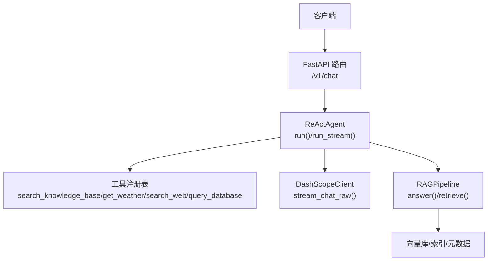
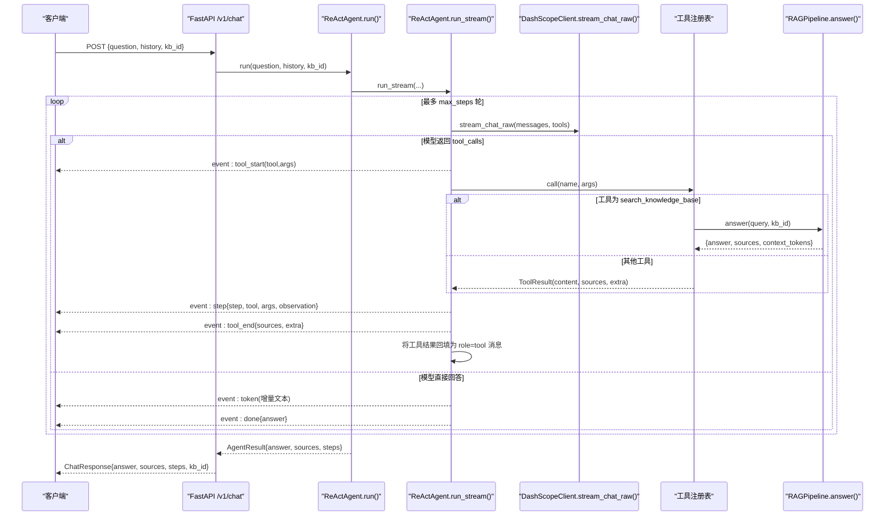
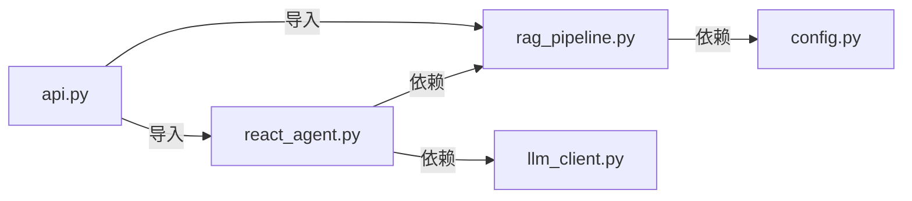

# 对话交互API

<cite>
**本文引用的文件**
- [api.py](file://api.py)
- [react_agent.py](file://react_agent.py)
- [rag_pipeline.py](file://rag_pipeline.py)
- [llm_client.py](file://llm_client.py)
- [config.py](file://config.py)
</cite>

## 目录
1. [简介](#简介)
2. [项目结构](#项目结构)
3. [核心组件](#核心组件)
4. [架构总览](#架构总览)
5. [详细组件分析](#详细组件分析)
6. [依赖关系分析](#依赖关系分析)
7. [性能与扩展性](#性能与扩展性)
8. [故障排查指南](#故障排查指南)
9. [结论](#结论)
10. [附录：接口参考与示例](#附录接口参考与示例)

## 简介
本参考文档面向“对话交互API”的调用方，重点说明 POST /v1/chat 端点的请求/响应模型、字段约束、多轮对话上下文维护方式、Agent 执行步骤在返回体中的表示，以及流式响应的实现建议与错误处理策略。该服务基于 FastAPI 暴露 REST 接口，内部通过 ReAct Agent 与 RAG 管线协同工作，支持知识库检索、天气查询、联网搜索与数据库只读查询等工具能力。

## 项目结构
- API 层：FastAPI 路由定义、鉴权、数据模型校验、异常封装
- Agent 层：ReAct 循环、工具注册表、事件流（tool_start/tool_end/step/token/done/error）
- RAG 层：知识库管理、混合检索（向量+BM25）、问答生成、引用来源组装
- LLM 客户端：统一封装大模型调用、流式输出、联网搜索
- 配置层：集中环境变量配置，控制检索、历史长度、Agent 步数等

图表来源
- [api.py:185-199](file://api.py#L185-L199)
- [react_agent.py:250-370](file://react_agent.py#L250-L370)
- [rag_pipeline.py:590-666](file://rag_pipeline.py#L590-L666)
- [llm_client.py:203-278](file://llm_client.py#L203-L278)

章节来源
- [api.py:1-204](file://api.py#L1-L204)
- [react_agent.py:1-567](file://react_agent.py#L1-L567)
- [rag_pipeline.py:1-792](file://rag_pipeline.py#L1-L792)
- [llm_client.py:1-322](file://llm_client.py#L1-L322)
- [config.py:1-113](file://config.py#L1-L113)

## 核心组件
- ChatRequest/ChatResponse：POST /v1/chat 的请求与响应模型，包含 question/history/kb_id 与 answer/sources/steps/kb_id
- ReActAgent：负责构建消息、选择并调用工具、聚合最终回答与执行轨迹
- RAGPipeline：提供知识库检索、混合召回、问答生成与引用来源构造
- DashScopeClient：封装大模型聊天、流式输出、联网搜索

章节来源
- [api.py:63-76](file://api.py#L63-L76)
- [react_agent.py:69-142](file://react_agent.py#L69-L142)
- [rag_pipeline.py:196-257](file://rag_pipeline.py#L196-L257)
- [llm_client.py:22-127](file://llm_client.py#L22-L127)

## 架构总览
下图展示一次 /v1/chat 请求从进入 FastAPI 到返回结果的完整链路，包括 Agent 的工具调用与 RAG 检索过程。

图表来源
- [api.py:185-199](file://api.py#L185-L199)
- [react_agent.py:250-370](file://react_agent.py#L250-L370)
- [react_agent.py:165-246](file://react_agent.py#L165-L246)
- [rag_pipeline.py:590-666](file://rag_pipeline.py#L590-L666)
- [llm_client.py:203-278](file://llm_client.py#L203-L278)

## 详细组件分析

### 端点：POST /v1/chat
- 功能：接收用户问题与可选的历史上下文，调用 Agent 进行工具调度与 RAG 检索，返回答案、来源与执行步骤。
- 鉴权：若设置环境变量 API_AUTH_TOKEN，则所有 /v1 接口需要 Authorization: Bearer <token>；未设置时放行（仅建议本机/内网调试）。
- 输入模型 ChatRequest
  - question: 字符串，必填，长度限制 1-2000 字符
  - history: 列表，元素为字典，键为 role/content，用于维护最近对话上下文（user/assistant 交替）
  - kb_id: 字符串或空，可选；不传时使用默认知识库
- 输出模型 ChatResponse
  - answer: 字符串，最终回答
  - sources: 列表，每个元素为引用来源信息（含 citation、content、metadata、向量/BM25 分数等）
  - steps: 列表，每个元素为 Agent 执行步骤（含 step、thought_summary、tool、args、observation、cost_estimate）
  - kb_id: 本次使用的知识库 id（可能为空）

章节来源
- [api.py:63-76](file://api.py#L63-L76)
- [api.py:185-199](file://api.py#L185-L199)

### 数据模型详解
- ChatRequest.question
  - 约束：min_length=1, max_length=2000
  - 语义：用户当前问题
- ChatRequest.history
  - 格式：list[dict[str,str]]，典型项 {"role": "user", "content": "..."} 或 {"role": "assistant", "content": "..."}
  - 作用：传递给 Agent 以维持多轮对话上下文；Agent 内部会按 token 预算截断历史
- ChatRequest.kb_id
  - 可选；为空时由 RAG 解析默认知识库
- ChatResponse.answer
  - 最终回答文本
- ChatResponse.sources
  - 来自 RAG 检索片段或工具返回的引用来源；每条包含 citation、content、metadata、vector_score、bm25_score
- ChatResponse.steps
  - Agent 每轮工具调用的轨迹；包含 step 序号、工具名、参数、观察结果、成本估算等

章节来源
- [api.py:63-76](file://api.py#L63-L76)
- [react_agent.py:69-83](file://react_agent.py#L69-L83)
- [rag_pipeline.py:614-627](file://rag_pipeline.py#L614-L627)
- [rag_pipeline.py:775-782](file://rag_pipeline.py#L775-L782)

### 多轮对话与上下文维护
- history 字段要求 user/assistant 交替，便于 Agent 正确理解对话轮次
- Agent 内部使用 truncate_history 按 token 预算保留最近消息，避免长上下文稀释注意力与增加计费
- 建议在客户端维护会话消息列表，每次请求携带最近若干轮（例如最近 10 条），并在收到 assistant 回复后追加至本地历史

章节来源
- [react_agent.py:474-491](file://react_agent.py#L474-L491)
- [rag_pipeline.py:159-178](file://rag_pipeline.py#L159-L178)

### Agent 执行步骤与工具调用（steps 字段）
- 当模型决定调用工具时，Agent 会：
  - 产出 tool_start 事件（前端可显示“正在调用 xxx”）
  - 执行工具并记录 observation（内容上限截断，防止污染上下文）
  - 产出 step 事件（包含 step、tool、args、observation、cost_estimate）
  - 产出 tool_end 事件（附带 sources 与 extra）
- 工具集合：
  - search_knowledge_base：在知识库中检索并返回带引用的答案
  - get_weather：查询城市天气（Open-Meteo）
  - search_web：联网搜索实时信息
  - query_database：对本地 SQLite 执行只读 SQL（SELECT/PRAGMA/EXPLAIN/WITH）

章节来源
- [react_agent.py:165-246](file://react_agent.py#L165-L246)
- [react_agent.py:291-369](file://react_agent.py#L291-L369)

### 流式响应实现建议
- 服务端：
  - 可通过 ReActAgent.run_stream 的事件流（tool_start/tool_end/step/token/done/error）逐步推送给客户端
  - 对于非流式 /v1/chat，仍可在上层封装 SSE/WS 将事件流转换为流式响应
- 客户端：
  - 订阅 token 事件即时渲染答案
  - 根据 tool_start/tool_end 更新状态提示
  - 收集 step 事件用于展示 Agent 执行轨迹
  - 遇到 error 事件及时提示并终止渲染

章节来源
- [react_agent.py:272-370](file://react_agent.py#L272-L370)
- [app.py:303-351](file://app.py#L303-L351)

### 错误处理策略
- 参数校验失败：FastAPI 自动返回 422（Pydantic 校验）
- 业务校验失败：如 question 为空，返回 400
- 知识库不存在：返回 404
- 外部服务异常：统一包装为可读错误消息，返回 500
- 工具执行异常：捕获并回填给模型，允许重试或直接回答

章节来源
- [api.py:42-50](file://api.py#L42-L50)
- [api.py:185-199](file://api.py#L185-L199)
- [react_agent.py:130-142](file://react_agent.py#L130-L142)
- [llm_client.py:297-299](file://llm_client.py#L297-L299)

## 依赖关系分析
- FastAPI 路由依赖 Pydantic 模型校验与 HTTPException
- Agent 依赖 LLM 客户端与 RAG 管线
- RAG 管线依赖向量存储、BM25 索引、文档解析与切分
- 配置集中化，便于部署与环境切换

图表来源
- [api.py:27-29](file://api.py#L27-L29)
- [react_agent.py:27-29](file://react_agent.py#L27-L29)
- [rag_pipeline.py:27-38](file://rag_pipeline.py#L27-L38)
- [config.py:56-113](file://config.py#L56-L113)

章节来源
- [api.py:1-204](file://api.py#L1-L204)
- [react_agent.py:1-567](file://react_agent.py#L1-L567)
- [rag_pipeline.py:1-792](file://rag_pipeline.py#L1-L792)
- [llm_client.py:1-322](file://llm_client.py#L1-L322)
- [config.py:1-113](file://config.py#L1-L113)

## 性能与扩展性
- 历史截断：按 token 预算保留最近消息，降低上下文开销
- 上下文裁剪：RAG 检索片段按 token 预算裁剪，避免超出模型窗口
- 混合检索：向量+BM25 融合，提升召回质量；MMR 重排增强多样性
- 工具观察截断：限制工具返回长度，防止污染上下文
- 并发与锁：服务层使用全局锁串行化读写，避免 SQLite/Chroma 并发问题；生产环境建议引入任务队列与多实例部署

章节来源
- [rag_pipeline.py:159-193](file://rag_pipeline.py#L159-L193)
- [rag_pipeline.py:439-523](file://rag_pipeline.py#L439-L523)
- [react_agent.py:64-67](file://react_agent.py#L64-L67)
- [api.py:31-33](file://api.py#L31-L33)

## 故障排查指南
- 无法访问 /v1/chat：检查是否配置了 API_AUTH_TOKEN 且请求头携带正确的 Bearer Token
- 返回 400：检查 question 是否为空或不符合长度限制
- 返回 404：检查 kb_id 是否存在
- 返回 500：查看错误详情，通常为外部服务异常或工具执行失败
- 无来源 sources：确认知识库已上传并成功入库；检查检索阈值与混合召回配置
- 流式无 token：检查网络与服务端事件流是否正常；确认客户端正确处理事件类型

章节来源
- [api.py:42-50](file://api.py#L42-L50)
- [api.py:185-199](file://api.py#L185-L199)
- [react_agent.py:307-311](file://react_agent.py#L307-L311)
- [llm_client.py:297-299](file://llm_client.py#L297-L299)

## 结论
POST /v1/chat 提供了统一的对话入口，结合 ReAct Agent 与 RAG 管线，既能检索企业知识库，又能调用天气、联网搜索与数据库查询等工具。通过 history 字段维护多轮上下文，通过 steps 字段透明展示 Agent 的执行轨迹，通过 sources 字段提供可追溯的引用来源。生产环境建议启用鉴权、完善流式响应与错误处理，并结合配置优化检索与上下文长度。

## 附录：接口参考与示例

### 请求模型 ChatRequest
- question: 字符串，必填，1-2000 字符
- history: 列表，元素为 {"role": "user"/"assistant", "content": "..."}，用于多轮对话
- kb_id: 字符串或空，可选；不传时使用默认知识库

章节来源
- [api.py:63-70](file://api.py#L63-L70)

### 响应模型 ChatResponse
- answer: 字符串，最终回答
- sources: 列表，引用来源，每项包含 citation、content、metadata、vector_score、bm25_score
- steps: 列表，Agent 执行步骤，每项包含 step、thought_summary、tool、args、observation、cost_estimate
- kb_id: 字符串或空，本次使用的知识库 id

章节来源
- [api.py:72-76](file://api.py#L72-L76)
- [rag_pipeline.py:614-627](file://rag_pipeline.py#L614-L627)
- [react_agent.py:342-359](file://react_agent.py#L342-L359)

### 多轮对话示例（维护上下文）
- 第一轮：发送 question 与空 history
- 第二轮：携带上一轮的 user/assistant 两条消息作为 history
- 后续轮次：持续追加最近若干轮消息，保持 user/assistant 交替

章节来源
- [react_agent.py:474-491](file://react_agent.py#L474-L491)
- [rag_pipeline.py:159-178](file://rag_pipeline.py#L159-L178)

### 流式响应建议
- 服务端：基于 ReActAgent.run_stream 的事件流，逐步推送 token/step/tool_start/tool_end/done/error
- 客户端：监听事件类型，实时更新答案与执行轨迹；遇到 error 停止渲染并提示

章节来源
- [react_agent.py:272-370](file://react_agent.py#L272-L370)
- [app.py:303-351](file://app.py#L303-L351)

### curl 命令示例
- 基本请求（未启用鉴权）：
  - curl -X POST http://localhost:8000/v1/chat -H "Content-Type: application/json" -d '{"question":"...","history":[],"kb_id":null}'
- 启用鉴权：
  - curl -X POST http://localhost:8000/v1/chat -H "Content-Type: application/json" -H "Authorization: Bearer YOUR_TOKEN" -d '{"question":"...","history":[],"kb_id":"your_kb_id"}'

章节来源
- [api.py:31-50](file://api.py#L31-L50)
- [api.py:185-199](file://api.py#L185-L199)

### Python 客户端示例
- 同步请求：
  - 使用 requests.post 调用 /v1/chat，解析 response.json() 获取 answer/sources/steps/kb_id
- 流式请求（建议）：
  - 使用 server-sent-events 或 WebSocket 接收事件流，处理 token/step/tool_start/tool_end/done/error

章节来源
- [api.py:185-199](file://api.py#L185-L199)
- [react_agent.py:272-370](file://react_agent.py#L272-L370)