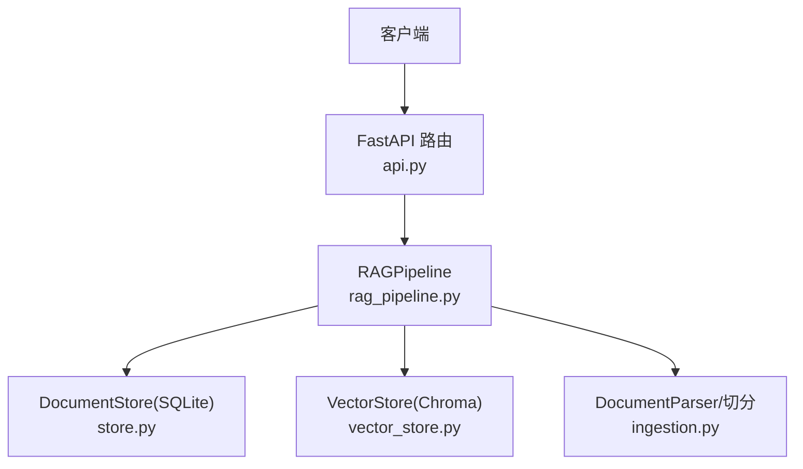
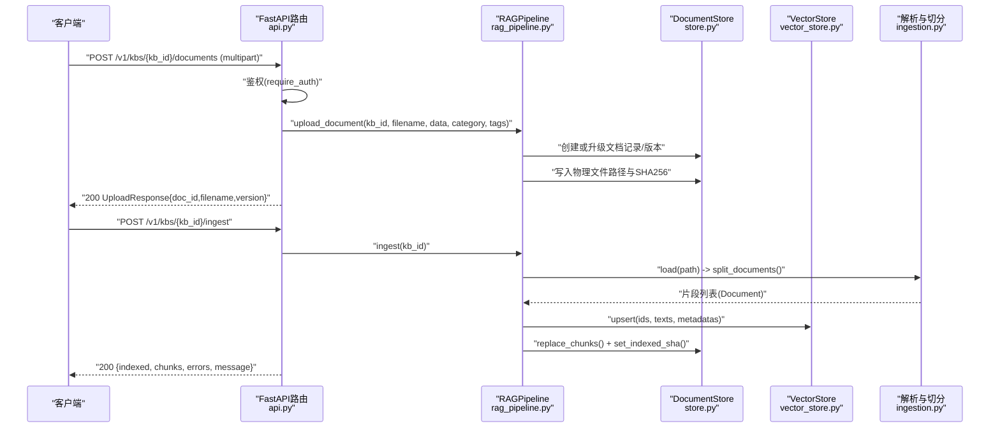
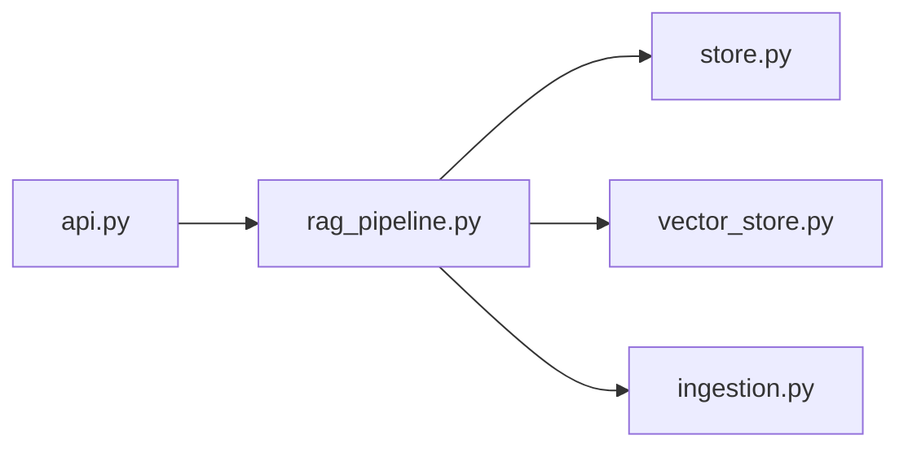

# 文档操作API

<cite>
**本文引用的文件**
- [api.py](file://api.py)
- [rag_pipeline.py](file://rag_pipeline.py)
- [store.py](file://store.py)
- [ingestion.py](file://ingestion.py)
- [vector_store.py](file://vector_store.py)
</cite>

## 目录
1. [简介](#简介)
2. [项目结构](#项目结构)
3. [核心组件](#核心组件)
4. [架构总览](#架构总览)
5. [详细接口说明](#详细接口说明)
6. [依赖关系分析](#依赖关系分析)
7. [性能与并发特性](#性能与并发特性)
8. [故障排查指南](#故障排查指南)
9. [结论](#结论)
10. [附录：请求/响应示例](#附录请求响应示例)

## 简介
本参考文档聚焦“文档操作”相关REST API，覆盖以下端点：
- POST /v1/kbs/{kb_id}/documents（上传文档）
- POST /v1/kbs/{kb_id}/ingest（执行入库）
- GET /v1/kbs/{kb_id}/documents（列出文档）
- DELETE /v1/documents/{doc_id}（删除文档）
- GET /v1/kbs/{kb_id}/stats（获取统计信息）

同时说明：
- multipart表单上传格式与字段
- 支持的文档类型（txt/docx/pdf/md）
- category与tags参数的使用方法
- 文档版本控制机制与入库流程
- UploadResponse模型定义
- 错误处理与异常场景

## 项目结构
该服务基于FastAPI暴露REST接口，核心逻辑由RAGPipeline编排，持久化使用SQLite（store.py），向量存储使用Chroma（vector_store.py），文档解析与切分在ingestion.py中实现。

**图表来源**
- [api.py:126-182](file://api.py#L126-L182)
- [rag_pipeline.py:196-256](file://rag_pipeline.py#L196-L256)
- [store.py:123-182](file://store.py#L123-L182)
- [vector_store.py:38-148](file://vector_store.py#L38-L148)
- [ingestion.py:24-39](file://ingestion.py#L24-L39)

**章节来源**
- [api.py:1-58](file://api.py#L1-L58)

## 核心组件
- FastAPI路由层：负责鉴权、参数校验、调用RAGPipeline并返回统一JSON。
- RAGPipeline：封装知识库管理、文档上传、增量入库、检索与问答。
- DocumentStore：SQLite元数据与片段存储，支持多知识库、文档分类/标签、文件版本、软删除等。
- VectorStore：Chroma向量库封装，提供批量upsert、查询、删除、计数等。
- DocumentParser与切分：按后缀加载PDF/DOCX/MD/TXT，自动质量判断与OCR回退，递归字符切分生成片段。

**章节来源**
- [api.py:126-182](file://api.py#L126-L182)
- [rag_pipeline.py:196-435](file://rag_pipeline.py#L196-L435)
- [store.py:123-470](file://store.py#L123-L470)
- [vector_store.py:38-148](file://vector_store.py#L38-L148)
- [ingestion.py:24-39](file://ingestion.py#L24-L39)

## 架构总览
下图展示了从HTTP请求到入库完成的端到端流程，包括鉴权、上传、解析、切分、向量化与索引更新。

**图表来源**
- [api.py:126-160](file://api.py#L126-L160)
- [rag_pipeline.py:260-435](file://rag_pipeline.py#L260-L435)
- [store.py:214-354](file://store.py#L214-L354)
- [vector_store.py:61-86](file://vector_store.py#L61-L86)
- [ingestion.py:24-39](file://ingestion.py#L24-L39)

## 详细接口说明

### 通用鉴权
- 若环境变量未设置API认证令牌，则所有/v1接口开放访问；否则需携带Authorization: Bearer <token>。
- 鉴权失败将返回401。

**章节来源**
- [api.py:31-49](file://api.py#L31-L49)

### 1) 上传文档
- 方法：POST
- 路径：/v1/kbs/{kb_id}/documents
- 内容类型：multipart/form-data
- 表单字段：
  - file：二进制文件（必填）
  - category：字符串（可选，默认空串）
  - tags：字符串（可选，默认空串）
- 支持的文件类型：.txt、.docx、.pdf、.md（大小写不敏感）
- 成功响应：200 UploadResponse
- 错误：
  - 400：不支持的文件类型或参数校验失败
  - 404：知识库不存在
  - 401：鉴权失败（如启用）

UploadResponse模型定义
- doc_id：字符串，文档唯一标识
- filename：字符串，文件名
- version：整数，最新版本号

版本控制机制
- 同名文件重传会递增latest_version，旧版本物理文件保留，便于审计与恢复。
- 每次上传都会记录版本哈希与大小，用于后续增量入库判断。

category与tags
- 作为文档元数据持久化，并在切片时写入片段metadata，便于检索过滤与引用展示。

**章节来源**
- [api.py:126-150](file://api.py#L126-L150)
- [rag_pipeline.py:260-288](file://rag_pipeline.py#L260-L288)
- [store.py:214-274](file://store.py#L214-L274)
- [ingestion.py:17-17](file://ingestion.py#L17-L17)

### 2) 执行入库
- 方法：POST
- 路径：/v1/kbs/{kb_id}/ingest
- 功能：对知识库内待处理的文档进行解析、切分、向量化与索引更新；支持增量与全量重建。
- 成功响应：200 JSON对象，包含：
  - indexed：已入库的文件名列表
  - chunks：本次新增的片段总数
  - errors：失败条目（含错误摘要）
  - force_reindex：是否因配置变化触发全量重建
  - missing：缺失的物理文件列表（如有）
  - message：人类可读消息
- 错误：
  - 500：入库过程中发生错误（error字段非空时抛出）
  - 404：知识库不存在

入库流程要点
- 增量判定：比较当前文件SHA-256与已记录的indexed_sha；任一不同即重新入库。
- 配置变更：当切分参数、嵌入模型或解析器版本变化时，强制全量重建。
- 原子性：先upsert新向量，再清理旧片段ID；失败不影响已写入部分，下次重试可完成。
- 片段持久化：replace_chunks整体替换某文档的片段，保证与向量库一致。

**章节来源**
- [api.py:153-160](file://api.py#L153-L160)
- [rag_pipeline.py:306-435](file://rag_pipeline.py#L306-L435)
- [store.py:337-354](file://store.py#L337-L354)
- [vector_store.py:61-86](file://vector_store.py#L61-L86)

### 3) 列出文档
- 方法：GET
- 路径：/v1/kbs/{kb_id}/documents
- 返回：当前知识库下所有活跃文档的列表（每个元素包含name、chunks、version、category、tags、doc_id等）
- 错误：
  - 404：知识库不存在

**章节来源**
- [api.py:163-167](file://api.py#L163-L167)
- [rag_pipeline.py:704-718](file://rag_pipeline.py#L704-L718)

### 4) 删除文档
- 方法：DELETE
- 路径：/v1/documents/{doc_id}
- 行为：软删除文档主记录，清空其片段记录；向量库中按doc_id删除对应向量；物理文件与版本历史保留。
- 成功响应：200 {"deleted": doc_id}
- 错误：
  - 404：文档不存在

**章节来源**
- [api.py:177-182](file://api.py#L177-L182)
- [rag_pipeline.py:290-299](file://rag_pipeline.py#L290-L299)
- [store.py:322-335](file://store.py#L322-L335)

### 5) 获取统计信息
- 方法：GET
- 路径：/v1/kbs/{kb_id}/stats
- 返回：包含kb_id、documents数量、chunks总数、vector_count（向量集合条目数）
- 错误：
  - 404：知识库不存在

**章节来源**
- [api.py:170-174](file://api.py#L170-L174)
- [rag_pipeline.py:249-256](file://rag_pipeline.py#L249-L256)

## 依赖关系分析
- api.py通过RAGPipeline协调各子系统，避免直接耦合底层存储。
- store.py提供事务安全与并发锁保护，确保SQLite读写一致性。
- vector_store.py以Chroma为后端，提供批量upsert与条件删除，保障向量与片段的一致性。
- ingestion.py负责多格式解析与智能回退（PDF文本质量阈值与本地OCR）。

**图表来源**
- [api.py:126-182](file://api.py#L126-L182)
- [rag_pipeline.py:196-435](file://rag_pipeline.py#L196-L435)
- [store.py:123-470](file://store.py#L123-L470)
- [vector_store.py:38-148](file://vector_store.py#L38-L148)
- [ingestion.py:24-39](file://ingestion.py#L24-L39)

**章节来源**
- [api.py:126-182](file://api.py#L126-L182)
- [rag_pipeline.py:196-435](file://rag_pipeline.py#L196-L435)

## 性能与并发特性
- 全局串行锁：为避免SQLite与Chroma并发问题，API层使用线程锁串行化读写。适合单机演示环境。
- 向量批量处理：VectorStore按批次embedding与upsert，降低外部调用开销。
- 增量入库：仅处理内容变化的文档，减少重复计算。
- PDF智能回退：文本质量低于阈值时自动切换本地OCR，提升扫描版PDF可用性。

[本节为通用指导，不直接分析具体文件]

## 故障排查指南
常见错误与定位建议：
- 401 鉴权失败：检查Authorization头是否正确，确认API_AUTH_TOKEN是否配置。
- 400 不支持的文件类型：确认上传文件后缀为.txt/.docx/.pdf/.md之一。
- 404 知识库/文档不存在：确认kb_id或doc_id有效。
- 500 入库失败：查看返回的errors字段，定位具体文件解析或向量化失败原因；必要时检查PDF OCR依赖是否安装。
- 向量与片段不一致：可通过list documents与stats对比chunks与vector_count；必要时重新执行ingest。

**章节来源**
- [api.py:42-49](file://api.py#L42-L49)
- [api.py:126-182](file://api.py#L126-L182)
- [rag_pipeline.py:306-435](file://rag_pipeline.py#L306-L435)
- [ingestion.py:40-78](file://ingestion.py#L40-L78)

## 结论
本API提供了完整的文档生命周期管理能力：上传、入库、查询、删除与统计。通过版本控制与增量入库机制，既保证了数据可追溯性，又提升了处理效率。结合PDF智能回退与向量/片段一致性策略，系统在生产环境中具备较强的鲁棒性与可维护性。

[本节为总结性内容，不直接分析具体文件]

## 附录：请求/响应示例

- 上传文档（multipart/form-data）
  - 字段：file（二进制）、category（可选字符串）、tags（可选字符串）
  - 成功响应：{"doc_id":"...","filename":"...","version":1}
  - 失败：400/404/401

- 执行入库
  - 成功响应：{"indexed":["..."],"chunks":N,"errors":[],"force_reindex":false,"missing":[],"message":"..."}
  - 失败：500（error非空时抛出）

- 列出文档
  - 成功响应：[{name:"...",chunks:N,version:M,category:"...",tags:"...",doc_id:"..."},...]

- 删除文档
  - 成功响应：{"deleted":"..."}
  - 失败：404

- 统计信息
  - 成功响应：{"kb_id":"...","documents":N,"chunks":M,"vector_count":K}

[本节为概念性示例，不直接映射到具体代码行]