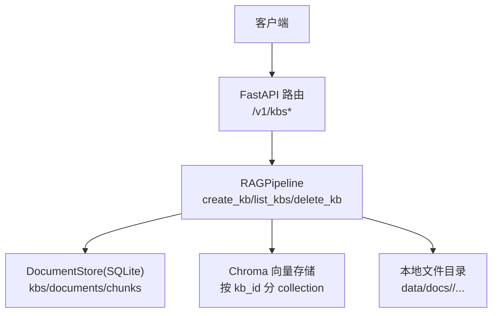
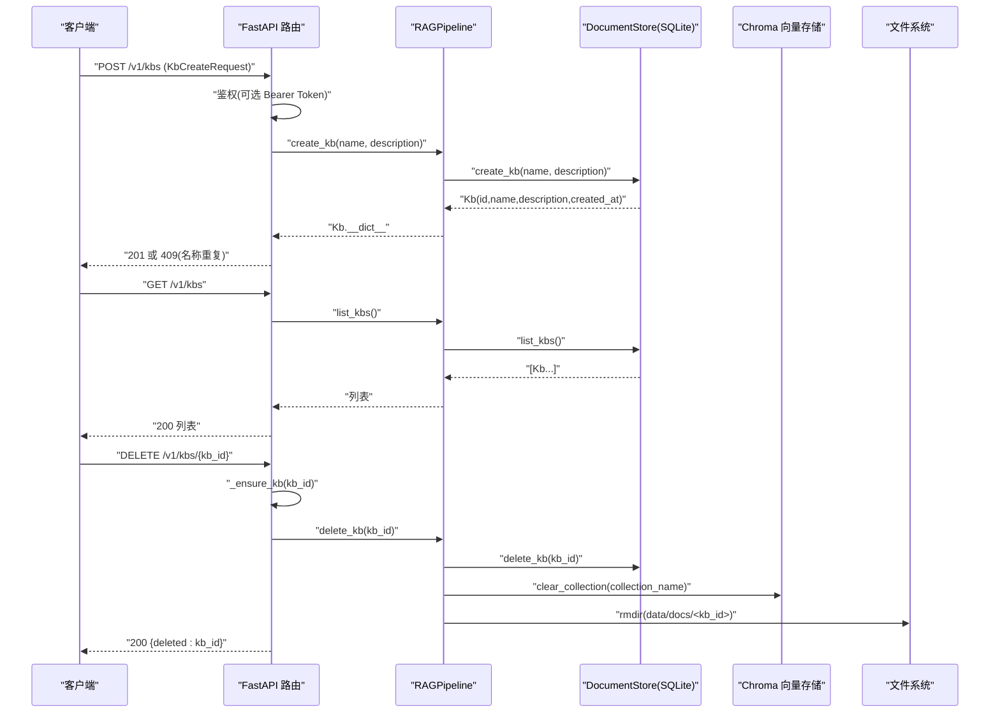

# 知识库管理API

<cite>
**本文引用的文件**
- [api.py](file://api.py)
- [store.py](file://store.py)
- [rag_pipeline.py](file://rag_pipeline.py)
- [README.md](file://README.md)
</cite>

## 目录
1. [简介](#简介)
2. [项目结构](#项目结构)
3. [核心组件](#核心组件)
4. [架构总览](#架构总览)
5. [端点详细参考](#端点详细参考)
6. [依赖关系分析](#依赖关系分析)
7. [性能与并发特性](#性能与并发特性)
8. [故障排查指南](#故障排查指南)
9. [结论](#结论)
10. [附录：请求/响应示例与集成示例](#附录请求响应示例与集成示例)

## 简介
本参考文档聚焦于知识库管理相关的 REST API，覆盖以下三个端点：
- GET /v1/kbs：列出所有知识库
- POST /v1/kbs：创建新知识库
- DELETE /v1/kbs/{kb_id}：删除指定知识库

文档包含每个端点的 HTTP 方法、URL 模式、请求参数、响应格式、状态码说明；提供 KbCreateRequest 模型定义及字段约束；给出成功与错误的 JSON 示例；说明知识库 ID 的生成规则与命名规范；并提供 curl 与 Postman 集成示例，帮助开发者快速接入。

## 项目结构
知识库管理 API 由 FastAPI 服务层暴露，调用 RAGPipeline 进行业务编排，最终通过 DocumentStore（SQLite）持久化元数据，并清理向量存储与物理文件目录。



图表来源
- [api.py:103-123](file://api.py#L103-L123)
- [rag_pipeline.py:221-247](file://rag_pipeline.py#L221-L247)
- [store.py:158-210](file://store.py#L158-L210)

章节来源
- [api.py:1-204](file://api.py#L1-L204)
- [rag_pipeline.py:221-247](file://rag_pipeline.py#L221-L247)
- [store.py:158-210](file://store.py#L158-L210)

## 核心组件
- FastAPI 路由与鉴权：在 api.py 中定义 /v1/kbs* 路由，统一使用 Bearer Token 鉴权（可选）。
- 数据模型：KbCreateRequest 用于创建知识库的请求体校验。
- 业务编排：RAGPipeline 封装 create_kb/list_kbs/delete_kb 等能力。
- 持久化：DocumentStore 基于 SQLite 维护 kbs 表，支持唯一性约束与级联删除。
- 资源清理：删除知识库时同步清理向量集合与物理文件目录。

章节来源
- [api.py:79-123](file://api.py#L79-L123)
- [rag_pipeline.py:221-247](file://rag_pipeline.py#L221-L247)
- [store.py:158-210](file://store.py#L158-L210)

## 架构总览
下图展示了从请求到响应的完整调用链，包括鉴权、路由处理、业务逻辑与存储层交互。



图表来源
- [api.py:103-123](file://api.py#L103-L123)
- [rag_pipeline.py:221-247](file://rag_pipeline.py#L221-L247)
- [store.py:158-210](file://store.py#L158-L210)

## 端点详细参考

### 列出所有知识库
- 方法：GET
- URL：/v1/kbs
- 鉴权：若配置了 API_AUTH_TOKEN，需携带 Authorization: Bearer <token>
- 请求参数：无
- 响应体：数组，元素为知识库对象（包含 id、name、description、created_at）
- 状态码：
  - 200：成功返回知识库列表
  - 401：未配置或未提供有效 Token（当启用鉴权时）

章节来源
- [api.py:103-106](file://api.py#L103-L106)
- [store.py:176-182](file://store.py#L176-L182)

### 创建新知识库
- 方法：POST
- URL：/v1/kbs
- 请求体：KbCreateRequest
  - name：字符串，必填，长度 1..100
  - description：字符串，可选，默认空串
- 响应体：知识库对象（id、name、description、created_at）
- 状态码：
  - 201：创建成功
  - 400：请求体验证失败（如 name 为空或超长）
  - 409：名称重复（同一名称已存在）
  - 401：未配置或未提供有效 Token（当启用鉴权时）

章节来源
- [api.py:79-115](file://api.py#L79-L115)
- [store.py:158-174](file://store.py#L158-L174)

### 删除知识库
- 方法：DELETE
- URL：/v1/kbs/{kb_id}
- 路径参数：
  - kb_id：字符串，知识库唯一标识
- 响应体：{ "deleted": "<kb_id>" }
- 状态码：
  - 200：删除成功
  - 404：知识库不存在
  - 401：未配置或未提供有效 Token（当启用鉴权时）

章节来源
- [api.py:118-123](file://api.py#L118-L123)
- [rag_pipeline.py:239-247](file://rag_pipeline.py#L239-L247)
- [store.py:200-210](file://store.py#L200-L210)

## 依赖关系分析
- 路由层依赖 RAGPipeline 提供的知识库管理能力。
- RAGPipeline 依赖 DocumentStore 完成元数据的增删改查。
- 删除操作会联动清理 Chroma 向量集合与本地文件目录，保证一致性。
- 鉴权中间件在路由层统一生效，未设置 API_AUTH_TOKEN 时放行。

```mermaid
classDiagram
class ApiRouter {
+GET "/v1/kbs"
+POST "/v1/kbs"
+DELETE "/v1/kbs/{kb_id}"
}
class RAGPipeline {
+create_kb(name, description)
+list_kbs()
+delete_kb(kb_id)
}
class DocumentStore {
+create_kb(name, description)
+list_kbs()
+delete_kb(kb_id)
}
ApiRouter --> RAGPipeline : "调用"
RAGPipeline --> DocumentStore : "持久化"
```

图表来源
- [api.py:103-123](file://api.py#L103-L123)
- [rag_pipeline.py:221-247](file://rag_pipeline.py#L221-L247)
- [store.py:158-210](file://store.py#L158-L210)

章节来源
- [api.py:103-123](file://api.py#L103-L123)
- [rag_pipeline.py:221-247](file://rag_pipeline.py#L221-L247)
- [store.py:158-210](file://store.py#L158-L210)

## 性能与并发特性
- 服务层使用线程锁串行化读写，避免 SQLite/Chroma 并发访问问题。
- 删除操作会同时清理向量集合与物理文件目录，可能涉及 I/O，建议在高并发场景下控制批量删除频率。
- 列表接口仅读取元数据，性能开销较低。

章节来源
- [api.py:32-33](file://api.py#L32-L33)
- [rag_pipeline.py:239-247](file://rag_pipeline.py#L239-L247)

## 故障排查指南
- 401 未授权：检查是否设置了环境变量 API_AUTH_TOKEN，并在请求头中正确传递 Authorization: Bearer <token>。
- 409 冲突：创建知识库时 name 重复，请更换名称或先删除同名知识库。
- 404 不存在：删除或后续操作使用的 kb_id 无效，请先通过 GET /v1/kbs 确认存在。
- 5xx 错误：若出现底层异常，查看服务端日志；删除操作可能因权限或路径问题导致 I/O 失败。

章节来源
- [api.py:42-49](file://api.py#L42-L49)
- [api.py:114-115](file://api.py#L114-L115)
- [api.py:118-123](file://api.py#L118-L123)

## 结论
知识库管理 API 提供了简洁的 REST 接口来管理多知识库生命周期，结合 SQLite 与向量存储实现元数据与检索资源的统一管理。通过可选的 Bearer Token 鉴权保障基本安全，适合内网或受控环境部署。

## 附录：请求/响应示例与集成示例

### 模型定义：KbCreateRequest
- name：字符串，必填，最小长度 1，最大长度 100
- description：字符串，可选，默认空串

章节来源
- [api.py:79-82](file://api.py#L79-L82)

### 知识库 ID 生成规则与命名规范
- 生成规则：默认使用 UUID v4 的十六进制字符串作为 kb_id；系统内置默认知识库使用固定 id "default" 以兼容旧数据。
- 命名规范：name 字段需满足长度限制且唯一；description 可为空。

章节来源
- [store.py:84-85](file://store.py#L84-L85)
- [store.py:158-174](file://store.py#L158-L174)
- [rag_pipeline.py:232-237](file://rag_pipeline.py#L232-L237)

### 端点示例

#### 列出所有知识库
- 方法：GET
- URL：/v1/kbs
- 成功响应（200）：
  - 示例：[{"id":"<uuid>","name":"产品手册","description":"产品相关文档","created_at":"<ISO时间>"}]
- 鉴权失败（401，当启用鉴权时）：
  - 示例：{"detail":"无效或缺失的 API Token"}

章节来源
- [api.py:103-106](file://api.py#L103-L106)
- [store.py:176-182](file://store.py#L176-L182)

#### 创建新知识库
- 方法：POST
- URL：/v1/kbs
- 请求体示例：
  - {"name":"技术文档","description":"内部技术规范"}
- 成功响应（201）：
  - 示例：{"id":"<uuid>","name":"技术文档","description":"内部技术规范","created_at":"<ISO时间>"}
- 冲突（409）：
  - 示例：{"detail":"知识库「技术文档」已存在"}
- 验证失败（400）：
  - 示例：{"detail":"<Pydantic 校验错误信息>"}

章节来源
- [api.py:109-115](file://api.py#L109-L115)
- [store.py:158-174](file://store.py#L158-L174)

#### 删除知识库
- 方法：DELETE
- URL：/v1/kbs/{kb_id}
- 成功响应（200）：
  - 示例：{"deleted":"<kb_id>"}
- 不存在（404）：
  - 示例：{"detail":"知识库不存在：<kb_id>"}

章节来源
- [api.py:118-123](file://api.py#L118-L123)

### curl 示例
- 列出知识库
  - curl -X GET http://localhost:8000/v1/kbs
- 创建知识库
  - curl -X POST http://localhost:8000/v1/kbs -H "Content-Type: application/json" -d '{"name":"技术文档","description":"内部技术规范"}'
- 删除知识库
  - curl -X DELETE http://localhost:8000/v1/kbs/{kb_id}

章节来源
- [README.md:50-65](file://README.md#L50-L65)

### Postman 集成提示
- 新建 Collection，添加 Base URL 为 http://localhost:8000
- 在 Headers 中添加：
  - Content-Type: application/json
  - Authorization: Bearer <your_token>（若启用鉴权）
- 分别创建 GET /v1/kbs、POST /v1/kbs、DELETE /v1/kbs/{kb_id} 请求，按上述示例填写 Body 与 Path Params。

章节来源
- [api.py:42-49](file://api.py#L42-L49)
- [README.md:50-65](file://README.md#L50-L65)