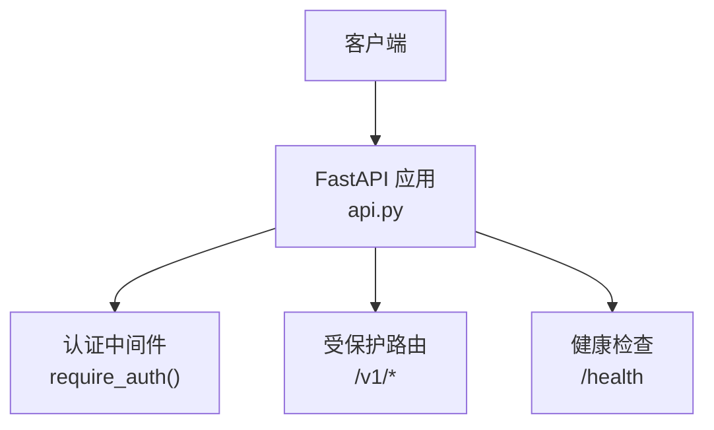
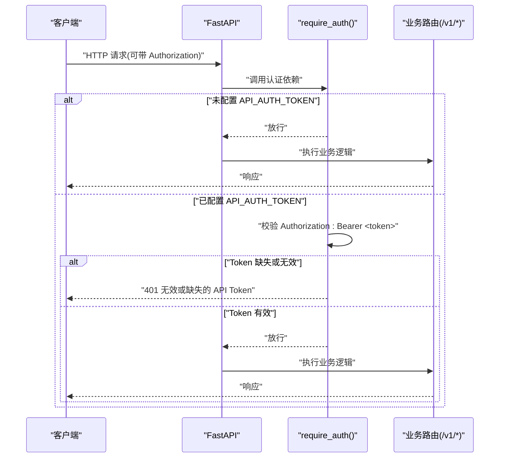
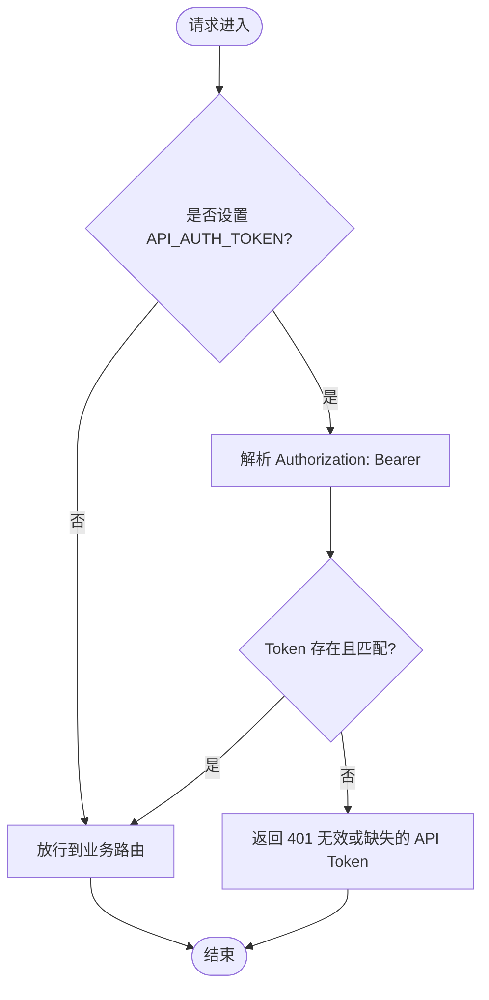
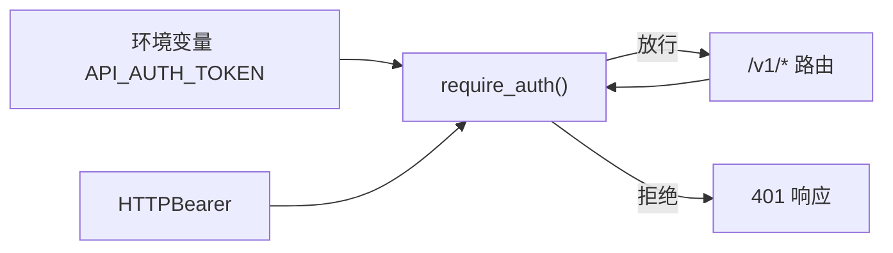

# 认证机制

<cite>
**本文引用的文件**
- [api.py](file://api.py)
- [README.md](file://README.md)
</cite>

## 目录
1. [简介](#简介)
2. [项目结构](#项目结构)
3. [核心组件](#核心组件)
4. [架构总览](#架构总览)
5. [详细组件分析](#详细组件分析)
6. [依赖关系分析](#依赖关系分析)
7. [性能与安全考量](#性能与安全考量)
8. [故障排查指南](#故障排查指南)
9. [结论](#结论)
10. [附录：使用示例](#附录使用示例)

## 简介
本文件说明本项目的 API 认证机制，聚焦 Bearer Token 鉴权的工作原理、环境变量配置、请求头格式、认证流程、错误处理与常见失败原因，以及安全最佳实践。该机制通过 FastAPI 的 HTTPBearer 实现，所有 /v1 接口在启用后均需携带有效的 Bearer Token；未设置时服务开放访问（仅建议本机/内网调试）。

## 项目结构
与认证直接相关的代码集中在 FastAPI 服务层模块中，通过依赖注入在每个路由上执行认证检查。

图表来源
- [api.py:34-50](file://api.py#L34-L50)
- [api.py:98-199](file://api.py#L98-L199)

章节来源
- [api.py:1-204](file://api.py#L1-L204)
- [README.md:50-65](file://README.md#L50-L65)

## 核心组件
- 环境变量与令牌读取：从环境变量读取并清理 API_AUTH_TOKEN。
- 认证器：基于 FastAPI 的 HTTPBearer，自动解析 Authorization 头。
- 依赖函数：require_auth，根据是否配置了 API_AUTH_TOKEN 决定是否校验 Token。
- 路由保护：所有 /v1 路由通过 dependencies=[Depends(require_auth)] 强制认证。
- 健康检查：/health 不要求认证，用于存活探测。

章节来源
- [api.py:31-50](file://api.py#L31-L50)
- [api.py:98-199](file://api.py#L98-L199)

## 架构总览
下图展示了认证在请求生命周期中的位置：客户端请求进入 FastAPI 后，先经过 require_auth 依赖，再进入具体业务路由。

图表来源
- [api.py:31-50](file://api.py#L31-L50)
- [api.py:98-199](file://api.py#L98-L199)

## 详细组件分析

### 环境变量与令牌加载
- 变量名：API_AUTH_TOKEN
- 行为：若为空或未设置，则跳过鉴权；否则必须提供匹配的 Bearer Token。
- 建议：生产环境务必设置；开发/调试阶段可留空以便快速验证。

章节来源
- [api.py:31-32](file://api.py#L31-L32)

### 认证依赖 require_auth
- 功能：解析 Authorization 头中的 Bearer Token，并与 API_AUTH_TOKEN 比较。
- 策略：
  - 未设置 API_AUTH_TOKEN：直接放行。
  - 已设置但缺少或 Token 不匹配：返回 401。
- 适用面：所有声明了 dependencies=[Depends(require_auth)] 的路由。

章节来源
- [api.py:39-50](file://api.py#L39-L50)

### 受保护路由清单
以下 /v1 路由均受认证保护：
- GET /v1/kbs
- POST /v1/kbs
- DELETE /v1/kbs/{kb_id}
- POST /v1/kbs/{kb_id}/documents
- POST /v1/kbs/{kb_id}/ingest
- GET /v1/kbs/{kb_id}/documents
- GET /v1/kbs/{kb_id}/stats
- DELETE /v1/documents/{doc_id}
- POST /v1/chat

注意：/health 不受认证保护，用于健康检查。

章节来源
- [api.py:98-199](file://api.py#L98-L199)

### 认证流程图

图表来源
- [api.py:31-50](file://api.py#L31-L50)

## 依赖关系分析
- FastAPI 依赖：HTTPBearer 负责解析 Authorization 头；Depends 将认证逻辑注入到路由。
- 环境变量：API_AUTH_TOKEN 控制鉴权开关与期望值。
- 路由耦合：所有 /v1 路由强耦合 require_auth，确保统一鉴权策略。

图表来源
- [api.py:31-50](file://api.py#L31-L50)
- [api.py:98-199](file://api.py#L98-L199)

章节来源
- [api.py:31-50](file://api.py#L31-L50)
- [api.py:98-199](file://api.py#L98-L199)

## 性能与安全考量
- 性能
  - 认证为轻量级字符串比较，开销极低。
  - 未配置 API_AUTH_TOKEN 时直接放行，避免额外判断。
- 安全
  - 生产环境必须设置 API_AUTH_TOKEN，并在可信网络内暴露服务。
  - 传输层建议使用 HTTPS（反向代理/TLS 终止），避免 Token 明文传输。
  - Token 管理：定期轮换、最小权限原则、集中存储于密钥管理服务。
  - 日志脱敏：确保不记录完整 Token 或敏感头部。
  - 限制暴露面：仅对外暴露必要端口与路径，健康检查可独立白名单。

[本节为通用指导，不直接分析具体文件]

## 故障排查指南
- 401 无效或缺失的 API Token
  - 可能原因：
    - 未设置 Authorization 头。
    - Authorization 头格式不正确（应为 Authorization: Bearer <token>）。
    - Token 与服务器端 API_AUTH_TOKEN 不一致。
  - 解决步骤：
    - 确认已设置环境变量 API_AUTH_TOKEN。
    - 检查请求头是否正确包含 Authorization: Bearer <token>。
    - 核对客户端使用的 Token 与服务端一致。
- 其他相关错误
  - 404：知识库或文档不存在（业务层面）。
  - 400：请求体参数非法（如 question 为空）。
  - 500：服务端异常（如 LLM 调用失败）。

章节来源
- [api.py:42-50](file://api.py#L42-L50)
- [api.py:185-199](file://api.py#L185-L199)

## 结论
本项目采用基于环境变量的 Bearer Token 鉴权方案，简单可靠、易于部署。未设置 API_AUTH_TOKEN 时便于本地调试；生产环境开启后可对所有 /v1 接口进行统一鉴权。配合 HTTPS、Token 轮换与最小权限策略，可满足企业内网场景的安全需求。后续可在阶段 B 引入更完善的 RBAC 与审计能力。

[本节为总结性内容，不直接分析具体文件]

## 附录：使用示例
- 环境变量配置
  - 设置 API_AUTH_TOKEN 后再启动服务。
- curl 示例
  - 问答接口：携带 Authorization: Bearer $API_AUTH_TOKEN 与 JSON 请求体。
  - 上传与入库：按 README 提供的命令示例执行。
- Python requests 示例
  - 在请求头中添加 Authorization: Bearer <token>，发送 JSON 数据至 /v1/chat。

章节来源
- [README.md:50-65](file://README.md#L50-L65)