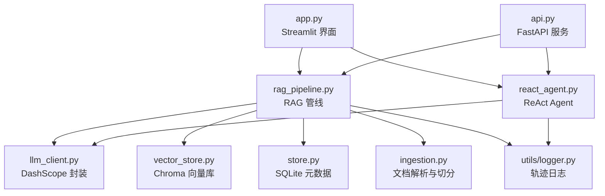
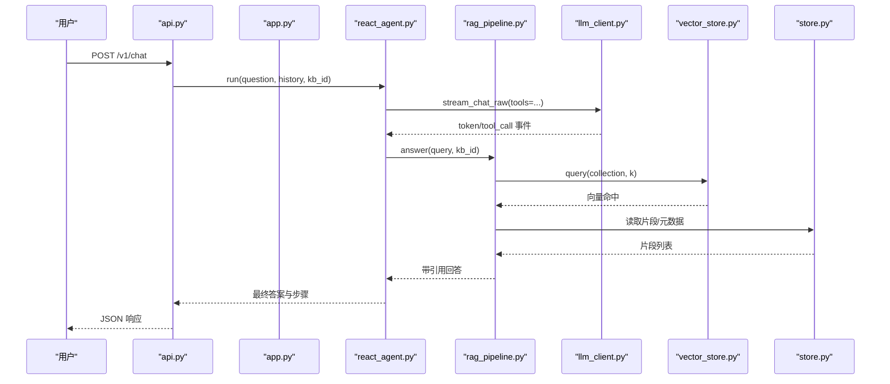
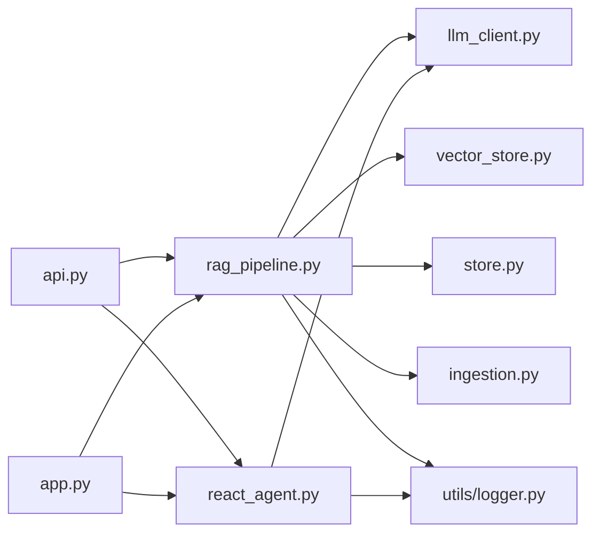

# 代码规范与最佳实践

<cite>
**本文引用的文件**
- [pyproject.toml](file://pyproject.toml)
- [config.py](file://config.py)
- [utils/logger.py](file://utils/logger.py)
- [api.py](file://api.py)
- [app.py](file://app.py)
- [rag_pipeline.py](file://rag_pipeline.py)
- [react_agent.py](file://react_agent.py)
- [store.py](file://store.py)
- [llm_client.py](file://llm_client.py)
- [vector_store.py](file://vector_store.py)
- [ingestion.py](file://ingestion.py)
- [requirements.txt](file://requirements.txt)
- [tests/conftest.py](file://tests/conftest.py)
- [README.md](file://README.md)
</cite>

## 目录
1. [引言](#引言)
2. [项目结构](#项目结构)
3. [核心组件](#核心组件)
4. [架构总览](#架构总览)
5. [详细组件分析](#详细组件分析)
6. [依赖关系分析](#依赖关系分析)
7. [性能考量](#性能考量)
8. [故障排查指南](#故障排查指南)
9. [结论](#结论)
10. [附录](#附录)

## 引言
本指南基于当前仓库实现，沉淀模块划分、接口设计、错误处理、命名规范、质量工具（ruff、mypy）、日志规范、代码审查清单、重构原则与性能优化建议，并给出正/反模式示例路径，帮助团队在后续迭代中保持一致的工程标准。

## 项目结构
- 顶层入口：Streamlit 应用 app.py、FastAPI 服务 api.py
- 业务核心：RAG 管线 rag_pipeline.py、Agent react_agent.py
- 基础设施：配置 config.py、LLM 客户端 llm_client.py、向量存储 vector_store.py、文档解析 ingestion.py、SQLite 存储 store.py
- 工具与日志：utils/logger.py
- 测试与评测：tests/*、evals/*
- 工程配置：pyproject.toml、requirements.txt

图表来源
- [app.py:1-352](file://app.py#L1-L352)
- [api.py:1-204](file://api.py#L1-L204)
- [rag_pipeline.py:1-792](file://rag_pipeline.py#L1-L792)
- [react_agent.py:1-567](file://react_agent.py#L1-L567)
- [llm_client.py:1-322](file://llm_client.py#L1-L322)
- [vector_store.py:1-255](file://vector_store.py#L1-L255)
- [store.py:1-470](file://store.py#L1-L470)
- [ingestion.py:1-216](file://ingestion.py#L1-L216)
- [utils/logger.py:1-76](file://utils/logger.py#L1-L76)

章节来源
- [README.md:116-134](file://README.md#L116-L134)

## 核心组件
- 配置中心：集中读取环境变量并提供不可变配置对象，屏蔽魔法数字
- RAG 管线：知识库管理、增量入库、混合检索（向量+BM25，RRF融合，MMR重排）、问答生成
- Agent：Function Calling 工具注册表、多步循环、流式事件输出
- LLM 客户端：统一封装 DashScope 对话、流式、Function Calling、Embedding，异常安全化
- 向量存储：Chroma 集合管理、批量 upsert、条件删除、相似度查询、MMR 所需向量获取
- 文档解析：PDF/Word/Markdown/TXT 解析，PDF 文本质量评估与本地 OCR 兜底，递归字符切分
- 元数据存储：SQLite WAL 模式，支持多知识库、文档版本、片段、键值配置
- 日志：线程安全的 JSONL 轨迹日志，token 估算工具

章节来源
- [config.py:1-113](file://config.py#L1-L113)
- [rag_pipeline.py:1-792](file://rag_pipeline.py#L1-L792)
- [react_agent.py:1-567](file://react_agent.py#L1-L567)
- [llm_client.py:1-322](file://llm_client.py#L1-L322)
- [vector_store.py:1-255](file://vector_store.py#L1-L255)
- [ingestion.py:1-216](file://ingestion.py#L1-L216)
- [store.py:1-470](file://store.py#L1-L470)
- [utils/logger.py:1-76](file://utils/logger.py#L1-L76)

## 架构总览
系统采用“前端/服务层 → 业务核心 → 基础设施”的分层架构。上层通过 FastAPI/Streamlit 暴露能力；中间层由 RAG 管线与 Agent 编排；底层由 LLM 客户端、向量库、SQLite、文档解析等提供支撑。

图表来源
- [api.py:185-199](file://api.py#L185-L199)
- [react_agent.py:272-369](file://react_agent.py#L272-L369)
- [rag_pipeline.py:590-666](file://rag_pipeline.py#L590-L666)
- [vector_store.py:100-126](file://vector_store.py#L100-L126)
- [store.py:425-442](file://store.py#L425-L442)
- [llm_client.py:203-278](file://llm_client.py#L203-L278)

## 详细组件分析

### 模块划分与单一职责
- 配置模块：负责从环境变量加载参数，提供不可变配置对象，避免散落的魔法数字
- RAG 管线：聚合知识库管理、入库、检索、问答，对外暴露清晰门面
- Agent：专注工具调度与多步推理，不直接操作存储细节
- LLM 客户端：屏蔽外部模型差异，统一异常与用量记录
- 向量存储：仅关注 Chroma 的增删查改与批量向量化
- 文档解析：专注文件格式解析与切分，含 PDF 质量评估与 OCR 兜底
- 元数据存储：SQLite 事务与并发控制，保证一致性与可迁移性
- 日志：独立于业务主流程，失败不影响功能

章节来源
- [config.py:56-113](file://config.py#L56-L113)
- [rag_pipeline.py:196-792](file://rag_pipeline.py#L196-L792)
- [react_agent.py:144-567](file://react_agent.py#L144-L567)
- [llm_client.py:22-322](file://llm_client.py#L22-L322)
- [vector_store.py:38-149](file://vector_store.py#L38-L149)
- [ingestion.py:24-216](file://ingestion.py#L24-L216)
- [store.py:123-470](file://store.py#L123-L470)
- [utils/logger.py:12-76](file://utils/logger.py#L12-L76)

### 接口设计模式
- 协议抽象：定义最小 LLM 接口，便于替换实现或注入 Fake
- 工具注册表：以装饰器注册工具，自动生成 OpenAI tools 格式，按名调用
- 配置不可变：使用冻结 dataclass 防止运行时被意外修改
- 存储抽象：VectorStore 与 DocumentStore 分别封装向量与元数据访问

章节来源
- [rag_pipeline.py:81-132](file://rag_pipeline.py#L81-L132)
- [react_agent.py:93-142](file://react_agent.py#L93-L142)
- [config.py:56-113](file://config.py#L56-L113)
- [vector_store.py:22-149](file://vector_store.py#L22-L149)
- [store.py:123-470](file://store.py#L123-L470)

### 错误处理约定
- 外部调用统一包装为 RuntimeError，并附带上下文信息（模型、base_url）
- UI 展示使用 safe_error 隐藏堆栈，保留可诊断原因
- 日志写入失败静默吞掉，确保不阻塞主流程
- 工具执行异常返回友好提示，允许模型重试或降级回答
- HTTP 层将业务异常映射为合适的 HTTP 状态码

章节来源
- [llm_client.py:94-170](file://llm_client.py#L94-L170)
- [llm_client.py:283-299](file://llm_client.py#L283-L299)
- [utils/logger.py:39-45](file://utils/logger.py#L39-L45)
- [react_agent.py:130-142](file://react_agent.py#L130-L142)
- [api.py:109-116](file://api.py#L109-L116)
- [api.py:185-199](file://api.py#L185-L199)

### 命名规范
- 变量与函数：小写下划线分隔，语义明确（如 truncate_history、fit_context_indices）
- 类：大驼峰（如 RAGPipeline、ReActAgent、DocumentStore）
- 常量：全大写下划线（如 INDEX_CONFIG_KEY、SUPPORTED_SUFFIXES）
- 文件：小写短横线或下划线，模块职责清晰（如 rag_pipeline.py、vector_store.py）
- 配置项：环境变量全大写（如 CHUNK_SIZE、RETRIEVAL_TOP_K）

章节来源
- [rag_pipeline.py:40-78](file://rag_pipeline.py#L40-L78)
- [ingestion.py:17-21](file://ingestion.py#L17-L21)
- [config.py:21-48](file://config.py#L21-L48)

### 文件组织
- 单文件单职责：每个模块聚焦一个领域（解析、存储、检索、Agent、服务层）
- 公共工具下沉到 utils，减少耦合
- 测试与生产代码分离，夹具集中管理

章节来源
- [requirements.txt:1-21](file://requirements.txt#L1-L21)
- [tests/conftest.py:1-23](file://tests/conftest.py#L1-L23)

### 代码质量工具
- ruff：行宽限制、选择规则集、忽略特定规则、扩展可变调用白名单
- mypy：Python 版本、忽略缺失导入、严格可选类型、排除测试目录、指定检查文件
- pytest：测试路径与选项

章节来源
- [pyproject.toml:1-41](file://pyproject.toml#L1-L41)

### 日志规范
- 结构化 JSONL：每条记录包含时间戳、步骤、工具、参数、观察、成本估算
- 线程安全：使用锁保护写入，单条失败不影响主流程
- Token 估算：中英文混合轻量估算，用于历史与上下文预算截断

章节来源
- [utils/logger.py:12-76](file://utils/logger.py#L12-L76)
- [rag_pipeline.py:159-193](file://rag_pipeline.py#L159-L193)

### 代码审查清单
- 是否遵循单一职责？新增逻辑是否应拆分为新模块？
- 接口是否稳定且最小化？是否通过协议/抽象降低耦合？
- 错误是否被捕获并转换为可读信息？是否影响主流程？
- 配置是否集中并通过环境变量覆盖？是否存在魔法数字？
- 日志是否结构化？是否包含必要上下文？是否线程安全？
- 是否添加/更新测试？是否覆盖异常分支？
- 是否符合 ruff/mypy 规则？是否通过 CI？

### 重构指导原则
- 优先拆分长函数：将入库、检索、问答等复杂流程进一步模块化
- 引入策略模式：对不同解析器/嵌入器进行可插拔替换
- 统一异常体系：对外抛出领域异常，内部再转换为通用异常
- 提升可观测性：增加指标埋点（耗时、命中率、错误率）

### 性能优化建议
- 批量向量化：合理设置 batch_size，避免超出供应商限制
- 缓存 BM25/片段：按需重建，避免重复构建
- 上下文裁剪：按 token 预算截取历史与上下文，降低延迟与成本
- MMR 重排：仅在候选数大于阈值时启用，减少不必要计算
- 数据库并发：WAL + busy_timeout，避免锁竞争

章节来源
- [vector_store.py:61-78](file://vector_store.py#L61-L78)
- [rag_pipeline.py:550-562](file://rag_pipeline.py#L550-L562)
- [rag_pipeline.py:159-193](file://rag_pipeline.py#L159-L193)
- [rag_pipeline.py:489-503](file://rag_pipeline.py#L489-L503)
- [store.py:132-138](file://store.py#L132-L138)

## 依赖关系分析
- api.py 依赖 rag_pipeline 与 react_agent，提供 REST 接口与鉴权
- app.py 依赖 rag_pipeline 与 react_agent，提供 Streamlit 交互
- rag_pipeline 依赖 llm_client、vector_store、store、ingestion、utils/logger
- react_agent 依赖 llm_client、rag_pipeline、utils/logger
- vector_store 依赖 chromadb
- store 依赖 sqlite3
- ingestion 依赖 langchain 系列与可选 pymupdf/rapidocr

图表来源
- [api.py:1-204](file://api.py#L1-L204)
- [app.py:1-352](file://app.py#L1-L352)
- [rag_pipeline.py:1-792](file://rag_pipeline.py#L1-L792)
- [react_agent.py:1-567](file://react_agent.py#L1-L567)
- [llm_client.py:1-322](file://llm_client.py#L1-L322)
- [vector_store.py:1-255](file://vector_store.py#L1-L255)
- [store.py:1-470](file://store.py#L1-L470)
- [ingestion.py:1-216](file://ingestion.py#L1-L216)
- [utils/logger.py:1-76](file://utils/logger.py#L1-L76)

章节来源
- [requirements.txt:1-21](file://requirements.txt#L1-L21)

## 性能考量
- 向量检索：使用 RRF 融合与 MMR 重排平衡相关性与多样性
- 上下文预算：历史与上下文按 token 预算裁剪，降低延迟与费用
- 增量入库：SHA-256 判重，配置变化触发全量重建，避免无效计算
- 并发安全：SQLite WAL 与 RLock，后台入库与前台问答互不阻塞
- 批处理：Embedding 批量提交，避免超限报错

章节来源
- [rag_pipeline.py:439-523](file://rag_pipeline.py#L439-L523)
- [rag_pipeline.py:159-193](file://rag_pipeline.py#L159-L193)
- [rag_pipeline.py:306-435](file://rag_pipeline.py#L306-L435)
- [store.py:132-138](file://store.py#L132-L138)
- [vector_store.py:61-78](file://vector_store.py#L61-L78)

## 故障排查指南
- LLM 调用失败：检查 base_url、模型名、API Key；查看 safe_error 输出
- 向量检索为空：确认已入库、collection 存在、where 条件正确
- SQLite 锁等待：检查并发写入，确认 WAL 与 busy_timeout 配置
- PDF 解析失败：确认 pymupdf/rapidocr 安装，查看 OCR 日志
- 鉴权失败：确认 API_AUTH_TOKEN 设置与请求头携带正确

章节来源
- [llm_client.py:22-86](file://llm_client.py#L22-L86)
- [llm_client.py:297-299](file://llm_client.py#L297-L299)
- [vector_store.py:100-126](file://vector_store.py#L100-L126)
- [store.py:132-138](file://store.py#L132-L138)
- [ingestion.py:40-78](file://ingestion.py#L40-L78)
- [api.py:42-50](file://api.py#L42-L50)

## 结论
本项目在模块划分、接口抽象、错误处理、日志与质量工具方面已形成良好基础。建议在后续迭代中继续强化可观测性、策略化扩展与测试覆盖率，保持高内聚低耦合的工程风格。

## 附录

### 正模式示例（推荐做法）
- 集中配置与不可变对象：[config.py:56-113](file://config.py#L56-L113)
- 协议抽象与可替换实现：[rag_pipeline.py:81-132](file://rag_pipeline.py#L81-L132)
- 工具注册表与 Function Calling：[react_agent.py:93-142](file://react_agent.py#L93-L142)
- 增量入库与配置签名：[rag_pipeline.py:306-435](file://rag_pipeline.py#L306-L435)
- 混合检索与阈值防护：[rag_pipeline.py:439-523](file://rag_pipeline.py#L439-L523)
- 结构化日志与线程安全：[utils/logger.py:12-76](file://utils/logger.py#L12-L76)
- 统一异常与安全封装：[llm_client.py:94-170](file://llm_client.py#L94-L170)

### 反模式示例（应避免）
- 散落魔法数字与硬编码：应在配置中集中管理（参考 [config.py:21-48](file://config.py#L21-L48)）
- 直接操作底层存储：应通过 VectorStore/DocumentStore 抽象（参考 [vector_store.py:38-149](file://vector_store.py#L38-L149)、[store.py:123-470](file://store.py#L123-L470)）
- 未捕获外部异常：应统一包装并返回可读错误（参考 [llm_client.py:94-170](file://llm_client.py#L94-L170)）
- 阻塞主流程的日志写入：应异步或容错（参考 [utils/logger.py:39-45](file://utils/logger.py#L39-L45)）
- 无上下文裁剪导致超长输入：应使用 token 预算裁剪（参考 [rag_pipeline.py:159-193](file://rag_pipeline.py#L159-L193)）