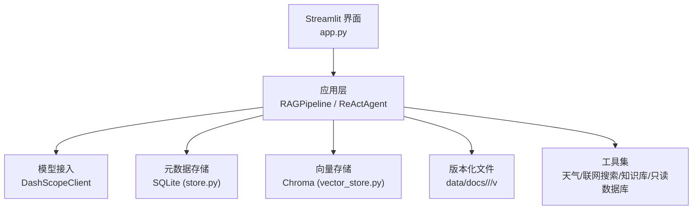
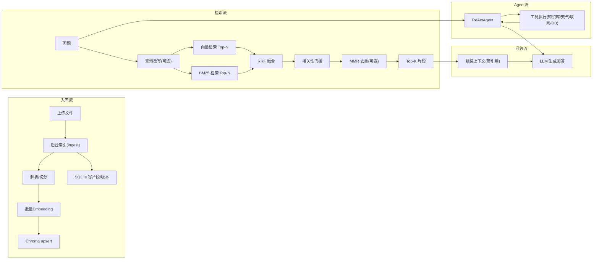
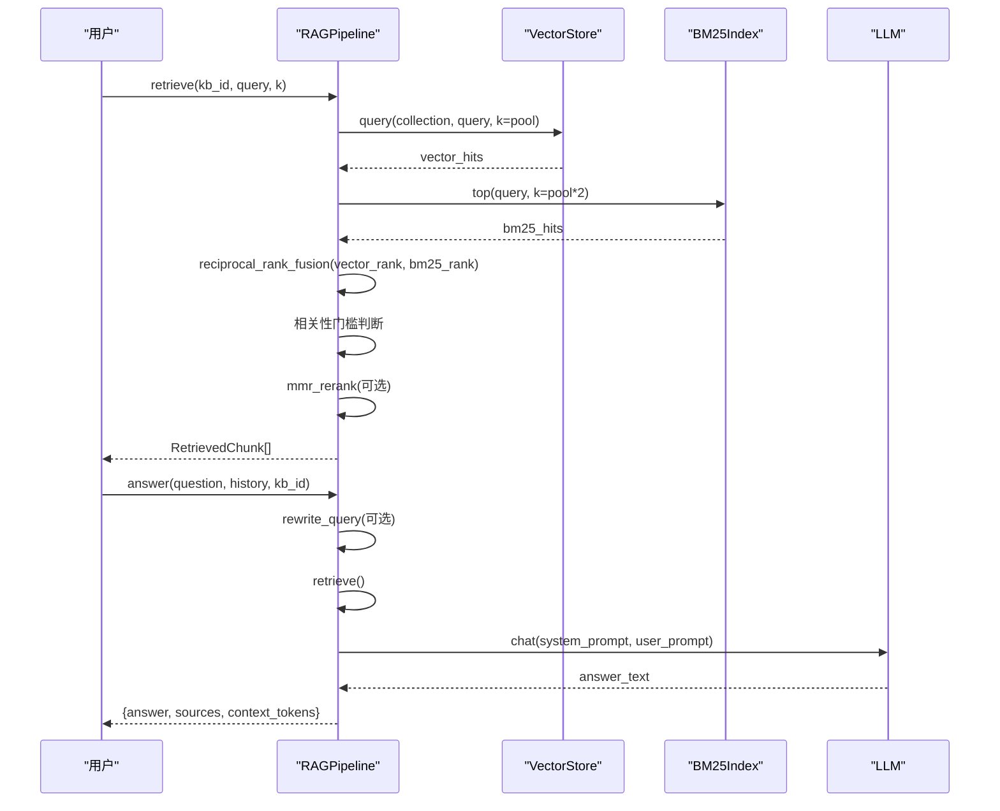
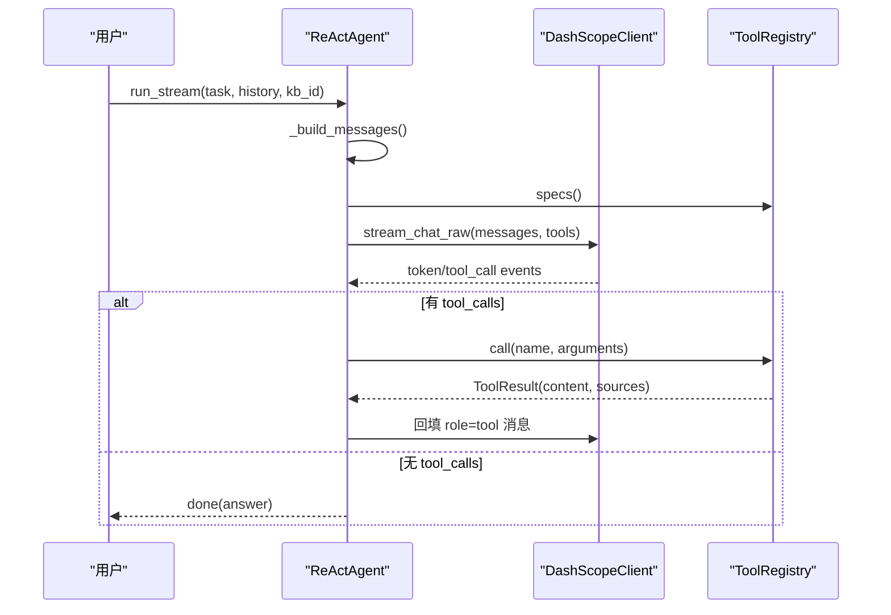
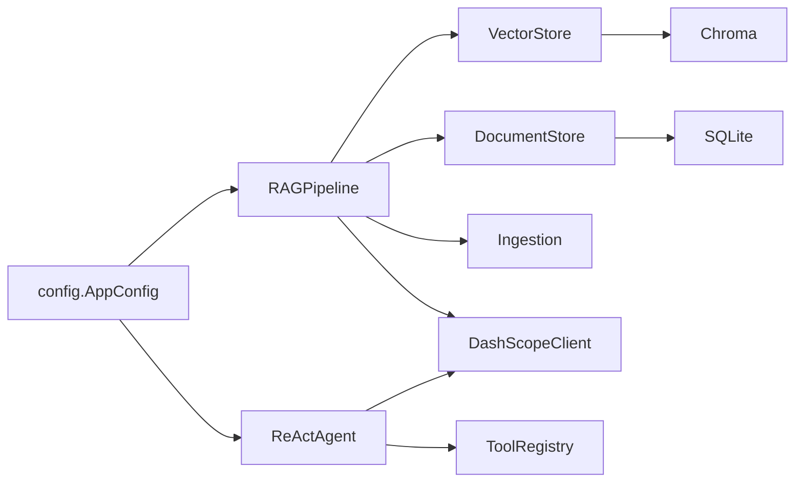

# 学习路线图

<cite>
**本文引用的文件**
- [README.md](file://README.md)
- [docs/LEARNING_GUIDE.md](file://docs/LEARNING_GUIDE.md)
- [docs/ARCHITECTURE.md](file://docs/ARCHITECTURE.md)
- [rag_pipeline.py](file://rag_pipeline.py)
- [react_agent.py](file://react_agent.py)
- [config.py](file://config.py)
- [llm_client.py](file://llm_client.py)
- [vector_store.py](file://vector_store.py)
- [store.py](file://store.py)
- [ingestion.py](file://ingestion.py)
- [tests/helpers.py](file://tests/helpers.py)
- [evals/README.md](file://evals/README.md)
- [requirements.txt](file://requirements.txt)
</cite>

## 目录
1. [引言](#引言)
2. [项目结构](#项目结构)
3. [核心组件](#核心组件)
4. [架构总览](#架构总览)
5. [详细组件分析](#详细组件分析)
6. [依赖关系分析](#依赖关系分析)
7. [性能与可配置性](#性能与可配置性)
8. [实践项目建议与阶段目标](#实践项目建议与阶段目标)
9. [故障排查指南](#故障排查指南)
10. [结论](#结论)
11. [附录：前置知识与资源](#附录前置知识与资源)

## 引言
本学习路线图基于仓库中的“智能文档助手 RAG + Agent（阶段 A）”实现，面向从零开始学习检索增强生成（RAG）与 Agent 的开发者。你将按顺序掌握 Python 基础、机器学习概念、自然语言处理入门，再系统学习 RAG 的核心概念（Embedding 向量、BM25 算法、混合检索、去重与阈值控制），并通过从简单问答到复杂 Agent 应用的渐进式实践，最终具备独立构建企业级知识库问答与工具调用 Agent 的能力。

## 项目结构
本项目采用分层模块化设计：UI 层（Streamlit）、应用层（RAG 管线与 Agent）、模型接入层（DashScope 客户端）、数据层（SQLite 元数据、Chroma 向量存储、版本化文件）。所有可调参数集中在配置模块，便于学习与调优。

图表来源
- [docs/ARCHITECTURE.md:15-43](file://docs/ARCHITECTURE.md#L15-L43)
- [rag_pipeline.py:196-220](file://rag_pipeline.py#L196-L220)
- [react_agent.py:144-162](file://react_agent.py#L144-L162)

章节来源
- [README.md:116-134](file://README.md#L116-L134)
- [docs/ARCHITECTURE.md:15-57](file://docs/ARCHITECTURE.md#L15-L57)

## 核心组件
- RAG 管线：负责知识库管理、增量入库、混合检索（向量+BM25）、查询改写与带引用问答。
- Agent：基于 Function Calling 的多步循环，支持工具注册表、流式事件输出。
- 模型接入：统一封装 DashScope 对话、流式、工具调用与 Embedding。
- 存储层：SQLite 管理知识库/文档/版本/片段；Chroma 管理向量集合。
- 解析与切分：PDF/Word/Markdown/TXT 解析，含本地 OCR 兜底与递归字符切分。
- 配置中心：集中读取环境变量，冻结不可变配置对象。

章节来源
- [rag_pipeline.py:1-15](file://rag_pipeline.py#L1-L15)
- [react_agent.py:1-14](file://react_agent.py#L1-L14)
- [llm_client.py:1-20](file://llm_client.py#L1-L20)
- [vector_store.py:1-10](file://vector_store.py#L1-L10)
- [store.py:1-17](file://store.py#L1-L17)
- [ingestion.py:1-5](file://ingestion.py#L1-L5)
- [config.py:1-6](file://config.py#L1-L6)

## 架构总览
阶段 A 围绕五个目标设计：检索质量可调、数据可管理、Agent 真实可用、可测试、可演进。整体数据流包括入库流、检索流、问答流与 Agent 流。

图表来源
- [docs/ARCHITECTURE.md:58-135](file://docs/ARCHITECTURE.md#L58-L135)
- [rag_pipeline.py:306-435](file://rag_pipeline.py#L306-L435)
- [rag_pipeline.py:439-523](file://rag_pipeline.py#L439-L523)
- [react_agent.py:272-370](file://react_agent.py#L272-L370)

章节来源
- [docs/ARCHITECTURE.md:3-11](file://docs/ARCHITECTURE.md#L3-L11)
- [docs/ARCHITECTURE.md:58-135](file://docs/ARCHITECTURE.md#L58-L135)

## 详细组件分析

### RAG 管线（检索增强生成）
- 知识库管理：创建/列出/删除知识库，统计文档与片段数量。
- 增量入库：SHA-256 判重，索引配置签名变化时全量重建；批量向量化并写入 Chroma；更新 SQLite 片段与计数。
- 混合检索：向量检索与 BM25 各自取候选，RRF 融合排序；相关性门槛拦截低相关查询；可选 MMR 去重。
- 查询改写：多轮对话中把追问题改写为独立问题，失败回退原问题。
- 带引用问答：组装上下文块（带来源标注），按 token 预算裁剪历史与上下文，生成答案并返回来源与得分。

图表来源
- [rag_pipeline.py:439-523](file://rag_pipeline.py#L439-L523)
- [rag_pipeline.py:566-666](file://rag_pipeline.py#L566-L666)
- [utils/retrieval.py](file://utils/retrieval.py)

章节来源
- [rag_pipeline.py:196-792](file://rag_pipeline.py#L196-L792)
- [docs/LEARNING_GUIDE.md:14-88](file://docs/LEARNING_GUIDE.md#L14-L88)

### Agent（Function Calling 多步循环）
- 工具注册表：通过装饰器注册工具函数与 JSON Schema，自动生成 OpenAI tools 格式。
- 主流程：构建消息与工具列表，调用流式接口；若返回 tool_calls，则解析参数、执行工具、回填结果，最多 max_steps 轮。
- 内置工具：知识库检索、天气查询、联网搜索、只读数据库查询。
- 流式事件：tool_start/tool_end/token/done/error，供 UI 逐帧渲染。

图表来源
- [react_agent.py:165-246](file://react_agent.py#L165-L246)
- [react_agent.py:272-370](file://react_agent.py#L272-L370)
- [llm_client.py:203-278](file://llm_client.py#L203-L278)

章节来源
- [react_agent.py:1-567](file://react_agent.py#L1-L567)
- [docs/LEARNING_GUIDE.md:90-110](file://docs/LEARNING_GUIDE.md#L90-L110)

### 模型接入（DashScope 客户端）
- 统一封装：chat/chat_raw/stream_chat/stream_chat_raw/embeddings/web_search。
- 安全与错误处理：API Key 校验、base_url 格式检查、异常转换为可读错误。
- 流式支持：token 与 tool_call 事件聚合，支持 Function Calling。

章节来源
- [llm_client.py:22-322](file://llm_client.py#L22-L322)

### 向量存储（Chroma 封装）
- 每个知识库一个 collection，余弦空间。
- 批量 upsert、按条件删除、相似度查询、获取嵌入向量（用于 MMR）。
- 重置客户端避免内存索引过期。

章节来源
- [vector_store.py:38-149](file://vector_store.py#L38-L149)

### 元数据存储（SQLite）
- 五张表：kbs、documents、document_versions、chunks、meta。
- WAL 模式与 busy_timeout 支持并发访问；软删除保留历史。
- 增量入库关键：indexed_sha 记录已索引内容哈希，避免重复入库。

章节来源
- [store.py:31-77](file://store.py#L31-L77)
- [store.py:337-345](file://store.py#L337-L345)

### 文档解析与切分
- 支持 PDF/Word/Markdown/TXT；PDF 文本质量检测，低于阈值自动切换本地 OCR。
- 递归字符切分，保留 page/paragraph 等元数据。

章节来源
- [ingestion.py:24-190](file://ingestion.py#L24-L190)

## 依赖关系分析
- 配置驱动：AppConfig 集中管理所有可调参数，影响切分、检索、重排、Agent 行为。
- 模块耦合：RAGPipeline 依赖 VectorStore、DocumentStore、Ingestion、LLMClient；ReActAgent 依赖 RAGPipeline 与 ToolRegistry。
- 外部依赖：DashScope（对话/Embedding/联网搜索）、Chroma（向量库）、SQLite（元数据）、jieba/rank-bm25（词面检索）。

图表来源
- [config.py:56-113](file://config.py#L56-L113)
- [rag_pipeline.py:196-220](file://rag_pipeline.py#L196-L220)
- [react_agent.py:144-162](file://react_agent.py#L144-L162)

章节来源
- [config.py:56-113](file://config.py#L56-L113)
- [requirements.txt:1-21](file://requirements.txt#L1-L21)

## 性能与可配置性
- 切分与上下文预算：CHUNK_SIZE/CHUNK_OVERLAP 控制片段大小；HISTORY_MAX_TOKENS/RAG_CONTEXT_MAX_TOKENS 限制历史与上下文长度，防止注意力稀释。
- 检索调参：RETRIEVAL_TOP_K 控制最终片段数；RETRIEVAL_FUSION_POOL 控制候选池；RETRIEVAL_RELEVANCE_THRESHOLD 控制相关性门槛；RETRIEVAL_MMR_ENABLED/LAMBDA 控制去重多样性。
- 批量上限：EMBEDDING_BATCH_SIZE 钳制到 20 以内，避免服务报错。
- 索引配置签名：chunk 参数或 Embedding 模型变化触发全量重建，避免新旧向量混用。

章节来源
- [config.py:72-113](file://config.py#L72-L113)
- [docs/ARCHITECTURE.md:94-99](file://docs/ARCHITECTURE.md#L94-L99)
- [docs/ARCHITECTURE.md:77-81](file://docs/ARCHITECTURE.md#L77-L81)

## 实践项目建议与阶段目标
以下建议结合仓库提供的学习指南与评测体系，帮助你从简单问答逐步构建复杂 Agent 应用。

- 阶段一：环境搭建与运行
  - 目标：安装依赖、配置 API Key、启动 Streamlit 界面、上传文档并提问。
  - 验证方法：成功显示知识库状态、上传后后台索引完成、能返回带引用的答案。
  - 参考路径：[README.md:25-72](file://README.md#L25-L72)

- 阶段二：理解 RAG 核心概念
  - 目标：掌握 Embedding 向量、BM25 算法、混合检索、MMR 去重、相关性门槛。
  - 动手实验：调整 RETRIEVAL_TOP_K、RETRIEVAL_FUSION_POOL、RETRIEVAL_MMR_ENABLED，观察引用变化与重复度。
  - 验证方法：对比不同参数下的检索结果与答案质量；使用评测脚本离线验证链路。
  - 参考路径：[docs/LEARNING_GUIDE.md:27-76](file://docs/LEARNING_GUIDE.md#L27-L76)

- 阶段三：查询改写与多轮对话
  - 目标：理解多轮对话中追问题的改写机制，提升检索准确性。
  - 验证方法：开启 QUERY_REWRITE_ENABLED，对比改写前后检索效果；检查改写失败回退逻辑。
  - 参考路径：[docs/LEARNING_GUIDE.md:77-88](file://docs/LEARNING_GUIDE.md#L77-L88)

- 阶段四：构建 Agent 应用
  - 目标：掌握 Function Calling、工具注册表、多步循环、流式事件。
  - 实践：在 _build_registry 中注册新工具（如内部 API），重启后观察模型是否学会调用。
  - 验证方法：运行命令行 Agent，输入任务，查看步骤轨迹与最终回答；确保达到最大轮数限制。
  - 参考路径：[docs/LEARNING_GUIDE.md:90-110](file://docs/LEARNING_GUIDE.md#L90-L110)

- 阶段五：评测与优化
  - 目标：使用 golden set 评估 hit@k、keyword_hit、citation，量化检索与回答质量。
  - 验证方法：运行在线/离线评测脚本，查看 last_run_report.json；根据指标调参优化。
  - 参考路径：[evals/README.md:1-24](file://evals/README.md#L1-L24)

- 阶段六：进阶实践
  - 目标：实现更复杂的 Agent 工作流，如多工具协作、长上下文管理、成本与观测。
  - 实践：结合 HISTORY_MAX_TOKENS 与 RAG_CONTEXT_MAX_TOKENS 控制上下文；扩展工具集；接入更多数据源。
  - 验证方法：端到端冒烟测试、单元测试覆盖核心逻辑；CI 流水线保证稳定性。
  - 参考路径：[docs/ARCHITECTURE.md:174-186](file://docs/ARCHITECTURE.md#L174-L186)

## 故障排查指南
- 上传后立刻提问返回“无相关内容”：后台索引仍在进行，等待完成或检查相关性阈值是否过高。
- Agent 不调用知识库直接回答：工具描述不够清晰，改进 _build_registry 中工具描述。
- 修改 chunk 参数不生效：需重启应用，下次入库时自动全量重建。
- 多人同时使用：阶段 A 无用户体系，共享知识库；阶段 B 将引入租户与权限。
- 文档发送到云端安全问题：Embedding 与问答会发送片段至 DashScope，涉密文档请考虑私有化方案。

章节来源
- [docs/LEARNING_GUIDE.md:134-158](file://docs/LEARNING_GUIDE.md#L134-L158)

## 结论
本学习路线图以项目实战为导向，从基础概念到高级应用，系统性地覆盖了 RAG 与 Agent 的核心技术栈。通过循序渐进的实践与评测，开发者能够掌握检索增强生成、混合检索、工具调用与流式交互等关键技术，并具备构建企业级知识库问答与 Agent 应用的能力。建议在每个阶段完成后进行验证与复盘，持续优化参数与实践方案。

## 附录：前置知识与资源
- Python 基础：数据结构、函数、类、异步编程基础。
- 机器学习概念：向量空间、相似度度量、过拟合与欠拟合。
- 自然语言处理入门：分词、TF-IDF、BM25、语义表示。
- 推荐学习顺序：先跑通项目 → 阅读 README → 理解架构 → 逐个模块学习代码 → 改参观察效果 → 运行测试与评测。

章节来源
- [docs/LEARNING_GUIDE.md:1-13](file://docs/LEARNING_GUIDE.md#L1-L13)
- [requirements.txt:1-21](file://requirements.txt#L1-L21)