# 开发指南

<cite>
**本文引用的文件**
- [README.md](file://README.md)
- [docs/ARCHITECTURE.md](file://docs/ARCHITECTURE.md)
- [docs/LEARNING_GUIDE.md](file://docs/LEARNING_GUIDE.md)
- [config.py](file://config.py)
- [rag_pipeline.py](file://rag_pipeline.py)
- [react_agent.py](file://react_agent.py)
- [llm_client.py](file://llm_client.py)
- [store.py](file://store.py)
- [vector_store.py](file://vector_store.py)
- [ingestion.py](file://ingestion.py)
- [api.py](file://api.py)
- [app.py](file://app.py)
- [utils/logger.py](file://utils/logger.py)
- [tests/helpers.py](file://tests/helpers.py)
- [pyproject.toml](file://pyproject.toml)
- [requirements.txt](file://requirements.txt)
- [requirements-dev.txt](file://requirements-dev.txt)
</cite>

## 目录
1. [简介](#简介)
2. [项目结构](#项目结构)
3. [核心组件](#核心组件)
4. [架构总览](#架构总览)
5. [详细组件分析](#详细组件分析)
6. [依赖关系分析](#依赖关系分析)
7. [性能与可观测性](#性能与可观测性)
8. [从零学习路线与实践建议](#从零学习路线与实践建议)
9. [开发环境与代码规范](#开发环境与代码规范)
10. [新功能开发流程与提交流程](#新功能开发流程与提交流程)
11. [故障排查](#故障排查)
12. [结论](#结论)

## 简介
本项目是一个面向企业知识库的 RAG + Agent 原型系统（阶段 A），提供多知识库管理、混合检索（向量+BM25，RRF融合，可选MMR去重）、增量入库、Function Calling Agent、流式对话、REST API 与离线评测。目标是把演示应用升级为可靠的单机产品，为后续平台化演进打下基础。

## 项目结构
- 应用入口：Streamlit 界面 app.py；FastAPI 服务 api.py
- 核心逻辑：RAG 管线 rag_pipeline.py；Agent react_agent.py；LLM 封装 llm_client.py
- 数据层：SQLite 存储 store.py；Chroma 向量存储 vector_store.py；文档解析 ingestion.py
- 配置与工具：集中配置 config.py；日志 utils/logger.py
- 测试与评测：tests/*；evals/*
- 依赖与质量：requirements*.txt；pyproject.toml（pytest/ruff/mypy）

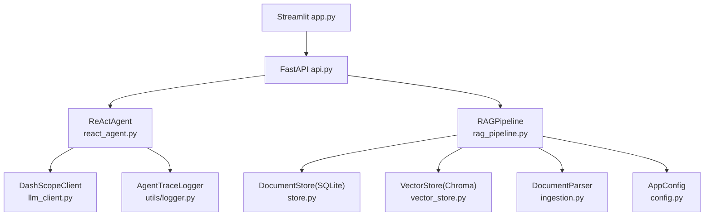

图表来源
- [app.py:51-54](file://app.py#L51-L54)
- [api.py:34-57](file://api.py#L34-L57)
- [react_agent.py:144-157](file://react_agent.py#L144-L157)
- [rag_pipeline.py:196-219](file://rag_pipeline.py#L196-L219)
- [llm_client.py:22-46](file://llm_client.py#L22-L46)
- [store.py:123-138](file://store.py#L123-L138)
- [vector_store.py:38-59](file://vector_store.py#L38-L59)
- [ingestion.py:24-38](file://ingestion.py#L24-L38)
- [config.py:56-112](file://config.py#L56-L112)
- [utils/logger.py:12-45](file://utils/logger.py#L12-L45)

章节来源
- [README.md:116-134](file://README.md#L116-L134)
- [docs/ARCHITECTURE.md:13-57](file://docs/ARCHITECTURE.md#L13-L57)

## 核心组件
- 配置中心 AppConfig：集中读取环境变量，冻结 dataclass，统一切分、检索、Agent 等参数
- 文档解析与切分 DocumentParser：PDF/Word/Markdown/TXT，PDF 文本质量评估与本地 OCR 兜底
- 元数据存储 DocumentStore：SQLite WAL，多知识库/文档版本/片段/键值配置
- 向量存储 VectorStore：Chroma 封装，批量 upsert、条件删除、相似度查询、取回向量
- RAG 管线 RAGPipeline：入库、混合检索、查询改写、带引用问答、上下文预算控制
- Agent ReActAgent：工具注册表、Function Calling 循环、流式事件输出
- LLM 客户端 DashScopeClient：聊天、流式、工具调用、Embedding、联网搜索
- 日志 AgentTraceLogger：线程安全 JSONL 轨迹记录与 token 估算

章节来源
- [config.py:56-112](file://config.py#L56-L112)
- [ingestion.py:24-38](file://ingestion.py#L24-L38)
- [store.py:123-138](file://store.py#L123-L138)
- [vector_store.py:38-59](file://vector_store.py#L38-L59)
- [rag_pipeline.py:196-219](file://rag_pipeline.py#L196-L219)
- [react_agent.py:144-157](file://react_agent.py#L144-L157)
- [llm_client.py:22-46](file://llm_client.py#L22-L46)
- [utils/logger.py:12-45](file://utils/logger.py#L12-L45)

## 架构总览
阶段 A 围绕“检索质量可调、数据可管理、Agent 真实可用、可测试、可演进”五个目标设计。UI 层通过 Streamlit/FastAPI 暴露能力；应用层由 Agent 与 RAG 编排；数据层使用 SQLite 与 Chroma；工具层包含天气、联网搜索、知识库等。

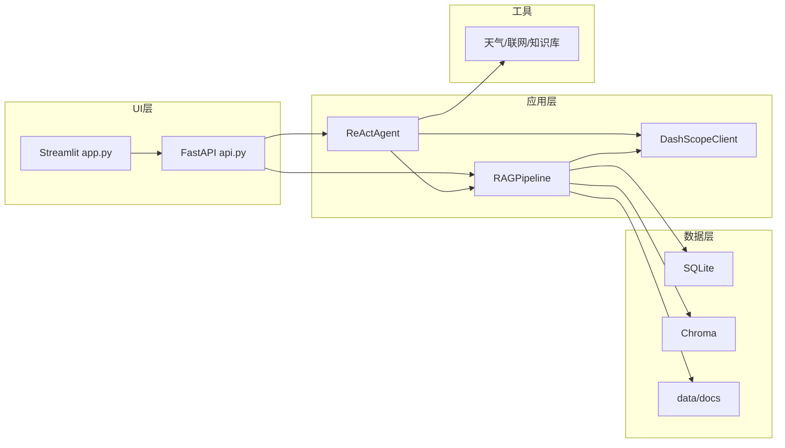

图表来源
- [docs/ARCHITECTURE.md:13-43](file://docs/ARCHITECTURE.md#L13-L43)
- [app.py:51-54](file://app.py#L51-L54)
- [api.py:34-57](file://api.py#L34-L57)

章节来源
- [docs/ARCHITECTURE.md:3-11](file://docs/ARCHITECTURE.md#L3-L11)

## 详细组件分析

### 配置模块 AppConfig
- 从环境变量加载所有可调参数，支持路径解析、布尔/整型/浮点转换与范围钳制
- 冻结 dataclass 防止运行时被意外修改
- 关键参数包括 chunk_size/chunk_overlap、top_k/fusion_pool、relevance_threshold、mmr_enabled/mmr_lambda、query_rewrite_enabled、history_max_tokens、rag_context_max_tokens、agent_max_steps、embedding_batch_size

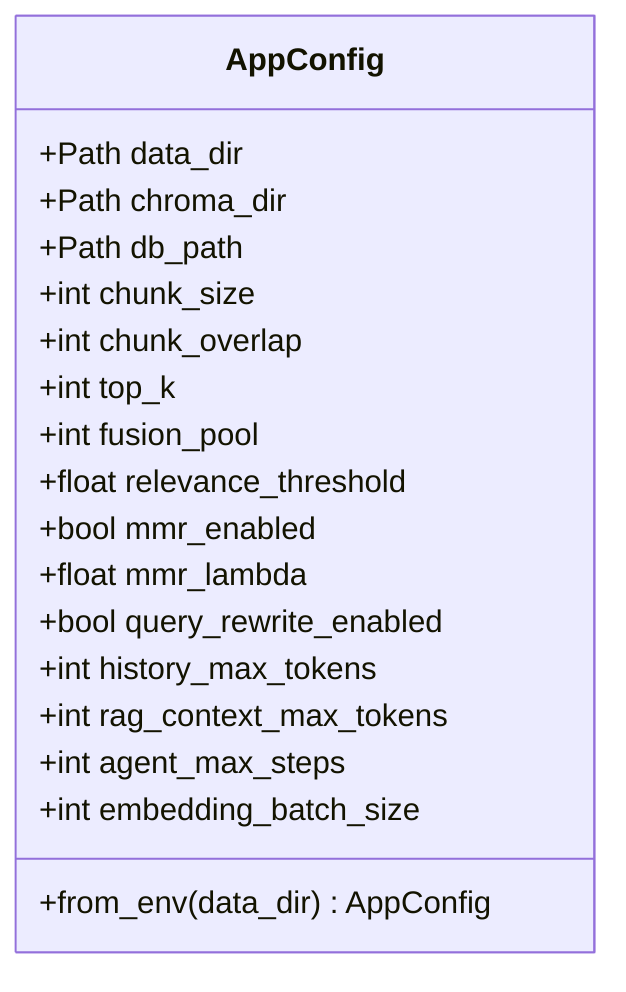

图表来源
- [config.py:56-112](file://config.py#L56-L112)

章节来源
- [config.py:1-112](file://config.py#L1-L112)

### 文档解析与切分 DocumentParser
- 支持 PDF/DOCX/MD/TXT；PDF 先尝试文本提取，若质量低于阈值则切换本地 OCR（PyMuPDF + RapidOCR）
- 递归字符切分保留 page/段落元数据，便于引用定位
- 构建片段元数据用于 BM25 重建与检索展示

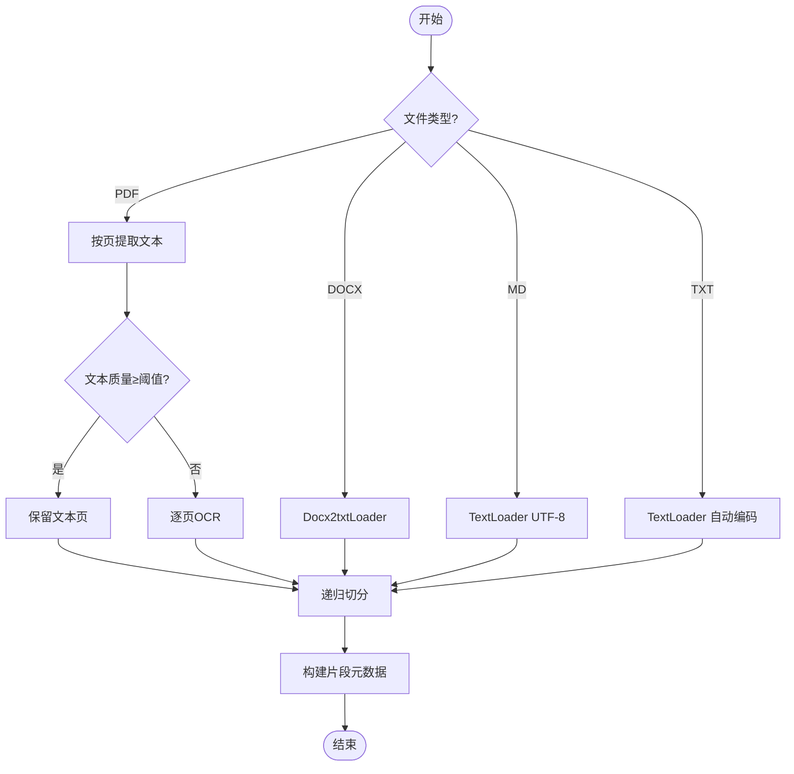

图表来源
- [ingestion.py:24-38](file://ingestion.py#L24-L38)
- [ingestion.py:40-78](file://ingestion.py#L40-L78)
- [ingestion.py:178-216](file://ingestion.py#L178-L216)

章节来源
- [ingestion.py:1-216](file://ingestion.py#L1-L216)

### 元数据存储 DocumentStore
- SQLite WAL 模式，读写并发安全；支持多知识库、文档版本、片段、键值配置
- 软删除文档并清理片段；替换片段保证与向量库一致
- indexed_sha 区分“上传内容哈希”和“已索引内容哈希”，实现增量入库

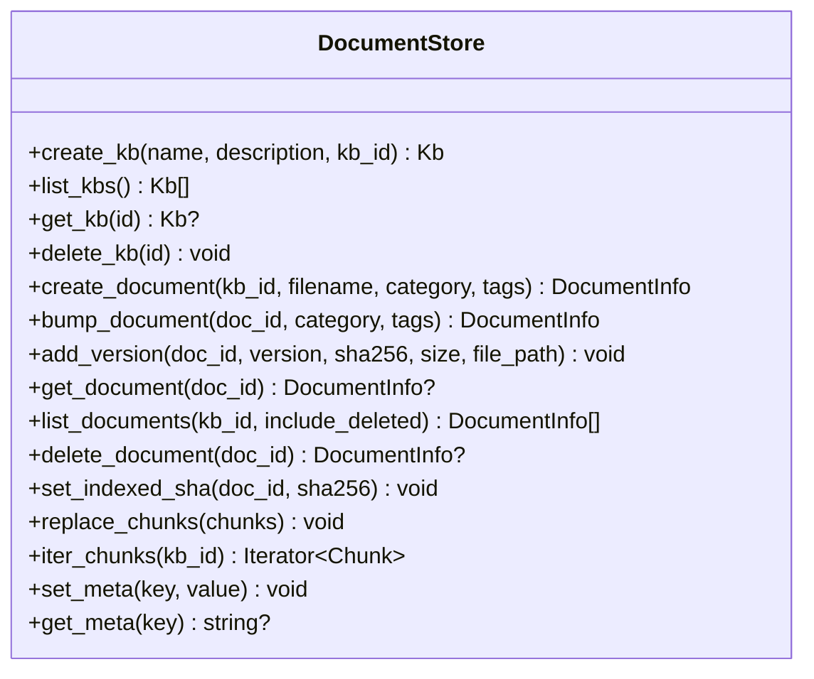

图表来源
- [store.py:123-138](file://store.py#L123-L138)
- [store.py:158-210](file://store.py#L158-L210)
- [store.py:214-335](file://store.py#L214-L335)
- [store.py:386-441](file://store.py#L386-L441)
- [store.py:454-469](file://store.py#L454-L469)

章节来源
- [store.py:1-470](file://store.py#L1-L470)

### 向量存储 VectorStore
- 基于 Chroma，每个知识库一个 collection，余弦空间
- 批量 upsert、按条件删除、相似度查询、取回向量（用于 MMR）
- reset 重建客户端避免内存索引过期

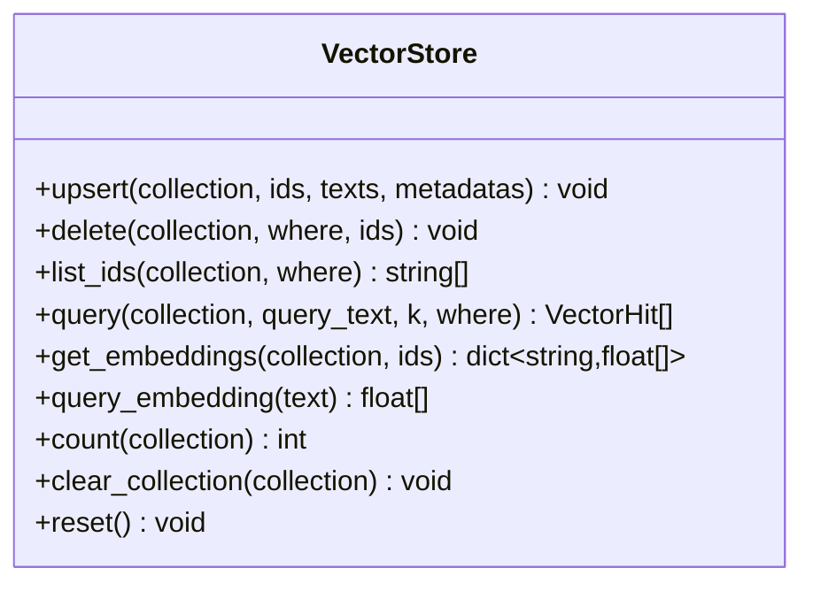

图表来源
- [vector_store.py:38-59](file://vector_store.py#L38-L59)
- [vector_store.py:61-148](file://vector_store.py#L61-L148)

章节来源
- [vector_store.py:1-255](file://vector_store.py#L1-L255)

### RAG 管线 RAGPipeline
- 入库：增量处理（SHA-256 对比）、索引配置签名变化触发全量重建
- 检索：向量 Top-N + BM25 Top-N → RRF 融合 → 相关性门槛 → 可选 MMR 去重 → Top-K
- 问答：查询改写（多轮）、上下文预算截断、带引用回答
- 兼容：默认知识库迁移、集合命名、刷新缓存

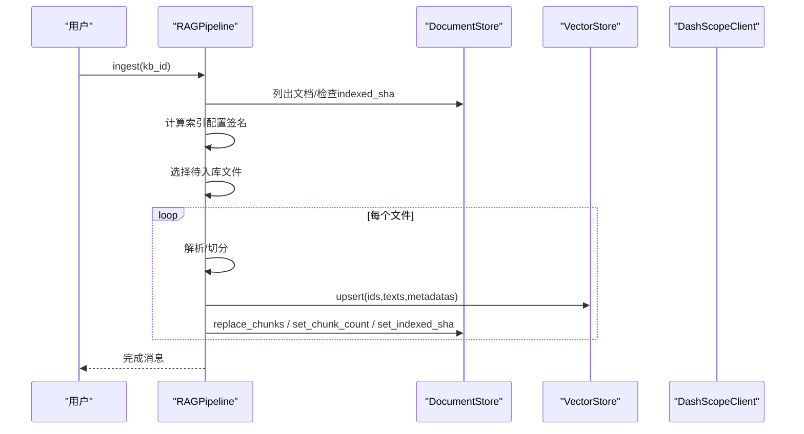

图表来源
- [rag_pipeline.py:306-435](file://rag_pipeline.py#L306-L435)
- [store.py:337-354](file://store.py#L337-L354)
- [vector_store.py:61-78](file://vector_store.py#L61-L78)

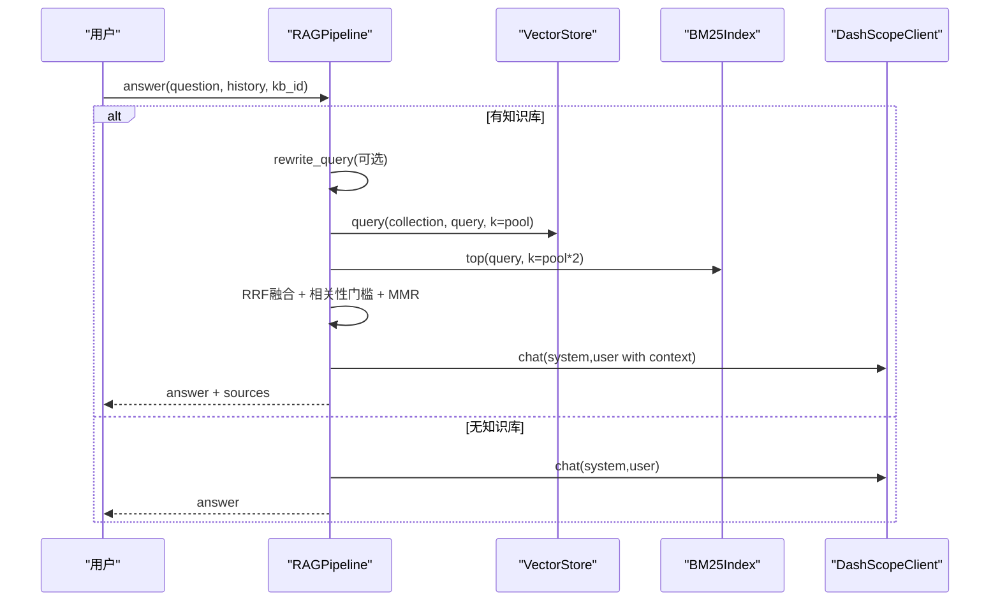

图表来源
- [rag_pipeline.py:566-696](file://rag_pipeline.py#L566-L696)
- [rag_pipeline.py:439-523](file://rag_pipeline.py#L439-L523)

章节来源
- [rag_pipeline.py:1-792](file://rag_pipeline.py#L1-L792)

### Agent ReActAgent
- 工具注册表：search_knowledge_base、get_weather、search_web、query_database（只读 SQL）
- Function Calling 循环：流式 tool_call 聚合 → 执行工具 → 回填 role=tool → 继续直到最终回答或达到最大步数
- 流式事件：tool_start/tool_end/step/token/done/error

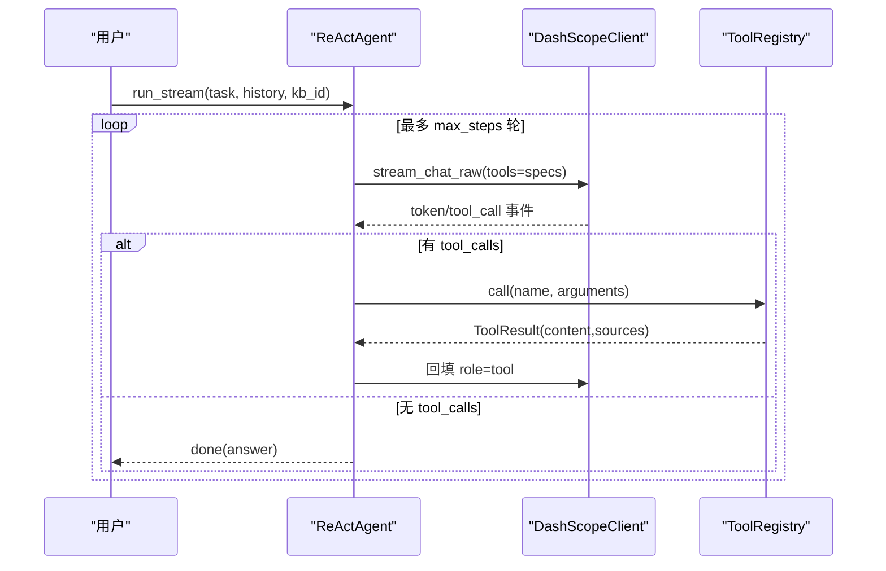

图表来源
- [react_agent.py:272-369](file://react_agent.py#L272-L369)
- [react_agent.py:165-246](file://react_agent.py#L165-L246)
- [llm_client.py:203-278](file://llm_client.py#L203-L278)

章节来源
- [react_agent.py:1-567](file://react_agent.py#L1-L567)

### LLM 客户端 DashScopeClient
- OpenAI 兼容接口，支持 chat/chat_raw/stream_chat/stream_chat_raw/web_search/embeddings
- 统一错误包装 safe_error，记录 last_usage 用量
- 支持 enable_thinking/enable_search 扩展

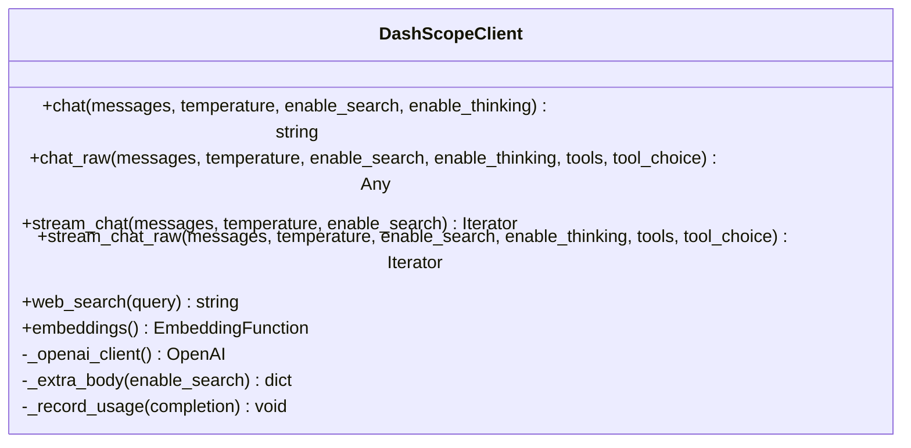

图表来源
- [llm_client.py:22-46](file://llm_client.py#L22-L46)
- [llm_client.py:94-170](file://llm_client.py#L94-L170)
- [llm_client.py:172-278](file://llm_client.py#L172-L278)
- [llm_client.py:283-299](file://llm_client.py#L283-L299)

章节来源
- [llm_client.py:1-322](file://llm_client.py#L1-L322)

### 日志与 Token 估算 AgentTraceLogger
- 线程安全 JSONL 追加写入，失败不阻塞主流程
- estimate_tokens 对中英文混合文本进行轻量 token 估算，用于历史与上下文预算

章节来源
- [utils/logger.py:1-76](file://utils/logger.py#L1-L76)

## 依赖关系分析
- 运行依赖：langchain、chromadb、dashscope、openai、streamlit、fastapi、uvicorn、pypdf/docx2txt/pymupdf/rapidocr/onnxruntime/python-dotenv、rank-bm25/jieba/numpy
- 开发依赖：pytest、ruff、mypy
- 质量配置：ruff 规则集 E/F/I/UP/B/SIM；mypy 指定 Python 3.10，排除 tests

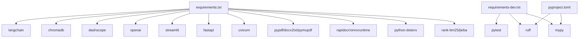

图表来源
- [requirements.txt:1-21](file://requirements.txt#L1-L21)
- [requirements-dev.txt:1-6](file://requirements-dev.txt#L1-L6)
- [pyproject.toml:1-41](file://pyproject.toml#L1-L41)

章节来源
- [requirements.txt:1-21](file://requirements.txt#L1-L21)
- [requirements-dev.txt:1-6](file://requirements-dev.txt#L1-L6)
- [pyproject.toml:1-41](file://pyproject.toml#L1-L41)

## 性能与可观测性
- 性能要点
  - 增量入库：SHA-256 判重，仅处理变化文件；索引配置签名变化时全量重建
  - 混合检索：向量+BM25→RRF→MMR，减少重复与噪声
  - 上下文预算：HISTORY_MAX_TOKENS/RAG_CONTEXT_MAX_TOKENS 控制注意力稀释
  - 批量嵌入：EMBEDDING_BATCH_SIZE 限制在 20 以内，避免服务端报错
- 可观测性
  - Agent 轨迹：JSONL 记录每步 thought_summary/tool/args/observation/cost_estimate
  - Token 估算：estimate_tokens 用于历史与上下文裁剪
  - 用量记录：last_usage 记录 prompt/completion/total tokens

章节来源
- [rag_pipeline.py:306-435](file://rag_pipeline.py#L306-L435)
- [rag_pipeline.py:566-696](file://rag_pipeline.py#L566-L696)
- [utils/logger.py:12-62](file://utils/logger.py#L12-L62)
- [llm_client.py:48-57](file://llm_client.py#L48-L57)

## 从零学习路线与实践建议
- 前置知识
  - Python 基础、异步/同步 IO、HTTP 基础
  - RAG 概念：检索增强生成、Embedding、向量检索、BM25、RRF、MMR
  - Agent 概念：Function Calling、ReAct 循环、工具注册
  - 数据库基础：SQLite 事务、WAL 模式
- 推荐资源
  - 项目内学习指南：docs/LEARNING_GUIDE.md
  - 架构说明：docs/ARCHITECTURE.md
  - README 快速开始与配置说明
- 实践项目建议
  - 搭建环境并运行 Streamlit 界面，上传文档并提问
  - 调整检索参数（RETRIEVAL_TOP_K、RETRIEVAL_FUSION_POOL、RETRIEVAL_RELEVANCE_THRESHOLD、RETRIEVAL_MMR_ENABLED）观察效果
  - 新增一个工具（如查询内部 API），注册到 ToolRegistry 并验证 Agent 调用
  - 编写 pytest 用例，覆盖入库/检索/问答/Agent 流程
  - 运行 evals/run_eval.py 离线/在线评测，产出 hit@k、关键词命中率、可溯源率

章节来源
- [docs/LEARNING_GUIDE.md:1-158](file://docs/LEARNING_GUIDE.md#L1-L158)
- [docs/ARCHITECTURE.md:13-57](file://docs/ARCHITECTURE.md#L13-L57)
- [README.md:25-91](file://README.md#L25-L91)

## 开发环境与代码规范
- 环境搭建
  - Python 3.10+，创建虚拟环境并安装 requirements.txt
  - 复制 .env.example 为 .env，填写 DASHSCOPE_API_KEY 等必要变量
  - 启动 Streamlit：streamlit run app.py
  - 启动 FastAPI：uvicorn api:app --host 0.0.0.0 --port 8000
- IDE 与调试
  - 建议使用 VS Code 或 PyCharm，启用 Python 解释器指向 .venv
  - 设置断点调试 rag_pipeline.py、react_agent.py、llm_client.py
  - 使用 pytest 运行 tests/*，结合 FakeLLMClient/FakeEmbeddings 离线验证
- 代码规范检查
  - ruff：ruff check .（规则集 E/F/I/UP/B/SIM，忽略 E501）
  - mypy：mypy（Python 3.10，排除 tests，指定源文件列表）
  - pytest：pytest（quiet，禁用警告）

章节来源
- [README.md:25-91](file://README.md#L25-L91)
- [pyproject.toml:1-41](file://pyproject.toml#L1-L41)
- [requirements-dev.txt:1-6](file://requirements-dev.txt#L1-L6)

## 新功能开发流程与提交流程
- 需求分析
  - 明确功能边界：是否涉及检索策略、工具扩展、存储变更、API 变更
  - 评估影响面：上游（LLM/Embedding）、下游（UI/API）、数据层（SQLite/Chroma）
- 设计与实现
  - 新增工具：在 react_agent.py 的 _build_registry 中注册函数与 Schema
  - 新增检索策略：在 rag_pipeline.py::retrieve 中扩展融合/重排逻辑
  - 新增存储字段：在 store.py 中增加列与迁移逻辑（_ensure_columns）
  - 新增 API：在 api.py 中添加路由与校验模型
- 测试与评测
  - 编写单元测试（tests/*），使用 tests/helpers.py 中的 FakeLLMClient/FakeEmbeddings
  - 运行 pytest 确保回归通过
  - 运行 evals/run_eval.py 离线/在线评测，记录指标
- 提交与审查
  - 提交前执行 ruff check . 与 mypy，修复问题
  - 提交信息清晰描述改动点与影响
  - 代码审查关注：职责单一、错误处理、性能与可测性、向后兼容

章节来源
- [react_agent.py:165-246](file://react_agent.py#L165-L246)
- [rag_pipeline.py:439-523](file://rag_pipeline.py#L439-L523)
- [store.py:150-155](file://store.py#L150-L155)
- [api.py:95-199](file://api.py#L95-L199)
- [tests/helpers.py:16-166](file://tests/helpers.py#L16-L166)

## 故障排查
- 常见问题
  - 上传后立刻提问返回“无相关内容”：后台索引未完成，等待完成或检查阈值
  - Agent 不调用知识库工具：工具描述不够清晰，优化 Schema 与描述
  - 修改 chunk 参数不生效：需重启应用，下次入库会全量重建
  - 多人同时使用：阶段 A 共享知识库，阶段 B 将引入租户与权限
- 错误处理约定
  - 外部异常统一转换为可读错误（safe_error）
  - 工具执行异常回填给模型，允许重试或直接回答
  - 日志写入失败不影响主流程

章节来源
- [docs/LEARNING_GUIDE.md:134-158](file://docs/LEARNING_GUIDE.md#L134-L158)
- [llm_client.py:297-299](file://llm_client.py#L297-L299)
- [react_agent.py:130-141](file://react_agent.py#L130-L141)
- [utils/logger.py:39-45](file://utils/logger.py#L39-L45)

## 结论
本指南从架构、组件、数据流、性能与可观测性、学习路线、开发环境与规范、新流程与提交流程、故障排查等方面提供了全面参考。建议先从 README 与 docs/LEARNING_GUIDE.md 入手，逐步深入源码与测试，结合评测脚本量化改进效果。后续阶段 B/C 可在现有基础上平滑演进至多租户、任务队列、观测与成本统计、MCP 工具接入等能力。