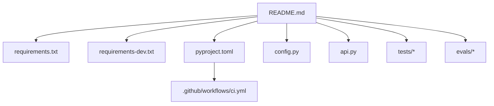
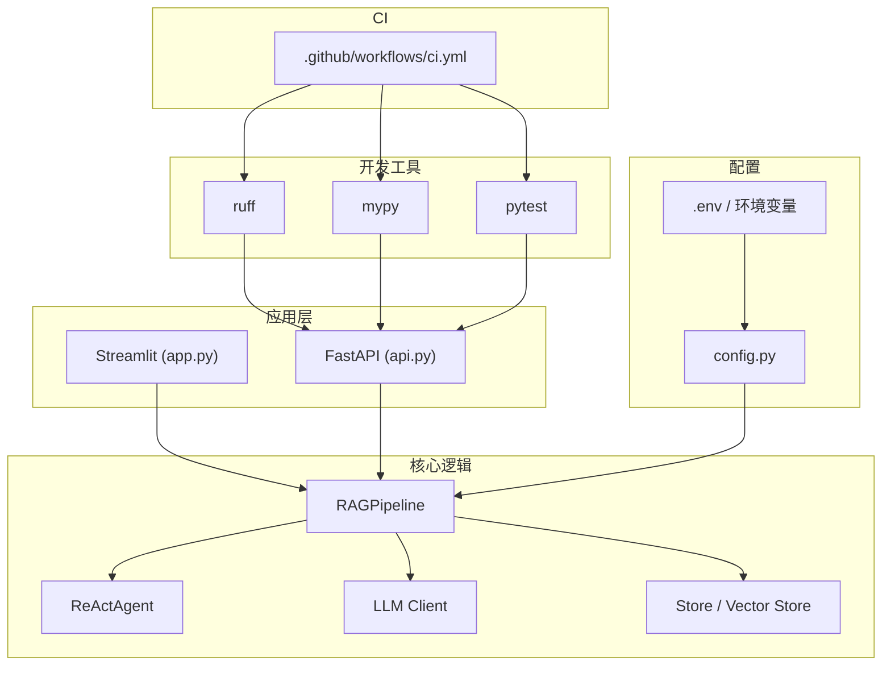
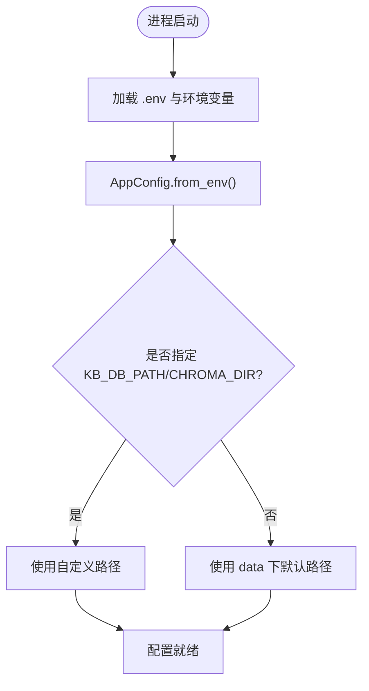
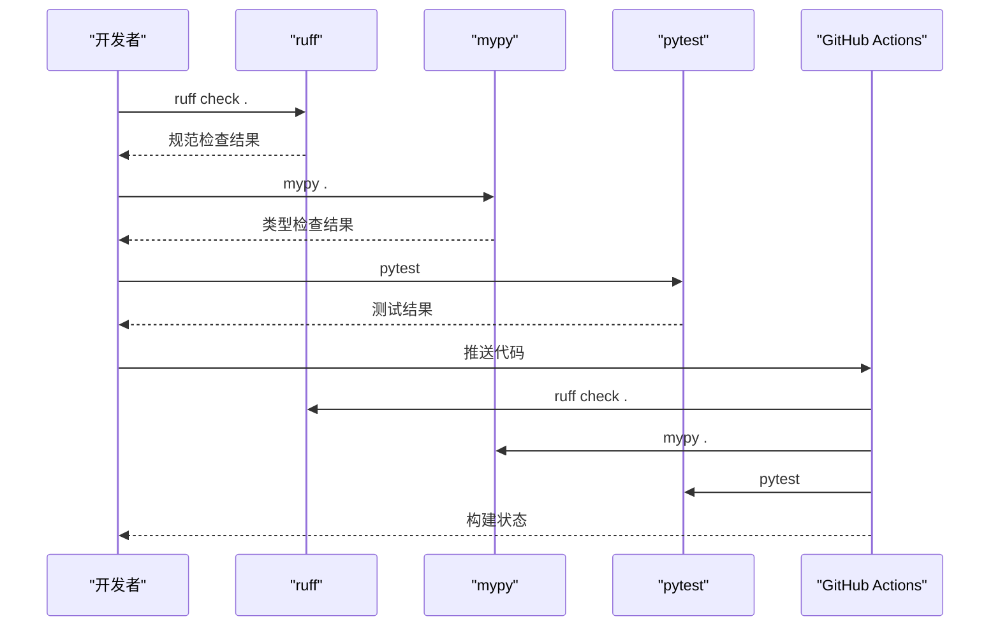
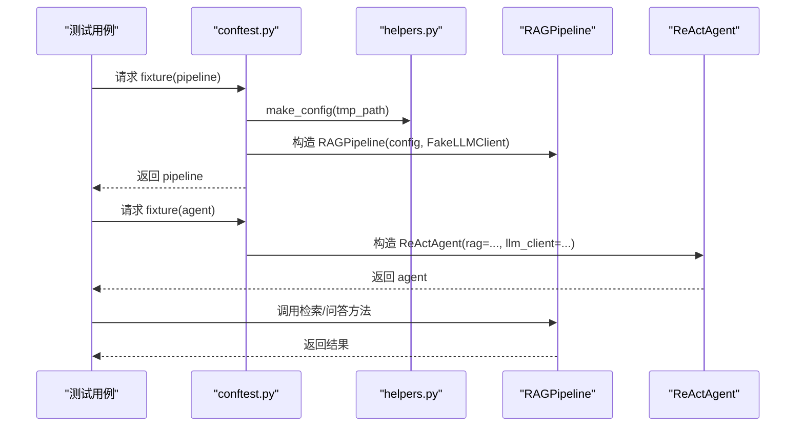
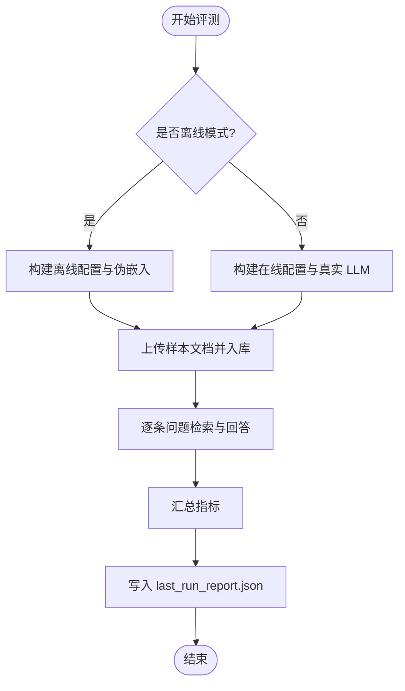
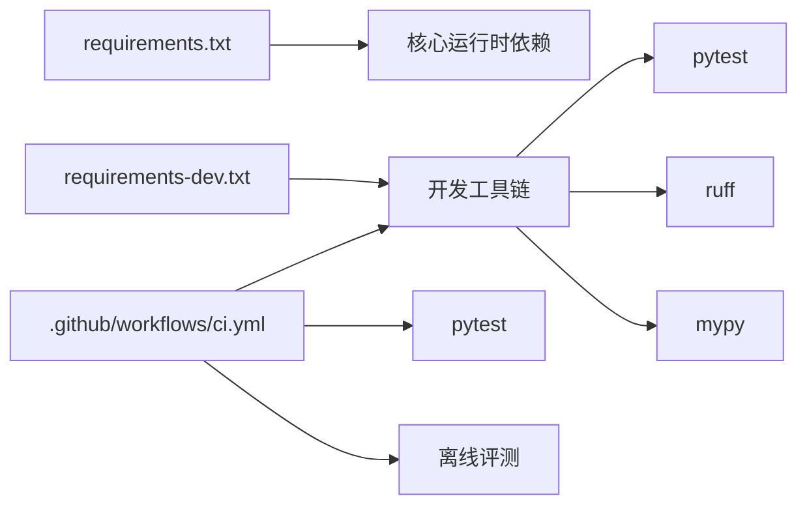

# 开发环境搭建

<cite>
**本文引用的文件**
- [README.md](file://README.md)
- [pyproject.toml](file://pyproject.toml)
- [requirements.txt](file://requirements.txt)
- [requirements-dev.txt](file://requirements-dev.txt)
- [config.py](file://config.py)
- [api.py](file://api.py)
- [tests/conftest.py](file://tests/conftest.py)
- [tests/helpers.py](file://tests/helpers.py)
- [.github/workflows/ci.yml](file://.github/workflows/ci.yml)
- [evals/run_eval.py](file://evals/run_eval.py)
</cite>

## 目录
1. [简介](#简介)
2. [项目结构](#项目结构)
3. [核心组件](#核心组件)
4. [架构总览](#架构总览)
5. [详细组件分析](#详细组件分析)
6. [依赖关系分析](#依赖关系分析)
7. [性能注意事项](#性能注意事项)
8. [故障排查指南](#故障排查指南)
9. [结论](#结论)
10. [附录](#附录)

## 简介
本指南面向首次接触该项目的开发者，目标是帮助你在本地快速搭建可运行的开发环境，并掌握常用开发工具链（ruff、mypy、pytest）与 IDE 配置建议。项目基于 Python 3.10+，使用 FastAPI 暴露 REST API，Streamlit 提供交互界面，RAG 管线负责检索增强生成，Agent 通过 Function Calling 调用工具，评测模块支持离线/在线两种模式。

## 项目结构
- 应用入口与接口：app.py（Streamlit）、api.py（FastAPI）
- 核心逻辑：rag_pipeline.py、react_agent.py、llm_client.py、ingestion.py、store.py、vector_store.py
- 配置与环境：config.py（集中读取环境变量）、.env（由 README 指引复制）
- 测试与评测：tests/（pytest）、evals/（golden set 评测）
- 开发与 CI：pyproject.toml（pytest/ruff/mypy 配置）、requirements*.txt、.github/workflows/ci.yml

**图表来源**
- [README.md:25-91](file://README.md#L25-L91)
- [pyproject.toml:1-41](file://pyproject.toml#L1-L41)
- [requirements.txt:1-21](file://requirements.txt#L1-L21)
- [requirements-dev.txt:1-6](file://requirements-dev.txt#L1-L6)
- [config.py:1-113](file://config.py#L1-L113)
- [api.py:1-87](file://api.py#L1-L87)
- [.github/workflows/ci.yml:1-34](file://.github/workflows/ci.yml#L1-L34)

**章节来源**
- [README.md:25-91](file://README.md#L25-L91)
- [pyproject.toml:1-41](file://pyproject.toml#L1-L41)
- [requirements.txt:1-21](file://requirements.txt#L1-L21)
- [requirements-dev.txt:1-6](file://requirements-dev.txt#L1-L6)
- [config.py:1-113](file://config.py#L1-L113)
- [api.py:1-87](file://api.py#L1-L87)
- [.github/workflows/ci.yml:1-34](file://.github/workflows/ci.yml#L1-L34)

## 核心组件
- 运行环境与依赖
  - Python 版本要求：3.10+
  - 运行时依赖：langchain、chromadb、dashscope、openai、streamlit、fastapi、uvicorn、pypdf/docx2txt/pymupdf/rapidocr/onnxruntime/python-dotenv/rank-bm25/jieba/numpy 等
  - 开发依赖：pytest、ruff、mypy（在 requirements-dev.txt 中引入）
- 配置与环境变量
  - 所有可调参数集中在 config.py，通过环境变量或 .env 覆盖
  - 关键变量包括：DASHSCOPE_API_KEY、DASHSCOPE_BASE_URL、DASHSCOPE_CHAT_MODEL、DASHSCOPE_EMBEDDING_MODEL、CHUNK_SIZE、CHUNK_OVERLAP、RETRIEVAL_TOP_K、RETRIEVAL_FUSION_POOL、RETRIEVAL_RELEVANCE_THRESHOLD、RETRIEVAL_MMR_ENABLED、RETRIEVAL_MMR_LAMBDA、QUERY_REWRITE_ENABLED、HISTORY_MAX_TOKENS、RAG_CONTEXT_MAX_TOKENS、AGENT_MAX_STEPS、EMBEDDING_BATCH_SIZE、LOGO_PATH、KB_DB_PATH、CHROMA_DIR
- 服务与入口
  - Streamlit 界面：streamlit run app.py
  - FastAPI 服务：uvicorn api:app --host 0.0.0.0 --port 8000；可选启用 Bearer Token 鉴权（API_AUTH_TOKEN）
- 测试与评测
  - pytest：默认搜索 tests 目录，支持 -q --disable-warnings
  - 评测：evals/run_eval.py 支持 --offline 离线验证链路，或在线模式评估指标

**章节来源**
- [README.md:25-91](file://README.md#L25-L91)
- [requirements.txt:1-21](file://requirements.txt#L1-L21)
- [requirements-dev.txt:1-6](file://requirements-dev.txt#L1-L6)
- [config.py:1-113](file://config.py#L1-L113)
- [api.py:1-87](file://api.py#L1-L87)
- [pyproject.toml:1-41](file://pyproject.toml#L1-L41)
- [evals/run_eval.py:1-179](file://evals/run_eval.py#L1-L179)

## 架构总览
下图展示开发环境中的主要组件与交互关系：IDE/终端驱动 ruff/mypy/pytest；应用层通过 FastAPI/Streamlit 暴露能力；RAG 管线与 Agent 协同工作；配置集中于 config.py；CI 流水线复用相同工具链。

**图表来源**
- [pyproject.toml:1-41](file://pyproject.toml#L1-L41)
- [requirements-dev.txt:1-6](file://requirements-dev.txt#L1-L6)
- [config.py:1-113](file://config.py#L1-L113)
- [api.py:1-87](file://api.py#L1-L87)
- [.github/workflows/ci.yml:1-34](file://.github/workflows/ci.yml#L1-L34)

## 详细组件分析

### 虚拟环境与依赖安装
- 创建虚拟环境
  - Windows PowerShell：.\.venv\Scripts\Activate.ps1
  - macOS/Linux：source .venv/bin/activate
- 安装依赖
  - 生产依赖：pip install -r requirements.txt
  - 开发依赖：pip install -r requirements-dev.txt
- 启动方式
  - Streamlit：streamlit run app.py
  - FastAPI：uvicorn api:app --host 0.0.0.0 --port 8000

**章节来源**
- [README.md:25-45](file://README.md#L25-L45)
- [requirements.txt:1-21](file://requirements.txt#L1-L21)
- [requirements-dev.txt:1-6](file://requirements-dev.txt#L1-L6)
- [api.py:1-14](file://api.py#L1-L14)

### 环境变量与配置说明
- 配置文件位置与加载
  - config.py 在导入时自动加载 .env（dotenv），并提供 AppConfig.from_env() 从环境变量构建配置
- 必填与常用变量
  - DASHSCOPE_API_KEY：必填，阿里云百炼密钥
  - DASHSCOPE_BASE_URL、DASHSCOPE_CHAT_MODEL、DASHSCOPE_EMBEDDING_MODEL：模型与接口地址
  - CHUNK_SIZE、CHUNK_OVERLAP：文本切分参数
  - RETRIEVAL_TOP_K、RETRIEVAL_FUSION_POOL、RETRIEVAL_RELEVANCE_THRESHOLD：检索相关
  - RETRIEVAL_MMR_ENABLED、RETRIEVAL_MMR_LAMBDA：去重重排开关与权重
  - QUERY_REWRITE_ENABLED：多轮对话改写开关
  - HISTORY_MAX_TOKENS、RAG_CONTEXT_MAX_TOKENS：上下文 token 预算
  - AGENT_MAX_STEPS：Agent 最大工具调用轮数
  - EMBEDDING_BATCH_SIZE：向量化批量大小（上限 20）
  - KB_DB_PATH、CHROMA_DIR：数据库与向量存储路径
  - LOGO_PATH：页面 Logo 路径（可选）
  - API_AUTH_TOKEN：FastAPI 鉴权 Token（可选）
- 路径解析与默认值
  - 相对路径会相对于项目根目录解析；未设置时使用 data 子目录下的默认路径

**图表来源**
- [config.py:1-113](file://config.py#L1-L113)

**章节来源**
- [config.py:1-113](file://config.py#L1-L113)
- [README.md:93-115](file://README.md#L93-L115)

### 代码检查与类型检查（ruff、mypy）
- ruff
  - 行宽限制：100
  - 目标版本：py310
  - 规则集：E/F/I/UP/B/SIM，忽略 E501
  - 用法：ruff check .
- mypy
  - Python 版本：3.10
  - 忽略缺失导入，严格可选类型提示
  - 排除 tests 目录，仅对主模块进行类型检查
  - 用法：mypy .
- CI 集成
  - GitHub Actions 在 push/PR 时执行 ruff、mypy、pytest 与离线评测

**图表来源**
- [pyproject.toml:1-41](file://pyproject.toml#L1-L41)
- [.github/workflows/ci.yml:1-34](file://.github/workflows/ci.yml#L1-L34)

**章节来源**
- [pyproject.toml:1-41](file://pyproject.toml#L1-L41)
- [.github/workflows/ci.yml:1-34](file://.github/workflows/ci.yml#L1-L34)

### 测试框架（pytest）
- 配置
  - 测试路径：tests
  - 默认选项：-q --disable-warnings
- 夹具与假实现
  - conftest.py 提供 pipeline 与 agent 夹具，注入 FakeLLMClient
  - helpers.py 提供确定性 FakeEmbeddings、FakeLLMClient、make_config 等
- 运行
  - pytest 直接运行全部离线测试

**图表来源**
- [tests/conftest.py:1-23](file://tests/conftest.py#L1-L23)
- [tests/helpers.py:1-166](file://tests/helpers.py#L1-L166)
- [pyproject.toml:1-4](file://pyproject.toml#L1-L4)

**章节来源**
- [pyproject.toml:1-4](file://pyproject.toml#L1-L4)
- [tests/conftest.py:1-23](file://tests/conftest.py#L1-L23)
- [tests/helpers.py:1-166](file://tests/helpers.py#L1-L166)

### 评测脚本（evals）
- 功能
  - 支持离线模式（--offline）验证链路，不调用真实 LLM
  - 在线模式评估 hit@k、keyword_hit、citation 等指标
- 数据
  - golden_set.json 定义问题、期望来源与关键词
  - 样本文档位于 evals/sample_docs
- 输出
  - 报告写入 evals/last_run_report.json

**图表来源**
- [evals/run_eval.py:1-179](file://evals/run_eval.py#L1-L179)

**章节来源**
- [evals/run_eval.py:1-179](file://evals/run_eval.py#L1-L179)

### IDE 配置建议（VS Code、PyCharm）
- Python 解释器
  - 选择项目虚拟环境中的 Python 解释器（确保 3.10+）
- 代码格式化
  - 推荐启用 ruff 作为格式化工具，行宽 100，目标 py310
  - VS Code：安装 ruff 扩展，设置编辑器保存时格式化
  - PyCharm：设置外部工具为 ruff，绑定到保存动作
- 自动补全与语言服务器
  - 启用 Pylance（VS Code）或内置语言服务器（PyCharm）
  - 确保 mypy 已安装以获取更严格的类型提示
- 调试配置
  - Streamlit：添加启动命令 streamlit run app.py
  - FastAPI：添加启动命令 uvicorn api:app --host 0.0.0.0 --port 8000
  - 单元测试：配置 pytest 运行器指向 tests 目录
- 代码检查
  - 将 ruff check 与 mypy 加入任务或预提交钩子，保证提交前质量

[本节为通用实践建议，不直接分析具体文件]

## 依赖关系分析
- 运行时依赖
  - langchain、langchain-community、langchain-text-splitters
  - chromadb、dashscope、openai
  - streamlit、fastapi、uvicorn、python-multipart
  - pypdf、docx2txt、pymupdf、rapidocr、onnxruntime
  - python-dotenv、rank-bm25、jieba、numpy
- 开发依赖
  - pytest、ruff、mypy（通过 requirements-dev.txt 引入）
- CI 依赖
  - GitHub Actions 使用 setup-python 3.10，安装 requirements-dev.txt，依次执行 ruff、mypy、pytest、离线评测

**图表来源**
- [requirements.txt:1-21](file://requirements.txt#L1-L21)
- [requirements-dev.txt:1-6](file://requirements-dev.txt#L1-L6)
- [.github/workflows/ci.yml:1-34](file://.github/workflows/ci.yml#L1-L34)

**章节来源**
- [requirements.txt:1-21](file://requirements.txt#L1-L21)
- [requirements-dev.txt:1-6](file://requirements-dev.txt#L1-L6)
- [.github/workflows/ci.yml:1-34](file://.github/workflows/ci.yml#L1-L34)

## 性能注意事项
- 向量化批量大小
  - EMBEDDING_BATCH_SIZE 默认 16，上限 20，避免超出 DashScope 单次限制导致报错
- 检索阈值与重排
  - RETRIEVAL_RELEVANCE_THRESHOLD 控制相关性门槛；MMR 权重影响多样性与相关性平衡
- 上下文长度
  - HISTORY_MAX_TOKENS 与 RAG_CONTEXT_MAX_TOKENS 需根据模型上下文窗口与成本权衡
- 并发与锁
  - 当前 FastAPI 使用全局锁串行化读写，避免 SQLite/Chroma 并发访问问题；多租户与队列属后续阶段

**章节来源**
- [config.py:90-113](file://config.py#L90-L113)
- [api.py:1-14](file://api.py#L1-L14)

## 故障排查指南
- 无法连接 DashScope
  - 检查 DASHSCOPE_API_KEY 与 DASHSCOPE_BASE_URL 是否正确
  - 确认网络可达且密钥有效
- Embedding 批量过大
  - 调整 EMBEDDING_BATCH_SIZE ≤ 20，避免“batch size should not be larger than 20”错误
- 路径解析异常
  - 若 KB_DB_PATH/CHROMA_DIR 为相对路径，将被解析为项目根目录下的 data 子目录；如需绝对路径请显式设置
- 鉴权失败
  - 启用 API_AUTH_TOKEN 后，所有 /v1 接口需要 Authorization: Bearer <token>；未设置则放行（仅本机/内网调试）
- 测试失败
  - 确认 pytest 能发现 tests 目录；必要时使用 -v 查看详细输出
  - 使用 conftest.py 提供的夹具与 helpers.py 的假实现，确保离线测试稳定
- 评测报告为空或指标异常
  - 离线模式不调用 LLM，仅验证链路；在线模式需正确配置模型与密钥
  - 检查 golden_set.json 与 sample_docs 是否存在

**章节来源**
- [config.py:1-113](file://config.py#L1-L113)
- [api.py:1-87](file://api.py#L1-L87)
- [tests/conftest.py:1-23](file://tests/conftest.py#L1-L23)
- [tests/helpers.py:1-166](file://tests/helpers.py#L1-L166)
- [evals/run_eval.py:1-179](file://evals/run_eval.py#L1-L179)

## 结论
通过本指南，你可以在本地快速搭建可用的开发环境，完成依赖安装、环境变量配置、IDE 设置与工具链集成。结合 pytest、ruff、mypy 与 CI 流程，能够保障代码质量与稳定性。按照配置说明调整检索与 Agent 行为，即可在不同场景下获得更好的效果。

## 附录
- 快速命令参考
  - 创建虚拟环境并激活（Windows/macOS/Linux）
  - 安装依赖：pip install -r requirements.txt 与 pip install -r requirements-dev.txt
  - 启动 Streamlit：streamlit run app.py
  - 启动 FastAPI：uvicorn api:app --host 0.0.0.0 --port 8000
  - 运行测试：pytest
  - 代码检查：ruff check . 与 mypy .
  - 评测：python evals/run_eval.py 或 python evals/run_eval.py --offline

**章节来源**
- [README.md:25-91](file://README.md#L25-L91)
- [pyproject.toml:1-41](file://pyproject.toml#L1-L41)
- [requirements.txt:1-21](file://requirements.txt#L1-L21)
- [requirements-dev.txt:1-6](file://requirements-dev.txt#L1-L6)
- [evals/run_eval.py:1-179](file://evals/run_eval.py#L1-L179)