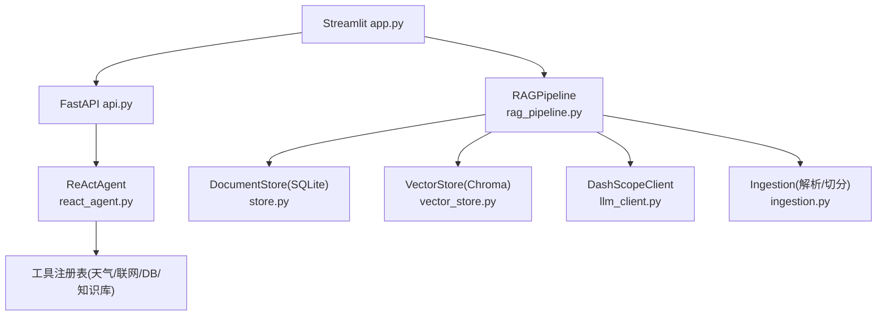
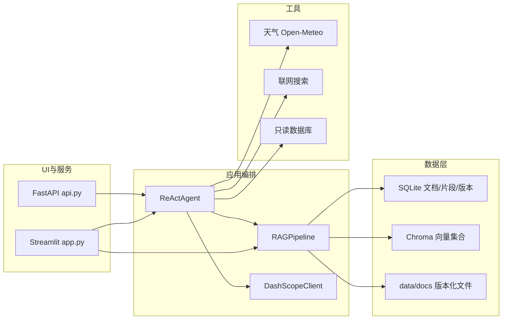
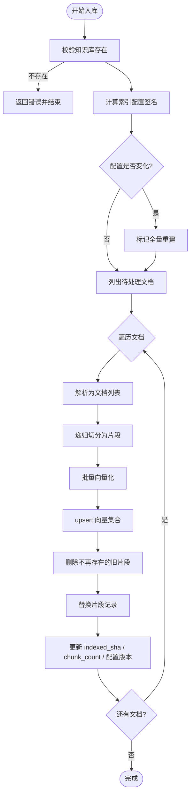
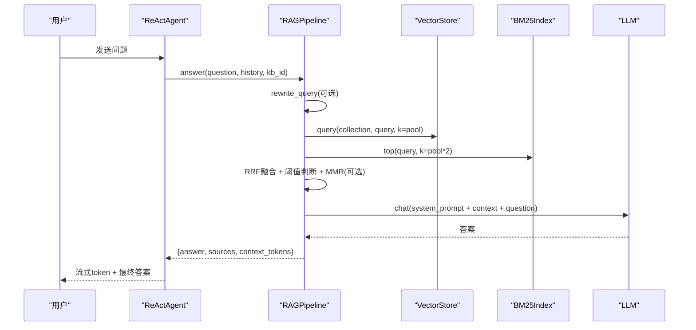
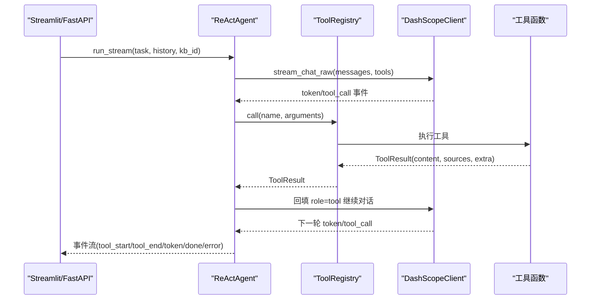
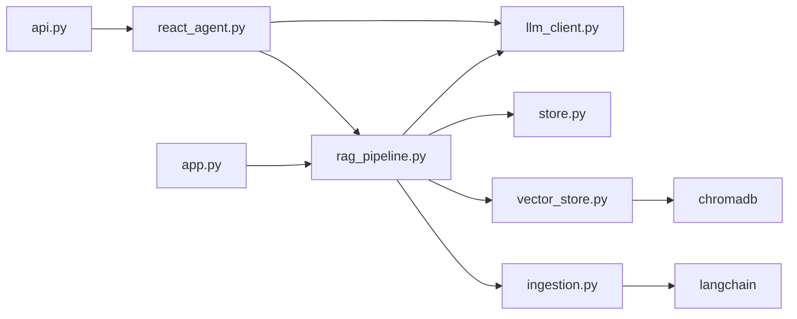

# 新功能开发流程

<cite>
**本文引用的文件**
- [README.md](file://README.md)
- [pyproject.toml](file://pyproject.toml)
- [config.py](file://config.py)
- [app.py](file://app.py)
- [api.py](file://api.py)
- [rag_pipeline.py](file://rag_pipeline.py)
- [react_agent.py](file://react_agent.py)
- [store.py](file://store.py)
- [vector_store.py](file://vector_store.py)
- [ingestion.py](file://ingestion.py)
- [llm_client.py](file://llm_client.py)
- [utils/logger.py](file://utils/logger.py)
- [tests/conftest.py](file://tests/conftest.py)
- [tests/helpers.py](file://tests/helpers.py)
- [.github/workflows/ci.yml](file://.github/workflows/ci.yml)
- [docs/ARCHITECTURE.md](file://docs/ARCHITECTURE.md)
</cite>

## 目录
1. [引言](#引言)
2. [项目结构](#项目结构)
3. [核心组件](#核心组件)
4. [架构总览](#架构总览)
5. [详细组件分析](#详细组件分析)
6. [依赖关系分析](#依赖关系分析)
7. [性能与可观测性](#性能与可观测性)
8. [故障排除指南](#故障排除指南)
9. [结论](#结论)
10. [附录：从需求到上线的完整案例](#附录从需求到上线的完整案例)

## 引言
本文件面向“新功能开发”的全流程标准操作程序（SOP），覆盖从需求评估、技术方案设计、设计文档编写，到分支管理、代码实现规范、单测与集成测试、扩展点使用、调试与排障、提交与评审流程，以及一个端到端的功能开发案例。内容基于当前仓库的实际实现，确保每一步都有可落地的依据与参考路径。

## 项目结构
本项目采用分层与按职责划分相结合的组织方式：
- 应用层：Streamlit 界面 app.py、FastAPI 服务 api.py
- 业务编排：RAG 管线 rag_pipeline.py、Agent 编排 react_agent.py
- 数据层：SQLite 元数据存储 store.py、Chroma 向量存储 vector_store.py、本地文件 ingestion.py
- 模型接入：DashScope 客户端 llm_client.py
- 配置与工具：集中配置 config.py、日志 utils/logger.py
- 质量保障：pytest 测试、ruff/mypy 检查、CI 流水线
- 文档：架构说明 docs/ARCHITECTURE.md 与学习指南

图表来源
- [app.py:1-352](file://app.py#L1-L352)
- [api.py:1-204](file://api.py#L1-L204)
- [rag_pipeline.py:1-792](file://rag_pipeline.py#L1-L792)
- [react_agent.py:1-567](file://react_agent.py#L1-L567)
- [store.py:1-470](file://store.py#L1-L470)
- [vector_store.py:1-255](file://vector_store.py#L1-L255)
- [ingestion.py:1-216](file://ingestion.py#L1-L216)
- [llm_client.py:1-322](file://llm_client.py#L1-L322)

章节来源
- [README.md:116-134](file://README.md#L116-L134)
- [docs/ARCHITECTURE.md:13-57](file://docs/ARCHITECTURE.md#L13-L57)

## 核心组件
- 配置中心 AppConfig：集中读取环境变量，冻结 dataclass，避免运行时被意外修改；支持数据目录、向量库路径、检索参数、上下文预算等全部可调。
- 文档入库 Ingestion：PDF/Word/Markdown/TXT 解析，PDF 文本质量检测与本地 OCR 兜底，递归字符切分，生成片段元数据。
- 向量存储 VectorStore：Chroma 封装，批量 upsert、条件删除、相似度查询、取回原始向量用于 MMR。
- 元数据存储 DocumentStore：SQLite WAL 模式，多知识库、文档版本、片段、键值配置；线程安全写锁。
- RAG 管线 RAGPipeline：知识库管理、增量入库、混合检索（向量+BM25+RRF+MMR）、查询改写、带引用问答。
- Agent ReActAgent：Function Calling 工具注册表、多步循环、流式事件输出；内置知识库、天气、联网搜索、只读数据库工具。
- 模型接入 DashScopeClient：统一 chat/chat_raw/stream_chat/embeddings/web_search，异常安全包装与用量记录。
- 服务层 FastAPI：REST 接口 + Bearer Token 鉴权，串行化访问 SQLite/Chroma。
- 日志与估算：AgentTraceLogger JSONL 轨迹日志；estimate_tokens 轻量 token 估算。

章节来源
- [config.py:56-113](file://config.py#L56-L113)
- [ingestion.py:24-216](file://ingestion.py#L24-L216)
- [vector_store.py:38-149](file://vector_store.py#L38-L149)
- [store.py:123-470](file://store.py#L123-L470)
- [rag_pipeline.py:196-792](file://rag_pipeline.py#L196-L792)
- [react_agent.py:93-567](file://react_agent.py#L93-L567)
- [llm_client.py:22-322](file://llm_client.py#L22-L322)
- [api.py:31-204](file://api.py#L31-L204)
- [utils/logger.py:12-63](file://utils/logger.py#L12-L63)

## 架构总览
阶段 A 的目标是构建可靠的单机产品：检索质量可调、数据可管理、Agent 真实可用、可测试、可演进。整体由 UI/服务层、应用编排层、数据层与工具层组成，通过清晰的接口与协议解耦。

图表来源
- [docs/ARCHITECTURE.md:13-57](file://docs/ARCHITECTURE.md#L13-L57)
- [app.py:1-352](file://app.py#L1-L352)
- [api.py:1-204](file://api.py#L1-L204)
- [rag_pipeline.py:1-792](file://rag_pipeline.py#L1-L792)
- [react_agent.py:1-567](file://react_agent.py#L1-L567)

## 详细组件分析

### 配置与环境变量
- 所有可调参数集中在 AppConfig，支持环境变量覆盖，冻结对象防止运行时篡改。
- 关键参数包括 chunk_size/chunk_overlap、top_k/fusion_pool、relevance_threshold、mmr_enabled/mmr_lambda、history_max_tokens、rag_context_max_tokens、agent_max_steps、embedding_batch_size 等。
- 路径类参数支持相对/绝对路径解析，便于测试注入临时目录。

章节来源
- [config.py:21-54](file://config.py#L21-L54)
- [config.py:56-113](file://config.py#L56-L113)

### 文档入库与切分
- 支持 PDF/Word/Markdown/TXT；PDF 逐页检测可读性，低于阈值走本地 OCR。
- 切分使用递归字符分割器，保留 page/paragraph 等元数据。
- 入库时先写入新向量，再清理旧片段 id，保证中间失败不产生“有片段无向量”的不一致状态。

图表来源
- [rag_pipeline.py:306-435](file://rag_pipeline.py#L306-L435)
- [ingestion.py:24-216](file://ingestion.py#L24-L216)

章节来源
- [ingestion.py:24-216](file://ingestion.py#L24-L216)
- [rag_pipeline.py:306-435](file://rag_pipeline.py#L306-L435)

### 混合检索与问答
- 混合检索：向量 Top-N + BM25 Top-N → RRF 融合 → 可选 MMR 去重 → 最终 Top-K。
- 相关性门槛：若最高向量相似度低于阈值且 BM25 无命中，视为无相关内容。
- 来源限定：当问题中出现文件名或人物短名时，自动限定检索范围到该文档，降低幻觉。
- 问答：组装带引用的上下文块，调用 LLM 生成回答，返回 sources 与 token 用量估计。

图表来源
- [rag_pipeline.py:439-696](file://rag_pipeline.py#L439-L696)
- [react_agent.py:272-370](file://react_agent.py#L272-L370)
- [llm_client.py:94-201](file://llm_client.py#L94-L201)

章节来源
- [rag_pipeline.py:439-696](file://rag_pipeline.py#L439-L696)

### Agent 工具注册与执行
- 工具注册表 ToolRegistry：以装饰器注册工具，生成 OpenAI tools 格式，按名称调用。
- 内置工具：search_knowledge_base、get_weather、search_web、query_database（只读）。
- 主循环 run_stream：流式获取 tool_call 与 token，执行工具后回填 role=tool 消息，最多 max_steps 轮。

图表来源
- [react_agent.py:93-370](file://react_agent.py#L93-L370)
- [llm_client.py:203-278](file://llm_client.py#L203-L278)

章节来源
- [react_agent.py:93-370](file://react_agent.py#L93-L370)

### 数据存储与并发
- SQLite 使用 WAL 模式与 busy_timeout，读写分离友好；写操作加 RLock。
- 向量库 Chroma 每个知识库独立 collection，支持批量 upsert、条件删除、取回向量。
- 后台入库使用独立 RAGPipeline 实例，完成后刷新主实例（重置向量客户端、失效缓存）。

章节来源
- [store.py:123-155](file://store.py#L123-L155)
- [vector_store.py:38-149](file://vector_store.py#L38-L149)
- [rag_pipeline.py:720-732](file://rag_pipeline.py#L720-L732)

### 服务层与鉴权
- FastAPI 提供 /v1 路由前缀，支持 Bearer Token 鉴权（未配置则放行，仅建议本机/内网调试）。
- 全局 RLock 串行化访问 SQLite/Chroma，避免并发问题。
- 上传文档与入库接口复用同一套 RAGPipeline 逻辑。

章节来源
- [api.py:1-204](file://api.py#L1-L204)

## 依赖关系分析
- 模块耦合：
  - app.py/api.py 依赖 rag_pipeline.py 与 react_agent.py 暴露能力。
  - rag_pipeline.py 依赖 llm_client.py、store.py、vector_store.py、ingestion.py、utils/logger.py。
  - react_agent.py 依赖 llm_client.py、rag_pipeline.py、utils/logger.py。
  - vector_store.py 依赖 chromadb 与嵌入函数（DashScope 或 Mock）。
  - store.py 依赖 sqlite3。
- 外部依赖：
  - DashScope 模型与 Embedding 接口。
  - Chroma 向量库。
  - LangChain 文档加载与切分。
  - PyMuPDF/RapidOCR（PDF OCR 可选）。
  - Open-Meteo（天气工具）。

图表来源
- [app.py:1-352](file://app.py#L1-L352)
- [api.py:1-204](file://api.py#L1-L204)
- [rag_pipeline.py:1-792](file://rag_pipeline.py#L1-L792)
- [react_agent.py:1-567](file://react_agent.py#L1-L567)
- [vector_store.py:1-255](file://vector_store.py#L1-L255)
- [ingestion.py:1-216](file://ingestion.py#L1-L216)

章节来源
- [rag_pipeline.py:17-39](file://rag_pipeline.py#L17-L39)
- [react_agent.py:16-30](file://react_agent.py#L16-L30)

## 性能与可观测性
- 性能要点：
  - 向量批量大小受限于 DashScope 单次上限（默认 16，钳制到 20）。
  - 历史与上下文 token 预算截断，避免注意力稀释与成本浪费。
  - 后台入库独立实例，避免阻塞前台聊天。
- 可观测性：
  - AgentTraceLogger 记录每步工具调用、观察结果与成本估算。
  - estimate_tokens 用于历史/上下文裁剪。
  - 向量得分、BM25 得分、RRF 得分在 sources 中暴露，便于 UI 展示与分析。

章节来源
- [config.py:90-113](file://config.py#L90-L113)
- [rag_pipeline.py:159-193](file://rag_pipeline.py#L159-L193)
- [utils/logger.py:12-63](file://utils/logger.py#L12-L63)
- [rag_pipeline.py:614-666](file://rag_pipeline.py#L614-L666)

## 故障排除指南
- 常见问题定位：
  - 模型连接失败：检查 DASHSCOPE_API_KEY、DASHSCOPE_BASE_URL、DASHSCOPE_CHAT_MODEL。
  - 向量入库报错：确认 EMBEDDING_BATCH_SIZE 不超过 20；检查 PDF 解析与 OCR 依赖。
  - 检索无结果：调整 relevance_threshold、fusion_pool、top_k；检查 BM25 索引是否重建。
  - Agent 工具失败：查看工具返回 observation 与日志；网络请求超时或参数错误会回填给模型重试。
- 日志与诊断：
  - 查看 data/agent_trace.jsonl 中的步骤轨迹与成本估算。
  - 使用 ruff check 与 mypy 进行静态检查；运行 pytest 离线验证链路。
  - 使用 evals/run_eval.py --offline 做离线冒烟评测。

章节来源
- [llm_client.py:22-67](file://llm_client.py#L22-L67)
- [ingestion.py:40-150](file://ingestion.py#L40-L150)
- [rag_pipeline.py:439-523](file://rag_pipeline.py#L439-L523)
- [react_agent.py:371-470](file://react_agent.py#L371-L470)
- [utils/logger.py:12-63](file://utils/logger.py#L12-L63)
- [.github/workflows/ci.yml:20-33](file://.github/workflows/ci.yml#L20-L33)

## 结论
本项目提供了从配置、入库、检索、问答到 Agent 工具调用的完整闭环，具备高可配置性与可测试性。新功能开发应遵循本文档的流程与规范，充分利用现有扩展点（工具注册表、配置项、解析/切分、存储后端）进行渐进式演进，并通过 CI 与评测保障质量。

## 附录：从需求到上线的完整案例
以下以一个典型功能为例，展示从需求到上线的完整过程。你可以将“新增检索算法”、“新增工具函数”、“扩展存储后端”等替换为你的实际需求。

- 需求分析与可行性评估
  - 明确目标：例如“提升精确术语召回率”。
  - 可行性：当前已支持 BM25 + RRF + MMR；可通过新增关键词加权或引入领域词典增强 BM25 权重。
  - 影响面：主要影响检索层与配置项，对入库与 Agent 影响较小。

- 技术方案与设计文档
  - 方案：在 BM25Index 中增加字段权重或短语匹配策略；新增配置项控制权重与开关。
  - 设计：在 config.py 新增配置；在 rag_pipeline.py 的 retrieve 中读取配置并应用到 BM25；在 tests 中覆盖边界情况。
  - 风险：权重过高可能压制语义检索；需通过阈值与融合策略平衡。

- 分支管理与开发步骤
  - 分支：feature/add-bm25-weighting
  - 变更：config.py、rag_pipeline.py、tests/test_retrieval.py
  - 提交：小步提交，每条 commit 聚焦单一变更；附带测试用例。

- 代码实现规范
  - 类型注解与 docstring；遵循 ruff 规则；避免魔法数字，使用 AppConfig。
  - 错误处理：对外抛出可读错误，内部捕获并记录日志。

- 单元测试与集成测试
  - 单测：构造不同查询与文档，验证 BM25 权重生效；覆盖空查询、低相关度、BM25 强命中场景。
  - 集成：使用 FakeLLMClient 与 FakeEmbeddings 跑通入库→检索→问答链路。

- 代码审查与合并
  - PR 描述：说明动机、方案、影响、测试覆盖。
  - 审查要点：正确性、性能、可维护性、向后兼容。
  - CI：ruff/mypy/pytest/offline eval 均通过。

- 上线与监控
  - 部署：更新 .env 配置项；重启服务。
  - 监控：观察 sources 中 bm25_score 与 rrf_score 分布；收集 agent_trace.jsonl 分析工具调用与成本。
  - 回滚：如效果不达预期，快速回退配置或代码。

- 扩展现有功能的通用方法
  - 新增检索算法：在 rag_pipeline.py 的 retrieve 中插入新算法，参与 RRF 融合；新增配置项；补充测试。
  - 新增工具函数：在 react_agent.py 的 _build_registry 中注册工具，定义 JSON Schema 与函数体；补充测试与日志。
  - 扩展存储后端：抽象 DocumentStore/VectorStore 接口，实现新后端；在 RAGPipeline 中注入；逐步切换并对比指标。

- 调试技巧与故障排除
  - 日志：查看 agent_trace.jsonl 与 sources 得分；定位哪一步导致效果下降。
  - 性能：调整 embedding_batch_size、top_k、fusion_pool；观察首字延迟与 token 用量。
  - 内存泄漏：避免长生命周期大对象；后台入库使用独立实例；及时 reset 向量客户端。

章节来源
- [rag_pipeline.py:439-696](file://rag_pipeline.py#L439-L696)
- [react_agent.py:165-246](file://react_agent.py#L165-L246)
- [config.py:90-113](file://config.py#L90-L113)
- [tests/conftest.py:1-23](file://tests/conftest.py#L1-L23)
- [tests/helpers.py:16-166](file://tests/helpers.py#L16-L166)
- [utils/logger.py:12-63](file://utils/logger.py#L12-L63)
- [.github/workflows/ci.yml:20-33](file://.github/workflows/ci.yml#L20-L33)