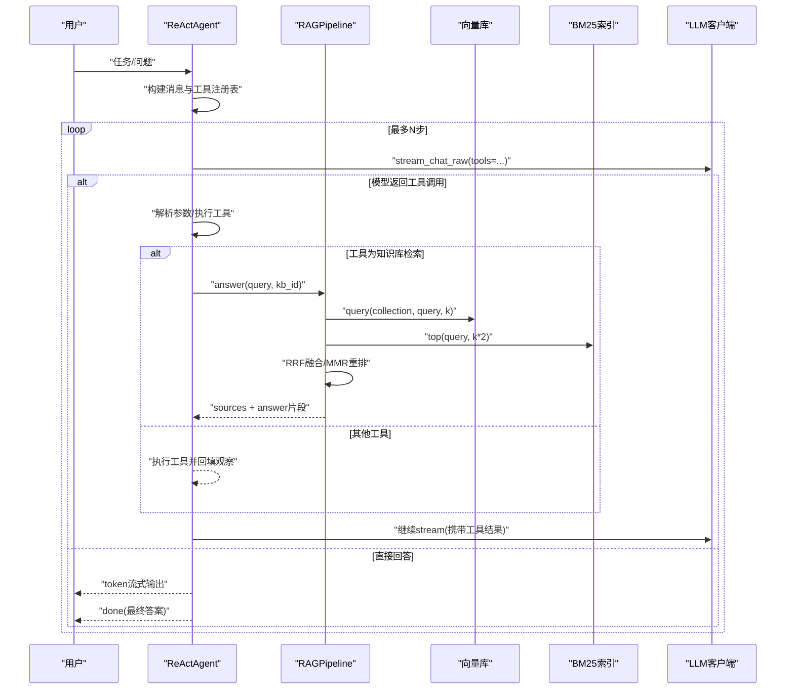
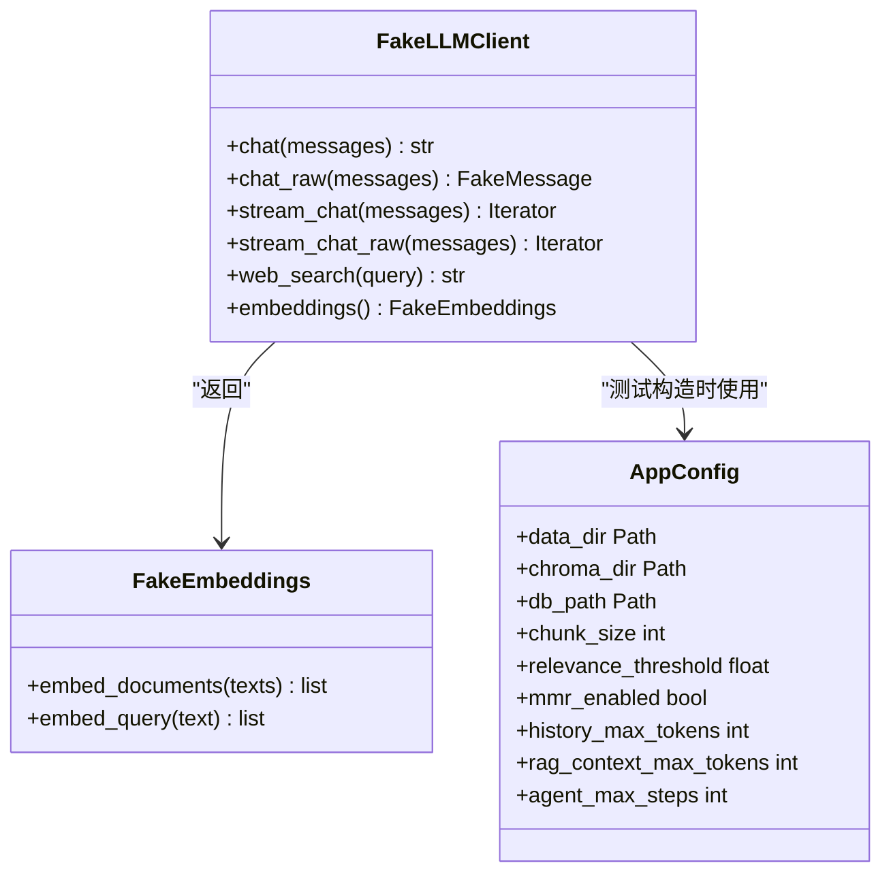
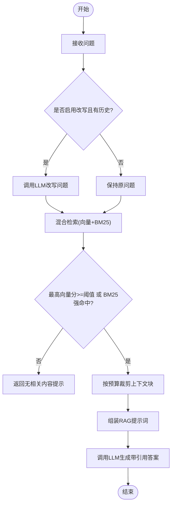
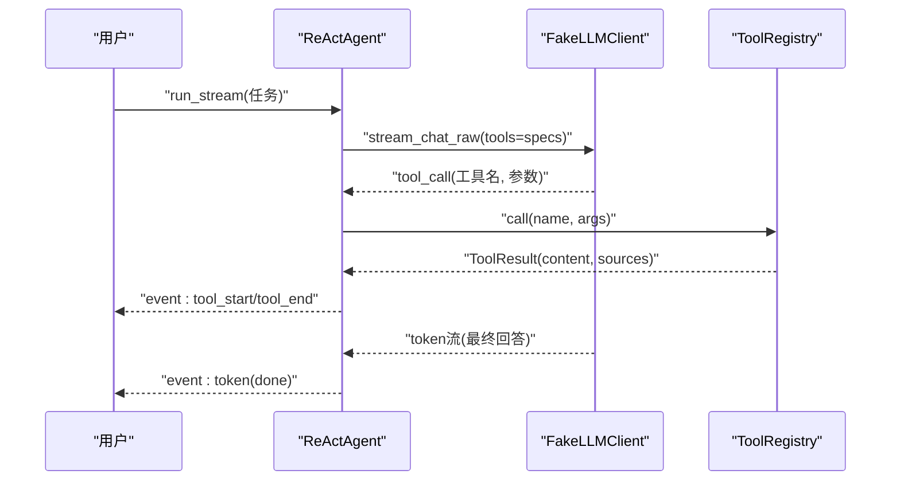
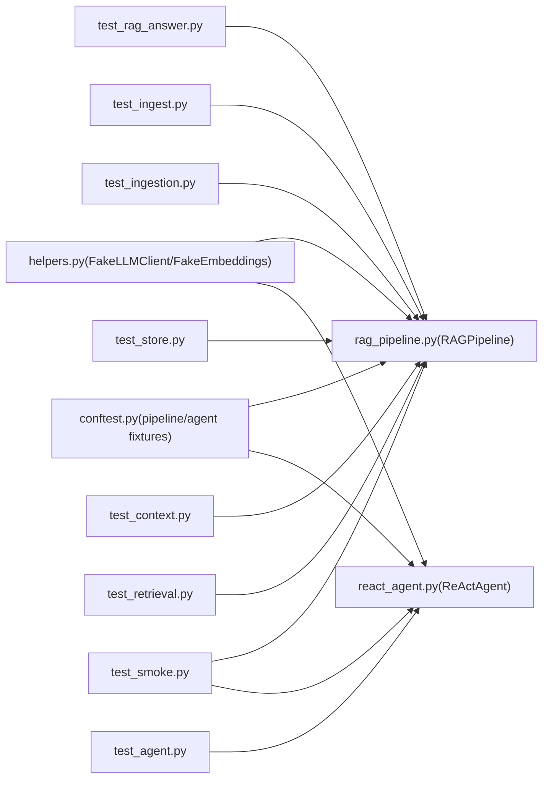

# 测试指南

<cite>
**本文引用的文件**
- [tests/conftest.py](file://tests/conftest.py)
- [tests/helpers.py](file://tests/helpers.py)
- [tests/test_agent.py](file://tests/test_agent.py)
- [tests/test_rag_answer.py](file://tests/test_rag_answer.py)
- [tests/test_retrieval.py](file://tests/test_retrieval.py)
- [tests/test_ingestion.py](file://tests/test_ingestion.py)
- [tests/test_store.py](file://tests/test_store.py)
- [tests/test_context.py](file://tests/test_context.py)
- [tests/test_ingest.py](file://tests/test_ingest.py)
- [tests/test_smoke.py](file://tests/test_smoke.py)
- [rag_pipeline.py](file://rag_pipeline.py)
- [react_agent.py](file://react_agent.py)
- [config.py](file://config.py)
- [pyproject.toml](file://pyproject.toml)
- [.github/workflows/ci.yml](file://.github/workflows/ci.yml)
- [evals/README.md](file://evals/README.md)
- [evals/run_eval.py](file://evals/run_eval.py)
</cite>

## 目录
1. [简介](#简介)
2. [项目结构](#项目结构)
3. [核心组件](#核心组件)
4. [架构总览](#架构总览)
5. [详细组件分析](#详细组件分析)
6. [依赖关系分析](#依赖关系分析)
7. [性能与基准测试](#性能与基准测试)
8. [故障排查指南](#故障排查指南)
9. [结论](#结论)
10. [附录：用例清单与最佳实践](#附录用例清单与最佳实践)

## 简介
本指南面向RAG与Agent功能的测试实践，覆盖单元测试、集成测试与端到端测试的编写方法；详细说明pytest夹具与Mock策略、测试数据管理；给出检索准确性、生成质量与性能基准测试方案；提供Agent工具调用、多轮对话与流式输出的测试方法；总结命名规范、断言策略与异常覆盖；并包含自动化配置、持续集成与报告生成的落地建议。

## 项目结构
仓库采用“功能模块 + tests”分层组织，测试集中在tests目录，通过conftest集中装配测试夹具，helpers提供可复用的假LLM、嵌入与临时配置。评测脚本位于evals，用于离线/在线评测与指标输出。CI在GitHub Actions中执行lint、类型检查、测试与离线评测。

```mermaid
graph TB
subgraph "应用"
RP["RAGPipeline"]
RA["ReActAgent"]
CFG["AppConfig"]
end
subgraph "测试"
CF["conftest.py"]
HP["helpers.py"]
TA["test_agent.py"]
TR["test_rag_answer.py"]
TI["test_ingest.py"]
TIG["test_ingestion.py"]
TS["test_store.py"]
TC["test_context.py"]
TRV["test_retrieval.py"]
SM["test_smoke.py"]
end
subgraph "评测"
ER["evals/run_eval.py"]
end
subgraph "CI"
CI[".github/workflows/ci.yml"]
end
CF --> RP
CF --> RA
HP --> RP
HP --> RA
TA --> RA
TR --> RP
TI --> RP
TIG --> RP
TS --> RP
TC --> RP
TRV --> RP
SM --> RP
SM --> RA
ER --> RP
CI --> |"pytest / ruff / mypy / evals"| RP
```

图表来源
- [tests/conftest.py:12-22](file://tests/conftest.py#L12-L22)
- [tests/helpers.py:16-157](file://tests/helpers.py#L16-L157)
- [rag_pipeline.py:196-792](file://rag_pipeline.py#L196-L792)
- [react_agent.py:144-567](file://react_agent.py#L144-L567)
- [evals/run_eval.py:94-179](file://evals/run_eval.py#L94-L179)
- [.github/workflows/ci.yml:8-33](file://.github/workflows/ci.yml#L8-L33)

章节来源
- [pyproject.toml:1-41](file://pyproject.toml#L1-L41)
- [.github/workflows/ci.yml:1-34](file://.github/workflows/ci.yml#L1-L34)

## 核心组件
- RAGPipeline：知识库管理、增量入库、混合检索（向量+BM25）、查询改写、带引用问答。
- ReActAgent：基于Function Calling的工具注册表、多步循环、流式事件输出。
- AppConfig：集中化配置，支持环境变量覆盖，冻结对象保证不可变。
- 测试基础设施：FakeLLMClient/FakeEmbeddings、临时目录配置、上传与入库辅助函数。

章节来源
- [rag_pipeline.py:196-792](file://rag_pipeline.py#L196-L792)
- [react_agent.py:144-567](file://react_agent.py#L144-L567)
- [config.py:56-113](file://config.py#L56-L113)
- [tests/helpers.py:16-157](file://tests/helpers.py#L16-L157)

## 架构总览
下图展示从用户问题到答案的完整流程，包括检索、上下文组装、LLM调用与引用标注；Agent侧则通过工具注册表驱动知识库检索、联网搜索与天气查询等工具，并以流式事件输出中间状态。



图表来源
- [react_agent.py:272-370](file://react_agent.py#L272-L370)
- [rag_pipeline.py:439-523](file://rag_pipeline.py#L439-L523)
- [rag_pipeline.py:590-666](file://rag_pipeline.py#L590-L666)

## 详细组件分析

### 测试夹具与Mock策略
- conftest提供pipeline与agent夹具，使用临时目录与FakeLLMClient，确保测试隔离与确定性。
- helpers提供FakeEmbeddings（词袋+bigram）与FakeLLMClient（script化响应、流式接口同构），便于离线验证全链路。
- make_config统一注入测试默认值（低阈值、关闭MMR、限制历史长度等），避免网络与外部依赖。



图表来源
- [tests/helpers.py:16-157](file://tests/helpers.py#L16-L157)
- [config.py:56-113](file://config.py#L56-L113)

章节来源
- [tests/conftest.py:12-22](file://tests/conftest.py#L12-L22)
- [tests/helpers.py:16-157](file://tests/helpers.py#L16-L157)

### RAG检索与问答测试
- 引用来源与相关性阈值：验证有相关文档时返回sources，无相关时拦截并提示。
- 查询改写：启用改写时结合历史生成独立问题；无历史时跳过改写。
- 多知识库隔离：不同kb的文档与统计相互独立。
- 来源提示：根据文件名或人物短名限定检索范围，避免无关文档污染。
- 防幻觉提示：系统提示词强制禁止补充事实。



图表来源
- [rag_pipeline.py:566-666](file://rag_pipeline.py#L566-L666)
- [rag_pipeline.py:439-523](file://rag_pipeline.py#L439-L523)

章节来源
- [tests/test_rag_answer.py:15-113](file://tests/test_rag_answer.py#L15-L113)
- [rag_pipeline.py:439-666](file://rag_pipeline.py#L439-L666)

### 混合检索算法测试
- 分词：中英文混合正确切分。
- BM25：关键词匹配优先，空索引安全返回。
- RRF：融合排序合理。
- MMR：在低lambda下倾向多样性。
- 兜底逻辑：向量低于阈值但BM25强命中时仍返回结果。

章节来源
- [tests/test_retrieval.py:12-81](file://tests/test_retrieval.py#L12-L81)
- [rag_pipeline.py:439-523](file://rag_pipeline.py#L439-L523)

### 文档入库与版本控制测试
- 文本质量：中文正常、CID乱码识别、空内容处理。
- 页码归一化：从0基转为1基。
- 混合PDF：文本页直接使用，空白/扫描页走OCR。
- 增量入库：重复入库无变更不重建；文件变化自动升版本；配置变化触发全量重建；删除文档清理向量与片段；旧文件迁移至默认知识库。

章节来源
- [tests/test_ingestion.py:10-64](file://tests/test_ingestion.py#L10-L64)
- [tests/test_ingest.py:9-75](file://tests/test_ingest.py#L9-L75)
- [rag_pipeline.py:306-435](file://rag_pipeline.py#L306-L435)

### 存储层测试
- 知识库创建与列表、重名校验。
- 文档版本递增与元数据持久化。
- 片段替换与删除、软删除文档保留历史。
- 键值meta读写。

章节来源
- [tests/test_store.py:15-69](file://tests/test_store.py#L15-L69)

### 上下文预算测试
- 历史截断：按token预算保留最近消息，且不超过上限。
- 上下文块选择：整块保留，至少保留第一块。

章节来源
- [tests/test_context.py:9-34](file://tests/test_context.py#L9-L34)
- [rag_pipeline.py:159-193](file://rag_pipeline.py#L159-L193)

### Agent工具调用与流式输出测试
- 工具注册表：注册、规格生成、调用与未知工具处理。
- 参数解析：容忍markdown代码块包裹JSON。
- 工具循环与来源：知识库工具返回sources，步骤记录tool名称。
- 最大轮数：达到max_steps后终止并提示。
- 天气工具：URL桩替换真实API，验证参数解析与结果回填。
- 流式事件序列：tool_start/tool_end/token/done顺序正确。
- 真流式输出：最终回答以token流式输出，非固定切块。
- 数据库工具：内置只读保护，写入语句被拒绝。
- 空任务：返回有效提示。



图表来源
- [react_agent.py:272-370](file://react_agent.py#L272-L370)
- [react_agent.py:93-142](file://react_agent.py#L93-L142)
- [tests/test_agent.py:115-138](file://tests/test_agent.py#L115-L138)

章节来源
- [tests/test_agent.py:11-159](file://tests/test_agent.py#L11-L159)
- [react_agent.py:93-142](file://react_agent.py#L93-L142)
- [react_agent.py:272-370](file://react_agent.py#L272-L370)

### 端到端冒烟测试
- 离线跑通上传→入库→检索→问答→删除全链路。
- Agent工具调用+最终回答串联验证。
- 删除文档后向量同步清理。

章节来源
- [tests/test_smoke.py:12-46](file://tests/test_smoke.py#L12-L46)

## 依赖关系分析
- RAGPipeline依赖DocumentStore、VectorStore、BM25Index、LLMClient协议；测试通过FakeLLMClient与FakeEmbeddings解耦外部依赖。
- ReActAgent依赖ToolRegistry与LLMClient协议；工具实现通过注册表扩展，便于单测覆盖。
- AppConfig集中配置，测试通过make_config注入临时路径与保守参数，降低噪声。



图表来源
- [tests/conftest.py:12-22](file://tests/conftest.py#L12-L22)
- [tests/helpers.py:16-157](file://tests/helpers.py#L16-L157)
- [rag_pipeline.py:196-792](file://rag_pipeline.py#L196-L792)
- [react_agent.py:144-567](file://react_agent.py#L144-L567)

章节来源
- [rag_pipeline.py:196-792](file://rag_pipeline.py#L196-L792)
- [react_agent.py:144-567](file://react_agent.py#L144-L567)
- [config.py:56-113](file://config.py#L56-L113)

## 性能与基准测试
- 离线评测：使用确定性伪向量，无需API Key，仅验证评测链路本身；指标包括hit@k、keyword_hit、citation；结果写入last_run_report.json。
- 在线评测：使用真实DashScope Embedding与LLM问答，评估检索命中率与回答质量。
- 建议扩展：接入RAGAS（faithfulness/answer relevancy/context precision）做端到端自动评测，并按知识库/文档类型分组统计。

章节来源
- [evals/README.md:1-24](file://evals/README.md#L1-L24)
- [evals/run_eval.py:94-179](file://evals/run_eval.py#L94-L179)

## 故障排查指南
- 工具调用失败：Agent捕获异常并返回错误事件，需检查工具参数解析与外部服务可用性。
- 检索为空：检查相关性阈值与BM25兜底逻辑；确认已入库且chunks存在。
- 上下文溢出：调整history_max_tokens与rag_context_max_tokens；验证fit_context_indices与truncate_history行为。
- 向量与片段不一致：删除文档应同步清理向量与片段；入库失败时indexed_sha未更新会重试。
- 配置变更导致全量重建：当index配置变化时，会强制重建索引；注意测试环境隔离。

章节来源
- [react_agent.py:272-370](file://react_agent.py#L272-L370)
- [rag_pipeline.py:306-435](file://rag_pipeline.py#L306-L435)
- [rag_pipeline.py:439-523](file://rag_pipeline.py#L439-L523)
- [rag_pipeline.py:159-193](file://rag_pipeline.py#L159-L193)

## 结论
本项目测试体系完善，覆盖单元、集成与端到端场景；通过FakeLLMClient与FakeEmbeddings实现离线可复现验证；混合检索具备BM25兜底与MMR多样性；Agent支持工具注册、多步循环与流式输出；评测脚本提供离线/在线两种模式与量化指标；CI流水线保障代码质量与回归稳定。建议持续扩展RAGAS评测与更多异常场景覆盖，以提升鲁棒性与可观测性。

## 附录：用例清单与最佳实践

### pytest配置与运行
- 测试路径与选项：在pyproject中指定testpaths与addopts，简化运行。
- 推荐命令：pytest -v 查看详细输出；pytest -x 遇到第一个失败即停；pytest --tb=short 缩短回溯。

章节来源
- [pyproject.toml:1-41](file://pyproject.toml#L1-L41)

### 持续集成设置
- 触发条件：push到main与pull_request。
- 步骤：安装依赖、lint(ruff)、类型检查(mypy)、测试(pytest)、离线评测(evals)。

章节来源
- [.github/workflows/ci.yml:1-34](file://.github/workflows/ci.yml#L1-L34)

### 测试命名规范
- 模块级：test_<feature>.py，如test_agent.py、test_rag_answer.py。
- 函数级：test_<行为>_<预期>，如test_parse_arguments_tolerates_fence、test_bm25_fallback_when_vector_below_threshold。
- 夹具级：fixture_前缀或语义化名称，如pipeline、agent。

章节来源
- [tests/test_agent.py:11-159](file://tests/test_agent.py#L11-L159)
- [tests/test_rag_answer.py:15-113](file://tests/test_rag_answer.py#L15-L113)
- [tests/test_retrieval.py:12-81](file://tests/test_retrieval.py#L12-L81)

### Mock策略
- LLM与嵌入：使用FakeLLMClient与FakeEmbeddings，script化响应与确定性向量。
- 外部服务：monkeypatch替换urllib或HTTP客户端，模拟天气API响应。
- 配置隔离：make_config注入临时目录与保守参数，避免共享状态。

章节来源
- [tests/helpers.py:16-157](file://tests/helpers.py#L16-L157)
- [tests/test_agent.py:56-113](file://tests/test_agent.py#L56-L113)

### 测试数据管理
- 临时目录：tmp_path作为数据根，确保每次测试隔离。
- 示例文档：evals/sample_docs提供样例；测试中通过upload_text快速注入。
- 知识库隔离：每个测试创建独立kb，避免交叉影响。

章节来源
- [tests/conftest.py:12-22](file://tests/conftest.py#L12-L22)
- [tests/test_smoke.py:12-46](file://tests/test_smoke.py#L12-L46)

### 断言策略
- 检索准确性：断言sources非空、命中期望来源、分数排序合理。
- 生成质量：断言答案包含预期关键词、引用来源存在。
- 流式输出：断言事件类型顺序、token拼接等于最终答案、done事件存在。
- 异常场景：断言错误提示包含关键信息（如“最大工具调用轮数”、“请输入有效问题”）。

章节来源
- [tests/test_rag_answer.py:15-113](file://tests/test_rag_answer.py#L15-L113)
- [tests/test_agent.py:115-159](file://tests/test_agent.py#L115-L159)

### 典型用例示例（路径引用）
- 工具注册与调用：[tests/test_agent.py:11-22](file://tests/test_agent.py#L11-L22)
- 参数解析容错：[tests/test_agent.py:24-28](file://tests/test_agent.py#L24-L28)
- 知识库工具循环与来源：[tests/test_agent.py:30-43](file://tests/test_agent.py#L30-L43)
- 最大轮数限制：[tests/test_agent.py:45-54](file://tests/test_agent.py#L45-L54)
- 天气工具桩替换：[tests/test_agent.py:56-113](file://tests/test_agent.py#L56-L113)
- 流式事件序列：[tests/test_agent.py:115-126](file://tests/test_agent.py#L115-L126)
- 真流式输出：[tests/test_agent.py:128-138](file://tests/test_agent.py#L128-L138)
- 数据库只读保护：[tests/test_agent.py:141-154](file://tests/test_agent.py#L141-L154)
- RAG引用与阈值：[tests/test_rag_answer.py:15-34](file://tests/test_rag_answer.py#L15-L34)
- 查询改写与无历史：[tests/test_rag_answer.py:36-50](file://tests/test_rag_answer.py#L36-L50)
- 多知识库隔离：[tests/test_rag_answer.py:52-64](file://tests/test_rag_answer.py#L52-L64)
- 来源提示与限定检索：[tests/test_rag_answer.py:66-105](file://tests/test_rag_answer.py#L66-L105)
- 防幻觉提示词校验：[tests/test_rag_answer.py:107-113](file://tests/test_rag_answer.py#L107-L113)
- 混合检索算法：[tests/test_retrieval.py:12-81](file://tests/test_retrieval.py#L12-L81)
- 入库与版本控制：[tests/test_ingest.py:9-75](file://tests/test_ingest.py#L9-L75)
- PDF质量与OCR回退：[tests/test_ingestion.py:10-64](file://tests/test_ingestion.py#L10-L64)
- 存储层操作：[tests/test_store.py:15-69](file://tests/test_store.py#L15-L69)
- 上下文预算：[tests/test_context.py:9-34](file://tests/test_context.py#L9-L34)
- 端到端冒烟：[tests/test_smoke.py:12-46](file://tests/test_smoke.py#L12-L46)