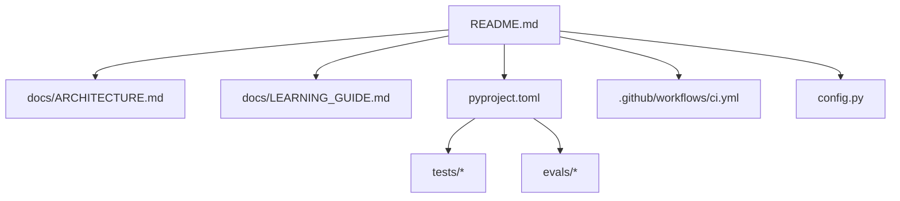
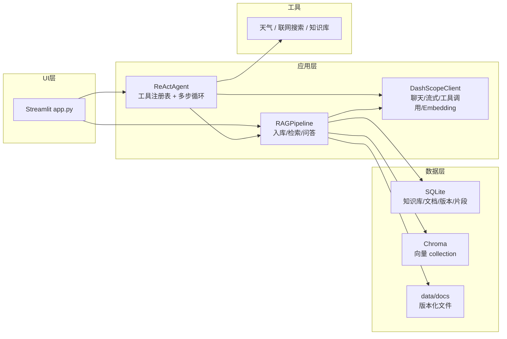
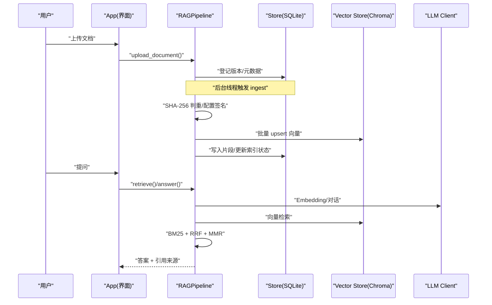
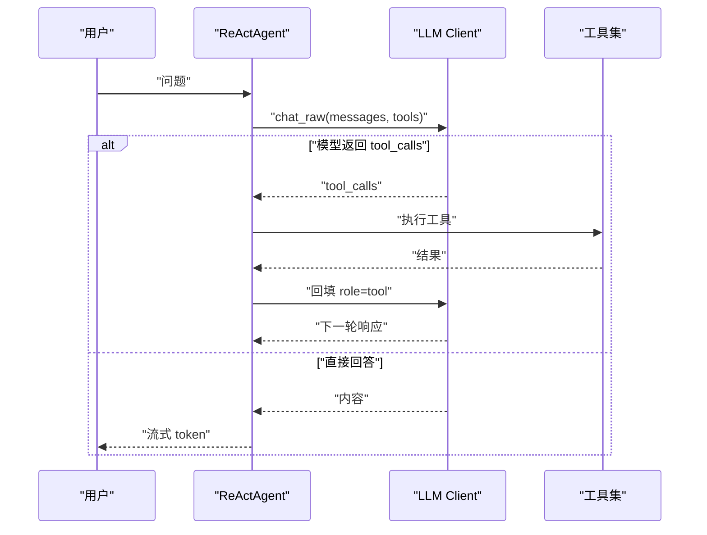
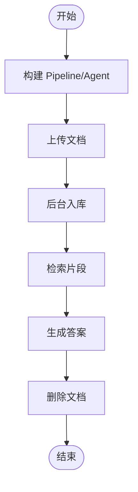
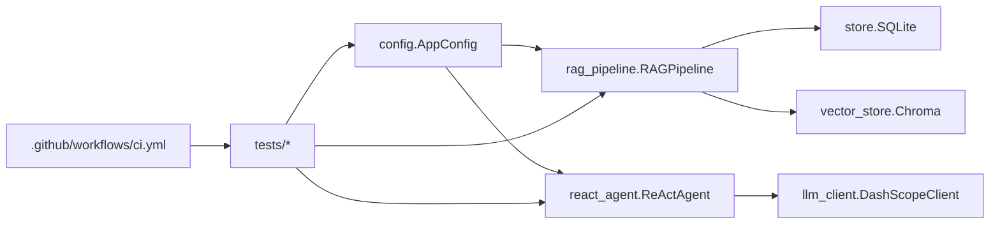

# 贡献指南

<cite>
**本文引用的文件**
- [README.md](file://README.md)
- [pyproject.toml](file://pyproject.toml)
- [.github/workflows/ci.yml](file://.github/workflows/ci.yml)
- [docs/ARCHITECTURE.md](file://docs/ARCHITECTURE.md)
- [docs/LEARNING_GUIDE.md](file://docs/LEARNING_GUIDE.md)
- [config.py](file://config.py)
- [tests/conftest.py](file://tests/conftest.py)
- [tests/helpers.py](file://tests/helpers.py)
- [tests/test_smoke.py](file://tests/test_smoke.py)
- [evals/README.md](file://evals/README.md)
</cite>

## 目录
1. [简介](#简介)
2. [项目结构](#项目结构)
3. [核心组件](#核心组件)
4. [架构总览](#架构总览)
5. [详细组件分析](#详细组件分析)
6. [依赖关系分析](#依赖关系分析)
7. [性能与质量考量](#性能与质量考量)
8. [故障排查指南](#故障排查指南)
9. [结论](#结论)
10. [附录：贡献流程规范](#附录贡献流程规范)

## 简介
本指南面向希望参与“智能文档助手 RAG + Agent（阶段 A）”项目的社区贡献者，目标是帮助你快速上手、遵循统一的开发工作流、提交高质量代码与文档，并有效参与问题反馈与功能改进。本项目基于 Python 构建，提供多知识库 RAG、Function Calling Agent、REST API、离线评测与测试等能力，具备完善的 CI 流水线与可复现实验环境。

## 项目结构
仓库采用按职责划分的扁平化结构，核心模块集中在根目录，测试、评估与文档分别位于 tests、evals、docs 子目录。CI 通过 GitHub Actions 在 push 到 main 分支或创建 Pull Request 时自动运行 lint、类型检查、单元测试与离线评测。

图表来源
- [README.md:116-134](file://README.md#L116-L134)
- [pyproject.toml:1-41](file://pyproject.toml#L1-L41)
- [.github/workflows/ci.yml:1-34](file://.github/workflows/ci.yml#L1-L34)

章节来源
- [README.md:1-171](file://README.md#L1-L171)
- [pyproject.toml:1-41](file://pyproject.toml#L1-L41)
- [.github/workflows/ci.yml:1-34](file://.github/workflows/ci.yml#L1-L34)

## 核心组件
- 配置中心：集中管理所有可调参数，支持环境变量覆盖，冻结数据类避免运行时修改。
- LLM 客户端：封装对话、流式、工具调用与 Embedding 接口。
- 存储层：SQLite 元数据存储与 Chroma 向量存储。
- 入库管线：文档解析、切分、批量 Embedding、Chroma upsert、片段落库。
- RAG 管线：混合检索（向量+BM25）、RRF 融合、MMR 去重、相关性门槛、查询改写。
- Agent：Function Calling 工具注册表、多步循环、流式事件输出。
- 服务层：FastAPI REST 接口与鉴权。
- 界面：Streamlit 交互页面，支持知识库管理与后台入库。
- 评测：golden set 离线/在线评测脚本，输出 hit@k、关键词命中率、可溯源率。
- 测试：pytest 夹具与假组件，确保全链路离线可测。

章节来源
- [docs/ARCHITECTURE.md:45-57](file://docs/ARCHITECTURE.md#L45-L57)
- [config.py:56-113](file://config.py#L56-L113)
- [evals/README.md:1-24](file://evals/README.md#L1-L24)
- [tests/conftest.py:1-23](file://tests/conftest.py#L1-L23)
- [tests/helpers.py:1-166](file://tests/helpers.py#L1-L166)

## 架构总览
系统由 UI 层、应用层、数据层与工具层组成。UI 层通过 Streamlit 提供交互；应用层包含 Agent、RAG 管线与 LLM 客户端；数据层使用 SQLite 与 Chroma；工具层包括天气、联网搜索、知识库等外部能力。

图表来源
- [docs/ARCHITECTURE.md:15-43](file://docs/ARCHITECTURE.md#L15-L43)

章节来源
- [docs/ARCHITECTURE.md:13-57](file://docs/ARCHITECTURE.md#L13-L57)

## 详细组件分析

### 配置与可观测性
- 配置读取：从环境变量加载，带默认值与范围钳制（如 Embedding 批量大小上限）。
- 路径解析：支持相对路径与绝对路径，统一归一化处理。
- 可观测性：Agent 轨迹日志 JSONL 记录，便于追踪工具调用与流式事件。

章节来源
- [config.py:21-54](file://config.py#L21-L54)
- [config.py:89-113](file://config.py#L89-L113)
- [README.md:136-142](file://README.md#L136-L142)

### 入库与检索流程
- 入库流：上传文件 → 写磁盘与登记版本 → 后台线程索引 → SHA-256 判重 → 解析切分 → 批量 Embedding → Chroma upsert → 片段写 SQLite → 更新索引状态。
- 检索流：可选查询改写 → 向量检索与 BM25 检索 → RRF 融合 → 相关性门槛过滤 → 可选 MMR 去重 → Top-K 返回。
- 上下文预算：历史与检索片段 token 预算控制，防止注意力稀释。

图表来源
- [docs/ARCHITECTURE.md:58-104](file://docs/ARCHITECTURE.md#L58-L104)
- [docs/ARCHITECTURE.md:114-135](file://docs/ARCHITECTURE.md#L114-L135)

章节来源
- [docs/ARCHITECTURE.md:58-135](file://docs/ARCHITECTURE.md#L58-L135)

### Agent 工具调用流程
- 工具注册：通过装饰器注册工具名称、描述与参数 Schema。
- 多步循环：模型返回 tool_calls → 解析参数 → 执行工具 → 结果回填 role=tool → 回到模型，最多 max_steps 轮。
- 流式输出：最终回答以 token 流式输出，工具调用过程实时展示。

图表来源
- [docs/ARCHITECTURE.md:125-144](file://docs/ARCHITECTURE.md#L125-L144)

章节来源
- [docs/ARCHITECTURE.md:125-144](file://docs/ARCHITECTURE.md#L125-L144)

### 测试与评测体系
- 测试夹具：conftest.py 提供 pipeline 与 agent 的构造，helpers.py 提供 FakeLLMClient、FakeEmbeddings 与临时配置。
- 冒烟测试：端到端验证上传→入库→检索→问答→删除全链路。
- 评测指标：hit@k、keyword_hit、citation，支持离线与在线模式。

图表来源
- [tests/test_smoke.py:12-46](file://tests/test_smoke.py#L12-L46)
- [tests/conftest.py:12-23](file://tests/conftest.py#L12-L23)
- [tests/helpers.py:136-166](file://tests/helpers.py#L136-L166)

章节来源
- [tests/test_smoke.py:1-46](file://tests/test_smoke.py#L1-L46)
- [tests/conftest.py:1-23](file://tests/conftest.py#L1-L23)
- [tests/helpers.py:1-166](file://tests/helpers.py#L1-L166)
- [evals/README.md:1-24](file://evals/README.md#L1-L24)

## 依赖关系分析
- 配置依赖：AppConfig 被 RAGPipeline、Agent、测试夹具广泛使用。
- 存储依赖：RAGPipeline 依赖 SQLite 与 Chroma；Agent 依赖 LLM 客户端。
- 测试依赖：pytest、ruff、mypy 作为开发与质量保障工具。
- CI 依赖：GitHub Actions 在 PR 与 push 到 main 时执行 lint、类型检查、测试与离线评测。

图表来源
- [config.py:56-113](file://config.py#L56-L113)
- [tests/conftest.py:12-23](file://tests/conftest.py#L12-L23)
- [.github/workflows/ci.yml:8-34](file://.github/workflows/ci.yml#L8-L34)

章节来源
- [config.py:56-113](file://config.py#L56-L113)
- [tests/conftest.py:1-23](file://tests/conftest.py#L1-L23)
- [.github/workflows/ci.yml:1-34](file://.github/workflows/ci.yml#L1-L34)

## 性能与质量考量
- 增量入库：SHA-256 判重与索引配置签名变化检测，避免重复计算与混用旧向量。
- 批量限制：Embedding 批量大小钳制至 20 以内，防止超出服务限制。
- 上下文预算：历史与检索片段 token 预算控制，降低长上下文对注意力的稀释。
- 代码质量：ruff 静态检查、mypy 类型检查、pytest 单元测试与冒烟测试。
- 评测量化：golden set 指标用于衡量检索与回答质量，支持离线验证链路。

章节来源
- [docs/ARCHITECTURE.md:72-82](file://docs/ARCHITECTURE.md#L72-L82)
- [docs/ARCHITECTURE.md:94-99](file://docs/ARCHITECTURE.md#L94-L99)
- [pyproject.toml:5-27](file://pyproject.toml#L5-L27)
- [evals/README.md:13-21](file://evals/README.md#L13-L21)

## 故障排查指南
- 上传后立刻提问无结果：等待后台索引完成或检查相关性阈值是否过高。
- Agent 不调用知识库：优化工具描述，使模型更倾向于调用。
- 上下文过长影响回答：调整 HISTORY_MAX_TOKENS 与 RAG_CONTEXT_MAX_TOKENS。
- chunk 参数不生效：修改 .env 后重启应用，下次入库会重建索引。
- 多人使用共享知识库：阶段 A 无租户隔离，阶段 B 将引入 RBAC。
- 云端安全：Embedding 与问答会发送片段至 DashScope，涉密文档需私有化部署。

章节来源
- [docs/LEARNING_GUIDE.md:134-158](file://docs/LEARNING_GUIDE.md#L134-L158)
- [README.md:144-149](file://README.md#L144-L149)

## 结论
本项目提供了完整的 RAG + Agent 实现，具备可配置的检索策略、稳健的入库流程、可量化的评测体系与完善的测试与 CI。贡献者可通过遵循本指南的工作流与质量标准，高效参与项目开发与维护。

## 附录：贡献流程规范

### Git 工作流与分支策略
- 分支命名：feature/xxx、fix/xxx、docs/xxx、chore/xxx。
- 主分支：main 为稳定分支，PR 合并前需通过 CI。
- 提交信息：建议格式 type(scope): description，例如 feat(rag): 增加 MMR 去重选项。
- 小步提交：每次 PR 聚焦单一变更，便于审查与回滚。

### Pull Request 流程
- 创建 PR：从功能分支向 main 发起，填写变更说明与关联 Issue。
- 自动化检查：CI 执行 ruff check、mypy、pytest 与离线评测。
- 代码审查：至少一名维护者审查通过后合并。
- 合并策略：squash merge 保持历史整洁。

### 代码审查标准
- 代码质量：通过 ruff 检查，遵循 PEP8 风格；函数与类职责清晰。
- 类型提示：关键函数添加类型注解，mypy 通过。
- 测试覆盖：新增逻辑需配套单元测试；端到端场景补充冒烟测试。
- 文档更新：变更行为需同步更新 README 或 docs 对应章节。

### 问题报告模板
- 标题：简明描述问题现象。
- 环境：Python 版本、操作系统、依赖版本。
- 复现步骤：最小可复现示例。
- 期望行为与实际行为对比。
- 日志与截图：相关错误堆栈或界面截图。

### 功能请求流程
- 先搜索现有 Issue，避免重复。
- 描述需求背景、目标与收益。
- 提出初步方案与权衡。
- 维护者评估优先级与可行性。

### 文档贡献方式
- 文档结构：README 概述、docs/ARCHITECTURE.md 架构说明、docs/LEARNING_GUIDE.md 学习路线。
- 写作风格：简洁明确、配图辅助、示例驱动。
- 翻译贡献：保持术语一致，对照原文逐段翻译，提交 PR 供审查。

### 社区行为准则
- 尊重与包容：鼓励多元观点，理性讨论。
- 建设性反馈：聚焦问题本身，避免人身攻击。
- 透明沟通：公开讨论决策依据与权衡。

### 沟通渠道与维护者联系方式
- 讨论区：Issue 与 Discussion。
- 邮件：项目维护者邮箱（见仓库主页）。
- 即时通讯：如有群组，链接见 README。

### 新贡献者入门指导
- 第一个 Issue：选择标签为 good first issue 的任务，阅读相关文档与代码。
- 第一个 PR：修复小 bug 或完善文档，遵循提交信息与审查流程。
- 社区融入：参与 Issue 讨论、Review 他人 PR、分享经验与心得。

章节来源
- [README.md:25-91](file://README.md#L25-L91)
- [pyproject.toml:1-41](file://pyproject.toml#L1-L41)
- [.github/workflows/ci.yml:1-34](file://.github/workflows/ci.yml#L1-L34)
- [docs/ARCHITECTURE.md:1-200](file://docs/ARCHITECTURE.md#L1-L200)
- [docs/LEARNING_GUIDE.md:1-158](file://docs/LEARNING_GUIDE.md#L1-L158)