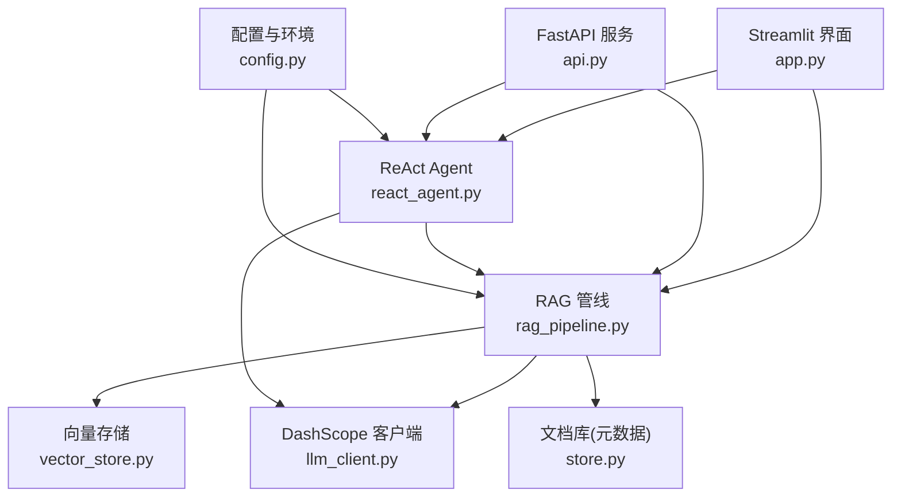
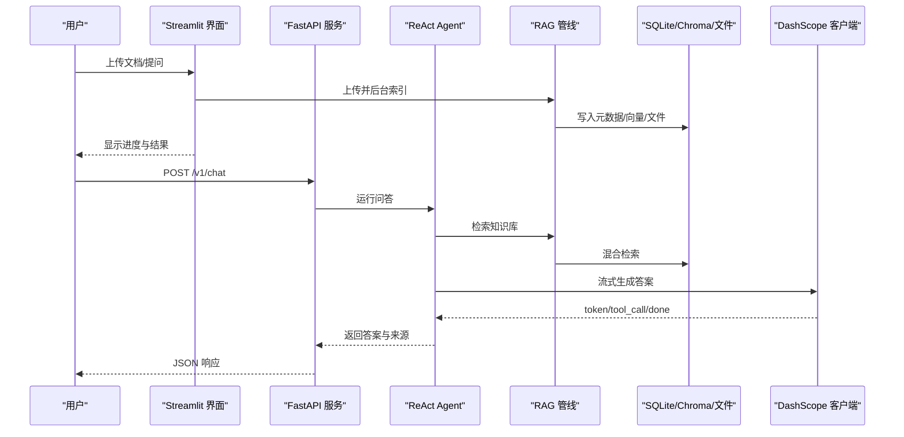
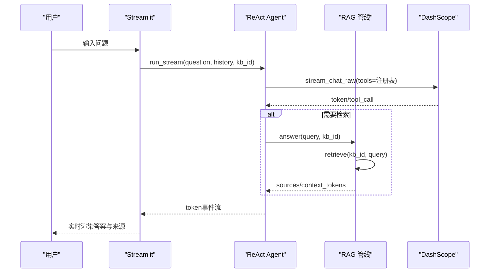
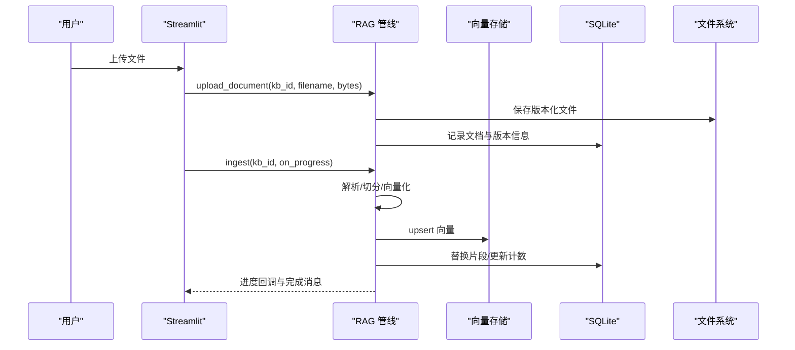
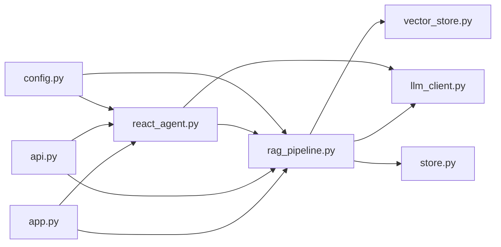

# 快速开始

<cite>
**本文引用的文件**
- [README.md](file://README.md)
- [requirements.txt](file://requirements.txt)
- [config.py](file://config.py)
- [app.py](file://app.py)
- [api.py](file://api.py)
- [rag_pipeline.py](file://rag_pipeline.py)
- [react_agent.py](file://react_agent.py)
- [llm_client.py](file://llm_client.py)
</cite>

## 目录
1. [简介](#简介)
2. [项目结构](#项目结构)
3. [核心组件](#核心组件)
4. [架构总览](#架构总览)
5. [详细组件分析](#详细组件分析)
6. [依赖关系分析](#依赖关系分析)
7. [性能注意事项](#性能注意事项)
8. [故障排除指南](#故障排除指南)
9. [结论](#结论)
10. [附录](#附录)

## 简介
本指南面向首次接触该 RAG+Agent 系统的用户，目标是在 5 分钟内完成环境准备、依赖安装、环境变量配置，并启动 Streamlit 界面与 REST API 服务。你将了解首次启动时的自动导入机制，以及通过 Web 界面进行知识库管理与问答的基本操作。同时提供常见问题与排错提示，帮助你顺利体验核心功能。

## 项目结构
本项目采用“按能力分层 + 模块化”的组织方式：
- 应用层：Streamlit 界面（app.py）与 FastAPI 服务（api.py）
- 业务层：RAG 管线（rag_pipeline.py）、ReAct Agent（react_agent.py）
- 模型与存储：LLM 客户端（llm_client.py）、向量存储（vector_store.py）、文档库（store.py）
- 配置与环境：集中配置（config.py）、运行时依赖（requirements.txt）
- 数据与资源：data/（SQLite、Chroma、文档版本）、assets/（Logo）

图表来源
- [app.py:1-352](file://app.py#L1-L352)
- [api.py:1-204](file://api.py#L1-L204)
- [rag_pipeline.py:1-792](file://rag_pipeline.py#L1-L792)
- [react_agent.py:1-567](file://react_agent.py#L1-L567)
- [llm_client.py:1-322](file://llm_client.py#L1-L322)
- [config.py:1-113](file://config.py#L1-L113)

章节来源
- [README.md:116-134](file://README.md#L116-L134)

## 核心组件
- 配置中心：从环境变量加载所有可调参数，包括 DashScope 密钥、模型名、检索阈值、切分参数等。
- RAG 管线：负责知识库管理、增量入库、混合检索（向量+BM25，RRF融合，可选MMR重排）、带引用回答。
- ReAct Agent：基于 Function Calling 的工具调度器，支持知识库检索、天气查询、联网搜索、只读数据库查询。
- LLM 客户端：统一封装 DashScope 的对话、流式、Function Calling 与 Embedding 接口。
- 存储层：SQLite 保存元数据与片段；Chroma 保存向量；本地磁盘按知识库与版本保存原始文档。

章节来源
- [config.py:56-113](file://config.py#L56-L113)
- [rag_pipeline.py:196-792](file://rag_pipeline.py#L196-L792)
- [react_agent.py:144-567](file://react_agent.py#L144-L567)
- [llm_client.py:22-322](file://llm_client.py#L22-L322)

## 架构总览
系统由三层构成：
- 交互层：Streamlit 页面用于可视化操作；FastAPI 暴露 REST 接口供外部调用。
- 智能层：RAG 管线提供检索与问答；Agent 根据问题选择工具执行多步推理。
- 数据层：SQLite 与 Chroma 分别承载元数据与向量；本地文件系统维护文档版本。

图表来源
- [app.py:173-208](file://app.py#L173-L208)
- [api.py:185-199](file://api.py#L185-L199)
- [rag_pipeline.py:306-435](file://rag_pipeline.py#L306-L435)
- [react_agent.py:272-369](file://react_agent.py#L272-L369)
- [llm_client.py:203-278](file://llm_client.py#L203-L278)

## 详细组件分析

### 环境与依赖准备（5分钟）
- 环境要求：Python 3.10+
- 创建虚拟环境并激活
- 安装依赖：pip install -r requirements.txt
- 配置环境变量：复制示例到 .env，填入 DASHSCOPE_API_KEY 等必要项
- 首次启动会自动将 data/docs/ 根目录遗留的示例文档导入默认知识库

章节来源
- [README.md:25-49](file://README.md#L25-L49)
- [requirements.txt:1-21](file://requirements.txt#L1-L21)
- [config.py:14-16](file://config.py#L14-L16)

### 环境变量配置要点
- 必填：DASHSCOPE_API_KEY
- 可选覆盖：DASHSCOPE_BASE_URL、DASHSCOPE_CHAT_MODEL、DASHSCOPE_EMBEDDING_MODEL
- 检索与切分：CHUNK_SIZE、CHUNK_OVERLAP、RETRIEVAL_TOP_K、RETRIEVAL_FUSION_POOL、RETRIEVAL_RELEVANCE_THRESHOLD、RETRIEVAL_MMR_ENABLED、RETRIEVAL_MMR_LAMBDA
- 对话与上下文：QUERY_REWRITE_ENABLED、HISTORY_MAX_TOKENS、RAG_CONTEXT_MAX_TOKENS
- Agent：AGENT_MAX_STEPS
- 其他：EMBEDDING_BATCH_SIZE、LOGO_PATH、KB_DB_PATH、CHROMA_DIR

章节来源
- [README.md:93-114](file://README.md#L93-L114)
- [config.py:90-113](file://config.py#L90-L113)
- [llm_client.py:15-46](file://llm_client.py#L15-L46)

### 启动 Streamlit 界面
- 命令：streamlit run app.py
- 功能：侧边栏创建/切换/删除知识库；上传文档并后台索引；查看已索引文档；流式聊天展示答案、引用来源与 Agent 执行轨迹

章节来源
- [README.md:43-49](file://README.md#L43-L49)
- [app.py:138-237](file://app.py#L138-L237)
- [app.py:239-352](file://app.py#L239-L352)

### 启动 REST API 服务
- 命令：uvicorn api:app --host 0.0.0.0 --port 8000
- 鉴权：设置 API_AUTH_TOKEN 后，所有 /v1 接口需携带 Authorization: Bearer <token>
- 常用接口：
  - POST /v1/kbs/{kb_id}/documents：上传文档
  - POST /v1/kbs/{kb_id}/ingest：触发入库
  - POST /v1/chat：问答（支持 history、kb_id）

章节来源
- [README.md:50-65](file://README.md#L50-L65)
- [api.py:31-55](file://api.py#L31-L55)
- [api.py:126-199](file://api.py#L126-L199)

### 首次启动自动导入机制
- 当首次运行且不存在任何知识库时，系统会扫描 data/docs/ 根目录下的受支持格式文件，自动创建默认知识库并将这些文件作为文档加入
- 随后即可在界面中触发后台索引，无需手动复制文件

章节来源
- [rag_pipeline.py:754-773](file://rag_pipeline.py#L754-L773)
- [README.md:47-49](file://README.md#L47-L49)

### 通过 Web 界面进行知识库管理与问答
- 创建知识库：输入名称与描述，点击“创建”
- 切换知识库：侧边栏下拉选择当前知识库
- 上传并后台索引：选择 TXT/Word/PDF/Markdown 文件，填写分类与标签（可选），点击“上传并后台索引”，等待进度条完成
- 查看已索引文档：列表显示文件名、版本、片段数，支持删除
- 问答：在主区域输入问题或点击快捷问题，观察流式输出、引用来源与 Agent 执行轨迹

章节来源
- [app.py:138-237](file://app.py#L138-L237)
- [app.py:239-352](file://app.py#L239-L352)

### 关键流程时序图（问答）

图表来源
- [react_agent.py:272-369](file://react_agent.py#L272-L369)
- [rag_pipeline.py:590-666](file://rag_pipeline.py#L590-L666)
- [llm_client.py:203-278](file://llm_client.py#L203-L278)

### 关键流程时序图（后台入库）

图表来源
- [app.py:173-208](file://app.py#L173-L208)
- [rag_pipeline.py:260-288](file://rag_pipeline.py#L260-L288)
- [rag_pipeline.py:306-435](file://rag_pipeline.py#L306-L435)

## 依赖关系分析
- 应用层依赖业务层：Streamlit/FastAPI 依赖 RAG 管线与 Agent
- 业务层依赖模型与存储：RAG/Agent 依赖 LLM 客户端、向量存储与文档库
- 配置贯穿全链路：所有可调参数通过 config.py 注入

图表来源
- [app.py:1-352](file://app.py#L1-L352)
- [api.py:1-204](file://api.py#L1-L204)
- [rag_pipeline.py:1-792](file://rag_pipeline.py#L1-L792)
- [react_agent.py:1-567](file://react_agent.py#L1-L567)
- [llm_client.py:1-322](file://llm_client.py#L1-L322)
- [config.py:1-113](file://config.py#L1-L113)

章节来源
- [requirements.txt:1-21](file://requirements.txt#L1-L21)

## 性能注意事项
- 文本切分与上下文预算：合理设置 CHUNK_SIZE、CHUNK_OVERLAP、RAG_CONTEXT_MAX_TOKENS，避免上下文过长导致注意力分散与成本上升
- 检索阈值与去重：调整 RETRIEVAL_RELEVANCE_THRESHOLD、启用 MMR 提升相关性多样性
- 批量嵌入：EMBEDDING_BATCH_SIZE 建议不超过 20（DashScope 限制）
- 历史截断：HISTORY_MAX_TOKENS 控制对话历史长度，减少无效 token 消耗
- 流式输出：Agent 使用流式接口降低首字延迟，UI 可实时渲染

章节来源
- [config.py:90-113](file://config.py#L90-L113)
- [rag_pipeline.py:159-193](file://rag_pipeline.py#L159-L193)
- [rag_pipeline.py:439-523](file://rag_pipeline.py#L439-L523)
- [react_agent.py:272-369](file://react_agent.py#L272-L369)
- [llm_client.py:172-278](file://llm_client.py#L172-L278)

## 故障排除指南
- 未配置 API Key：若未设置 DASHSCOPE_API_KEY，初始化时会抛出错误提示；请复制示例为 .env 并填写有效密钥
- Base URL 格式错误：DASHSCOPE_BASE_URL 必须以 /compatible-mode/v1 结尾
- 向量批次过大：EMBEDDING_BATCH_SIZE 超过 20 可能报错；调整为 16 更安全
- 无相关内容拒答：若向量与 BM25 均未命中，系统将拒绝回答以避免幻觉；可调整阈值或补充资料
- 工具调用失败：Agent 会将工具异常回填给模型，尝试重试或直接回答；可在界面查看执行轨迹定位问题
- SQLite/Chroma 并发：服务层使用全局锁串行化读写，避免并发访问冲突

章节来源
- [llm_client.py:59-86](file://llm_client.py#L59-L86)
- [rag_pipeline.py:439-523](file://rag_pipeline.py#L439-L523)
- [react_agent.py:130-142](file://react_agent.py#L130-L142)
- [api.py:31-55](file://api.py#L31-L55)

## 结论
通过以上步骤，你可以在 5 分钟内完成环境准备、依赖安装、环境变量配置，并成功启动 Streamlit 界面与 REST API 服务。首次启动会自动导入示例文档，便于立即体验知识库管理与问答。结合检索阈值、上下文预算与流式输出等优化点，可获得稳定且高效的 RAG+Agent 体验。

## 附录
- 独立运行与测试：
  - 查看知识库状态：python rag_pipeline.py
  - 命令行 Agent：python react_agent.py
  - 连接测试：python llm_client.py
  - 离线测试：pytest
  - 代码规范检查：ruff check .
- 数据存储位置：
  - 元数据与片段：data/kb.sqlite3
  - 向量：data/chroma/
  - 文档：data/docs/<kb_id>/<doc_id>/v<版本>/<文件名>
  - Agent 轨迹：data/agent_trace.jsonl

章节来源
- [README.md:74-91](file://README.md#L74-L91)
- [README.md:136-142](file://README.md#L136-L142)