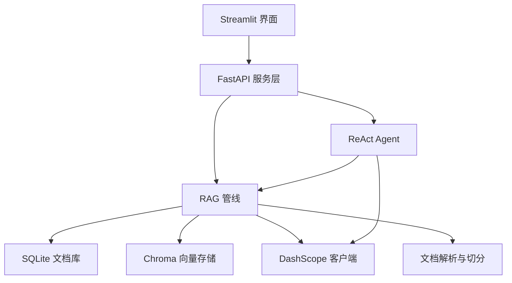
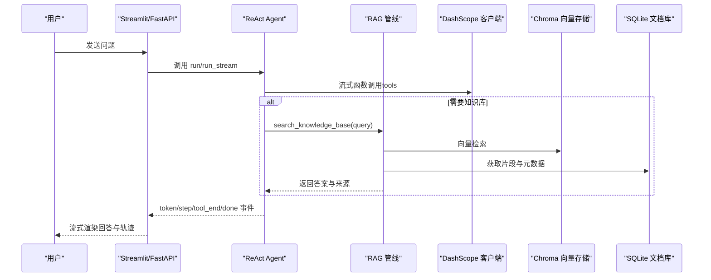
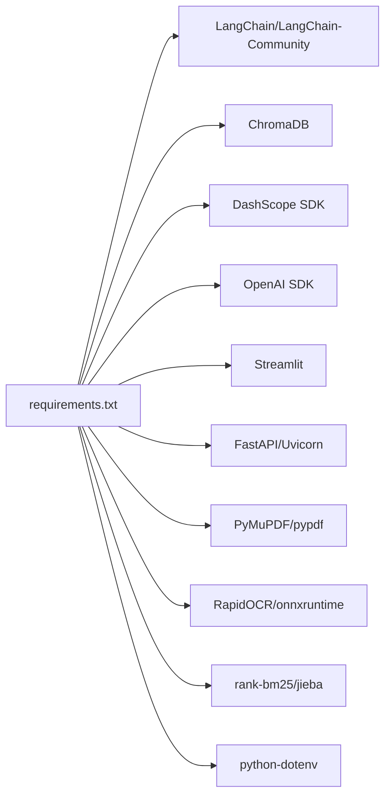

# 故障排除

<cite>
**本文引用的文件**   
- [README.md](file://README.md)
- [config.py](file://config.py)
- [requirements.txt](file://requirements.txt)
- [api.py](file://api.py)
- [app.py](file://app.py)
- [llm_client.py](file://llm_client.py)
- [vector_store.py](file://vector_store.py)
- [store.py](file://store.py)
- [rag_pipeline.py](file://rag_pipeline.py)
- [react_agent.py](file://react_agent.py)
- [ingestion.py](file://ingestion.py)
- [utils/logger.py](file://utils/logger.py)
- [tests/test_smoke.py](file://tests/test_smoke.py)
</cite>

## 目录
1. [简介](#简介)
2. [项目结构](#项目结构)
3. [核心组件](#核心组件)
4. [架构总览](#架构总览)
5. [详细组件分析](#详细组件分析)
6. [依赖关系分析](#依赖关系分析)
7. [性能注意事项](#性能注意事项)
8. [故障排除指南](#故障排除指南)
9. [结论](#结论)
10. [附录](#附录)

## 简介
本故障排除文档面向“智能文档助手 RAG + Agent（阶段 A）”的部署与使用问题，覆盖环境、API 连接、性能、数据一致性与可用性等方面。文档提供可操作的诊断步骤、日志分析方法、独立测试命令以及预防性最佳实践，帮助快速定位并解决问题。

## 项目结构
- 服务入口：Streamlit 应用与 FastAPI 服务层分别提供交互界面与 REST API。
- 核心管线：RAG 管线负责知识库管理、增量入库、混合检索与问答；Agent 基于 Function Calling 实现工具调度与多步推理。
- 存储层：SQLite 持久化元数据与片段；Chroma 向量库存储向量索引；本地磁盘保存文档版本。
- 外部依赖：DashScope 大模型与 Embedding；可选天气/联网搜索等工具。
- 可观测性：Agent 轨迹 JSONL 日志；配置集中化管理；离线测试套件。

**图表来源**
- [api.py:1-204](file://api.py#L1-L204)
- [app.py:1-352](file://app.py#L1-L352)
- [rag_pipeline.py:196-792](file://rag_pipeline.py#L196-L792)
- [react_agent.py:144-567](file://react_agent.py#L144-L567)
- [store.py:123-470](file://store.py#L123-L470)
- [vector_store.py:38-149](file://vector_store.py#L38-L149)
- [llm_client.py:22-299](file://llm_client.py#L22-L299)
- [ingestion.py:24-216](file://ingestion.py#L24-L216)

**章节来源**
- [README.md:25-134](file://README.md#L25-L134)

## 核心组件
- 配置中心：集中读取环境变量，控制切分、检索、重排、上下文预算、Agent 轮数、Embedding 批大小等关键参数。
- LLM 客户端：统一封装 DashScope 对话、流式输出、Function Calling、Embedding 与联网搜索，并提供安全错误转换。
- RAG 管线：知识库管理、增量入库（SHA-256 判重与配置变更全量重建）、混合检索（向量+BM25，RRF融合，MMR去重）、带引用问答。
- ReAct Agent：工具注册表、多步循环、流式事件输出，支持知识库检索、天气查询、联网搜索与只读数据库查询。
- 存储层：SQLite 管理知识库、文档、版本、片段与配置；Chroma 管理向量集合；本地磁盘保存文档版本。
- 可观测性：Agent 轨迹 JSONL 日志，记录每步思考、工具调用、观察与成本估算。

**章节来源**
- [config.py:56-113](file://config.py#L56-L113)
- [llm_client.py:22-299](file://llm_client.py#L22-L299)
- [rag_pipeline.py:196-792](file://rag_pipeline.py#L196-L792)
- [react_agent.py:93-567](file://react_agent.py#L93-L567)
- [store.py:123-470](file://store.py#L123-L470)
- [vector_store.py:38-149](file://vector_store.py#L38-L149)
- [utils/logger.py:12-63](file://utils/logger.py#L12-L63)

## 架构总览
系统采用分层设计：前端通过 Streamlit 或 FastAPI 暴露能力；中间层由 RAG 管线与 Agent 协同完成检索增强生成与工具调度；底层通过 SQLite 与 Chroma 提供持久化与向量检索；外部通过 DashScope 提供大模型与 Embedding 能力。

**图表来源**
- [api.py:185-199](file://api.py#L185-L199)
- [app.py:298-352](file://app.py#L298-L352)
- [react_agent.py:272-370](file://react_agent.py#L272-L370)
- [rag_pipeline.py:590-666](file://rag_pipeline.py#L590-L666)
- [vector_store.py:100-127](file://vector_store.py#L100-L127)
- [store.py:386-442](file://store.py#L386-L442)
- [llm_client.py:172-278](file://llm_client.py#L172-L278)

## 详细组件分析

### 环境与依赖问题
常见问题
- Python 版本不匹配导致导入失败或行为异常。
- 依赖版本冲突（如 LangChain、Chroma、DashScope SDK）。
- 环境变量缺失或格式错误（密钥、Base URL、模型名）。

诊断方法
- 检查 Python 版本与 requirements 约束是否满足。
- 使用虚拟环境隔离依赖，重新安装 requirements。
- 校验 .env 中的必要变量：DASHSCOPE_API_KEY、DASHSCOPE_BASE_URL、DASHSCOPE_CHAT_MODEL、DASHSCOPE_EMBEDDING_MODEL。
- 使用独立脚本验证 DashScope 连接与流式输出。

解决建议
- 确保 Python 3.10+，按 README 创建虚拟环境并安装依赖。
- 若出现 batch size 报错，调整 EMBEDDING_BATCH_SIZE（默认 16，上限 20）。
- Base URL 必须以 /compatible-mode/v1 结尾，否则抛出运行时错误。

**章节来源**
- [README.md:25-91](file://README.md#L25-L91)
- [requirements.txt:1-21](file://requirements.txt#L1-L21)
- [config.py:90-113](file://config.py#L90-L113)
- [llm_client.py:59-86](file://llm_client.py#L59-L86)
- [llm_client.py:172-201](file://llm_client.py#L172-L201)

### API 连接问题（DashScope 密钥、网络配置）
常见问题
- 未配置 DASHSCOPE_API_KEY 导致初始化失败。
- Base URL 格式不正确导致客户端创建失败。
- 网络不可达或代理设置不当导致请求超时。

诊断方法
- 运行 llm_client 独立测试脚本，查看模型名、Base URL 与流式输出是否正常。
- 检查防火墙/代理设置，确认能访问 DashScope 公共端点。
- 在 API 层调用 /health 接口验证服务健康状态。

解决建议
- 复制 .env.example 为 .env 并填写有效密钥。
- 修正 Base URL 格式，确保以 /compatible-mode/v1 结尾。
- 如需代理，请在操作系统或 Python 环境中正确配置网络代理。

**章节来源**
- [llm_client.py:59-86](file://llm_client.py#L59-L86)
- [llm_client.py:297-322](file://llm_client.py#L297-L322)
- [api.py:98-100](file://api.py#L98-L100)

### 性能问题（内存占用、响应时间）
常见问题
- 上下文过长导致响应延迟与费用增加。
- Embedding 批量过大导致服务端报错。
- 历史消息过多影响模型注意力与首字延迟。

诊断方法
- 观察 UI 中上下文 token 统计与 prompt/completion tokens。
- 调整 HISTORY_MAX_TOKENS 与 RAG_CONTEXT_MAX_TOKENS 控制上下文预算。
- 调整 EMBEDDING_BATCH_SIZE 避免超出服务端限制。

优化建议
- 启用 query_rewrite_enabled 提升追问题质量，减少无效检索。
- 关闭 enable_thinking 以降低首字延迟（问答场景默认已关闭）。
- 合理设置 CHUNK_SIZE/CHUNK_OVERLAP，平衡召回与上下文长度。

**章节来源**
- [config.py:90-113](file://config.py#L90-L113)
- [rag_pipeline.py:159-193](file://rag_pipeline.py#L159-L193)
- [rag_pipeline.py:590-666](file://rag_pipeline.py#L590-L666)
- [app.py:251-352](file://app.py#L251-L352)

### 数据问题（向量索引损坏、数据库锁死）
常见问题
- Chroma 集合与 SQLite 片段不一致导致检索结果异常。
- SQLite 并发写入导致忙锁或超时。
- 向量集合残留旧 ID 导致删除后仍可检索到片段。

诊断方法
- 使用 kb_stats 对比文档数、片段数与向量数是否一致。
- 检查 ingest 流程是否完整执行，关注 indexed_sha 更新。
- 查看 store 的 WAL 模式与 busy_timeout 配置。

解决建议
- 对配置变更（切分参数、Embedding 模型）触发全量重建，避免旧向量与新配置不匹配。
- 删除文档时同步清理向量与片段记录。
- 后台入库完成后调用 refresh 重建向量客户端并使缓存失效。

**章节来源**
- [rag_pipeline.py:306-435](file://rag_pipeline.py#L306-L435)
- [rag_pipeline.py:720-728](file://rag_pipeline.py#L720-L728)
- [store.py:123-155](file://store.py#L123-L155)
- [vector_store.py:57-87](file://vector_store.py#L57-L87)

### 入库与解析问题（PDF 乱码、OCR 失败）
常见问题
- PDF 文本层提取失败或乱码，OCR 依赖未安装。
- 扫描版 PDF OCR 识别率低或耗时较长。
- 不支持的文件类型被拒绝。

诊断方法
- 检查 ingestion 日志与错误信息，确认是否进入 OCR 分支。
- 确认 pymupdf、rapidocr、onnxruntime 已安装。
- 上传小样本文件进行端到端测试。

解决建议
- 安装 OCR 依赖以支持扫描版 PDF。
- 调整 PDF_TEXT_QUALITY_THRESHOLD 与切分参数以改善识别效果。
- 仅上传支持的后缀（pdf、docx、md、txt）。

**章节来源**
- [ingestion.py:24-176](file://ingestion.py#L24-L176)
- [rag_pipeline.py:260-288](file://rag_pipeline.py#L260-L288)

### Agent 轨迹与调试技巧
常见问题
- 工具调用失败或参数解析错误。
- 多步循环达到最大轮数未完成。
- 轨迹日志缺失或无法写入。

诊断方法
- 查看 data/agent_trace.jsonl，逐条分析 step、tool、args、observation。
- 使用命令行 Agent 独立测试，观察工具注册表与执行轨迹。
- 在 API 层捕获异常并通过 safe_error 转换为可读信息。

解决建议
- 修正工具参数格式，容忍 markdown 代码块包裹的 JSON。
- 调整 AGENT_MAX_STEPS 以允许更复杂的多步任务。
- 确保日志路径存在且可写，避免阻塞主流程。

**章节来源**
- [react_agent.py:272-370](file://react_agent.py#L272-L370)
- [react_agent.py:493-524](file://react_agent.py#L493-L524)
- [utils/logger.py:12-63](file://utils/logger.py#L12-L63)
- [api.py:185-199](file://api.py#L185-L199)

## 依赖关系分析

**图表来源**
- [requirements.txt:1-21](file://requirements.txt#L1-L21)

**章节来源**
- [requirements.txt:1-21](file://requirements.txt#L1-L21)

## 性能注意事项
- 上下文预算：通过 HISTORY_MAX_TOKENS 与 RAG_CONTEXT_MAX_TOKENS 控制历史与上下文长度，避免超长输入导致延迟与费用上升。
- 检索策略：合理设置 RETRIEVAL_TOP_K、RETRIEVAL_FUSION_POOL、RETRIEVAL_RELEVANCE_THRESHOLD，结合 MMR 去重提升召回质量。
- 向量化批大小：EMBEDDING_BATCH_SIZE 应不超过 20，避免服务端报错。
- 流式输出：问答场景关闭 enable_thinking 以降低首字延迟。
- 后台入库：上传后异步索引，不阻塞聊天；入库完成后刷新服务实例。

[本节为通用指导，无需具体文件分析]

## 故障排除指南

### 环境问题排查清单
- 确认 Python 版本 >= 3.10。
- 使用虚拟环境并安装 requirements。
- 检查 .env 中 DASHSCOPE_API_KEY 与 BASE_URL 是否正确。
- 若出现 batch size 错误，降低 EMBEDDING_BATCH_SIZE。

**章节来源**
- [README.md:25-91](file://README.md#L25-L91)
- [config.py:90-113](file://config.py#L90-L113)
- [llm_client.py:59-86](file://llm_client.py#L59-L86)

### API 连接问题排查清单
- 运行 llm_client 独立测试，确认模型名、Base URL 与流式输出。
- 检查 /health 接口返回状态。
- 确认网络可达与代理设置。

**章节来源**
- [llm_client.py:297-322](file://llm_client.py#L297-L322)
- [api.py:98-100](file://api.py#L98-L100)

### 性能问题排查清单
- 观察 UI 中上下文 token 统计。
- 调整 HISTORY_MAX_TOKENS、RAG_CONTEXT_MAX_TOKENS、EMBEDDING_BATCH_SIZE。
- 关闭 enable_thinking 以降低首字延迟。

**章节来源**
- [rag_pipeline.py:159-193](file://rag_pipeline.py#L159-L193)
- [rag_pipeline.py:590-666](file://rag_pipeline.py#L590-L666)
- [app.py:251-352](file://app.py#L251-L352)

### 数据一致性排查清单
- 使用 kb_stats 对比文档、片段与向量数量。
- 检查 ingest 流程是否更新 indexed_sha。
- 删除文档后确认向量与片段同步清理。

**章节来源**
- [rag_pipeline.py:306-435](file://rag_pipeline.py#L306-L435)
- [rag_pipeline.py:720-728](file://rag_pipeline.py#L720-L728)
- [store.py:322-345](file://store.py#L322-L345)

### 入库与解析问题排查清单
- 确认 OCR 依赖安装（pymupdf、rapidocr、onnxruntime）。
- 检查 PDF 文本质量阈值与 OCR 分支是否触发。
- 仅上传支持的后缀。

**章节来源**
- [ingestion.py:24-176](file://ingestion.py#L24-L176)
- [rag_pipeline.py:260-288](file://rag_pipeline.py#L260-L288)

### 日志分析与调试技巧
- 查看 data/agent_trace.jsonl，逐条分析 step、tool、args、observation。
- 使用命令行 Agent 独立测试，观察工具注册表与执行轨迹。
- 在 API 层捕获异常并通过 safe_error 转换为可读信息。

**章节来源**
- [utils/logger.py:12-63](file://utils/logger.py#L12-L63)
- [react_agent.py:272-370](file://react_agent.py#L272-L370)
- [api.py:185-199](file://api.py#L185-L199)

### 独立测试命令
- 查看知识库状态（不调用 API）：python rag_pipeline.py
- 命令行 Agent（输入 exit 退出）：python react_agent.py
- 测试 DashScope 连接：python llm_client.py
- 运行全部离线测试（不消耗 API）：pytest
- 代码规范检查：ruff check .

**章节来源**
- [README.md:74-91](file://README.md#L74-L91)
- [tests/test_smoke.py:12-46](file://tests/test_smoke.py#L12-L46)

### 预防措施与最佳实践
- 使用虚拟环境隔离依赖，固定版本避免冲突。
- 通过环境变量集中管理配置，避免硬编码。
- 定期备份 data 目录（SQLite、Chroma、文档版本）。
- 开启 API_AUTH_TOKEN 保护服务，多人使用时部署在内网。
- 使用评测脚本评估检索与回答质量，持续优化参数。

**章节来源**
- [README.md:93-149](file://README.md#L93-L149)

## 结论
通过系统化排查环境、API 连接、性能与数据一致性问题，并结合日志分析与独立测试，能够快速定位并解决 RAG + Agent 系统的常见故障。遵循最佳实践与预防措施，有助于提升系统稳定性与可维护性。

[本节为总结性内容，无需具体文件分析]

## 附录
- 数据存储位置：data/kb.sqlite3（SQLite）、data/chroma/（Chroma）、data/docs/<kb_id>/<doc_id>/v<版本>/<文件名>、data/agent_trace.jsonl。
- 隐私与安全：Embedding 与问答会发送到 DashScope；FastAPI 支持 Bearer Token 鉴权。

**章节来源**
- [README.md:136-149](file://README.md#L136-L149)