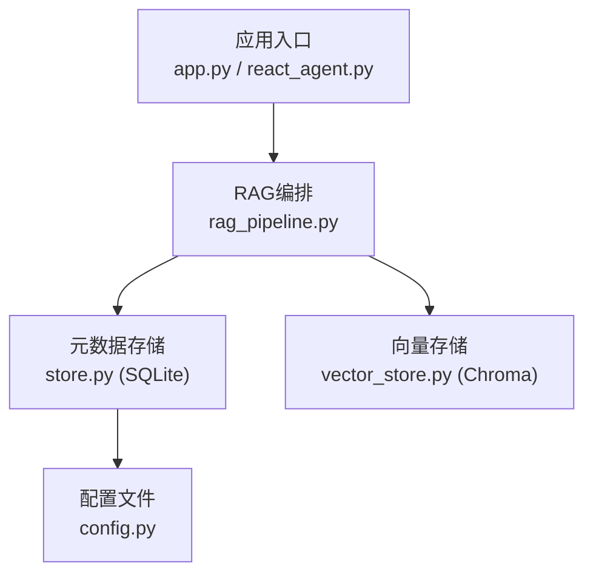
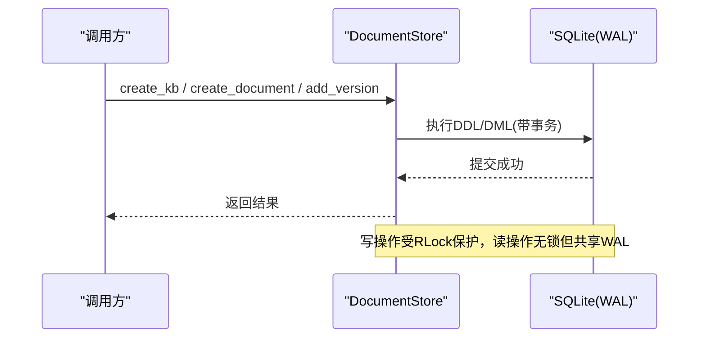
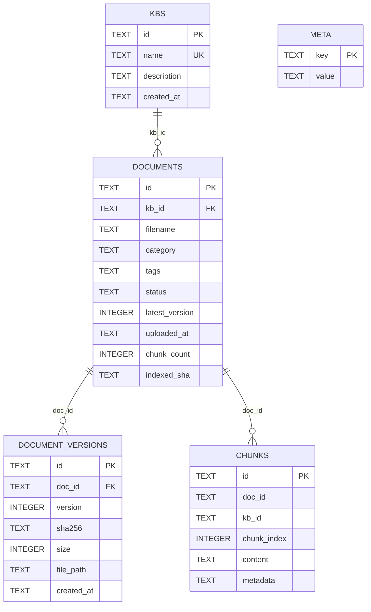
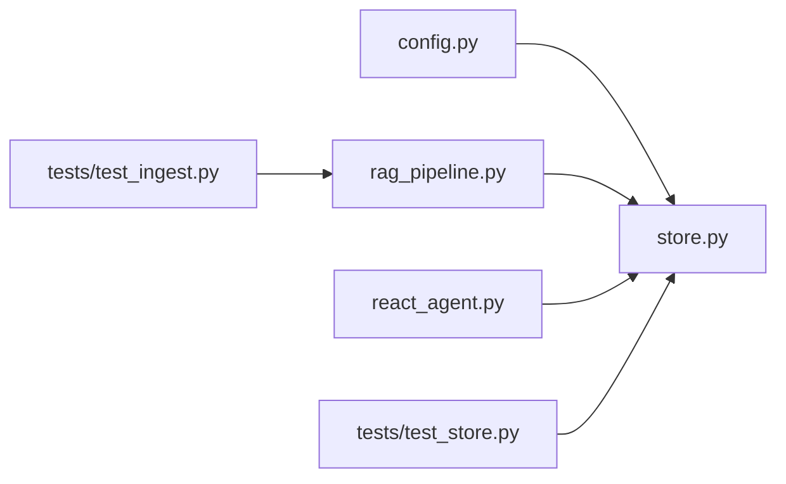

# SQLite数据库设计

<cite>
**本文引用的文件**
- [store.py](file://store.py)
- [config.py](file://config.py)
- [rag_pipeline.py](file://rag_pipeline.py)
- [react_agent.py](file://react_agent.py)
- [tests/test_store.py](file://tests/test_store.py)
- [tests/test_ingest.py](file://tests/test_ingest.py)
- [docs/ARCHITECTURE.md](file://docs/ARCHITECTURE.md)
</cite>

## 目录
1. [简介](#简介)
2. [项目结构](#项目结构)
3. [核心组件](#核心组件)
4. [架构总览](#架构总览)
5. [详细组件分析](#详细组件分析)
6. [依赖关系分析](#依赖关系分析)
7. [性能与并发](#性能与并发)
8. [故障排查指南](#故障排查指南)
9. [结论](#结论)
10. [附录：SQL示例与最佳实践](#附录sql示例与最佳实践)

## 简介
本文件面向SQLite元数据存储的设计与实现，围绕知识库、文档、版本、片段与键值配置五张表展开，详细说明字段定义、数据类型、约束条件、索引策略、外键与级联删除机制，并解释WAL模式、并发访问控制与事务管理机制。同时提供数据迁移方案、备份恢复流程、性能优化建议以及常用SQL查询示例和最佳实践，帮助读者在单文件、零部署的SQLite底座上安全高效地运行RAG入库与检索。

## 项目结构
- 存储层：store.py 定义了SQLite数据库的表结构与CRUD封装，使用WAL模式与PRAGMA参数保障并发与一致性。
- 配置层：config.py 集中读取环境变量，决定数据库路径等关键参数。
- 编排层：rag_pipeline.py 负责入库流程、增量索引与全量重建触发（基于meta中的索引配置签名）。
- 工具层：react_agent.py 提供只读SQL查询能力，限制为SELECT/PRAGMA/EXPLAIN/WITH。
- 测试与文档：tests/* 验证行为；docs/ARCHITECTURE.md 概述数据流与数据库设计取舍。

图表来源
- [store.py:123-138](file://store.py#L123-L138)
- [config.py:89-112](file://config.py#L89-L112)
- [rag_pipeline.py:739-773](file://rag_pipeline.py#L739-L773)

章节来源
- [store.py:1-17](file://store.py#L1-L17)
- [config.py:1-113](file://config.py#L1-L113)
- [docs/ARCHITECTURE.md:45-172](file://docs/ARCHITECTURE.md#L45-L172)

## 核心组件
- DocumentStore：SQLite封装类，提供知识库、文档、版本、片段、meta的增删改查方法，内部使用RLock保护写操作，每个方法独立连接，开启WAL与外键约束。
- 数据模型：Kb、DocumentInfo、Chunk三个dataclass用于映射行数据。
- 配置：AppConfig.from_env 提供db_path等路径与环境覆盖。

章节来源
- [store.py:88-138](file://store.py#L88-L138)
- [config.py:56-113](file://config.py#L56-L113)

## 架构总览
SQLite作为阶段A的元数据存储底座，承担多知识库、文档分类标签、文件版本、片段全文与索引配置管理。通过WAL模式与busy_timeout支持后台入库线程与前台问答线程并发访问；软删除保留历史便于审计与恢复；chunks表保存片段内容以支持BM25重建与检索。

图表来源
- [store.py:123-148](file://store.py#L123-L148)
- [store.py:158-174](file://store.py#L158-L174)
- [store.py:214-234](file://store.py#L214-L234)
- [store.py:255-274](file://store.py#L255-L274)

## 详细组件分析

### 表结构与关系
- kbs：知识库主表，id为主键，name唯一，记录描述与创建时间。
- documents：文档主记录，关联kb_id，记录文件名、分类、标签、状态、最新版本号、上传时间、片段计数、已索引内容哈希。
- document_versions：版本历史，关联doc_id，记录版本号、SHA-256、大小、物理路径、创建时间，对(doc_id, version)唯一。
- chunks：文本片段，关联doc_id与kb_id，记录片段序号、内容与JSON元数据，对(doc_id, chunk_index)唯一。
- meta：键值配置，key为主键，value为字符串，用于存储索引配置版本等。

图表来源
- [store.py:31-77](file://store.py#L31-L77)

章节来源
- [store.py:31-77](file://store.py#L31-L77)

### 字段定义、数据类型与约束
- 主键：所有表均使用TEXT类型的主键id或key，采用UUID生成。
- 外键：documents.kb_id引用kbs.id，document_versions.doc_id引用documents.id，启用PRAGMA foreign_keys=ON。
- 唯一性：kbs.name唯一；document_versions(doc_id, version)唯一；chunks(doc_id, chunk_index)唯一。
- 默认值：category/tags/status/latest_version/chunk_count/indexed_sha等字段设置合理默认值，降低空值风险。
- 时间戳：created_at/uploaded_at使用ISO格式字符串。

章节来源
- [store.py:31-77](file://store.py#L31-L77)
- [store.py:132-138](file://store.py#L132-L138)

### 索引策略
- 显式索引：代码未显式CREATE INDEX，依赖主键与UNIQUE约束提供的隐式索引。
- 查询优化：常见过滤条件如kb_id、doc_id、status、chunk_index可通过WHERE子句利用隐式索引；如需高频范围查询可考虑添加复合索引（例如(kb_id, status)、(doc_id, chunk_index)），当前实现已通过UNIQUE保证唯一性与查找效率。
- 注意：chunks表按kb_id迭代时ORDER BY doc_id, chunk_index，结合UNIQUE(doc_id, chunk_index)可获得稳定顺序与良好扫描性能。

章节来源
- [store.py:63-71](file://store.py#L63-L71)
- [store.py:425-442](file://store.py#L425-L442)

### 外键关系与级联删除
- documents.kb_id -> kbs.id ON DELETE CASCADE：删除知识库会级联删除其文档。
- document_versions.doc_id -> documents.id ON DELETE CASCADE：删除文档会级联删除其版本历史。
- 软删除：documents.status='deleted'用于软删除，避免误删导致无法恢复；删除文档时会清空对应chunks记录。

章节来源
- [store.py:39-61](file://store.py#L39-L61)
- [store.py:322-335](file://store.py#L322-L335)

### 事务管理与并发控制
- WAL模式：PRAGMA journal_mode=WAL提升并发读性能，允许读写并行。
- busy_timeout：PRAGMA busy_timeout=10000ms，避免忙等待导致的异常。
- 外键约束：PRAGMA foreign_keys=ON确保引用完整性。
- 写锁：DocumentStore使用RLock保护写操作，防止多线程并发写入冲突。
- 连接隔离：每个公开方法独立建立连接，减少长事务持有锁的时间。

章节来源
- [store.py:123-138](file://store.py#L123-L138)
- [store.py:140-148](file://store.py#L140-L148)

### 数据迁移与版本兼容
- 列扩展：_ensure_columns检测documents是否缺少indexed_sha列，若缺失则动态ADD COLUMN并设置默认值，实现向后兼容。
- 旧文件迁移：首次运行时将data/docs根目录遗留文件导入默认知识库，便于平滑升级。
- 索引配置签名：通过meta中的索引配置版本变化触发全量重建，确保解析器/切分参数变更后的数据一致性。

章节来源
- [store.py:150-155](file://store.py#L150-L155)
- [rag_pipeline.py:754-773](file://rag_pipeline.py#L754-L773)
- [docs/ARCHITECTURE.md:145-161](file://docs/ARCHITECTURE.md#L145-L161)

### 备份与恢复流程
- 备份：直接复制SQLite数据库文件（含WAL相关文件）到备份位置；建议在低峰期进行，或使用sqlite3的backup接口以确保一致性。
- 恢复：将备份文件替换为目标数据库文件，重启服务即可；恢复后需确保WAL模式与PRAGMA配置一致。
- 注意事项：WAL模式下存在-wal与-shm文件，备份时应一并复制以保证一致性。

[本节为通用指导，不直接分析具体文件]

### 性能优化建议
- 批量写入：replace_chunks使用executemany批量插入，减少往返开销。
- 软删除：避免频繁物理删除，提高恢复能力与审计能力。
- 索引选择：根据查询热点增加复合索引（如(kb_id, status)、(doc_id, chunk_index)），权衡写入成本。
- 连接池：在高并发场景下可引入连接池以减少连接创建开销。
- 监控：定期统计chunk_count与indexed_sha变化，评估重索引频率。

[本节为通用指导，不直接分析具体文件]

## 依赖关系分析
- store.py依赖config.py获取db_path；rag_pipeline.py依赖store.py进行元数据存取与迁移；react_agent.py提供只读SQL查询能力，限制语句类型。
- 测试用例验证知识库创建、重复名称异常、文档版本递增、片段替换与删除、meta读写、软删除等行为。

图表来源
- [config.py:89-112](file://config.py#L89-L112)
- [store.py:123-138](file://store.py#L123-L138)
- [rag_pipeline.py:739-773](file://rag_pipeline.py#L739-L773)
- [react_agent.py:233-457](file://react_agent.py#L233-L457)
- [tests/test_store.py:1-69](file://tests/test_store.py#L1-L69)
- [tests/test_ingest.py:1-74](file://tests/test_ingest.py#L1-L74)

章节来源
- [store.py:123-138](file://store.py#L123-L138)
- [config.py:89-112](file://config.py#L89-L112)
- [rag_pipeline.py:739-773](file://rag_pipeline.py#L739-L773)
- [react_agent.py:233-457](file://react_agent.py#L233-L457)
- [tests/test_store.py:1-69](file://tests/test_store.py#L1-L69)
- [tests/test_ingest.py:1-74](file://tests/test_ingest.py#L1-L74)

## 性能与并发
- WAL模式与busy_timeout：提升并发读性能并降低锁争用。
- RLock写保护：确保写操作的原子性与一致性。
- 批量操作：executemany减少网络/IO往返。
- 软删除：避免频繁物理删除带来的碎片与恢复困难。
- 索引策略：充分利用主键与UNIQUE隐式索引，必要时添加复合索引。

[本节为通用指导，不直接分析具体文件]

## 故障排查指南
- 重复知识库名称：create_kb抛出ValueError，检查名称唯一性。
- 文档不存在：bump_document/get_document返回KeyError或None，确认doc_id有效性。
- 片段替换失败：replace_chunks前确保chunks非空且doc_id一致。
- 只读SQL限制：react_agent仅允许SELECT/PRAGMA/EXPLAIN/WITH，其他语句会被拒绝。

章节来源
- [store.py:158-174](file://store.py#L158-L174)
- [store.py:236-253](file://store.py#L236-L253)
- [store.py:386-411](file://store.py#L386-L411)
- [react_agent.py:233-457](file://react_agent.py#L233-L457)

## 结论
该SQLite设计以简洁的单文件存储满足多知识库、文档版本、片段全文与索引配置管理的核心需求。通过WAL模式、外键约束、软删除与批量操作，兼顾了并发、一致性与可维护性。配合迁移与备份恢复机制，可在生产环境中稳健运行。后续可依据查询热点进一步优化索引与连接管理。

[本节为总结，不直接分析具体文件]

## 附录：SQL示例与最佳实践

- 创建知识库
  - 参考路径：[store.py:158-174](file://store.py#L158-L174)
- 列出知识库
  - 参考路径：[store.py:176-182](file://store.py#L176-L182)
- 创建文档并登记版本
  - 参考路径：[store.py:214-234](file://store.py#L214-L234), [store.py:255-274](file://store.py#L255-L274)
- 获取文档最新信息（含版本）
  - 参考路径：[store.py:276-289](file://store.py#L276-L289)
- 替换片段（批量写入）
  - 参考路径：[store.py:386-411](file://store.py#L386-L411)
- 迭代片段（按知识库）
  - 参考路径：[store.py:425-442](file://store.py#L425-L442)
- 设置/获取meta
  - 参考路径：[store.py:454-469](file://store.py#L454-L469)

最佳实践
- 使用WAL模式与busy_timeout提升并发稳定性。
- 写操作加锁，读操作无锁但共享WAL。
- 使用软删除保留历史，便于审计与恢复。
- 批量插入减少IO开销。
- 通过meta管理索引配置版本，触发必要的全量重建。
- 谨慎扩展索引，平衡读写性能。

[本节为示例与指导，不直接分析具体文件]