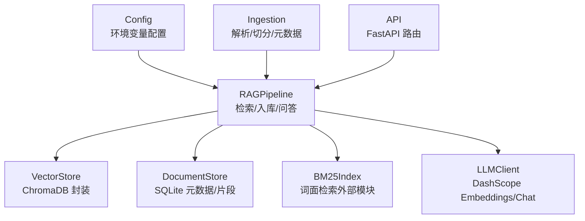
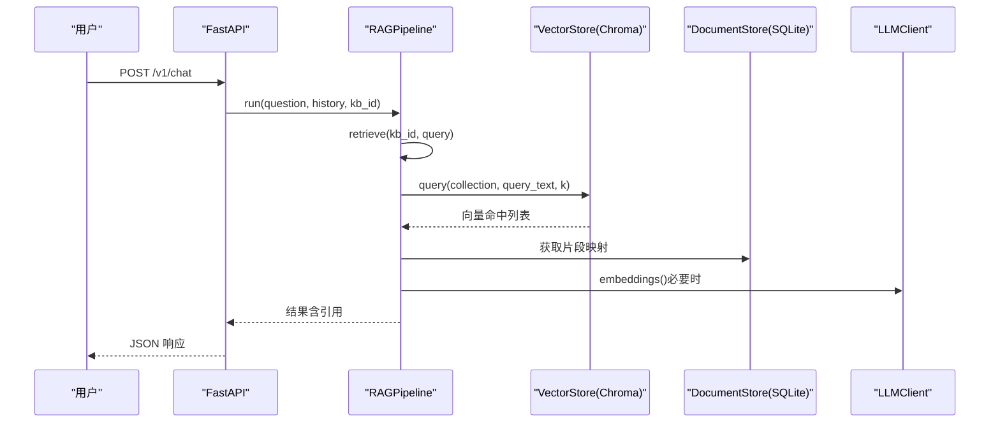
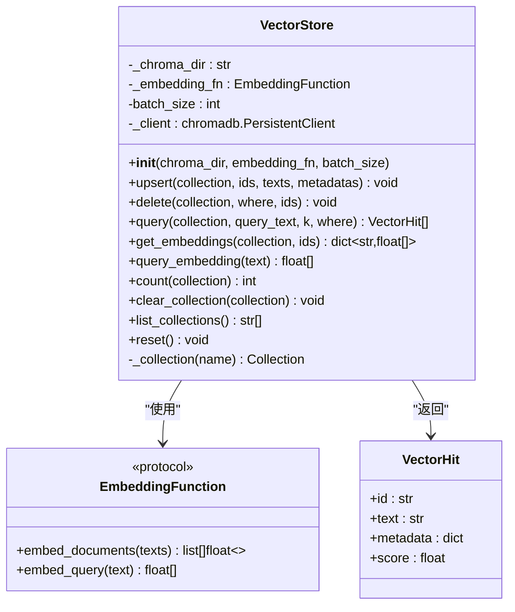
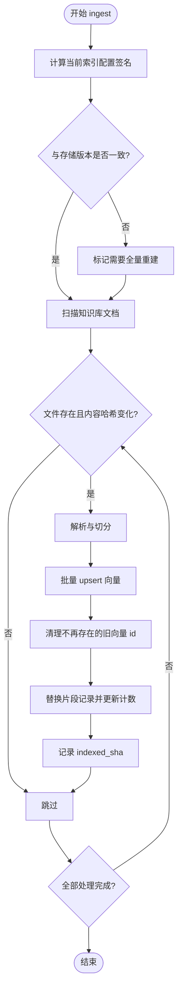
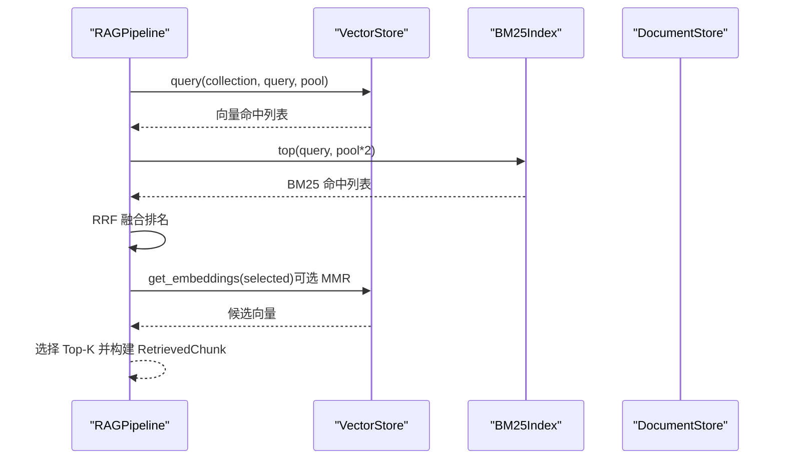
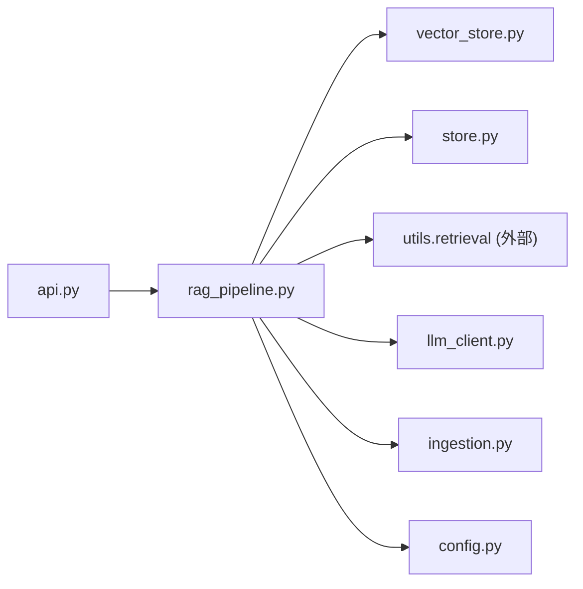

# 向量存储系统

<cite>
**本文引用的文件**
- [vector_store.py](file://vector_store.py)
- [store.py](file://store.py)
- [config.py](file://config.py)
- [ingestion.py](file://ingestion.py)
- [rag_pipeline.py](file://rag_pipeline.py)
- [llm_client.py](file://llm_client.py)
- [api.py](file://api.py)
- [utils/logger.py](file://utils/logger.py)
</cite>

## 目录
1. [简介](#简介)
2. [项目结构](#项目结构)
3. [核心组件](#核心组件)
4. [架构总览](#架构总览)
5. [详细组件分析](#详细组件分析)
6. [依赖关系分析](#依赖关系分析)
7. [性能与优化](#性能与优化)
8. [故障恢复与排错](#故障恢复与排错)
9. [结论](#结论)
10. [附录：API 使用示例与调试方法](#附录api-使用示例与调试方法)

## 简介
本仓库实现了一个面向企业知识库的 RAG（检索增强生成）系统，重点围绕“向量存储”展开。系统以 ChromaDB 作为向量数据库，提供 collection 管理、批量 upsert、相似度检索、按条件删除、取回原始向量等能力；同时结合 SQLite 持久化文档元数据与片段信息，并通过 BM25 + 向量混合检索、RRF 融合与 MMR 去重提升检索质量。配置集中管理，支持增量入库、索引重建、版本控制与多知识库隔离。

## 项目结构
- 向量存储封装：vector_store.py
- 元数据与片段持久化：store.py（SQLite）
- 配置中心：config.py
- 文档解析与切分：ingestion.py
- RAG 管线（入库/检索/问答）：rag_pipeline.py
- LLM/Embedding 客户端：llm_client.py
- REST API 服务层：api.py
- 日志与 token 估算：utils/logger.py

图表来源
- [rag_pipeline.py:196-219](file://rag_pipeline.py#L196-L219)
- [vector_store.py:38-148](file://vector_store.py#L38-L148)
- [store.py:123-155](file://store.py#L123-L155)
- [config.py:56-113](file://config.py#L56-L113)
- [ingestion.py:24-190](file://ingestion.py#L24-L190)
- [llm_client.py:22-73](file://llm_client.py#L22-L73)
- [api.py:34-57](file://api.py#L34-L57)

章节来源
- [rag_pipeline.py:196-219](file://rag_pipeline.py#L196-L219)
- [vector_store.py:38-148](file://vector_store.py#L38-L148)
- [store.py:123-155](file://store.py#L123-L155)
- [config.py:56-113](file://config.py#L56-L113)
- [ingestion.py:24-190](file://ingestion.py#L24-L190)
- [llm_client.py:22-73](file://llm_client.py#L22-L73)
- [api.py:34-57](file://api.py#L34-L57)

## 核心组件
- VectorStore：对 ChromaDB 的轻量封装，固定余弦空间，提供 upsert/delete/query/get_embeddings/list_collections/clear_collection/count/reset 等方法。
- DocumentStore：SQLite 封装，维护知识库、文档、版本、片段与键值配置；WAL 模式与 busy_timeout 保证并发安全。
- RAGPipeline：统一入口，负责知识库管理、增量入库、混合检索（向量+BM25）、MMR 去重、问答生成。
- Ingestion：PDF/Word/Markdown/TXT 解析与递归字符切分，生成片段元数据。
- LLMClient：DashScope 兼容接口，提供 chat/embeddings/stream 等能力。
- Config：集中读取环境变量，控制 chunk_size/top_k/fusion_pool/relevance_threshold/mmr_lambda 等关键参数。
- API：FastAPI 暴露 /v1/* 接口，包含知识库管理、文档上传、入库、统计、问答等。

章节来源
- [vector_store.py:38-148](file://vector_store.py#L38-L148)
- [store.py:123-470](file://store.py#L123-L470)
- [rag_pipeline.py:196-792](file://rag_pipeline.py#L196-L792)
- [ingestion.py:24-216](file://ingestion.py#L24-L216)
- [llm_client.py:22-322](file://llm_client.py#L22-L322)
- [config.py:56-113](file://config.py#L56-L113)
- [api.py:34-204](file://api.py#L34-L204)

## 架构总览
系统采用分层设计：
- 表示层：FastAPI 路由接收请求并调用 RAGPipeline。
- 业务层：RAGPipeline 协调入库、检索与问答流程。
- 存储层：VectorStore（ChromaDB 向量）+ DocumentStore（SQLite 元数据/片段）。
- 模型层：LLMClient 提供嵌入与对话能力。
- 配置层：Config 从环境变量注入参数。

图表来源
- [api.py:185-199](file://api.py#L185-L199)
- [rag_pipeline.py:590-666](file://rag_pipeline.py#L590-L666)
- [vector_store.py:100-126](file://vector_store.py#L100-L126)
- [store.py:425-450](file://store.py#L425-L450)
- [llm_client.py:68-73](file://llm_client.py#L68-L73)

## 详细组件分析

### ChromaDB 集成与 Collection 管理
- Collection 命名：每个知识库对应一个 collection，命名规则为 kb_<kb_id>。
- 向量空间：固定为余弦距离（hnsw:space=cosine），查询返回 distance，系统将其转换为相似度 score = 1 - distance。
- 批量写入：upsert 按 batch_size 分批向量化并写入，id 相同则覆盖，天然支持增量更新。
- 删除与清空：支持按 ids/where 删除；clear_collection 可删除整个集合。
- 列表与计数：list_collections/count 用于运维与统计。
- 内存管理：reset 重建 PersistentClient 连接，避免后台线程完成后索引过期。

图表来源
- [vector_store.py:22-148](file://vector_store.py#L22-L148)

章节来源
- [vector_store.py:38-148](file://vector_store.py#L38-L148)

### 向量维度、距离度量与批量接口
- 向量维度：由嵌入函数决定。默认使用 DashScope 嵌入模型；未配置密钥时回退到模拟嵌入（dim=16）。
- 距离度量：Chroma 使用余弦距离；系统内部将 distance 转为相似度 score = 1 - distance。
- 批量接口：upsert 接受 ids/texts/metadatas 列表，按 batch_size 分批调用 embed_documents 并写入。

章节来源
- [vector_store.py:151-188](file://vector_store.py#L151-L188)
- [vector_store.py:61-78](file://vector_store.py#L61-L78)
- [config.py:90-113](file://config.py#L90-L113)

### 增量更新机制与数据持久化策略
- 增量入库：通过 SHA-256 判重与 indexed_sha 字段判断是否需要重新入库；若索引配置变化（chunk_size/chunk_overlap/embedding_model/collection_space/parser_version），触发全量重建。
- 元数据持久化：SQLite 维护知识库、文档、版本、片段与 meta 键值；WAL 模式与 busy_timeout 保障并发安全。
- 片段一致性：先写新向量，再清理旧片段 id；失败时不会造成“有片段无向量”的不一致状态。
- 版本历史：同一文件重传自动升版本，物理文件保留，便于审计与恢复。

图表来源
- [rag_pipeline.py:306-435](file://rag_pipeline.py#L306-L435)
- [store.py:337-363](file://store.py#L337-L363)

章节来源
- [rag_pipeline.py:306-435](file://rag_pipeline.py#L306-L435)
- [store.py:322-363](file://store.py#L322-L363)

### 混合检索与去重（BM25 + 向量 + RRF + MMR）
- 混合检索：向量 Top-N 与 BM25 Top-N 分别召回，再通过 RRF（倒数秩融合）合并排名。
- 相关性阈值：当最佳向量相似度低于阈值且 BM25 也无命中时，视为无相关内容。
- 文档限定：根据问题中的文件名或人物短名，自动限定检索范围至特定文档，减少无关片段干扰。
- MMR 去重：可选地基于候选向量进行最大边际相关重排，平衡相关性与多样性。

图表来源
- [rag_pipeline.py:439-523](file://rag_pipeline.py#L439-L523)

章节来源
- [rag_pipeline.py:439-523](file://rag_pipeline.py#L439-L523)

### 问答流程与上下文预算
- 问答流程：retrieve 后组装带引用的上下文块，截断至 rag_context_max_tokens，调用 LLM 生成回答。
- 历史裁剪：truncate_history 仅保留最近若干轮，避免长历史稀释注意力。
- 提示工程：RAG_SYSTEM_PROMPT 强制要求严格基于检索资料并标注来源。

章节来源
- [rag_pipeline.py:590-666](file://rag_pipeline.py#L590-L666)
- [rag_pipeline.py:159-193](file://rag_pipeline.py#L159-L193)
- [utils/logger.py:48-62](file://utils/logger.py#L48-L62)

## 依赖关系分析
- RAGPipeline 依赖：
  - VectorStore（ChromaDB）
  - DocumentStore（SQLite）
  - BM25Index（外部模块）
  - LLMClient（DashScope）
  - Ingestion（解析/切分）
  - Config（环境变量）
- API 依赖：
  - FastAPI、uvicorn
  - RAGPipeline、ReActAgent（外部模块）
  - llm_client.safe_error

图表来源
- [api.py:27-57](file://api.py#L27-L57)
- [rag_pipeline.py:27-38](file://rag_pipeline.py#L27-L38)

章节来源
- [api.py:27-57](file://api.py#L27-L57)
- [rag_pipeline.py:27-38](file://rag_pipeline.py#L27-L38)

## 性能与优化
- 批量嵌入：embedding_batch_size 限制在 1–20（受 DashScope 单次上限约束），避免超限错误。
- 检索池大小：fusion_pool 控制向量与 BM25 各自召回数量，影响最终 Top-K 的质量与延迟。
- 相关性阈值：relevance_threshold 防止低相关检索污染答案。
- MMR 去重：mmr_enabled/mmr_lambda 控制多样性和相关性权衡。
- 上下文预算：rag_context_max_tokens 控制放入提示的片段总量，降低 token 成本与首字延迟。
- 并发与锁：API 层使用全局锁串行化读写，避免 SQLite/Chroma 并发冲突；DocumentStore 使用 WAL 与 busy_timeout。

章节来源
- [config.py:90-113](file://config.py#L90-L113)
- [rag_pipeline.py:439-523](file://rag_pipeline.py#L439-L523)
- [api.py:31-33](file://api.py#L31-L33)
- [store.py:132-138](file://store.py#L132-L138)

## 故障恢复与排错
- 增量失败保护：upsert 中途失败不会导致“有片段无向量”，indexed_sha 未更新会重试。
- 缺失文件检测：ingest 报告缺失文件清单，便于定位。
- 索引配置变更：当 chunk_size/chunk_overlap/embedding_model/collection_space/parser_version 变化时，自动全量重建。
- 后端不可用降级：问答/聊天捕获异常并返回友好提示。
- 日志与追踪：AgentTraceLogger 异步追加 JSONL 轨迹，不影响主流程；safe_error 隐藏冗长堆栈。

章节来源
- [rag_pipeline.py:395-418](file://rag_pipeline.py#L395-L418)
- [rag_pipeline.py:590-666](file://rag_pipeline.py#L590-L666)
- [utils/logger.py:12-45](file://utils/logger.py#L12-L45)
- [llm_client.py:297-299](file://llm_client.py#L297-L299)

## 结论
本系统以 ChromaDB 为核心向量存储，配合 SQLite 元数据与 BM25 混合检索，实现了稳定、可配置、可扩展的企业级知识库 RAG 方案。通过增量入库、索引重建、版本管理与相关性阈值控制，兼顾了准确性与鲁棒性；API 层提供简洁的 REST 接口，便于集成与扩展。

## 附录：API 使用示例与调试方法

### 常用 REST 接口
- 健康检查
  - GET /health
- 知识库管理
  - GET /v1/kbs
  - POST /v1/kbs
  - DELETE /v1/kbs/{kb_id}
- 文档管理
  - POST /v1/kbs/{kb_id}/documents（multipart 表单：file/category/tags）
  - GET /v1/kbs/{kb_id}/documents
  - DELETE /v1/documents/{doc_id}
- 入库
  - POST /v1/kbs/{kb_id}/ingest
- 统计
  - GET /v1/kbs/{kb_id}/stats
- 问答
  - POST /v1/chat（JSON：question/history/kb_id）

鉴权：设置 API_AUTH_TOKEN 后，所有 /v1/* 需携带 Authorization: Bearer <token>。

章节来源
- [api.py:98-199](file://api.py#L98-L199)

### 本地自测脚本（VectorStore 演示）
- 运行 vector_store.py 的 __main__ 部分，可演示批量写入、列出集合、相似度检索、取回向量、删除与清空等操作。
- 该脚本会在临时目录创建 Chroma 数据，便于快速验证功能。

章节来源
- [vector_store.py:191-255](file://vector_store.py#L191-L255)

### 调试建议
- 观察检索效果：调整 RETRIEVAL_FUSION_POOL、RETRIEVAL_MMR_ENABLED、RETRIEVAL_MMR_LAMBDA、RETRIEVAL_RELEVANCE_THRESHOLD。
- 监控 token 成本：关注 context_tokens 与 last_usage（prompt/completion/total）。
- 排查 PDF 解析：若出现乱码/扫描件，系统将尝试本地 OCR；确保安装 pymupdf 与 rapidocr。
- 并发问题：API 层已加全局锁；如需更高吞吐，后续可引入任务队列与多进程。

章节来源
- [rag_pipeline.py:439-523](file://rag_pipeline.py#L439-L523)
- [llm_client.py:48-57](file://llm_client.py#L48-L57)
- [ingestion.py:40-78](file://ingestion.py#L40-L78)
- [api.py:31-33](file://api.py#L31-L33)