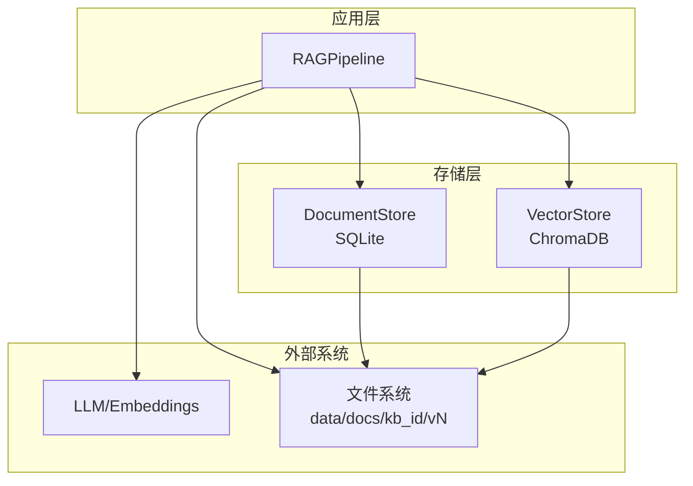
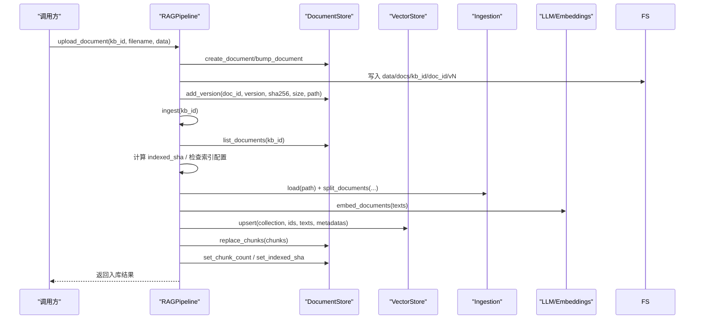
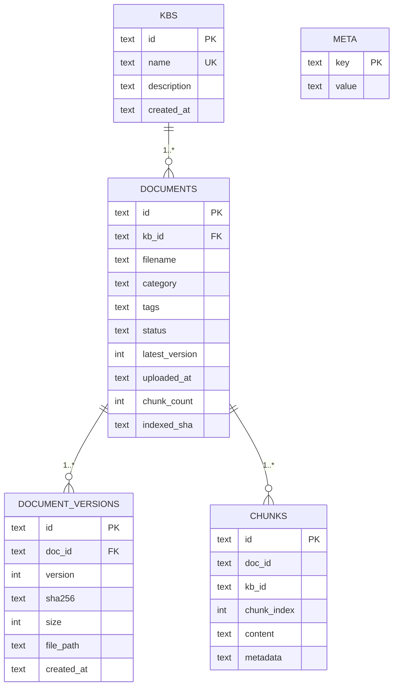
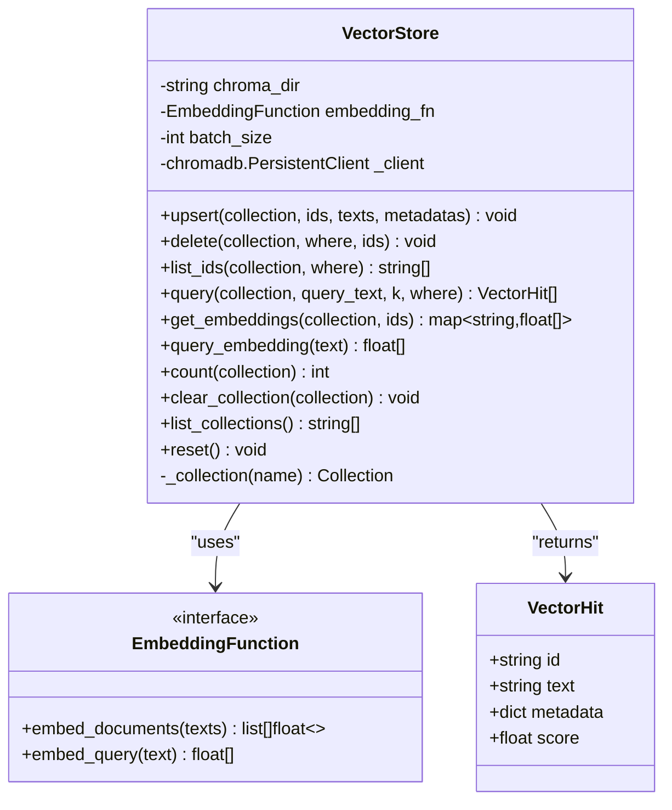
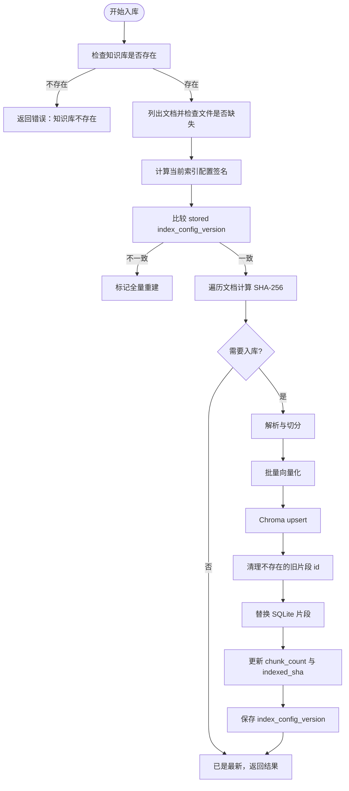
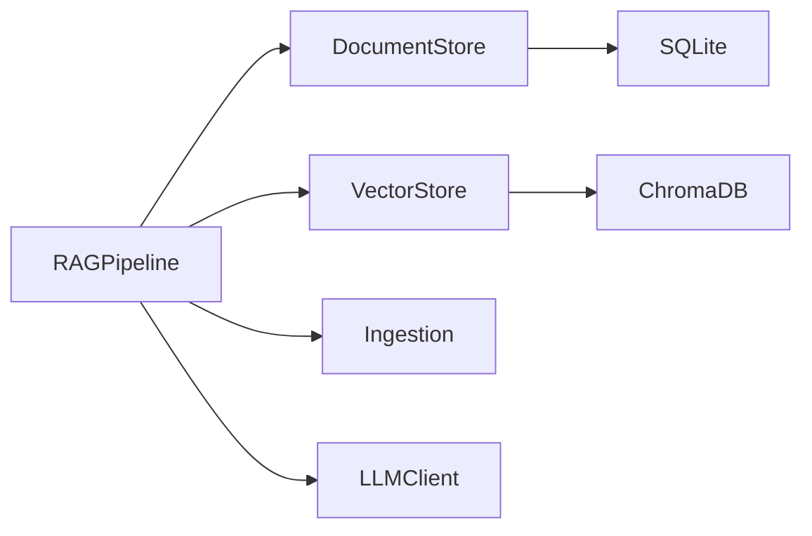

# 数据存储

<cite>
**本文引用的文件**
- [store.py](file://store.py)
- [vector_store.py](file://vector_store.py)
- [config.py](file://config.py)
- [ingestion.py](file://ingestion.py)
- [rag_pipeline.py](file://rag_pipeline.py)
- [ARCHITECTURE.md](file://docs/ARCHITECTURE.md)
- [test_store.py](file://tests/test_store.py)
- [test_ingest.py](file://tests/test_ingest.py)
</cite>

## 目录
1. [简介](#简介)
2. [项目结构](#项目结构)
3. [核心组件](#核心组件)
4. [架构总览](#架构总览)
5. [详细组件分析](#详细组件分析)
6. [依赖关系分析](#依赖关系分析)
7. [性能考虑](#性能考虑)
8. [故障排查指南](#故障排查指南)
9. [结论](#结论)
10. [附录：查询示例与最佳实践](#附录：查询示例与最佳实践)

## 简介
本模块为 RAG 系统的“数据存储”层，负责三类数据持久化与检索：
- SQLite 元数据：知识库、文档、版本、片段、索引配置等。
- ChromaDB 向量存储：按知识库隔离的 collection，支持批量 upsert、条件删除、相似度检索、取回向量用于 MMR 重排。
- 增量入库与版本控制：基于 SHA-256 判重与索引配置签名，实现增量更新与必要时全量重建。

设计目标：单文件 SQLite + WAL 模式，零部署；阶段 A 作为平台底座，阶段 B 可平滑迁移到 PostgreSQL。

## 项目结构
数据存储相关代码集中在以下文件：
- store.py：SQLite 封装、表结构定义、事务与并发安全。
- vector_store.py：ChromaDB 封装，collection 管理、向量化、相似度检索。
- ingestion.py：文档解析与切分，生成片段与元数据。
- rag_pipeline.py：RAG 管线门面，编排入库、检索、问答，并驱动增量入库与版本控制。
- config.py：集中配置（数据库路径、向量库路径、切分参数、检索参数等）。
- docs/ARCHITECTURE.md：架构说明与数据库设计摘要。
- tests/*：针对存储与入库链路的单元测试。

图表来源
- [rag_pipeline.py:196-220](file://rag_pipeline.py#L196-L220)
- [store.py:123-155](file://store.py#L123-L155)
- [vector_store.py:38-59](file://vector_store.py#L38-L59)

章节来源
- [store.py:1-17](file://store.py#L1-L17)
- [vector_store.py:1-10](file://vector_store.py#L1-L10)
- [rag_pipeline.py:1-15](file://rag_pipeline.py#L1-L15)
- [config.py:1-6](file://config.py#L1-L6)
- [ARCHITECTURE.md:45-57](file://docs/ARCHITECTURE.md#L45-L57)

## 核心组件
- DocumentStore（SQLite）
  - 提供知识库、文档、版本、片段、键值配置的 CRUD。
  - 使用 WAL 模式与 busy_timeout，支持后台写与前台读并发。
  - 软删除文档，保留版本历史便于审计与恢复。
- VectorStore（ChromaDB）
  - 每个知识库对应一个 collection（命名 kb_<kb_id>），余弦空间。
  - 批量 upsert、按 where 或 ids 删除、相似度检索、取回向量。
- RAGPipeline
  - 编排上传、解析、切分、向量化、入库、检索、问答。
  - 增量入库：SHA-256 对比 indexed_sha；索引配置变化时全量重建。
  - 混合检索：向量 + BM25，RRF 融合，可选 MMR 去重。
- Ingestion
  - PDF/Word/Markdown/TXT 解析，PDF 文本质量评估与本地 OCR 兜底。
  - 递归字符切分，生成片段元数据（source、page、paragraph、doc_id、kb_id 等）。
- Config
  - 集中配置：数据目录、Chroma 目录、SQLite 路径、切分与检索参数、嵌入批大小等。

章节来源
- [store.py:123-155](file://store.py#L123-L155)
- [vector_store.py:38-149](file://vector_store.py#L38-L149)
- [rag_pipeline.py:196-435](file://rag_pipeline.py#L196-L435)
- [ingestion.py:24-191](file://ingestion.py#L24-L191)
- [config.py:56-113](file://config.py#L56-L113)

## 架构总览
数据存储在 RAG 管线中的位置与作用如下：
- 上传阶段：写入磁盘版本目录，登记版本信息到 SQLite。
- 入库阶段：解析 → 切分 → 批量 Embedding → Chroma upsert → SQLite 片段替换 → 记录 indexed_sha。
- 检索阶段：向量检索 + BM25 检索 → RRF 融合 → 可选 MMR 重排 → 组装上下文 → 生成带引用回答。
- 版本与增量：同名文件重传自动升版本；indexed_sha 与索引配置签名决定是否需要重新入库。

图表来源
- [rag_pipeline.py:260-288](file://rag_pipeline.py#L260-L288)
- [rag_pipeline.py:306-435](file://rag_pipeline.py#L306-L435)
- [store.py:214-274](file://store.py#L214-L274)
- [vector_store.py:61-78](file://vector_store.py#L61-L78)
- [ingestion.py:24-191](file://ingestion.py#L24-L191)

## 详细组件分析

### SQLite 数据库设计与模型
- 表结构与关系
  - kbs：知识库主表，id 为主键，name 唯一，包含描述与创建时间。
  - documents：文档主记录，关联 kb_id，包含文件名、分类、标签、状态、最新版本号、上传时间、片段计数、已索引内容哈希。
  - document_versions：版本历史，记录 doc_id、版本号、sha256、文件大小、物理路径、创建时间。
  - chunks：片段全文与元数据 JSON，包含 doc_id、kb_id、chunk_index、content、metadata。
  - meta：键值配置，如索引配置版本号。
- 约束与一致性
  - 外键：documents.kb_id 引用 kbs.id；document_versions.doc_id 引用 documents.id。
  - 唯一约束：kbs.name 唯一；document_versions(doc_id, version) 唯一；chunks(doc_id, chunk_index) 唯一。
  - 软删除：documents.status 字段标记 active/deleted，删除片段但保留版本历史。
- 并发与迁移
  - WAL 模式 + busy_timeout，后台写与前台读并发安全。
  - _ensure_columns 对旧库进行列级迁移（例如新增 indexed_sha）。

图表来源
- [store.py:31-77](file://store.py#L31-L77)
- [store.py:365-382](file://store.py#L365-L382)

章节来源
- [store.py:31-77](file://store.py#L31-L77)
- [store.py:150-155](file://store.py#L150-L155)
- [store.py:214-382](file://store.py#L214-L382)
- [store.py:384-470](file://store.py#L384-L470)
- [ARCHITECTURE.md:145-162](file://docs/ARCHITECTURE.md#L145-L162)

### ChromaDB 向量存储集成
- Collection 管理
  - 每个知识库对应一个 collection，命名 kb_<kb_id>。
  - 使用余弦距离空间（hnsw:space=cosine），相似度 = 1 - distance。
- 向量化与入库
  - 批量 upsert：按 batch_size 分批调用 embedding_fn.embed_documents，再写入 Chroma。
  - 天然支持增量更新：相同 id 覆盖。
- 删除与清理
  - 支持按 where 条件或 ids 列表删除。
  - 提供 clear_collection 清空整个集合。
- 检索与重排
  - query：返回 VectorHit（id、text、metadata、score）。
  - get_embeddings：取回原始向量，供 MMR 重排使用。
  - query_embedding：将查询文本向量化，用于 MMR。
- 客户端重置
  - reset：重建 PersistentClient，避免内存索引过期。

图表来源
- [vector_store.py:22-28](file://vector_store.py#L22-L28)
- [vector_store.py:30-36](file://vector_store.py#L30-L36)
- [vector_store.py:38-149](file://vector_store.py#L38-L149)

章节来源
- [vector_store.py:1-10](file://vector_store.py#L1-L10)
- [vector_store.py:38-149](file://vector_store.py#L38-L149)

### 增量入库机制与版本控制策略
- 增量判定
  - 计算文件 SHA-256，与 documents.indexed_sha 比较，不同则需重新入库。
  - 索引配置签名（chunk_size、chunk_overlap、embedding_model、collection_space、parser_version）变化时，触发全量重建。
- 版本控制
  - 同名文件重传自动 bump 版本号，新版本写入 data/docs/kb_id/doc_id/vN。
  - 版本历史保存在 document_versions，便于审计与恢复。
- 入库流程
  - 解析 → 切分 → 构建 Chunk 列表 → 批量 upsert 向量 → 清理旧片段 id → 替换 SQLite 片段 → 更新 chunk_count 与 indexed_sha。
  - 失败保护：先写新向量，再清理旧 id；若中途失败，下次 ingest 会自动重试完成。

图表来源
- [rag_pipeline.py:306-435](file://rag_pipeline.py#L306-L435)
- [rag_pipeline.py:739-752](file://rag_pipeline.py#L739-L752)
- [store.py:337-363](file://store.py#L337-L363)

章节来源
- [rag_pipeline.py:306-435](file://rag_pipeline.py#L306-L435)
- [rag_pipeline.py:739-752](file://rag_pipeline.py#L739-L752)
- [store.py:337-363](file://store.py#L337-L363)
- [test_ingest.py:9-29](file://tests/test_ingest.py#L9-L29)

### 数据模型定义与字段类型
- Kb
  - id: 字符串主键
  - name: 非空唯一
  - description: 非空默认空串
  - created_at: 非空时间戳
- DocumentInfo
  - id: 字符串主键
  - kb_id: 非空外键
  - filename: 非空
  - category/tags/status: 非空默认空串/active
  - latest_version: 非空默认 1
  - uploaded_at: 非空时间戳
  - chunk_count: 非空默认 0
  - indexed_sha: 非空默认空串
  - file_path/sha256/size: 来自最新版本
- Chunk
  - id: 字符串主键
  - doc_id/kb_id: 非空
  - chunk_index: 非空整数
  - content: 非空文本
  - metadata: 字典（JSON 序列化）
- 键值配置
  - key: 主键
  - value: 非空字符串

章节来源
- [store.py:88-121](file://store.py#L88-L121)
- [store.py:365-382](file://store.py#L365-L382)
- [store.py:452-470](file://store.py#L452-L470)

### 数据迁移方案
- 列级迁移
  - _ensure_columns：检测并添加缺失列（如 indexed_sha），保证旧库兼容。
- 文件迁移
  - _migrate_legacy_files：首次运行扫描 data/docs 根目录遗留文件，导入默认知识库。
- 配置版本迁移
  - 通过 meta.index_config_version 与当前索引配置签名比较，决定是否全量重建。

章节来源
- [store.py:150-155](file://store.py#L150-L155)
- [rag_pipeline.py:754-773](file://rag_pipeline.py#L754-L773)
- [rag_pipeline.py:318-320](file://rag_pipeline.py#L318-L320)

### 备份恢复流程
- 备份
  - SQLite：复制 .sqlite3 文件（WAL 模式下建议关闭连接后拷贝或使用 PRAGMA wal_checkpoint）。
  - ChromaDB：复制 chroma 目录（PersistentClient 持久化目录）。
  - 文件：data/docs 目录下的各知识库文档与版本。
- 恢复
  - 停止服务，替换 SQLite 与 Chroma 目录，重启服务。
  - 确保权限正确，必要时执行一次 refresh 以重建客户端与缓存。

[本节为通用指导，不直接分析具体文件]

### 性能优化建议
- SQLite
  - 使用 WAL 模式与 busy_timeout，提升并发读写能力。
  - 合理设置 chunk_count 与 indexed_sha，减少重复入库。
- ChromaDB
  - 调整 batch_size（受限于嵌入模型 API 限制，默认 16）。
  - 使用余弦空间，适合语义相似度检索。
- 检索
  - 混合检索（向量 + BM25）+ RRF 融合，提高召回与精度。
  - 相关性阈值过滤低相关结果，避免无意义答案。
  - MMR 去重提升多样性，避免重复片段。
- 配置
  - chunk_size/chunk_overlap 影响切分粒度与上下文长度。
  - top_k/fusion_pool/relevance_threshold/mmr_lambda 可调优检索效果。

章节来源
- [store.py:132-138](file://store.py#L132-L138)
- [vector_store.py:61-78](file://vector_store.py#L61-L78)
- [rag_pipeline.py:439-523](file://rag_pipeline.py#L439-L523)
- [config.py:90-113](file://config.py#L90-L113)

## 依赖关系分析
- RAGPipeline 依赖
  - DocumentStore：知识库、文档、版本、片段、meta。
  - VectorStore：向量 upsert、删除、检索、取向量。
  - Ingestion：解析与切分。
  - LLMClient：聊天与嵌入。
- 存储层内部依赖
  - DocumentStore：SQLite 原生连接，WAL 模式，RLock 保护写事务。
  - VectorStore：ChromaDB PersistentClient，按 collection 隔离。

图表来源
- [rag_pipeline.py:196-220](file://rag_pipeline.py#L196-L220)
- [store.py:123-155](file://store.py#L123-L155)
- [vector_store.py:38-59](file://vector_store.py#L38-L59)

章节来源
- [rag_pipeline.py:196-220](file://rag_pipeline.py#L196-L220)
- [store.py:123-155](file://store.py#L123-L155)
- [vector_store.py:38-59](file://vector_store.py#L38-L59)

## 性能考虑
- 并发访问
  - SQLite WAL 模式与 busy_timeout 允许后台入库与前台问答并发。
  - 后台入库使用独立 RAGPipeline 实例，避免共享 Chroma 客户端导致索引过期。
- 批量处理
  - 嵌入函数按 batch_size 分批调用，避免超出 API 限制。
- 缓存失效
  - 入库完成后调用 refresh，重建 Chroma 客户端并使 BM25/片段缓存失效。
- 检索优化
  - 混合检索 + RRF 融合 + MMR 去重，平衡召回与多样性。
  - 相关性阈值过滤低相关结果，减少无效上下文。

章节来源
- [ARCHITECTURE.md:163-172](file://docs/ARCHITECTURE.md#L163-L172)
- [rag_pipeline.py:720-728](file://rag_pipeline.py#L720-L728)
- [vector_store.py:61-78](file://vector_store.py#L61-L78)
- [rag_pipeline.py:439-523](file://rag_pipeline.py#L439-L523)

## 故障排查指南
- 入库失败
  - 检查文件是否存在与权限；查看 missing 列表。
  - 检查嵌入模型是否可用；未配置密钥时会回退到模拟嵌入。
  - 查看 errors 列表，定位具体异常。
- 向量与片段不一致
  - 先写新向量，再清理旧 id；若失败，下次 ingest 会重试。
  - 使用 list_ids 与 count 核对向量数量。
- 软删除与恢复
  - 软删除仅标记 status=deleted，版本历史保留；可通过 include_deleted=True 查看。
- 并发问题
  - 确认 WAL 模式与 busy_timeout 设置；避免长时间持有连接。

章节来源
- [rag_pipeline.py:306-435](file://rag_pipeline.py#L306-L435)
- [vector_store.py:179-189](file://vector_store.py#L179-L189)
- [store.py:322-335](file://store.py#L322-L335)
- [test_store.py:62-69](file://tests/test_store.py#L62-L69)

## 结论
本数据存储模块以 SQLite 为核心元数据存储，结合 ChromaDB 向量存储，实现了多知识库、文档版本、片段管理、增量入库与混合检索。通过 WAL 模式、RLock、索引配置签名与 SHA-256 判重，系统在并发与一致性方面具备良好保障。未来可平滑迁移至 PostgreSQL 以提升扩展性。

[本节为总结，不直接分析具体文件]

## 附录：查询示例与最佳实践

### SQLite 查询示例
- 列出知识库
  - SELECT * FROM kbs ORDER BY created_at;
- 获取文档及其最新版本信息
  - SELECT d.*, COALESCE(v.sha256,'') AS sha256, COALESCE(v.size,0) AS size, COALESCE(v.file_path,'') AS file_path FROM documents d LEFT JOIN document_versions v ON v.doc_id=d.id AND v.version=d.latest_version WHERE d.id=?;
- 列出某知识库的所有片段
  - SELECT * FROM chunks WHERE kb_id=? ORDER BY doc_id, chunk_index;
- 统计片段数
  - SELECT COUNT(*) AS n FROM chunks WHERE kb_id=?;
- 更新索引配置版本
  - INSERT OR REPLACE INTO meta (key, value) VALUES ('index_config_version', 'vX');

章节来源
- [store.py:176-182](file://store.py#L176-L182)
- [store.py:276-288](file://store.py#L276-L288)
- [store.py:425-450](file://store.py#L425-L450)
- [store.py:454-469](file://store.py#L454-L469)

### ChromaDB 查询示例
- 批量写入
  - upsert(collection, ids, texts, metadatas)
- 相似度检索
  - query(collection, query_text, k, where)
- 取回向量
  - get_embeddings(collection, ids)
- 删除
  - delete(collection, where, ids)
- 清空集合
  - clear_collection(collection)

章节来源
- [vector_store.py:61-149](file://vector_store.py#L61-L149)

### 最佳实践
- 入库前准备
  - 确保文件路径合法，后缀支持（.pdf/.md/.txt/.docx）。
  - 配置合理的 chunk_size 与 chunk_overlap，避免片段过大或过小。
- 增量入库
  - 利用 indexed_sha 与 index_config_version 实现增量更新与全量重建。
  - 失败时保留中间状态，下次自动重试。
- 检索调优
  - 调整 top_k、fusion_pool、relevance_threshold、mmr_lambda。
  - 使用混合检索与 MMR 去重，提升答案质量与多样性。
- 备份与恢复
  - 定期备份 SQLite、Chroma 目录与 data/docs。
  - 恢复后调用 refresh 重建客户端与缓存。

章节来源
- [ingestion.py:17-21](file://ingestion.py#L17-L21)
- [rag_pipeline.py:306-435](file://rag_pipeline.py#L306-L435)
- [rag_pipeline.py:439-523](file://rag_pipeline.py#L439-L523)
- [config.py:90-113](file://config.py#L90-L113)