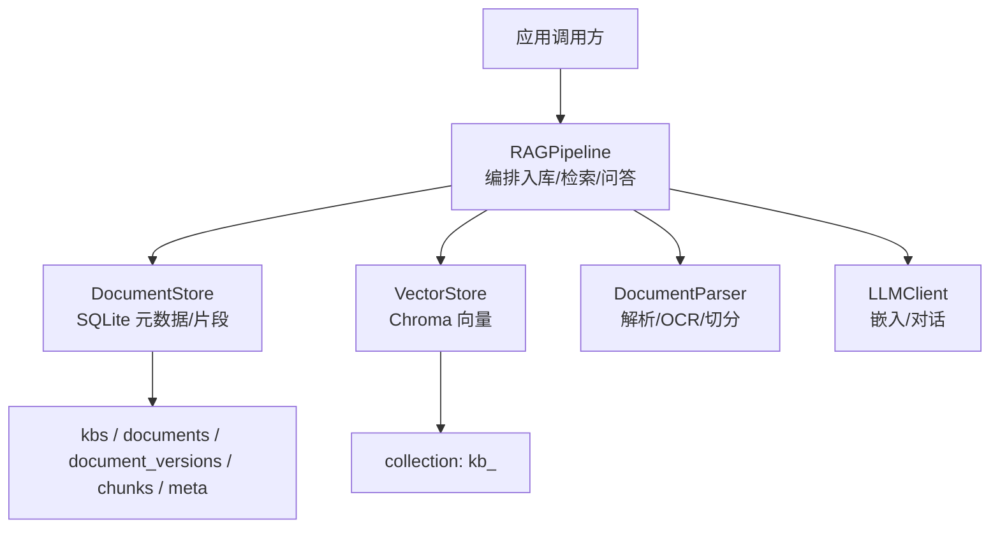
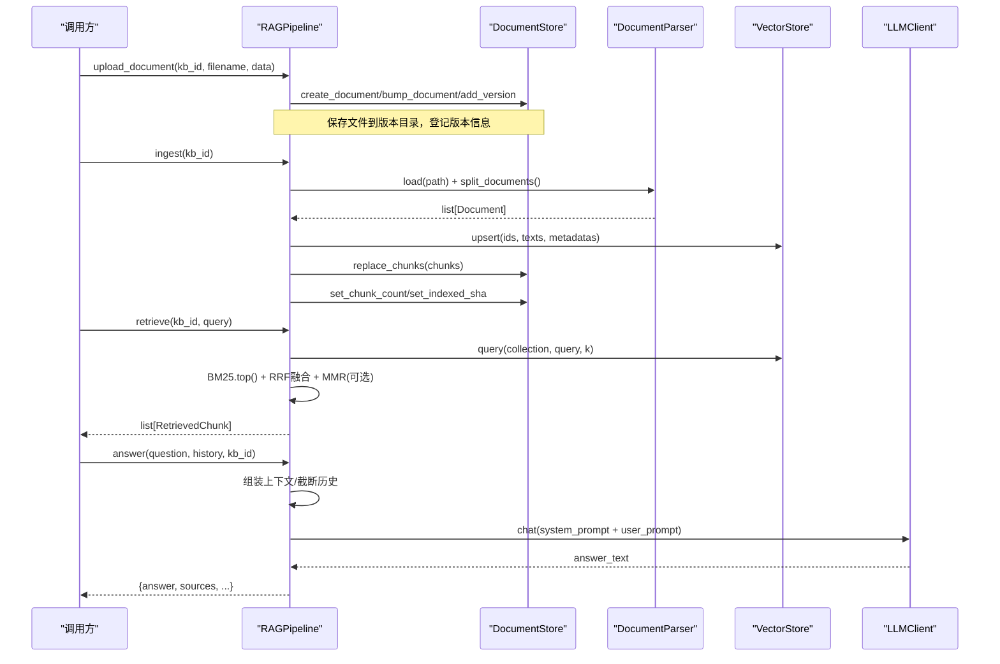
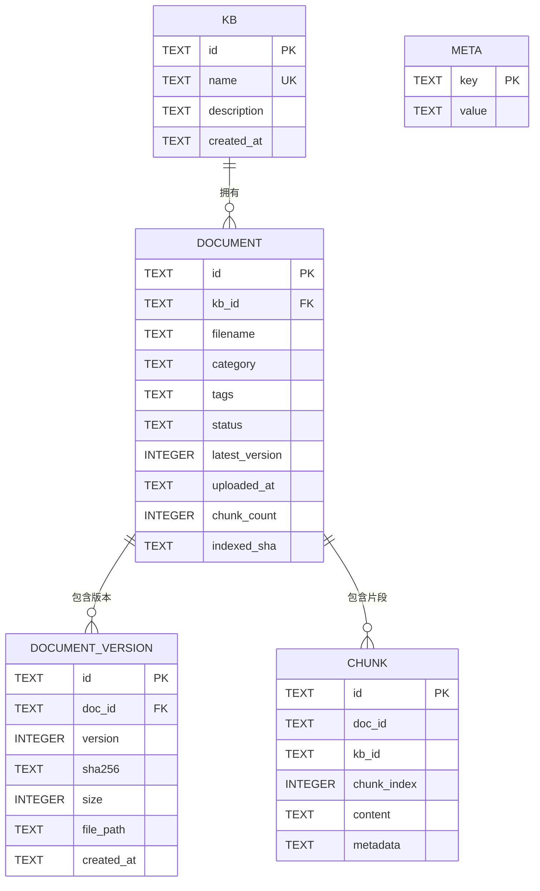
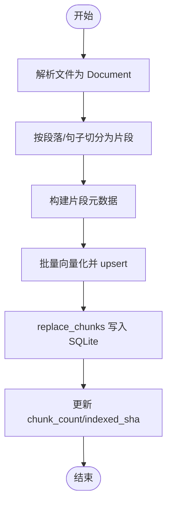
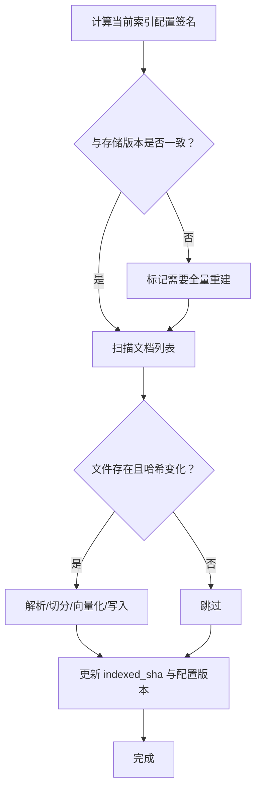
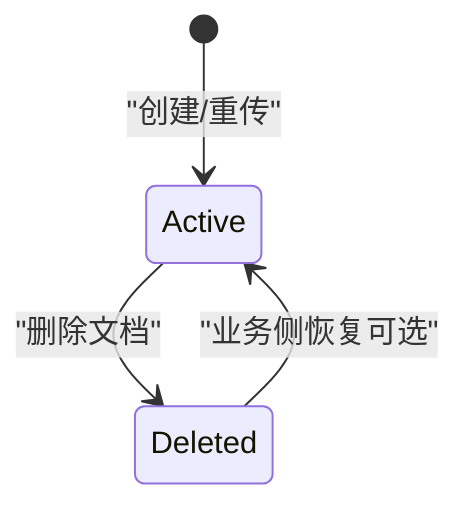
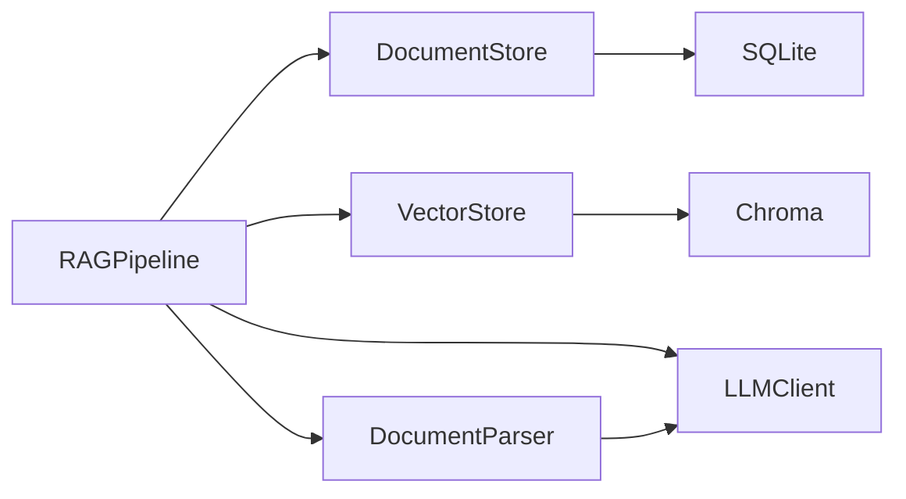

# 数据模型定义

<cite>
**本文引用的文件**
- [store.py](file://store.py)
- [config.py](file://config.py)
- [ingestion.py](file://ingestion.py)
- [vector_store.py](file://vector_store.py)
- [rag_pipeline.py](file://rag_pipeline.py)
- [llm_client.py](file://llm_client.py)
</cite>

## 目录
1. [引言](#引言)
2. [项目结构与数据模型总览](#项目结构与数据模型总览)
3. [核心数据类与字段说明](#核心数据类与字段说明)
4. [架构与数据流](#架构与数据流)
5. [详细组件分析](#详细组件分析)
6. [依赖关系分析](#依赖关系分析)
7. [性能与扩展性](#性能与扩展性)
8. [故障排查与错误处理](#故障排查与错误处理)
9. [结论](#结论)
10. [附录：使用示例与最佳实践](#附录：使用示例与最佳实践)

## 引言
本文件聚焦于 RAG 系统中的核心数据模型，围绕 Kb、DocumentInfo、Chunk 等关键数据结构，系统阐述其字段含义、数据类型、约束与校验规则、序列化格式、版本兼容策略、生命周期管理、状态流转、关联关系，以及数据转换过程、错误处理机制和扩展点设计。文档同时提供使用示例与最佳实践，帮助读者在入库、检索、问答等流程中正确构造与消费数据。

## 项目结构与数据模型总览
- 持久化层（SQLite）：定义知识库、文档主记录、文档版本、片段、键值配置等表结构，并通过 dataclass 映射为内存对象。
- 向量存储层（Chroma）：以 collection 为单位存储片段文本与向量，附带元数据；查询返回带相似度得分的命中结果。
- 解析与切分层：将原始文件解析为结构化 Document，再按段落/句子边界切分为片段，并生成片段元数据。
- 管线层（RAGPipeline）：编排“上传→解析→切分→向量化→索引→检索→回答”的数据流，维护缓存与增量更新策略。
- 配置层（AppConfig）：集中管理所有可调参数，影响切分、检索、重排等行为。

图表来源
- [rag_pipeline.py:196-219](file://rag_pipeline.py#L196-L219)
- [store.py:31-77](file://store.py#L31-L77)
- [vector_store.py:38-55](file://vector_store.py#L38-L55)
- [ingestion.py:24-39](file://ingestion.py#L24-L39)
- [llm_client.py:22-73](file://llm_client.py#L22-L73)

章节来源
- [store.py:1-17](file://store.py#L1-L17)
- [vector_store.py:1-10](file://vector_store.py#L1-L10)
- [ingestion.py:1-5](file://ingestion.py#L1-L5)
- [rag_pipeline.py:1-15](file://rag_pipeline.py#L1-L15)
- [config.py:1-6](file://config.py#L1-L6)

## 核心数据类与字段说明
本节重点说明 Kb、DocumentInfo、Chunk 三个核心数据类的结构、用途、字段含义、类型与约束，以及与数据库表的对应关系。

### Kb（知识库）
- 作用：表示一个独立的知识库，用于隔离文档、片段与向量空间。
- 字段
  - id: 字符串，唯一标识（UUID）。
  - name: 字符串，名称唯一（UNIQUE），不可重复创建。
  - description: 字符串，描述信息，默认空串。
  - created_at: 字符串，ISO 时间戳（UTC）。
- 约束与校验
  - 名称唯一：重复创建会抛出异常（由 SQLite 唯一约束触发）。
  - 删除级联：删除知识库会级联删除其文档与片段记录。
- 序列化/存储
  - 持久化为 kbs 表；读取时通过 Row 映射为 dataclass。
- 生命周期
  - 创建 → 可被引用 → 删除（级联清理）。

章节来源
- [store.py:31-37](file://store.py#L31-L37)
- [store.py:88-94](file://store.py#L88-L94)
- [store.py:158-172](file://store.py#L158-L172)
- [store.py:200-210](file://store.py#L200-L210)

### DocumentInfo（文档主记录）
- 作用：表示知识库中的一个文档主记录，承载文件名、分类、标签、状态、版本、统计等信息，并与最新版本物理文件关联。
- 字段
  - id: 字符串，文档主记录 ID。
  - kb_id: 字符串，所属知识库 ID（外键）。
  - filename: 字符串，文件名。
  - category: 字符串，分类，默认空串。
  - tags: 字符串，标签，默认空串。
  - status: 字符串，状态（active/deleted），默认 active。
  - latest_version: 整数，当前最新版本号。
  - uploaded_at: 字符串，上传时间（UTC）。
  - chunk_count: 整数，片段数量。
  - indexed_sha: 字符串，已索引内容哈希，用于增量判断。
  - file_path: 字符串，最新版本物理路径。
  - sha256: 字符串，最新版本文件哈希。
  - size: 整数，最新版本文件大小。
- 约束与校验
  - 软删除：删除文档仅改状态并清空片段记录，保留版本历史便于审计恢复。
  - 版本递增：同名文件重传自动升版本，并更新分类/标签与上传时间。
- 序列化/存储
  - 持久化为 documents 表；最新版本的 sha256/size/file_path 来自 LEFT JOIN document_versions 的最新版本行。
- 生命周期
  - 创建（版本=1）→ 重传（版本+1）→ 软删除（status=deleted）→ 可选恢复（业务侧决定）。

章节来源
- [store.py:39-61](file://store.py#L39-L61)
- [store.py:96-111](file://store.py#L96-L111)
- [store.py:214-253](file://store.py#L214-L253)
- [store.py:276-304](file://store.py#L276-L304)
- [store.py:322-335](file://store.py#L322-L335)
- [store.py:365-382](file://store.py#L365-L382)

### Chunk（片段）
- 作用：表示从文档切分出的最小检索单元，包含内容与元数据，供 BM25 重建与检索使用。
- 字段
  - id: 字符串，片段 ID（通常为 doc_id:chunk_index）。
  - doc_id: 字符串，所属文档主记录 ID。
  - kb_id: 字符串，所属知识库 ID。
  - chunk_index: 整数，片段序号（同文档内唯一）。
  - content: 字符串，片段正文。
  - metadata: 字典，片段元数据（source、page、paragraph、doc_id、kb_id、category、tags 等）。
- 约束与校验
  - 同文档内片段序号唯一（UNIQUE(doc_id, chunk_index)）。
  - 替换策略：整体替换某文档的片段（先删旧再插新），保证与向量库一致。
- 序列化/存储
  - 持久化为 chunks 表；metadata 序列化为 JSON 字符串，读取时反序列化为 dict。
- 生命周期
  - 生成（解析/切分后构建）→ 批量写入（replace_chunks）→ 按需删除（按 doc_id/kb_id）→ 迭代遍历（BM25/检索）。

章节来源
- [store.py:63-71](file://store.py#L63-L71)
- [store.py:113-121](file://store.py#L113-L121)
- [store.py:386-411](file://store.py#L386-L411)
- [store.py:413-442](file://store.py#L413-L442)

### 其他相关数据模型
- VectorHit：向量检索命中项，包含 id、text、metadata、score（余弦相似度）。
- RetrievedChunk：混合检索结果项，包含三种得分（向量、BM25、RRF融合）以便评估与调试。
- AppConfig：运行期配置，控制切分大小、重叠、top_k、融合池大小、相关性阈值、MMR 开关与权重、上下文 token 上限等。

章节来源
- [vector_store.py:30-36](file://vector_store.py#L30-L36)
- [rag_pipeline.py:134-145](file://rag_pipeline.py#L134-L145)
- [config.py:56-113](file://config.py#L56-L113)

## 架构与数据流
数据流贯穿“上传→解析→切分→向量化→索引→检索→回答”，各阶段对数据模型的读写如下：

图表来源
- [rag_pipeline.py:260-288](file://rag_pipeline.py#L260-L288)
- [rag_pipeline.py:306-435](file://rag_pipeline.py#L306-L435)
- [rag_pipeline.py:439-523](file://rag_pipeline.py#L439-L523)
- [rag_pipeline.py:590-666](file://rag_pipeline.py#L590-L666)
- [ingestion.py:24-39](file://ingestion.py#L24-L39)
- [ingestion.py:178-190](file://ingestion.py#L178-L190)
- [vector_store.py:61-78](file://vector_store.py#L61-L78)
- [vector_store.py:100-126](file://vector_store.py#L100-L126)
- [llm_client.py:94-127](file://llm_client.py#L94-L127)

## 详细组件分析

### 数据模型与数据库映射
- Kb ↔ kbs 表：id/name/description/created_at。
- DocumentInfo ↔ documents 表 + LEFT JOIN document_versions（latest_version）获取 sha256/size/file_path。
- Chunk ↔ chunks 表：content 与 metadata（JSON）分离存储，支持按 doc_id/kb_id 删除与迭代。
- 元数据键值 ↔ meta 表：用于索引配置版本号等全局标记。

图表来源
- [store.py:31-77](file://store.py#L31-L77)

章节来源
- [store.py:31-77](file://store.py#L31-L77)
- [store.py:365-382](file://store.py#L365-L382)

### 数据转换与序列化
- 片段元数据构建：build_chunk_metadata 将 source、page、paragraph、doc_id、kb_id、category、tags 等组合为 metadata 字典，供向量库与检索使用。
- 片段持久化：metadata 字典序列化为 JSON 字符串存入 chunks.metadata；读取时反序列化为 dict。
- 向量入库：upsert 分批向量化并写入 Chroma，id 相同则覆盖，天然支持增量更新。
- 查询结果：query 返回 VectorHit，score = 1 - distance（余弦距离转相似度）。

图表来源
- [ingestion.py:178-190](file://ingestion.py#L178-L190)
- [ingestion.py:193-215](file://ingestion.py#L193-L215)
- [vector_store.py:61-78](file://vector_store.py#L61-L78)
- [store.py:386-411](file://store.py#L386-L411)
- [store.py:337-354](file://store.py#L337-L354)

章节来源
- [ingestion.py:178-215](file://ingestion.py#L178-L215)
- [vector_store.py:61-78](file://vector_store.py#L61-L78)
- [store.py:386-411](file://store.py#L386-L411)

### 版本兼容与增量索引
- 索引配置签名：由 chunk_size、chunk_overlap、embedding_model、collection_space、parser_version 组成，变化时触发全量重建。
- 增量判断：比较文件 SHA-256 与 indexed_sha，不一致则重新入库。
- 列升级：_ensure_columns 动态为 documents 表新增 indexed_sha 列，保障旧库平滑迁移。

图表来源
- [rag_pipeline.py:306-347](file://rag_pipeline.py#L306-L347)
- [rag_pipeline.py:354-435](file://rag_pipeline.py#L354-L435)
- [rag_pipeline.py:739-752](file://rag_pipeline.py#L739-L752)
- [store.py:150-155](file://store.py#L150-L155)

章节来源
- [rag_pipeline.py:306-435](file://rag_pipeline.py#L306-L435)
- [rag_pipeline.py:739-752](file://rag_pipeline.py#L739-L752)
- [store.py:150-155](file://store.py#L150-L155)

### 状态流转与关联关系
- 文档状态：active（默认）↔ deleted（软删除），删除时清空片段记录但保留版本历史。
- 版本关系：documents.latest_version 指向 document_versions.version；每次重传版本+1。
- 片段关系：chunks.doc_id → documents.id；chunks.kb_id → kbs.id；同文档内 chunk_index 唯一。
- 向量关系：Chroma collection 命名 kb_<kb_id>，元数据中包含 doc_id/kb_id 等过滤条件。

图表来源
- [store.py:214-253](file://store.py#L214-L253)
- [store.py:322-335](file://store.py#L322-L335)

章节来源
- [store.py:214-253](file://store.py#L214-L253)
- [store.py:322-335](file://store.py#L322-L335)

## 依赖关系分析
- 模块耦合
  - RAGPipeline 依赖 DocumentStore、VectorStore、DocumentParser、LLMClient。
  - DocumentStore 依赖 SQLite 与 dataclass；VectorStore 依赖 Chroma 与 EmbeddingFunction 协议。
  - ingestion 依赖 LangChain 加载器与切分器，输出标准 Document 列表。
- 外部依赖
  - DashScope 嵌入/对话接口（可通过环境变量切换或回退到模拟实现）。
  - PyMuPDF/RapidOCR 用于 PDF OCR 回退路径。
- 潜在循环依赖
  - 当前无直接循环导入；各模块职责清晰，通过接口/协议解耦。

图表来源
- [rag_pipeline.py:196-219](file://rag_pipeline.py#L196-L219)
- [store.py:123-138](file://store.py#L123-L138)
- [vector_store.py:38-55](file://vector_store.py#L38-L55)
- [ingestion.py:24-39](file://ingestion.py#L24-L39)
- [llm_client.py:22-73](file://llm_client.py#L22-L73)

章节来源
- [rag_pipeline.py:196-219](file://rag_pipeline.py#L196-L219)
- [store.py:123-138](file://store.py#L123-L138)
- [vector_store.py:38-55](file://vector_store.py#L38-L55)
- [ingestion.py:24-39](file://ingestion.py#L24-L39)
- [llm_client.py:22-73](file://llm_client.py#L22-L73)

## 性能与扩展性
- 批量向量化：VectorStore.upsert 按 batch_size 分批嵌入与写入，避免单次过大导致失败。
- 并发安全：DocumentStore 写操作使用 RLock 保护；SQLite 启用 WAL 与 busy_timeout，提升并发读能力。
- 增量索引：SHA-256 判重与配置签名变更检测，减少不必要的全量重建。
- 检索优化：混合检索（向量+BM25）+ RRF 融合 + MMR 去重，兼顾召回与多样性；相关性阈值避免低质答案。
- 可扩展点
  - EmbeddingFunction 协议：可替换为任意嵌入实现（DashScope/本地/模拟）。
  - 解析器注入：DocumentParser.load 可替换为测试用假解析器。
  - 配置驱动：AppConfig 集中管理参数，便于部署调优。

章节来源
- [vector_store.py:61-78](file://vector_store.py#L61-L78)
- [store.py:123-138](file://store.py#L123-L138)
- [rag_pipeline.py:306-435](file://rag_pipeline.py#L306-L435)
- [rag_pipeline.py:439-523](file://rag_pipeline.py#L439-L523)
- [config.py:56-113](file://config.py#L56-L113)

## 故障排查与错误处理
- 常见错误
  - 不支持的文件类型：upload 与 parser 均会拒绝非白名单后缀。
  - PDF 文本不可读且未安装 OCR 依赖：提示安装 pymupdf/rapidocr/onnxruntime。
  - 向量服务不可用：问答/检索失败时返回友好错误消息（safe_error）。
  - 知识库不存在：ingest/retrieve 提前返回空结果或错误信息。
- 错误定位
  - 检查 indexed_sha 与文件哈希是否一致，确认是否需重新入库。
  - 检查 chunks 与向量集合是否一致（replace_chunks 与 upsert 成对执行）。
  - 检查 App 配置（chunk_size/chunk_overlap/top_k/fusion_pool/relevance_threshold/mmr_lambda）。
- 日志与诊断
  - ingest 返回 indexed/errors/chunks/force_reindex/message，便于 UI 展示进度与失败原因。
  - RetrievedChunk 携带 vector_score/bm25_score/rrf_score，便于评估检索效果。

章节来源
- [ingestion.py:27-39](file://ingestion.py#L27-L39)
- [ingestion.py:124-150](file://ingestion.py#L124-L150)
- [rag_pipeline.py:306-435](file://rag_pipeline.py#L306-L435)
- [rag_pipeline.py:590-666](file://rag_pipeline.py#L590-L666)
- [llm_client.py:297-299](file://llm_client.py#L297-L299)

## 结论
本项目以 Kb、DocumentInfo、Chunk 为核心数据模型，配合 SQLite 与 Chroma 分别管理元数据与向量，形成稳定、可配置、可扩展的 RAG 数据底座。通过增量索引、版本管理、混合检索与严格的状态控制，系统在准确性、性能与可维护性之间取得良好平衡。建议在生产环境中结合配置调优与监控指标（如检索命中率、token 消耗）持续优化。

## 附录：使用示例与最佳实践
- 创建知识库与上传文档
  - 使用 RAGPipeline.create_kb/upload_document 创建知识库并上传文件；同名文件重传自动升版本。
  - 参考路径：[rag_pipeline.py:223-288](file://rag_pipeline.py#L223-L288)
- 入库与增量更新
  - 调用 ingest 进行解析/切分/向量化；若配置或文件变化，自动增量或全量重建。
  - 参考路径：[rag_pipeline.py:306-435](file://rag_pipeline.py#L306-L435)
- 检索与问答
  - 调用 retrieve 获取混合检索结果；调用 answer 生成带引用的回答。
  - 参考路径：[rag_pipeline.py:439-523](file://rag_pipeline.py#L439-L523), [rag_pipeline.py:590-666](file://rag_pipeline.py#L590-L666)
- 配置调优
  - 调整 chunk_size/chunk_overlap/top_k/fusion_pool/relevance_threshold/mmr_enabled/mmr_lambda/history_max_tokens/rag_context_max_tokens。
  - 参考路径：[config.py:56-113](file://config.py#L56-L113)
- 最佳实践
  - 保持 indexed_sha 与文件哈希一致，确保增量索引生效。
  - 合理设置相关性阈值与 MMR 权重，平衡召回与多样性。
  - 使用软删除与版本历史，便于审计与恢复。
  - 通过 EmbeddingFunction 协议替换嵌入实现，适配不同环境。

章节来源
- [rag_pipeline.py:223-288](file://rag_pipeline.py#L223-L288)
- [rag_pipeline.py:306-435](file://rag_pipeline.py#L306-L435)
- [rag_pipeline.py:439-523](file://rag_pipeline.py#L439-L523)
- [rag_pipeline.py:590-666](file://rag_pipeline.py#L590-L666)
- [config.py:56-113](file://config.py#L56-L113)