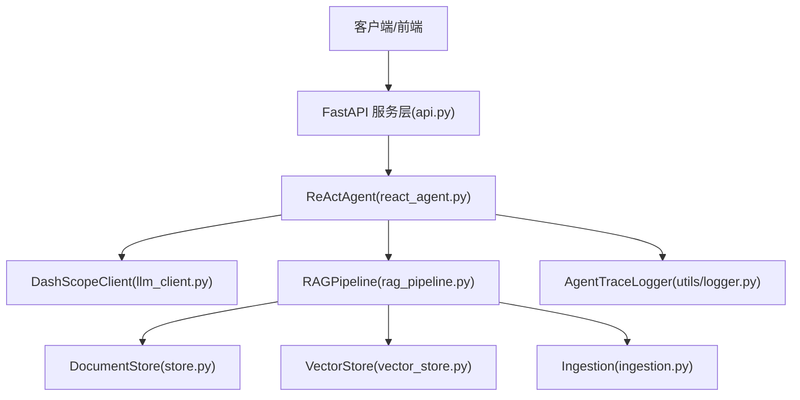
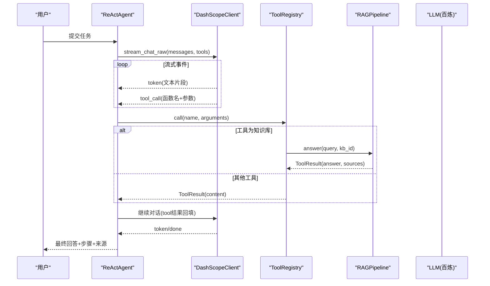
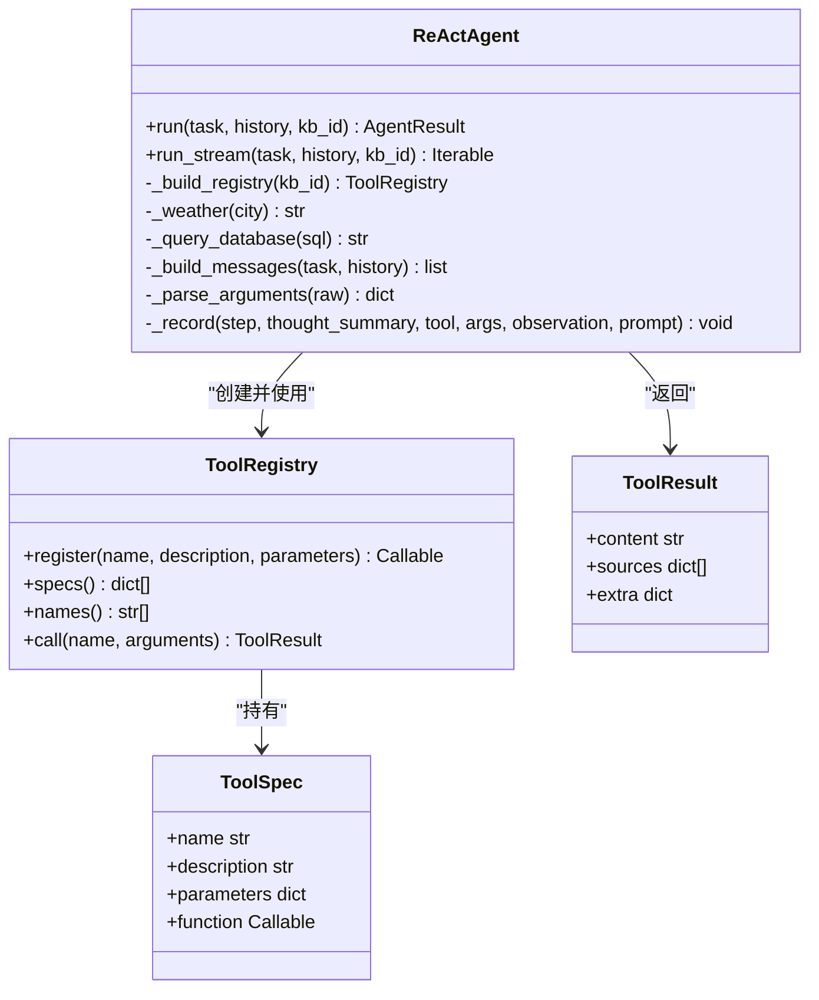
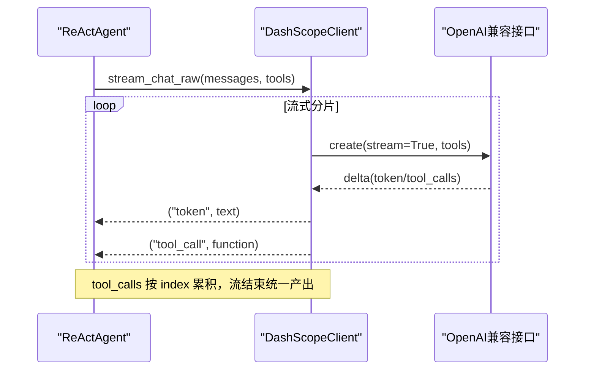
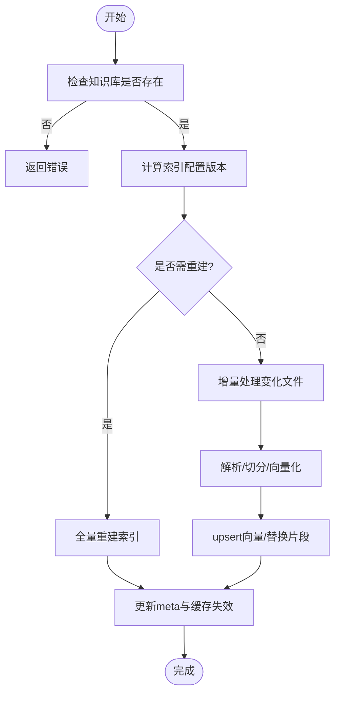
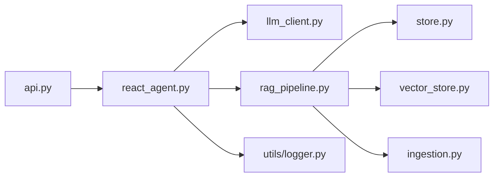

# Agent系统模块

<cite>
**本文引用的文件**   
- [react_agent.py](file://react_agent.py)
- [llm_client.py](file://llm_client.py)
- [rag_pipeline.py](file://rag_pipeline.py)
- [config.py](file://config.py)
- [api.py](file://api.py)
- [store.py](file://store.py)
- [vector_store.py](file://vector_store.py)
- [ingestion.py](file://ingestion.py)
- [utils/logger.py](file://utils/logger.py)
- [README.md](file://README.md)
</cite>

## 目录
1. [简介](#简介)
2. [项目结构](#项目结构)
3. [核心组件](#核心组件)
4. [架构总览](#架构总览)
5. [详细组件分析](#详细组件分析)
6. [依赖关系分析](#依赖关系分析)
7. [性能与可扩展性](#性能与可扩展性)
8. [故障排查指南](#故障排查指南)
9. [结论](#结论)
10. [附录：工具开发与集成指南](#附录工具开发与集成指南)

## 简介
本模块实现了一个基于 Function Calling 的轻量 ReActAgent，具备“工具注册表 + 多步循环 + 流式输出”的能力。Agent 通过 LLM 自主选择工具（知识库检索、联网搜索、天气查询、只读数据库查询），执行后将结果回填给模型，直到模型给出最终回答或达到最大轮数。同时提供 REST API 服务层，支持鉴权与文档管理、入库与问答。

## 项目结构
- 入口与服务层
  - api.py：FastAPI 服务层，暴露 /v1/* 接口，包含鉴权、知识库管理、文档上传/入库、问答等。
  - app.py：Streamlit 界面（不在本次重点）。
- Agent 与 RAG
  - react_agent.py：ReActAgent 主逻辑，工具注册表、多步循环、流式事件。
  - rag_pipeline.py：RAGPipeline，负责知识库管理、增量入库、混合检索、带引用问答。
  - llm_client.py：DashScopeClient，封装对话、流式、Function Calling、Embedding、联网搜索。
- 存储与索引
  - store.py：SQLite 元数据与片段存储。
  - vector_store.py：Chroma 向量存储封装。
  - ingestion.py：文档解析与切分（PDF/Word/Markdown/TXT，含本地 OCR 兜底）。
- 配置与日志
  - config.py：集中配置项，全部来自环境变量。
  - utils/logger.py：线程安全的 JSONL 轨迹日志。
- 文档与测试
  - README.md：使用说明、配置项、目录结构、数据存储说明等。

图表来源
- [api.py:18-57](file://api.py#L18-L57)
- [react_agent.py:144-161](file://react_agent.py#L144-L161)
- [llm_client.py:22-46](file://llm_client.py#L22-L46)
- [rag_pipeline.py:196-219](file://rag_pipeline.py#L196-L219)
- [store.py:123-138](file://store.py#L123-L138)
- [vector_store.py:38-55](file://vector_store.py#L38-L55)
- [ingestion.py:24-38](file://ingestion.py#L24-L38)
- [utils/logger.py:12-45](file://utils/logger.py#L12-L45)

章节来源
- [README.md:116-142](file://README.md#L116-L142)

## 核心组件
- ReActAgent：实现工具注册表、消息构建、流式调用、工具选择与执行、结果回填、步骤记录。
- ToolRegistry：以装饰器方式注册工具，生成 OpenAI tools 格式，按名调用并统一返回 ToolResult。
- DashScopeClient：提供 chat/chat_raw/stream_chat/stream_chat_raw/web_search/embeddings，支持 Function Calling 流式事件。
- RAGPipeline：知识库管理、增量入库、混合检索（向量+BM25，RRF融合，MMR重排）、带引用问答。
- DocumentStore/VectorStore/Ingestion：持久化、向量化、解析切分与OCR兜底。
- AppConfig：集中配置，控制 Agent 最大步数、检索参数、上下文预算等。
- AgentTraceLogger：记录每步 thought_summary、tool、args、observation、cost_estimate。

章节来源
- [react_agent.py:69-142](file://react_agent.py#L69-L142)
- [react_agent.py:144-370](file://react_agent.py#L144-L370)
- [llm_client.py:94-294](file://llm_client.py#L94-L294)
- [rag_pipeline.py:196-697](file://rag_pipeline.py#L196-L697)
- [config.py:56-112](file://config.py#L56-L112)
- [utils/logger.py:12-62](file://utils/logger.py#L12-L62)

## 架构总览
ReActAgent 通过 LLM 的 Function Calling 能力，将工具以 JSON Schema 形式下发给模型；模型根据用户问题决定调用哪个工具及参数。Agent 在流式响应中收集 tool_call 事件，执行工具后把结果作为 tool 消息回填，形成 observe → think → act 的多步循环。

图表来源
- [react_agent.py:272-370](file://react_agent.py#L272-L370)
- [llm_client.py:203-278](file://llm_client.py#L203-L278)
- [rag_pipeline.py:590-666](file://rag_pipeline.py#L590-L666)

## 详细组件分析

### ReActAgent 与工具系统
- 工具定义规范
  - 使用 @registry.register(name, description, parameters) 装饰普通函数，parameters 为 JSON Schema，function 返回 ToolResult（content、sources、extra）。
  - 内置工具：search_knowledge_base、get_weather、search_web、query_database。
- 动态注册机制
  - ToolRegistry 维护 name→ToolSpec 映射，specs() 生成 OpenAI tools 列表，call(name, args) 按名调用并捕获异常。
- 多步循环执行逻辑
  - run_stream 调用 stream_chat_raw，聚合 tool_call 事件，构造 assistant 消息并回填 tool 结果，直至模型直接回答或达到 max_steps。
  - 工具结果截断至 TOOL_OBSERVATION_MAX_CHARS，避免长结果稀释注意力。
- 流式事件处理
  - 事件类型：token、tool_start、tool_end、step、done、error。UI 可逐帧渲染。
- 错误处理
  - 工具异常被包装为 ToolResult.content，便于模型重试或直接回答；模型调用失败抛出安全错误信息。

图表来源
- [react_agent.py:69-142](file://react_agent.py#L69-L142)
- [react_agent.py:144-370](file://react_agent.py#L144-L370)

章节来源
- [react_agent.py:69-142](file://react_agent.py#L69-L142)
- [react_agent.py:144-370](file://react_agent.py#L144-L370)

### LLM 客户端与 Function Calling
- 接口设计
  - chat：非流式对话。
  - chat_raw：返回完整 message（含 tool_calls），供 Agent 工具循环使用。
  - stream_chat：流式输出 reasoning/content。
  - stream_chat_raw：流式输出 token 与 tool_call 事件，累积 tool_calls 并在流结束后产出。
- 工具协议
  - tools/tool_choice 透传 OpenAI 兼容格式；stream_chat_raw 对 tool_calls 增量帧进行 index 累积，保证完整性。
- 联网搜索
  - web_search 通过 enable_search=True 调用模型联网能力。

图表来源
- [llm_client.py:203-278](file://llm_client.py#L203-L278)

章节来源
- [llm_client.py:94-294](file://llm_client.py#L94-L294)

### RAG 管线与混合检索
- 知识库管理
  - create_kb/list_kbs/get_kb/delete_kb/kb_stats。
- 增量入库
  - ingest 检测文件变化（SHA-256）与索引配置版本，增量更新向量与片段，支持 on_progress 进度回调。
- 混合检索
  - 向量 Top-N + BM25 Top-N，RRF 融合排序，可选 MMR 去重重排；相关性阈值过滤低相关查询。
- 带引用问答
  - answer 组装上下文与历史，生成带引用来源的回答；chat 用于无知识库场景。

图表来源
- [rag_pipeline.py:306-435](file://rag_pipeline.py#L306-L435)

章节来源
- [rag_pipeline.py:196-697](file://rag_pipeline.py#L196-L697)

### 存储与索引
- DocumentStore（SQLite）
  - 表结构：kbs、documents、document_versions、chunks、meta；WAL 模式与 busy_timeout 提升并发安全。
  - 方法：创建/删除知识库、文档版本管理、片段替换/删除、迭代片段、键值配置。
- VectorStore（Chroma）
  - 每个知识库一个 collection；批量 upsert、条件删除、相似度查询、取回向量做 MMR。
- Ingestion
  - 支持 PDF/Word/Markdown/TXT；PDF 文本质量评估，必要时本地 OCR（PyMuPDF + RapidOCR）。

章节来源
- [store.py:31-138](file://store.py#L31-L138)
- [store.py:158-470](file://store.py#L158-L470)
- [vector_store.py:38-148](file://vector_store.py#L38-L148)
- [ingestion.py:24-190](file://ingestion.py#L24-L190)

### 配置与日志
- AppConfig
  - 集中配置：data_dir/chroma_dir/db_path、chunk_size/chunk_overlap、top_k/fusion_pool/relevance_threshold、mmr_enabled/mmr_lambda、query_rewrite_enabled、history_max_tokens/rag_context_max_tokens、agent_max_steps、embedding_batch_size。
- AgentTraceLogger
  - 线程安全 JSONL 轨迹日志，记录 step/thought_summary/tool/args/observation/cost_estimate。

章节来源
- [config.py:56-112](file://config.py#L56-L112)
- [utils/logger.py:12-62](file://utils/logger.py#L12-L62)

### API 服务层
- FastAPI 路由
  - /health、/v1/kbs（CRUD）、/v1/kbs/{kb_id}/documents（上传/列表）、/v1/kbs/{kb_id}/ingest、/v1/documents/{doc_id}（删除）、/v1/chat（问答）。
- 鉴权
  - 可选 Bearer Token 校验，未配置时放行（仅建议本机调试）。
- 串行化
  - 使用全局锁保护 SQLite/Chroma 并发访问。

章节来源
- [api.py:18-57](file://api.py#L18-L57)
- [api.py:98-204](file://api.py#L98-L204)

## 依赖关系分析
- ReActAgent 依赖 DashScopeClient 与 RAGPipeline；RAGPipeline 依赖 DocumentStore、VectorStore、Ingestion；API 层依赖 ReActAgent 与 RAGPipeline。
- 外部依赖：DashScope（对话/Embedding/联网搜索）、Chroma（向量库）、SQLite（元数据）、LangChain（嵌入/解析/切分）。

图表来源
- [api.py:18-57](file://api.py#L18-L57)
- [react_agent.py:144-161](file://react_agent.py#L144-L161)
- [rag_pipeline.py:196-219](file://rag_pipeline.py#L196-L219)

章节来源
- [api.py:18-57](file://api.py#L18-L57)
- [react_agent.py:144-161](file://react_agent.py#L144-L161)
- [rag_pipeline.py:196-219](file://rag_pipeline.py#L196-L219)

## 性能与可扩展性
- 流式输出降低首字延迟，提升用户体验。
- 混合检索（向量+BM25）与 RRF/MMR 提升召回与多样性。
- 增量入库减少重复计算，SHA-256 判重确保一致性。
- 上下文与历史截断控制 token 预算，避免注意力发散与成本浪费。
- 可扩展点：
  - 新增工具只需实现函数并用 @registry.register 注册。
  - 替换 LLM 客户端仅需实现 LLMClient 协议。
  - 向量库/解析器可通过注入替换（如测试用 Mock）。

[本节为通用指导，不直接分析具体文件]

## 故障排查指南
- 模型调用失败
  - 检查 DASHSCOPE_API_KEY、DASHSCOPE_BASE_URL、DASHSCOPE_CHAT_MODEL 配置；查看 safe_error 输出。
- 工具执行失败
  - 工具异常会被包装为 ToolResult.content，模型有机会重试或直接回答；检查工具实现与参数。
- 知识库为空或无相关内容
  - 确认已上传并成功入库；检查 retrieve 的相关性阈值与混合检索命中情况。
- 并发写入冲突
  - API 层使用全局锁保护；若自定义扩展，注意 SQLite/Chroma 并发限制。
- 日志不可写
  - AgentTraceLogger 单条写入失败不影响主流程；检查 data/agent_trace.jsonl 路径权限。

章节来源
- [llm_client.py:297-299](file://llm_client.py#L297-L299)
- [react_agent.py:130-142](file://react_agent.py#L130-L142)
- [rag_pipeline.py:439-523](file://rag_pipeline.py#L439-L523)
- [api.py:185-199](file://api.py#L185-L199)
- [utils/logger.py:39-45](file://utils/logger.py#L39-L45)

## 结论
该 Agent 系统以 Function Calling 为核心，实现了工具注册、多步循环与流式交互，结合 RAG 的混合检索与增量入库，提供了企业级知识库问答的基础能力。通过集中配置与可插拔设计，具备良好的可扩展性与可维护性。

[本节为总结，不直接分析具体文件]

## 附录：工具开发与集成指南
- 工具开发步骤
  - 定义函数，返回 ToolResult（content、sources、extra）。
  - 使用 @registry.register(name, description, parameters) 注册，parameters 为 JSON Schema。
  - 示例工具：search_knowledge_base、get_weather、search_web、query_database。
- 参数验证
  - 由 LLM 根据 JSON Schema 生成参数；Agent 侧 _parse_arguments 容忍 markdown 代码块包裹。
- 执行结果处理
  - ToolResult.content 回填给模型，sources 用于 UI 引用展示，extra 可用于统计（如 context_tokens）。
- 错误处理
  - 工具异常捕获并包装为 ToolResult.content；模型调用失败抛出安全错误。
- 超时控制与重试
  - DashScopeClient 设置 timeout=90.0、max_retries=2；网络请求（天气）使用 urlopen(timeout=15)。
  - 建议在工具实现中增加重试与降级策略（如联网搜索失败时退回通用知识）。
- 自定义工具集成示例
  - 新增工具：实现函数 → 注册 → 在 run_stream 中自动参与工具选择与执行。
  - 注意事项：确保 JSON Schema 描述准确；避免返回过长 content；合理设置 sources 以便溯源。

章节来源
- [react_agent.py:93-142](file://react_agent.py#L93-L142)
- [react_agent.py:165-246](file://react_agent.py#L165-L246)
- [react_agent.py:493-504](file://react_agent.py#L493-L504)
- [llm_client.py:75-86](file://llm_client.py#L75-L86)
- [react_agent.py:437-441](file://react_agent.py#L437-L441)