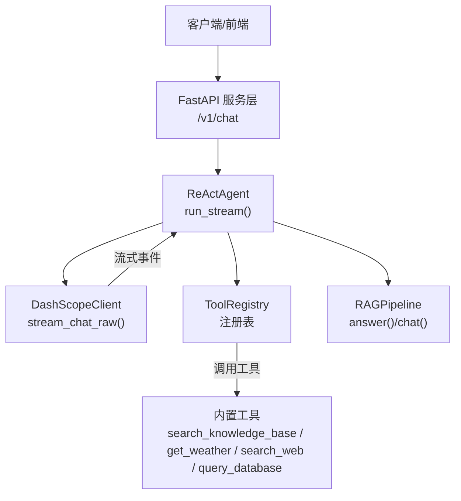
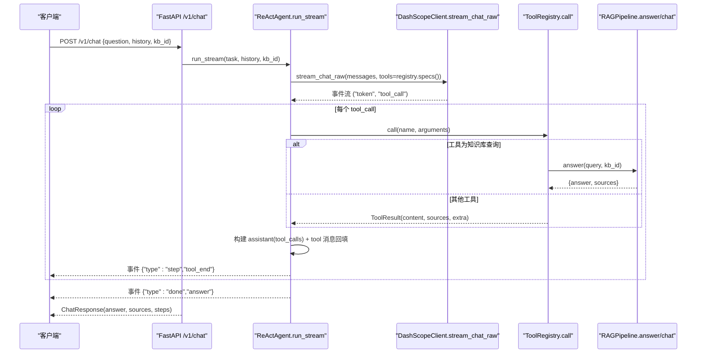
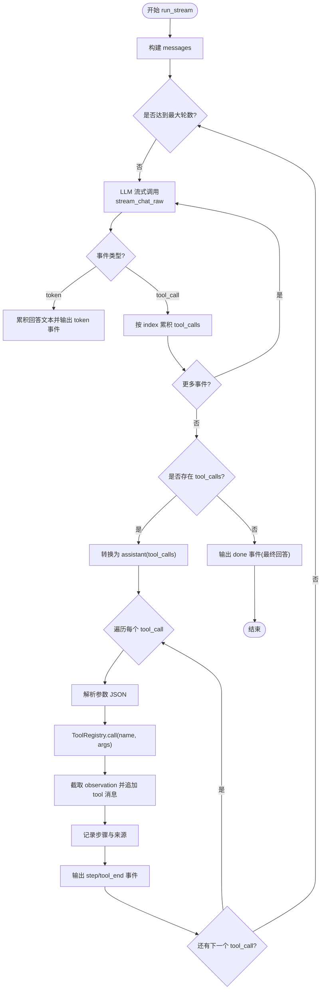
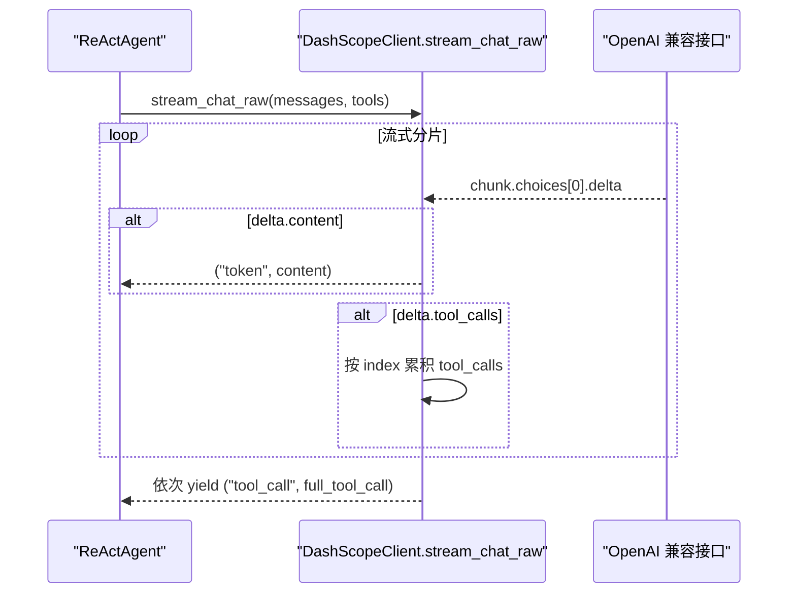
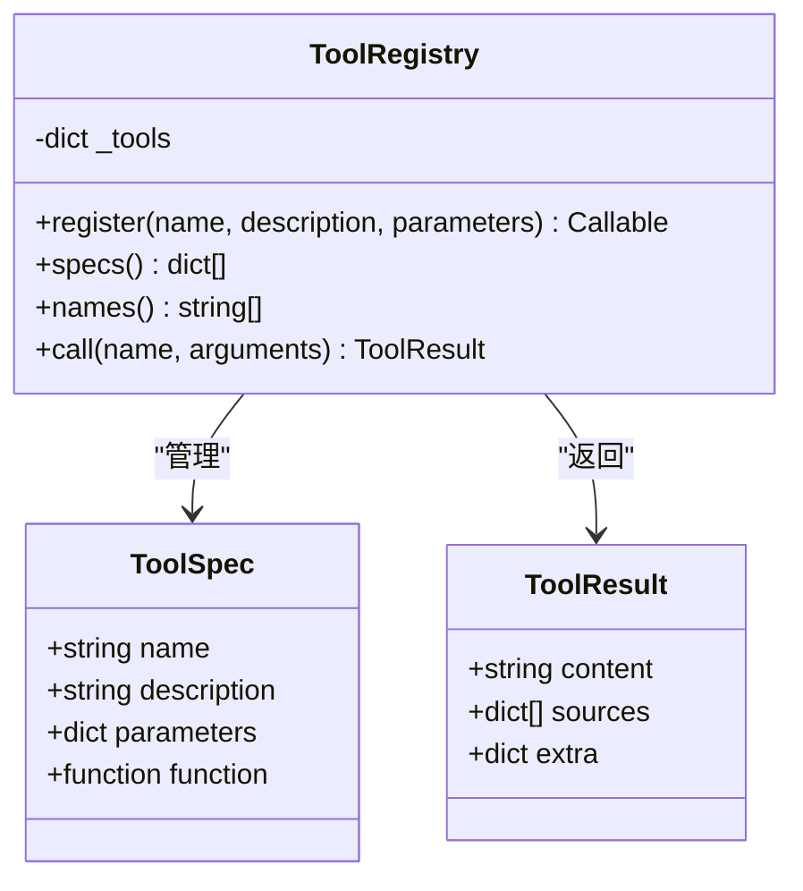
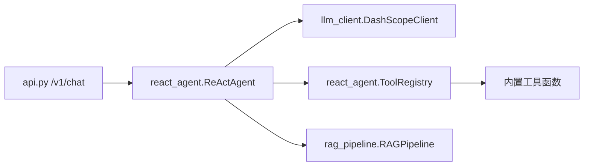

# Function Calling实现

<cite>
**本文引用的文件**
- [react_agent.py](file://react_agent.py)
- [llm_client.py](file://llm_client.py)
- [rag_pipeline.py](file://rag_pipeline.py)
- [api.py](file://api.py)
- [config.py](file://config.py)
- [utils/logger.py](file://utils/logger.py)
</cite>

## 目录
1. [简介](#简介)
2. [项目结构](#项目结构)
3. [核心组件](#核心组件)
4. [架构总览](#架构总览)
5. [详细组件分析](#详细组件分析)
6. [依赖关系分析](#依赖关系分析)
7. [性能考量](#性能考量)
8. [故障排查指南](#故障排查指南)
9. [结论](#结论)
10. [附录：关键流程与最佳实践](#附录：关键流程与最佳实践)

## 简介
本技术文档聚焦于基于 Function Calling 的 ReActAgent 实现，系统阐述 LLM 工具调用协议、参数解析与结果回填机制；说明流式事件处理（tool_call 事件接收、tool_calls 列表构建、assistant 消息转换与回填）；解释多步循环执行逻辑（工具选择、参数验证、执行观察、结果整合）；并总结错误处理策略（工具异常捕获、模型调用失败处理、超时控制等）。文档同时提供可定位到源码的具体示例路径，便于读者对照实现。

## 项目结构
本项目采用分层组织：
- 服务层：FastAPI 暴露 REST API，统一鉴权与并发保护
- Agent 层：ReActAgent 负责多步工具调用循环与流式事件输出
- LLM 适配层：DashScopeClient 封装 OpenAI 兼容接口，支持流式与非流式调用及 Function Calling
- RAG 管线：RAGPipeline 提供知识库检索与问答能力，作为工具之一被 Agent 调用
- 配置与日志：集中配置 AppConfig 与 AgentTraceLogger

图表来源
- [api.py:185-199](file://api.py#L185-L199)
- [react_agent.py:272-369](file://react_agent.py#L272-L369)
- [llm_client.py:203-278](file://llm_client.py#L203-L278)
- [rag_pipeline.py:590-696](file://rag_pipeline.py#L590-L696)

章节来源
- [api.py:1-204](file://api.py#L1-L204)
- [react_agent.py:1-567](file://react_agent.py#L1-L567)
- [llm_client.py:1-322](file://llm_client.py#L1-L322)
- [rag_pipeline.py:1-792](file://rag_pipeline.py#L1-L792)
- [config.py:1-113](file://config.py#L1-L113)
- [utils/logger.py:1-76](file://utils/logger.py#L1-L76)

## 核心组件
- ToolRegistry：工具注册表，维护工具规范（名称、描述、JSON Schema），生成 OpenAI tools 格式，按名调用工具函数，统一返回 ToolResult
- ReActAgent：Function Calling 主循环，构造消息、流式调用 LLM、聚合 tool_call 事件、执行工具、回填 tool 消息、持续迭代直至最终回答或达到最大轮数
- DashScopeClient：OpenAI 兼容客户端，提供 chat、chat_raw、stream_chat、stream_chat_raw 等方法，其中 stream_chat_raw 支持 Function Calling 流式事件
- RAGPipeline：提供知识库检索与问答能力，作为 Agent 的工具之一
- AppConfig：集中化配置，包括 agent_max_steps 等关键参数
- AgentTraceLogger：记录每步工具调用的轨迹日志，便于追踪与审计

章节来源
- [react_agent.py:69-142](file://react_agent.py#L69-L142)
- [react_agent.py:144-369](file://react_agent.py#L144-L369)
- [llm_client.py:22-278](file://llm_client.py#L22-L278)
- [rag_pipeline.py:196-696](file://rag_pipeline.py#L196-L696)
- [config.py:56-113](file://config.py#L56-L113)
- [utils/logger.py:12-45](file://utils/logger.py#L12-L45)

## 架构总览
下图展示从请求进入 FastAPI 到 Agent 完成 Function Calling 的端到端流程，包含流式事件与工具执行回填。

图表来源
- [api.py:185-199](file://api.py#L185-L199)
- [react_agent.py:272-369](file://react_agent.py#L272-L369)
- [llm_client.py:203-278](file://llm_client.py#L203-L278)
- [rag_pipeline.py:590-696](file://rag_pipeline.py#L590-L696)

## 详细组件分析

### ReActAgent：Function Calling 主循环与流式事件处理
- 消息构建：_build_messages 组装 system 提示、历史截断与用户问题
- 流式调用：run_stream 调用 llm.stream_chat_raw，传入 tools=registry.specs()
- 事件聚合：
  - token：累积最终回答文本并逐块输出
  - tool_call：按 index 聚合完整 tool_calls 列表
- 工具执行与回填：
  - 将 tool_calls 转换为 assistant 消息（含 function name/arguments）
  - 对每个工具调用：解析参数、执行工具、截取 observation、追加 role=tool 消息
  - 记录步骤与来源，输出 step/tool_end 事件
- 终止条件：无 tool_call 时直接输出最终回答；达到 max_steps 则提示未完成

图表来源
- [react_agent.py:272-369](file://react_agent.py#L272-L369)
- [react_agent.py:474-504](file://react_agent.py#L474-L504)
- [react_agent.py:527-545](file://react_agent.py#L527-L545)

章节来源
- [react_agent.py:272-369](file://react_agent.py#L272-L369)
- [react_agent.py:474-504](file://react_agent.py#L474-L504)
- [react_agent.py:527-545](file://react_agent.py#L527-L545)

### DashScopeClient：流式 Function Calling 事件处理
- stream_chat_raw：以流式方式调用 OpenAI 兼容接口，产出事件：
  - token：增量内容，用于 UI 首字延迟优化
  - tool_call：完整工具调用对象（id、function.name、function.arguments 累加）
- 事件聚合：使用 dict[int, dict] 按 index 累积 tool_calls，流结束后按顺序 yield
- 错误处理：统一包装为 RuntimeError，上层通过 safe_error 格式化

图表来源
- [llm_client.py:203-278](file://llm_client.py#L203-L278)

章节来源
- [llm_client.py:203-278](file://llm_client.py#L203-L278)

### ToolRegistry：工具注册、规范生成与执行
- 注册：@register(name, description, parameters) 装饰器将函数与 JSON Schema 绑定
- 规范生成：specs() 输出 OpenAI tools 格式，供 LLM 选择工具
- 执行：call(name, arguments) 按名查找并调用函数，捕获异常并返回 ToolResult
- 内置工具：
  - search_knowledge_base：调用 RAGPipeline.answer，返回答案与引用来源
  - get_weather：调用天气查询，返回格式化天气信息
  - search_web：调用联网搜索
  - query_database：只读 SQLite 查询，安全校验 SQL 前缀

图表来源
- [react_agent.py:69-142](file://react_agent.py#L69-L142)

章节来源
- [react_agent.py:69-142](file://react_agent.py#L69-L142)

### RAGPipeline：知识库问答工具
- answer：混合检索 Top-k 后生成带引用回答；若无相关知识库则降级为普通聊天
- chat：无知识库时的通用对话
- 上下文裁剪：fit_context_indices 与 truncate_history 控制 token 预算
- 错误处理：异常时返回“暂时不可用”提示

章节来源
- [rag_pipeline.py:590-696](file://rag_pipeline.py#L590-L696)
- [rag_pipeline.py:159-193](file://rag_pipeline.py#L159-L193)

### 配置与日志
- AppConfig：集中读取环境变量，agent_max_steps 控制最大工具调用轮数
- AgentTraceLogger：线程安全 JSONL 轨迹日志，记录每步 thought_summary、tool、args、observation、cost_estimate

章节来源
- [config.py:56-113](file://config.py#L56-L113)
- [utils/logger.py:12-45](file://utils/logger.py#L12-L45)

## 依赖关系分析
- ReActAgent 依赖 DashScopeClient 进行流式 Function Calling，依赖 RAGPipeline 作为工具之一
- ToolRegistry 依赖内置工具函数（search_knowledge_base、get_weather、search_web、query_database）
- FastAPI 路由将 /v1/chat 请求委托给 ReActAgent.run，统一错误处理与响应封装

图表来源
- [api.py:185-199](file://api.py#L185-L199)
- [react_agent.py:144-369](file://react_agent.py#L144-L369)
- [llm_client.py:203-278](file://llm_client.py#L203-L278)
- [rag_pipeline.py:590-696](file://rag_pipeline.py#L590-L696)

章节来源
- [api.py:185-199](file://api.py#L185-L199)
- [react_agent.py:144-369](file://react_agent.py#L144-L369)
- [llm_client.py:203-278](file://llm_client.py#L203-L278)
- [rag_pipeline.py:590-696](file://rag_pipeline.py#L590-L696)

## 性能考量
- 流式输出：token 事件边到边输出，降低首字延迟，提升用户体验
- 上下文裁剪：truncate_history 与 fit_context_indices 控制历史与上下文 token 预算，避免注意力稀释与计费浪费
- 工具结果截断：TOOL_OBSERVATION_MAX_CHARS 限制工具返回长度，防止长结果灌爆上下文
- 批量与阈值：RAGPipeline 中向量与 BM25 融合池大小、MMR 去重、相关性阈值等影响检索质量与性能
- 超时与重试：DashScopeClient 设置 timeout 与 max_retries，网络异常时统一包装错误

## 故障排查指南
- 模型调用失败：
  - 现象：收到 error 事件或直接 done 事件中包含错误信息
  - 原因：网络异常、密钥缺失、base_url 格式不正确、服务返回为空
  - 处理：检查 DASHSCOPE_API_KEY、DASHSCOPE_BASE_URL；查看 safe_error 输出
  - 参考路径：[llm_client.py:94-127](file://llm_client.py#L94-L127)、[llm_client.py:129-170](file://llm_client.py#L129-L170)、[llm_client.py:172-201](file://llm_client.py#L172-L201)、[llm_client.py:203-278](file://llm_client.py#L203-L278)
- 工具执行异常：
  - 现象：tool_end 事件中 observation 包含“工具执行失败”
  - 原因：工具函数抛出异常（如天气查询失败、SQL 执行失败）
  - 处理：检查工具输入参数、外部服务可用性；查看日志中的 args 与 observation
  - 参考路径：[react_agent.py:130-142](file://react_agent.py#L130-L142)、[react_agent.py:373-470](file://react_agent.py#L373-L470)
- 参数解析失败：
  - 现象：arguments 为空或解析出错
  - 原因：模型返回的 arguments 非合法 JSON 或被 markdown 包裹
  - 处理：确保模型返回标准 JSON；_parse_arguments 已容忍代码块包裹
  - 参考路径：[react_agent.py:493-504](file://react_agent.py#L493-L504)
- 最大轮数限制：
  - 现象：done 事件提示“已达到最大工具调用轮数”
  - 原因：max_steps 限制，任务未收敛
  - 处理：调整 AGENT_MAX_STEPS；优化工具定义与提示词
  - 参考路径：[react_agent.py:368-369](file://react_agent.py#L368-L369)、[config.py:108-111](file://config.py#L108-L111)
- 日志与追踪：
  - 现象：需要回溯每一步工具调用与观察
  - 处理：查看 data/agent_trace.jsonl，关注 step、tool、args、observation、cost_estimate
  - 参考路径：[utils/logger.py:12-45](file://utils/logger.py#L12-L45)

章节来源
- [llm_client.py:94-127](file://llm_client.py#L94-L127)
- [llm_client.py:129-170](file://llm_client.py#L129-L170)
- [llm_client.py:172-201](file://llm_client.py#L172-L201)
- [llm_client.py:203-278](file://llm_client.py#L203-L278)
- [react_agent.py:130-142](file://react_agent.py#L130-L142)
- [react_agent.py:368-369](file://react_agent.py#L368-L369)
- [react_agent.py:493-504](file://react_agent.py#L493-L504)
- [config.py:108-111](file://config.py#L108-L111)
- [utils/logger.py:12-45](file://utils/logger.py#L12-L45)

## 结论
该实现以 ReActAgent 为核心，结合 ToolRegistry 与 DashScopeClient 的流式 Function Calling，构建了“LLM 选工具 → 执行 → 回填 → 循环”的多步推理闭环。通过事件驱动的输出与严格的上下文裁剪，兼顾了交互体验与成本控制。错误处理策略覆盖模型调用、工具执行与参数解析等关键环节，并提供轨迹日志便于排障。建议在生产环境中结合监控与限流策略，进一步优化稳定性与性能。

## 附录：关键流程与最佳实践

### 流式事件处理要点
- tool_call 事件接收：按 index 累积，流结束后统一 yield，保证完整性
- assistant 消息转换：将 tool_calls 列表转为 role=assistant 消息，便于后续 tool 消息回填
- 回填机制：每次工具执行后追加 role=tool 消息，携带 tool_call_id 与 observation

参考路径
- [llm_client.py:239-273](file://llm_client.py#L239-L273)
- [react_agent.py:326-341](file://react_agent.py#L326-L341)
- [react_agent.py:527-545](file://react_agent.py#L527-L545)

### 多步循环执行逻辑
- 工具选择：由 LLM 根据 tools 规范与用户问题决定
- 参数验证：_parse_arguments 容忍 markdown 包裹，非法 JSON 回退为空
- 执行观察：ToolRegistry.call 捕获异常并返回友好提示
- 结果整合：sources 合并、steps 记录、cost_estimate 估算

参考路径
- [react_agent.py:291-369](file://react_agent.py#L291-L369)
- [react_agent.py:493-504](file://react_agent.py#L493-L504)
- [react_agent.py:130-142](file://react_agent.py#L130-L142)

### 错误处理策略
- 工具异常捕获：统一包装为 ToolResult，避免中断主流程
- 模型调用失败：统一 RuntimeError，safe_error 格式化输出
- 超时控制：DashScopeClient 设置 timeout，网络异常时重试与降级

参考路径
- [react_agent.py:130-142](file://react_agent.py#L130-L142)
- [llm_client.py:94-127](file://llm_client.py#L94-L127)
- [llm_client.py:203-278](file://llm_client.py#L203-L278)

### 代码示例路径（不直接展示代码内容）
- 工具注册与规范生成：[react_agent.py:93-125](file://react_agent.py#L93-L125)
- 内置工具定义（知识库、天气、搜索、数据库）：[react_agent.py:165-246](file://react_agent.py#L165-L246)
- 流式 Function Calling 事件处理：[llm_client.py:203-278](file://llm_client.py#L203-L278)
- Assistant 消息转换与回填：[react_agent.py:326-341](file://react_agent.py#L326-L341)、[react_agent.py:527-545](file://react_agent.py#L527-L545)
- 参数解析与容错：[react_agent.py:493-504](file://react_agent.py#L493-L504)
- 最大轮数与终止逻辑：[react_agent.py:368-369](file://react_agent.py#L368-L369)
- 轨迹日志记录：[utils/logger.py:12-45](file://utils/logger.py#L12-L45)