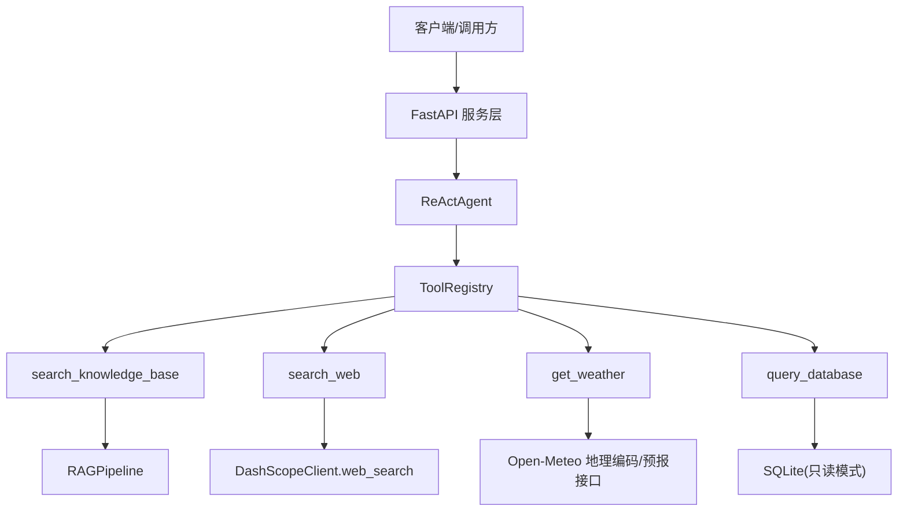
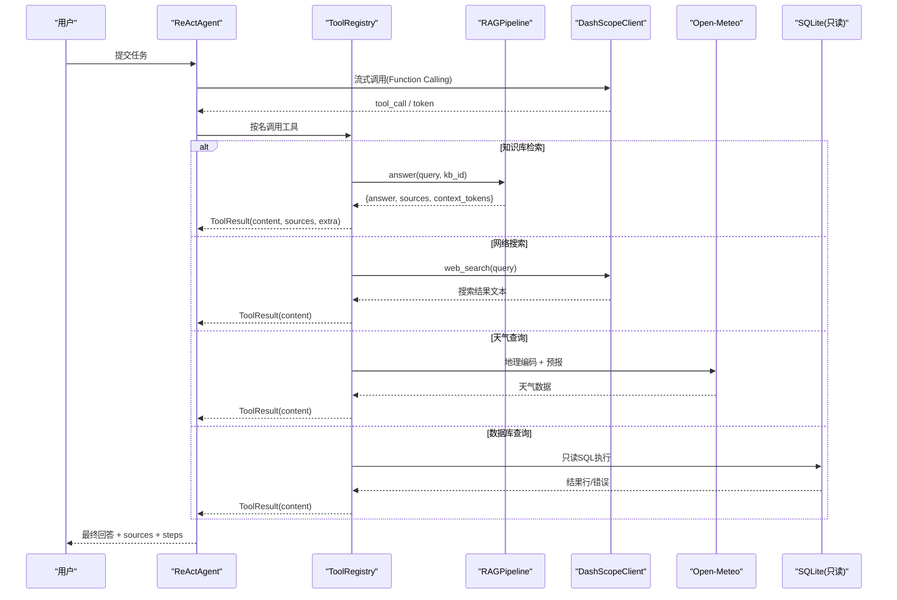
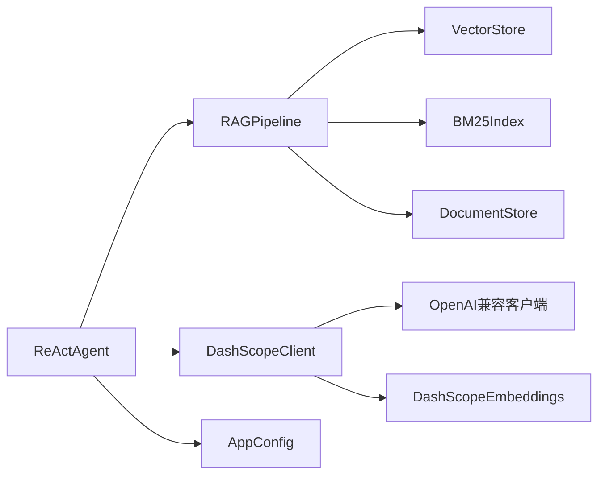

# 内置工具集

<cite>
**本文引用的文件**
- [react_agent.py](file://react_agent.py)
- [rag_pipeline.py](file://rag_pipeline.py)
- [llm_client.py](file://llm_client.py)
- [config.py](file://config.py)
- [store.py](file://store.py)
- [api.py](file://api.py)
</cite>

## 目录
1. [简介](#简介)
2. [项目结构](#项目结构)
3. [核心组件](#核心组件)
4. [架构总览](#架构总览)
5. [详细组件分析](#详细组件分析)
6. [依赖关系分析](#依赖关系分析)
7. [性能考虑](#性能考虑)
8. [故障排查指南](#故障排查指南)
9. [结论](#结论)
10. [附录：使用示例与最佳实践](#附录使用示例与最佳实践)

## 简介
本技术文档面向系统提供的四个内置工具：search_knowledge_base（知识库检索）、get_weather（天气查询）、search_web（网络搜索）、query_database（数据库查询）。文档从功能特性、参数定义、实现原理、返回格式、错误处理、性能优化与最佳实践等维度进行系统化说明，帮助开发者与使用者正确、安全、高效地使用这些工具。

## 项目结构
- Agent 层：ReActAgent 负责工具注册、多步调用循环、流式输出与结果聚合。
- RAG 层：RAGPipeline 提供知识库管理、混合检索与带引用问答能力。
- LLM 客户端：DashScopeClient 封装模型调用、联网搜索与流式事件。
- 配置层：AppConfig 集中管理运行参数（如最大步骤、上下文长度、检索阈值等）。
- 存储层：DocumentStore 基于 SQLite 维护知识库元数据与片段信息。
- API 层：FastAPI 暴露 REST 接口，统一鉴权与并发控制。

图表来源
- [react_agent.py:165-246](file://react_agent.py#L165-L246)
- [rag_pipeline.py:196-697](file://rag_pipeline.py#L196-L697)
- [llm_client.py:283-294](file://llm_client.py#L283-L294)
- [store.py:123-138](file://store.py#L123-L138)

章节来源
- [react_agent.py:1-567](file://react_agent.py#L1-L567)
- [rag_pipeline.py:1-792](file://rag_pipeline.py#L1-L792)
- [llm_client.py:1-322](file://llm_client.py#L1-L322)
- [config.py:1-113](file://config.py#L1-L113)
- [store.py:1-470](file://store.py#L1-L470)
- [api.py:1-204](file://api.py#L1-L204)

## 核心组件
- ToolResult：工具返回值标准结构，包含 content、sources、extra。
- ToolRegistry：工具注册表，将函数与 JSON Schema 描述绑定，供模型选择并执行。
- ReActAgent：基于 Function Calling 的多步 Agent，负责消息构建、工具调用、结果回填与流式输出。
- RAGPipeline：知识库检索与问答管线，支持混合检索（向量+BM25）与引用生成。
- DashScopeClient：统一 LLM 客户端，提供聊天、流式、Function Calling 与联网搜索。
- AppConfig：集中化配置，控制检索、上下文、Agent 行为等关键参数。
- DocumentStore：SQLite 元数据存储，支撑知识库、文档版本与片段管理。

章节来源
- [react_agent.py:69-142](file://react_agent.py#L69-L142)
- [react_agent.py:144-370](file://react_agent.py#L144-L370)
- [rag_pipeline.py:196-697](file://rag_pipeline.py#L196-L697)
- [llm_client.py:22-294](file://llm_client.py#L22-L294)
- [config.py:56-113](file://config.py#L56-L113)
- [store.py:123-470](file://store.py#L123-L470)

## 架构总览
下图展示了四个工具在系统中的协作方式与数据流向：

图表来源
- [react_agent.py:272-370](file://react_agent.py#L272-L370)
- [rag_pipeline.py:590-667](file://rag_pipeline.py#L590-L667)
- [llm_client.py:283-294](file://llm_client.py#L283-L294)
- [react_agent.py:373-441](file://react_agent.py#L373-L441)
- [react_agent.py:443-470](file://react_agent.py#L443-L470)

## 详细组件分析

### search_knowledge_base（知识库检索）
- 功能特性
  - 通过 RAGPipeline.answer 进行混合检索（向量相似度 + BM25），并按相关性阈值过滤低相关结果。
  - 自动改写多轮问题，提升检索质量；支持限定到特定文档或人物短名，避免无关片段污染答案。
  - 生成带引用来源的回答，sources 包含 citation、content、metadata 及分数。
- 参数定义
  - query: 字符串，用于检索的问题，应完整明确并可包含关键术语。
- 实现原理
  - ReActAgent._build_registry 中注册该工具，内部调用 self.rag.answer(query, kb_id=kb_id)。
  - RAGPipeline.answer 完成检索、上下文组装与模型问答，返回 answer、sources、context_tokens 等。
- 返回格式
  - content: 模型生成的回答文本。
  - sources: 列表，每项含 citation、content、metadata、vector_score、bm25_score。
  - extra: 扩展字段，包含 context_tokens（上下文 token 数）。
- 使用场景
  - 公司制度、产品、项目、简历、汇报等文档相关问题优先使用该工具。
- 错误处理
  - 若知识库无相关内容，返回提示“未检索到足够相关内容”，引导换问法或补充资料。
  - 异常时返回“问答服务暂时不可用”并附带错误摘要。
- 性能优化建议
  - 合理设置 top_k、fusion_pool、relevance_threshold、mmr_enabled/mmr_lambda 以平衡召回与精度。
  - 控制 rag_context_max_tokens 与 history_max_tokens，避免上下文过长导致注意力稀释与成本上升。
  - 对长对话启用 query_rewrite_enabled，提高检索准确性。

章节来源
- [react_agent.py:168-196](file://react_agent.py#L168-L196)
- [rag_pipeline.py:590-667](file://rag_pipeline.py#L590-L667)
- [rag_pipeline.py:439-523](file://rag_pipeline.py#L439-L523)
- [config.py:90-113](file://config.py#L90-L113)

### get_weather（天气查询）
- 功能特性
  - 查询指定城市的当前天气与当日预报，数据来源为 Open-Meteo，无需 API Key。
- 参数定义
  - city: 字符串，城市名，例如北京、上海、郑州。
- 实现原理
  - 先调用 Open-Meteo 地理编码接口获取经纬度，再调用预报接口获取当前与每日数据。
  - 将天气代码映射为中文描述，组装结构化文本返回。
- 返回格式
  - content: 包含地点、时间、天气现象、温度、体感温度、湿度、降水量、风速、最高/最低温、降水概率等信息的格式化文本。
  - sources: 空列表（天气工具不返回引用来源）。
  - extra: 空字典（无额外字段）。
- 使用场景
  - 需要实时天气与当日预报的场景，如出行规划、活动安排等。
- 错误处理
  - 未找到地点时提示改用明确城市名。
  - 网络或解析异常时返回“天气查询暂时不可用”并附带错误摘要。
- 性能优化建议
  - 设置合理的超时与重试策略（当前实现使用固定超时）。
  - 缓存高频城市结果以减少重复请求（可在上层实现）。

章节来源
- [react_agent.py:179-211](file://react_agent.py#L179-L211)
- [react_agent.py:373-441](file://react_agent.py#L373-L441)

### search_web（网络搜索）
- 功能特性
  - 通过 DashScope 联网搜索能力获取最新新闻、行情、时效性内容。
- 参数定义
  - query: 字符串，要搜索的关键词或问题。
- 实现原理
  - 调用 DashScopeClient.web_search，传入 enable_search=True 触发联网搜索。
  - 返回模型整合后的搜索结果文本。
- 返回格式
  - content: 搜索结果文本。
  - sources: 空列表（网络搜索工具不返回引用来源）。
  - extra: 空字典（无额外字段）。
- 使用场景
  - 需要实时信息且不在本地知识库中的问题。
- 错误处理
  - 若模型侧不支持联网搜索，上层可降级处理（由调用方决定）。
- 性能优化建议
  - 限制查询频率与长度，避免频繁大查询造成延迟与成本。
  - 结合业务语义对 query 进行精简与去噪，提高搜索质量。

章节来源
- [react_agent.py:176-226](file://react_agent.py#L176-L226)
- [llm_client.py:283-294](file://llm_client.py#L283-L294)

### query_database（数据库查询）
- 功能特性
  - 对公司本地 SQLite 数据库执行只读 SQL 查询，用于查看知识库、文档、片段数量或任意元数据。
- 参数定义
  - sql: 字符串，只读 SQL 语句，例如 SELECT name FROM sqlite_master WHERE type='table'。
- 实现原理
  - 首关键字软校验：仅允许 SELECT、PRAGMA、EXPLAIN、WITH 开头的语句。
  - 连接模式为只读（uri mode=ro），写入操作会被数据库拒绝，双重保护防止误写。
  - 限制返回行数（fetchmany(50)）与输出长度（截断至 TOOL_OBSERVATION_MAX_CHARS），避免结果过大影响上下文。
- 返回格式
  - content: 查询结果的文本表示（首行为列头，后续为行数据），或“查询完成：0 行”/错误信息。
  - sources: 空列表（数据库工具不返回引用来源）。
  - extra: 空字典（无额外字段）。
- 使用场景
  - 查看知识库统计、文档清单、片段数量、索引状态等元数据。
- 错误处理
  - 数据库文件不存在时返回提示。
  - 非只读语句被拒绝。
  - SQL 执行失败时返回错误摘要。
- 性能优化建议
  - 尽量使用精确条件与必要字段，减少扫描范围。
  - 避免复杂 JOIN 与大表全量扫描；必要时结合 PRAGMA/EXPLAIN 分析执行计划。

章节来源
- [react_agent.py:228-245](file://react_agent.py#L228-L245)
- [react_agent.py:443-470](file://react_agent.py#L443-L470)
- [store.py:123-138](file://store.py#L123-L138)

## 依赖关系分析
- ReActAgent 依赖 RAGPipeline 与 DashScopeClient，并通过 ToolRegistry 动态注册工具。
- RAGPipeline 依赖 VectorStore、BM25Index、DocumentStore 与 LLM 接口，实现混合检索与问答。
- DashScopeClient 依赖 OpenAI 兼容客户端与 DashScope Embeddings，提供聊天、流式与联网搜索。
- AppConfig 集中读取环境变量，控制检索、上下文与 Agent 行为。
- DocumentStore 基于 SQLite，提供知识库、文档与片段的数据一致性保障。

图表来源
- [react_agent.py:144-370](file://react_agent.py#L144-L370)
- [rag_pipeline.py:196-697](file://rag_pipeline.py#L196-L697)
- [llm_client.py:22-294](file://llm_client.py#L22-L294)
- [config.py:56-113](file://config.py#L56-L113)
- [store.py:123-470](file://store.py#L123-L470)

章节来源
- [react_agent.py:144-370](file://react_agent.py#L144-L370)
- [rag_pipeline.py:196-697](file://rag_pipeline.py#L196-L697)
- [llm_client.py:22-294](file://llm_client.py#L22-L294)
- [config.py:56-113](file://config.py#L56-L113)
- [store.py:123-470](file://store.py#L123-L470)

## 性能考虑
- 检索性能
  - 调整 top_k、fusion_pool、relevance_threshold、mmr_enabled/mmr_lambda 以平衡召回与精度。
  - 使用 MMR 重排提升多样性，避免重复片段。
- 上下文与成本
  - 控制 rag_context_max_tokens 与 history_max_tokens，避免上下文过长导致延迟与成本增加。
  - 启用 query_rewrite_enabled 在多轮对话中提升检索质量。
- 工具调用
  - 限制 TOOL_OBSERVATION_MAX_CHARS，防止长结果稀释注意力。
  - 数据库查询限制行数与输出长度，避免结果过大。
- 外部服务
  - 天气查询设置合理超时；网络搜索限制频率与查询长度。
- 并发与锁
  - API 层使用全局锁串行化读写，避免 SQLite/Chroma 并发访问问题。

[本节为通用指导，不直接分析具体文件]

## 故障排查指南
- 知识库检索失败
  - 检查是否有已入库文档与有效索引；确认检索阈值与融合池大小。
  - 查看 sources 是否为空，若无则可能未命中或相关性不足。
- 天气查询失败
  - 确认网络可达与 Open-Meteo 服务正常；检查城市名是否明确。
  - 捕获异常并记录错误摘要以便定位。
- 网络搜索失败
  - 确认模型侧支持联网搜索；检查 enable_search 配置。
  - 若不支持，上层需降级处理。
- 数据库查询失败
  - 确认数据库文件存在；检查 SQL 是否为只读语句。
  - 查看错误摘要，必要时使用 EXPLAIN 分析执行计划。

章节来源
- [rag_pipeline.py:590-667](file://rag_pipeline.py#L590-L667)
- [react_agent.py:373-441](file://react_agent.py#L373-L441)
- [llm_client.py:283-294](file://llm_client.py#L283-L294)
- [react_agent.py:443-470](file://react_agent.py#L443-L470)

## 结论
本内置工具集通过 ReActAgent 与 RAGPipeline 的协同，实现了知识库检索、天气查询、网络搜索与数据库查询的统一入口。各工具具备清晰的参数定义、稳定的返回格式与完善的安全限制。通过合理配置与优化，可在保证准确性的同时提升性能与用户体验。

[本节为总结，不直接分析具体文件]

## 附录：使用示例与最佳实践

### 通用流程
- 通过 API 层发起聊天请求，Agent 自动选择工具并执行多步循环。
- 关注返回的 steps 与 sources，了解工具调用轨迹与引用来源。

章节来源
- [api.py:185-199](file://api.py#L185-L199)
- [react_agent.py:250-370](file://react_agent.py#L250-L370)

### search_knowledge_base 示例
- 输入：公司主营什么产品？
- 预期：调用知识库检索，返回带引用的答案与 sources。
- 最佳实践：明确问题、包含关键术语；必要时限定文档范围。

章节来源
- [react_agent.py:168-196](file://react_agent.py#L168-L196)
- [rag_pipeline.py:590-667](file://rag_pipeline.py#L590-L667)

### get_weather 示例
- 输入：查询北京的天气
- 预期：返回当前天气与当日预报的结构化文本。
- 最佳实践：使用明确城市名；必要时缓存结果以减少请求。

章节来源
- [react_agent.py:179-211](file://react_agent.py#L179-L211)
- [react_agent.py:373-441](file://react_agent.py#L373-L441)

### search_web 示例
- 输入：查询最新的行业政策
- 预期：返回联网搜索结果文本。
- 最佳实践：精简查询词；避免频繁大查询。

章节来源
- [react_agent.py:176-226](file://react_agent.py#L176-L226)
- [llm_client.py:283-294](file://llm_client.py#L283-L294)

### query_database 示例
- 输入：SELECT name FROM sqlite_master WHERE type='table'
- 预期：返回数据库表名列表。
- 最佳实践：使用只读语句；限制结果行数；必要时使用 EXPLAIN。

章节来源
- [react_agent.py:228-245](file://react_agent.py#L228-L245)
- [react_agent.py:443-470](file://react_agent.py#L443-L470)

### 返回格式规范
- ToolResult.content：工具输出的主内容（文本）。
- ToolResult.sources：引用来源列表（知识库工具提供，其他工具为空）。
- ToolResult.extra：扩展字段（如 context_tokens）。

章节来源
- [react_agent.py:76-83](file://react_agent.py#L76-L83)
- [rag_pipeline.py:614-667](file://rag_pipeline.py#L614-L667)