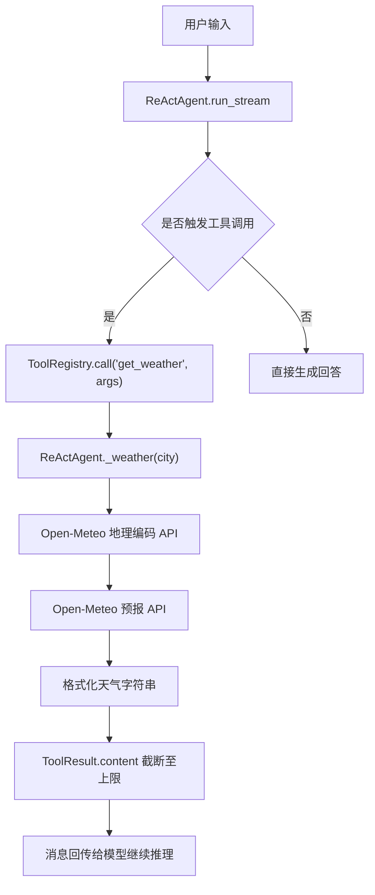
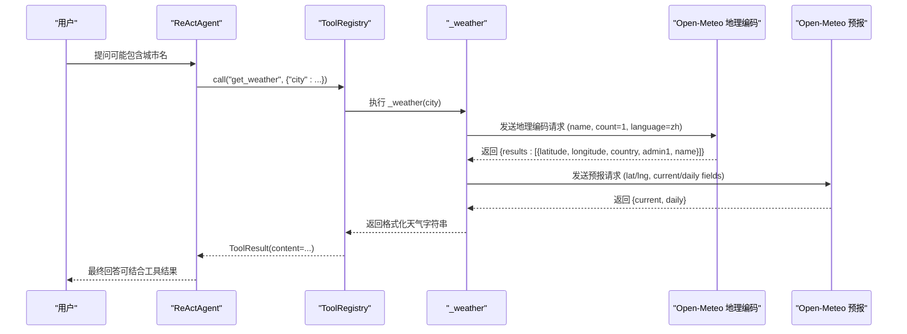
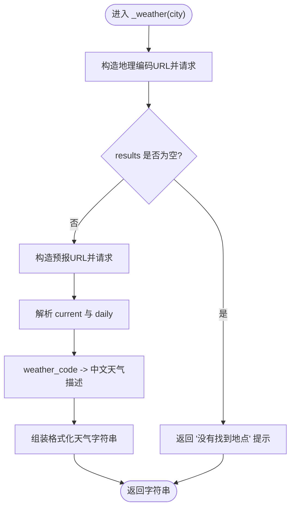
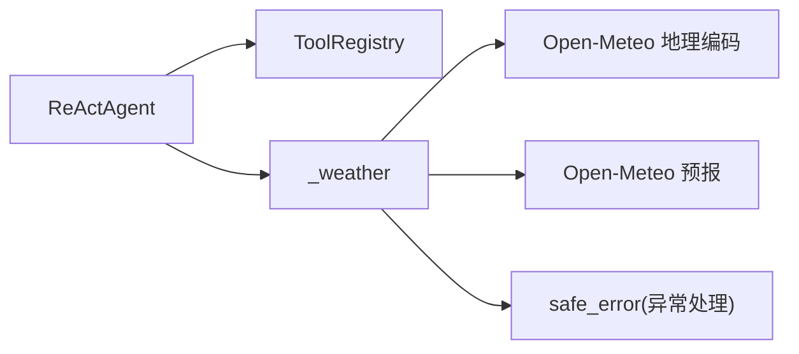

# 天气查询工具

<cite>
**本文引用的文件**
- [react_agent.py](file://react_agent.py)
- [test_agent.py](file://tests/test_agent.py)
- [app.py](file://app.py)
</cite>

## 目录
1. [简介](#简介)
2. [项目结构](#项目结构)
3. [核心组件](#核心组件)
4. [架构总览](#架构总览)
5. [详细组件分析](#详细组件分析)
6. [依赖关系分析](#依赖关系分析)
7. [性能考虑](#性能考虑)
8. [故障排查指南](#故障排查指南)
9. [结论](#结论)
10. [附录：使用示例与返回格式](#附录使用示例与返回格式)

## 简介
本技术文档聚焦于天气查询工具 get_weather 的实现细节，覆盖 Open-Meteo API 的集成方式、地理编码与天气预报两个阶段的调用流程；参数定义（city 城市名）与返回格式（格式化天气信息字符串）；内部实现 _weather 方法如何处理城市坐标查找、天气数据获取、天气代码映射；错误处理机制（城市不存在、网络异常等）；以及性能相关考量（超时设置、响应数据限制）。

## 项目结构
该仓库采用功能分层组织，天气查询能力作为 Agent 的工具之一被注册并暴露给模型进行函数调用。关键位置如下：
- 工具注册与调用入口：在 ReActAgent 中通过 _build_registry 注册 get_weather 工具，并在 run_stream 中执行工具调用与结果回填。
- 天气查询核心逻辑：_weather 方法负责地理编码与天气预报请求、数据解析与格式化输出。
- 测试用例：验证工具参数解析、流式事件序列与离线桩下的天气查询行为。
- UI 展示：应用层提示天气数据来源与可用工具列表。

图表来源
- [react_agent.py:165-246](file://react_agent.py#L165-L246)
- [react_agent.py:272-369](file://react_agent.py#L272-L369)
- [react_agent.py:373-441](file://react_agent.py#L373-L441)

章节来源
- [react_agent.py:165-246](file://react_agent.py#L165-L246)
- [react_agent.py:272-369](file://react_agent.py#L272-L369)
- [react_agent.py:373-441](file://react_agent.py#L373-L441)

## 核心组件
- 工具注册表 ToolRegistry：维护工具名称、描述、参数 Schema 与函数实现，支持按名调用并将异常转换为友好提示。
- ReActAgent：构建工具集、驱动多步循环、将工具结果回填给模型，控制最大步骤数与流式事件输出。
- 天气工具 get_weather：封装 _weather 方法，完成地理编码与天气预报请求、数据解析与格式化。
- 网络请求辅助 _get_json：统一发起 HTTP GET 请求并解析 JSON，设置超时。

章节来源
- [react_agent.py:93-141](file://react_agent.py#L93-L141)
- [react_agent.py:144-246](file://react_agent.py#L144-L246)
- [react_agent.py:373-441](file://react_agent.py#L373-L441)

## 架构总览
天气查询的整体流程分为“地理编码”和“天气预报”两步，均基于 Open-Meteo 免费 API：
- 地理编码阶段：根据城市名查询经纬度，用于后续精确到地点的预报请求。
- 预报阶段：使用经纬度请求当前天气与当日预报，提取温度、体感温度、湿度、降水、风、天气代码及最高/最低温、降水概率等字段。
- 结果格式化：将天气代码映射为中文天气描述，组装成结构化文本返回给模型。

图表来源
- [react_agent.py:165-246](file://react_agent.py#L165-L246)
- [react_agent.py:272-369](file://react_agent.py#L272-L369)
- [react_agent.py:373-441](file://react_agent.py#L373-L441)

## 详细组件分析

### get_weather 工具注册与调用
- 工具名：get_weather
- 描述：查询某个城市当前天气与当日预报，数据来自 Open-Meteo，无需 API Key。
- 参数 Schema：
  - city: string，必填，城市名（例如：北京、上海、郑州）。
- 调用路径：
  - 模型选择工具后，ReActAgent 通过 ToolRegistry.call 调用对应函数。
  - get_weather 内部委托 ReActAgent._weather 执行具体逻辑。
  - 返回 ToolResult.content 会被截断至 TOOL_OBSERVATION_MAX_CHARS 以保护上下文长度。

章节来源
- [react_agent.py:179-211](file://react_agent.py#L179-L211)
- [react_agent.py:272-369](file://react_agent.py#L272-L369)

### _weather 方法：城市坐标查找、天气数据获取、天气代码映射
- 地理编码：
  - 构造 URL：OPEN_METEO_GEOCODING_URL + 查询参数 name、count=1、language=zh、format=json。
  - 调用 _get_json 获取结果，若 results 为空，返回“没有找到地点”的提示。
- 天气预报：
  - 构造 URL：OPEN_METEO_FORECAST_URL + 查询参数 latitude、longitude、current（温度、体感、湿度、降水、天气代码、风速）、daily（最高/最低温、最大降水概率）、timezone=auto、forecast_days=1。
  - 调用 _get_json 获取 current 与 daily 数据。
- 天气代码映射：
  - 使用 WEATHER_CODES 字典将 weather_code 映射为中文天气描述，未命中时显示“天气代码 X”。
- 结果组装：
  - 拼接 place_name（国家、省份、城市），时间戳，天气、气温、体感、湿度、降水、风速、最高/最低温、降水概率等字段，形成可读性强的 Markdown 风格文本。
  - 末尾标注数据来源与免责声明。

图表来源
- [react_agent.py:373-435](file://react_agent.py#L373-L435)
- [react_agent.py:31-53](file://react_agent.py#L31-L53)

章节来源
- [react_agent.py:31-53](file://react_agent.py#L31-L53)
- [react_agent.py:373-435](file://react_agent.py#L373-L435)

### _get_json：网络请求与超时
- 使用 urllib.request.Request 发起 GET 请求，设置 User-Agent。
- 超时设置：timeout=15 秒，避免长时间阻塞。
- 响应解码：UTF-8 解码后解析为 JSON 字典。

章节来源
- [react_agent.py:437-441](file://react_agent.py#L437-L441)

### 工具结果截断与上下文保护
- 工具返回内容在回填前会被截断至 TOOL_OBSERVATION_MAX_CHARS（2000 字符），防止长结果稀释注意力或占用过多上下文。

章节来源
- [react_agent.py:64-66](file://react_agent.py#L64-L66)
- [react_agent.py:334](file://react_agent.py#L334)

## 依赖关系分析
- 外部依赖：
  - Open-Meteo 地理编码与预报 API（可通过环境变量覆盖默认 URL）。
  - Python 标准库 urllib.request、json。
- 内部依赖：
  - ToolRegistry 提供工具注册与调用。
  - ReActAgent 驱动工具调用与流式事件。
  - llm_client.safe_error 用于异常信息的安全转换。

图表来源
- [react_agent.py:93-141](file://react_agent.py#L93-L141)
- [react_agent.py:165-246](file://react_agent.py#L165-L246)
- [react_agent.py:373-441](file://react_agent.py#L373-L441)

章节来源
- [react_agent.py:93-141](file://react_agent.py#L93-L141)
- [react_agent.py:165-246](file://react_agent.py#L165-L246)
- [react_agent.py:373-441](file://react_agent.py#L373-L441)

## 性能考虑
- 超时设置：
  - 网络请求超时为 15 秒，避免长时间等待导致界面卡顿或资源占用。
- 响应数据限制：
  - 工具返回内容截断至 2000 字符，减少上下文压力，同时保留足够信息供模型理解。
- 请求字段最小化：
  - 仅请求必要字段（current 与 daily 的关键指标），降低带宽与解析开销。
- 并发与重试：
  - 当前实现为同步请求，无重试机制；在高延迟或失败场景下建议在上层增加重试与熔断策略。

章节来源
- [react_agent.py:64-66](file://react_agent.py#L64-L66)
- [react_agent.py:437-441](file://react_agent.py#L437-L441)
- [react_agent.py:391-410](file://react_agent.py#L391-L410)

## 故障排查指南
- 城市不存在：
  - 现象：返回“没有找到地点‘X’，请改用明确的城市名，例如‘郑州’。”
  - 原因：地理编码接口未找到匹配结果。
  - 处理：建议使用更明确的城市名或检查拼写。
- 网络请求异常：
  - 现象：返回“天气查询暂时不可用：...”，其中包含安全化的异常信息。
  - 原因：urlopen 超时、DNS 解析失败、服务端错误等。
  - 处理：检查网络连通性与 Open-Meteo 服务状态；必要时重试或降级。
- 工具执行失败：
  - 现象：ToolRegistry.call 捕获异常并返回“工具执行失败：...”。
  - 原因：工具函数内部抛出异常。
  - 处理：查看日志与异常信息，修正参数或环境配置。
- 测试结果参考：
  - 测试用例覆盖了参数解析、流式事件顺序与离线桩下的天气查询行为，可用于本地验证。

章节来源
- [react_agent.py:130-141](file://react_agent.py#L130-L141)
- [react_agent.py:373-435](file://react_agent.py#L373-L435)
- [react_agent.py:437-441](file://react_agent.py#L437-L441)
- [test_agent.py:56-113](file://tests/test_agent.py#L56-L113)

## 结论
get_weather 工具通过简洁的两步流程（地理编码+天气预报）集成 Open-Meteo 免费 API，具备清晰的参数定义与稳定的返回格式。内部实现注重健壮性（异常安全化、结果截断）与可维护性（工具注册表、流式事件）。在生产环境中可进一步引入重试、缓存与监控以提升稳定性与性能。

## 附录：使用示例与返回格式
- 参数定义：
  - city: string，必填，城市名（例如：北京、上海、郑州）。
- 返回格式：
  - 类型为字符串，Markdown 风格，包含地点、时间、天气、气温、体感、湿度、降水、风速、最高/最低温、降水概率等信息，并标注数据来源与免责声明。
- 示例说明（基于测试桩数据）：
  - 当 city="北京" 时，地理编码返回经纬度与地名信息，预报返回当前温度、天气代码等，最终输出包含“北京当前天气”、“气温 25°C”等字段的格式化文本。
  - 测试用例验证了工具调用、参数解析与结果回填的正确性。

章节来源
- [react_agent.py:179-211](file://react_agent.py#L179-L211)
- [react_agent.py:373-435](file://react_agent.py#L373-L435)
- [test_agent.py:56-113](file://tests/test_agent.py#L56-L113)
- [app.py:230-234](file://app.py#L230-L234)