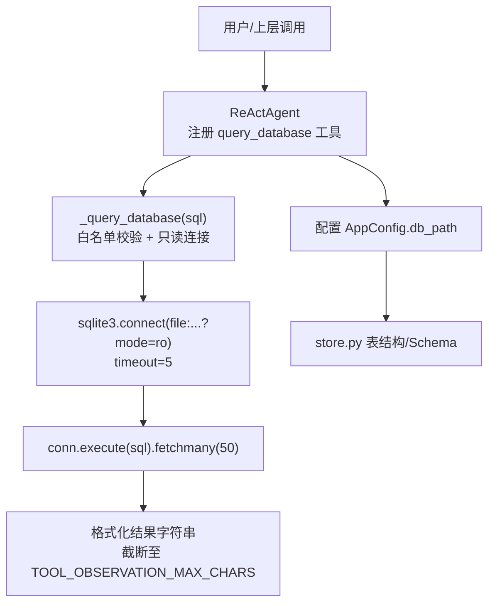
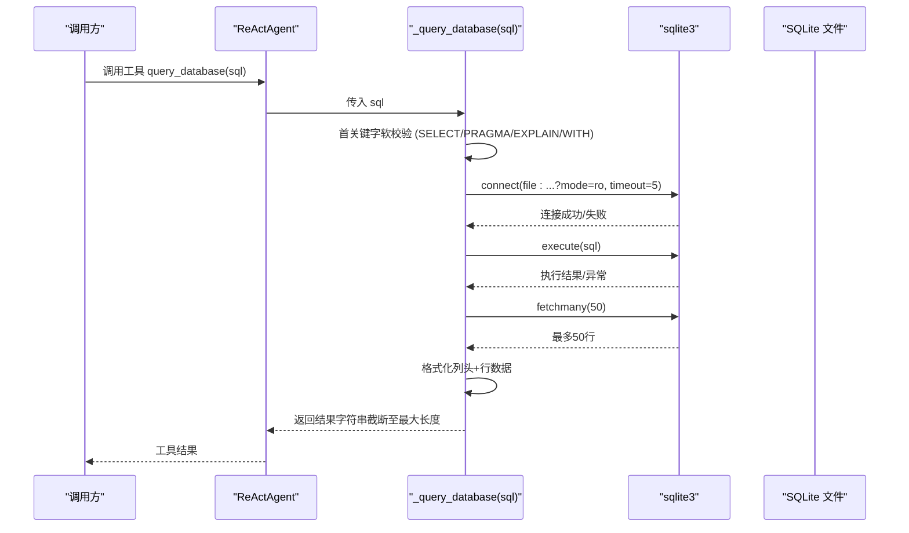
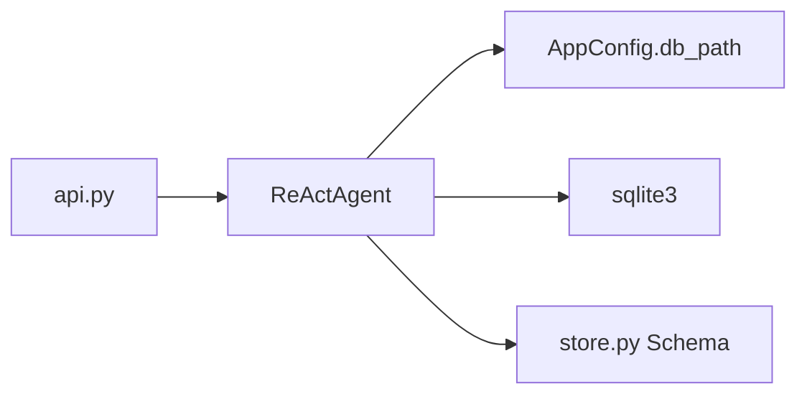

# 数据库查询工具

<cite>
**本文引用的文件**
- [react_agent.py](file://react_agent.py)
- [config.py](file://config.py)
- [store.py](file://store.py)
- [api.py](file://api.py)
- [tests/test_agent.py](file://tests/test_agent.py)
</cite>

## 目录
1. [简介](#简介)
2. [项目结构](#项目结构)
3. [核心组件](#核心组件)
4. [架构总览](#架构总览)
5. [详细组件分析](#详细组件分析)
6. [依赖关系分析](#依赖关系分析)
7. [性能考量](#性能考量)
8. [故障排查指南](#故障排查指南)
9. [结论](#结论)
10. [附录：常用查询示例](#附录：常用查询示例)

## 简介
本技术文档聚焦于“数据库查询工具”（query_database），该工具以只读模式访问本地 SQLite 知识库，用于安全地查询知识库、文档与片段等元数据。其安全设计包括：
- SQL 语句白名单软校验：仅允许 SELECT / PRAGMA / EXPLAIN / WITH 开头的语句；
- 连接层只读保护：通过 URI mode=ro 打开数据库，任何写入操作将被数据库拒绝；
- 结果限制：默认最多返回前 50 行，避免大结果集拖慢系统；
- 超时控制：连接设置超时，降低阻塞风险。

参数定义与返回格式：
- 输入参数：sql（字符串），表示要执行的只读 SQL 语句；
- 返回内容：查询结果的文本化字符串（首行为列名，后续每行为一行记录，逗号分隔）。

## 项目结构
本项目采用分层组织：Agent 层暴露工具能力，配置集中管理路径与阈值，存储层提供结构化数据模型与表结构，API 层对外暴露 REST 接口。数据库查询工具由 Agent 层实现，并依赖配置层获取数据库路径，底层使用 Python 标准库 sqlite3 进行只读访问。

图表来源
- [react_agent.py:228-245](file://react_agent.py#L228-L245)
- [react_agent.py:443-470](file://react_agent.py#L443-L470)
- [config.py:90-112](file://config.py#L90-L112)
- [store.py:31-77](file://store.py#L31-L77)

章节来源
- [react_agent.py:228-245](file://react_agent.py#L228-L245)
- [react_agent.py:443-470](file://react_agent.py#L443-L470)
- [config.py:90-112](file://config.py#L90-L112)
- [store.py:31-77](file://store.py#L31-L77)

## 核心组件
- ReActAgent._build_registry：注册 query_database 工具，声明参数 schema（sql 字符串）；
- ReActAgent._query_database：实现安全查询逻辑（白名单校验、只读连接、结果限制、错误处理）；
- AppConfig.db_path：从环境变量解析数据库文件路径；
- store.py：定义知识库、文档、片段等表结构，便于理解可查询的元数据范围。

章节来源
- [react_agent.py:228-245](file://react_agent.py#L228-L245)
- [react_agent.py:443-470](file://react_agent.py#L443-L470)
- [config.py:90-112](file://config.py#L90-L112)
- [store.py:31-77](file://store.py#L31-L77)

## 架构总览
下图展示 query_database 工具在 Agent 中的调用链与安全边界：

图表来源
- [react_agent.py:228-245](file://react_agent.py#L228-L245)
- [react_agent.py:443-470](file://react_agent.py#L443-L470)

## 详细组件分析

### 安全设计与实现原理
- 首关键字软校验：将 SQL 去空白后小写，检查是否以 SELECT、PRAGMA、EXPLAIN、WITH 开头。若不符合，直接拒绝并返回提示。
- 只读连接：使用 sqlite3.connect 的 URI 模式 file:{db_path}?mode=ro 打开数据库，确保任何写入操作（INSERT/UPDATE/DELETE/CREATE/DROP 等）被数据库引擎拒绝。
- 结果限制：使用 fetchmany(50) 限制返回行数，防止大结果集影响性能与上下文长度。
- 超时设置：连接时设置 timeout=5，避免长时间阻塞。
- 输出截断：最终结果字符串会被截断到 TOOL_OBSERVATION_MAX_CHARS（常量 2000），避免过长结果污染上下文。

章节来源
- [react_agent.py:443-470](file://react_agent.py#L443-L470)
- [react_agent.py:64-66](file://react_agent.py#L64-L66)

### 参数定义与返回格式
- 参数：sql（字符串），描述为“只读 SQL 语句”，例如查询 sqlite_master 或业务表。
- 返回：字符串，首行为列名（逗号分隔），后续每行是字段值（逗号分隔）。若无结果，返回“查询完成：0 行。”。

章节来源
- [react_agent.py:228-245](file://react_agent.py#L228-L245)
- [react_agent.py:443-470](file://react_agent.py#L443-L470)

### 错误处理
- 数据库文件不存在：返回“数据库文件不存在。”
- SQL 执行异常：捕获异常并返回“SQL 执行失败：{错误信息}”
- 非只读语句：返回“仅允许 SELECT / PRAGMA / EXPLAIN / WITH 只读查询。”

章节来源
- [react_agent.py:443-470](file://react_agent.py#L443-L470)
- [tests/test_agent.py:141-153](file://tests/test_agent.py#L141-L153)

### 性能优化建议
- 查询结果限制：已内置 fetchmany(50)，避免大结果集；
- 连接超时：已设置 timeout=5，降低阻塞风险；
- 结果截断：TOOL_OBSERVATION_MAX_CHARS=2000，防止过长结果影响上下文；
- 建议：尽量使用 WHERE 条件缩小结果集；对频繁统计类查询可考虑 PRAGMA 或聚合查询；避免 SELECT *，仅选择必要列。

章节来源
- [react_agent.py:443-470](file://react_agent.py#L443-L470)
- [react_agent.py:64-66](file://react_agent.py#L64-L66)

### 数据模型与可查询范围
- 知识库（kbs）：id、name、description、created_at；
- 文档（documents）：id、kb_id、filename、category、tags、status、latest_version、uploaded_at、chunk_count、indexed_sha；
- 文档版本（document_versions）：id、doc_id、version、sha256、size、file_path、created_at；
- 片段（chunks）：id、doc_id、kb_id、chunk_index、content、metadata；
- 键值配置（meta）：key、value。

章节来源
- [store.py:31-77](file://store.py#L31-L77)

## 依赖关系分析
- ReActAgent 依赖 AppConfig 获取 db_path；
- _query_database 依赖 sqlite3 模块进行只读连接与执行；
- 表结构与字段来源于 store.py 的 Schema，便于构造合理的查询语句；
- API 层不直接暴露数据库查询，但可通过 Agent 的工具能力间接使用。

图表来源
- [react_agent.py:228-245](file://react_agent.py#L228-L245)
- [react_agent.py:443-470](file://react_agent.py#L443-L470)
- [config.py:90-112](file://config.py#L90-L112)
- [store.py:31-77](file://store.py#L31-L77)
- [api.py:1-204](file://api.py#L1-L204)

章节来源
- [react_agent.py:228-245](file://react_agent.py#L228-L245)
- [react_agent.py:443-470](file://react_agent.py#L443-L470)
- [config.py:90-112](file://config.py#L90-L112)
- [store.py:31-77](file://store.py#L31-L77)
- [api.py:1-204](file://api.py#L1-L204)

## 性能考量
- 结果限制：fetchmany(50) 控制返回行数；
- 超时：timeout=5 避免连接阻塞；
- 输出截断：TOOL_OBSERVATION_MAX_CHARS=2000 控制结果长度；
- 建议：
  - 使用精确的 WHERE 条件减少扫描范围；
  - 避免 SELECT *，仅选择必要列；
  - 对复杂查询先使用 EXPLAIN 分析执行计划；
  - 对高频统计查询，考虑使用 PRAGMA 或聚合函数。

[本节为通用指导，无需特定文件引用]

## 故障排查指南
- 数据库文件不存在：检查 AppConfig.db_path 指向的路径是否存在；
- SQL 执行失败：确认 SQL 语法正确且符合只读白名单；查看错误信息定位问题；
- 无结果返回：确认查询条件是否正确，必要时调整 WHERE 或使用 PRAGMA 检查表结构；
- 写入被拒绝：确认 SQL 是否为只读类型（SELECT/PRAGMA/EXPLAIN/WITH），写入操作会被数据库拒绝。

章节来源
- [react_agent.py:443-470](file://react_agent.py#L443-L470)
- [tests/test_agent.py:141-153](file://tests/test_agent.py#L141-L153)

## 结论
query_database 工具通过“首关键字软校验 + 只读连接”双重保护，确保对本地 SQLite 的安全只读访问。结合结果限制与超时控制，既保障了安全性，又兼顾了性能与稳定性。配合 store.py 定义的表结构，可灵活查询知识库、文档与片段等元数据，满足常见运维与分析需求。

[本节为总结性内容，无需特定文件引用]

## 附录：常用查询示例
以下为常见查询场景与对应 SQL 思路（请根据实际表结构调整字段）：
- 查询知识库元数据：SELECT id, name, description FROM kbs;
- 查询某知识库下的文档数量：SELECT COUNT(*) AS doc_count FROM documents WHERE kb_id = '目标kb_id';
- 查询某文档的片段数量：SELECT COUNT(*) AS chunk_count FROM chunks WHERE doc_id = '目标doc_id';
- 查询所有文档的最新版本信息：SELECT d.filename, d.latest_version, d.uploaded_at FROM documents d;
- 查询片段元数据（JSON 字段需外层解析）：SELECT id, doc_id, metadata FROM chunks LIMIT 10;
- 使用 PRAGMA 检查表结构：PRAGMA table_info(documents);
- 使用 EXPLAIN 分析查询计划：EXPLAIN SELECT ...;

注意：
- 所有查询必须以 SELECT/PRAGMA/EXPLAIN/WITH 开头；
- 结果最多返回前 50 行；
- 写入操作将被拒绝。

章节来源
- [react_agent.py:228-245](file://react_agent.py#L228-L245)
- [react_agent.py:443-470](file://react_agent.py#L443-L470)
- [store.py:31-77](file://store.py#L31-L77)