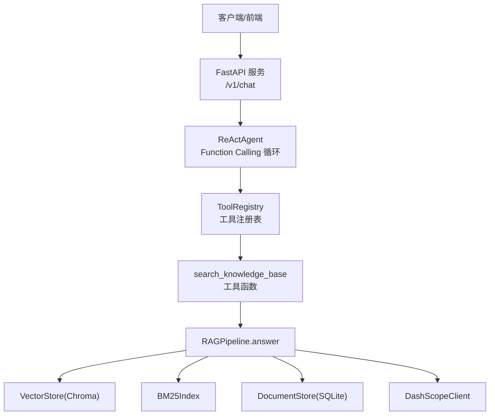
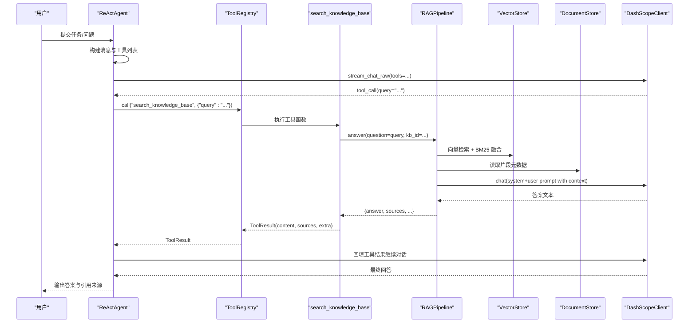
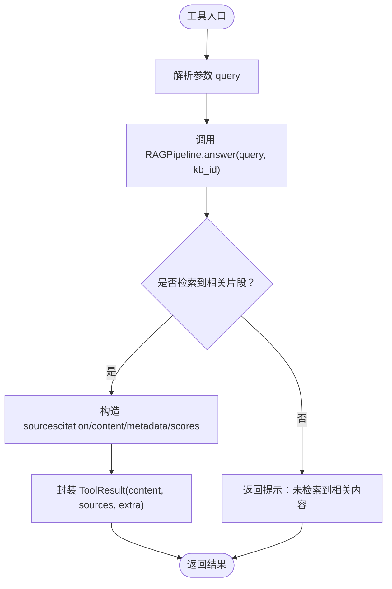
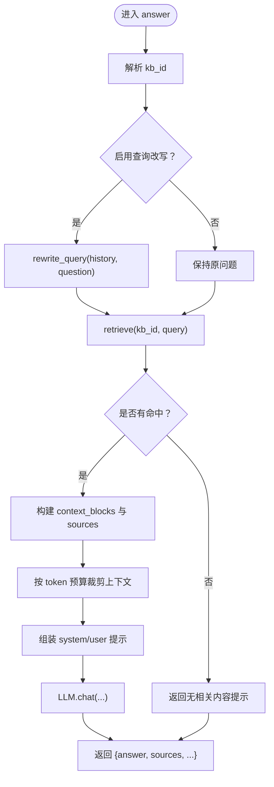
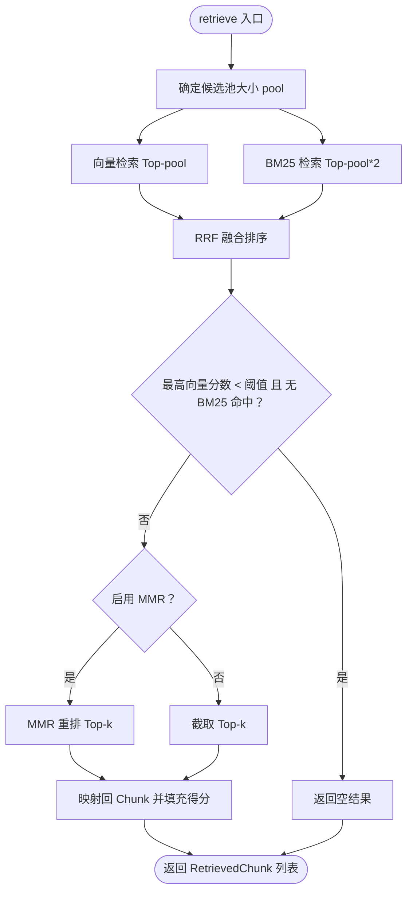
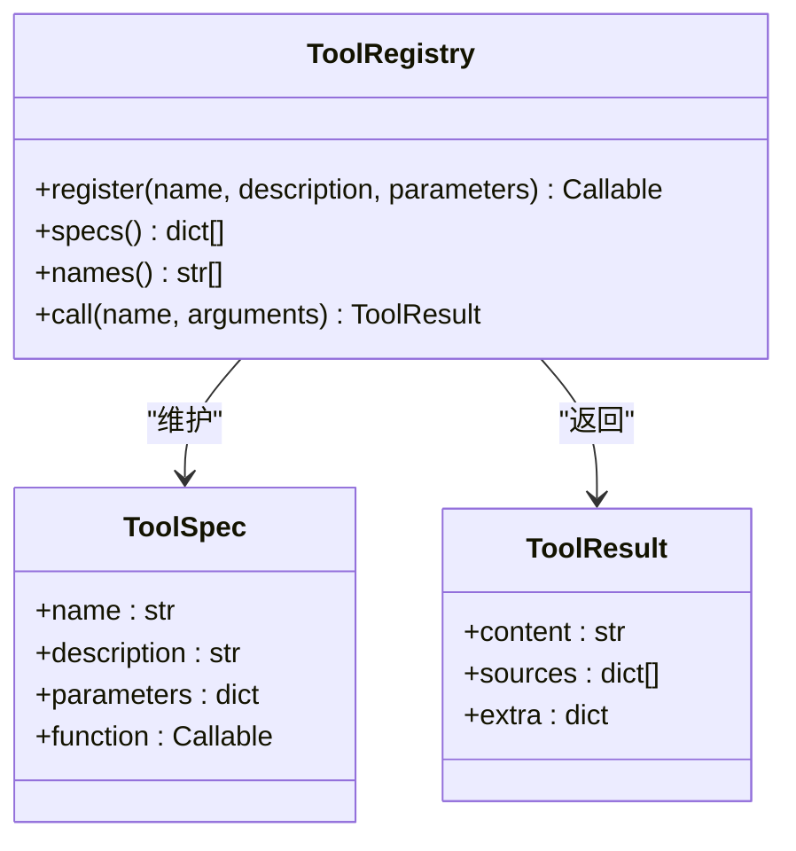
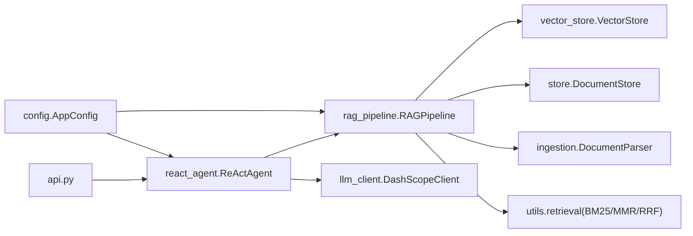

# 知识库检索工具

<cite>
**本文引用的文件**
- [rag_pipeline.py](file://rag_pipeline.py)
- [react_agent.py](file://react_agent.py)
- [api.py](file://api.py)
- [config.py](file://config.py)
- [store.py](file://store.py)
- [vector_store.py](file://vector_store.py)
- [ingestion.py](file://ingestion.py)
- [llm_client.py](file://llm_client.py)
- [tests/test_rag_answer.py](file://tests/test_rag_answer.py)
- [tests/test_agent.py](file://tests/test_agent.py)
</cite>

## 目录
1. [简介](#简介)
2. [项目结构](#项目结构)
3. [核心组件](#核心组件)
4. [架构总览](#架构总览)
5. [详细组件分析](#详细组件分析)
6. [依赖关系分析](#依赖关系分析)
7. [性能考虑](#性能考虑)
8. [故障排查指南](#故障排查指南)
9. [结论](#结论)
10. [附录：使用示例与最佳实践](#附录使用示例与最佳实践)

## 简介
本技术文档聚焦“search_knowledge_base”工具的实现原理与集成方式，说明其如何与 RAGPipeline 协作、参数定义（query 字符串）、返回格式（ToolResult 包含 content 和 sources），以及完整工作流程：接收查询 → 调用 RAGPipeline.answer → 封装结果。同时给出在 Agent 中通过 Function Calling 调用的具体用法、返回结果的解析方法、适用场景（公司文档、制度、产品、项目等）以及错误处理与性能优化建议。

## 项目结构
仓库采用分层模块化设计：
- 应用层：FastAPI 服务暴露 REST API，统一鉴权与路由
- Agent 层：ReActAgent 实现 Function Calling 多步循环，注册工具并执行
- RAG 层：RAGPipeline 提供知识库管理、入库、混合检索与带引用问答
- 存储层：SQLite 元数据（store.py）、Chroma 向量库（vector_store.py）
- 解析与切分：ingestion.py 负责文档解析与切分
- 模型客户端：llm_client.py 封装大模型与嵌入接口
- 配置：config.py 集中管理所有可调参数

图表来源
- [api.py:185-199](file://api.py#L185-L199)
- [react_agent.py:165-196](file://react_agent.py#L165-L196)
- [rag_pipeline.py:590-666](file://rag_pipeline.py#L590-L666)
- [vector_store.py:100-126](file://vector_store.py#L100-L126)
- [store.py:123-138](file://store.py#L123-L138)
- [llm_client.py:94-127](file://llm_client.py#L94-L127)

章节来源
- [api.py:1-204](file://api.py#L1-L204)
- [react_agent.py:1-567](file://react_agent.py#L1-L567)
- [rag_pipeline.py:1-792](file://rag_pipeline.py#L1-L792)
- [config.py:1-113](file://config.py#L1-L113)
- [store.py:1-470](file://store.py#L1-L470)
- [vector_store.py:1-255](file://vector_store.py#L1-L255)
- [ingestion.py:1-216](file://ingestion.py#L1-L216)
- [llm_client.py:1-322](file://llm_client.py#L1-L322)

## 核心组件
- search_knowledge_base 工具：在 ReActAgent 的工具注册表中以 JSON Schema 声明，参数为 query（字符串），用于在公司知识库中检索并生成带引用来源的回答。
- RAGPipeline.answer：核心问答入口，完成检索、上下文组装、LLM 生成回答，并返回 answer、sources、query、kb_id、context_tokens。
- ToolRegistry：工具注册与调用，将工具函数包装为 ToolResult（content, sources, extra）。
- VectorStore：基于 Chroma 的向量检索，支持按 doc_id 过滤、MMR 重排等。
- DocumentStore：SQLite 存储知识库、文档、片段元数据，支持版本管理与增量入库。
- DashScopeClient：统一的大模型与嵌入接口，支持流式 Function Calling。

章节来源
- [react_agent.py:165-196](file://react_agent.py#L165-L196)
- [rag_pipeline.py:590-666](file://rag_pipeline.py#L590-L666)
- [react_agent.py:93-141](file://react_agent.py#L93-L141)
- [vector_store.py:100-126](file://vector_store.py#L100-L126)
- [store.py:123-138](file://store.py#L123-L138)
- [llm_client.py:129-170](file://llm_client.py#L129-L170)

## 架构总览
下图展示了从用户提问到最终回答的端到端流程，包括工具选择、知识库检索、上下文构建与 LLM 生成。

图表来源
- [react_agent.py:272-369](file://react_agent.py#L272-L369)
- [react_agent.py:165-196](file://react_agent.py#L165-L196)
- [rag_pipeline.py:590-666](file://rag_pipeline.py#L590-L666)
- [vector_store.py:100-126](file://vector_store.py#L100-L126)
- [store.py:425-442](file://store.py#L425-L442)
- [llm_client.py:203-278](file://llm_client.py#L203-L278)

## 详细组件分析

### search_knowledge_base 工具
- 作用：在公司知识库中检索文档并给出带引用来源的回答。适用于公司文档、制度、产品、项目、简历、汇报等相关问题。
- 参数：
  - query（string，必填）：用于检索知识库的问题，应完整、明确，可包含关键术语。
- 返回：ToolResult
  - content：模型生成的回答文本
  - sources：引用来源列表，每项包含 citation、content、metadata、vector_score、bm25_score
  - extra：额外信息，如 context_tokens
- 工作流：
  - 接收 query
  - 调用 RAGPipeline.answer(question=query, kb_id=...)
  - 将 answer 与 sources 封装为 ToolResult 返回给 Agent

图表来源
- [react_agent.py:165-196](file://react_agent.py#L165-L196)
- [rag_pipeline.py:590-666](file://rag_pipeline.py#L590-L666)

章节来源
- [react_agent.py:165-196](file://react_agent.py#L165-L196)
- [rag_pipeline.py:590-666](file://rag_pipeline.py#L590-L666)

### RAGPipeline.answer 问答流程
- 输入：question、history（可选）、kb_id（可选）
- 步骤：
  - 解析知识库（默认库或指定库）
  - 可选：根据历史改写查询（提升多轮对话准确性）
  - 混合检索：向量检索 + BM25 词面检索，RRF 融合，可选 MMR 去重
  - 构建上下文块与引用来源
  - 调用 LLM 生成带引用的回答
  - 返回 {answer, sources, query, kb_id, context_tokens}
- 异常处理：捕获异常并返回友好错误信息

图表来源
- [rag_pipeline.py:590-666](file://rag_pipeline.py#L590-L666)
- [rag_pipeline.py:439-523](file://rag_pipeline.py#L439-L523)
- [rag_pipeline.py:566-588](file://rag_pipeline.py#L566-L588)

章节来源
- [rag_pipeline.py:590-666](file://rag_pipeline.py#L590-L666)
- [rag_pipeline.py:439-523](file://rag_pipeline.py#L439-L523)
- [rag_pipeline.py:566-588](file://rag_pipeline.py#L566-L588)

### 混合检索 retrieve
- 目标：结合语义与关键词检索，提高召回与准确率
- 过程：
  - 向量 Top-N 与 BM25 Top-N 候选集
  - RRF 融合排序
  - 相关性阈值过滤（低相关且无 BM25 命中则视为无相关内容）
  - 可选 MMR 重排以提升多样性
  - 返回 RetrievedChunk 列表（含三种得分）

图表来源
- [rag_pipeline.py:439-523](file://rag_pipeline.py#L439-L523)
- [vector_store.py:100-126](file://vector_store.py#L100-L126)

章节来源
- [rag_pipeline.py:439-523](file://rag_pipeline.py#L439-L523)
- [vector_store.py:100-126](file://vector_store.py#L100-L126)

### 工具注册与调用（ToolRegistry）
- 注册：通过装饰器 @registry.register(name, description, parameters) 声明工具
- 调用：registry.call(name, arguments) 执行对应函数，返回 ToolResult
- 异常处理：捕获工具执行异常并返回友好错误信息

图表来源
- [react_agent.py:93-141](file://react_agent.py#L93-L141)
- [react_agent.py:69-83](file://react_agent.py#L69-L83)

章节来源
- [react_agent.py:93-141](file://react_agent.py#L93-L141)
- [react_agent.py:69-83](file://react_agent.py#L69-L83)

### 存储与向量库
- DocumentStore（SQLite）：
  - 管理知识库、文档、版本、片段元数据
  - WAL 模式与 busy_timeout 保证并发安全
  - 支持软删除与增量索引
- VectorStore（Chroma）：
  - 每个知识库独立 collection（kb_<kb_id>）
  - 批量 upsert、条件删除、相似度查询、获取向量（用于 MMR）
  - cosine 空间，距离 = 1 - 余弦相似度

章节来源
- [store.py:123-138](file://store.py#L123-L138)
- [store.py:386-442](file://store.py#L386-L442)
- [vector_store.py:38-146](file://vector_store.py#L38-L146)

### 文档解析与切分
- DocumentParser：
  - 支持 PDF、DOCX、MD、TXT
  - PDF 文本质量评估，低于阈值自动切换本地 OCR（PyMuPDF + RapidOCR）
- split_documents：
  - 递归字符切分，保留 page 等元数据
- build_chunk_metadata：
  - 生成片段元数据（source、page/paragraph、doc_id、kb_id、category、tags）

章节来源
- [ingestion.py:24-78](file://ingestion.py#L24-L78)
- [ingestion.py:178-216](file://ingestion.py#L178-L216)

## 依赖关系分析
- ReActAgent 依赖 RAGPipeline 与 DashScopeClient
- RAGPipeline 依赖 VectorStore、DocumentStore、ingestion、utils.retrieval（BM25、MMR、RRF）
- FastAPI 服务层聚合 RAGPipeline 与 ReActAgent，提供 /v1/chat 等接口
- 配置集中化于 AppConfig，控制切分、检索、重排、历史长度等

图表来源
- [api.py:52-57](file://api.py#L52-L57)
- [react_agent.py:144-161](file://react_agent.py#L144-L161)
- [rag_pipeline.py:196-219](file://rag_pipeline.py#L196-L219)
- [config.py:56-113](file://config.py#L56-L113)

章节来源
- [api.py:52-57](file://api.py#L52-L57)
- [react_agent.py:144-161](file://react_agent.py#L144-L161)
- [rag_pipeline.py:196-219](file://rag_pipeline.py#L196-L219)
- [config.py:56-113](file://config.py#L56-L113)

## 性能考虑
- 混合检索优化：
  - 向量与 BM25 各自取候选池（fusion_pool），RRF 融合后再截取 Top-k，兼顾召回与效率
  - 相关性阈值过滤避免低相关查询硬凑答案
  - MMR 重排提升多样性，减少重复内容
- 上下文裁剪：
  - 按 token 预算保留上下文块（fit_context_indices），避免超长上下文稀释注意力
- 历史截断：
  - truncate_history 仅保留最近且放得下的历史消息，降低计费与延迟
- 向量化批处理：
  - embedding_batch_size 限制批量大小，避免外部 API 限制
- 增量入库：
  - SHA-256 判重与索引配置签名，仅在内容变化或配置变更时重建索引

[本节为通用性能指导，不直接分析具体文件]

## 故障排查指南
- 工具执行失败：
  - ToolRegistry.call 捕获异常并返回 ToolResult(content=f"工具执行失败：{safe_error(exc)}")
- 问答服务不可用：
  - RAGPipeline.answer 捕获异常并返回 {answer: f"问答服务暂时不可用：{safe_error(exc)}", sources: []}
- 聊天服务不可用：
  - RAGPipeline.chat 捕获异常并返回 {answer: f"聊天服务暂时不可用：{safe_error(exc)}", sources: []}
- 模型调用失败：
  - DashScopeClient 将外部异常转换为 RuntimeError，并附带 model/base_url 信息
- 数据库只读保护：
  - Agent._query_database 首关键字软校验 + SQLite 只读连接，写入语句被拒绝

章节来源
- [react_agent.py:130-141](file://react_agent.py#L130-L141)
- [rag_pipeline.py:665-666](file://rag_pipeline.py#L665-L666)
- [rag_pipeline.py:695-696](file://rag_pipeline.py#L695-L696)
- [llm_client.py:121-127](file://llm_client.py#L121-L127)
- [react_agent.py:443-470](file://react_agent.py#L443-L470)

## 结论
search_knowledge_base 工具通过 ReActAgent 的 Function Calling 机制，将用户查询路由至 RAGPipeline.answer，利用混合检索与上下文裁剪生成带引用来源的回答。该工具适用于公司文档、制度、产品、项目等知识检索场景，具备完善的错误处理与性能优化策略。通过合理的配置与监控，可在企业环境中稳定提供高质量的知识问答能力。

[本节为总结性内容，不直接分析具体文件]

## 附录：使用示例与最佳实践

### 在 Agent 中通过 Function Calling 调用 search_knowledge_base
- 工具声明：
  - name: search_knowledge_base
  - description: 在公司知识库中检索文档并给出带引用来源的回答
  - parameters: {type: object, properties: {query: {type: string}}, required: ["query"]}
- 调用流程：
  - ReActAgent.run_stream 调用 llm.stream_chat_raw(tools=...)
  - 模型返回 tool_call，Agent 解析参数并执行 registry.call
  - 工具返回 ToolResult，Agent 将 observation 回填并继续对话
- 事件流：
  - tool_start / tool_end / token / done 等事件可用于 UI 渲染

章节来源
- [react_agent.py:165-196](file://react_agent.py#L165-L196)
- [react_agent.py:272-369](file://react_agent.py#L272-L369)

### 解析返回的知识库回答与引用来源
- ToolResult.content：模型生成的回答文本
- ToolResult.sources：引用来源列表，每项包含：
  - citation：来源标识（文件名 + 页码/段落）
  - content：片段内容
  - metadata：片段元数据（doc_id、kb_id、category、tags 等）
  - vector_score/bm25_score：检索得分
- 在 API 响应中，ChatResponse 包含 answer、sources、steps、kb_id

章节来源
- [react_agent.py:69-83](file://react_agent.py#L69-L83)
- [rag_pipeline.py:614-627](file://rag_pipeline.py#L614-L627)
- [api.py:72-77](file://api.py#L72-L77)

### 适用场景
- 公司文档：制度、流程、规范等
- 产品介绍：功能说明、技术参数、使用手册
- 项目资料：需求文档、设计文档、测试报告
- 个人简历：候选人背景、教育经历、项目经验
- 汇报材料：阶段性总结、数据分析、问题与建议

[本节为概念性内容，不直接分析具体文件]

### 最佳实践
- 明确 query：尽量包含关键术语与限定条件，提高检索精度
- 合理配置 top_k 与 fusion_pool：平衡召回与性能
- 启用查询改写：在多轮对话中提升追问题理解
- 控制上下文长度：通过 rag_context_max_tokens 裁剪，避免过长导致效果下降
- 监控 sources：关注 citation 与 scores，评估检索质量

[本节为通用实践建议，不直接分析具体文件]