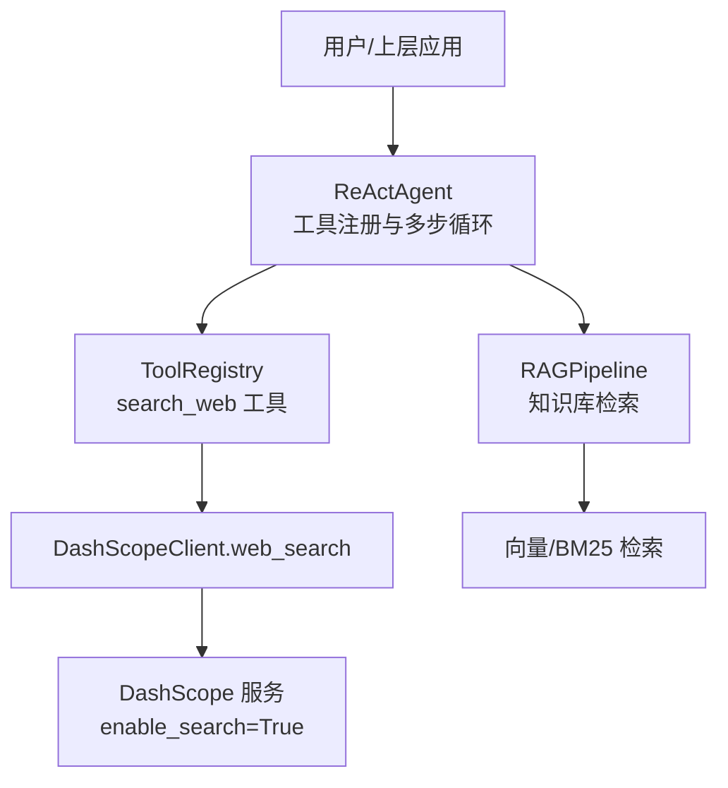
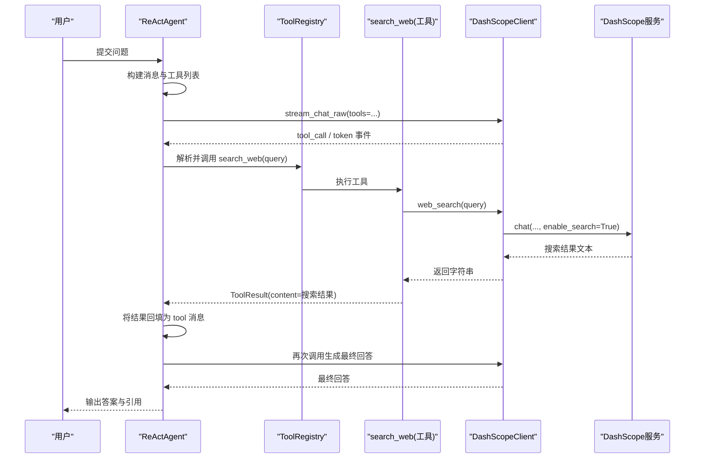
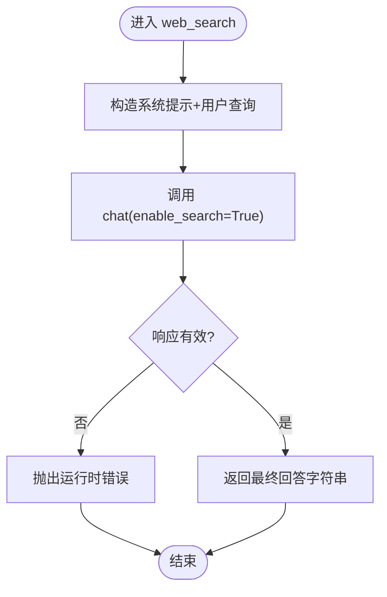
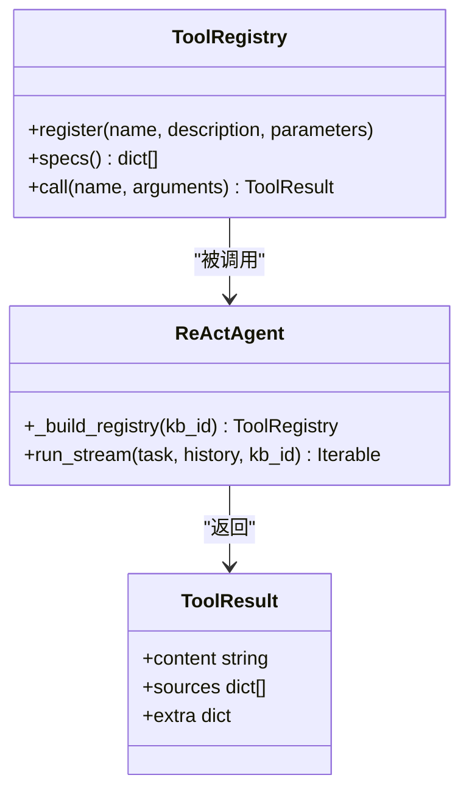
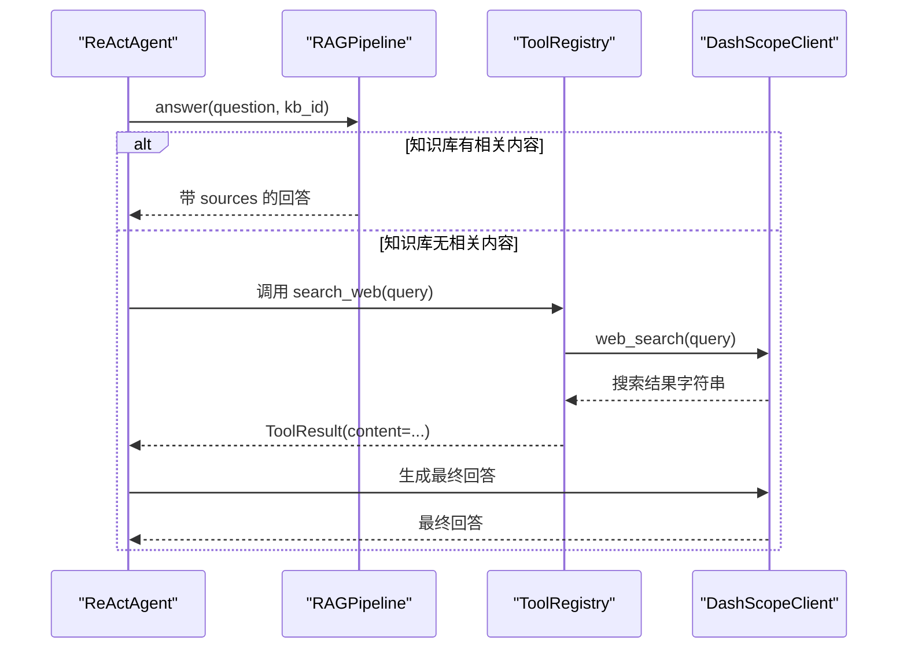
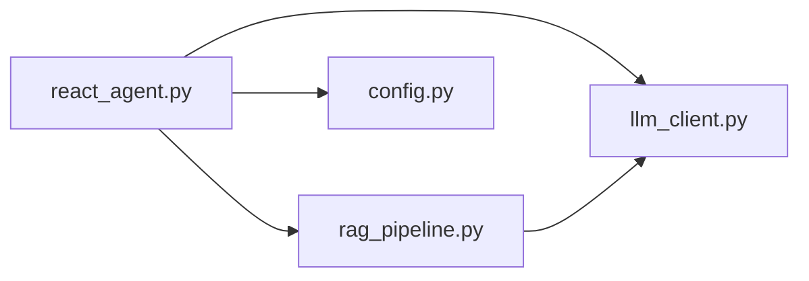

# 网络搜索工具

<cite>
**本文引用的文件**
- [llm_client.py](file://llm_client.py)
- [react_agent.py](file://react_agent.py)
- [rag_pipeline.py](file://rag_pipeline.py)
- [config.py](file://config.py)
- [README.md](file://README.md)
</cite>

## 目录
1. [简介](#简介)
2. [项目结构](#项目结构)
3. [核心组件](#核心组件)
4. [架构总览](#架构总览)
5. [详细组件分析](#详细组件分析)
6. [依赖关系分析](#依赖关系分析)
7. [性能与可用性考量](#性能与可用性考量)
8. [故障排查指南](#故障排查指南)
9. [结论](#结论)
10. [附录：使用示例与最佳实践](#附录使用示例与最佳实践)

## 简介
本技术文档聚焦于“网络搜索工具”的设计与实现，说明如何通过 LLM 客户端的 web_search 方法完成联网检索，并解释其在 Agent 工作流中的角色：当知识库信息不足或需要时效性内容时，自动切换到网络搜索获取最新信息。文档涵盖参数定义、返回格式、调用流程、错误处理、性能特征以及搜索策略建议与最佳实践。

## 项目结构
本项目采用分层模块化设计：
- llm_client.py：封装 DashScope OpenAI 兼容接口，提供对话、流式对话、Function Calling 与 web_search 能力。
- react_agent.py：基于 Function Calling 的轻量 Agent，注册工具（包括 search_web），驱动多步循环，将工具结果回填给模型。
- rag_pipeline.py：RAG 管线，负责知识库管理、混合检索与问答；同时定义 LLMClient 协议，约束 web_search 等接口。
- config.py：集中配置项，如最大工具调用轮数等。
- README.md：项目概览、快速开始、配置说明与目录结构。

图表来源
- [react_agent.py:165-246](file://react_agent.py#L165-L246)
- [llm_client.py:283-294](file://llm_client.py#L283-L294)
- [rag_pipeline.py:196-220](file://rag_pipeline.py#L196-L220)

章节来源
- [README.md:116-134](file://README.md#L116-L134)

## 核心组件
- DashScopeClient.web_search(query: str) -> str
  - 通过 DashScope 的 enable_search 开关触发联网搜索，返回最终回答字符串。
- ReActAgent.search_web(query: str) -> ToolResult
  - 作为工具注册到 Agent，调用 llm.web_search 并将结果包装为 ToolResult.content。
- RAGPipeline.answer(...)
  - 当知识库无相关内容时，Agent 可继续选择 search_web 工具以补充时效性信息。

章节来源
- [llm_client.py:283-294](file://llm_client.py#L283-L294)
- [react_agent.py:176-226](file://react_agent.py#L176-L226)
- [rag_pipeline.py:590-666](file://rag_pipeline.py#L590-L666)

## 架构总览
下图展示了从用户提问到 Agent 决策、工具执行、再到最终回答的完整流程，重点体现 search_web 在知识库不足时的切换机制。

图表来源
- [react_agent.py:272-369](file://react_agent.py#L272-L369)
- [llm_client.py:283-294](file://llm_client.py#L283-L294)

## 详细组件分析

### 组件：DashScopeClient.web_search
- 功能：封装一次带 enable_search=True 的聊天请求，用于联网检索并返回简洁回答。
- 参数：query（str）— 搜索关键词或问题。
- 返回：str — 模型生成的最终回答文本。
- 内部逻辑：
  - 构造 system 提示，要求联网检索并说明信息可能随时间变化。
  - 调用 chat(messages, enable_search=True)，由底层 _extra_body 注入 enable_search。
  - 异常统一转换为 RuntimeError，便于上层捕获与降级。

图表来源
- [llm_client.py:88-92](file://llm_client.py#L88-L92)
- [llm_client.py:94-127](file://llm_client.py#L94-L127)
- [llm_client.py:283-294](file://llm_client.py#L283-L294)

章节来源
- [llm_client.py:88-92](file://llm_client.py#L88-L92)
- [llm_client.py:94-127](file://llm_client.py#L94-L127)
- [llm_client.py:283-294](file://llm_client.py#L283-L294)

### 组件：ReActAgent.search_web 工具
- 注册位置：_build_registry 中注册名为 search_web 的工具。
- 作用：当 Agent 判断需要实时信息时，调用该工具获取网络搜索结果。
- 参数定义（JSON Schema）：
  - query（string，必填）— 要搜索的关键词或问题。
- 返回值：ToolResult.content = llm.web_search(query)。
- 上下文截断：工具结果会被限制在 TOOL_OBSERVATION_MAX_CHARS 以内，避免长文本稀释注意力。

图表来源
- [react_agent.py:93-141](file://react_agent.py#L93-L141)
- [react_agent.py:165-246](file://react_agent.py#L165-L246)
- [react_agent.py:334-366](file://react_agent.py#L334-L366)

章节来源
- [react_agent.py:165-246](file://react_agent.py#L165-L246)
- [react_agent.py:334-366](file://react_agent.py#L334-L366)

### 组件：Agent 工作流与知识库切换
- 工作流：
  - 构建消息与工具列表，调用流式接口。
  - 若模型返回 tool_calls，则解析并执行工具（如 search_web）。
  - 将工具结果作为 role=tool 的消息回填，继续下一轮直到模型给出最终回答或达到最大步骤。
- 知识库不足时的切换：
  - RAGPipeline.answer 在无相关内容时返回空 sources，Agent 可在后续轮次选择 search_web 获取时效性信息。
- 最大步骤控制：
  - 通过配置 agent_max_steps 限制工具调用轮数，防止无限循环。

图表来源
- [rag_pipeline.py:590-666](file://rag_pipeline.py#L590-L666)
- [react_agent.py:272-369](file://react_agent.py#L272-L369)
- [config.py:108-112](file://config.py#L108-L112)

章节来源
- [rag_pipeline.py:590-666](file://rag_pipeline.py#L590-L666)
- [react_agent.py:272-369](file://react_agent.py#L272-L369)
- [config.py:108-112](file://config.py#L108-L112)

## 依赖关系分析
- 模块耦合：
  - react_agent.py 依赖 llm_client.py（web_search）、rag_pipeline.py（RAGPipeline）。
  - rag_pipeline.py 定义 LLMClient 协议，约束 web_search 等方法签名。
  - config.py 提供 agent_max_steps 等运行参数。
- 外部依赖：
  - DashScope OpenAI 兼容接口（base_url、API Key）。
  - 环境变量读取（dotenv）。

图表来源
- [react_agent.py:16-29](file://react_agent.py#L16-L29)
- [rag_pipeline.py:17-38](file://rag_pipeline.py#L17-L38)
- [config.py:1-113](file://config.py#L1-113)

章节来源
- [react_agent.py:16-29](file://react_agent.py#L16-L29)
- [rag_pipeline.py:17-38](file://rag_pipeline.py#L17-L38)
- [config.py:1-113](file://config.py#L1-113)

## 性能与可用性考量
- 流式交互：Agent 使用 stream_chat_raw 进行流式工具调用与回答，降低首字延迟，提升用户体验。
- 结果截断：工具结果上限为 TOOL_OBSERVATION_MAX_CHARS，避免长文本影响模型注意力。
- 最大步骤：agent_max_steps 限制工具调用轮数，防止过度消耗资源。
- 错误处理：LLM 调用失败统一转为 RuntimeError，便于上层捕获与降级（例如回退到通用聊天）。

章节来源
- [react_agent.py:272-369](file://react_agent.py#L272-L369)
- [react_agent.py:64-66](file://react_agent.py#L64-L66)
- [config.py:108-112](file://config.py#L108-L112)
- [llm_client.py:94-127](file://llm_client.py#L94-L127)

## 故障排查指南
- 未配置 API Key：
  - 现象：初始化或调用时报错提示缺少密钥。
  - 处理：复制 .env.example 为 .env 并填写 DASHSCOPE_API_KEY。
- base_url 格式不正确：
  - 现象：报错提示应以 /compatible-mode/v1 结尾。
  - 处理：检查 DASHSCOPE_BASE_URL 配置。
- 模型返回为空或未包含 content：
  - 现象：RuntimeError 提示服务返回为空或未返回最终回答。
  - 处理：重试或检查模型状态；必要时降级为普通聊天。
- 工具执行失败：
  - 现象：ToolResult.content 包含“工具执行失败：...”信息。
  - 处理：查看具体异常原因，调整参数或重试；Agent 会尝试换参数或直接回答。

章节来源
- [llm_client.py:59-66](file://llm_client.py#L59-L66)
- [llm_client.py:75-86](file://llm_client.py#L75-L86)
- [llm_client.py:114-127](file://llm_client.py#L114-L127)
- [react_agent.py:130-141](file://react_agent.py#L130-L141)

## 结论
网络搜索工具通过 DashScopeClient.web_search 与 ReActAgent 的工具注册机制，实现了在知识库信息不足或需要时效性内容时自动切换到联网检索的能力。其设计遵循流式交互、结果截断、最大步骤限制与统一错误处理等原则，确保稳定性与性能。结合合理的搜索关键词构造策略，可有效提升回答质量与时效性。

## 附录：使用示例与最佳实践

### 使用示例
- 直接调用 web_search：
  - 输入：query 为具体问题或关键词。
  - 行为：通过 enable_search=True 触发联网检索，返回最终回答字符串。
  - 参考路径：[llm_client.py:283-294](file://llm_client.py#L283-L294)
- 通过 Agent 自动选择：
  - 输入：自然语言问题。
  - 行为：Agent 先尝试知识库检索；若无相关内容，自动调用 search_web 获取最新信息，再综合生成回答。
  - 参考路径：[react_agent.py:272-369](file://react_agent.py#L272-L369)、[rag_pipeline.py:590-666](file://rag_pipeline.py#L590-L666)

### 搜索策略与最佳实践
- 关键词构造技巧：
  - 明确主体与限定词：如“公司 产品 名称 型号”，避免过于宽泛。
  - 加入时间限定：如“2024年 最新 新闻”，提高时效性命中。
  - 使用同义词与缩写：覆盖不同表述方式。
  - 拆分复杂问题：将多问题拆分为多个单轮搜索，提升命中率。
- 工具选择建议：
  - 优先知识库：涉及公司制度、产品、项目等内部信息时，优先使用 search_knowledge_base。
  - 时效性内容：新闻、行情、政策更新等，使用 search_web。
  - 天气/本地数据：使用 get_weather 等专用工具。
- 结果利用：
  - 注意工具结果长度限制，必要时二次追问或细化查询。
  - 关注 Agent 的 steps 日志，了解工具调用链路与成本估算。

章节来源
- [react_agent.py:165-246](file://react_agent.py#L165-L246)
- [rag_pipeline.py:590-666](file://rag_pipeline.py#L590-L666)
- [config.py:108-112](file://config.py#L108-L112)