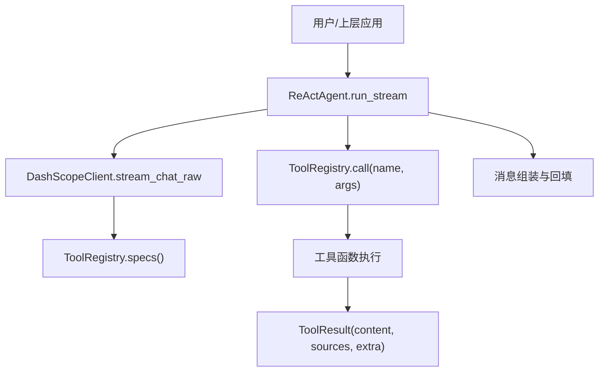
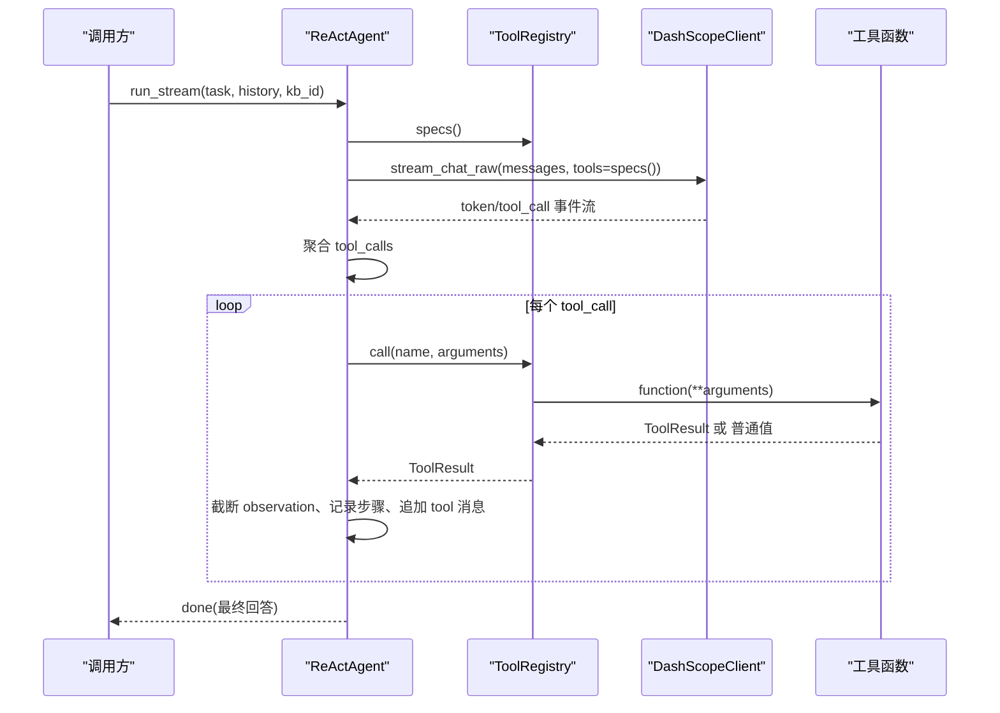
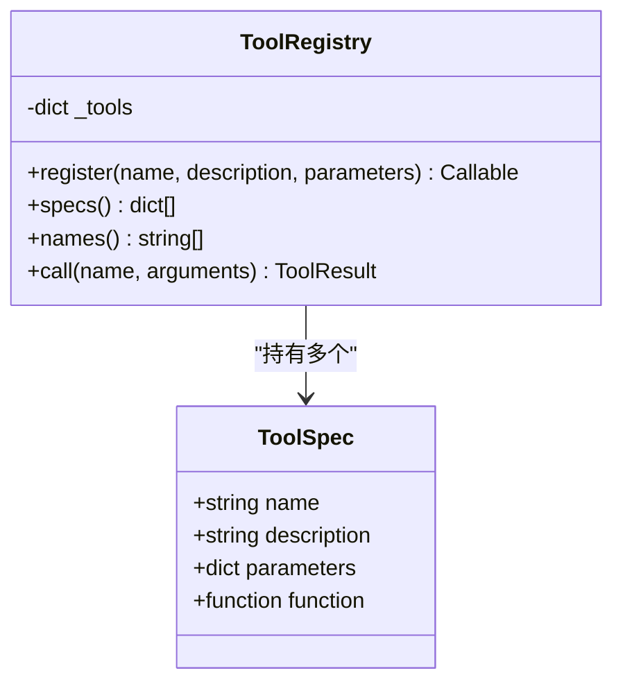
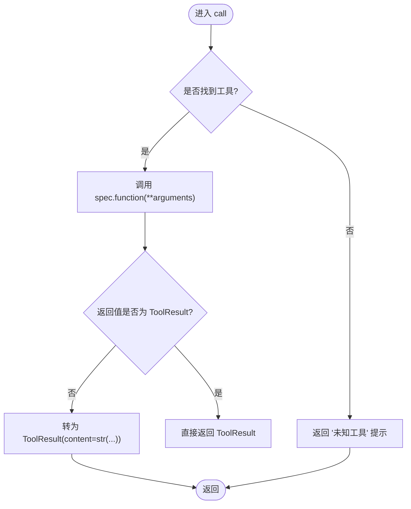
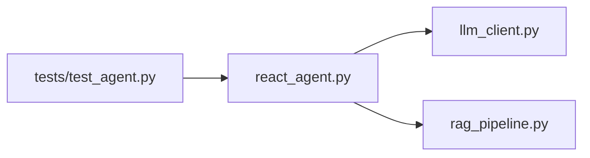

# 工具注册表系统

<cite>
**本文引用的文件**
- [react_agent.py](file://react_agent.py)
- [llm_client.py](file://llm_client.py)
- [tests/test_agent.py](file://tests/test_agent.py)
</cite>

## 目录
1. [简介](#简介)
2. [项目结构](#项目结构)
3. [核心组件](#核心组件)
4. [架构总览](#架构总览)
5. [详细组件分析](#详细组件分析)
6. [依赖关系分析](#依赖关系分析)
7. [性能考量](#性能考量)
8. [故障排查指南](#故障排查指南)
9. [结论](#结论)
10. [附录：自定义工具开发指南与示例](#附录自定义工具开发指南与示例)

## 简介
本技术文档围绕“工具注册表系统”展开，聚焦于 ToolRegistry 类的设计与实现、ToolSpec 数据结构定义、OpenAI 兼容 tools 格式生成、工具调用流程（名称查找、参数传递、结果封装、异常处理），以及自定义工具开发与集成模式。该系统基于 Function Calling 的 ReAct Agent 模式，通过声明式注册工具并动态生成 OpenAI 兼容的工具描述，驱动大模型在对话中自主选择并调用工具，形成“观察→思考→行动”的多步循环。

## 项目结构
- react_agent.py：包含 ToolResult、ToolSpec、ToolRegistry、ReActAgent 等核心实现，以及内置工具（知识库检索、天气查询、联网搜索、只读数据库查询）和主循环逻辑。
- llm_client.py：提供 DashScopeClient，封装 OpenAI 兼容接口，支持流式与非流式调用、Function Calling 事件流、联网搜索能力。
- tests/test_agent.py：覆盖工具注册、参数解析、最大轮数控制、天气工具离线测试、流式事件序列验证、只读数据库工具等关键场景。

图表来源
- [react_agent.py:144-371](file://react_agent.py#L144-L371)
- [llm_client.py:203-278](file://llm_client.py#L203-L278)

章节来源
- [react_agent.py:1-15](file://react_agent.py#L1-L15)
- [llm_client.py:1-20](file://llm_client.py#L1-L20)

## 核心组件
- ToolResult：统一工具返回结构，包含 content（字符串）、sources（引用来源列表）、extra（扩展字段）。
- ToolSpec：不可变数据类，描述工具的名称、描述、参数 Schema（JSON Schema）与函数引用。
- ToolRegistry：工具注册表，负责：
  - 注册工具（装饰器方式）
  - 生成 OpenAI 兼容 tools 列表
  - 按名称查找并调用工具
  - 统一异常处理与结果封装
- ReActAgent：基于 Function Calling 的 Agent，构建消息、驱动 LLM、聚合 tool_calls、执行工具、回填结果并输出流式事件。

章节来源
- [react_agent.py:69-142](file://react_agent.py#L69-L142)
- [react_agent.py:144-371](file://react_agent.py#L144-L371)

## 架构总览
系统采用“声明式工具注册 + 运行时动态加载 + 多步 Function Calling 循环”的架构：
- 声明式注册：通过 @registry.register(...) 将工具函数与其 JSON Schema 绑定为 ToolSpec。
- 动态加载：ReActAgent._build_registry 按需构建工具集，便于不同上下文（如 kb_id）下注入不同工具。
- 多步循环：LLM 选择工具 → 参数解析 → 工具执行 → 结果回填 → 继续推理或结束。

图表来源
- [react_agent.py:272-371](file://react_agent.py#L272-L371)
- [llm_client.py:203-278](file://llm_client.py#L203-L278)

## 详细组件分析

### ToolSpec 数据结构
- name：工具唯一标识名。
- description：对工具的说明，用于提示模型何时使用。
- parameters：JSON Schema，描述参数类型、必填项、字段说明等，供 LLM 进行参数校验与生成。
- function：实际执行的函数引用，接收关键字参数并返回 ToolResult 或可被转换为 ToolResult 的值。

复杂度与约束
- 不可变数据类，保证注册后不被意外修改。
- 时间复杂度 O(1) 访问；空间复杂度 O(1) 每工具。

章节来源
- [react_agent.py:85-91](file://react_agent.py#L85-L91)

### ToolRegistry：注册机制与生命周期管理
- 注册机制：register(name, description, parameters) 返回装饰器，将函数包装为 ToolSpec 并加入内部字典 _tools。
- 重名保护：若同名已存在则抛出 ValueError。
- 生命周期：
  - 构造时初始化空字典。
  - 运行期通过 register 动态添加。
  - 通过 names/specs/call 暴露查询与调用能力。
- 错误处理：未知工具返回友好提示；工具执行异常捕获并封装为 ToolResult.content。

图表来源
- [react_agent.py:85-142](file://react_agent.py#L85-L142)

章节来源
- [react_agent.py:93-142](file://react_agent.py#L93-L142)

### OpenAI 兼容 tools 格式生成
- specs() 将每个 ToolSpec 转换为 OpenAI 兼容的 function 描述：
  - type: "function"
  - function.name/description/parameters
- 该列表直接作为 tools 参数传入 LLM 的 Function Calling 接口，使模型能理解可用工具及其参数 Schema。

章节来源
- [react_agent.py:113-125](file://react_agent.py#L113-L125)

### 工具调用流程：名称查找、参数传递、结果封装、异常处理
- 名称查找：call(name, arguments) 从 _tools 字典查找 ToolSpec。
- 参数传递：以 **arguments 解包为关键字参数调用工具函数。
- 结果封装：若返回 ToolResult 则直接使用；否则用 str(result) 包装为 ToolResult。
- 异常处理：捕获所有异常，使用 safe_error 格式化后写入 ToolResult.content，以便模型重试或直接回答。

图表来源
- [react_agent.py:130-142](file://react_agent.py#L130-L142)

章节来源
- [react_agent.py:130-142](file://react_agent.py#L130-L142)

### ReActAgent 与 LLM 集成
- 构建消息：_build_messages 组装 system、历史与当前任务。
- 流式调用：stream_chat_raw 产出 token 与 tool_call 事件。
- 工具循环：聚合 tool_calls，逐个解析参数、执行工具、追加 tool 消息，直到模型给出最终回答或达到最大轮数。
- 参数解析：_parse_arguments 容忍 markdown 代码块包裹的 JSON，失败时回退为空对象。

章节来源
- [react_agent.py:272-371](file://react_agent.py#L272-L371)
- [react_agent.py:493-505](file://react_agent.py#L493-L505)
- [llm_client.py:203-278](file://llm_client.py#L203-L278)

## 依赖关系分析
- react_agent.py 依赖 llm_client.py 提供的 DashScopeClient，用于聊天、流式事件与联网搜索。
- ReActAgent 依赖 RAGPipeline（通过 rag 属性）提供知识库检索能力。
- ToolRegistry 仅依赖 Python 标准库与 dataclasses，保持低耦合。
- 测试用例通过 FakeMessage/FakeToolCall 模拟 LLM 行为，验证工具注册与调用流程。

图表来源
- [react_agent.py:16-29](file://react_agent.py#L16-L29)
- [llm_client.py:1-20](file://llm_client.py#L1-L20)
- [tests/test_agent.py:1-8](file://tests/test_agent.py#L1-L8)

章节来源
- [react_agent.py:16-29](file://react_agent.py#L16-L29)
- [llm_client.py:1-20](file://llm_client.py#L1-L20)
- [tests/test_agent.py:1-8](file://tests/test_agent.py#L1-L8)

## 性能考量
- 工具结果截断：observation 限制最大字符数，避免长结果稀释注意力与占用过多上下文。
- 流式输出：token 边到边输出，降低首字延迟，提升交互体验。
- 只读数据库：SQL 工具以只读模式连接，防止误写；首关键字软校验限制允许语句集合。
- 最大轮数：防止无限循环，保障资源与响应时效。

[本节为通用性能讨论，不直接分析具体文件]

## 故障排查指南
- 工具未找到：检查 registry.names() 确认工具是否注册成功，确保名称一致且无重名冲突。
- 参数解析失败：_parse_arguments 会容忍 markdown 代码块包裹；若仍失败，检查模型返回的 arguments 是否为合法 JSON。
- 工具执行异常：查看 ToolResult.content 中的安全错误信息，定位外部依赖（网络、数据库）问题。
- LLM 调用失败：检查环境变量配置（API Key、Base URL、模型名），参考 safe_error 输出的可读错误。

章节来源
- [react_agent.py:130-142](file://react_agent.py#L130-L142)
- [react_agent.py:493-505](file://react_agent.py#L493-L505)
- [llm_client.py:297-300](file://llm_client.py#L297-L300)

## 结论
工具注册表系统通过简洁的装饰器注册机制与不可变的 ToolSpec 描述，实现了工具的生命周期管理与 OpenAI 兼容 tools 的动态生成。ReActAgent 结合 Function Calling 的多步循环，使得模型能够自主选择合适的工具并执行，形成完整的“观察→思考→行动”闭环。系统具备良好的可扩展性、健壮性与可观测性，适合在企业级 RAG/Agent 场景中快速集成与迭代。

[本节为总结性内容，不直接分析具体文件]

## 附录：自定义工具开发指南与示例

### 装饰器使用
- 使用 @registry.register("tool_name", "工具描述", json_schema) 装饰你的工具函数。
- 工具函数应接受关键字参数并与 JSON Schema 的 properties 对应。
- 推荐返回 ToolResult；若返回普通值，将被自动转换为 ToolResult(content=str(...))。

章节来源
- [react_agent.py:99-111](file://react_agent.py#L99-L111)
- [react_agent.py:130-142](file://react_agent.py#L130-L142)

### 参数定义规范
- 使用 JSON Schema 的 object 类型与 properties 定义参数结构与类型。
- 使用 required 列出必填字段。
- 为每个字段提供 description，帮助模型正确生成参数。

章节来源
- [react_agent.py:182-226](file://react_agent.py#L182-L226)

### 返回值处理
- 优先返回 ToolResult，包含 content、可选的 sources（用于 UI 引用展示）与 extra（扩展元数据）。
- 若返回非 ToolResult，系统会自动包装为 ToolResult(content=str(...))。

章节来源
- [react_agent.py:76-83](file://react_agent.py#L76-L83)
- [react_agent.py:130-142](file://react_agent.py#L130-L142)

### 错误处理最佳实践
- 工具内部捕获异常，使用 safe_error 获取可读错误信息并写入 ToolResult.content。
- 对于外部依赖（网络、数据库），做好超时与降级处理，确保工具不会阻塞或崩溃。

章节来源
- [react_agent.py:136-142](file://react_agent.py#L136-L142)
- [llm_client.py:297-300](file://llm_client.py#L297-L300)

### 具体工具注册示例与集成模式
- 内置工具示例：
  - 知识库检索：search_knowledge_base
  - 天气查询：get_weather
  - 联网搜索：search_web
  - 只读数据库查询：query_database
- 集成模式：
  - 在 ReActAgent._build_registry 中集中注册工具，便于按上下文（如 kb_id）动态装配。
  - 通过 registry.specs() 生成 OpenAI tools 列表，传递给 LLM 的 Function Calling。
  - 通过 registry.call(name, arguments) 执行工具，并将结果回填给模型。

章节来源
- [react_agent.py:165-246](file://react_agent.py#L165-L246)
- [tests/test_agent.py:11-22](file://tests/test_agent.py#L11-L22)
- [tests/test_agent.py:30-43](file://tests/test_agent.py#L30-L43)
- [tests/test_agent.py:56-113](file://tests/test_agent.py#L56-L113)
- [tests/test_agent.py:141-153](file://tests/test_agent.py#L141-L153)