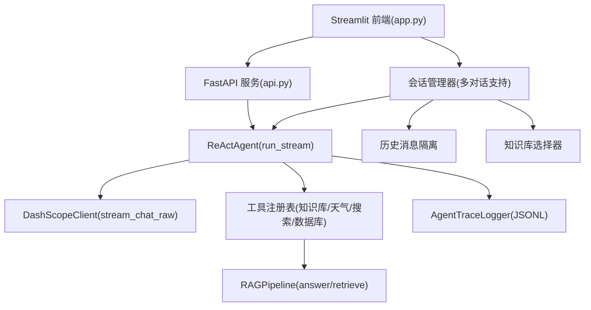
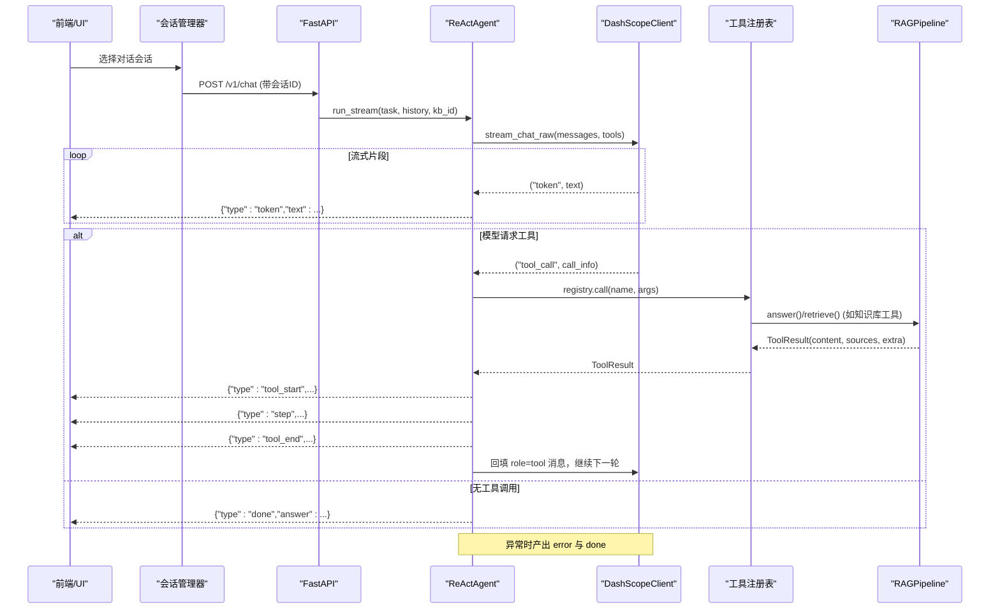
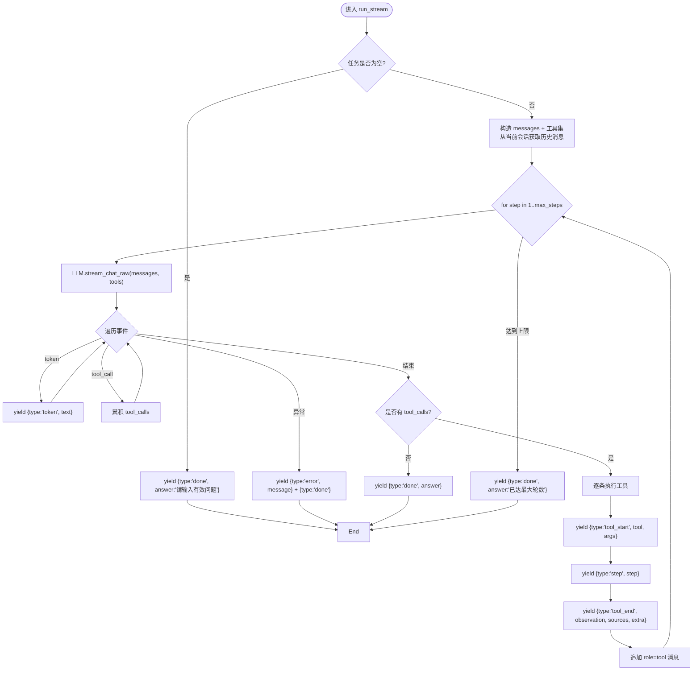
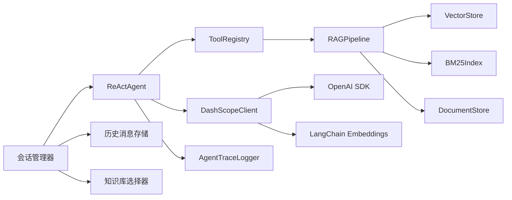

# 流式事件系统

<cite>
**本文引用的文件**
- [react_agent.py](file://react_agent.py)
- [llm_client.py](file://llm_client.py)
- [rag_pipeline.py](file://rag_pipeline.py)
- [api.py](file://api.py)
- [app.py](file://app.py)
- [utils/logger.py](file://utils/logger.py)
- [config.py](file://config.py)
</cite>

## 更新摘要
**所做更改**
- 更新了多对话架构支持，确保事件正确处理不同对话的消息历史和上下文隔离
- 增强了会话管理功能，每个会话独立保存消息记录与所选知识库
- 优化了前端UI订阅机制，保持向后兼容的同时支持新的数据结构
- 改进了后端API以支持独立的对话会话管理

## 目录
1. [简介](#简介)
2. [项目结构](#项目结构)
3. [核心组件](#核心组件)
4. [架构总览](#架构总览)
5. [详细组件分析](#详细组件分析)
6. [依赖关系分析](#依赖关系分析)
7. [性能考量](#性能考量)
8. [故障排查指南](#故障排查指南)
9. [结论](#结论)
10. [附录：事件数据结构与消费示例](#附录事件数据结构与消费示例)

## 简介
本技术文档围绕"流式事件系统"展开，重点解释 ReActAgent.run_stream 的事件驱动架构，包括事件类型定义（tool_start、tool_end、step、token、done、error）的处理逻辑；事件流的生成过程（LLM 流式响应处理、工具调用事件触发、中间状态推送）；事件数据结构与数据流向；前端 UI 订阅与实时渲染机制；以及事件流的调试与监控方案。同时提供具体事件流处理示例与集成指南，帮助读者快速理解并落地使用。

**更新** 系统现已适配新的多对话架构，确保事件正确处理不同对话的消息历史和上下文隔离，每个会话独立管理其状态和知识库选择。

## 项目结构
本项目采用分层组织：
- 交互层：FastAPI 服务（api.py）与 Streamlit 应用（app.py），负责暴露 REST API 与构建用户界面。
- Agent 层：ReActAgent（react_agent.py），实现基于 Function Calling 的多步工具调用循环，并以 run_stream 输出统一事件流。
- LLM 适配层：DashScopeClient（llm_client.py），封装 OpenAI 兼容接口，提供 chat/chat_raw/stream_chat/stream_chat_raw 等能力。
- RAG 管线：RAGPipeline（rag_pipeline.py），提供知识库管理、检索、问答等能力，被 Agent 作为工具之一使用。
- 配置与日志：config.py 集中配置项；utils/logger.py 提供线程安全的 JSONL 轨迹日志。

**图表来源**
- [app.py:213-252](file://app.py#L213-L252)
- [app.py:516-557](file://app.py#L516-L557)
- [api.py:185-199](file://api.py#L185-L199)
- [react_agent.py:272-369](file://react_agent.py#L272-L369)
- [llm_client.py:203-278](file://llm_client.py#L203-L278)
- [rag_pipeline.py:590-666](file://rag_pipeline.py#L590-L666)
- [utils/logger.py:12-45](file://utils/logger.py#L12-L45)

**章节来源**
- [app.py:1-558](file://app.py#L1-L558)
- [api.py:1-204](file://api.py#L1-L204)
- [react_agent.py:1-567](file://react_agent.py#L1-L567)
- [llm_client.py:1-322](file://llm_client.py#L1-L322)
- [rag_pipeline.py:1-792](file://rag_pipeline.py#L1-L792)
- [utils/logger.py:1-76](file://utils/logger.py#L1-L76)
- [config.py:1-113](file://config.py#L1-L113)

## 核心组件
- ReActAgent：实现多步工具调用循环，通过 run_stream 产出统一事件流，支撑前端实时渲染与后端聚合结果。
- DashScopeClient：提供流式与非流式聊天能力，支持 Function Calling 的增量 tool_calls 累积与最终 tool_call 事件。
- RAGPipeline：提供知识库检索与问答能力，作为 Agent 的工具之一被调用。
- ToolRegistry：工具注册表，按名调用工具函数，返回 ToolResult（content/sources/extra）。
- AgentTraceLogger：记录每步执行轨迹到 JSONL，便于调试与审计。
- **新增** 会话管理器：支持多对话独立管理，每个会话拥有独立的消息历史和知识库选择。

**章节来源**
- [react_agent.py:93-142](file://react_agent.py#L93-L142)
- [react_agent.py:144-369](file://react_agent.py#L144-L369)
- [llm_client.py:22-278](file://llm_client.py#L22-L278)
- [rag_pipeline.py:196-666](file://rag_pipeline.py#L196-L666)
- [utils/logger.py:12-45](file://utils/logger.py#L12-L45)
- [app.py:213-252](file://app.py#L213-L252)

## 架构总览
run_stream 的事件驱动架构如下：
- 输入：用户问题、历史消息、可选知识库 ID。
- 步骤：
  - 构造 messages，加载工具集。
  - 调用 LLM 流式接口 stream_chat_raw，边到边产出 token 事件。
  - 若模型返回 tool_calls，则逐条触发工具执行，产出 tool_start、step、tool_end。
  - 将工具结果回填为 role=tool 消息，继续下一轮。
  - 若无 tool_calls，直接产出 done 结束。
  - 异常时产出 error 与 done。
- 输出：Iterable[dict] 事件序列，供 UI 或上层聚合。

**更新** 现在支持多对话架构，每个对话会话独立维护其消息历史和上下文隔离。

**图表来源**
- [react_agent.py:272-369](file://react_agent.py#L272-L369)
- [llm_client.py:203-278](file://llm_client.py#L203-L278)
- [rag_pipeline.py:590-666](file://rag_pipeline.py#L590-L666)
- [api.py:185-199](file://api.py#L185-L199)
- [app.py:213-252](file://app.py#L213-L252)

## 详细组件分析

### ReActAgent.run_stream 事件流生成
- 事件类型与触发时机：
  - token：LLM 流式回答增量，边到边 yield。
  - tool_start：开始执行某个工具，携带工具名与参数。
  - step：工具执行完成后的中间状态，包含步骤编号、思考摘要、工具名、参数、观测值、成本估算。
  - tool_end：工具执行结束，携带观测值、引用来源、额外信息（如 context_tokens）。
  - done：一轮或多轮结束后最终答案。
  - error：异常时抛出错误信息与终止。
- 关键流程：
  - 校验任务非空，否则直接 done。
  - 构造 messages 与工具集，进入最大步数循环。
  - 调用 LLM 流式接口，累积 token 与 tool_calls。
  - 若无 tool_calls，直接 done。
  - 若有 tool_calls，逐条执行工具，产出 tool_start/step/tool_end，并将结果回填消息。
  - 达到最大步数后，产出 done。

**更新** 现在支持从不同会话获取独立的历史消息和知识库配置，确保上下文隔离。

**图表来源**
- [react_agent.py:272-369](file://react_agent.py#L272-L369)

**章节来源**
- [react_agent.py:272-369](file://react_agent.py#L272-L369)

### LLM 流式响应与工具调用事件
- stream_chat_raw 事件：
  - token：文本增量，直接 yield。
  - tool_call：增量到达的 tool_calls 按 index 累积，流结束后统一 yield。
- 作用：
  - 降低首字延迟，提升用户体验。
  - 支持 Function Calling，使 Agent 能动态选择工具并回填结果。

**章节来源**
- [llm_client.py:203-278](file://llm_client.py#L203-L278)

### 工具调用与中间状态推送
- 工具注册与调用：
  - ToolRegistry 维护工具规范与函数映射，按名调用并返回 ToolResult。
  - 工具包括知识库检索、天气查询、联网搜索、只读 SQL 查询等。
- 中间状态：
  - tool_start：提示 UI 正在调用某工具及参数。
  - step：记录步骤编号、思考摘要、工具名、参数、观测值、成本估算，用于轨迹展示。
  - tool_end：汇总观测值、引用来源与额外信息（如上下文 token 数）。

**章节来源**
- [react_agent.py:93-142](file://react_agent.py#L93-L142)
- [react_agent.py:165-246](file://react_agent.py#L165-L246)
- [react_agent.py:326-366](file://react_agent.py#L326-L366)

### 事件数据结构与数据流向
- 事件类型字段定义：
  - token：{type:"token", text:string}
  - tool_start：{type:"tool_start", tool:string, args:dict}
  - step：{type:"step", step:{step:int, thought_summary:string, tool:string, args:dict, observation:string, cost_estimate:int}}
  - tool_end：{type:"tool_end", tool:string, observation:string, sources:list, extra:dict}
  - done：{type:"done", answer:string}
  - error：{type:"error", message:string}
- 数据流向：
  - LLM 流式 token → Agent → UI 实时渲染。
  - 工具调用 → 工具执行 → 中间状态 → UI 更新。
  - 最终答案 → UI 展示与持久化。

**更新** 现在每个事件都关联到特定的对话会话，确保消息历史的正确隔离和管理。

**章节来源**
- [react_agent.py:272-369](file://react_agent.py#L272-L369)

### 前端 UI 订阅与实时渲染
- Streamlit 应用订阅 run_stream 事件：
  - token：逐步拼接答案并 markdown 渲染。
  - tool_start/tool_end：显示工具调用状态与完成提示。
  - step：收集执行轨迹，供后续展开查看。
  - done：最终答案覆盖并保存至会话消息。
  - error：错误提示。
- 实时性：
  - 通过迭代事件流，逐帧渲染，降低首字延迟。

**更新** 前端现在支持多对话界面，每个对话有独立的消息历史和状态管理。

**章节来源**
- [app.py:213-252](file://app.py#L213-L252)
- [app.py:516-557](file://app.py#L516-L557)

### 后端 API 集成
- FastAPI 路由 /v1/chat：
  - 接收 ChatRequest（question/history/kb_id）。
  - 调用 agent.run（内部聚合 run_stream 事件）并返回 ChatResponse。
- 注意：当前 API 返回聚合结果，如需实时流式响应可改为 SSE/WS 模式。

**更新** API 现在支持会话ID参数，以便在多对话环境中正确识别和管理不同的对话会话。

**章节来源**
- [api.py:185-199](file://api.py#L185-L199)

### 多对话架构实现
- 会话管理：
  - 每个会话拥有唯一的ID、标题、消息列表和知识库选择。
  - 会话间完全隔离，互不影响。
  - 支持会话的新建、切换、删除和清空操作。
- 历史消息管理：
  - 每个会话维护独立的消息历史。
  - 通过 _history_messages() 函数获取当前会话的历史消息。
  - 支持消息的截断和上下文预算控制。

**章节来源**
- [app.py:213-252](file://app.py#L213-L252)
- [app.py:243-249](file://app.py#L243-L249)

## 依赖关系分析
- ReActAgent 依赖：
  - LLMClient（DashScopeClient）：流式聊天与工具调用。
  - RAGPipeline：知识库检索与问答。
  - ToolRegistry：工具注册与调用。
  - AgentTraceLogger：轨迹日志。
- DashScopeClient 依赖：
  - OpenAI SDK：OpenAI 兼容接口。
  - LangChain Embeddings：向量嵌入。
- RAGPipeline 依赖：
  - VectorStore/BM25Index：混合检索。
  - DocumentStore：元数据与片段存储。

**更新** 新增了会话管理器对 ReActAgent 的依赖，用于多对话支持。

**图表来源**
- [react_agent.py:144-369](file://react_agent.py#L144-L369)
- [llm_client.py:22-278](file://llm_client.py#L22-L278)
- [rag_pipeline.py:196-666](file://rag_pipeline.py#L196-L666)
- [utils/logger.py:12-45](file://utils/logger.py#L12-L45)
- [app.py:213-252](file://app.py#L213-L252)

**章节来源**
- [react_agent.py:144-369](file://react_agent.py#L144-L369)
- [llm_client.py:22-278](file://llm_client.py#L22-L278)
- [rag_pipeline.py:196-666](file://rag_pipeline.py#L196-L666)
- [utils/logger.py:12-45](file://utils/logger.py#L12-L45)
- [app.py:213-252](file://app.py#L213-L252)

## 性能考量
- 首字延迟优化：
  - 使用 stream_chat_raw 边到边输出 token，减少等待时间。
  - 关闭 enable_thinking 以降低首字延迟（在文档问答场景）。
- 上下文预算控制：
  - truncate_history 与 fit_context_indices 限制历史与上下文长度，避免注意力稀释与计费浪费。
- 工具观测截断：
  - TOOL_OBSERVATION_MAX_CHARS 限制工具结果长度，防止上下文爆炸。
- 并发与锁：
  - FastAPI 使用全局锁串行化读写，避免 SQLite/Chroma 并发问题。
- 日志开销：
  - AgentTraceLogger 单条写入失败不影响主流程，保证稳定性。

**更新** 多对话架构增加了会话管理的开销，但通过内存中的会话字典实现了高效的会话切换和历史访问。

**章节来源**
- [react_agent.py:64-66](file://react_agent.py#L64-L66)
- [rag_pipeline.py:159-193](file://rag_pipeline.py#L159-L193)
- [api.py:32-33](file://api.py#L32-L33)
- [utils/logger.py:12-45](file://utils/logger.py#L12-L45)

## 故障排查指南
- 常见错误与处理：
  - 模型调用失败：捕获异常并产出 error 与 done，提示安全错误信息。
  - 工具执行失败：ToolRegistry 捕获异常并返回失败内容，允许模型重试或直接回答。
  - 数据库不存在或权限不足：只读 SQL 查询保护，拒绝写入语句。
- 调试与监控：
  - 查看 AgentTraceLogger 输出的 JSONL 轨迹，分析每步工具调用与观测值。
  - 检查 DashScopeClient.last_usage 获取 token 用量。
  - 使用 safe_error 隐藏堆栈，保留可排障原因。

**更新** 新增多对话相关的故障排查：
- 会话切换问题：检查会话ID是否正确传递。
- 历史消息丢失：验证会话状态管理和消息持久化。
- 知识库选择错误：确认会话的知识库配置是否正确设置。

**章节来源**
- [react_agent.py:307-311](file://react_agent.py#L307-L311)
- [react_agent.py:136-141](file://react_agent.py#L136-L141)
- [react_agent.py:443-470](file://react_agent.py#L443-L470)
- [utils/logger.py:12-45](file://utils/logger.py#L12-L45)
- [llm_client.py:297-299](file://llm_client.py#L297-L299)
- [app.py:213-252](file://app.py#L213-L252)

## 结论
run_stream 以事件驱动方式实现了低延迟、可观测、可扩展的流式事件系统。通过统一的事件类型与清晰的数据流向，前端可实时渲染，后端可聚合结果；工具调用与中间状态推送增强了可调试性与用户体验。结合配置与日志，系统具备良好的性能与可维护性。

**更新** 新的多对话架构进一步增强了系统的实用性和用户体验，使得用户可以同时管理多个独立的对话会话，每个会话都有完整的历史记录和上下文隔离。

## 附录：事件数据结构与消费示例

### 事件类型定义
- token：{type:"token", text:string}
- tool_start：{type:"tool_start", tool:string, args:dict}
- step：{type:"step", step:{step:int, thought_summary:string, tool:string, args:dict, observation:string, cost_estimate:int}}
- tool_end：{type:"tool_end", tool:string, observation:string, sources:list, extra:dict}
- done：{type:"done", answer:string}
- error：{type:"error", message:string}

**更新** 所有事件现在都与特定的对话会话关联，支持多对话环境下的正确处理和展示。

**章节来源**
- [react_agent.py:272-369](file://react_agent.py#L272-L369)

### 前端消费示例（Streamlit）
- 订阅 run_stream 事件：
  - token：逐步拼接并渲染。
  - tool_start/tool_end：显示工具状态。
  - step：收集轨迹。
  - done：最终答案。
  - error：错误提示。

**更新** 前端现在支持多对话界面，每个对话有独立的消息展示和状态管理。

**章节来源**
- [app.py:213-252](file://app.py#L213-L252)
- [app.py:516-557](file://app.py#L516-L557)

### 后端聚合示例（FastAPI）
- 调用 agent.run 聚合事件流，返回最终答案、来源与步骤。

**更新** API 现在支持会话ID参数，以便在多对话环境中正确识别和管理不同的对话会话。

**章节来源**
- [api.py:185-199](file://api.py#L185-L199)

### 集成指南
- 环境配置：
  - 设置 DASHSCOPE_API_KEY、DASHSCOPE_CHAT_MODEL、DASHSCOPE_BASE_URL 等环境变量。
  - 调整 CHROMA_DIR、KB_DB_PATH、RETRIEVAL_TOP_K 等检索与存储参数。
- 启动服务：
  - Streamlit：streamlit run app.py
  - FastAPI：uvicorn api:app --host 0.0.0.0 --port 8000
- 扩展工具：
  - 在 _build_registry 中注册新工具，实现 ToolResult 返回。

**更新** 多对话架构的集成注意事项：
- 确保会话ID的正确传递和管理。
- 验证历史消息的隔离和持久化。
- 测试不同会话间的知识库切换功能。

**章节来源**
- [llm_client.py:22-46](file://llm_client.py#L22-L46)
- [config.py:90-112](file://config.py#L90-L112)
- [react_agent.py:165-246](file://react_agent.py#L165-L246)
- [app.py:213-252](file://app.py#L213-L252)