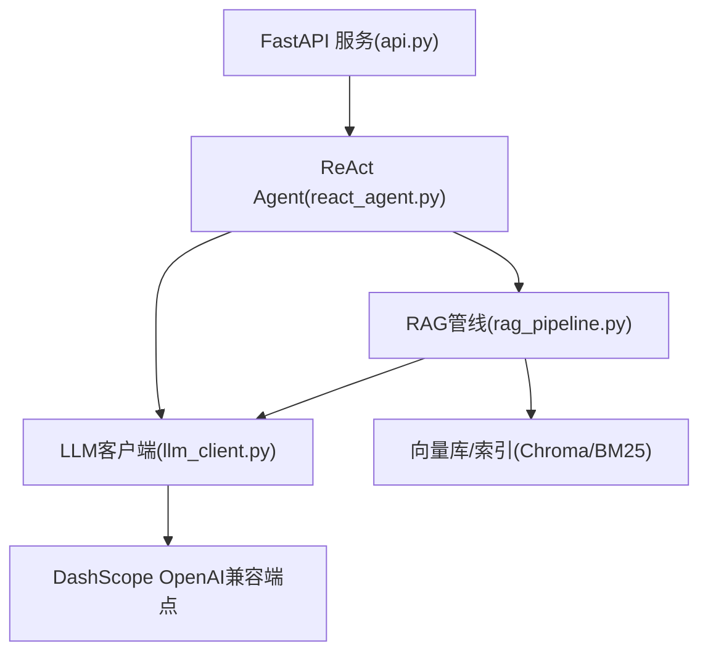
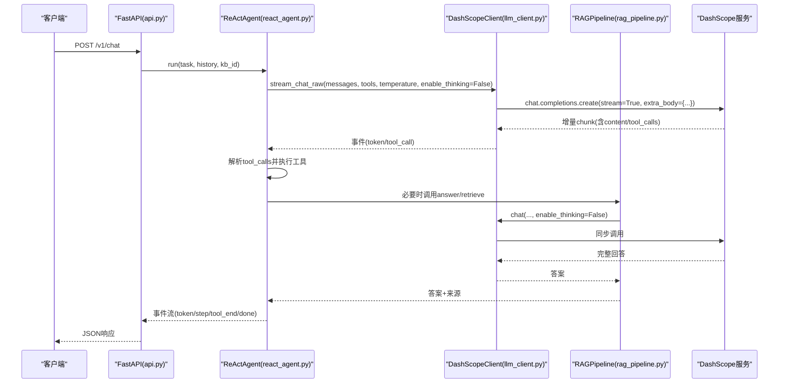
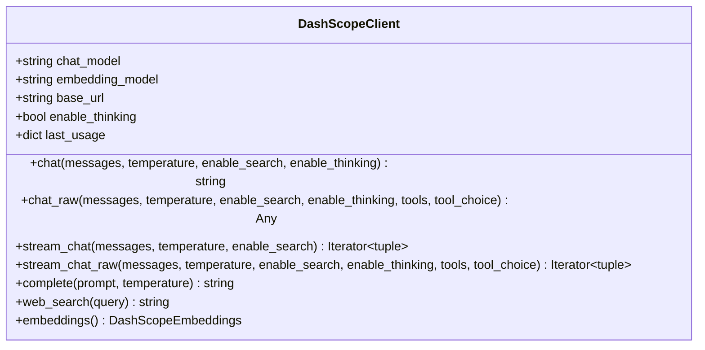
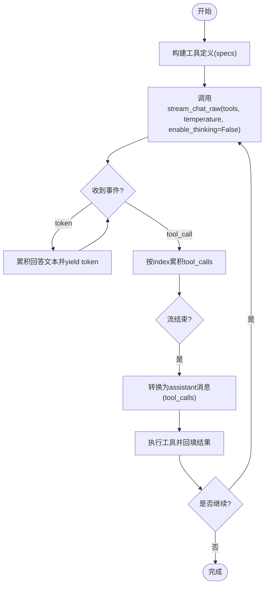
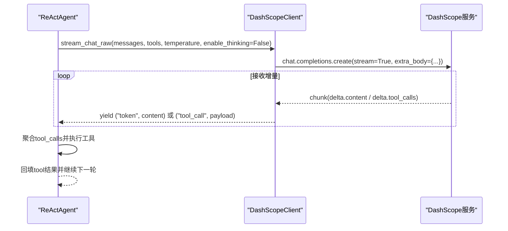
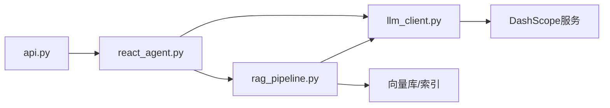

# LLM客户端模块

<cite>
**本文引用的文件**
- [llm_client.py](file://llm_client.py)
- [react_agent.py](file://react_agent.py)
- [rag_pipeline.py](file://rag_pipeline.py)
- [api.py](file://api.py)
- [config.py](file://config.py)
- [requirements.txt](file://requirements.txt)
</cite>

## 目录
1. [简介](#简介)
2. [项目结构](#项目结构)
3. [核心组件](#核心组件)
4. [架构总览](#架构总览)
5. [详细组件分析](#详细组件分析)
6. [依赖关系分析](#依赖关系分析)
7. [性能与并发](#性能与并发)
8. [故障排查指南](#故障排查指南)
9. [结论](#结论)
10. [附录：配置与环境](#附录配置与环境)

## 简介
本技术文档聚焦于LLM客户端模块，围绕 DashScopeClient 的封装设计、与阿里云百炼大模型API的集成方式、流式对话实现（实时响应、增量输出、连接管理）、Function Calling支持（工具定义传递、调用结果解析、错误处理）、客户端配置选项（模型选择、温度参数、搜索开关、思考模式控制）、错误处理策略（网络异常重试、API限流处理、降级方案），以及同步/异步调用模式、批量请求处理与性能监控进行系统化说明。该模块通过OpenAI兼容接口对接DashScope服务，为RAG管线与ReAct Agent提供统一、安全、可观测的LLM能力。

## 项目结构
- llm_client.py：封装DashScope OpenAI兼容客户端，提供同步聊天、流式聊天、原始消息返回、工具调用流式事件、联网搜索、Embedding等能力。
- react_agent.py：基于Function Calling的轻量Agent，负责工具注册、多步循环、流式事件输出、工具执行与回填。
- rag_pipeline.py：RAG管线门面，负责知识库管理、入库、混合检索、问答；通过LLMClient协议抽象LLM调用。
- api.py：FastAPI服务层，将RAG/Agent能力暴露为REST API，包含鉴权、路由与错误转换。
- config.py：集中化配置，所有可调参数从环境变量读取并带默认值。
- requirements.txt：运行时依赖声明，包括OpenAI SDK、LangChain、DashScope等。

图表来源
- [api.py:185-199](file://api.py#L185-L199)
- [react_agent.py:144-161](file://react_agent.py#L144-L161)
- [rag_pipeline.py:196-219](file://rag_pipeline.py#L196-L219)
- [llm_client.py:22-86](file://llm_client.py#L22-L86)

章节来源
- [api.py:1-204](file://api.py#L1-L204)
- [react_agent.py:1-567](file://react_agent.py#L1-L567)
- [rag_pipeline.py:1-792](file://rag_pipeline.py#L1-L792)
- [llm_client.py:1-322](file://llm_client.py#L1-L322)
- [config.py:1-113](file://config.py#L1-L113)
- [requirements.txt:1-21](file://requirements.txt#L1-L21)

## 核心组件
- DashScopeClient：统一封装百炼OpenAI兼容接口，提供chat、chat_raw、stream_chat、stream_chat_raw、web_search、embeddings等方法；内置超时、重试、额外参数注入（enable_thinking、enable_search）与token用量记录。
- ReActAgent：工具注册表+多步循环+流式输出；通过LLM的Function Calling能力让模型自主选择工具并执行，支持工具结果回填与最终回答生成。
- RAGPipeline：知识库管理、增量入库、混合检索（向量+BM25+RRF/MMR）、查询改写与带引用问答；通过LLMClient协议解耦具体LLM实现。
- FastAPI服务层：提供健康检查、知识库管理、文档上传、入库、问答等REST接口，统一鉴权与错误转换。

章节来源
- [llm_client.py:22-294](file://llm_client.py#L22-L294)
- [react_agent.py:93-142](file://react_agent.py#L93-L142)
- [rag_pipeline.py:196-697](file://rag_pipeline.py#L196-L697)
- [api.py:34-55](file://api.py#L34-L55)

## 架构总览
系统以DashScopeClient为核心，向上支撑ReActAgent与RAGPipeline，对外由FastAPI暴露REST接口。Agent通过Function Calling驱动工具执行（知识库检索、联网搜索、天气查询、数据库只读查询），RAGPipeline在需要时调用LLM进行问答或查询改写。流式能力贯穿Agent与LLM客户端，确保低延迟的首字输出与细粒度事件渲染。

图表来源
- [api.py:185-199](file://api.py#L185-L199)
- [react_agent.py:272-369](file://react_agent.py#L272-L369)
- [llm_client.py:172-278](file://llm_client.py#L172-L278)
- [rag_pipeline.py:590-697](file://rag_pipeline.py#L590-L697)

## 详细组件分析

### DashScopeClient封装设计
- 初始化与配置
  - 模型名、嵌入模型、Base URL从环境变量或默认值加载；强制base_url以“/compatible-mode/v1”结尾。
  - 思考模式开关enable_thinking默认开启，可通过环境变量覆盖。
  - 每次调用记录token用量（prompt/completion/total）。
- 客户端创建
  - 使用OpenAI SDK构造兼容客户端，设置timeout=90s、max_retries=2，避免全局可变连接状态复用。
- 同步聊天
  - chat方法：构建extra_body（enable_thinking、可选enable_search），调用chat.completions.create(stream=False)，校验choices与content，返回strip后的文本。
- 原始消息返回
  - chat_raw方法：支持tools与tool_choice，返回message对象（含tool_calls），供Agent工具循环使用。
- 流式聊天
  - stream_chat方法：yield (类型, 内容)，类型为reasoning或content，用于展示思考过程与最终回答。
- 流式原始消息（Function Calling）
  - stream_chat_raw方法：yield事件("token", str)与("tool_call", dict)；tool_calls按index累积并在流结束后统一产出，结构与chat_raw一致。
- 联网搜索
  - web_search方法：通过system提示引导模型联网检索，并设置enable_search=True。
- 错误处理
  - 捕获外部异常并转换为可读RuntimeError，附带model与base_url信息便于排障。

图表来源
- [llm_client.py:22-294](file://llm_client.py#L22-L294)

章节来源
- [llm_client.py:22-294](file://llm_client.py#L22-L294)

### Function Calling支持与工具循环
- 工具定义传递
  - ReActAgent通过ToolRegistry将工具函数注册为OpenAI兼容tools格式（type="function"，含name、description、parameters）。
  - 调用stream_chat_raw时将tools传入，使模型能自主决定调用工具及参数。
- 调用结果解析
  - stream_chat_raw对tool_calls增量帧按index累积，流结束后统一yield ("tool_call", payload)。
  - _assistant_message_from_tool_calls将tool_calls转为assistant消息以便回填。
  - _parse_arguments容忍markdown代码块包裹的JSON，提升鲁棒性。
- 错误处理机制
  - ToolRegistry.call捕获工具执行异常，返回ToolResult(content=f"工具执行失败：{safe_error(exc)}")，让模型有机会重试或直接回答。
  - Agent在run_stream中捕获模型调用异常，输出error事件并终止流程。

图表来源
- [react_agent.py:272-369](file://react_agent.py#L272-L369)
- [react_agent.py:527-545](file://react_agent.py#L527-L545)
- [react_agent.py:493-504](file://react_agent.py#L493-L504)

章节来源
- [react_agent.py:93-142](file://react_agent.py#L93-L142)
- [react_agent.py:272-369](file://react_agent.py#L272-L369)
- [react_agent.py:493-504](file://react_agent.py#L493-L504)
- [react_agent.py:527-545](file://react_agent.py#L527-L545)

### 流式对话实现
- 实时响应处理
  - stream_chat_yield reasoning与content两类事件，便于UI区分思考过程与最终回答。
  - stream_chat_raw_yield token与tool_call两类事件，保证首字延迟低且工具调用可聚合。
- 增量内容输出
  - 对delta.content逐段yield，对tool_calls按index累积后统一产出，避免中间态污染。
- 连接管理
  - 使用OpenAI SDK的stream=True，内部维护连接生命周期；timeout=90s，max_retries=2，降低长耗时请求失败概率。

图表来源
- [llm_client.py:172-278](file://llm_client.py#L172-L278)
- [react_agent.py:272-369](file://react_agent.py#L272-L369)

章节来源
- [llm_client.py:172-278](file://llm_client.py#L172-L278)
- [react_agent.py:272-369](file://react_agent.py#L272-L369)

### 客户端配置选项
- 模型选择
  - chat_model：默认qwen-plus，可从DASHSCOPE_CHAT_MODEL覆盖。
  - embedding_model：默认text-embedding-v3，可从DASHSCOPE_EMBEDDING_MODEL覆盖。
- 温度参数
  - temperature：默认0.2，可在chat/chat_raw/stream_chat/stream_chat_raw中指定。
- 搜索开关
  - enable_search：通过_extra_body注入，web_search方法默认启用。
- 思考模式控制
  - enable_thinking：默认true，可通过环境变量DASHSCOPE_ENABLE_THINKING覆盖；RAG问答与Agent默认关闭以提升首字延迟。
- Base URL
  - base_url：必须以/compatible-mode/v1结尾，可从DASHSCOPE_BASE_URL覆盖。

章节来源
- [llm_client.py:15-46](file://llm_client.py#L15-L46)
- [llm_client.py:88-92](file://llm_client.py#L88-L92)
- [rag_pipeline.py:644-651](file://rag_pipeline.py#L644-L651)
- [react_agent.py:291-298](file://react_agent.py#L291-L298)

### 错误处理策略
- 网络异常重试
  - OpenAI客户端设置max_retries=2，timeout=90s，自动重试短暂网络抖动。
- API限流处理
  - 未显式实现指数退避；建议在调用侧根据HTTP 429/5xx进行重试与退避（当前代码未内建）。
- 降级方案
  - RAGPipeline.answer在检索无相关内容时直接返回“缺少信息”提示，避免硬凑答案。
  - 工具执行异常被捕获并返回友好错误，让模型有机会换参数重试或直接回答。
  - API层统一使用safe_error隐藏冗长堆栈，仅暴露可排障原因。

章节来源
- [llm_client.py:75-86](file://llm_client.py#L75-L86)
- [llm_client.py:121-127](file://llm_client.py#L121-L127)
- [llm_client.py:197-201](file://llm_client.py#L197-L201)
- [llm_client.py:274-278](file://llm_client.py#L274-L278)
- [rag_pipeline.py:605-612](file://rag_pipeline.py#L605-L612)
- [react_agent.py:136-141](file://react_agent.py#L136-L141)
- [api.py:185-199](file://api.py#L185-L199)

### API调用示例与最佳实践
- 同步调用
  - 使用chat或complete进行一次性问答；适用于简单场景与批处理聚合。
  - 参考路径：[llm_client.py:94-127](file://llm_client.py#L94-L127)、[llm_client.py:280-281](file://llm_client.py#L280-L281)
- 异步调用
  - 当前模块未提供async接口；可在上层使用线程池或异步框架包装同步调用以实现并发。
- 流式调用
  - 使用stream_chat或stream_chat_raw获取增量事件，适合UI实时渲染与工具调用。
  - 参考路径：[llm_client.py:172-278](file://llm_client.py#L172-L278)
- 批量请求处理
  - 建议在上层对多个独立问题并行发起chat调用，注意并发度与速率限制；结合RAGPipeline的retrieve与answer进行上下文组装。
- 性能监控
  - 使用last_usage记录最近一次调用的token用量；可在上层聚合统计（prompt/completion/total）以评估成本与性能。
  - 参考路径：[llm_client.py:48-57](file://llm_client.py#L48-L57)、[llm_client.py:241-247](file://llm_client.py#L241-L247)

章节来源
- [llm_client.py:48-57](file://llm_client.py#L48-L57)
- [llm_client.py:94-127](file://llm_client.py#L94-L127)
- [llm_client.py:172-278](file://llm_client.py#L172-L278)
- [llm_client.py:280-281](file://llm_client.py#L280-L281)

## 依赖关系分析
- DashScopeClient依赖OpenAI SDK与LangChain DashScope Embeddings，通过环境变量加载密钥与端点。
- ReActAgent依赖DashScopeClient与RAGPipeline，通过LLMClient协议解耦。
- RAGPipeline依赖DashScopeClient（作为LLMClient实现）、向量库与BM25索引，提供检索与问答能力。
- FastAPI服务层依赖ReActAgent与RAGPipeline，提供REST接口与鉴权。

图表来源
- [api.py:185-199](file://api.py#L185-L199)
- [react_agent.py:144-161](file://react_agent.py#L144-L161)
- [rag_pipeline.py:196-219](file://rag_pipeline.py#L196-L219)
- [llm_client.py:22-86](file://llm_client.py#L22-L86)

章节来源
- [api.py:1-204](file://api.py#L1-L204)
- [react_agent.py:1-567](file://react_agent.py#L1-L567)
- [rag_pipeline.py:1-792](file://rag_pipeline.py#L1-L792)
- [llm_client.py:1-322](file://llm_client.py#L1-L322)

## 性能与并发
- 首字延迟优化
  - RAG问答与Agent默认关闭思考模式(enable_thinking=False)，减少推理开销，提升首字速度。
- 上下文裁剪
  - 历史消息与检索上下文按token预算裁剪，避免过长上下文稀释注意力与增加计费。
- 批量向量化
  - 嵌入批量大小受限于DashScope接口（默认16，上限20），避免超限报错。
- 并发建议
  - 上层可对多个独立问题并行发起chat调用；注意服务端限流与资源占用。
- 监控指标
  - 使用last_usage统计token用量；可在API层聚合QPS、P95/P99延迟与错误率。

章节来源
- [rag_pipeline.py:159-193](file://rag_pipeline.py#L159-L193)
- [rag_pipeline.py:644-651](file://rag_pipeline.py#L644-L651)
- [config.py:90-112](file://config.py#L90-L112)
- [llm_client.py:48-57](file://llm_client.py#L48-L57)

## 故障排查指南
- 常见错误
  - 未配置API Key：抛出RuntimeError提示复制.env.example并填写密钥。
  - Base URL格式错误：非/compatible-mode/v1结尾时报错。
  - 模型返回为空：校验choices与content，缺失时报错。
  - 工具执行失败：捕获异常并返回友好错误，模型可重试或直接回答。
- 排查步骤
  - 检查环境变量：DASHSCOPE_API_KEY、DASHSCOPE_BASE_URL、DASHSCOPE_CHAT_MODEL、DASHSCOPE_EMBEDDING_MODEL、DASHSCOPE_ENABLE_THINKING。
  - 查看last_usage确认token用量与调用是否成功。
  - 在API层使用safe_error获取可读错误信息。
- 降级策略
  - 检索无相关内容时直接返回“缺少信息”，避免幻觉。
  - 工具异常时返回错误文本，让模型自行决策下一步。

章节来源
- [llm_client.py:59-66](file://llm_client.py#L59-L66)
- [llm_client.py:75-86](file://llm_client.py#L75-L86)
- [llm_client.py:114-120](file://llm_client.py#L114-L120)
- [llm_client.py:297-299](file://llm_client.py#L297-L299)
- [react_agent.py:136-141](file://react_agent.py#L136-L141)
- [rag_pipeline.py:605-612](file://rag_pipeline.py#L605-L612)

## 结论
DashScopeClient为百炼大模型提供了简洁、安全、可观测的封装，支持同步与流式调用、Function Calling、联网搜索与Embedding。配合ReActAgent的多步工具循环与RAGPipeline的混合检索，系统实现了低延迟、高可用、可扩展的智能助手能力。通过集中化配置与错误处理策略，系统在部署与运维层面具备良好的可维护性与可观测性。

## 附录：配置与环境
- 环境变量
  - DASHSCOPE_API_KEY：必需，百炼API密钥。
  - DASHSCOPE_BASE_URL：必须以/compatible-mode/v1结尾。
  - DASHSCOPE_CHAT_MODEL：默认qwen-plus。
  - DASHSCOPE_EMBEDDING_MODEL：默认text-embedding-v3。
  - DASHSCOPE_ENABLE_THINKING：默认true，支持1/true/yes/on。
- 应用配置
  - AppConfig.from_env：从环境变量加载RAG/Agent运行参数，如chunk_size、top_k、mmr_lambda等。
- 依赖版本
  - requirements.txt声明了OpenAI SDK、LangChain、DashScope、FastAPI等关键依赖版本范围。

章节来源
- [llm_client.py:15-46](file://llm_client.py#L15-L46)
- [config.py:56-112](file://config.py#L56-L112)
- [requirements.txt:1-21](file://requirements.txt#L1-L21)