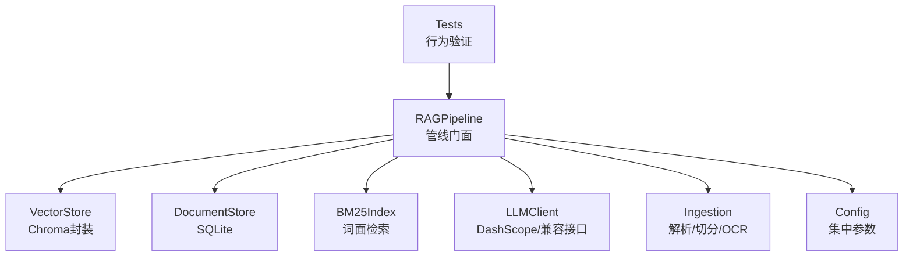
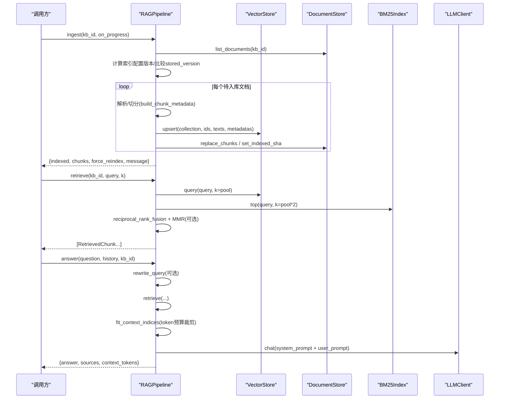
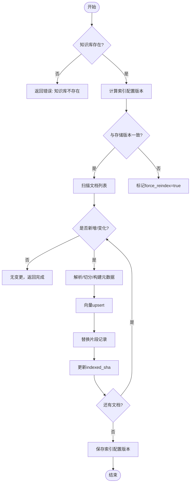
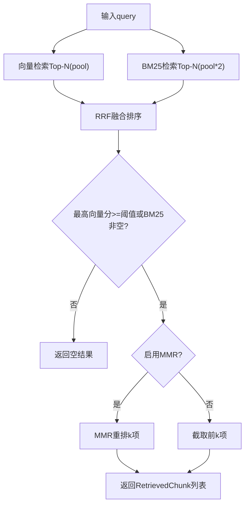
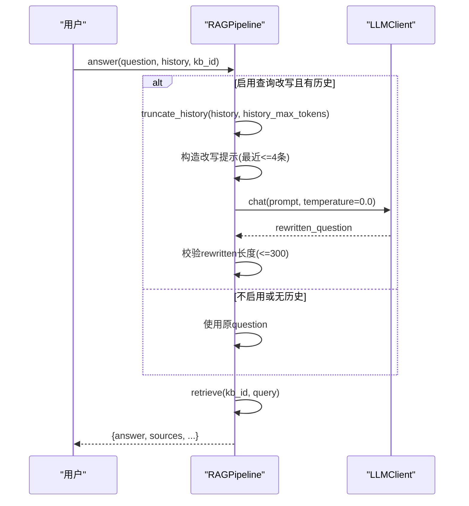
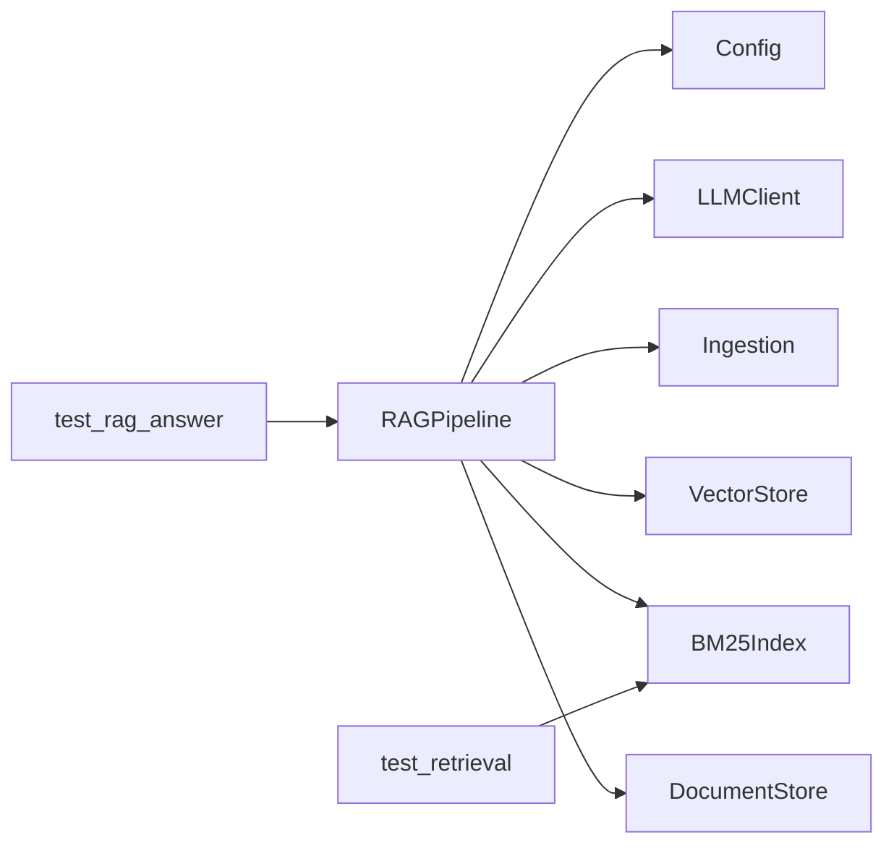

# RAG管线模块

<cite>
**本文引用的文件**
- [rag_pipeline.py](file://rag_pipeline.py)
- [vector_store.py](file://vector_store.py)
- [ingestion.py](file://ingestion.py)
- [store.py](file://store.py)
- [config.py](file://config.py)
- [utils/retrieval.py](file://utils/retrieval.py)
- [llm_client.py](file://llm_client.py)
- [tests/test_rag_answer.py](file://tests/test_rag_answer.py)
- [tests/test_retrieval.py](file://tests/test_retrieval.py)
</cite>

## 目录
1. [简介](#简介)
2. [项目结构](#项目结构)
3. [核心组件](#核心组件)
4. [架构总览](#架构总览)
5. [详细组件分析](#详细组件分析)
6. [依赖关系分析](#依赖关系分析)
7. [性能考量](#性能考量)
8. [故障排查指南](#故障排查指南)
9. [结论](#结论)
10. [附录：API调用示例与最佳实践](#附录api调用示例与最佳实践)

## 简介
本技术文档面向RAG管线模块，围绕RAGPipeline类展开，系统阐述知识库管理、文档入库、混合检索（向量语义+BM25关键词）、查询改写与带引用问答的完整实现。重点说明：
- 混合检索算法：RRF融合排序、MMR去重、相关性阈值控制
- 多轮对话上下文处理：历史消息截断策略与独立问题生成
- 增量入库机制：SHA-256判重、索引配置版本管理与自动全量重建
- 上下文构建策略：token预算控制、片段裁剪与引用标注
- API调用模式、错误处理与性能优化建议

## 项目结构
RAG管线由以下关键模块组成：
- 管线门面与业务编排：rag_pipeline.py
- 向量存储封装：vector_store.py
- 文档解析与切分：ingestion.py
- 元数据与片段持久化：store.py
- 统一配置：config.py
- 检索工具：utils/retrieval.py
- LLM客户端封装：llm_client.py
- 测试用例：tests/*

图表来源
- [rag_pipeline.py:196-792](file://rag_pipeline.py#L196-L792)
- [vector_store.py:38-148](file://vector_store.py#L38-L148)
- [store.py:123-470](file://store.py#L123-L470)
- [utils/retrieval.py:48-148](file://utils/retrieval.py#L48-L148)
- [ingestion.py:24-216](file://ingestion.py#L24-L216)
- [config.py:56-113](file://config.py#L56-L113)
- [llm_client.py:22-322](file://llm_client.py#L22-L322)

章节来源
- [rag_pipeline.py:1-792](file://rag_pipeline.py#L1-L792)
- [vector_store.py:1-255](file://vector_store.py#L1-L255)
- [ingestion.py:1-216](file://ingestion.py#L1-L216)
- [store.py:1-470](file://store.py#L1-L470)
- [config.py:1-113](file://config.py#L1-L113)
- [utils/retrieval.py:1-148](file://utils/retrieval.py#L1-L148)
- [llm_client.py:1-322](file://llm_client.py#L1-L322)

## 核心组件
- RAGPipeline：提供知识库管理、文档上传、增量入库、混合检索、查询改写与问答等能力；内部维护BM25索引缓存与片段缓存，支持按知识库隔离。
- VectorStore：基于Chroma的向量库封装，支持批量upsert、条件删除、相似度查询、取回原始向量用于MMR。
- DocumentStore：SQLite持久化知识库、文档、版本、片段与键值配置；WAL模式与锁保证并发安全。
- Ingestion：PDF/Word/Markdown/TXT解析，PDF文本质量评估与本地OCR回退；递归字符切分并保留页码/段落信息。
- Retrieval工具：中文分词、BM25索引、RRF融合、MMR重排。
- Config：集中式配置，支持环境变量覆盖，控制切分、检索、重排、上下文长度等。
- LLMClient：DashScope/OpenAI兼容接口封装，统一chat/embeddings/stream接口与安全错误转换。

章节来源
- [rag_pipeline.py:196-792](file://rag_pipeline.py#L196-L792)
- [vector_store.py:38-148](file://vector_store.py#L38-L148)
- [store.py:123-470](file://store.py#L123-L470)
- [ingestion.py:24-216](file://ingestion.py#L24-L216)
- [utils/retrieval.py:34-148](file://utils/retrieval.py#L34-L148)
- [config.py:56-113](file://config.py#L56-L113)
- [llm_client.py:22-322](file://llm_client.py#L22-L322)

## 架构总览
RAGPipeline作为门面协调各子系统完成“入库—检索—问答”闭环：
- 入库：upload_document写入物理文件与版本记录；ingest执行解析、切分、向量化与BM25重建，更新已索引哈希与片段计数。
- 检索：retrieve先向量Top-N，再BM25 Top-N，使用RRF融合排序，可选MMR去重，结合相关性阈值过滤低相关结果。
- 问答：answer组装历史、上下文与提示词，调用LLM生成带引用回答；若无可检索内容则降级为通用聊天。

图表来源
- [rag_pipeline.py:306-435](file://rag_pipeline.py#L306-L435)
- [rag_pipeline.py:439-523](file://rag_pipeline.py#L439-L523)
- [rag_pipeline.py:566-696](file://rag_pipeline.py#L566-L696)
- [vector_store.py:61-126](file://vector_store.py#L61-L126)
- [utils/retrieval.py:48-148](file://utils/retrieval.py#L48-L148)
- [ingestion.py:178-216](file://ingestion.py#L178-L216)

## 详细组件分析

### RAGPipeline：知识库管理、入库、检索与问答
- 知识库管理：创建/列出/获取/删除知识库；删除时清理向量集合、物理文件目录与缓存。
- 文档管理：upload_document支持同名文件自动升版本并保留旧版本；delete_document软删除主记录但保留文件与版本历史。
- 增量入库：ingest通过SHA-256判重与索引配置版本对比决定是否全量重建；逐文档解析、切分、向量化，原子性更新向量与片段，失败不影响其他文档。
- 混合检索：retrieve执行向量与BM25双路检索，RRF融合后按阈值过滤，可选MMR提升多样性；支持按文件名/人物短名限定doc_id缩小范围。
- 查询改写：rewrite_query从历史中截取最近若干条（按token预算），构造独立问题；失败或异常返回原问题。
- 问答：answer组装历史、上下文与提示词，调用LLM生成答案；若无相关内容则返回友好提示；同时统计context_tokens。

图表来源
- [rag_pipeline.py:306-435](file://rag_pipeline.py#L306-L435)
- [store.py:337-345](file://store.py#L337-L345)

章节来源
- [rag_pipeline.py:196-792](file://rag_pipeline.py#L196-L792)
- [store.py:123-470](file://store.py#L123-L470)

### 混合检索算法：RRF融合、MMR去重、相关性阈值
- 向量检索：通过VectorStore.query获取Top-N，分数为余弦相似度（1 - distance）。
- BM25检索：BM25Index.top返回[(chunk_id, score)]，对极小语料库有兜底重叠数排序。
- RRF融合：reciprocal_rank_fusion将两份排名合并为融合得分，无需分数可比性。
- MMR重排：mmr_rerank在相关性与多样性间平衡，lambda越大越看重相关性。
- 相关性阈值：当向量最高分低于阈值且BM25为空时直接返回空结果；纯关键词场景下即使向量低分也允许BM25强命中放行。

图表来源
- [rag_pipeline.py:439-523](file://rag_pipeline.py#L439-L523)
- [utils/retrieval.py:48-148](file://utils/retrieval.py#L48-L148)

章节来源
- [rag_pipeline.py:439-523](file://rag_pipeline.py#L439-L523)
- [utils/retrieval.py:34-148](file://utils/retrieval.py#L34-L148)
- [tests/test_retrieval.py:21-81](file://tests/test_retrieval.py#L21-L81)

### 查询改写：多轮对话上下文处理
- 历史截断：truncate_history按token预算从后往前保留历史消息，至少保留最后一条，避免长对话稀释注意力与浪费token。
- 独立问题生成：rewrite_query仅使用最近若干条历史（history_max_tokens限制后再取最近4条），构造提示让模型输出独立问题；异常或过长时退回原问题。
- 应用时机：answer中若开启query_rewrite_enabled且有历史，则先改写再检索。

图表来源
- [rag_pipeline.py:159-178](file://rag_pipeline.py#L159-L178)
- [rag_pipeline.py:566-588](file://rag_pipeline.py#L566-L588)
- [rag_pipeline.py:590-666](file://rag_pipeline.py#L590-L666)

章节来源
- [rag_pipeline.py:159-178](file://rag_pipeline.py#L159-L178)
- [rag_pipeline.py:566-588](file://rag_pipeline.py#L566-L588)
- [tests/test_rag_answer.py:36-49](file://tests/test_rag_answer.py#L36-L49)

### 增量入库机制：SHA-256判重、索引配置版本、自动全量重建
- SHA-256判重：upload_document与ingest中对文件计算SHA-256，与stored indexed_sha对比决定是否重新入库。
- 索引配置版本：_current_index_config聚合chunk_size、chunk_overlap、embedding_model、collection_space、parser_version等，生成签名；与存储版本不一致时触发force_reindex。
- 自动全量重建：当检测到配置变化或文件缺失时，记录missing并跳过；完成后保存新配置版本。
- 版本管理：同名文件重传自动升版本，旧版本物理文件保留；删除文档软删除主记录但保留历史。

章节来源
- [rag_pipeline.py:260-288](file://rag_pipeline.py#L260-L288)
- [rag_pipeline.py:306-435](file://rag_pipeline.py#L306-L435)
- [rag_pipeline.py:739-752](file://rag_pipeline.py#L739-L752)
- [store.py:214-274](file://store.py#L214-L274)
- [store.py:322-345](file://store.py#L322-L345)

### 上下文构建策略：token预算、片段裁剪、引用标注
- token预算控制：fit_context_indices按块顺序累计estimate_tokens，超过rag_context_max_tokens即停止；至少保留第一块。
- 片段裁剪：answer中先构建包含来源标注的上下文块，再根据预算选择子集，确保最终提示词不超过预算。
- 引用标注：citation根据metadata中的source与page/paragraph生成“文件名, 第X页/段落Y”格式；sources中包含citation、content、metadata及两种分数。

章节来源
- [rag_pipeline.py:181-193](file://rag_pipeline.py#L181-L193)
- [rag_pipeline.py:614-666](file://rag_pipeline.py#L614-L666)
- [rag_pipeline.py:775-782](file://rag_pipeline.py#L775-L782)
- [ingestion.py:193-216](file://ingestion.py#L193-L216)

### 向量存储与检索：VectorStore
- 批量upsert：按batch_size分批调用embed_documents并写入Chroma，id相同覆盖，天然支持增量更新。
- 条件删除：支持where与ids删除，便于按doc_id清理。
- 相似度查询：返回VectorHit列表，score=1-distance（余弦相似度）。
- 取回向量：get_embeddings用于MMR重排。
- 重置连接：reset重建客户端以刷新内存索引。

章节来源
- [vector_store.py:38-148](file://vector_store.py#L38-L148)

### 文档解析与切分：Ingestion
- 支持后缀：.pdf/.md/.txt/.docx。
- PDF处理：优先PyMuPDF提取文本层，按页判断可读性；低于阈值切换本地OCR（RapidOCR）；无内容时抛出异常。
- 切分：RecursiveCharacterTextSplitter按段落/句子边界切分，保留page/paragraph元数据。
- 元数据：build_chunk_metadata生成source、page、paragraph、doc_id、kb_id、category、tags等。

章节来源
- [ingestion.py:24-216](file://ingestion.py#L24-L216)

### 配置与LLM客户端：Config与LLMClient
- AppConfig：集中读取环境变量，默认值合理，支持路径解析与数值钳制。
- DashScopeClient：统一chat/chat_raw/stream_chat接口，支持联网搜索；safe_error封装异常信息。

章节来源
- [config.py:56-113](file://config.py#L56-L113)
- [llm_client.py:22-322](file://llm_client.py#L22-L322)

## 依赖关系分析
- RAGPipeline依赖：
  - store.DocumentStore：知识库/文档/片段/配置持久化
  - vector_store.VectorStore：向量检索与嵌入
  - utils.retrieval.BM25Index/MMR/RRF：词面检索与重排
  - ingestion.DocumentParser/split_documents：解析与切分
  - llm_client.DashScopeClient：LLM调用
  - config.AppConfig：运行参数
- 测试依赖：
  - tests.helpers：FakeLLMClient、make_config、upload_text、ingest_all
  - tests.test_rag_answer：端到端问答、阈值、改写、多库隔离、来源提示
  - tests.test_retrieval：分词、BM25、RRF、MMR、阈值兜底

图表来源
- [rag_pipeline.py:196-792](file://rag_pipeline.py#L196-L792)
- [tests/test_rag_answer.py:1-113](file://tests/test_rag_answer.py#L1-L113)
- [tests/test_retrieval.py:1-81](file://tests/test_retrieval.py#L1-L81)

章节来源
- [rag_pipeline.py:196-792](file://rag_pipeline.py#L196-L792)
- [tests/test_rag_answer.py:1-113](file://tests/test_rag_answer.py#L1-L113)
- [tests/test_retrieval.py:1-81](file://tests/test_retrieval.py#L1-L81)

## 性能考量
- 向量化批大小：embedding_batch_size默认16，避免超出Embedding接口上限；可按环境调整。
- 检索池大小：fusion_pool控制参与融合的候选数量，top_k为最终返回数；增大pool可提升召回但增加计算。
- MMR重排：仅在启用且候选>1时进行；若候选向量缺失则直接截取，避免额外开销。
- 上下文裁剪：fit_context_indices严格控制rag_context_max_tokens，减少提示词长度与延迟。
- 历史截断：truncate_history限制history_max_tokens，避免长对话影响效果与成本。
- 数据库并发：SQLite WAL模式与busy_timeout提升并发读写稳定性。
- 向量库连接：后台入库完成后调用refresh重置VectorStore客户端，避免内存索引过期。

[本节为通用性能指导，不直接分析具体代码行]

## 故障排查指南
- 未配置密钥：DashScopeClient._api_key会抛出明确错误；检查DASHSCOPE_API_KEY与环境变量。
- 向量服务不可用：answer/catch捕获异常并返回友好提示；可通过safe_error定位原因。
- 文件类型不支持：upload_document对不支持后缀抛出ValueError；确认SUPPORTED_SUFFIXES。
- PDF无法识别：ingestion在文本不可读且OCR失败时抛出RuntimeError；安装pymupdf与rapidocr。
- 检索结果为空：可能因relevance_threshold过高或知识库无内容；降低阈值或补充资料。
- 索引不一致：若向量与片段不一致，调用refresh重建客户端并使BM25/片段缓存失效。

章节来源
- [llm_client.py:59-66](file://llm_client.py#L59-L66)
- [rag_pipeline.py:665-666](file://rag_pipeline.py#L665-L666)
- [rag_pipeline.py:270-272](file://rag_pipeline.py#L270-L272)
- [ingestion.py:124-150](file://ingestion.py#L124-L150)
- [rag_pipeline.py:720-725](file://rag_pipeline.py#L720-L725)

## 结论
RAGPipeline以模块化设计实现了完整的RAG流程：稳定的知识库与版本管理、高效的增量入库、鲁棒的混合检索（RRF+MMR+阈值）、可控的上下文构建与引用标注、以及健壮的问答与错误处理。通过集中配置与可插拔LLM客户端，系统具备良好的可移植性与可扩展性。测试覆盖了关键路径与边界情况，保障功能正确性。

[本节为总结性内容，不直接分析具体代码行]

## 附录：API调用示例与最佳实践
以下为典型API调用模式（以测试与管线方法为依据），不包含具体代码内容：
- 创建知识库与上传文档
  - 调用create_kb创建知识库
  - 调用upload_document上传文件（同名自动升版本）
  - 参考路径：[rag_pipeline.py:223-288](file://rag_pipeline.py#L223-L288)
- 增量入库
  - 调用ingest执行解析、切分、向量化与BM25重建
  - 监听on_progress回调显示进度
  - 参考路径：[rag_pipeline.py:306-435](file://rag_pipeline.py#L306-L435)
- 混合检索
  - 调用retrieve获取RetrievedChunk列表，包含三种分数
  - 可设置k、doc_id限定范围
  - 参考路径：[rag_pipeline.py:439-523](file://rag_pipeline.py#L439-L523)
- 查询改写
  - 调用rewrite_query将追问题改写为独立问题
  - 参考路径：[rag_pipeline.py:566-588](file://rag_pipeline.py#L566-L588)
- 问答
  - 调用answer生成带引用回答；若无相关内容则返回友好提示
  - 参考路径：[rag_pipeline.py:590-666](file://rag_pipeline.py#L590-L666)
- 通用聊天
  - 调用chat进行无知识库的普通对话
  - 参考路径：[rag_pipeline.py:668-696](file://rag_pipeline.py#L668-L696)

错误处理与性能优化建议：
- 统一异常包装：使用safe_error隐藏堆栈，保留可排障原因
- 控制上下文长度：合理设置rag_context_max_tokens与history_max_tokens
- 调参建议：根据语料规模调整top_k、fusion_pool、relevance_threshold、mmr_lambda
- 批量向量化：适当增大embedding_batch_size但不超过接口限制
- 定期重建：索引配置变更后自动全量重建，避免向量与配置不匹配

章节来源
- [rag_pipeline.py:223-696](file://rag_pipeline.py#L223-L696)
- [tests/test_rag_answer.py:15-113](file://tests/test_rag_answer.py#L15-L113)
- [tests/test_retrieval.py:21-81](file://tests/test_retrieval.py#L21-L81)
- [llm_client.py:297-299](file://llm_client.py#L297-L299)
- [config.py:90-113](file://config.py#L90-L113)