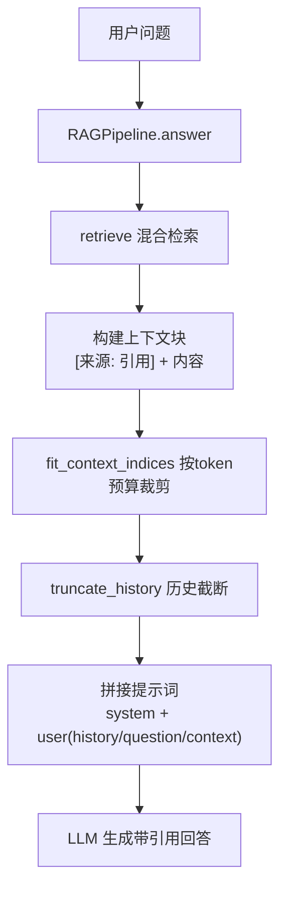
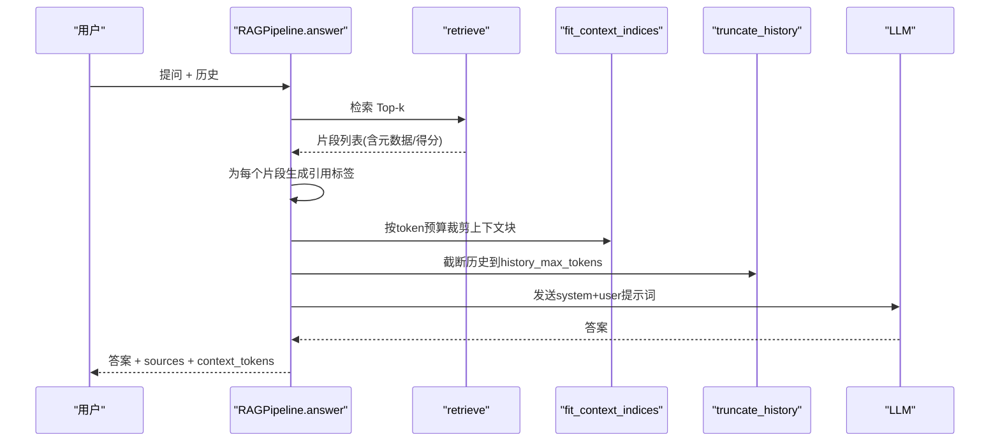
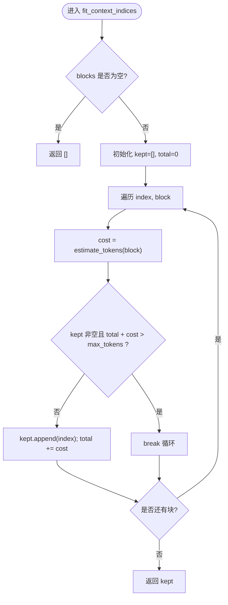
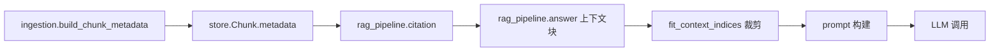

# 上下文构建

<cite>
**本文引用的文件**
- [rag_pipeline.py](file://rag_pipeline.py)
- [ingestion.py](file://ingestion.py)
- [config.py](file://config.py)
- [utils/logger.py](file://utils/logger.py)
- [tests/test_context.py](file://tests/test_context.py)
</cite>

## 目录
1. [简介](#简介)
2. [项目结构](#项目结构)
3. [核心组件](#核心组件)
4. [架构总览](#架构总览)
5. [详细组件分析](#详细组件分析)
6. [依赖关系分析](#依赖关系分析)
7. [性能考量](#性能考量)
8. [故障排查指南](#故障排查指南)
9. [结论](#结论)
10. [附录：代码示例与评估建议](#附录代码示例与评估建议)

## 简介
本技术文档聚焦 RAG 管线模块的“上下文构建”能力，围绕 answer 方法展开，系统说明以下关键点：
- 检索片段裁剪算法与 token 预算控制
- fit_context_indices 的块选择逻辑（按预算保留、块不可拆分、至少保留第一块）
- 引用标注系统与来源文件格式、页码显示规则、段落编号处理、元数据提取方法
- 上下文组装流程：检索结果 → 片段裁剪 → 引用标注 → 提示词构建
- 历史消息处理：最近 10 轮对话保留、消息格式转换、上下文长度控制
- 提供具体代码路径与可复现实验步骤，用于估算 token、评估片段裁剪效果并给出优化建议

## 项目结构
RAG 上下文构建主要涉及以下模块：
- rag_pipeline.py：RAGPipeline 类实现检索、问答、引用生成、上下文裁剪与历史截断
- ingestion.py：文档解析与切分，构建片段元数据（source/page/paragraph）
- config.py：集中配置项（如 top_k、融合池大小、历史最大 token、RAG 上下文最大 token 等）
- utils/logger.py：轻量 token 估算函数 estimate_tokens
- tests/test_context.py：针对历史截断与上下文裁剪的单元测试

图表来源
- [rag_pipeline.py:590-666](file://rag_pipeline.py#L590-L666)
- [rag_pipeline.py:439-523](file://rag_pipeline.py#L439-L523)
- [rag_pipeline.py:159-193](file://rag_pipeline.py#L159-L193)
- [utils/logger.py:48-62](file://utils/logger.py#L48-L62)

章节来源
- [rag_pipeline.py:1-792](file://rag_pipeline.py#L1-L792)
- [ingestion.py:1-216](file://ingestion.py#L1-L216)
- [config.py:56-113](file://config.py#L56-L113)
- [utils/logger.py:48-62](file://utils/logger.py#L48-L62)
- [tests/test_context.py:1-33](file://tests/test_context.py#L1-L33)

## 核心组件
- RAGPipeline.answer：入口方法，负责检索、上下文构建、历史截断、提示词组装与 LLM 调用
- retrieve：混合检索（向量 + BM25），RRF 融合，可选 MMR 重排，返回 RetrievedChunk 列表
- fit_context_indices：按 token 预算从前往后保留完整块，保证不拆分块且至少保留第一块
- truncate_history：从后往前保留最近历史消息，受 history_max_tokens 限制
- citation：根据片段元数据生成“来源, 位置”字符串，用于提示词中的引用标注
- build_chunk_metadata：在入库阶段为每个片段生成 source/page/paragraph 等元数据
- estimate_tokens：中英文混合文本的轻量 token 估算，用于预算控制

章节来源
- [rag_pipeline.py:590-666](file://rag_pipeline.py#L590-L666)
- [rag_pipeline.py:439-523](file://rag_pipeline.py#L439-L523)
- [rag_pipeline.py:159-193](file://rag_pipeline.py#L159-L193)
- [rag_pipeline.py:775-782](file://rag_pipeline.py#L775-L782)
- [ingestion.py:193-215](file://ingestion.py#L193-L215)
- [utils/logger.py:48-62](file://utils/logger.py#L48-L62)

## 架构总览
下图展示上下文构建的关键流程与数据流。answer 方法串联检索、引用标注、上下文裁剪与历史截断，最终生成提示词并调用 LLM。

图表来源
- [rag_pipeline.py:590-666](file://rag_pipeline.py#L590-L666)
- [rag_pipeline.py:439-523](file://rag_pipeline.py#L439-L523)
- [rag_pipeline.py:159-193](file://rag_pipeline.py#L159-L193)
- [utils/logger.py:48-62](file://utils/logger.py#L48-L62)

## 详细组件分析

### answer 方法的上下文构建策略
- 检索阶段：调用 retrieve 获取混合检索结果（向量 + BM25，RRF 融合，可选 MMR 去重），得到 RetrievedChunk 列表
- 引用标注：对每个片段调用 citation，生成“来源, 位置”字符串，并将 “[来源: 引用]\n内容”作为上下文块
- 上下文裁剪：使用 fit_context_indices 按 rag_context_max_tokens 预算从前往后保留完整块，确保不拆分块且至少保留第一块
- 历史截断：使用 truncate_history 从后往前保留最近历史消息，受 history_max_tokens 限制
- 提示词构建：将 system prompt、历史文本、用户问题与上下文块拼接成 user prompt，调用 LLM 生成答案
- Token 统计：使用 estimate_tokens 估算 system + history + context + question 的总 token 数，便于监控与调优

章节来源
- [rag_pipeline.py:590-666](file://rag_pipeline.py#L590-L666)
- [rag_pipeline.py:439-523](file://rag_pipeline.py#L439-L523)
- [rag_pipeline.py:159-193](file://rag_pipeline.py#L159-L193)
- [utils/logger.py:48-62](file://utils/logger.py#L48-L62)

### fit_context_indices 的块选择逻辑
- 输入：上下文块列表 blocks 与最大 token 预算 max_tokens
- 策略：
  - 顺序遍历 blocks，累计已选块的 token 成本
  - 若加入下一个块会超出预算，则停止添加（保持块不可拆分原则）
  - 始终至少保留第一个块（即使其超过预算也保留，避免空上下文）
- 输出：被保留的块下标列表 kept_indices
- 复杂度：O(n)，其中 n 为块数量；空间 O(k)，k 为保留块数

图表来源
- [rag_pipeline.py:181-193](file://rag_pipeline.py#L181-L193)
- [utils/logger.py:48-62](file://utils/logger.py#L48-L62)

章节来源
- [rag_pipeline.py:181-193](file://rag_pipeline.py#L181-L193)
- [tests/test_context.py:26-33](file://tests/test_context.py#L26-L33)

### 检索结果到上下文块的构建
- 检索结果：RetrievedChunk 包含 chunk_id、doc_id、content、metadata、vector_score、bm25_score、rrf_score
- 引用标注：citation(metadata) 生成“来源, 位置”，例如“文件名, 第X页”或“文件名, 段落Y”
- 上下文块：将 “[来源: 引用]\n内容” 追加到 context_blocks
- 关联 sources：同时记录 citation、content、metadata、分数，便于后续分析与展示

章节来源
- [rag_pipeline.py:134-145](file://rag_pipeline.py#L134-L145)
- [rag_pipeline.py:614-627](file://rag_pipeline.py#L614-L627)
- [rag_pipeline.py:775-782](file://rag_pipeline.py#L775-L782)

### 历史消息处理
- 截断策略：truncate_history 从后往前保留最近消息，直到达到 history_max_tokens 预算
- 最少保留：至少保留最后一条消息，避免无历史
- 消息格式：统一为 {role, content}，并在提示词中拼接为 “role: content” 形式
- 作用：减少长对话导致的注意力稀释与计费开销，提升模型对关键信息的关注

章节来源
- [rag_pipeline.py:159-178](file://rag_pipeline.py#L159-L178)
- [rag_pipeline.py:628-638](file://rag_pipeline.py#L628-L638)
- [tests/test_context.py:9-23](file://tests/test_context.py#L9-L23)

### 提示词构建与 LLM 调用
- System Prompt：要求严格基于检索资料、逐条标注引用、禁止编造事实
- User Prompt：包含最近历史、用户问题与上下文块
- 调用参数：关闭深度思考以降低首字延迟
- 输出：答案、sources、query、kb_id、context_tokens

章节来源
- [rag_pipeline.py:42-64](file://rag_pipeline.py#L42-L64)
- [rag_pipeline.py:639-664](file://rag_pipeline.py#L639-L664)

### 元数据与引用生成机制
- 元数据来源：ingestion.build_chunk_metadata 为每个片段生成 source、page、paragraph 等字段
- 页码规则：内部 page 为 0 起编号，对外展示为 1 起（人类阅读习惯）
- 段落编号：paragraph 使用 chunk_index，用于无页码时的定位
- 引用格式：citation 根据 metadata 生成“来源, 位置”，优先显示页码，否则显示段落号

章节来源
- [ingestion.py:193-215](file://ingestion.py#L193-L215)
- [rag_pipeline.py:775-782](file://rag_pipeline.py#L775-L782)

## 依赖关系分析
- RAGPipeline 依赖：
  - retrieval：向量库与 BM25Index，RRF 融合与 MMR 重排
  - store：DocumentStore 提供片段迭代与元数据访问
  - llm_client：LLMClient 协议，实际由 DashScopeClient 实现
  - utils.logger：estimate_tokens 用于预算控制
  - config.AppConfig：集中配置项
- 数据流：
  - ingest 阶段：文档解析 → 切分 → 元数据构建 → 向量化 → 存储
  - answer 阶段：检索 → 引用标注 → 上下文裁剪 → 历史截断 → 提示词构建 → LLM 调用

图表来源
- [ingestion.py:193-215](file://ingestion.py#L193-L215)
- [rag_pipeline.py:614-666](file://rag_pipeline.py#L614-L666)
- [rag_pipeline.py:775-782](file://rag_pipeline.py#L775-L782)

章节来源
- [rag_pipeline.py:196-792](file://rag_pipeline.py#L196-L792)
- [ingestion.py:1-216](file://ingestion.py#L1-L216)
- [config.py:56-113](file://config.py#L56-L113)
- [utils/logger.py:48-62](file://utils/logger.py#L48-L62)

## 性能考量
- 混合检索效率：向量检索与 BM25 并行取回，RRF 融合降低单一索引偏差；MMR 可选以提升多样性
- 上下文裁剪：fit_context_indices 保证块不可拆分，避免语义割裂；预算控制防止提示词过长
- 历史截断：truncate_history 从后往前保留最近消息，减少注意力稀释与计费
- Token 估算：estimate_tokens 采用中文约 1 token/字、英文约 4 字符/token 的近似规则，适合快速预算控制
- 配置调优：通过 AppConfig 调整 top_k、fusion_pool、relevance_threshold、mmr_lambda、history_max_tokens、rag_context_max_tokens 等参数

章节来源
- [rag_pipeline.py:439-523](file://rag_pipeline.py#L439-L523)
- [rag_pipeline.py:159-193](file://rag_pipeline.py#L159-L193)
- [config.py:56-113](file://config.py#L56-L113)
- [utils/logger.py:48-62](file://utils/logger.py#L48-L62)

## 故障排查指南
- 无相关内容：retrieve 返回空列表时，answer 直接返回提示“知识库中没有检索到足够相关的内容”，需检查查询改写、相关性阈值与融合池大小
- 上下文为空：fit_context_indices 至少保留第一块，但若预算极低仍可能仅保留一个块；可通过增大 rag_context_max_tokens 改善
- 历史过长：truncate_history 会截断历史，若发现模型忽略早期信息，可适当提高 history_max_tokens 或精简历史内容
- 页码/段落缺失：若源文档无 page，引用将显示段落号；确保 ingestion 正确构建元数据
- 异常兜底：answer 与 chat 均捕获异常并返回友好错误信息，便于前端展示

章节来源
- [rag_pipeline.py:605-612](file://rag_pipeline.py#L605-L612)
- [rag_pipeline.py:665-666](file://rag_pipeline.py#L665-L666)
- [rag_pipeline.py:181-193](file://rag_pipeline.py#L181-L193)
- [ingestion.py:193-215](file://ingestion.py#L193-L215)

## 结论
RAG 管线的上下文构建以“检索 → 引用标注 → 预算裁剪 → 历史截断 → 提示词构建”为主线，兼顾准确性与效率。fit_context_indices 保证块不可拆分且至少保留第一块，结合 estimate_tokens 实现稳健的 token 预算控制；citation 与 build_chunk_metadata 提供清晰的来源定位与页码/段落显示。通过合理配置与测试验证，可在多轮对话与长上下文中稳定输出带引用的高质量答案。

## 附录：代码示例与评估建议

### 上下文构建步骤示例（以代码路径代替具体代码）
- 检索与引用标注
  - 参考路径：[rag_pipeline.py:614-627](file://rag_pipeline.py#L614-L627)
  - 说明：遍历检索结果，生成引用标签并构造上下文块
- 上下文裁剪
  - 参考路径：[rag_pipeline.py:628-635](file://rag_pipeline.py#L628-L635)
  - 说明：调用 fit_context_indices 按 rag_context_max_tokens 裁剪上下文块
- 历史截断
  - 参考路径：[rag_pipeline.py:628-638](file://rag_pipeline.py#L628-L638)
  - 说明：调用 truncate_history 保留最近历史消息
- 提示词构建与 LLM 调用
  - 参考路径：[rag_pipeline.py:639-664](file://rag_pipeline.py#L639-L664)
  - 说明：拼接 system 与 user 提示词，调用 LLM 生成答案并统计 context_tokens

### Token 估算与预算控制
- 估算函数
  - 参考路径：[utils/logger.py:48-62](file://utils/logger.py#L48-L62)
  - 说明：中英文混合文本的轻量 token 估算，用于历史与上下文预算
- 预算参数
  - 参考路径：[config.py:108-109](file://config.py#L108-L109)
  - 说明：history_max_tokens 与 rag_context_max_tokens 控制历史与上下文长度

### 片段裁剪效果评估
- 单元测试
  - 参考路径：[tests/test_context.py:26-33](file://tests/test_context.py#L26-L33)
  - 说明：验证 fit_context_indices 的块不可拆分与至少保留第一块策略
- 评估建议
  - 调整 rag_context_max_tokens 观察保留块数量与答案质量变化
  - 对比不同 top_k 与 fusion_pool 下的上下文覆盖度
  - 分析 sources 中的 vector_score、bm25_score、rrf_score 分布，识别低相关片段

### 优化建议
- 若答案缺乏细节：适当增大 rag_context_max_tokens 或 top_k，确保更多高相关片段进入上下文
- 若响应延迟较高：减小 fusion_pool 或关闭 MMR，降低检索与重排开销
- 若历史干扰严重：降低 history_max_tokens 或启用 query_rewrite_enabled 进行问题改写
- 若引用不准确：检查 ingestion 的 page 与 paragraph 元数据是否正确构建，必要时调整切分参数

章节来源
- [rag_pipeline.py:614-664](file://rag_pipeline.py#L614-L664)
- [utils/logger.py:48-62](file://utils/logger.py#L48-L62)
- [config.py:108-109](file://config.py#L108-L109)
- [tests/test_context.py:26-33](file://tests/test_context.py#L26-L33)