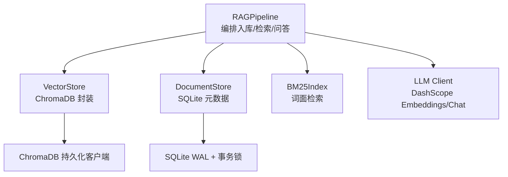
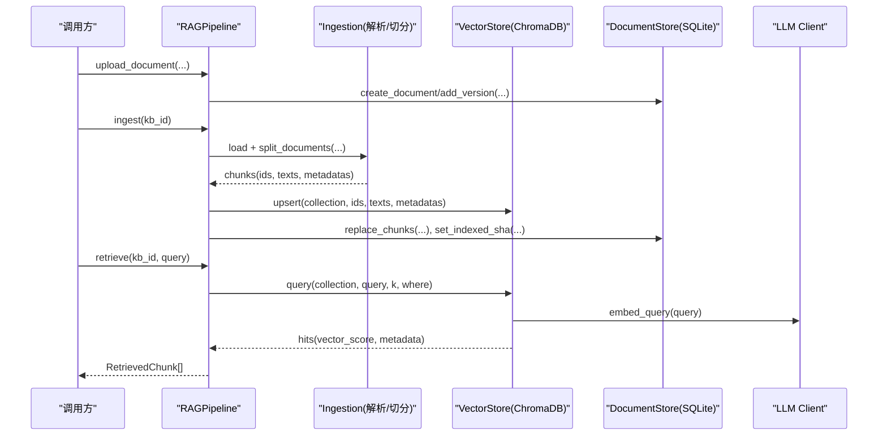
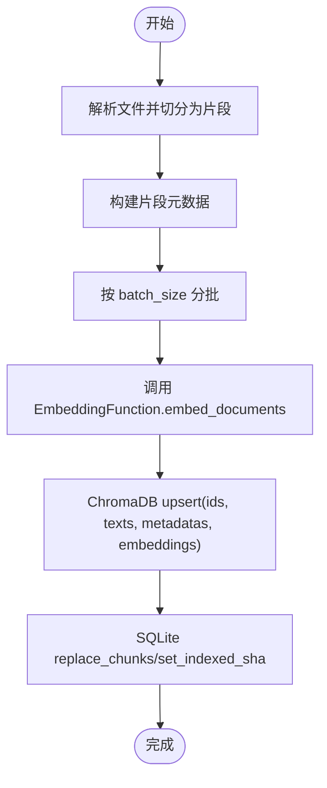
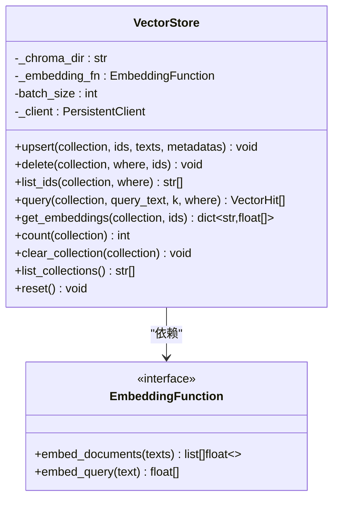
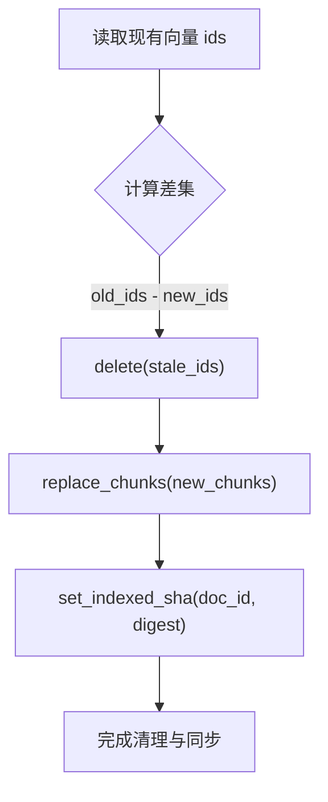
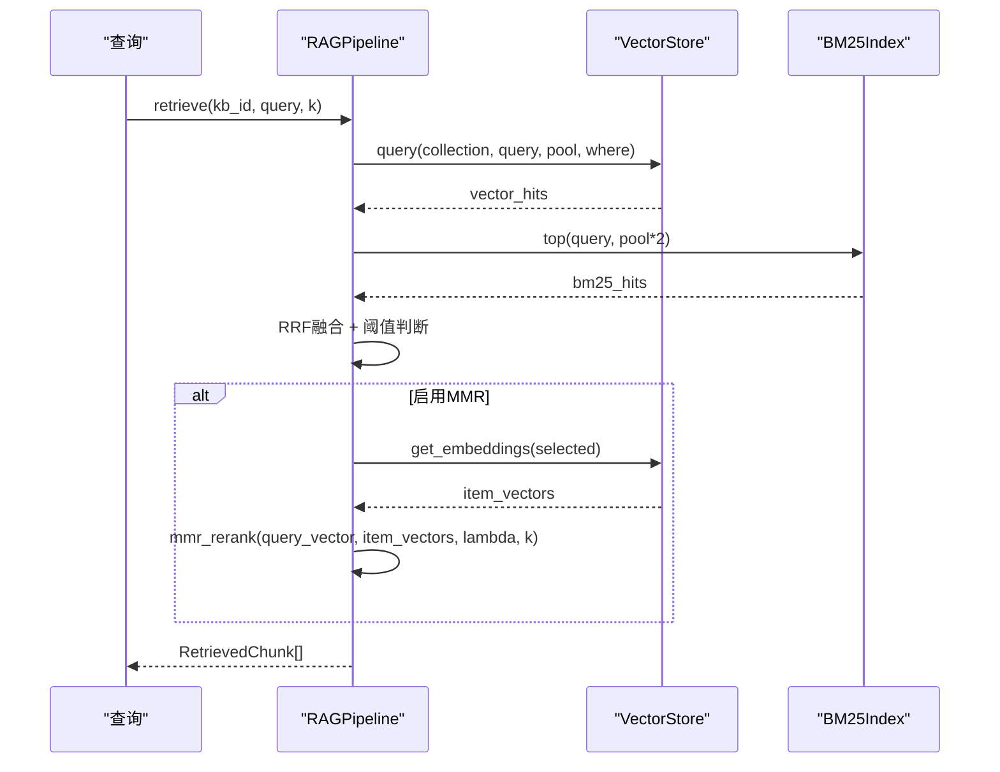
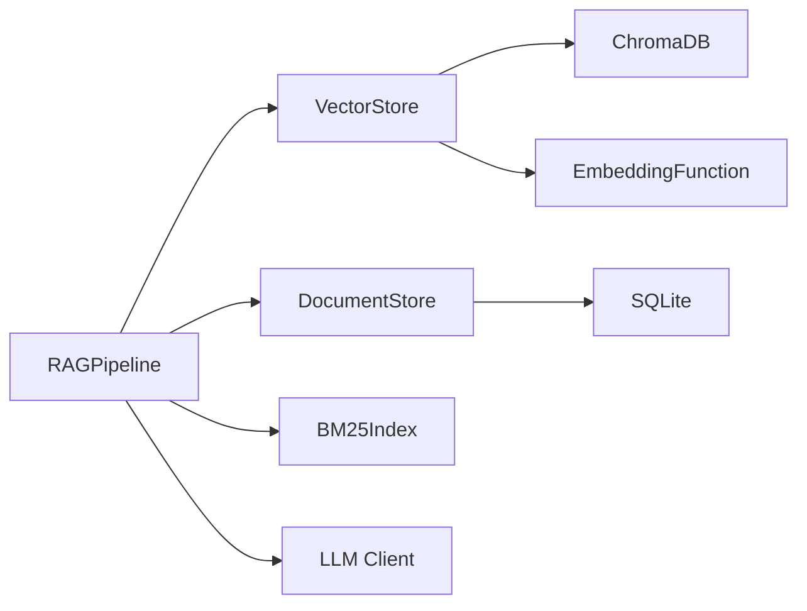

# 向量存储集成

<cite>
**本文引用的文件**
- [vector_store.py](file://vector_store.py)
- [rag_pipeline.py](file://rag_pipeline.py)
- [store.py](file://store.py)
- [ingestion.py](file://ingestion.py)
- [config.py](file://config.py)
- [llm_client.py](file://llm_client.py)
</cite>

## 目录
1. [简介](#简介)
2. [项目结构](#项目结构)
3. [核心组件](#核心组件)
4. [架构总览](#架构总览)
5. [详细组件分析](#详细组件分析)
6. [依赖关系分析](#依赖关系分析)
7. [性能调优](#性能调优)
8. [故障排查指南](#故障排查指南)
9. [结论](#结论)
10. [附录：代码示例路径](#附录代码示例路径)

## 简介
本技术文档聚焦 RAG 管线中的“向量存储集成”，围绕以下目标展开：
- 向量化处理流程：文本→Embedding 转换、批量处理优化、内存管理策略。
- ChromaDB 集成：collection 管理、向量插入/更新（upsert）、元数据存储、查询过滤。
- upsert 操作：新旧向量替换策略、原子性保证、回滚机制。
- 向量删除与清理：stale_ids 识别、垃圾回收、存储空间优化。
- 性能调优：batch_size 设置、并发控制、缓存策略。
- 提供具体代码示例路径，展示向量库操作、批量处理、错误恢复的实现模式，覆盖大规模向量数据的存储与管理。

## 项目结构
本项目将“向量存储”作为独立模块封装，上层通过 RAGPipeline 统一编排入库、检索与问答；SQLite 用于知识库与片段元数据持久化；ChromaDB 负责向量索引与相似度检索。

图表来源
- [rag_pipeline.py:196-220](file://rag_pipeline.py#L196-L220)
- [vector_store.py:38-59](file://vector_store.py#L38-L59)
- [store.py:123-148](file://store.py#L123-L148)
- [llm_client.py:22-73](file://llm_client.py#L22-L73)

章节来源
- [rag_pipeline.py:196-220](file://rag_pipeline.py#L196-L220)
- [vector_store.py:38-59](file://vector_store.py#L38-L59)
- [store.py:123-148](file://store.py#L123-L148)
- [llm_client.py:22-73](file://llm_client.py#L22-L73)

## 核心组件
- VectorStore：对 ChromaDB 的轻量封装，提供 collection 管理、批量 upsert、条件删除、相似度查询、向量获取等能力。
- RAGPipeline：面向业务的上层门面，协调解析、切分、向量化、混合检索与问答。
- DocumentStore：基于 SQLite 的知识库、文档版本、片段元数据管理，支持 WAL 与并发安全。
- LLM Client：DashScope Embeddings/Chat 的统一封装，提供嵌入与对话能力。
- Config：集中配置项，包括 batch_size、top_k、融合池大小、MMR 参数等。

章节来源
- [vector_store.py:22-148](file://vector_store.py#L22-L148)
- [rag_pipeline.py:196-220](file://rag_pipeline.py#L196-L220)
- [store.py:123-148](file://store.py#L123-L148)
- [llm_client.py:22-73](file://llm_client.py#L22-L73)
- [config.py:56-113](file://config.py#L56-L113)

## 架构总览
下图展示了从上传到入库再到检索的关键调用链，体现向量存储在各环节中的作用。

图表来源
- [rag_pipeline.py:260-319](file://rag_pipeline.py#L260-L319)
- [rag_pipeline.py:306-435](file://rag_pipeline.py#L306-L435)
- [rag_pipeline.py:439-523](file://rag_pipeline.py#L439-L523)
- [vector_store.py:61-126](file://vector_store.py#L61-L126)
- [store.py:386-411](file://store.py#L386-L411)
- [llm_client.py:68-73](file://llm_client.py#L68-L73)

## 详细组件分析

### 向量化处理流程：文本→Embedding→存储
- 文本解析与切分：按后缀加载 PDF/DOCX/MD/TXT，使用递归字符切分器生成片段，附带 source/page/paragraph 等元数据。
- 批量向量化：VectorStore.upsert 按 batch_size 分批调用 EmbeddingFunction.embed_documents，避免单次请求过大导致失败。
- 写入向量库：ChromaDB 以 cosine 空间存储，id 相同则覆盖，天然支持增量更新。
- 元数据一致性：SQLite 中 replace_chunks 先删后插，确保片段与向量一一对应。

图表来源
- [ingestion.py:24-39](file://ingestion.py#L24-L39)
- [ingestion.py:178-190](file://ingestion.py#L178-L190)
- [ingestion.py:193-216](file://ingestion.py#L193-L216)
- [vector_store.py:61-78](file://vector_store.py#L61-L78)
- [store.py:386-411](file://store.py#L386-L411)

章节来源
- [ingestion.py:24-39](file://ingestion.py#L24-L39)
- [ingestion.py:178-190](file://ingestion.py#L178-L190)
- [ingestion.py:193-216](file://ingestion.py#L193-L216)
- [vector_store.py:61-78](file://vector_store.py#L61-L78)
- [store.py:386-411](file://store.py#L386-L411)

### ChromaDB 集成：collection、upsert、元数据、查询过滤
- Collection 管理：每个知识库对应一个 collection，命名 kb_<kb_id>，空间为 cosine。
- 向量插入/更新：upsert 支持 id 覆盖，实现增量更新；按 batch_size 分批调用，降低网络与模型端压力。
- 元数据存储：每条记录包含 source、doc_id、kb_id、category、tags、page/paragraph 等，便于引用与过滤。
- 查询过滤：query 支持 where 条件（如 doc_id），返回 top-k 结果及距离，转换为余弦相似度分数。

图表来源
- [vector_store.py:22-148](file://vector_store.py#L22-L148)

章节来源
- [vector_store.py:38-148](file://vector_store.py#L38-L148)

### upsert 操作：替换策略、原子性与回滚
- 替换策略：ChromaDB upsert 以 id 为键，相同 id 的记录会被覆盖，天然支持增量更新。
- 原子性保证：当前实现按批次调用 upsert，单批内部由底层库保证；跨批次的整体原子性未显式封装。
- 回滚机制：若某批 upsert 失败，后续批次仍会继续执行；但已写入的部分不会自动回滚。上层通过“先写新向量，再清理旧片段 id”的策略，避免“有片段无向量”的不一致状态。
- 建议：如需强原子性，可在上层引入事务包装或重试机制，在失败时回滚已写入的批次。

章节来源
- [vector_store.py:61-78](file://vector_store.py#L61-L78)
- [rag_pipeline.py:395-412](file://rag_pipeline.py#L395-L412)

### 向量删除与清理：stale_ids、垃圾回收、存储优化
- stale_ids 识别：入库前查询集合中该文档的所有 id，与本次新 id 集合做差集，得到需删除的旧片段 id。
- 垃圾回收：对 stale_ids 调用 delete，释放向量空间，避免冗余。
- 存储优化：结合 SQLite 的 replace_chunks 与 set_indexed_sha，确保片段与向量一致，减少重复索引。

图表来源
- [rag_pipeline.py:395-412](file://rag_pipeline.py#L395-L412)
- [vector_store.py:80-98](file://vector_store.py#L80-L98)
- [store.py:386-411](file://store.py#L386-L411)

章节来源
- [rag_pipeline.py:395-412](file://rag_pipeline.py#L395-L412)
- [vector_store.py:80-98](file://vector_store.py#L80-L98)
- [store.py:386-411](file://store.py#L386-L411)

### 查询与重排：混合检索、MMR、阈值控制
- 混合检索：向量 Top-N 与 BM25 Top-N 经 RRF 融合，提升召回质量。
- MMR 去重：可选地根据 query_vector 与候选向量进行多样性重排，避免重复内容。
- 相关性门槛：低于阈值的查询视为无相关内容，避免硬凑答案。

图表来源
- [rag_pipeline.py:439-523](file://rag_pipeline.py#L439-L523)
- [vector_store.py:100-137](file://vector_store.py#L100-L137)

章节来源
- [rag_pipeline.py:439-523](file://rag_pipeline.py#L439-L523)
- [vector_store.py:100-137](file://vector_store.py#L100-L137)

## 依赖关系分析
- RAGPipeline 依赖：
  - VectorStore：向量存储与检索。
  - DocumentStore：知识库与片段元数据。
  - LLM Client：嵌入与对话。
  - BM25Index：词面检索。
- VectorStore 依赖：
  - ChromaDB 持久化客户端。
  - EmbeddingFunction 协议（LangChain 兼容）。
- DocumentStore 依赖：
  - SQLite（WAL、busy_timeout、外键约束）。

图表来源
- [rag_pipeline.py:196-220](file://rag_pipeline.py#L196-L220)
- [vector_store.py:38-59](file://vector_store.py#L38-L59)
- [store.py:123-148](file://store.py#L123-L148)
- [llm_client.py:22-73](file://llm_client.py#L22-L73)

章节来源
- [rag_pipeline.py:196-220](file://rag_pipeline.py#L196-L220)
- [vector_store.py:38-59](file://vector_store.py#L38-L59)
- [store.py:123-148](file://store.py#L123-L148)
- [llm_client.py:22-73](file://llm_client.py#L22-L73)

## 性能调优
- batch_size 设置：
  - 默认来自配置，限制最大值为 20，避免超出模型接口限制。
  - 建议根据模型 API 限制与网络状况调整，平衡吞吐与延迟。
- 并发控制：
  - SQLite 使用 WAL 与 busy_timeout，配合 RLock 保护写事务，避免并发冲突。
  - 向量库写入按批次串行执行，避免瞬时高并发导致的资源争用。
- 缓存策略：
  - RAGPipeline 维护 BM25Index 与片段映射缓存，并在入库完成后标记失效，按需重建。
  - 向量客户端在后台入库完成后 reset，避免内存索引过期。
- 其他优化：
  - 混合检索使用 RRF 融合与 MMR 去重，提高召回质量与多样性。
  - 相关性阈值控制，避免低相关查询产生噪声上下文。

章节来源
- [config.py:90-113](file://config.py#L90-L113)
- [store.py:123-148](file://store.py#L123-L148)
- [rag_pipeline.py:550-562](file://rag_pipeline.py#L550-L562)
- [rag_pipeline.py:720-728](file://rag_pipeline.py#L720-L728)

## 故障排查指南
- 嵌入服务不可用：
  - 检查 DashScope API Key 与 base_url 配置，捕获异常并提示用户。
- 向量写入失败：
  - 关注 upsert 批次失败后的继续执行逻辑，确认是否出现部分写入；必要时在上层增加重试与回滚。
- 向量与片段不一致：
  - 通过 replace_chunks 与 set_indexed_sha 保证一致性；若失败，重新触发 ingest 进行增量修复。
- 查询结果为空：
  - 检查相关性阈值与融合池大小；确认是否存在有效向量与 BM25 命中。

章节来源
- [llm_client.py:22-73](file://llm_client.py#L22-L73)
- [rag_pipeline.py:395-412](file://rag_pipeline.py#L395-L412)
- [rag_pipeline.py:439-523](file://rag_pipeline.py#L439-L523)

## 结论
本方案通过 VectorStore 对 ChromaDB 的封装与 RAGPipeline 的编排，实现了稳健的向量存储集成：
- 支持批量向量化与增量更新，保障大规模数据的高效入库。
- 通过 stale_ids 清理与 SQLite 片段同步，确保向量与元数据的一致性。
- 混合检索与 MMR 重排提升召回质量，阈值控制避免低相关干扰。
- 配置化参数与缓存策略便于性能调优与运维管理。

## 附录：代码示例路径
- 向量库基础操作（upsert/delete/query/get_embeddings/clear_collection）：
  - [vector_store.py:61-148](file://vector_store.py#L61-L148)
- 批量处理与错误恢复（ingest 流程）：
  - [rag_pipeline.py:306-435](file://rag_pipeline.py#L306-L435)
- 元数据与片段管理（replace_chunks/set_indexed_sha）：
  - [store.py:386-411](file://store.py#L386-L411)
- 解析与切分（split_documents/build_chunk_metadata）：
  - [ingestion.py:178-216](file://ingestion.py#L178-L216)
- 配置与批大小限制（embedding_batch_size）：
  - [config.py:90-113](file://config.py#L90-L113)
- 嵌入函数封装（DashScopeEmbeddings）：
  - [llm_client.py:68-73](file://llm_client.py#L68-L73)