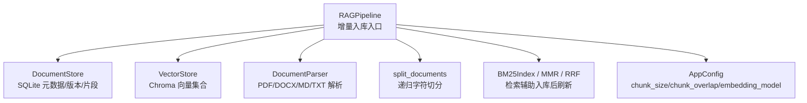
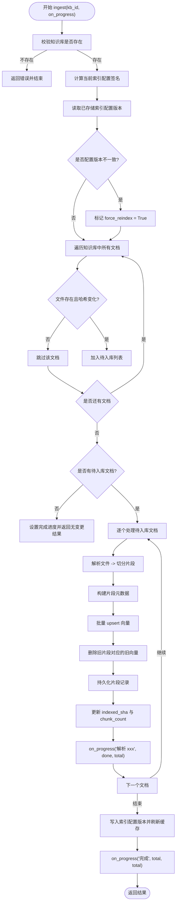
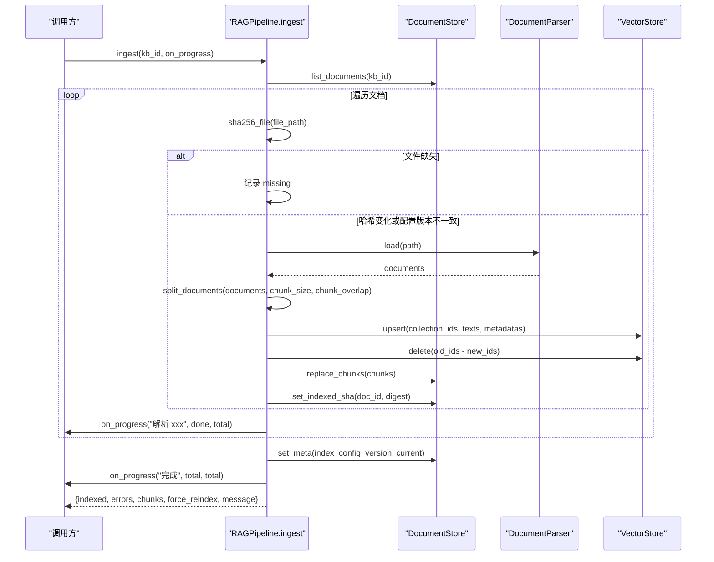
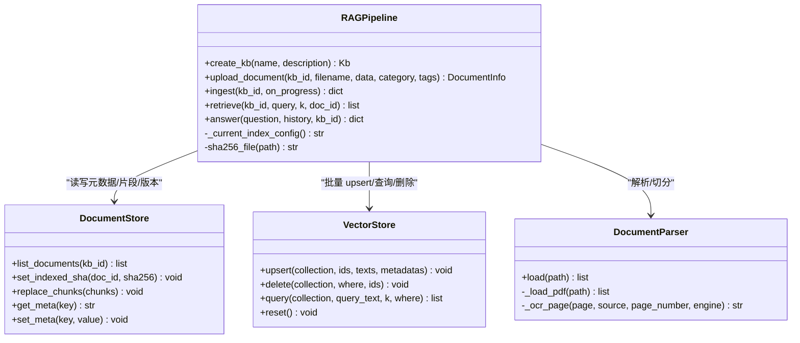
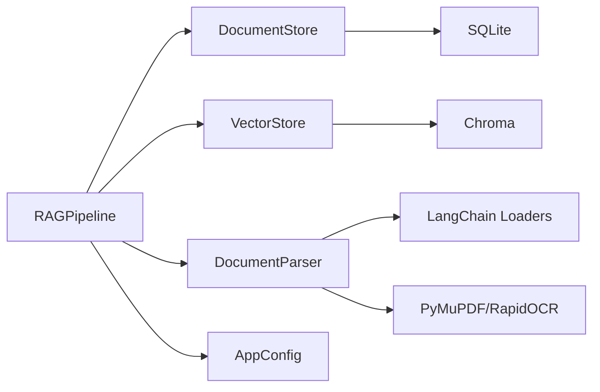

# 增量入库机制

<cite>
**本文引用的文件**
- [rag_pipeline.py](file://rag_pipeline.py)
- [ingestion.py](file://ingestion.py)
- [store.py](file://store.py)
- [vector_store.py](file://vector_store.py)
- [config.py](file://config.py)
- [tests/test_ingest.py](file://tests/test_ingest.py)
- [tests/helpers.py](file://tests/helpers.py)
</cite>

## 目录
1. [简介](#简介)
2. [项目结构](#项目结构)
3. [核心组件](#核心组件)
4. [架构总览](#架构总览)
5. [详细组件分析](#详细组件分析)
6. [依赖关系分析](#依赖关系分析)
7. [性能考量](#性能考量)
8. [故障排查指南](#故障排查指南)
9. [结论](#结论)
10. [附录：调用示例与最佳实践](#附录调用示例与最佳实践)

## 简介
本技术文档聚焦 RAG 管线的“增量入库”机制，围绕 ingest 方法的核心算法展开，包括：
- SHA-256 文件哈希判重
- 索引配置版本检测（chunk_size、chunk_overlap、embedding_model 等）
- 增量 vs 全量重建的决策逻辑
- 增量处理流程：文件存在性检查 → 哈希比对 → 差异识别 → 选择性处理
- 进度回调 on_progress 的调用时机、stage/done/total 含义与 UI 集成方式
- 错误处理策略：单文件解析失败不影响其他文件、异常信息收集、重试语义
- 具体调用方式、进度监控实现与错误处理最佳实践

## 项目结构
RAG 管线由以下关键模块协作完成增量入库：
- rag_pipeline.py：提供 RAGPipeline 门面，封装知识库管理、上传、增量入库、检索与问答。
- ingestion.py：负责文档解析与文本切分，支持 PDF/Word/Markdown/TXT，含 PDF 质量评估与 OCR 回退。
- store.py：SQLite 存储，维护知识库、文档、版本、片段与元数据（含索引配置版本）。
- vector_store.py：Chroma 向量库封装，提供批量 upsert、查询、删除、MMR 所需向量获取。
- config.py：集中配置项，包含 chunk_size、chunk_overlap、embedding_batch_size 等。
- tests/*：覆盖增量入库行为（无变更跳过、内容变化触发重建、配置变化触发全量重建等）。

图表来源
- [rag_pipeline.py:196-435](file://rag_pipeline.py#L196-L435)
- [store.py:123-470](file://store.py#L123-L470)
- [vector_store.py:38-148](file://vector_store.py#L38-L148)
- [ingestion.py:24-190](file://ingestion.py#L24-L190)
- [config.py:56-113](file://config.py#L56-L113)

章节来源
- [rag_pipeline.py:1-15](file://rag_pipeline.py#L1-L15)
- [rag_pipeline.py:196-435](file://rag_pipeline.py#L196-L435)
- [store.py:1-17](file://store.py#L1-L17)
- [vector_store.py:1-10](file://vector_store.py#L1-L10)
- [ingestion.py:1-5](file://ingestion.py#L1-L5)
- [config.py:1-6](file://config.py#L1-L6)

## 核心组件
- RAGPipeline.ingest：增量入库主流程，负责计算当前索引配置版本、扫描文档、判断是否需要重建、逐文件解析/切分/向量化、清理旧片段、更新元数据与缓存。
- DocumentStore：持久化文档、版本、片段、索引配置版本；提供 indexed_sha 字段用于增量判定。
- VectorStore：按批次向量化并 upsert，支持按 doc_id 删除旧向量，保证一致性。
- DocumentParser + split_documents：将原始文件解析为 Document，再按 chunk_size/chunk_overlap 切分为片段。
- AppConfig：集中配置 chunk_size、chunk_overlap、embedding_batch_size 等，影响索引配置签名。

章节来源
- [rag_pipeline.py:196-435](file://rag_pipeline.py#L196-L435)
- [store.py:123-470](file://store.py#L123-L470)
- [vector_store.py:38-148](file://vector_store.py#L38-L148)
- [ingestion.py:24-190](file://ingestion.py#L24-L190)
- [config.py:56-113](file://config.py#L56-L113)

## 架构总览
下图展示 ingest 的整体流程与关键分支：

图表来源
- [rag_pipeline.py:306-435](file://rag_pipeline.py#L306-L435)
- [store.py:337-354](file://store.py#L337-L354)
- [vector_store.py:61-86](file://vector_store.py#L61-L86)

## 详细组件分析

### ingest 方法核心算法
- 索引配置版本检测：
  - 通过 _current_index_config 生成当前配置的 JSON 签名，包含 chunk_size、chunk_overlap、embedding_model、collection_space、parser_version 等。
  - 与 store 中存储的 index_config_version 比较，若不一致则强制全量重建。
- 文件存在性与哈希判重：
  - 对每个文档，检查物理文件是否存在；缺失则记录 missing。
  - 使用 sha256_file 计算文件哈希，并与文档记录的 indexed_sha 对比；不同则纳入 to_index。
- 增量 vs 全量重建决策：
  - 若 force_reindex 为真，或任一文件哈希变化，则执行对应文件的解析/切分/向量化。
  - 若无任何待入库文档，但存在 force_reindex，仍会更新索引配置版本并返回“已是最新”。
- 选择性处理与原子性：
  - 先 upsert 新向量，再删除旧片段对应的旧向量，避免中间态出现“有片段无向量”的不一致。
  - 最后持久化片段记录、更新 indexed_sha 与 chunk_count。
- 进度回调：
  - 每处理一个文件前调用 on_progress("解析 xxx", done, total)。
  - 无任务时调用 on_progress("完成", 0, 0)。
  - 全部完成后调用 on_progress("完成", total, total)。

章节来源
- [rag_pipeline.py:306-435](file://rag_pipeline.py#L306-L435)
- [rag_pipeline.py:739-752](file://rag_pipeline.py#L739-L752)
- [rag_pipeline.py:147-156](file://rag_pipeline.py#L147-L156)
- [store.py:337-354](file://store.py#L337-L354)

### 索引配置版本检测与 force_reindex 触发条件
- 触发条件：
  - chunk_size 变化
  - chunk_overlap 变化
  - embedding_model 变化（来自 LLMClient.embedding_model）
  - parser_version 递增（当解析器/切分行为发生变化时）
- 检测机制：
  - _current_index_config 以固定键顺序序列化上述参数为字符串。
  - 与 store.get_meta(INDEX_CONFIG_KEY) 比较，不等即 force_reindex = True。
- 效果：
  - 一旦检测到配置变化，即使文件未变也会重新解析/切分/向量化，确保向量与配置一致。

章节来源
- [rag_pipeline.py:739-752](file://rag_pipeline.py#L739-L752)
- [rag_pipeline.py:318-320](file://rag_pipeline.py#L318-L320)
- [config.py:76-87](file://config.py#L76-L87)

### 增量处理流程详解
- 文件存在性检查：
  - 遍历文档，若 file_path 不存在，记录到 missing 列表并跳过。
- 哈希比对：
  - 使用 sha256_file 计算文件哈希，与 indexed_sha 比较。
- 差异识别：
  - 若 force_reindex 为真或哈希不同，加入 to_index。
- 选择性处理：
  - 仅对 to_index 中的文档进行解析、切分、向量化与持久化。
  - 对每个文档，先 upsert 新向量，再删除旧片段对应的旧向量，最后持久化片段并更新 indexed_sha。

图表来源
- [rag_pipeline.py:306-435](file://rag_pipeline.py#L306-L435)
- [ingestion.py:24-190](file://ingestion.py#L24-L190)
- [vector_store.py:61-86](file://vector_store.py#L61-L86)
- [store.py:337-354](file://store.py#L337-L354)

### 进度回调机制（on_progress）
- 调用时机：
  - 无待入库文档：on_progress("完成", 0, 0)
  - 每个文件处理前：on_progress(f"解析 {doc.filename}", done, total)
  - 全部完成后：on_progress("完成", total, total)
- 参数含义：
  - stage：当前阶段描述（如“解析 xxx”、“完成”）
  - done：当前已完成数量
  - total：本次待处理文件总数
- UI 集成建议：
  - 根据 stage 显示当前文件名与状态
  - 使用 done/total 渲染进度条
  - 在“完成”阶段汇总结果（indexed、errors、chunks、force_reindex）

章节来源
- [rag_pipeline.py:333-347](file://rag_pipeline.py#L333-L347)
- [rag_pipeline.py:354-428](file://rag_pipeline.py#L354-L428)

### 错误处理策略
- 单文件异常隔离：
  - 单个文件解析/向量化失败不会中断整体流程，异常被捕获并记录到 errors。
- 异常信息收集：
  - 使用 safe_error 包装异常，便于日志与前端展示。
- 重试机制：
  - 若某文件处理失败，indexed_sha 不会被更新，下次 ingest 会自动重试该文件。
  - 对于缺失文件，会在下一次恢复后自动补齐。
- 向量与片段一致性：
  - 先 upsert 新向量，再删除旧向量，最后持久化片段；若中途失败，下次可安全重试。

章节来源
- [rag_pipeline.py:415-417](file://rag_pipeline.py#L415-L417)
- [rag_pipeline.py:395-412](file://rag_pipeline.py#L395-L412)

### 代码级类图（RAGPipeline 与相关组件）

图表来源
- [rag_pipeline.py:196-435](file://rag_pipeline.py#L196-L435)
- [store.py:123-470](file://store.py#L123-L470)
- [vector_store.py:38-148](file://vector_store.py#L38-L148)
- [ingestion.py:24-190](file://ingestion.py#L24-L190)

## 依赖关系分析
- RAGPipeline 依赖：
  - store.DocumentStore：持久化文档、版本、片段、索引配置版本。
  - vector_store.VectorStore：向量库操作（upsert、delete、query）。
  - ingestion.DocumentParser/split_documents：解析与切分。
  - config.AppConfig：读取 chunk_size、chunk_overlap、embedding_batch_size 等。
- 外部依赖：
  - Chroma：向量存储后端。
  - SQLite：元数据存储。
  - LangChain 加载器：PDF/DOCX/TXT/MD 解析。
  - PyMuPDF/RapidOCR：PDF 文本提取与 OCR 回退。

图表来源
- [rag_pipeline.py:196-219](file://rag_pipeline.py#L196-L219)
- [vector_store.py:38-59](file://vector_store.py#L38-L59)
- [store.py:123-138](file://store.py#L123-L138)
- [ingestion.py:13-15](file://ingestion.py#L13-L15)

章节来源
- [rag_pipeline.py:196-219](file://rag_pipeline.py#L196-L219)
- [vector_store.py:38-59](file://vector_store.py#L38-L59)
- [store.py:123-138](file://store.py#L123-L138)
- [ingestion.py:13-15](file://ingestion.py#L13-L15)

## 性能考量
- 批量向量化：
  - VectorStore.upsert 按 batch_size 分批嵌入，减少单次请求压力，默认 16（受限于 Embedding API 限制）。
- 增量更新：
  - 仅对变化文件进行解析/切分/向量化，显著降低重复成本。
- 旧向量清理：
  - 通过 old_ids - new_ids 精确删除不再存在的片段向量，避免冗余。
- BM25 与片段缓存：
  - 入库完成后标记 _bm25_stale 与 _chunks_stale，按需重建，避免频繁重建。
- 并发与锁：
  - DocumentStore 使用 RLock 保护写事务，WAL 模式提升并发读性能。

[本节为通用性能讨论，不直接分析具体文件]

## 故障排查指南
- 常见问题定位：
  - 文件缺失：返回结果中包含 missing 列表，需确认物理文件路径是否正确。
  - 配置版本不一致：force_reindex 为真时会提示“检测到索引配置变更，已全量重建”，检查 chunk_size/chunk_overlap/embedding_model 是否调整。
  - 单文件失败：errors 列表包含失败文件及异常信息，可据此修复文件或环境依赖。
- 重试与恢复：
  - 失败文件下次 ingest 会自动重试；缺失文件恢复后可自动补齐。
- 向量与片段一致性：
  - 若出现“有片段无向量”，检查 upsert 与 delete 的顺序与异常；当前实现先 upsert 再删除旧向量，具备容错能力。

章节来源
- [rag_pipeline.py:333-347](file://rag_pipeline.py#L333-L347)
- [rag_pipeline.py:415-428](file://rag_pipeline.py#L415-L428)
- [rag_pipeline.py:395-412](file://rag_pipeline.py#L395-L412)

## 结论
本增量入库机制通过 SHA-256 哈希判重与索引配置版本检测，实现了高效、安全的增量更新；在配置变化时自动全量重建，确保向量与配置一致；通过 on_progress 提供细粒度进度反馈；错误处理策略保证单文件失败不影响整体流程，并具备天然的重试语义。整体设计兼顾性能、一致性与可维护性。

[本节为总结性内容，不直接分析具体文件]

## 附录：调用示例与最佳实践

### 增量入库调用方式
- 基本调用：
  - 创建知识库后，调用 pipeline.ingest(kb_id) 即可执行增量入库。
  - 若无变更，返回 indexed=[]，message 包含“已是最新”。
- 带进度回调：
  - 传入 on_progress(stage, done, total)，用于 UI 进度显示。
- 参考测试用例：
  - 无变更跳过、内容变化触发重建、配置变化触发全量重建、删除文档清理向量。

章节来源
- [tests/test_ingest.py:9-49](file://tests/test_ingest.py#L9-L49)
- [tests/helpers.py:164-165](file://tests/helpers.py#L164-L165)

### 进度监控实现
- 在 UI 层实现 on_progress：
  - 根据 stage 显示当前文件名与状态
  - 使用 done/total 渲染进度条
  - 在“完成”阶段汇总 indexed/errors/chunks/force_reindex
- 参考调用点：
  - 每个文件处理前：on_progress("解析 xxx", done, total)
  - 无任务：on_progress("完成", 0, 0)
  - 全部完成：on_progress("完成", total, total)

章节来源
- [rag_pipeline.py:333-347](file://rag_pipeline.py#L333-L347)
- [rag_pipeline.py:354-428](file://rag_pipeline.py#L354-L428)

### 错误处理最佳实践
- 捕获并记录异常：
  - 使用 safe_error 包装异常，便于日志与前端展示。
- 容忍单文件失败：
  - 不影响其他文件处理，errors 列表汇总失败信息。
- 利用 indexed_sha 实现自动重试：
  - 失败文件下次 ingest 自动重试；缺失文件恢复后自动补齐。

章节来源
- [rag_pipeline.py:415-417](file://rag_pipeline.py#L415-L417)
- [rag_pipeline.py:395-412](file://rag_pipeline.py#L395-L412)