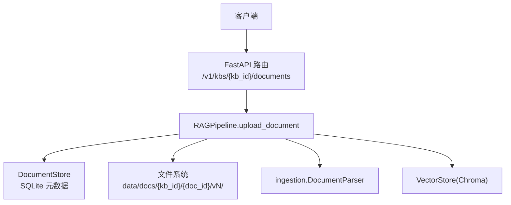
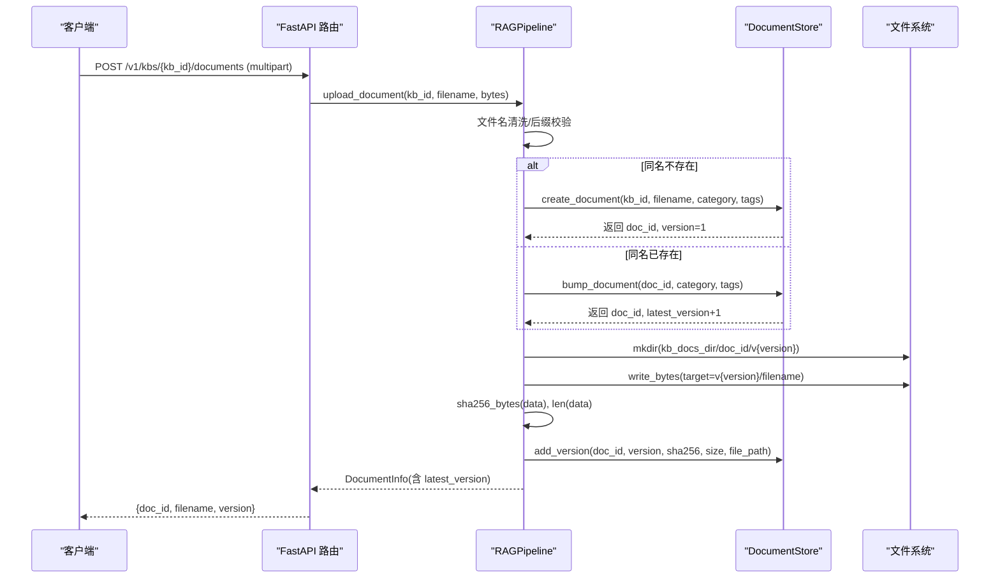
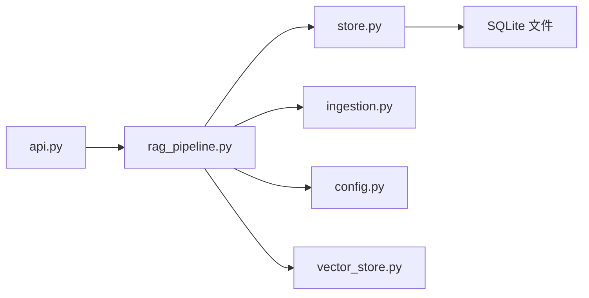

# 文件上传与版本控制

<cite>
**本文引用的文件**
- [api.py](file://api.py)
- [rag_pipeline.py](file://rag_pipeline.py)
- [store.py](file://store.py)
- [ingestion.py](file://ingestion.py)
- [config.py](file://config.py)
- [tests/test_ingest.py](file://tests/test_ingest.py)
- [tests/test_store.py](file://tests/test_store.py)
</cite>

## 目录
1. [简介](#简介)
2. [项目结构](#项目结构)
3. [核心组件](#核心组件)
4. [架构总览](#架构总览)
5. [详细组件分析](#详细组件分析)
6. [依赖关系分析](#依赖关系分析)
7. [性能考量](#性能考量)
8. [故障排查指南](#故障排查指南)
9. [结论](#结论)
10. [附录：代码示例路径](#附录代码示例路径)

## 简介
本技术文档聚焦 RAG 管线的“文件上传与版本控制”能力，围绕 upload_document 方法展开，系统说明同名文件的自动升版本策略、基于 SHA-256 的内容变更检测、版本目录组织方式（kb_id/doc_id/vN/filename）、旧版本物理文件保留机制、版本元数据记录（sha256、file_size）、文件路径生成规则、文件类型校验与拒绝策略、重复上传的版本递增与覆盖策略，以及批量上传、错误处理、大文件与并发安全的实现模式。

## 项目结构
RAG 管线采用分层设计：API 层暴露 REST 接口；RAGPipeline 作为门面协调存储、解析、向量化与检索；DocumentStore 负责 SQLite 元数据与版本历史；ingestion 模块负责文档解析与切分；config 提供集中配置。

图表来源
- [api.py:126-150](file://api.py#L126-L150)
- [rag_pipeline.py:260-288](file://rag_pipeline.py#L260-L288)
- [store.py:214-274](file://store.py#L214-L274)
- [ingestion.py:24-38](file://ingestion.py#L24-L38)

章节来源
- [api.py:1-204](file://api.py#L1-L204)
- [rag_pipeline.py:1-792](file://rag_pipeline.py#L1-L792)
- [store.py:1-470](file://store.py#L1-L470)
- [ingestion.py:1-216](file://ingestion.py#L1-L216)
- [config.py:1-113](file://config.py#L1-L113)

## 核心组件
- FastAPI 路由层：接收 multipart 表单上传，调用 RAGPipeline.upload_document，返回 doc_id、filename、version。
- RAGPipeline.upload_document：文件名清洗、后缀校验、同名冲突处理（创建或 bump）、写入版本目录、计算并记录 sha256 与 size、标记缓存失效。
- DocumentStore：维护知识库、文档主表、版本历史表、片段表与 meta；提供 create_document、bump_document、add_version、get_document 等原子操作；使用 WAL + busy_timeout 提升并发安全。
- ingestion.DocumentParser：按后缀加载 PDF/DOCX/MD/TXT，支持 OCR 回退与质量阈值判断。
- config.AppConfig：集中管理 data_dir、chroma_dir、db_path 等路径与参数。

章节来源
- [api.py:126-150](file://api.py#L126-L150)
- [rag_pipeline.py:260-288](file://rag_pipeline.py#L260-L288)
- [store.py:214-274](file://store.py#L214-L274)
- [ingestion.py:24-38](file://ingestion.py#L24-L38)
- [config.py:89-113](file://config.py#L89-L113)

## 架构总览
下图展示一次上传请求从 API 到存储与文件系统的完整流程，包括版本目录创建、SHA-256 计算与元数据落库。

图表来源
- [api.py:126-150](file://api.py#L126-L150)
- [rag_pipeline.py:260-288](file://rag_pipeline.py#L260-L288)
- [store.py:214-274](file://store.py#L214-L274)

## 详细组件分析

### upload_document 实现机制
- 同名文件自动升版本：若 find_document_by_name 未找到，则 create_document 创建新文档且 version=1；否则 bump_document 将 latest_version+1。
- 版本目录结构：data/docs/{kb_id}/{doc_id}/v{version}/{filename}，确保每个版本独立存放，旧版本不删除。
- SHA-256 内容哈希：对上传的 bytes 计算 sha256，用于后续入库时的增量判断（indexed_sha）。
- 版本元数据记录：add_version 持久化 sha256、size、file_path、created_at，供查询与审计。
- 文件路径生成：通过 _kb_docs_dir(kb_id) 拼接 kb_id、doc_id、v{version}，再追加 filename。
- 缓存失效：将 kb_id 对应的 BM25 与 chunks 缓存标记为 stale，下次读取时重建。

章节来源
- [rag_pipeline.py:260-288](file://rag_pipeline.py#L260-L288)
- [store.py:214-274](file://store.py#L214-L274)
- [rag_pipeline.py:730-732](file://rag_pipeline.py#L730-L732)

### 文件存储策略
- 旧版本物理文件保留：每次上传均写入新的 vN 目录，不覆盖旧版本文件，便于回溯与审计。
- 版本元数据：document_versions 表记录 sha256、size、file_path、created_at；documents 表记录 latest_version、indexed_sha、chunk_count。
- 路径规则：_kb_docs_dir(kb_id) 返回 data_dir/docs/kb_id；目标路径为 version_dir = kb_docs_dir/doc_id/v{version}；最终文件 target = version_dir/filename。

章节来源
- [store.py:31-77](file://store.py#L31-L77)
- [store.py:214-274](file://store.py#L214-L274)
- [rag_pipeline.py:730-732](file://rag_pipeline.py#L730-L732)

### 文件类型验证
- 支持的后缀：.pdf、.md、.txt、.docx（来自 ingestion.SUPPORTED_SUFFIXES）。
- 非法文件拒绝：upload_document 在写入前检查后缀，不在白名单内直接抛出 ValueError，API 层将其转换为 400 错误响应。

章节来源
- [ingestion.py:17-38](file://ingestion.py#L17-L38)
- [rag_pipeline.py:268-272](file://rag_pipeline.py#L268-L272)
- [api.py:126-150](file://api.py#L126-L150)

### 版本冲突处理
- 重复上传时的版本递增：bump_document 将 latest_version+1，并更新分类、标签与上传时间。
- 文件覆盖策略：新版本写入新的 vN 目录，不覆盖旧版本文件；仅元数据 latest_version 指向最新版本。
- 索引触发：新增版本后，chunks 与 BM25 缓存被标记为 stale，下一次 ingest 会依据 indexed_sha 决定是否重新解析与向量化。

章节来源
- [store.py:236-253](file://store.py#L236-L253)
- [rag_pipeline.py:273-288](file://rag_pipeline.py#L273-L288)
- [rag_pipeline.py:306-435](file://rag_pipeline.py#L306-L435)

### 增量入库与内容变更检测
- 增量判定：ingest 遍历文档，计算当前文件 sha256，与 documents.indexed_sha 比较；不同则纳入 to_index。
- 全量重建：当索引配置变化（如 chunk_size、embedding_model、parser_version）时，force_reindex=True，强制全部重算。
- 结果反馈：返回 indexed 列表、errors、chunks 数量、force_reindex 标志与消息。

章节来源
- [rag_pipeline.py:306-435](file://rag_pipeline.py#L306-L435)

### 并发与一致性
- API 层：使用 threading.RLock 串行化读写，避免 SQLite/Chroma 并发访问问题。
- 存储层：DocumentStore 内部使用 RLock 保护写事务；SQLite 启用 WAL 与 busy_timeout，提高并发读性能与稳定性。
- 向量与 BM25：通过缓存与 stale 标记，避免频繁重建；必要时在 ingest 完成后统一刷新。

章节来源
- [api.py:31-33](file://api.py#L31-L33)
- [store.py:123-138](file://store.py#L123-L138)
- [rag_pipeline.py:215-219](file://rag_pipeline.py#L215-L219)

### 错误处理
- 文件类型不支持：upload_document 抛 ValueError，API 层捕获并返回 400。
- 知识库不存在：API 层 _ensure_kb 检查，返回 404。
- 入库异常：ingest 中单个文档解析失败不影响其他文档，错误收集并在结果中返回。

章节来源
- [api.py:90-93](file://api.py#L90-L93)
- [api.py:126-150](file://api.py#L126-L150)
- [rag_pipeline.py:306-435](file://rag_pipeline.py#L306-L435)

## 依赖关系分析

图表来源
- [api.py:126-150](file://api.py#L126-L150)
- [rag_pipeline.py:260-288](file://rag_pipeline.py#L260-L288)
- [store.py:214-274](file://store.py#L214-L274)
- [ingestion.py:24-38](file://ingestion.py#L24-L38)
- [config.py:89-113](file://config.py#L89-L113)

章节来源
- [api.py:1-204](file://api.py#L1-L204)
- [rag_pipeline.py:1-792](file://rag_pipeline.py#L1-L792)
- [store.py:1-470](file://store.py#L1-L470)
- [ingestion.py:1-216](file://ingestion.py#L1-L216)
- [config.py:1-113](file://config.py#L1-L113)

## 性能考量
- 大文件上传：API 层通过 await file.read() 一次性读取到内存，适合中小文件；超大文件建议改为流式写入磁盘后再计算哈希，以降低内存峰值。
- 哈希计算：sha256_bytes 对内存中的 bytes 计算；sha256_file 以块迭代读取文件，适合大文件场景。
- 入库批处理：向量 upsert 与 replace_chunks 批量操作减少 IO 次数；BM25 与 chunks 缓存降低重复构建成本。
- 并发安全：WAL + busy_timeout + RLock 组合，保证高并发下的稳定性。

章节来源
- [api.py:126-150](file://api.py#L126-L150)
- [rag_pipeline.py:147-156](file://rag_pipeline.py#L147-L156)
- [rag_pipeline.py:306-435](file://rag_pipeline.py#L306-L435)
- [store.py:123-138](file://store.py#L123-L138)

## 故障排查指南
- 上传返回 400：检查文件后缀是否在支持列表中；确认传入的 filename 不含路径穿越字符。
- 上传返回 404：确认 kb_id 是否存在；可通过 /v1/kbs 列出知识库。
- 入库无变化：检查 indexed_sha 是否等于当前文件 sha256；若配置版本变化会触发全量重建。
- 向量/检索不一致：确认 ingest 完成后调用 refresh 使缓存失效；检查 chunks 与向量集合是否一致。
- 并发报错：确认服务启动时使用了 RLock；检查 SQLite 连接超时设置。

章节来源
- [api.py:90-93](file://api.py#L90-L93)
- [api.py:126-150](file://api.py#L126-L150)
- [rag_pipeline.py:306-435](file://rag_pipeline.py#L306-L435)
- [store.py:123-138](file://store.py#L123-L138)

## 结论
该 RAG 管线的文件上传与版本控制实现了稳健的同名文件自动升版本、基于 SHA-256 的内容变更检测、清晰的版本目录组织与完整的元数据记录。通过 API 层的锁与存储层的 WAL/RLock 保障并发安全，配合增量入库与缓存失效机制，兼顾了正确性与性能。对于超大文件与高并发场景，可进一步优化为流式写入与异步任务队列以提升吞吐与稳定性。

## 附录：代码示例路径
- 批量上传模式：参考测试用例中多次调用 upload_text 的方式，循环构造多个文件并依次调用 pipeline.upload_document。
  - 示例路径：[tests/test_ingest.py:9-36](file://tests/test_ingest.py#L9-L36)
- 版本管理：演示同名文件重传导致 latest_version 递增，并验证 chunks 数量与向量计数。
  - 示例路径：[tests/test_ingest.py:24-36](file://tests/test_ingest.py#L24-L36)
- 错误处理：API 层对 ValueError 转为 400；知识库不存在转为 404；入库异常收集并返回。
  - 示例路径：[api.py:126-150](file://api.py#L126-L150)
  - 示例路径：[rag_pipeline.py:306-435](file://rag_pipeline.py#L306-L435)
- 大文件上传：建议在应用层将 UploadFile 改为流式写入临时文件，再用 sha256_file 计算哈希，避免一次性 read() 占用过多内存。
  - 参考函数：[rag_pipeline.py:151-156](file://rag_pipeline.py#L151-L156)
- 并发安全：API 层使用 RLock 串行化；存储层使用 WAL + busy_timeout + RLock。
  - 示例路径：[api.py:31-33](file://api.py#L31-L33)
  - 示例路径：[store.py:123-138](file://store.py#L123-L138)