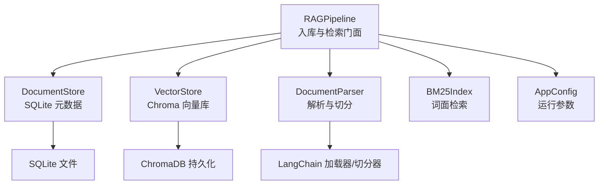
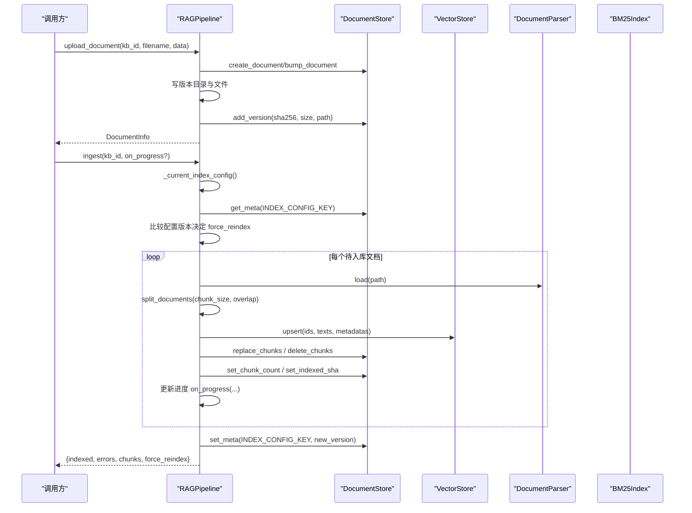
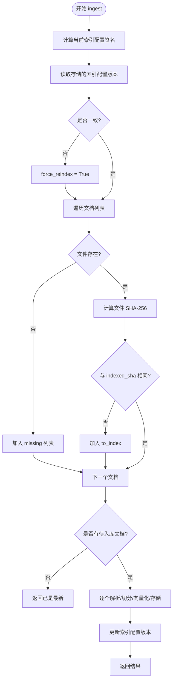
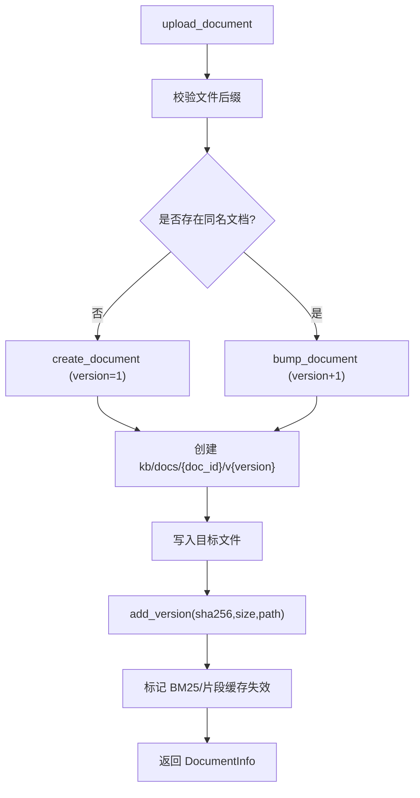
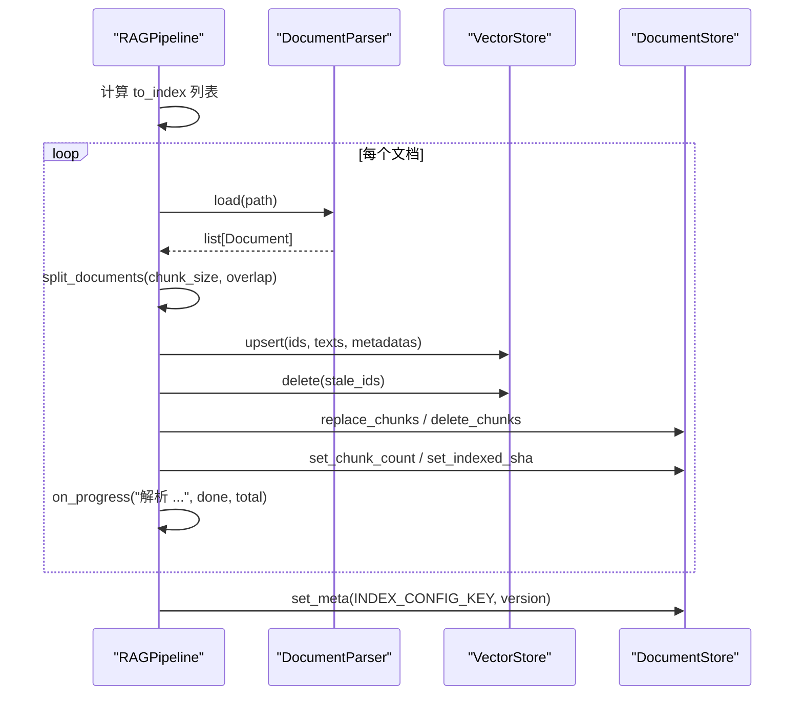
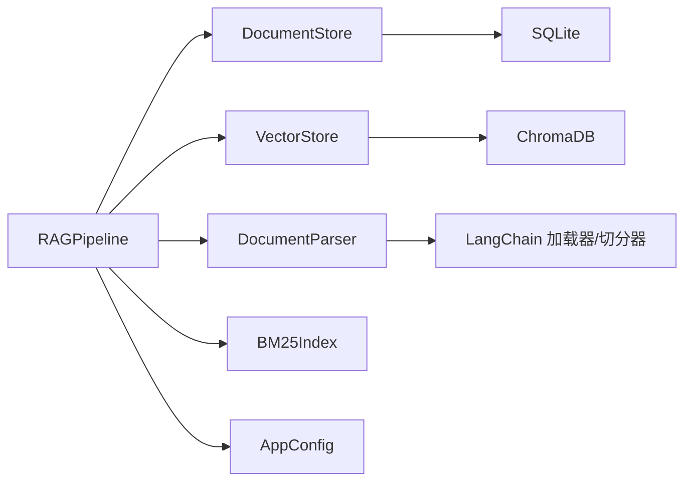
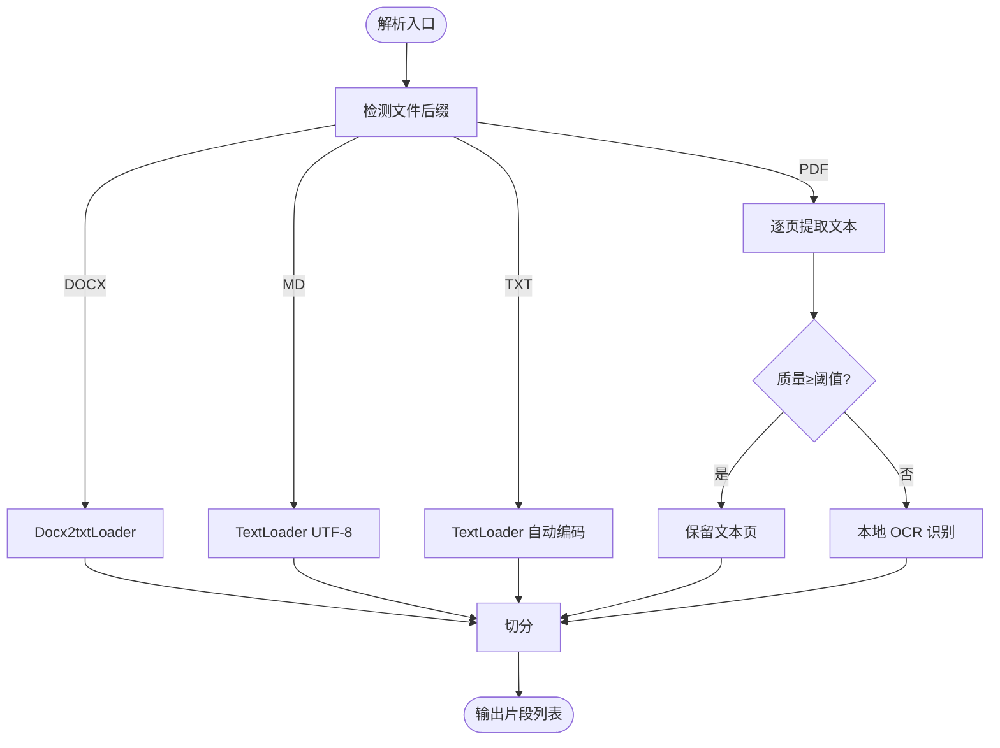

# 文档入库

<cite>
**本文引用的文件**
- [rag_pipeline.py](file://rag_pipeline.py)
- [ingestion.py](file://ingestion.py)
- [vector_store.py](file://vector_store.py)
- [store.py](file://store.py)
- [config.py](file://config.py)
- [tests/test_ingest.py](file://tests/test_ingest.py)
- [tests/test_ingestion.py](file://tests/test_ingestion.py)
- [tests/helpers.py](file://tests/helpers.py)
</cite>

## 目录
1. [简介](#简介)
2. [项目结构](#项目结构)
3. [核心组件](#核心组件)
4. [架构总览](#架构总览)
5. [详细组件分析](#详细组件分析)
6. [依赖关系分析](#依赖关系分析)
7. [性能考量](#性能考量)
8. [故障排查指南](#故障排查指南)
9. [结论](#结论)
10. [附录：使用示例与最佳实践](#附录使用示例与最佳实践)

## 简介
本技术文档聚焦 RAG 管线模块的“文档入库”能力，围绕增量入库机制、索引配置版本管理、自动全量重建逻辑、同名文件版本控制、解析→切分→向量化→存储的完整流水线、进度回调、错误处理与重试策略进行系统化说明。读者可据此理解并正确使用 upload_document 与 ingest 方法，掌握批量入库、进度监控与异常处理的工程模式。

## 项目结构
RAG 管线的入库相关代码主要分布在以下模块：
- rag_pipeline.py：RAGPipeline 门面类，封装知识库管理、上传、入库、检索、问答等流程；实现增量入库、索引配置版本检测与全量重建触发。
- ingestion.py：文档解析与文本切分，支持 PDF/Word/Markdown/TXT，含 PDF 质量评估与本地 OCR 回退。
- vector_store.py：Chroma 向量库封装，提供 upsert/query/delete 等能力，按批向量化写入。
- store.py：SQLite 元数据存储，维护知识库、文档主记录、版本历史、片段表与键值配置（如索引配置版本）。
- config.py：集中配置项，包括 chunk_size、chunk_overlap、embedding_batch_size 等，影响索引构建与检索行为。
- tests/*：单元测试覆盖入库链路、解析与切分、旧文件迁移等场景，提供辅助工具与假 LLM/Embedding。

图表来源
- [rag_pipeline.py:196-219](file://rag_pipeline.py#L196-L219)
- [vector_store.py:38-59](file://vector_store.py#L38-L59)
- [store.py:123-148](file://store.py#L123-L148)
- [ingestion.py:24-39](file://ingestion.py#L24-L39)
- [config.py:56-113](file://config.py#L56-L113)

章节来源
- [rag_pipeline.py:1-792](file://rag_pipeline.py#L1-L792)
- [ingestion.py:1-216](file://ingestion.py#L1-L216)
- [vector_store.py:1-255](file://vector_store.py#L1-L255)
- [store.py:1-470](file://store.py#L1-L470)
- [config.py:1-113](file://config.py#L1-L113)

## 核心组件
- RAGPipeline：提供 upload_document、ingest、retrieve、answer 等方法，协调解析、切分、向量化、存储与检索。
- DocumentParser：按后缀选择加载器，PDF 逐页质量评估，必要时走本地 OCR。
- VectorStore：对 Chroma 的封装，支持批量 upsert、条件删除、相似度查询、取回嵌入用于 MMR。
- DocumentStore：SQLite 持久化，维护知识库、文档、版本、片段、元配置；支持软删除与 WAL 并发安全。
- AppConfig：集中配置，驱动切分、检索、重排等行为。

章节来源
- [rag_pipeline.py:196-219](file://rag_pipeline.py#L196-L219)
- [ingestion.py:24-39](file://ingestion.py#L24-L39)
- [vector_store.py:38-59](file://vector_store.py#L38-L59)
- [store.py:123-148](file://store.py#L123-L148)
- [config.py:56-113](file://config.py#L56-L113)

## 架构总览
入库流程从上传到索引构建的关键路径如下：
- 上传阶段：upload_document 校验类型、定位或创建文档、生成版本目录、保存物理文件、登记版本与 SHA-256、标记缓存失效。
- 入库阶段：ingest 计算当前索引配置签名，对比已存版本决定是否全量重建；筛选需要入库的文件（新增或内容变化）；逐文件执行解析→切分→向量化→存储；更新索引配置版本与统计信息。

图表来源
- [rag_pipeline.py:260-288](file://rag_pipeline.py#L260-L288)
- [rag_pipeline.py:306-435](file://rag_pipeline.py#L306-L435)
- [vector_store.py:61-78](file://vector_store.py#L61-L78)
- [store.py:214-274](file://store.py#L214-L274)
- [ingestion.py:24-39](file://ingestion.py#L24-L39)

## 详细组件分析

### 增量入库机制与 SHA-256 判重
- 文件哈希判重：
  - 上传时计算数据字节流的 SHA-256，并登记到版本表；
  - 入库时读取磁盘文件计算 SHA-256，与文档记录的 indexed_sha 比较，若不同则纳入 to_index 列表；
  - 成功入库后更新 indexed_sha，避免重复处理。
- 缺失文件处理：
  - 若文件不存在，记录 missing 列表并在结果中提示，不影响其他文件处理。
- 全量重建触发：
  - 每次入库前计算当前索引配置签名（包含 chunk_size、chunk_overlap、embedding_model、collection_space、parser_version），与存储的版本比较；
  - 不一致则 force_reindex=True，所有文档均进入 to_index 列表，完成后再写回新配置版本。

图表来源
- [rag_pipeline.py:306-435](file://rag_pipeline.py#L306-L435)
- [store.py:337-345](file://store.py#L337-L345)

章节来源
- [rag_pipeline.py:147-156](file://rag_pipeline.py#L147-L156)
- [rag_pipeline.py:306-435](file://rag_pipeline.py#L306-L435)
- [store.py:337-345](file://store.py#L337-L345)

### 索引配置版本管理与自动全量重建
- 配置签名组成：
  - chunk_size、chunk_overlap：切分参数；
  - embedding_model：嵌入模型标识；
  - collection_space：向量空间（固定 cosine）；
  - parser_version：解析器/切分行为版本号，变更时强制全量重建。
- 触发条件：
  - 任一上述字段变化都会导致签名变化，从而在 ingest 时触发全量重建；
  - 首次入库或迁移后也会写入当前配置版本。
- 存储位置：
  - 通过 DocumentStore.meta 表以键值形式存储 INDEX_CONFIG_KEY。

章节来源
- [rag_pipeline.py:739-752](file://rag_pipeline.py#L739-L752)
- [rag_pipeline.py:318-320](file://rag_pipeline.py#L318-L320)
- [store.py:454-468](file://store.py#L454-L468)

### 文档版本控制与目录组织（upload_document）
- 同名文件自动升版本：
  - 若已存在同名文档，调用 bump_document 将 latest_version+1，并更新分类/标签与上传时间；
  - 否则新建文档，初始版本为 1。
- 物理文件保留策略：
  - 每个版本独立目录 v{version}，同名文件重传会新增新版本目录，旧版本物理文件保留，便于审计与恢复。
- 版本登记：
  - 写入版本目录后，调用 add_version 登记 sha256、size、file_path；
  - 同时标记 BM25 与片段缓存失效，确保后续检索一致性。

图表来源
- [rag_pipeline.py:260-288](file://rag_pipeline.py#L260-L288)
- [store.py:214-274](file://store.py#L214-L274)

章节来源
- [rag_pipeline.py:260-288](file://rag_pipeline.py#L260-L288)
- [store.py:214-274](file://store.py#L214-L274)

### ingest 完整处理流程：解析→切分→向量化→存储
- 解析：
  - 根据后缀选择加载器；PDF 逐页质量评估，低于阈值则走本地 OCR；
  - 输出 LangChain Document 列表。
- 切分：
  - 使用 RecursiveCharacterTextSplitter，按段落/句子边界切分，保留 page 等元数据；
  - 切分参数来自 AppConfig.chunk_size 与 chunk_overlap。
- 向量化与存储：
  - 为每个片段构造唯一 id（doc_id:chunk_index）、metadata（source、page、paragraph、kb_id、category、tags 等）；
  - 先 upsert 新向量，再清理不再存在的旧片段 id，保证“有片段无向量”的情况不会发生；
  - 替换片段记录、更新 chunk_count、记录 indexed_sha。
- 进度回调：
  - on_progress(stage, done, total) 在每个文件处理前后及结束时被调用，供 UI 显示进度；
  - 即使单个文件失败，也不会中断整体流程。

图表来源
- [ingestion.py:24-39](file://ingestion.py#L24-L39)
- [ingestion.py:178-190](file://ingestion.py#L178-L190)
- [ingestion.py:193-215](file://ingestion.py#L193-L215)
- [rag_pipeline.py:354-418](file://rag_pipeline.py#L354-L418)
- [vector_store.py:61-78](file://vector_store.py#L61-L78)

章节来源
- [rag_pipeline.py:306-435](file://rag_pipeline.py#L306-L435)
- [ingestion.py:178-215](file://ingestion.py#L178-L215)

### 错误处理机制与重试策略
- 单文件失败隔离：
  - ingest 中对每个文档 try/except，捕获异常并收集错误信息，不中断其他文件处理；
  - 错误信息通过 safe_error 包装，便于日志与展示。
- 异常信息收集：
  - 结果中包含 errors 列表，最多展示部分错误摘要；
  - 若全部失败，仍会返回空 indexed 与正确统计。
- 重试策略：
  - 代码未内置显式重试；但通过 indexed_sha 与配置版本机制，下次 ingest 会自动重试未完成或失败的文件；
  - 建议上层在 UI 层提供“重试”按钮，再次调用 ingest 即可。

章节来源
- [rag_pipeline.py:354-418](file://rag_pipeline.py#L354-L418)
- [rag_pipeline.py:415-416](file://rag_pipeline.py#L415-L416)

### 进度回调机制（on_progress）
- 调用时机：
  - 每个文件开始处理时调用 on_progress("解析 {filename}", done, total)；
  - 全部完成后调用 on_progress("完成", total, total)。
- 用途：
  - 前端或控制台显示进度条、状态文案；
  - 支持取消与暂停（由上层实现）。

章节来源
- [rag_pipeline.py:354-356](file://rag_pipeline.py#L354-L356)
- [rag_pipeline.py:427-428](file://rag_pipeline.py#L427-L428)

## 依赖关系分析
- RAGPipeline 依赖：
  - DocumentStore：元数据与版本管理；
  - VectorStore：向量存储与检索；
  - DocumentParser：解析与切分；
  - BM25Index：词面检索；
  - AppConfig：运行参数。
- 外部依赖：
  - LangChain 加载器/切分器；
  - ChromaDB 持久化；
  - SQLite 数据库；
  - PyMuPDF/RapidOCR（可选，PDF OCR 回退）。

图表来源
- [rag_pipeline.py:196-219](file://rag_pipeline.py#L196-L219)
- [vector_store.py:38-59](file://vector_store.py#L38-L59)
- [store.py:123-148](file://store.py#L123-L148)
- [ingestion.py:24-39](file://ingestion.py#L24-L39)

章节来源
- [rag_pipeline.py:196-219](file://rag_pipeline.py#L196-L219)
- [vector_store.py:38-59](file://vector_store.py#L38-L59)
- [store.py:123-148](file://store.py#L123-L148)
- [ingestion.py:24-39](file://ingestion.py#L24-L39)

## 性能考量
- 批量向量化：
  - VectorStore.upsert 按 batch_size 分批调用嵌入函数，减少单次请求压力；
  - 默认 embedding_batch_size 受 AppConfig 限制，避免超出模型接口上限。
- 内存与并发：
  - SQLite 使用 WAL 模式与 busy_timeout，提升并发读写稳定性；
  - 向量库按 collection 隔离，避免跨知识库干扰。
- 切分与上下文：
  - chunk_size 与 chunk_overlap 影响片段数量与重叠度，需权衡检索精度与上下文长度；
  - 检索时结合 RRF 融合与 MMR 去重，提升相关性并降低冗余。

章节来源
- [vector_store.py:61-78](file://vector_store.py#L61-L78)
- [store.py:132-138](file://store.py#L132-L138)
- [config.py:90-113](file://config.py#L90-L113)

## 故障排查指南
- 常见问题与定位：
  - 文件类型不支持：检查 SUPPORTED_SUFFIXES，确认后缀；
  - PDF 乱码或扫描：查看质量阈值与 OCR 依赖，安装 pymupdf/rapidocr/onnxruntime；
  - 向量检索为空：检查 relevance_threshold 与 BM25 命中情况；
  - 配置变更后未生效：确认 INDEX_CONFIG_KEY 是否更新，必要时手动触发 ingest。
- 错误信息收集：
  - ingest 返回 errors 列表，查看具体失败文件与异常信息；
  - 通过 safe_error 获取可读异常描述。
- 重试与恢复：
  - 由于 indexed_sha 与配置版本机制，再次调用 ingest 会自动重试失败或未完成的文件；
  - 如需人工干预，可删除对应文档或调整配置后重新入库。

章节来源
- [rag_pipeline.py:354-418](file://rag_pipeline.py#L354-L418)
- [ingestion.py:40-78](file://ingestion.py#L40-L78)
- [ingestion.py:124-150](file://ingestion.py#L124-L150)

## 结论
本模块实现了稳健的文档入库流水线：通过 SHA-256 判重与索引配置版本管理，确保增量入库与自动全量重建；同名文件版本控制与物理文件保留策略保障可追溯性；解析→切分→向量化→存储的流水线具备进度回调与错误隔离能力；结合混合检索与重排，提升最终问答质量。生产部署时建议关注配置调优、错误日志与重试策略，以获得稳定高效的 RAG 体验。

## 附录：使用示例与最佳实践

### 批量入库与进度监控
- 典型调用模式：
  - 循环调用 upload_document 上传多个文件；
  - 调用 ingest(kb_id, on_progress=callback) 执行入库，回调中更新 UI 进度；
  - 处理返回结果中的 indexed、errors、chunks、force_reindex 字段。
- 参考测试用例：
  - 见 tests/test_ingest.py 中的用例，演示增量入库、配置变更触发重建、旧文件迁移等。

章节来源
- [tests/test_ingest.py:9-75](file://tests/test_ingest.py#L9-L75)
- [tests/helpers.py:160-165](file://tests/helpers.py#L160-L165)

### 错误处理与重试
- 错误收集：
  - ingest 返回 errors 列表，记录每个失败文件的异常信息；
  - 上层可根据 errors 提示用户或触发重试。
- 重试策略：
  - 无需显式重试逻辑，再次调用 ingest 即可基于 indexed_sha 与配置版本自动重试；
  - 对于持续失败的文件，检查解析依赖（如 OCR）与文件完整性。

章节来源
- [rag_pipeline.py:415-416](file://rag_pipeline.py#L415-L416)
- [rag_pipeline.py:306-435](file://rag_pipeline.py#L306-L435)

### 配置变更与全量重建
- 关键参数：
  - chunk_size、chunk_overlap：切分大小与重叠；
  - embedding_model：嵌入模型标识；
  - parser_version：解析器/切分行为版本号。
- 触发条件：
  - 任一参数变化都会导致配置签名变化，下一次 ingest 自动全量重建；
  - 可通过修改环境变量或 AppConfig 调整。

章节来源
- [rag_pipeline.py:739-752](file://rag_pipeline.py#L739-L752)
- [config.py:90-113](file://config.py#L90-L113)

### 代码级流程图：解析与切分

图表来源
- [ingestion.py:24-39](file://ingestion.py#L24-L39)
- [ingestion.py:40-78](file://ingestion.py#L40-L78)
- [ingestion.py:178-190](file://ingestion.py#L178-L190)