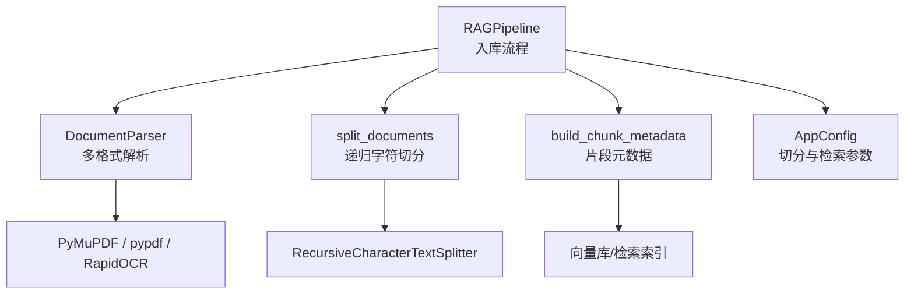
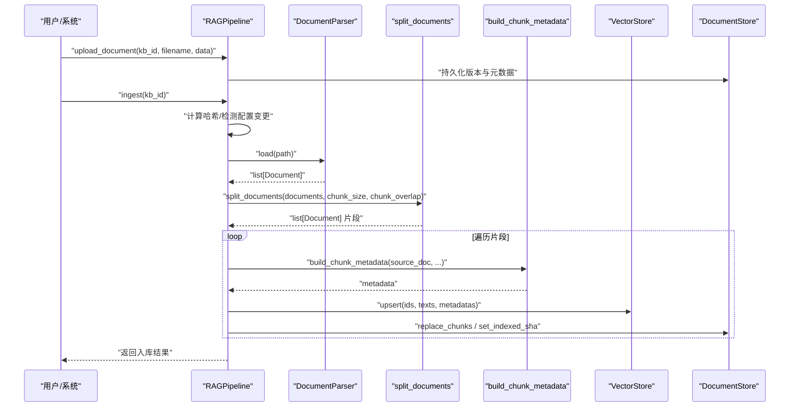
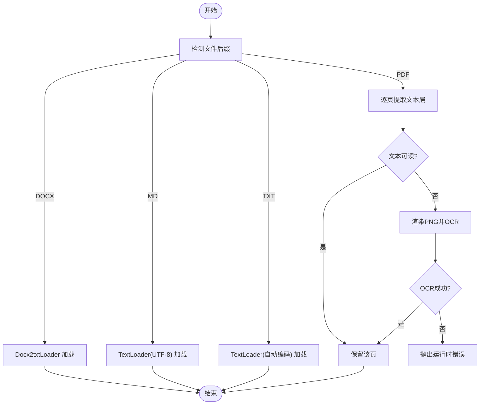
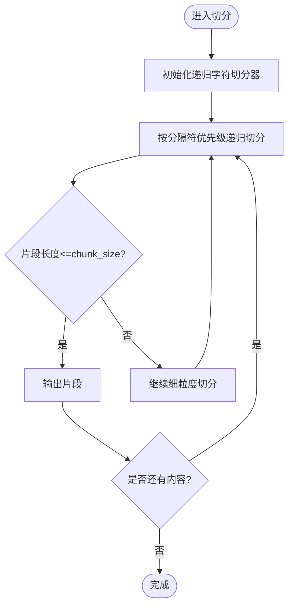
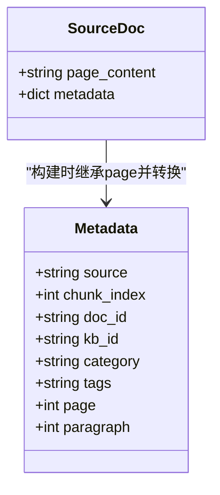
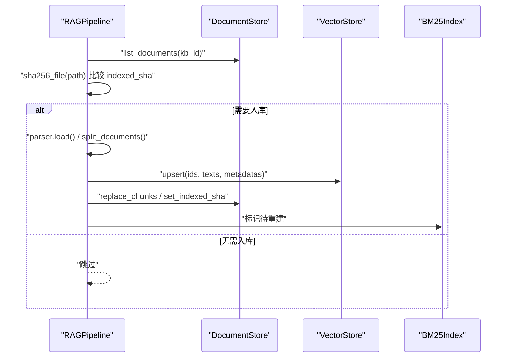
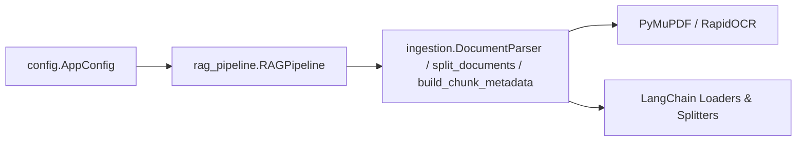

# 文档解析与智能切分

<cite>
**本文引用的文件**
- [ingestion.py](file://ingestion.py)
- [rag_pipeline.py](file://rag_pipeline.py)
- [config.py](file://config.py)
- [tests/test_ingestion.py](file://tests/test_ingestion.py)
</cite>

## 目录
1. [简介](#简介)
2. [项目结构](#项目结构)
3. [核心组件](#核心组件)
4. [架构总览](#架构总览)
5. [详细组件分析](#详细组件分析)
6. [依赖关系分析](#依赖关系分析)
7. [性能考量](#性能考量)
8. [故障排查指南](#故障排查指南)
9. [结论](#结论)
10. [附录：配置与示例路径](#附录配置与示例路径)

## 简介
本技术文档聚焦 RAG 管线中的“文档解析与智能切分”能力，围绕以下目标展开：
- 解释 DocumentParser 的工作机制：多格式支持（PDF、Word、Markdown、TXT）、格式自动识别、解析器选择策略。
- 详细说明 split_documents 的智能切分算法：chunk_size 与 chunk_overlap 参数调优、重叠窗口设计原理、边界优化策略。
- 文档化 build_chunk_metadata 的元数据构建过程：片段元数据结构、来源追踪信息、页码映射关系。
- 说明切分质量评估：片段长度控制、语义完整性保持、上下文连续性保障。
- 提供性能优化技巧：批量处理、内存管理、流式处理大文档。
- 给出具体代码示例路径，展示如何扩展自定义解析器、调优切分参数、定制元数据。

## 项目结构
RAG 管线的文档解析与切分主要位于 ingestion.py，由 rag_pipeline.py 在入库流程中调用；相关可调参数集中在 config.py。测试用例位于 tests/test_ingestion.py，覆盖 PDF 文本质量阈值与页码归一化等关键行为。

图表来源
- [rag_pipeline.py:306-435](file://rag_pipeline.py#L306-L435)
- [ingestion.py:24-190](file://ingestion.py#L24-L190)
- [config.py:56-112](file://config.py#L56-L112)

章节来源
- [rag_pipeline.py:306-435](file://rag_pipeline.py#L306-L435)
- [ingestion.py:24-190](file://ingestion.py#L24-L190)
- [config.py:56-112](file://config.py#L56-L112)

## 核心组件
- DocumentParser：按文件后缀自动选择加载器，PDF 优先使用 PyMuPDF 提取文本层，结合本地 OCR 回退；其他格式通过 LangChain 加载器读取。
- split_documents：基于 RecursiveCharacterTextSplitter 的递归字符切分，按段落/句子边界切分，保留 page 等元数据。
- build_chunk_metadata：为每个片段生成稳定可追溯的元数据，包含来源、片段序号、文档 ID、知识库 ID、分类、标签、页码与段落号。
- RAGPipeline.ingest：串联解析、切分、元数据构建、向量化与存储，支持增量入库与配置变更触发全量重建。

章节来源
- [ingestion.py:24-190](file://ingestion.py#L24-L190)
- [rag_pipeline.py:306-435](file://rag_pipeline.py#L306-L435)

## 架构总览
下图展示了从上传到入库的关键数据流：文件被保存后，RAGPipeline 根据哈希判断是否需要重新解析与切分；随后调用 DocumentParser 解析、split_documents 切分、build_chunk_metadata 构建元数据，最终写入向量库与元数据存储。

图表来源
- [rag_pipeline.py:260-435](file://rag_pipeline.py#L260-L435)
- [ingestion.py:24-190](file://ingestion.py#L24-L190)

## 详细组件分析

### DocumentParser：多格式解析与自动回退
- 支持格式与识别策略
  - PDF：优先使用 PyMuPDF 逐页提取文本层；若缺失则回退到 pypdf 并做整本质量判断；对空白或乱码页单独走本地 OCR（PyMuPDF + RapidOCR）。
  - Word(.docx)：使用 Docx2txtLoader 直接读取。
  - Markdown(.md)：使用 TextLoader 以 UTF-8 读取，避免重依赖。
  - 文本(.txt)：使用 TextLoader 自动探测编码读取。
- PDF 文本质量评估
  - 通过 _text_quality 估算可见字符的可读性比例，中文、ASCII、标点、日文假名等视为可读；低于阈值时判定为乱码/扫描件，触发 OCR。
- 逐页 OCR 回退
  - 对不可读页渲染为 PNG（2 倍分辨率）并使用 RapidOCR 识别，失败时抛出明确错误信息。

图表来源
- [ingestion.py:24-175](file://ingestion.py#L24-L175)

章节来源
- [ingestion.py:24-175](file://ingestion.py#L24-L175)
- [tests/test_ingestion.py:10-32](file://tests/test_ingestion.py#L10-L32)

### split_documents：智能切分算法与参数调优
- 算法实现
  - 使用 RecursiveCharacterTextSplitter，按分隔符优先级 ["\n\n", "\n", "。", "；", "，", " ", ""] 进行递归切分，尽量在段落/句子边界处切分，减少语义割裂。
  - 设置 add_start_index=True，便于后续定位片段起始位置。
- 参数调优建议
  - chunk_size：控制片段最大长度。过小导致碎片过多、上下文断裂；过大增加模型输入成本且降低检索精度。默认值来自配置项 CHUNK_SIZE。
  - chunk_overlap：控制相邻片段的重叠长度。适当重叠有助于跨片段语义连贯，但过大会重复计算、浪费资源。默认值来自配置项 CHUNK_OVERLAP。
- 边界优化策略
  - 优先在段落/句末切分，避免在词中间断开；中文标点作为强边界，提升语义完整性。
  - 对于超长段落，仍会按最小单位继续切分，确保不超过 chunk_size。

图表来源
- [ingestion.py:178-190](file://ingestion.py#L178-L190)

章节来源
- [ingestion.py:178-190](file://ingestion.py#L178-L190)
- [config.py:96-112](file://config.py#L96-L112)

### build_chunk_metadata：元数据构建与来源追踪
- 元数据结构
  - source：文件名，用于引用与溯源。
  - chunk_index：片段序号（从1起），用于顺序定位。
  - doc_id：文档唯一标识。
  - kb_id：知识库标识。
  - category/tags：可选的分类与标签，便于过滤与聚合。
  - page：页码（内部统一 0 起编号，对外转换为 1 起，符合人类阅读习惯）。
  - paragraph：段落号，与 chunk_index 保持一致，便于无页码场景的定位。
- 页码映射关系
  - PDF 解析阶段记录 page=0 起编号；构建元数据时统一加 1，保证对外一致性。
- 来源追踪
  - 所有片段均携带 source、doc_id、kb_id，便于检索结果回溯到原始文档与知识库。

图表来源
- [ingestion.py:193-215](file://ingestion.py#L193-L215)

章节来源
- [ingestion.py:193-215](file://ingestion.py#L193-L215)
- [tests/test_ingestion.py:25-32](file://tests/test_ingestion.py#L25-L32)

### 入库流程与集成点
- 增量入库
  - 通过 SHA-256 校验文件内容变化；当检测到索引配置（如 chunk_size、chunk_overlap、embedding_model）变化时，触发全量重建，避免旧向量与新配置不匹配。
- 混合检索准备
  - 入库完成后更新 BM25 索引与片段缓存，确保检索阶段可用。
- 错误隔离
  - 单个文档解析/切分异常不影响其他文档入库；错误信息汇总返回。

图表来源
- [rag_pipeline.py:306-435](file://rag_pipeline.py#L306-L435)

章节来源
- [rag_pipeline.py:306-435](file://rag_pipeline.py#L306-L435)

## 依赖关系分析
- 外部依赖
  - PyMuPDF：PDF 文本层提取与页面渲染。
  - RapidOCR：本地 OCR 识别，避免云端依赖。
  - LangChain：Docx2txtLoader、PyPDFLoader、TextLoader、RecursiveCharacterTextSplitter。
- 内部耦合
  - RAGPipeline 依赖 AppConfig 获取切分与检索参数。
  - ingestion.py 暴露 DocumentParser、split_documents、build_chunk_metadata 供 pipeline 调用。
- 潜在循环依赖
  - 当前模块间为单向依赖，未见循环导入。

图表来源
- [config.py:56-112](file://config.py#L56-L112)
- [rag_pipeline.py:27-38](file://rag_pipeline.py#L27-L38)
- [ingestion.py:13-15](file://ingestion.py#L13-L15)

章节来源
- [config.py:56-112](file://config.py#L56-L112)
- [rag_pipeline.py:27-38](file://rag_pipeline.py#L27-L38)
- [ingestion.py:13-15](file://ingestion.py#L13-L15)

## 性能考量
- 批量处理
  - 向量化阶段使用 embedding_batch_size（默认 16，上限 20），避免接口限制导致的报错。
- 内存管理
  - 逐页处理 PDF，避免一次性加载整本大文档；OCR 仅对不可读页执行，降低 CPU 与内存占用。
- 流式处理大文档
  - 当前实现为批处理模式；如需流式，可在外层迭代文档并按批次调用 splitter 与 upsert，逐步释放内存。
- 切分参数影响
  - chunk_size 越大，单次向量计算成本越高；chunk_overlap 越大，冗余越多。建议根据文档类型与模型上下文窗口调优。
- 配置变更触发全量重建
  - 当 chunk_size、chunk_overlap、embedding_model 等任一变化，将强制重建索引，确保一致性。

章节来源
- [config.py:90-112](file://config.py#L90-L112)
- [rag_pipeline.py:739-752](file://rag_pipeline.py#L739-L752)
- [ingestion.py:40-78](file://ingestion.py#L40-L78)

## 故障排查指南
- PDF 无法提取文字
  - 现象：抛出“未能从 xxx 提取或识别出文字”。
  - 可能原因：缺少 PyMuPDF/RapidOCR；PDF 纯图像且 OCR 失败。
  - 处理：安装依赖；检查 PDF 是否为扫描图；调整 OCR 分辨率或预处理。
- 文本质量过低
  - 现象：_text_quality 低于阈值，触发 OCR。
  - 可能原因：CID 字体映射错误；扫描件。
  - 处理：确认 PDF 源；必要时启用 OCR。
- 切分效果不佳
  - 现象：片段过长/过短、语义断裂。
  - 处理：调整 chunk_size 与 chunk_overlap；观察分隔符优先级是否满足需求。
- 元数据页码不一致
  - 现象：对外页码与预期不符。
  - 处理：确认内部 0 起编号已转换为 1 起；检查 source_doc.metadata["page"] 是否存在。

章节来源
- [ingestion.py:40-78](file://ingestion.py#L40-L78)
- [ingestion.py:104-122](file://ingestion.py#L104-L122)
- [ingestion.py:124-175](file://ingestion.py#L124-L175)
- [tests/test_ingestion.py:10-32](file://tests/test_ingestion.py#L10-L32)

## 结论
本实现提供了稳健的多格式文档解析与智能切分能力：
- 通过逐页质量评估与本地 OCR 回退，显著提升 PDF 解析鲁棒性。
- 递归字符切分在中文语境下兼顾语义完整性与上下文连续性。
- 元数据构建完善，支持来源追踪与页码映射，便于检索结果溯源。
- 配置集中化管理，支持动态调参与增量入库，兼顾灵活性与一致性。
建议在真实场景中结合文档类型与模型上下文窗口，持续调优 chunk_size 与 chunk_overlap，并监控检索质量指标。

## 附录：配置与示例路径
- 切分参数配置
  - 环境变量：CHUNK_SIZE、CHUNK_OVERLAP。
  - 默认值：CHUNK_SIZE=500，CHUNK_OVERLAP=50。
  - 参考路径：[config.py:96-112](file://config.py#L96-L112)
- 自定义解析器扩展
  - 替换 DocumentParser.load 或注入自定义解析器实例。
  - 参考路径：[rag_pipeline.py:199-214](file://rag_pipeline.py#L199-L214)
- 切分参数调优
  - 修改 AppConfig.chunk_size 与 chunk_overlap，或设置环境变量。
  - 参考路径：[config.py:96-112](file://config.py#L96-L112)
- 元数据定制
  - 扩展 build_chunk_metadata，增加字段（如作者、部门等）。
  - 参考路径：[ingestion.py:193-215](file://ingestion.py#L193-L215)
- 测试用例参考
  - PDF 文本质量阈值与页码归一化验证。
  - 参考路径：[tests/test_ingestion.py:10-32](file://tests/test_ingestion.py#L10-L32)