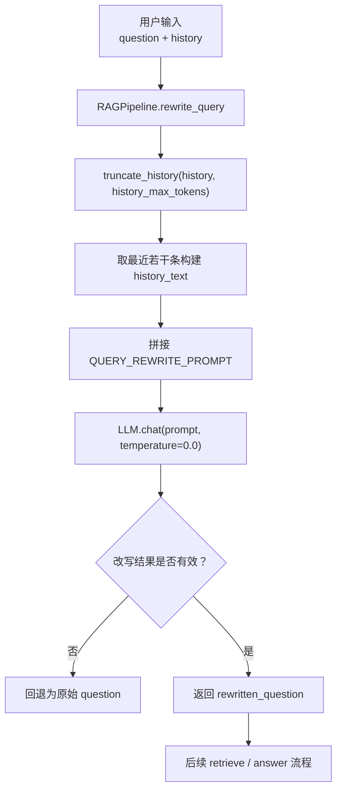
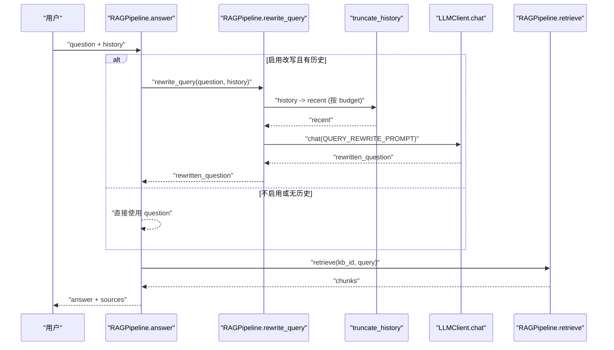
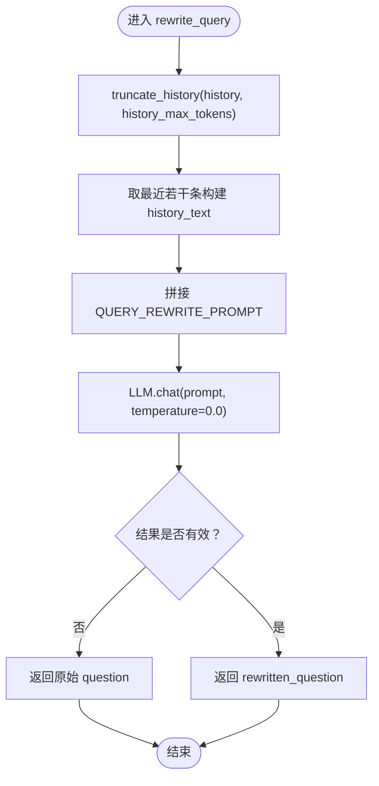
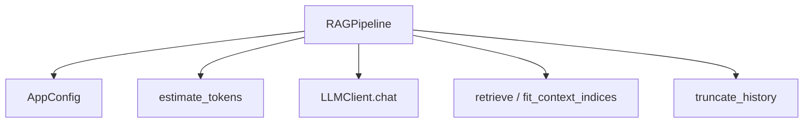

# 查询改写

<cite>
**本文引用的文件**
- [rag_pipeline.py](file://rag_pipeline.py)
- [config.py](file://config.py)
- [logger.py](file://utils/logger.py)
- [test_rag_answer.py](file://tests/test_rag_answer.py)
- [test_context.py](file://tests/test_context.py)
</cite>

## 目录
1. [简介](#简介)
2. [项目结构](#项目结构)
3. [核心组件](#核心组件)
4. [架构总览](#架构总览)
5. [详细组件分析](#详细组件分析)
6. [依赖关系分析](#依赖关系分析)
7. [性能考量](#性能考量)
8. [故障排查指南](#故障排查指南)
9. [结论](#结论)
10. [附录：使用示例与调试方法](#附录使用示例与调试方法)

## 简介
本技术文档聚焦 RAG 管线中的“查询改写”能力，围绕多轮对话上下文处理、历史截断策略、最近两轮对话提取、上下文压缩算法展开，系统说明 rewrite_query 的核心逻辑：将追问题转换为独立明确的问题、去除代词引用、补充缺失信息、保持原意不变。同时文档化 truncate_history 的 token 预算控制、QUERY_REWRITE_PROMPT 的设计思路与约束、以及改写失败的降级策略。文末提供使用示例与调试方法，帮助评估改写效果并优化提示词。

## 项目结构
RAG 管线的查询改写功能主要位于 RAGPipeline 类中，配合配置模块与工具函数完成上下文预算控制与 token 估算。关键文件职责如下：
- rag_pipeline.py：实现 RAGPipeline 及其 query 改写、问答、检索等流程；定义 QUERY_REWRITE_PROMPT、RAG_USER_PROMPT、RAG_SYSTEM_PROMPT；提供 truncate_history、fit_context_indices 等上下文裁剪工具。
- config.py：集中管理 AppConfig，包括 history_max_tokens、rag_context_max_tokens、query_rewrite_enabled 等开关与阈值。
- utils/logger.py：提供 estimate_tokens 用于中英文混合文本的轻量 token 估算，支撑历史与上下文预算控制。
- tests/test_rag_answer.py：覆盖查询改写行为测试（有/无历史、改写结果校验）。
- tests/test_context.py：覆盖历史截断与上下文块选择的行为测试（预算控制、至少保留首块/最后一条等）。

图表来源
- [rag_pipeline.py:566-588](file://rag_pipeline.py#L566-L588)
- [rag_pipeline.py:159-178](file://rag_pipeline.py#L159-L178)
- [config.py:107-109](file://config.py#L107-L109)

章节来源
- [rag_pipeline.py:566-588](file://rag_pipeline.py#L566-L588)
- [config.py:107-109](file://config.py#L107-L109)

## 核心组件
- RAGPipeline.rewrite_query：在多轮对话场景下，基于最近历史消息调用 LLM 将追问题改写为独立明确的单轮问题；失败或异常时回退到原问题。
- truncate_history：按 token 预算从后往前保留历史消息，保证至少保留最后一条，避免长对话稀释注意力并节省计费 token。
- fit_context_indices：在问答阶段对检索到的上下文块进行预算内选择，保证块不可拆分且至少保留第一块。
- estimate_tokens：轻量 token 估算，中文约 1 token/字，英文/数字约 4 字符/token，用于历史与上下文预算控制。
- QUERY_REWRITE_PROMPT：提示词工程产物，约束输出格式、要求只输出改写后的问题本身，并提供最近对话与当前问题作为输入。

章节来源
- [rag_pipeline.py:566-588](file://rag_pipeline.py#L566-L588)
- [rag_pipeline.py:159-178](file://rag_pipeline.py#L159-L178)
- [rag_pipeline.py:181-193](file://rag_pipeline.py#L181-L193)
- [utils/logger.py:48-62](file://utils/logger.py#L48-L62)
- [rag_pipeline.py:70-78](file://rag_pipeline.py#L70-L78)

## 架构总览
查询改写在 RAG 问答流程中的位置如下：当启用 query_rewrite_enabled 且存在历史时，answer 会先调用 rewrite_query 生成更明确的检索用问题，再进行检索与回答。历史与上下文均受 token 预算控制，确保整体上下文长度可控。

图表来源
- [rag_pipeline.py:590-666](file://rag_pipeline.py#L590-L666)
- [rag_pipeline.py:566-588](file://rag_pipeline.py#L566-L588)
- [rag_pipeline.py:159-178](file://rag_pipeline.py#L159-L178)

## 详细组件分析

### 多轮对话上下文处理：历史截断与最近两轮提取
- 历史截断策略：
  - 使用 truncate_history 从后往前保留历史消息，直到达到 history_max_tokens 预算；若继续添加下一条会超出预算则停止。
  - 保证至少保留最后一条消息，避免空历史导致无法改写。
  - 通过 estimate_tokens 估算每条消息的 token 成本，控制总长度。
- 最近两轮对话提取：
  - 在 rewrite_query 中，先对历史做预算截断，再取最近的若干条（代码中为最近 4 条）以构成 history_text。
  - 注释明确指出“只看最近两轮对话”，以避免长上下文注意力发散带来的误导风险。
- 上下文压缩算法：
  - 在问答阶段，对检索到的上下文块使用 fit_context_indices 进行预算内选择，保证块不可拆分且至少保留第一块。
  - 最终组装 prompt 时，将 history_text 与 context_blocks 合并，形成完整的输入上下文。

图表来源
- [rag_pipeline.py:566-588](file://rag_pipeline.py#L566-L588)
- [rag_pipeline.py:159-178](file://rag_pipeline.py#L159-L178)
- [rag_pipeline.py:181-193](file://rag_pipeline.py#L181-L193)

章节来源
- [rag_pipeline.py:566-588](file://rag_pipeline.py#L566-L588)
- [rag_pipeline.py:159-178](file://rag_pipeline.py#L159-L178)
- [rag_pipeline.py:181-193](file://rag_pipeline.py#L181-L193)
- [utils/logger.py:48-62](file://utils/logger.py#L48-L62)

### 查询改写的核心逻辑
- 目标：将追问题转换为独立明确的问题，去除代词引用，补充缺失信息，保持原意不变。
- 输入：最近若干条历史消息（已按预算截断）+ 当前问题。
- 处理：
  - 构造 QUERY_REWRITE_PROMPT，包含 history 与 question。
  - 调用 LLM.chat，temperature=0.0 以降低随机性，enable_thinking=False 减少延迟。
  - 对输出进行护栏检查：非空且长度不超过阈值（例如 300），否则回退到原始问题。
- 输出：改写后的问题，供后续检索与回答使用。

章节来源
- [rag_pipeline.py:566-588](file://rag_pipeline.py#L566-L588)
- [rag_pipeline.py:70-78](file://rag_pipeline.py#L70-L78)

### truncate_history 的 token 预算控制
- 算法要点：
  - 从后往前遍历历史消息，累计 estimate_tokens 计算每条消息的 token 成本。
  - 如果加入下一条会超过 max_tokens，则停止；否则追加并更新 total。
  - 始终保证至少保留最后一条消息（即使超预算也会保留最后一条）。
- 适用场景：
  - 改写阶段：限制 history_text 的长度，避免过长历史干扰改写质量。
  - 问答阶段：限制最终 prompt 中的历史部分长度，降低上下文开销。
- 复杂度：
  - 时间复杂度 O(n)，n 为历史消息条数；空间复杂度 O(k)，k 为保留的消息条数。

章节来源
- [rag_pipeline.py:159-178](file://rag_pipeline.py#L159-L178)
- [utils/logger.py:48-62](file://utils/logger.py#L48-L62)

### fit_context_indices 的上下文块选择
- 算法要点：
  - 按顺序遍历上下文块，累计 estimate_tokens 计算每个块的 token 成本。
  - 如果加入下一块会超过 max_tokens，则停止；否则记录该块索引并更新 total。
  - 保证至少保留第一块，避免完全丢弃最相关的开头内容。
- 适用场景：
  - 问答阶段：在检索到多个片段后，按预算选择最合适的上下文块组合，控制 prompt 长度。
- 复杂度：
  - 时间复杂度 O(m)，m 为上下文块数量；空间复杂度 O(p)，p 为保留的块数量。

章节来源
- [rag_pipeline.py:181-193](file://rag_pipeline.py#L181-L193)
- [utils/logger.py:48-62](file://utils/logger.py#L48-L62)

### QUERY_REWRITE_PROMPT 的设计思路
- 提示词工程：
  - 明确要求“把用户在多轮对话中的提问改写成独立、明确的单轮问题”。
  - 约束输出格式：“只输出改写后的问题本身，不要输出任何其他内容”，便于下游直接消费。
  - 提供“最近对话”和“用户问题”两个占位符，使模型能结合上下文理解指代与缺失信息。
- 约束条件设置：
  - 通过简洁指令减少模型自由发挥，降低幻觉与冗余输出风险。
  - 配合 temperature=0.0 与 enable_thinking=False，提升稳定性与响应速度。
- 输出格式规范：
  - 纯文本问题字符串，便于后续检索与回答流程无缝衔接。

章节来源
- [rag_pipeline.py:70-78](file://rag_pipeline.py#L70-L78)
- [rag_pipeline.py:566-588](file://rag_pipeline.py#L566-L588)

### 改写失败的降级策略
- LLM 调用异常：捕获异常并返回原始问题，保证主流程不受影响。
- 改写结果过长：若输出长度超过阈值（例如 300），视为异常（可能把历史也抄进来了），回退到原始问题。
- 空输入处理：若无历史或改写结果为空，直接返回原始问题。
- 设计原则：
  - 稳健优先：任何异常或边界情况都回退到安全路径，确保检索与回答流程可继续。
  - 可观测性：可通过日志或测试验证降级路径是否触发。

章节来源
- [rag_pipeline.py:566-588](file://rag_pipeline.py#L566-L588)

## 依赖关系分析
- RAGPipeline 依赖：
  - config.AppConfig：读取 history_max_tokens、rag_context_max_tokens、query_rewrite_enabled 等配置。
  - utils.logger.estimate_tokens：用于历史与上下文预算控制。
  - llm_client.LLMClient：执行 chat 调用，支持 temperature、enable_thinking 等参数。
- 外部依赖：
  - 向量库与 BM25 索引：在 retrieve 阶段使用，但改写阶段仅依赖 LLM 与上下文预算控制。
- 耦合与内聚：
  - 改写逻辑与上下文预算控制高度内聚于 RAGPipeline，便于统一维护与测试。
  - 提示词与配置分离，便于独立优化提示词与调整预算阈值。

图表来源
- [rag_pipeline.py:566-588](file://rag_pipeline.py#L566-L588)
- [rag_pipeline.py:159-178](file://rag_pipeline.py#L159-L178)
- [rag_pipeline.py:181-193](file://rag_pipeline.py#L181-L193)
- [config.py:107-109](file://config.py#L107-L109)
- [utils/logger.py:48-62](file://utils/logger.py#L48-L62)

章节来源
- [rag_pipeline.py:566-588](file://rag_pipeline.py#L566-L588)
- [config.py:107-109](file://config.py#L107-L109)
- [utils/logger.py:48-62](file://utils/logger.py#L48-L62)

## 性能考量
- 历史截断与上下文选择：
  - 通过 estimate_tokens 进行轻量估算，避免精确分词开销，适合高频调用。
  - 从后往前截断历史，减少长对话对注意力的稀释，同时控制计费 token。
- 改写阶段：
  - temperature=0.0 与 enable_thinking=False 降低随机性与延迟，提高吞吐。
  - 输出长度护栏避免异常长输出导致的额外开销。
- 可扩展性：
  - 配置项集中管理，便于在不同部署环境中调整预算与开关。
  - 提示词与逻辑解耦，便于 A/B 测试不同提示词策略。

[本节为通用性能讨论，无需具体文件分析]

## 故障排查指南
- 常见问题定位：
  - 改写未生效：检查 query_rewrite_enabled 是否为真，history 是否为空。
  - 改写结果异常长：确认输出长度护栏是否触发，必要时调整阈值或优化提示词。
  - 历史截断过短：检查 history_max_tokens 是否过小，适当调大预算。
  - 上下文块被过度裁剪：检查 rag_context_max_tokens 是否过小，适当调大预算。
- 调试建议：
  - 打印 history_text 与 rewritten_question，观察提示词拼接是否正确。
  - 使用测试用例验证改写与截断行为是否符合预期。
  - 监控 estimate_tokens 的计算结果，确保预算控制合理。

章节来源
- [rag_pipeline.py:566-588](file://rag_pipeline.py#L566-L588)
- [rag_pipeline.py:159-178](file://rag_pipeline.py#L159-L178)
- [rag_pipeline.py:181-193](file://rag_pipeline.py#L181-L193)
- [tests/test_rag_answer.py:36-49](file://tests/test_rag_answer.py#L36-L49)
- [tests/test_context.py:9-23](file://tests/test_context.py#L9-L23)

## 结论
查询改写功能通过历史截断、最近对话提取、上下文压缩与提示词工程，实现了在多轮对话中将追问题转化为独立明确问题的目标。其降级策略确保了系统的鲁棒性，而配置化的 token 预算控制提供了灵活的性能与成本平衡。通过测试与调试方法，可以持续优化改写效果与提示词设计。

[本节为总结性内容，无需具体文件分析]

## 附录：使用示例与调试方法
- 基本用法：
  - 在启用 query_rewrite_enabled 的情况下，传入 history 与 question，调用 rewrite_query 获取改写后的问题。
  - 若无历史或改写失败，将直接返回原始问题。
- 示例参考：
  - 测试用例展示了如何构造 history 并验证改写结果，可用于快速上手与回归测试。
- 调试方法：
  - 打印 history_text 与 rewritten_question，检查提示词拼接与改写结果。
  - 调整 history_max_tokens 与 rag_context_max_tokens，观察改写与上下文选择的变化。
  - 使用 estimate_tokens 估算各部分 token 成本，确保预算控制合理。
- 效果评估：
  - 对比改写前后的检索命中率与回答质量，评估改写是否提升了相关性。
  - 统计改写失败率与降级触发频率，优化提示词与阈值。
- 提示词优化建议：
  - 强化“只输出改写后的问题本身”的约束，减少多余输出。
  - 增加示例或约束条件，引导模型更好地去除代词、补充缺失信息。
  - 定期回顾改写结果，迭代提示词以提升准确率与稳定性。

章节来源
- [tests/test_rag_answer.py:36-49](file://tests/test_rag_answer.py#L36-L49)
- [tests/test_context.py:9-23](file://tests/test_context.py#L9-L23)
- [rag_pipeline.py:566-588](file://rag_pipeline.py#L566-L588)
- [rag_pipeline.py:159-178](file://rag_pipeline.py#L159-L178)
- [rag_pipeline.py:181-193](file://rag_pipeline.py#L181-L193)
- [utils/logger.py:48-62](file://utils/logger.py#L48-L62)
- [config.py:107-109](file://config.py#L107-L109)