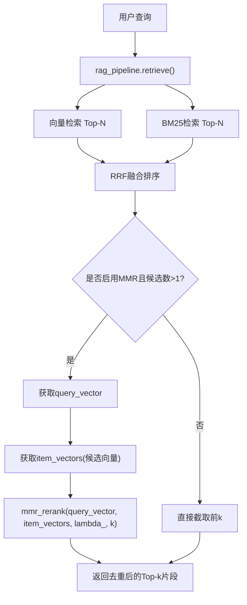
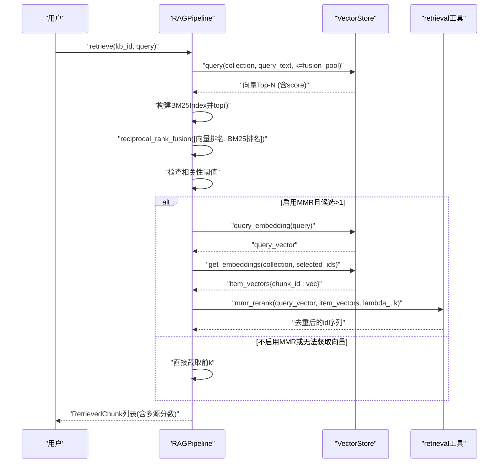
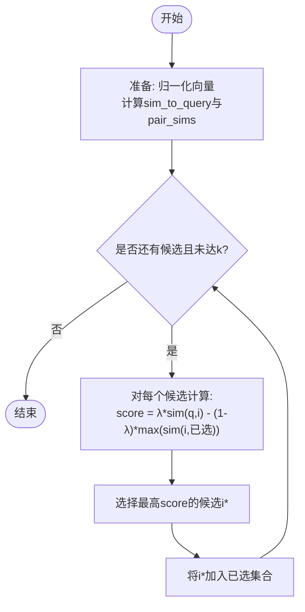
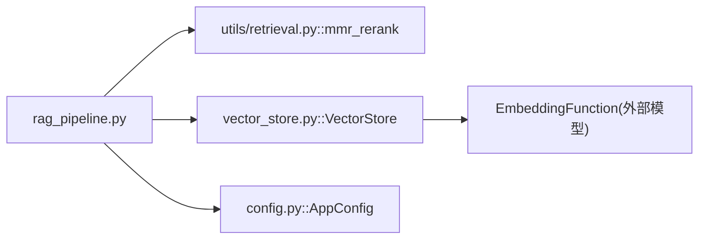

# MMR去重算法

<cite>
**本文引用的文件**
- [README.md](file://README.md)
- [config.py](file://config.py)
- [utils/retrieval.py](file://utils/retrieval.py)
- [rag_pipeline.py](file://rag_pipeline.py)
- [vector_store.py](file://vector_store.py)
- [tests/test_retrieval.py](file://tests/test_retrieval.py)
- [docs/LEARNING_GUIDE.md](file://docs/LEARNING_GUIDE.md)
</cite>

## 目录
1. [简介](#简介)
2. [项目结构](#项目结构)
3. [核心组件](#核心组件)
4. [架构总览](#架构总览)
5. [详细组件分析](#详细组件分析)
6. [依赖关系分析](#依赖关系分析)
7. [性能与调优](#性能与调优)
8. [故障排查](#故障排查)
9. [结论](#结论)
10. [附录：API调用示例与参数建议](#附录api调用示例与参数建议)

## 简介
本技术文档聚焦于本项目中的MMR（最大边际相关性）去重重排算法，系统阐述其核心思想、lambda参数的作用机制、query_vector与item_vectors的获取方式，并结合工程实现给出API调用路径、参数调优建议、评估指标与性能优化技巧。该能力在混合检索（向量+BM25）之后对候选片段进行去重与多样性增强，避免Top-K结果高度重复，提升最终答案的信息密度与可解释性。

## 项目结构
- 检索管线位于 rag_pipeline.py，负责混合检索、阈值判断、可选MMR重排与结果组装。
- 工具模块 utils/retrieval.py 提供分词、BM25索引、RRF融合与MMR重排等纯Python实现。
- 向量存储 vector_store.py 封装Chroma，提供查询、批量入库、取回原始向量等方法，供MMR使用。
- 配置 config.py 集中暴露RETRIEVAL_MMR_ENABLED与RETRIEVAL_MMR_LAMBDA等开关与权重。
- 测试 tests/test_retrieval.py 覆盖MMR选择多样性的行为验证。
- 学习指南 docs/LEARNING_GUIDE.md 对MMR公式与实验方法做了通俗说明。

图表来源
- [rag_pipeline.py:483-503](file://rag_pipeline.py#L483-L503)
- [utils/retrieval.py:97-148](file://utils/retrieval.py#L97-L148)
- [vector_store.py:100-137](file://vector_store.py#L100-L137)

章节来源
- [README.md:116-134](file://README.md#L116-L134)

## 核心组件
- 混合检索与阈值控制：向量与BM25各自Top-N后通过RRF融合，若最佳向量相似度低于阈值且无BM25命中则直接返回空，避免幻觉。
- MMR重排：在融合后的候选集上，基于query_vector与item_vectors计算“相关性-冗余度”的平衡得分，迭代挑选直到达到k个。
- 配置项：RETRIEVAL_MMR_ENABLED决定是否启用MMR；RETRIEVAL_MMR_LAMBDA控制相关性与多样性的权重比例。

章节来源
- [rag_pipeline.py:483-503](file://rag_pipeline.py#L483-L503)
- [config.py:81-106](file://config.py#L81-L106)
- [docs/LEARNING_GUIDE.md:55-66](file://docs/LEARNING_GUIDE.md#L55-L66)

## 架构总览
下图展示从查询到最终返回片段的完整流程，重点标注MMR参与的位置及数据流向。

图表来源
- [rag_pipeline.py:483-503](file://rag_pipeline.py#L483-L503)
- [vector_store.py:100-137](file://vector_store.py#L100-L137)
- [utils/retrieval.py:97-148](file://utils/retrieval.py#L97-L148)

## 详细组件分析

### MMR重排算法实现
- 输入：query_vector（查询向量）、item_vectors（候选片段向量字典）、lambda_（相关性/多样性权重）、k（输出数量）。
- 过程：
  - 将query_vector与所有候选向量标准化为余弦相似度空间。
  - 预计算候选间相似度矩阵，对角线置负无穷以避免自相似。
  - 迭代选择：每轮从剩余候选中选取使“λ×与查询相似度 − (1−λ)×与已选的最大相似度”最大的候选加入集合，直至达到k。
- 输出：按选择顺序排列的候选id列表。

图表来源
- [utils/retrieval.py:109-148](file://utils/retrieval.py#L109-L148)

章节来源
- [utils/retrieval.py:109-148](file://utils/retrieval.py#L109-L148)
- [docs/LEARNING_GUIDE.md:55-66](file://docs/LEARNING_GUIDE.md#L55-L66)

### query_vector的计算方法
- 由 VectorStore.query_embedding(text) 调用底层EmbeddingFunction的embed_query得到。
- 在检索管线中，当启用MMR时，先对当前查询文本向量化，用于后续与候选向量计算相似度。

章节来源
- [vector_store.py:135-137](file://vector_store.py#L135-L137)
- [rag_pipeline.py:489-491](file://rag_pipeline.py#L489-L491)

### item_vectors的获取过程
- 在MMR阶段，先从RRF融合后的候选集中取出chunk_id列表，再调用 VectorStore.get_embeddings(collection, ids) 批量取回这些候选的原始向量，形成 {chunk_id: vector} 的映射。
- 若候选来自BM25兜底命中但向量库中不存在对应向量，则跳过MMR，直接截取前k。

章节来源
- [rag_pipeline.py:488-503](file://rag_pipeline.py#L488-L503)
- [vector_store.py:128-133](file://vector_store.py#L128-L133)

### 混合检索与MMR集成点
- 向量检索与BM25检索分别取Top-N，经RRF融合后得到候选集。
- 若最佳向量相似度低于阈值且无BM25命中，直接返回空，避免低质量结果。
- 若启用MMR且候选数大于1，则进入MMR重排；否则直接截取前k。

章节来源
- [rag_pipeline.py:483-503](file://rag_pipeline.py#L483-L503)

### 单元测试与行为验证
- 测试用例验证了MMR在较低lambda下更倾向多样性，能选择与已选结果差异更大的候选，而非仅看相关性。
- 同时覆盖了空输入场景，确保鲁棒性。

章节来源
- [tests/test_retrieval.py:48-61](file://tests/test_retrieval.py#L48-L61)

## 依赖关系分析
- rag_pipeline.py 依赖 utils.retrieval.mmr_rerank 与 vector_store.VectorStore。
- vector_store.py 依赖外部EmbeddingFunction（DashScope或Mock），并通过Chroma持久化向量。
- config.py 提供MMR开关与lambda默认值，贯穿检索管线。

图表来源
- [rag_pipeline.py:483-503](file://rag_pipeline.py#L483-L503)
- [utils/retrieval.py:109-148](file://utils/retrieval.py#L109-L148)
- [vector_store.py:100-137](file://vector_store.py#L100-L137)
- [config.py:81-106](file://config.py#L81-L106)

章节来源
- [rag_pipeline.py:483-503](file://rag_pipeline.py#L483-L503)
- [utils/retrieval.py:109-148](file://utils/retrieval.py#L109-L148)
- [vector_store.py:100-137](file://vector_store.py#L100-L137)
- [config.py:81-106](file://config.py#L81-L106)

## 性能与调优
- 时间复杂度：MMR每轮需遍历剩余候选并计算与已选的冗余度，整体近似O(k·n)，其中n为候选数，k为目标数量。可通过限制fusion_pool减少n，从而降低重排开销。
- 向量维度与批处理：embedding_batch_size影响批量向量化效率，过大可能触发外部服务限制（如DashScope单次最多20条），默认16留有余量。
- 阈值策略：合理设置RETRIEVAL_RELEVANCE_THRESHOLD可避免无关问题强行返回低质片段；结合BM25兜底可在向量弱命中时仍保留关键词强匹配的结果。
- lambda调参建议：
  - 高lambda（接近1）：强调与查询的相关性，适合术语精确匹配、领域内同质内容较多的场景。
  - 低lambda（接近0）：强调多样性，适合长文档、信息密度高的知识库，避免Top-K重复。
  - 默认0.7作为起点，可根据评测指标逐步微调。
- 评估指标建议：
  - hit@k / recall@k：衡量召回关键片段的能力。
  - 去重率：Top-K中重复片段的比例下降幅度。
  - 多样性度量：候选间平均相似度越低越好。
  - 下游回答质量：人工或自动评测（如关键词命中率、可溯源率）。

[本节为通用指导，不直接分析具体文件]

## 故障排查
- 现象：启用MMR后结果为空或异常少。
  - 排查：确认RETRIEVAL_MMR_ENABLED为true且候选数>1；检查向量库是否存在对应候选向量（BM25兜底命中文档若无向量会跳过MMR）。
  - 参考：[rag_pipeline.py:489-503](file://rag_pipeline.py#L489-L503)
- 现象：MMR效果不佳，结果仍高度重复。
  - 排查：降低RETRIEVAL_MMR_LAMBDA以增强多样性；增大fusion_pool以获得更多候选；检查embedding质量与维度。
  - 参考：[config.py:105-106](file://config.py#L105-L106)、[utils/retrieval.py:109-148](file://utils/retrieval.py#L109-L148)
- 现象：向量检索无命中但BM25有强命中。
  - 排查：这是预期兜底逻辑，应返回BM25结果；若未返回，检查阈值与BM25索引构建。
  - 参考：[rag_pipeline.py:483-486](file://rag_pipeline.py#L483-L486)、[tests/test_retrieval.py:64-80](file://tests/test_retrieval.py#L64-L80)

章节来源
- [rag_pipeline.py:483-503](file://rag_pipeline.py#L483-L503)
- [config.py:105-106](file://config.py#L105-L106)
- [utils/retrieval.py:109-148](file://utils/retrieval.py#L109-L148)
- [tests/test_retrieval.py:64-80](file://tests/test_retrieval.py#L64-L80)

## 结论
本项目将MMR作为混合检索后的去重重排步骤，有效缓解Top-K重复问题，提升答案信息密度与可解释性。通过合理的lambda调参与阈值控制，可在不同业务场景中平衡相关性与多样性。配合RRF融合与BM25兜底，系统在语义与词面两个层面均具备鲁棒性。

[本节为总结性内容，不直接分析具体文件]

## 附录：API调用示例与参数建议
- 启动服务与问答接口（FastAPI）：
  - 启动：uvicorn api:app --host 0.0.0.0 --port 8000
  - 问答：POST /v1/chat，请求体包含question与kb_id，支持Bearer Token鉴权。
  - 参考：[README.md:50-65](file://README.md#L50-L65)
- 关键环境变量（与MMR相关）：
  - RETRIEVAL_MMR_ENABLED：是否启用MMR去重重排（默认true）。
  - RETRIEVAL_MMR_LAMBDA：MMR多样性权重（默认0.7，越大越看重相关性）。
  - 参考：[README.md:107-108](file://README.md#L107-L108)、[config.py:105-106](file://config.py#L105-L106)
- 参数调优建议：
  - 初始使用默认lambda=0.7，观察Top-K重复度与下游回答质量。
  - 若重复度高，逐步降低lambda至0.5~0.6；若多样性过高导致相关性下降，提高lambda至0.8~0.9。
  - 调整fusion_pool以改变候选规模，进而影响MMR的多样性潜力与计算成本。
  - 结合RETRIEVAL_RELEVANCE_THRESHOLD避免低质结果进入下游。
- 评估实践：
  - 使用evals/run_eval.py进行离线/在线评测，关注hit@k、关键词命中率与可溯源率。
  - 对比开启/关闭MMR的效果，记录去重率与多样性指标变化。
  - 参考：[README.md:67-72](file://README.md#L67-L72)

章节来源
- [README.md:50-72](file://README.md#L50-L72)
- [config.py:105-106](file://config.py#L105-L106)