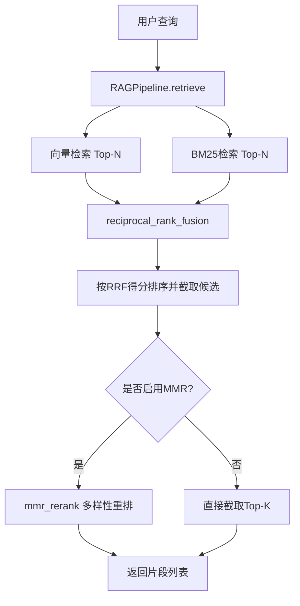
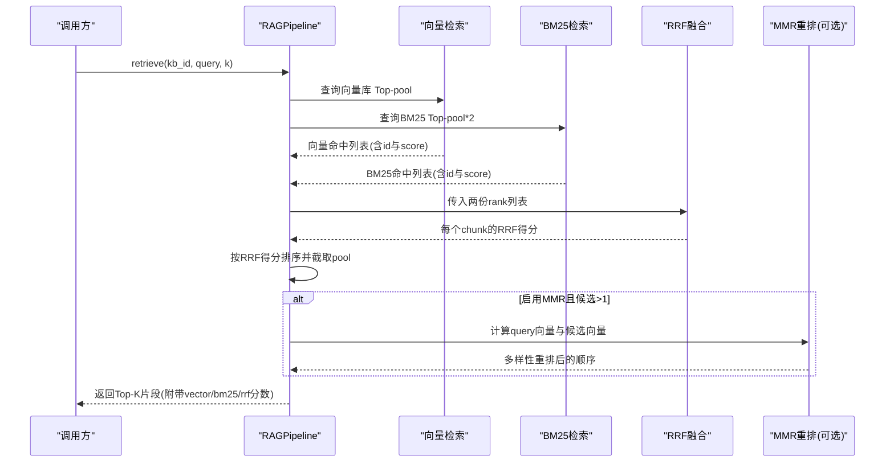
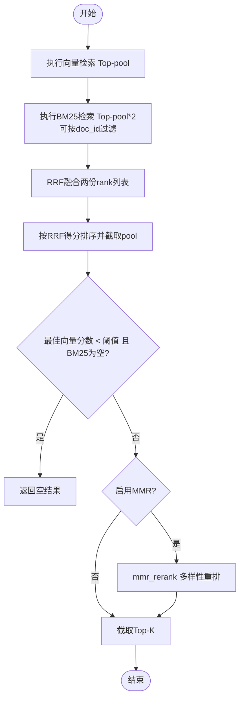
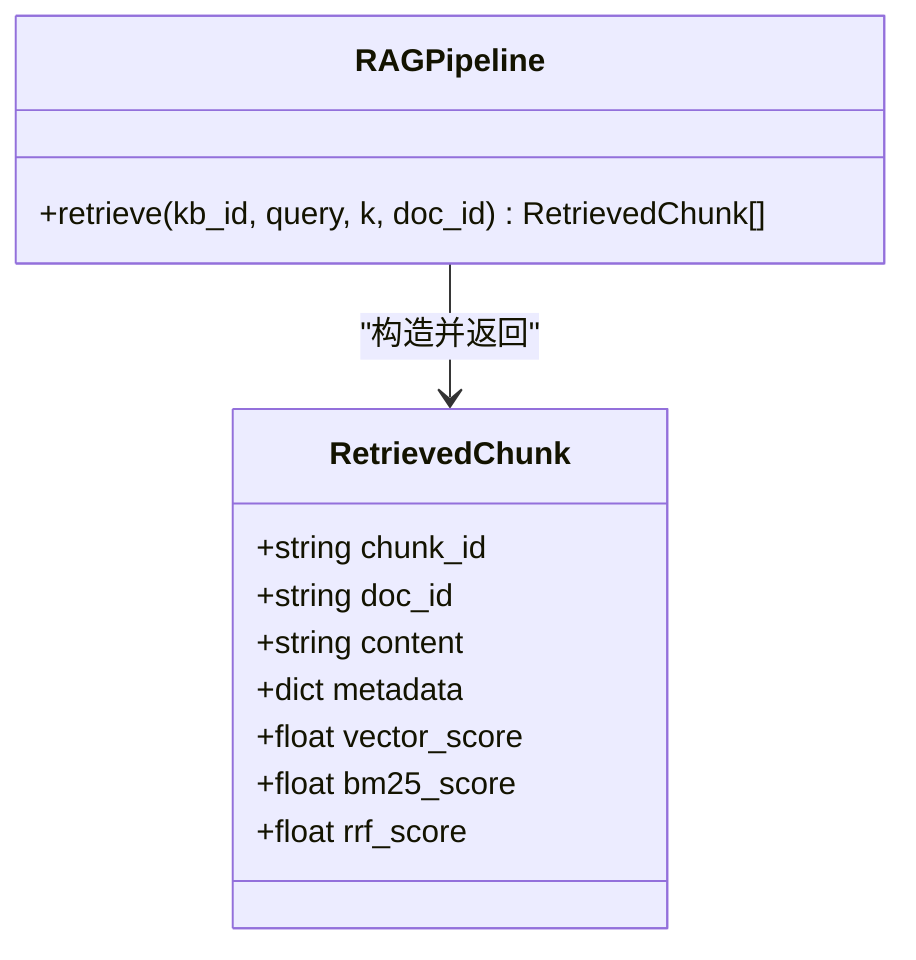
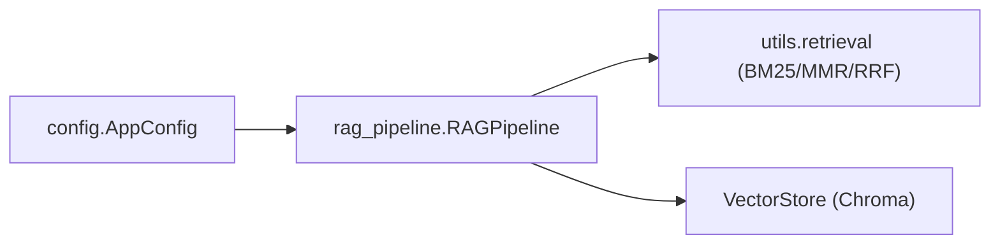

# RRF融合算法

<cite>
**本文引用的文件**
- [rag_pipeline.py](file://rag_pipeline.py)
- [config.py](file://config.py)
- [test_retrieval.py](file://tests/test_retrieval.py)
- [LEARNING_GUIDE.md](file://docs/LEARNING_GUIDE.md)
</cite>

## 目录
1. [简介](#简介)
2. [项目结构](#项目结构)
3. [核心组件](#核心组件)
4. [架构总览](#架构总览)
5. [详细组件分析](#详细组件分析)
6. [依赖关系分析](#依赖关系分析)
7. [性能考量](#性能考量)
8. [故障排查指南](#故障排查指南)
9. [结论](#结论)
10. [附录](#附录)

## 简介
本技术文档聚焦于项目中用于混合检索的倒数排名融合（RRF）算法，系统阐述其数学原理、权重策略与排序稳定性，并结合向量检索与BM25检索的融合流程，给出实现要点、参数调优建议与效果对比思路。文档同时覆盖相关性阈值兜底、MMR去重等工程实践，帮助读者在真实RAG系统中稳定落地RRF。

## 项目结构
本项目将检索与融合逻辑集中在管线层，并通过配置集中管理可调参数：
- 检索与融合入口：RAGPipeline.retrieve 负责向量检索、BM25检索、RRF融合与可选MMR重排。
- 配置中心：AppConfig 提供融合候选池大小、最终返回数、相关性阈值、MMR开关与权重等关键参数。
- 测试与学习材料：单元测试验证RRF融合行为；学习指南说明混合检索思想与公式。

图表来源
- [rag_pipeline.py:439-523](file://rag_pipeline.py#L439-L523)
- [config.py:90-112](file://config.py#L90-L112)

章节来源
- [rag_pipeline.py:439-523](file://rag_pipeline.py#L439-L523)
- [config.py:90-112](file://config.py#L90-L112)

## 核心组件
- 混合检索入口 retrieve：从向量库与BM25索引分别取候选，使用RRF合并排名，再根据配置进行阈值过滤与可选MMR重排，最后组装带三种分数（向量、BM25、RRF）的结果对象。
- 配置 AppConfig：集中定义融合候选池大小 fusion_pool、最终返回数 top_k、相关性阈值 relevance_threshold、MMR开关 mmr_enabled 与权重 mmr_lambda 等。
- 学习与测试：学习指南给出RRF公式与混合检索思想；单元测试验证RRF对共同高排名的放大效应。

章节来源
- [rag_pipeline.py:439-523](file://rag_pipeline.py#L439-L523)
- [config.py:90-112](file://config.py#L90-L112)
- [LEARNING_GUIDE.md:38-53](file://docs/LEARNING_GUIDE.md#L38-L53)
- [test_retrieval.py:40-45](file://tests/test_retrieval.py#L40-L45)

## 架构总览
下图展示一次检索请求从输入到输出的完整数据流，突出RRF在融合阶段的作用位置。

图表来源
- [rag_pipeline.py:439-523](file://rag_pipeline.py#L439-L523)

## 详细组件分析

### RRF数学原理与权重策略
- 基本思想：不直接使用原始分数，而是基于“排名”计算贡献，越靠前贡献越大。常见形式为对每个检索器中某项的排名 r 计算 1/(k + r)，其中 k 为平滑常数，避免除零并控制尾部影响。
- 多检索器融合：对同一候选在所有检索器中的贡献求和，得到最终RRF得分；相同候选在多列表中均靠前时，得分显著更高。
- 权重分配策略：当前实现以平等权重聚合各检索器的排名贡献（即简单相加）。若需强调某一检索器，可在各自贡献前乘以权重系数，或在构建rank列表时通过重复/截断间接体现偏好。
- 排序稳定性：由于仅依赖相对排名，不同检索器之间的分数尺度差异不会影响融合结果；当多个候选在不同检索器中出现多次时，RRF能稳健地提升其综合得分。

章节来源
- [LEARNING_GUIDE.md:38-53](file://docs/LEARNING_GUIDE.md#L38-L53)
- [test_retrieval.py:40-45](file://tests/test_retrieval.py#L40-L45)

### 混合检索中的RRF应用
- 向量检索：获取Top-pool的chunk id序列作为一份rank列表。
- BM25检索：获取Top-pool*2的chunk id与分数序列，必要时按doc_id限定范围后取Top-pool作为另一份rank列表。
- 融合计算：将两份rank列表传入RRF函数，得到每个chunk的RRF得分；随后按得分降序排序并截取pool个候选。
- 阈值兜底：若最佳向量相似度低于配置的阈值且BM25无命中，则视为无相关内容，直接返回空结果，避免模型“编造”。
- 可选MMR重排：若启用，则以query向量与候选向量计算多样性得分，进一步降低重复内容的影响。

图表来源
- [rag_pipeline.py:439-523](file://rag_pipeline.py#L439-L523)

章节来源
- [rag_pipeline.py:439-523](file://rag_pipeline.py#L439-L523)

### 参数与配置
- 融合候选池大小 fusion_pool：决定参与融合的候选数量，增大可提升召回但增加计算成本。
- 最终返回数 top_k：进入LLM上下文前的最终片段数。
- 相关性阈值 relevance_threshold：向量相似度门槛，低于该值且无BM25命中时直接返回空，减少无关回答。
- MMR开关 mmr_enabled 与权重 mmr_lambda：控制是否进行多样性重排及多样性与相关性的权衡。
- 这些参数均可通过环境变量覆盖，便于部署期调优。

章节来源
- [config.py:90-112](file://config.py#L90-L112)

### 代码级流程与数据结构
- 检索结果封装 RetrievedChunk：包含chunk_id、doc_id、content、metadata以及三种分数 vector_score、bm25_score、rrf_score，便于评估与调试。
- 融合与重排：retrieve 中先融合再重排，确保最终输出既兼顾相关性又具备多样性。

图表来源
- [rag_pipeline.py:134-145](file://rag_pipeline.py#L134-L145)
- [rag_pipeline.py:439-523](file://rag_pipeline.py#L439-L523)

章节来源
- [rag_pipeline.py:134-145](file://rag_pipeline.py#L134-L145)
- [rag_pipeline.py:439-523](file://rag_pipeline.py#L439-L523)

## 依赖关系分析
- 模块耦合：
  - rag_pipeline.py 依赖 utils.retrieval 提供的 BM25Index、mmr_rerank、reciprocal_rank_fusion。
  - config.py 提供统一配置，被 rag_pipeline.py 读取以控制检索行为。
- 外部依赖：
  - 向量库（Chroma）与BM25索引为外部检索后端，RRF在其之上进行跨检索器融合。
- 循环依赖：未见循环导入；检索与融合职责清晰分离。

图表来源
- [rag_pipeline.py:27-38](file://rag_pipeline.py#L27-L38)
- [config.py:90-112](file://config.py#L90-L112)

章节来源
- [rag_pipeline.py:27-38](file://rag_pipeline.py#L27-L38)
- [config.py:90-112](file://config.py#L90-L112)

## 性能考量
- 候选池大小：fusion_pool 越大，RRF融合的计算量越高，但可能提升召回；建议在保证延迟的前提下逐步增大。
- 阈值过滤：合理设置 relevance_threshold 可减少无效上下文，降低LLM负担。
- MMR重排：开启MMR会增加一次向量相似度计算，但在长上下文中能有效降低重复，提高信息密度。
- 缓存与失效：BM25索引与chunks映射采用惰性构建与失效标记，避免重复重建。

[本节为通用指导，不直接分析具体文件]

## 故障排查指南
- 无相关内容返回空：检查相关性阈值与BM25命中情况；若向量分数低且无BM25命中，将返回空结果以避免幻觉。
- 结果重复度高：开启MMR或调整 mmr_lambda，使多样性权重更大。
- 融合效果不稳定：适当增大 fusion_pool，让更多候选参与融合；确认两份rank列表长度与质量。
- 精确匹配被误杀：纯关键词查询下，即使向量分数低于阈值，若有BM25强命中仍会放行；可通过日志观察bm25_score与rrf_score定位问题。

章节来源
- [rag_pipeline.py:483-523](file://rag_pipeline.py#L483-L523)
- [test_retrieval.py:64-80](file://tests/test_retrieval.py#L64-L80)

## 结论
本项目在混合检索中采用RRF融合向量与BM25的排名结果，具有对绝对分数不敏感、对排序位置敏感、能有效结合不同检索器优势的特点。配合相关性阈值与MMR重排，能够在保证召回的同时提升上下文质量与多样性。通过集中配置与环境变量覆盖，便于在不同场景下进行参数调优与效果对比。

[本节为总结性内容，不直接分析具体文件]

## 附录

### 参数调优指南与效果对比思路
- 基线：使用默认配置（top_k=5，fusion_pool=12，relevance_threshold=0.3，MMR开启且lambda=0.7）。
- 扩大候选池：增大 fusion_pool，观察召回变化与延迟影响。
- 调整阈值：提高 relevance_threshold 以减少误召回；降低以提升召回但可能引入噪声。
- 关闭MMR：对比开启与关闭MMR下的重复度与信息密度。
- 权重策略：如需强调某一检索器，可在各自rank列表上通过重复条目或截断策略间接体现偏好；或在融合函数中引入加权求和（需扩展实现）。
- 评测方法：使用现有评测脚本统计 hit@k、keyword_hit、citation 等指标，比较不同配置下的端到端表现。

章节来源
- [config.py:90-112](file://config.py#L90-L112)
- [LEARNING_GUIDE.md:38-53](file://docs/LEARNING_GUIDE.md#L38-L53)
- [evals/README.md:1-24](file://evals/README.md#L1-L24)