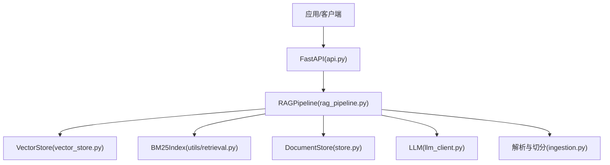
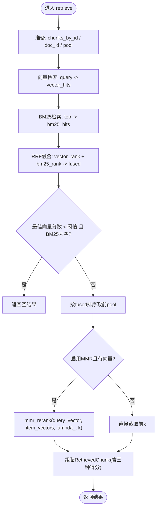
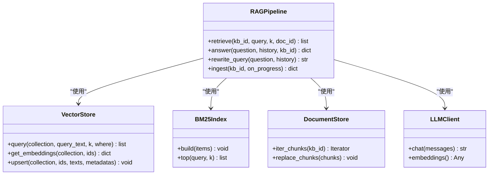

# 检索流程编排

<cite>
**本文引用的文件**
- [rag_pipeline.py](file://rag_pipeline.py)
- [vector_store.py](file://vector_store.py)
- [store.py](file://store.py)
- [utils/retrieval.py](file://utils/retrieval.py)
- [ingestion.py](file://ingestion.py)
- [llm_client.py](file://llm_client.py)
- [config.py](file://config.py)
- [api.py](file://api.py)
</cite>

## 目录
1. [简介](#简介)
2. [项目结构](#项目结构)
3. [核心组件](#核心组件)
4. [架构总览](#架构总览)
5. [详细组件分析](#详细组件分析)
6. [依赖关系分析](#依赖关系分析)
7. [性能考量](#性能考量)
8. [故障排查指南](#故障排查指南)
9. [结论](#结论)
10. [附录：调用示例与调试方法](#附录调用示例与调试方法)

## 简介
本技术文档围绕混合检索的完整流程编排展开，重点解释 retrieve 方法的执行路径：查询改写 → 向量检索 → BM25 检索 → RRF 融合 → MMR 重排 → 结果过滤。文档详细说明各阶段输入输出数据格式（特别是 RetrievedChunk）、中间结果传递机制、并行处理策略（当前为顺序执行但具备并发扩展点）、错误处理与降级策略，并提供调用示例、调试方法与性能优化建议。

## 项目结构
- 管线门面与检索编排：RAGPipeline 提供知识库管理、入库、检索、问答等能力；retrieve 是混合检索的核心入口。
- 向量存储：VectorStore 封装 Chroma，负责批量 upsert、相似度查询、获取嵌入向量以支持 MMR。
- 元数据存储：DocumentStore 基于 SQLite，维护知识库、文档、片段与配置。
- 检索工具：BM25Index、RRF、MMR 实现纯 Python 的关键词检索、排名融合与多样性重排。
- 解析与切分：ingestion 将多格式文档解析并切分为片段，生成带来源信息的元数据。
- LLM 客户端：DashScopeClient 统一聊天/嵌入接口，提供安全封装与异常转换。
- 配置：AppConfig 集中读取环境变量，控制检索参数、上下文长度、批大小等。
- API 层：FastAPI 暴露服务，串联 Agent/RAGPipeline，便于端到端测试与集成。



图表来源
- [api.py:185-199](file://api.py#L185-L199)
- [rag_pipeline.py:196-523](file://rag_pipeline.py#L196-L523)
- [vector_store.py:38-148](file://vector_store.py#L38-L148)
- [utils/retrieval.py:48-148](file://utils/retrieval.py#L48-L148)
- [store.py:123-470](file://store.py#L123-L470)
- [ingestion.py:24-216](file://ingestion.py#L24-L216)
- [llm_client.py:22-127](file://llm_client.py#L22-L127)

章节来源
- [api.py:1-204](file://api.py#L1-L204)
- [rag_pipeline.py:1-792](file://rag_pipeline.py#L1-L792)
- [vector_store.py:1-255](file://vector_store.py#L1-L255)
- [store.py:1-470](file://store.py#L1-L470)
- [utils/retrieval.py:1-148](file://utils/retrieval.py#L1-L148)
- [ingestion.py:1-216](file://ingestion.py#L1-L216)
- [llm_client.py:1-322](file://llm_client.py#L1-L322)
- [config.py:1-113](file://config.py#L1-L113)

## 核心组件
- RAGPipeline：检索编排中心，包含 retrieve、answer、rewrite_query、ingest 等方法；维护 BM25 索引缓存与片段缓存，支持按知识库隔离。
- VectorStore：Chroma 封装，提供 upsert/query/get_embeddings 等，使用余弦空间，支持批量向量化与条件删除。
- DocumentStore：SQLite 持久化，维护 kb/document/chunks/meta，提供迭代器与原子更新。
- utils.retrieval：BM25Index（中文分词+BM25Okapi）、reciprocal_rank_fusion（RRF）、mmr_rerank（MMR）。
- ingestion：DocumentParser 与 split_documents，构建 chunk 元数据（source/page/paragraph 等）。
- llm_client：DashScopeClient，统一 chat/embeddings/stream 接口，异常安全包装。
- config：AppConfig 集中配置检索阈值、top_k、fusion_pool、MMR 开关与 lambda、上下文 token 预算等。

章节来源
- [rag_pipeline.py:134-523](file://rag_pipeline.py#L134-L523)
- [vector_store.py:30-148](file://vector_store.py#L30-L148)
- [store.py:88-470](file://store.py#L88-L470)
- [utils/retrieval.py:34-148](file://utils/retrieval.py#L34-L148)
- [ingestion.py:24-216](file://ingestion.py#L24-L216)
- [llm_client.py:22-127](file://llm_client.py#L22-L127)
- [config.py:56-113](file://config.py#L56-L113)

## 架构总览
下图展示 retrieve 从入口到最终结果的完整调用链，包括查询改写、向量检索、BM25 检索、RRF 融合、MMR 重排与结果过滤。

```mermaid
sequenceDiagram
participant U as "调用方"
participant P as "RAGPipeline"
participant V as "VectorStore"
participant B as "BM25Index"
participant S as "DocumentStore"
participant R as "retrieval工具"
U->>P : retrieve(kb_id, query, k, doc_id?)
P->>P : _chunks_map(kb_id) 加载片段缓存
alt 未指定doc_id
P->>P : _source_hint(query, docs) 推断目标文档
end
P->>V : query(collection, query, k=pool, where?)
V-->>P : vector_hits[VectorHit]
P->>B : top(query, k=pool*2)
B-->>P : bm25_hits[(chunk_id, score)]
P->>R : reciprocal_rank_fusion([vector_rank, bm25_rank])
R-->>P : fused_scores
P->>P : 相关性门槛判断(向量最佳分数 vs threshold + BM25命中)
opt 启用MMR
P->>V : query_embedding(query), get_embeddings(selected)
P->>R : mmr_rerank(query_vector, item_vectors, lambda_, k)
R-->>P : selected_ids
else 不启用或无向量
P->>P : 直接截取前k
end
P->>S : 通过chunk_id取回content/metadata
P-->>U : list[RetrievedChunk]
```

图表来源
- [rag_pipeline.py:439-523](file://rag_pipeline.py#L439-L523)
- [vector_store.py:100-137](file://vector_store.py#L100-L137)
- [utils/retrieval.py:71-148](file://utils/retrieval.py#L71-L148)
- [store.py:425-442](file://store.py#L425-L442)

## 详细组件分析

### 数据模型与中间结果
- RetrievedChunk：一次检索命中的片段，携带 chunk_id、doc_id、content、metadata，以及三种得分 vector_score、bm25_score、rrf_score，便于评估与调试。
- VectorHit：向量检索返回的结构，包含 id、text、metadata、score（余弦相似度）。
- Chunk：片段实体，包含 id、doc_id、kb_id、chunk_index、content、metadata，用于 BM25 重建与内容回填。
- 中间结果传递：
  - 向量检索返回 hits，提取 id 列表作为 vector_rank。
  - BM25 返回 (chunk_id, score)，提取 chunk_id 列表作为 bm25_rank。
  - RRF 融合得到 {chunk_id: rrf_score}。
  - MMR 重排后得到 selected_ids。
  - 最终根据 selected_ids 从 chunks_by_id 取回 content/metadata，并填充三种得分形成 RetrievedChunk 列表。

章节来源
- [rag_pipeline.py:134-145](file://rag_pipeline.py#L134-L145)
- [vector_store.py:30-36](file://vector_store.py#L30-L36)
- [store.py:113-121](file://store.py#L113-L121)
- [rag_pipeline.py:468-523](file://rag_pipeline.py#L468-L523)

### 检索流程详解（retrieve）
- 输入：
  - kb_id：知识库标识
  - query：用户问题（可能由 rewrite_query 改写）
  - k：最终返回片段数
  - doc_id：可选，限定检索范围（来自 _source_hint 或外部传入）
- 步骤：
  1) 准备阶段：
     - 获取片段映射 chunks_by_id（惰性加载并缓存，失效时重建）。
     - 若未指定 doc_id，尝试根据问题中的文件名/人物短名推断。
     - 计算 pool = max(k, fusion_pool)，用于扩大候选集。
  2) 向量检索：
     - 调用 VectorStore.query，返回 vector_hits，提取 vector_rank。
  3) BM25 检索：
     - 通过 _bm25_index 获取或重建 BM25Index，调用 top 获取 bm25_hits。
     - 若限定了 doc_id，则过滤仅保留该文档的 chunk_id。
  4) RRF 融合：
     - 对 vector_rank 与 bm25_rank 做 reciprocal_rank_fusion，得到 fused 分数。
  5) 相关性门槛：
     - 若最佳向量分数低于 relevance_threshold 且 BM25 无命中，直接返回空结果。
  6) 候选选择与 MMR 重排：
     - 按 fused 分数排序取前 pool。
     - 若启用 MMR，获取 query_vector 与候选 item_vectors，调用 mmr_rerank 重排并截取前 k。
     - 若无向量（BM25 兜底命中），直接截取前 k。
  7) 结果组装：
     - 根据 selected_ids 从 chunks_by_id 取回片段，填充三种得分，构造 RetrievedChunk 列表返回。



图表来源
- [rag_pipeline.py:439-523](file://rag_pipeline.py#L439-L523)
- [utils/retrieval.py:97-148](file://utils/retrieval.py#L97-L148)

章节来源
- [rag_pipeline.py:439-523](file://rag_pipeline.py#L439-L523)

### 查询改写（rewrite_query）
- 目的：在多轮对话中把追问题改写成独立、明确的问题，避免历史噪声影响检索。
- 策略：
  - 截断历史至最近若干条（受 history_max_tokens 限制）。
  - 构造提示词，调用 LLM.chat（temperature=0，关闭思考）进行改写。
  - 护栏：改写结果过长或为空时退回原问题。
- 失败恢复：任何异常均返回原始问题，保证检索链路不断裂。

章节来源
- [rag_pipeline.py:566-588](file://rag_pipeline.py#L566-L588)
- [llm_client.py:94-127](file://llm_client.py#L94-L127)

### 向量检索（VectorStore.query）
- 功能：将查询文本向量化，在指定 collection 中按余弦相似度检索 Top-K。
- 关键点：
  - 使用 cosine 空间（distance = 1 - 相似度）。
  - include documents/metadatas/distances，转换为 VectorHit 列表。
  - 支持 where 条件过滤（如 doc_id）。
- 性能：batch_size 控制向量化批次，避免单次请求过大。

章节来源
- [vector_store.py:100-126](file://vector_store.py#L100-L126)
- [config.py:95-111](file://config.py#L95-L111)

### BM25 检索（BM25Index.top）
- 功能：中文分词 + BM25Okapi 打分，返回 [(chunk_id, score)]。
- 特性：
  - 停用词过滤，避免虚词干扰。
  - 全零得分时的兜底：退化为“查询词重叠数”排序，适配极小语料库场景。
- 重建：按需构建，结合 chunks_by_id 增量更新。

章节来源
- [utils/retrieval.py:34-95](file://utils/retrieval.py#L34-L95)
- [rag_pipeline.py:550-556](file://rag_pipeline.py#L550-L556)

### RRF 融合（reciprocal_rank_fusion）
- 原理：对每个列表中的 item 按排名贡献 1/(k+rank)，汇总得到融合分数。
- 优势：无需对齐不同检索器的得分尺度，鲁棒性强。

章节来源
- [utils/retrieval.py:97-106](file://utils/retrieval.py#L97-L106)

### MMR 重排（mmr_rerank）
- 目标：在相关性与多样性之间平衡，避免 Top-K 重复片段。
- 公式：每轮选择 λ × 与查询相似度 − (1−λ) × 与已选最大相似度 最大的候选。
- 适用：当候选存在向量表示时使用；若缺失向量（BM25 兜底命中），直接截取。

章节来源
- [utils/retrieval.py:109-148](file://utils/retrieval.py#L109-L148)
- [rag_pipeline.py:489-501](file://rag_pipeline.py#L489-L501)

### 结果过滤与降级
- 相关性门槛：若最佳向量分数低于阈值且 BM25 无命中，返回空结果，避免无关答案。
- 降级策略：
  - BM25 兜底：即使向量分数低，只要 BM25 强命中仍放行。
  - MMR 缺失向量：无法计算多样性时，直接截取前 k。
  - 改写失败：返回原问题，继续检索。
  - 问答失败：返回友好提示与空 sources。

章节来源
- [rag_pipeline.py:483-501](file://rag_pipeline.py#L483-L501)
- [rag_pipeline.py:597-666](file://rag_pipeline.py#L597-L666)

### 并行处理策略
- 当前实现：retrieve 内向量检索与 BM25 检索为顺序调用，非并发。
- 并发扩展点：
  - 可在调用层使用线程池或 asyncio.gather 并发执行向量检索与 BM25 检索，再合并结果。
  - 注意共享状态（如 BM25Index 构建、chunks_by_id 缓存）需加锁或副本隔离。
  - 向量检索与 BM25 检索互不依赖，适合并发；RRF 与 MMR 必须在两者完成后串行执行。
- 时序控制：
  - 先收集两份 rank 列表，再进行 RRF 融合。
  - MMR 需要候选向量，需在融合后按需获取。

章节来源
- [rag_pipeline.py:468-501](file://rag_pipeline.py#L468-L501)
- [vector_store.py:100-137](file://vector_store.py#L100-L137)
- [utils/retrieval.py:71-148](file://utils/retrieval.py#L71-L148)

### 错误处理与异常恢复
- 入库异常：单个文档解析/向量化失败记录 errors，不影响其他文档；下次 ingest 自动重试。
- 检索异常：
  - 向量检索失败：上层捕获并降级为 BM25 兜底或返回空。
  - BM25 失败：返回空列表，交由 RRF 与后续逻辑处理。
  - MMR 失败：跳过重排，直接截取。
- 问答异常：返回“服务暂时不可用”提示与空 sources，保证 UI 稳定。
- 安全封装：safe_error 隐藏堆栈，保留可排障原因。

章节来源
- [rag_pipeline.py:415-435](file://rag_pipeline.py#L415-L435)
- [rag_pipeline.py:597-666](file://rag_pipeline.py#L597-L666)
- [llm_client.py:297-299](file://llm_client.py#L297-L299)

## 依赖关系分析
- RAGPipeline 依赖：
  - VectorStore：向量检索与嵌入获取。
  - BM25Index：关键词检索。
  - DocumentStore：片段与元数据存取。
  - LLMClient：查询改写与问答。
  - ingestion：解析与切分。
- 配置驱动：AppConfig 控制检索阈值、top_k、fusion_pool、MMR 开关与 lambda、上下文 token 预算、embedding 批大小等。
- API 层：FastAPI 路由调用 agent.run，内部走 RAGPipeline.retrieve。



图表来源
- [rag_pipeline.py:196-523](file://rag_pipeline.py#L196-L523)
- [vector_store.py:38-148](file://vector_store.py#L38-L148)
- [utils/retrieval.py:48-148](file://utils/retrieval.py#L48-L148)
- [store.py:123-470](file://store.py#L123-L470)
- [llm_client.py:22-127](file://llm_client.py#L22-L127)

章节来源
- [rag_pipeline.py:196-523](file://rag_pipeline.py#L196-L523)
- [vector_store.py:38-148](file://vector_store.py#L38-L148)
- [utils/retrieval.py:48-148](file://utils/retrieval.py#L48-L148)
- [store.py:123-470](file://store.py#L123-L470)
- [llm_client.py:22-127](file://llm_client.py#L22-L127)

## 性能考量
- 向量检索：
  - 调整 embedding_batch_size 避免 API 限制（默认 16，上限 20）。
  - 使用 where 条件缩小检索范围（如限定 doc_id）。
- BM25 检索：
  - 仅在必要时重建索引（_bm25_stale 标记），减少重复构建开销。
  - 小语料库下 IDF 可能为零，内置兜底排序提升召回。
- RRF 融合：
  - 通过 fusion_pool 扩大候选集，提高最终 Top-K 质量。
- MMR 重排：
  - 仅在启用且候选数量大于 1 时执行，避免不必要计算。
  - 缺失向量时降级为简单截取，保证可用性。
- 上下文裁剪：
  - fit_context_indices 与 truncate_history 控制 token 预算，降低 LLM 成本与延迟。
- 监控指标建议：
  - 向量检索耗时、BM25 检索耗时、RRF 融合耗时、MMR 耗时。
  - 命中率（向量最佳分数、BM25 命中数）、融合后 Top-K 分布。
  - 上下文 token 数、LLM 调用 token 用量（last_usage）。

章节来源
- [config.py:95-111](file://config.py#L95-L111)
- [rag_pipeline.py:181-193](file://rag_pipeline.py#L181-L193)
- [rag_pipeline.py:489-501](file://rag_pipeline.py#L489-L501)
- [llm_client.py:48-57](file://llm_client.py#L48-L57)

## 故障排查指南
- 检索结果为空：
  - 检查 relevance_threshold 是否过高；确认 BM25 是否有命中。
  - 验证 chunks_by_id 是否加载成功（_chunks_stale 标记是否正确清理）。
- 向量检索失败：
  - 检查 Embedding 模型配置与网络连通性；查看 safe_error 输出。
  - 确认 collection 是否存在且 count > 0。
- BM25 无命中：
  - 检查分词结果与停用词；确认索引已重建（_bm25_stale 标记）。
- MMR 未生效：
  - 确认 mmr_enabled 为 true；检查 item_vectors 是否获取成功。
- 问答服务不可用：
  - 查看异常信息；确认 DASHSCOPE_API_KEY 与 base_url 配置正确。
- 日志与调试：
  - 使用 api.py 的 /health 检查服务健康。
  - 通过 kb_stats 查看文档与片段数量。
  - 在 retrieve 前后打印关键中间变量（vector_hits、bm25_hits、fused、selected）。

章节来源
- [rag_pipeline.py:483-501](file://rag_pipeline.py#L483-L501)
- [rag_pipeline.py:597-666](file://rag_pipeline.py#L597-L666)
- [api.py:98-100](file://api.py#L98-L100)
- [api.py:170-174](file://api.py#L170-L174)

## 结论
本方案通过“向量语义 + BM25 词面 + RRF 融合 + MMR 去重”的混合检索流程，兼顾召回与精度，并在多处设置降级与容错机制，确保系统在异常情况下仍可稳定运行。配置集中化与缓存机制提升了可维护性与性能。未来可引入并发检索与更细粒度的监控指标，进一步优化吞吐与延迟。

## 附录：调用示例与调试方法
- 基本调用（通过 API）：
  - POST /v1/chat，请求体包含 question、history、kb_id。
  - 响应包含 answer、sources、steps、kb_id。
- 本地脚本调用：
  - 初始化 RAGPipeline，调用 retrieve(kb_id, query, k, doc_id?) 获取 RetrievedChunk 列表。
  - 调用 answer(question, history, kb_id) 获取带引用回答。
- 调试要点：
  - 打印 RetrievedChunk 的三种得分，评估检索效果。
  - 调整 AppConfig 中的 top_k、fusion_pool、relevance_threshold、mmr_enabled、mmr_lambda。
  - 观察上下文裁剪后的 context_blocks 与 sources 数量，确保不超过 rag_context_max_tokens。
- 性能监控：
  - 记录各阶段耗时与 token 用量（last_usage）。
  - 对比开启/关闭 MMR 的效果差异。
  - 在不同融合池大小下评估召回率与准确率变化。

章节来源
- [api.py:185-199](file://api.py#L185-L199)
- [rag_pipeline.py:439-523](file://rag_pipeline.py#L439-L523)
- [rag_pipeline.py:590-666](file://rag_pipeline.py#L590-L666)
- [config.py:95-111](file://config.py#L95-L111)
- [llm_client.py:48-57](file://llm_client.py#L48-L57)