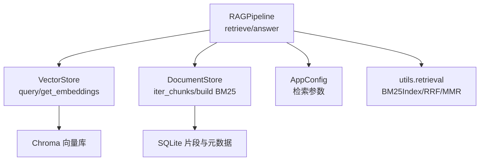
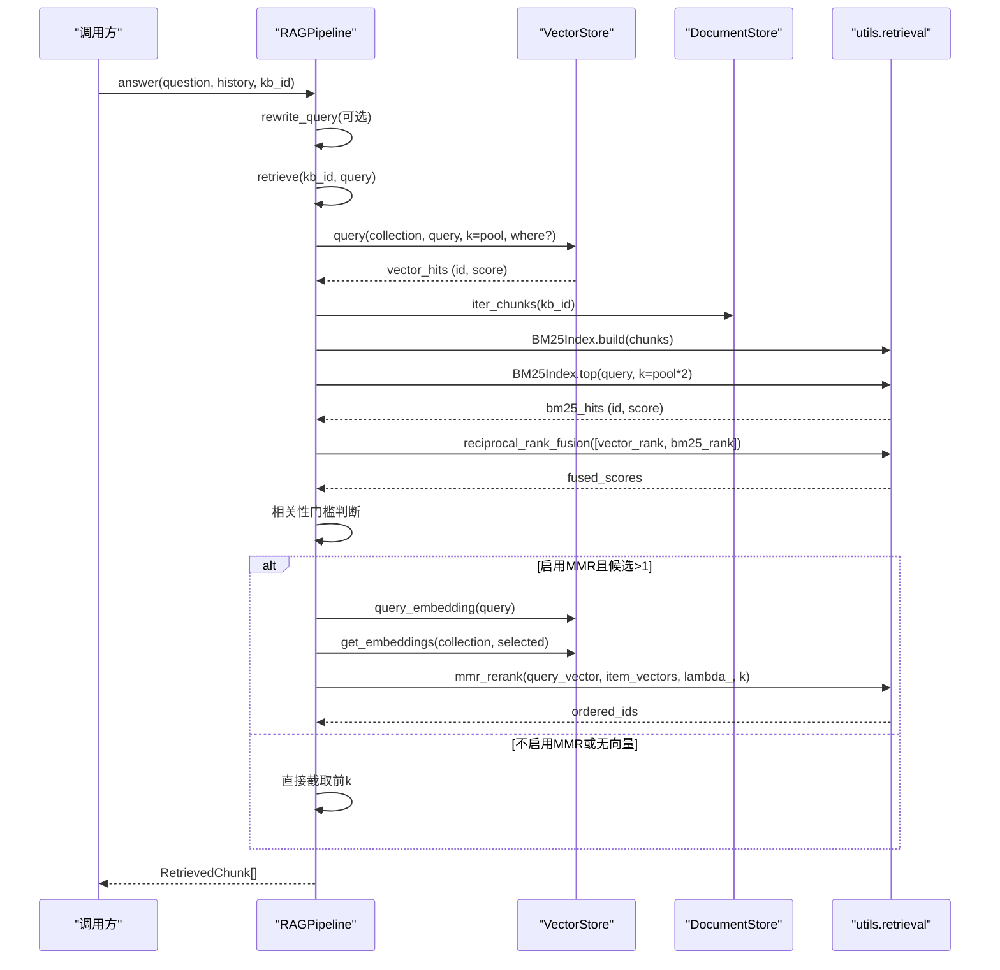
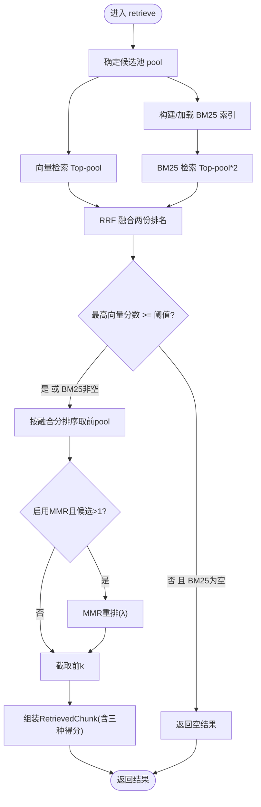
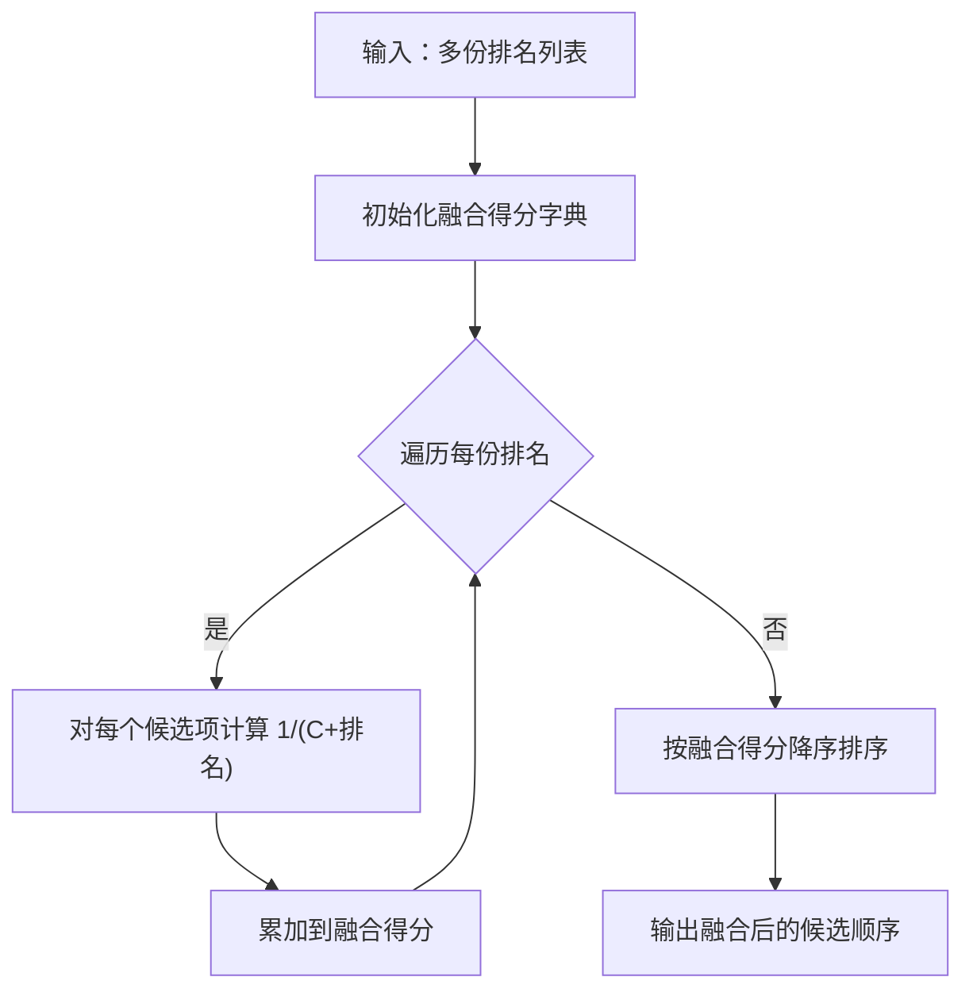
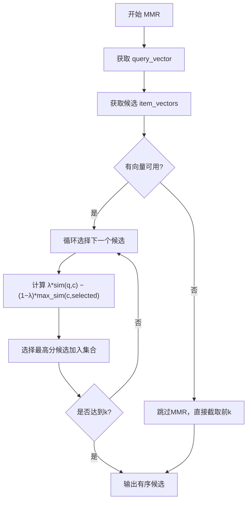
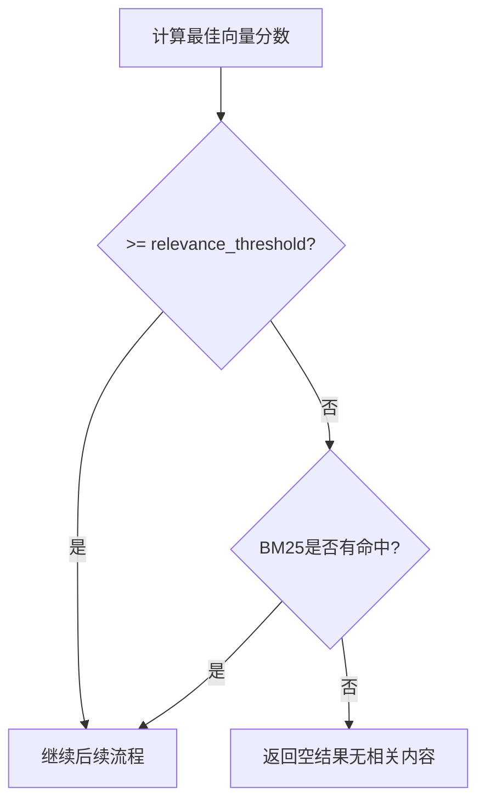
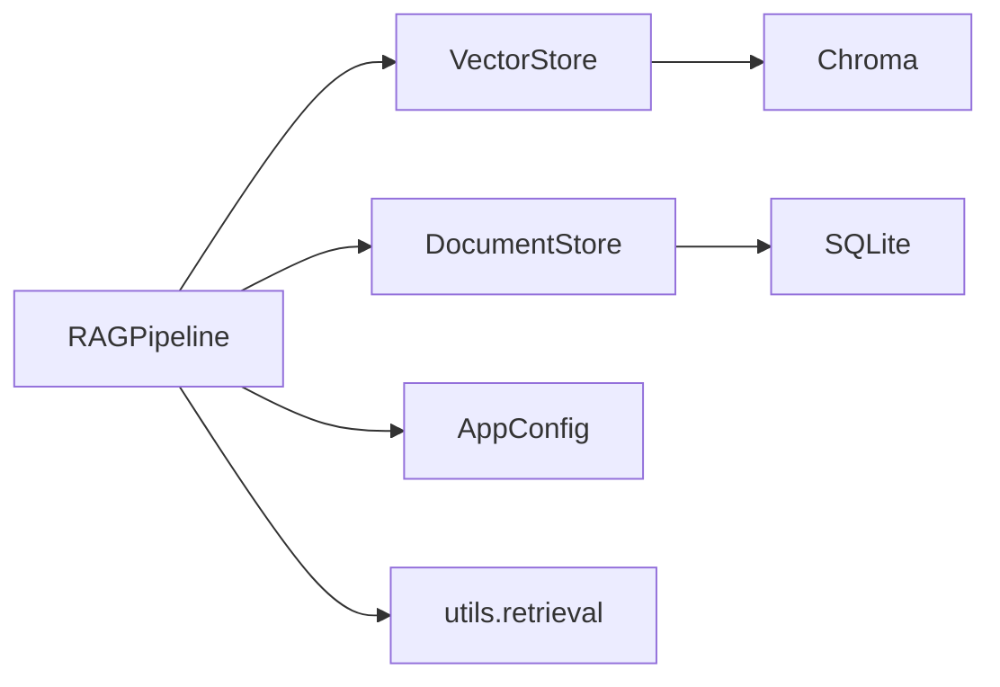

# 混合检索

<cite>
**本文引用的文件**
- [rag_pipeline.py](file://rag_pipeline.py)
- [vector_store.py](file://vector_store.py)
- [store.py](file://store.py)
- [config.py](file://config.py)
- [test_retrieval.py](file://tests/test_retrieval.py)
</cite>

## 目录
1. [简介](#简介)
2. [项目结构](#项目结构)
3. [核心组件](#核心组件)
4. [架构总览](#架构总览)
5. [详细组件分析](#详细组件分析)
6. [依赖关系分析](#依赖关系分析)
7. [性能考量](#性能考量)
8. [故障排查指南](#故障排查指南)
9. [结论](#结论)
10. [附录：API调用与参数调优](#附录api调用与参数调优)

## 简介
本技术文档聚焦 RAG 管线的“混合检索”能力，系统阐述向量语义检索与 BM25 关键词检索的融合排序、MMR 去重重排、以及相关性阈值控制策略。重点解释 retrieve 方法的完整流程：查询改写→向量检索→BM25 检索→RRF 融合→MMR 重排→结果过滤；并给出可调参数、评估方法与优化建议，帮助读者在生产环境中稳定获得高质量检索结果。

## 项目结构
混合检索由以下模块协同完成：
- RAGPipeline：编排检索流程（retrieve）、上下文组装与问答（answer）
- VectorStore：封装 Chroma 向量库，提供相似度检索与向量获取
- DocumentStore：SQLite 元数据与片段存储，供 BM25 重建与检索使用
- AppConfig：集中配置检索相关参数（top_k、fusion_pool、relevance_threshold、mmr_enabled、mmr_lambda 等）
- utils.retrieval：BM25Index、reciprocal_rank_fusion、mmr_rerank、tokenize（被 rag_pipeline.py 导入）

图表来源
- [rag_pipeline.py:439-523](file://rag_pipeline.py#L439-L523)
- [vector_store.py:100-137](file://vector_store.py#L100-L137)
- [store.py:425-442](file://store.py#L425-L442)
- [config.py:56-112](file://config.py#L56-L112)

章节来源
- [rag_pipeline.py:196-523](file://rag_pipeline.py#L196-L523)
- [vector_store.py:38-148](file://vector_store.py#L38-L148)
- [store.py:123-470](file://store.py#L123-L470)
- [config.py:56-112](file://config.py#L56-L112)

## 核心组件
- RAGPipeline.retrieve：实现混合检索主流程，负责向量检索、BM25 检索、RRF 融合、MMR 重排与相关性门槛判断。
- VectorStore：提供 query（余弦相似度 Top-K）、get_embeddings（取回候选向量用于 MMR）、query_embedding（查询向量）。
- DocumentStore：提供 iter_chunks 遍历片段，供 BM25 索引构建与内容召回。
- AppConfig：集中管理检索关键参数，如 top_k、fusion_pool、relevance_threshold、mmr_enabled、mmr_lambda、embedding_batch_size。
- utils.retrieval（被导入）：BM25Index（词频统计与打分）、reciprocal_rank_fusion（RRF 融合）、mmr_rerank（MMR 重排）、tokenize（中英文分词）。

章节来源
- [rag_pipeline.py:439-523](file://rag_pipeline.py#L439-L523)
- [vector_store.py:100-137](file://vector_store.py#L100-L137)
- [store.py:425-442](file://store.py#L425-L442)
- [config.py:56-112](file://config.py#L56-L112)

## 架构总览
下图展示一次检索请求从入口到返回的端到端流程，包括查询改写、双路检索、RRF 融合、MMR 重排与相关性门槛过滤。

图表来源
- [rag_pipeline.py:590-666](file://rag_pipeline.py#L590-L666)
- [rag_pipeline.py:439-523](file://rag_pipeline.py#L439-L523)
- [vector_store.py:100-137](file://vector_store.py#L100-L137)
- [store.py:425-442](file://store.py#L425-L442)

## 详细组件分析

### 混合检索主流程（retrieve）
- 输入：kb_id、query、可选 k、可选 doc_id（来源提示限定）
- 步骤：
  1) 准备候选池大小 pool = max(k, fusion_pool)
  2) 向量检索：按集合名 collection_name(kb_id)，支持 where(doc_id) 过滤
  3) BM25 检索：按需构建 BM25 索引，返回 Top-N（doc_id 限制时二次过滤）
  4) RRF 融合：对两份排名做倒数秩融合
  5) 相关性门槛：若最佳向量分数低于阈值且 BM25 无命中，则返回空
  6) MMR 重排：可选，基于 query_vector 与候选向量计算多样性得分
  7) 组装结果：附带 vector_score、bm25_score、rrf_score

图表来源
- [rag_pipeline.py:439-523](file://rag_pipeline.py#L439-L523)

章节来源
- [rag_pipeline.py:439-523](file://rag_pipeline.py#L439-L523)

### RRF（Reciprocal Rank Fusion）融合算法
- 目标：将向量检索与 BM25 检索的两份独立排名合并为统一排序，避免跨模型得分尺度不一致问题。
- 原理：对每个候选项在每份排名中的位置 r，累加 1/(C + r)，其中 C 为常数（常见为 60），得到融合得分。
- 权重分配：当前实现中两份检索器等权参与融合（即两份排名同等贡献），通过调整 pool 与最终 k 间接影响权重效果。
- 复杂度：对 N 个候选、M 份排名的融合时间复杂度 O(N·M)。

图表来源
- [rag_pipeline.py:483-488](file://rag_pipeline.py#L483-L488)
- [docs/LEARNING_GUIDE.md:38-53](file://docs/LEARNING_GUIDE.md#L38-L53)

章节来源
- [rag_pipeline.py:483-488](file://rag_pipeline.py#L483-L488)
- [docs/LEARNING_GUIDE.md:38-53](file://docs/LEARNING_GUIDE.md#L38-L53)

### MMR（Maximal Marginal Relevance）去重重排
- 目标：在保持相关性的同时提升结果多样性，减少重复片段。
- 实现要点：
  - query_vector：通过 VectorStore.query_embedding 获取
  - item_vectors：通过 VectorStore.get_embeddings 获取候选向量
  - λ 参数：由 AppConfig.mmr_lambda 控制，越大越偏向相关性，越小越偏向多样性
  - 重排过程：迭代选择使“λ×相关性 − (1−λ)×与已选最大相似度”最大的候选
- 失败兜底：若候选在向量库中无向量（例如仅 BM25 命中的片段），则跳过 MMR，直接截取前 k。

图表来源
- [rag_pipeline.py:489-503](file://rag_pipeline.py#L489-L503)
- [vector_store.py:128-137](file://vector_store.py#L128-L137)

章节来源
- [rag_pipeline.py:489-503](file://rag_pipeline.py#L489-L503)
- [vector_store.py:128-137](file://vector_store.py#L128-L137)

### 相关性门槛机制
- 向量相似度阈值：当最佳向量分数低于 config.relevance_threshold 且 BM25 无命中时，视为无相关内容，返回空结果。
- BM25 精确匹配兜底：纯关键词查询（型号、编号、人名等）即使向量相似度较低，只要 BM25 强命中，仍会放行，避免误杀。
- 低相关查询过滤：防止模型在无资料情况下“编造答案”，提升回答可靠性。

图表来源
- [rag_pipeline.py:484-486](file://rag_pipeline.py#L484-L486)

章节来源
- [rag_pipeline.py:484-486](file://rag_pipeline.py#L484-L486)

### 查询改写与来源提示
- 查询改写：在多轮对话中，优先用 LLM 将追问题改写为独立明确的问题，失败时退回原问题。
- 来源提示：根据问题中的文件名或人物短名自动限定检索范围（doc_id），避免无关文档污染答案。

章节来源
- [rag_pipeline.py:566-588](file://rag_pipeline.py#L566-L588)
- [rag_pipeline.py:525-548](file://rag_pipeline.py#L525-L548)

### 向量存储与检索
- VectorStore.query：对查询文本向量化后执行相似度检索，返回带余弦相似度的命中列表。
- VectorStore.get_embeddings：按 id 批量取回嵌入向量，用于 MMR 重排。
- VectorStore.query_embedding：单独对查询文本向量化，供 MMR 使用。

章节来源
- [vector_store.py:100-137](file://vector_store.py#L100-L137)

### 片段与元数据存储
- DocumentStore.iter_chunks：按知识库遍历所有片段，供 BM25 索引构建。
- 版本与哈希：入库时对文件进行 SHA-256 判重，配置变化触发全量重建，保证一致性。

章节来源
- [store.py:425-442](file://store.py#L425-L442)
- [rag_pipeline.py:306-435](file://rag_pipeline.py#L306-L435)

## 依赖关系分析
- RAGPipeline 依赖：
  - VectorStore：向量检索与向量获取
  - DocumentStore：片段与元数据访问
  - AppConfig：检索参数
  - utils.retrieval：BM25、RRF、MMR 工具函数
- VectorStore 依赖：Chroma 持久化客户端与外部 Embedding 接口
- DocumentStore 依赖：SQLite 数据库

图表来源
- [rag_pipeline.py:196-523](file://rag_pipeline.py#L196-L523)
- [vector_store.py:38-148](file://vector_store.py#L38-L148)
- [store.py:123-470](file://store.py#L123-L470)
- [config.py:56-112](file://config.py#L56-L112)

章节来源
- [rag_pipeline.py:196-523](file://rag_pipeline.py#L196-L523)
- [vector_store.py:38-148](file://vector_store.py#L38-L148)
- [store.py:123-470](file://store.py#L123-L470)
- [config.py:56-112](file://config.py#L56-L112)

## 性能考量
- 向量批处理：embedding_batch_size 默认受限于厂商单次上限（如 20），可结合数据规模调优以提升吞吐。
- 融合池大小：fusion_pool 越大，候选越多，RRF 更稳健但计算开销增加；需权衡 top_k 与延迟。
- MMR 开销：开启 MMR 会增加一次向量获取与相似度计算，适合对多样性要求高的场景。
- BM25 索引构建：首次构建成本与片段总量成正比，建议在入库完成后刷新缓存。
- 上下文裁剪：rag_context_max_tokens 控制最终放入大模型的上下文长度，避免超长导致截断或超时。

[本节为通用指导，不直接分析具体文件]

## 故障排查指南
- 向量检索为空或低于阈值：检查 embedding 模型可用性、向量库连接与集合是否存在；必要时降低 relevance_threshold 或增大 fusion_pool。
- BM25 无命中：确认片段内容与查询关键词匹配度；检查分词与索引构建是否成功。
- MMR 未生效：确认 mmr_enabled 为真且候选数量 > 1；若候选无向量（仅 BM25 命中），将跳过 MMR。
- 结果重复度高：提高 mmr_lambda 以增强相关性，或降低 λ 以增强多样性；适当增大 top_k 与 fusion_pool。
- 长上下文导致响应慢：减小 rag_context_max_tokens 或历史保留 token 数。

章节来源
- [rag_pipeline.py:439-523](file://rag_pipeline.py#L439-L523)
- [config.py:56-112](file://config.py#L56-L112)
- [vector_store.py:100-137](file://vector_store.py#L100-L137)

## 结论
本项目的混合检索通过“向量语义 + BM25 关键词”的双路召回与 RRF 融合，结合 MMR 去重与相关性门槛，兼顾了召回率与准确性，并在关键词精确匹配场景下具备兜底能力。通过集中配置与模块化设计，可在不同业务场景中灵活调参，实现稳定高效的检索体验。

[本节为总结性内容，不直接分析具体文件]

## 附录：API调用与参数调优

### 典型调用示例
- 初始化管线与知识库
  - 创建/获取默认知识库，上传文档并执行增量入库
- 检索与问答
  - 调用 answer(question, history, kb_id) 获取带引用回答
  - 内部自动执行 retrieve(kb_id, query) 进行混合检索

参考路径
- [rag_pipeline.py:590-666](file://rag_pipeline.py#L590-L666)
- [rag_pipeline.py:306-435](file://rag_pipeline.py#L306-L435)

### 关键参数说明（来自 AppConfig）
- top_k：最终返回片段数
- fusion_pool：融合候选池大小
- relevance_threshold：向量相似度门槛
- mmr_enabled / mmr_lambda：是否启用 MMR 及多样性权重
- query_rewrite_enabled：是否启用查询改写
- embedding_batch_size：向量化批大小

参考路径
- [config.py:56-112](file://config.py#L56-L112)

### 检索效果评估建议
- 指标
  - 召回率：关注 top_k 内是否包含正确答案片段
  - 准确率：关注最终回答是否严格基于检索资料
  - 多样性：观察 MMR 开启前后结果重复度变化
- 方法
  - 构造覆盖关键词与语义两类问题的测试集
  - 对比不同融合池大小与 λ 的效果
  - 记录上下文 token 数与响应延迟

参考路径
- [test_retrieval.py:40-80](file://tests/test_retrieval.py#L40-L80)

### 性能优化建议
- 合理设置 embedding_batch_size 与 fusion_pool，平衡吞吐与质量
- 对高频查询可考虑缓存 BM25 索引与片段映射
- 关闭不必要的深度思考（enable_thinking=False）以降低首字延迟
- 控制历史与上下文 token 预算，避免过长导致性能下降

参考路径
- [rag_pipeline.py:590-666](file://rag_pipeline.py#L590-L666)
- [config.py:56-112](file://config.py#L56-L112)