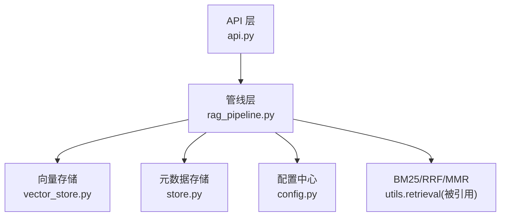
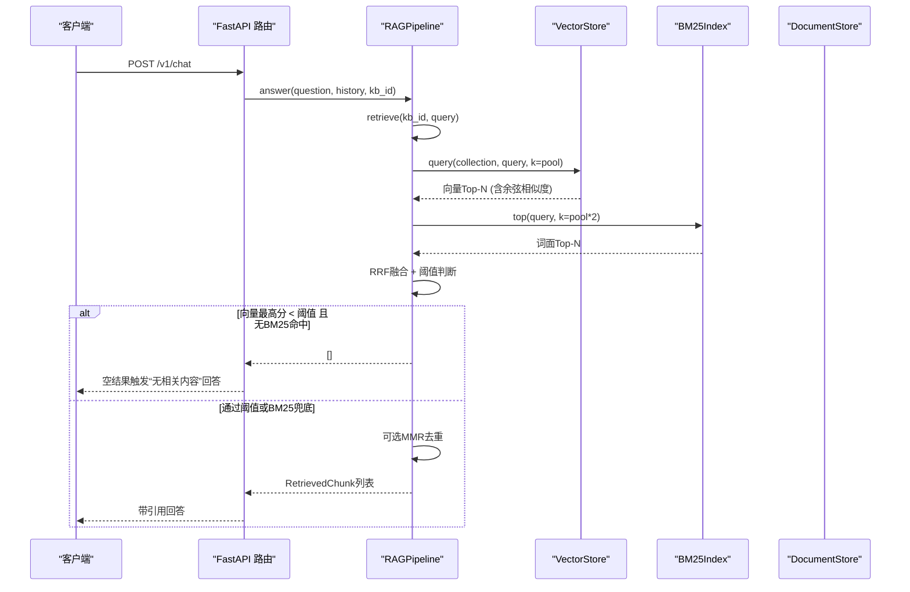
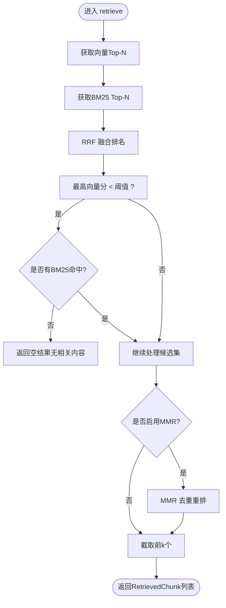
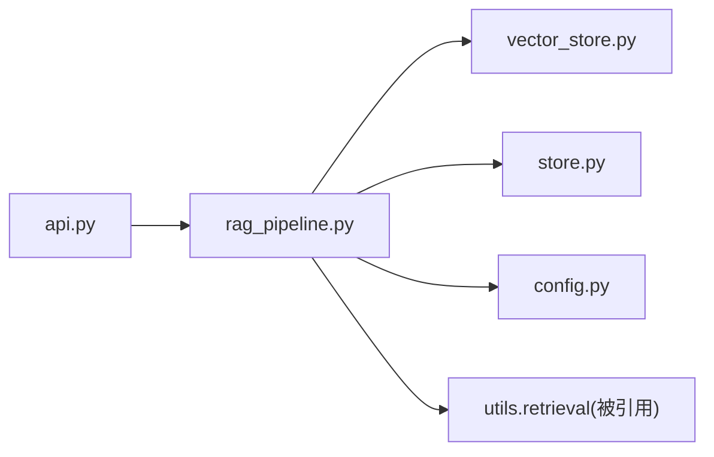

# 相关性阈值控制

<cite>
**本文引用的文件**
- [rag_pipeline.py](file://rag_pipeline.py)
- [vector_store.py](file://vector_store.py)
- [config.py](file://config.py)
- [store.py](file://store.py)
- [api.py](file://api.py)
- [tests/test_retrieval.py](file://tests/test_retrieval.py)
- [tests/helpers.py](file://tests/helpers.py)
- [docs/LEARNING_GUIDE.md](file://docs/LEARNING_GUIDE.md)
</cite>

## 目录
1. [简介](#简介)
2. [项目结构](#项目结构)
3. [核心组件](#核心组件)
4. [架构总览](#架构总览)
5. [详细组件分析](#详细组件分析)
6. [依赖关系分析](#依赖关系分析)
7. [性能考量](#性能考量)
8. [故障排查指南](#故障排查指南)
9. [结论](#结论)
10. [附录：配置与监控](#附录配置与监控)

## 简介
本技术文档聚焦混合检索中的“相关性阈值控制机制”，围绕双重门槛策略展开：向量相似度阈值判断与 BM25 精确匹配兜底。重点解释低相关查询的过滤逻辑、避免硬凑答案的设计原则，以及阈值调优方法、评估指标、配置示例与效果监控实践。

## 项目结构
本项目采用分层组织：
- 管线层：RAGPipeline 负责入库、混合检索、问答编排
- 存储层：VectorStore（Chroma）与 DocumentStore（SQLite）分别承载向量与元数据
- 配置层：AppConfig 集中管理检索、切分、重排等参数
- API 层：FastAPI 暴露知识库管理与问答接口
- 测试与学习材料：覆盖检索工具、阈值行为验证与学习指引

图表来源
- [api.py:186-199](file://api.py#L186-L199)
- [rag_pipeline.py:439-523](file://rag_pipeline.py#L439-L523)
- [vector_store.py:100-126](file://vector_store.py#L100-L126)
- [store.py:123-139](file://store.py#L123-L139)
- [config.py:56-112](file://config.py#L56-L112)

章节来源
- [api.py:1-204](file://api.py#L1-L204)
- [rag_pipeline.py:1-792](file://rag_pipeline.py#L1-L792)
- [vector_store.py:1-255](file://vector_store.py#L1-L255)
- [store.py:1-470](file://store.py#L1-L470)
- [config.py:1-113](file://config.py#L1-L113)

## 核心组件
- RAGPipeline.retrieve：实现混合检索与相关性阈值控制的核心入口
- VectorStore.query：返回余弦相似度得分（score = 1 - distance）
- AppConfig.relevance_threshold：默认阈值，用于判定“无相关内容”
- BM25Index.top：词面检索，提供精确匹配兜底
- MMR 重排：可选去重，提升多样性

章节来源
- [rag_pipeline.py:439-523](file://rag_pipeline.py#L439-L523)
- [vector_store.py:100-126](file://vector_store.py#L100-L126)
- [config.py:56-112](file://config.py#L56-L112)

## 架构总览
下图展示一次检索请求从 API 到混合检索、再到阈值判断与结果组装的完整流程。

图表来源
- [api.py:186-199](file://api.py#L186-L199)
- [rag_pipeline.py:590-666](file://rag_pipeline.py#L590-L666)
- [rag_pipeline.py:439-523](file://rag_pipeline.py#L439-L523)
- [vector_store.py:100-126](file://vector_store.py#L100-L126)

## 详细组件分析

### 混合检索与双重门槛机制
- 向量检索：使用余弦相似度，分数越高越相关；在向量库中 score = 1 - distance
- BM25 兜底：当纯关键词查询（型号、编号、人名等）导致向量相似度偏低时，若 BM25 有命中则放行，避免误杀
- 阈值判断：仅当“向量最高分低于阈值 且 无 BM25 命中”时，视为无相关内容，直接返回空结果

图表来源
- [rag_pipeline.py:439-523](file://rag_pipeline.py#L439-L523)
- [vector_store.py:100-126](file://vector_store.py#L100-L126)

章节来源
- [rag_pipeline.py:439-523](file://rag_pipeline.py#L439-L523)
- [vector_store.py:100-126](file://vector_store.py#L100-L126)

### 低相关查询的处理逻辑与“不硬凑答案”原则
- 设计原则：当检索资料不足或与问题无关时，不应让模型基于噪声片段“编造”答案
- 实现方式：在 retrieve 中设置阈值门限；若无像样命中，answer 将返回“未检索到相关内容”的提示，避免幻觉
- 兜底策略：BM25 强命中可绕过向量低分限制，确保精确术语查询不被误杀

章节来源
- [rag_pipeline.py:439-523](file://rag_pipeline.py#L439-L523)
- [rag_pipeline.py:590-666](file://rag_pipeline.py#L590-L666)
- [docs/LEARNING_GUIDE.md:68-75](file://docs/LEARNING_GUIDE.md#L68-L75)

### 阈值配置的调优方法
- 默认值：relevance_threshold 默认 0.3，可通过环境变量 RETRIEVAL_RELEVANCE_THRESHOLD 调整
- 不同知识库类型建议
  - 产品手册/制度类：偏保守，阈值可设为 0.3~0.5，减少误召回
  - 简历/人物档案类：偏宽松，阈值可降至 0.1~0.2，结合源提示限定文档范围
  - 型号/编号清单类：依赖 BM25 兜底，阈值可保持默认或略降，确保精确匹配优先
- 动态调整策略
  - 观察“无相关内容”比例：过高说明阈值过严，过低说明易引入噪声
  - 结合业务反馈：对高频误杀场景适当下调阈值；对高幻觉场景上调阈值
  - 配合 fusion_pool 与 top_k：扩大候选池有助于更稳健的融合与重排

章节来源
- [config.py:56-112](file://config.py#L56-L112)
- [docs/LEARNING_GUIDE.md:68-75](file://docs/LEARNING_GUIDE.md#L68-L75)

### 相关性评估指标
- 向量余弦相似度范围：[0, 1]，越大越相关；底层以距离计算后转换得到
- BM25 得分分布特征：词频越高、词越稀有，得分越高；适合精确术语匹配
- 融合得分（RRF）：只看排名不看原始分值，天然兼容不同检索器尺度
- 多样性（MMR）：λ 越大越看重相关性，越小越看重多样性

章节来源
- [vector_store.py:100-126](file://vector_store.py#L100-L126)
- [docs/LEARNING_GUIDE.md:38-67](file://docs/LEARNING_GUIDE.md#L38-L67)

### 具体配置示例与效果监控
- 关键环境变量
  - RETRIEVAL_RELEVANCE_THRESHOLD：相关性阈值（默认 0.3）
  - RETRIEVAL_FUSION_POOL：融合候选池大小（默认 12）
  - RETRIEVAL_TOP_K：最终返回片段数（默认 5）
  - RETRIEVAL_MMR_ENABLED：是否启用 MMR（默认 true）
  - RETRIEVAL_MMR_LAMBDA：MMR 多样性权重（默认 0.7）
- 效果监控
  - 关注 sources 中的 vector_score、bm25_score、rrf_score，观察阈值前后变化
  - 统计“无相关内容”返回率，评估阈值合理性
  - 对比开启/关闭 MMR 的结果重复度与多样性

章节来源
- [config.py:56-112](file://config.py#L56-L112)
- [rag_pipeline.py:614-666](file://rag_pipeline.py#L614-L666)

## 依赖关系分析
- RAGPipeline 依赖 VectorStore 进行语义检索，依赖 BM25Index 进行词面检索
- VectorStore 使用 Chroma 持久化向量集合，空间为余弦
- DocumentStore 维护知识库、文档、片段与元数据，供 BM25 重建与检索使用
- API 层通过 FastAPI 路由调用 RAGPipeline，统一对外暴露能力

图表来源
- [api.py:186-199](file://api.py#L186-L199)
- [rag_pipeline.py:439-523](file://rag_pipeline.py#L439-L523)
- [vector_store.py:100-126](file://vector_store.py#L100-L126)
- [store.py:123-139](file://store.py#L123-L139)
- [config.py:56-112](file://config.py#L56-L112)

章节来源
- [api.py:1-204](file://api.py#L1-L204)
- [rag_pipeline.py:1-792](file://rag_pipeline.py#L1-L792)
- [vector_store.py:1-255](file://vector_store.py#L1-L255)
- [store.py:1-470](file://store.py#L1-L470)
- [config.py:1-113](file://config.py#L1-L113)

## 性能考量
- 向量检索批量嵌入：batch_size 受限于嵌入服务单次上限，默认 16，避免超限报错
- 融合候选池：fusion_pool 越大，融合质量越好但开销增加；需权衡延迟与效果
- MMR 重排：仅在候选多于 1 时生效，可减少重复片段，但会引入额外计算
- 缓存失效：后台入库完成后需刷新 BM25 与片段缓存，避免索引过期

章节来源
- [config.py:90-112](file://config.py#L90-L112)
- [rag_pipeline.py:720-725](file://rag_pipeline.py#L720-L725)

## 故障排查指南
- 症状：总是返回“无相关内容”
  - 检查 relevance_threshold 是否过高
  - 确认 BM25 索引是否已构建（入库完成并刷新）
  - 查看 sources 中的 bm25_score 是否为 0（可能索引为空）
- 症状：精确术语查询被误杀
  - 降低阈值或增大 fusion_pool，确保 BM25 兜底能发挥作用
- 症状：结果高度重复
  - 启用 MMR 并调小 mmr_lambda 以提升多样性
- 症状：向量库与片段不一致
  - 执行 refresh，使 BM25 与片段缓存失效并重载

章节来源
- [rag_pipeline.py:439-523](file://rag_pipeline.py#L439-L523)
- [rag_pipeline.py:720-725](file://rag_pipeline.py#L720-L725)
- [tests/test_retrieval.py:64-80](file://tests/test_retrieval.py#L64-L80)

## 结论
本系统通过“向量相似度阈值 + BM25 精确匹配兜底”的双重门槛机制，有效平衡了语义检索与精确匹配的需求，避免了对低相关查询的硬凑答案。通过合理配置阈值、融合池大小与 MMR 参数，并结合效果监控与调优实践，可在不同知识库类型下取得稳定可靠的检索质量。

## 附录：配置与监控
- 推荐配置路径
  - 产品/制度知识库：threshold 0.3~0.5，top_k 5，fusion_pool 12，MMR 开启
  - 简历/人物档案：threshold 0.1~0.2，启用源提示限定文档范围
  - 型号/编号清单：threshold 默认或略降，强调 BM25 兜底
- 监控要点
  - 统计“无相关内容”比例与 sources 得分分布
  - 对比开启/关闭 MMR 的重复度与多样性
  - 记录阈值调整前后的命中率与用户满意度

章节来源
- [config.py:56-112](file://config.py#L56-L112)
- [docs/LEARNING_GUIDE.md:38-75](file://docs/LEARNING_GUIDE.md#L38-L75)
- [tests/helpers.py:136-157](file://tests/helpers.py#L136-L157)