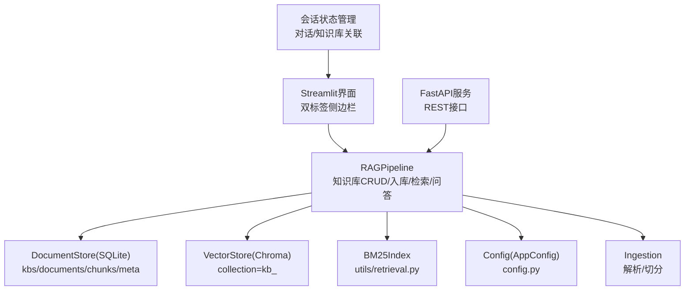
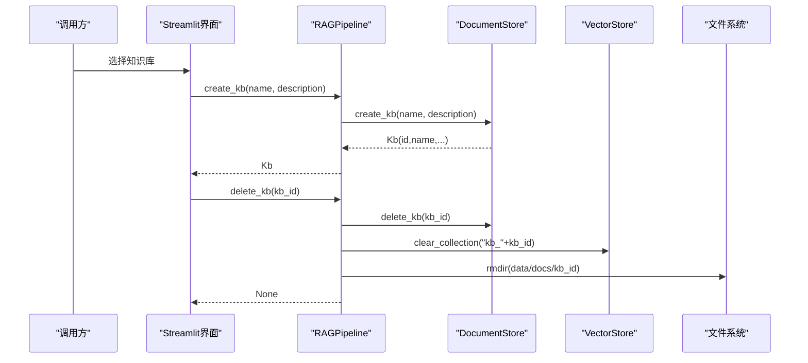
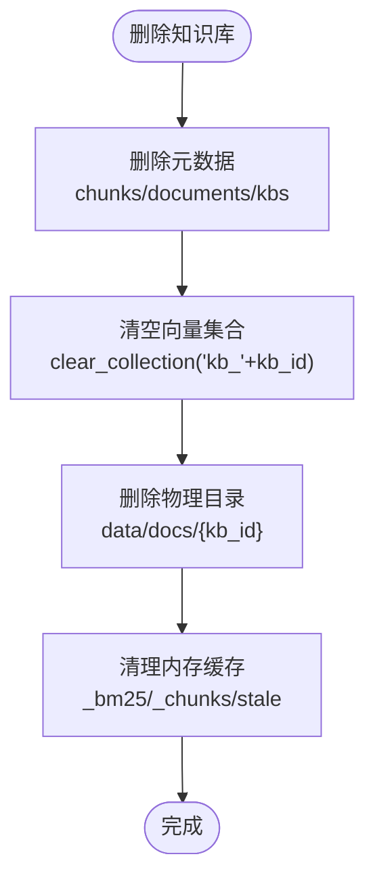
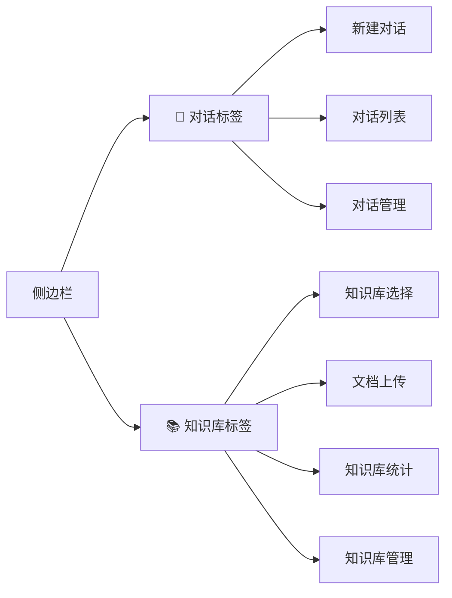
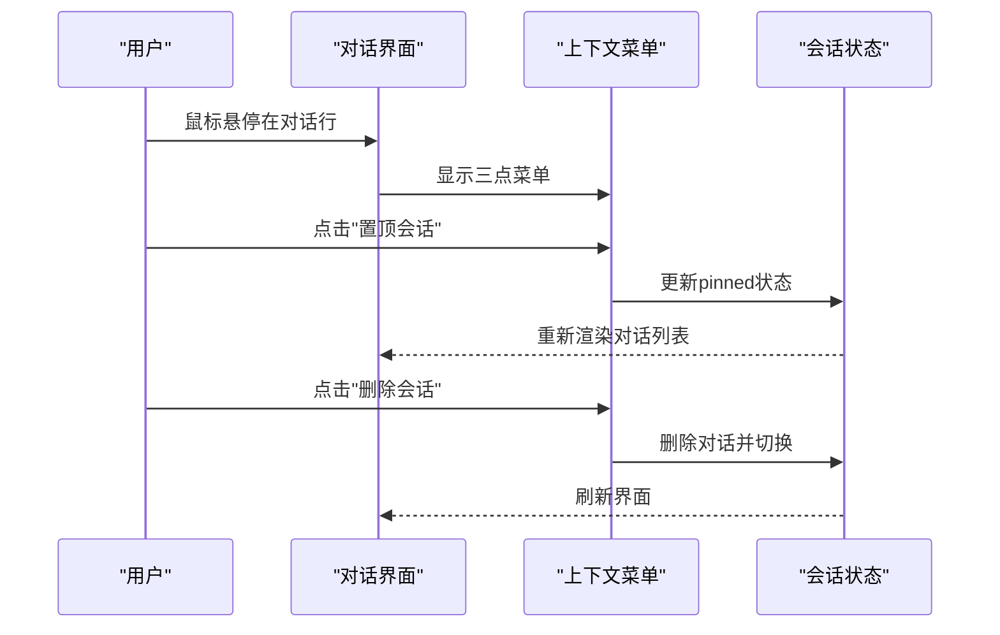
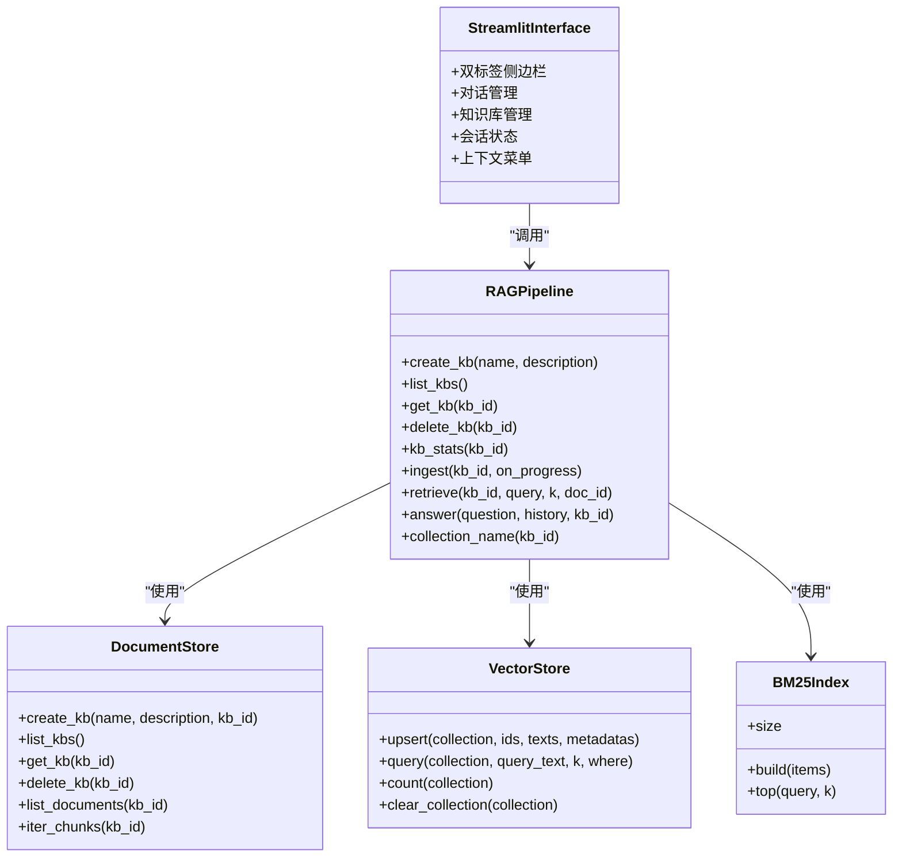

# 知识库管理

<cite>
**本文引用的文件**
- [rag_pipeline.py](file://rag_pipeline.py)
- [store.py](file://store.py)
- [vector_store.py](file://vector_store.py)
- [config.py](file://config.py)
- [ingestion.py](file://ingestion.py)
- [app.py](file://app.py)
- [api.py](file://api.py)
</cite>

## 更新摘要
**所做更改**
- 更新了双标签侧边栏架构的描述，新增了上下文菜单系统的实现细节
- 新增对话置顶功能和改进的用户交互体验
- 移除了'清空当前对话'按钮，简化了对话管理流程
- 增强了会话状态管理和知识库隔离机制

## 目录
1. [简介](#简介)
2. [项目结构](#项目结构)
3. [核心组件](#核心组件)
4. [架构总览](#架构总览)
5. [详细组件分析](#详细组件分析)
6. [依赖关系分析](#依赖关系分析)
7. [性能考虑](#性能考虑)
8. [故障排查指南](#故障排查指南)
9. [结论](#结论)
10. [附录：API调用示例与错误处理模式](#附录api调用示例与错误处理模式)

## 简介
本章节面向RAG管线模块的知识库管理能力，围绕 RAGPipeline 类中的知识库CRUD、多知识库隔离、默认知识库特殊处理、统计信息获取、删除级联清理等主题进行系统化说明。同时给出并发安全与性能优化建议，以及常见API调用与错误处理模式。

**更新** 界面采用全新的双标签侧边栏架构，包含"对话"和"知识库"两个独立标签页，提供上下文菜单系统和对话置顶功能，显著提升用户体验。

## 项目结构
知识库管理涉及以下关键文件与职责：
- rag_pipeline.py：RAGPipeline门面，封装知识库CRUD、入库、检索、问答；维护BM25与片段缓存；提供collection_name映射与默认知识库逻辑。
- store.py：SQLite元数据存储，定义kbs/documents/chunks/meta表，实现知识库/文档/片段的持久化与并发安全（WAL + busy_timeout + RLock）。
- vector_store.py：Chroma向量存储封装，按kb_id命名collection，提供upsert/query/delete/count/clear_collection等能力。
- config.py：集中配置项（数据目录、向量库路径、切分参数、检索阈值、批大小等）。
- ingestion.py：文档解析与切分，供入库流程使用。
- app.py：Streamlit界面实现，提供双标签侧边栏架构的交互式知识库管理。
- api.py：FastAPI服务层，暴露REST API接口。

**图表来源**
- [rag_pipeline.py:196-256](file://rag_pipeline.py#L196-L256)
- [store.py:123-211](file://store.py#L123-L211)
- [vector_store.py:38-148](file://vector_store.py#L38-L148)
- [config.py:56-113](file://config.py#L56-L113)
- [ingestion.py:24-190](file://ingestion.py#L24-L190)
- [app.py:261-428](file://app.py#L261-L428)
- [api.py:103-175](file://api.py#L103-L175)

**章节来源**
- [rag_pipeline.py:196-256](file://rag_pipeline.py#L196-L256)
- [store.py:123-211](file://store.py#L123-L211)
- [vector_store.py:38-148](file://vector_store.py#L38-L148)
- [config.py:56-113](file://config.py#L56-L113)
- [ingestion.py:24-190](file://ingestion.py#L24-L190)
- [app.py:261-428](file://app.py#L261-L428)
- [api.py:103-175](file://api.py#L103-L175)

## 核心组件
- RAGPipeline：对外暴露知识库管理接口（create_kb、list_kbs、get_kb、delete_kb、kb_stats），并维护bm25与chunks的进程内缓存及失效标记。
- DocumentStore：基于SQLite的多知识库元数据管理，支持事务、外键约束、软删除、版本历史。
- VectorStore：基于Chroma的向量集合管理，每个知识库独立collection，命名规则为 kb_<kb_id>。
- BM25Index：轻量词面索引，用于混合检索的关键词召回。
- AppConfig：集中配置，控制切分、检索、批大小等关键参数。
- Streamlit界面：双标签侧边栏架构，'对话'标签管理会话，'知识库'标签管理知识库。

**章节来源**
- [rag_pipeline.py:196-256](file://rag_pipeline.py#L196-L256)
- [store.py:123-211](file://store.py#L123-L211)
- [vector_store.py:38-148](file://vector_store.py#L38-L148)
- [config.py:56-113](file://config.py#L56-L113)
- [app.py:261-428](file://app.py#L261-L428)

## 架构总览
多知识库架构要点：
- 每个知识库拥有独立的向量collection，命名由 collection_name(kb_id) = "kb_" + kb_id 决定。
- 每个知识库拥有独立的BM25索引实例，缓存在 _bm25[kb_id]，并在变更时通过 _bm25_stale 标记重建。
- 每个知识库拥有独立的片段缓存 _chunks[kb_id]，在变更时通过 _chunks_stale 标记重建。
- 默认知识库"default"具有固定id，便于兼容旧数据与命令行场景；若不存在则自动创建。
- **更新** 界面采用双标签侧边栏架构，每个对话可独立选择知识库，通过会话状态管理实现知识库隔离。

**图表来源**
- [rag_pipeline.py:223-247](file://rag_pipeline.py#L223-L247)
- [store.py:158-211](file://store.py#L158-L211)
- [vector_store.py:142-148](file://vector_store.py#L142-L148)
- [app.py:314-428](file://app.py#L314-L428)

**章节来源**
- [rag_pipeline.py:223-247](file://rag_pipeline.py#L223-L247)
- [store.py:158-211](file://store.py#L158-L211)
- [vector_store.py:142-148](file://vector_store.py#L142-L148)
- [app.py:314-428](file://app.py#L314-L428)

## 详细组件分析

### 知识库CRUD操作
- create_kb(name, description)：委托给 DocumentStore.create_kb，名称唯一性校验，重复时抛出异常。
- list_kbs()：返回所有知识库列表。
- get_kb(kb_id)：根据id查询知识库，不存在返回None。
- get_or_create_default_kb()：若不存在id为"default"的知识库，则创建名为"默认知识库"的默认库，确保向后兼容。
- delete_kb(kb_id)：执行级联清理：
  - 元数据：删除chunks、documents、kbs记录（store.delete_kb）。
  - 向量集合：清空或移除 kb_<kb_id> 集合（vectors.clear_collection）。
  - 物理文件目录：删除 data/docs/{kb_id}（shutil.rmtree）。
  - 内存索引：移除BM25索引与片段缓存，并清理stale集合。

**更新** 界面中知识库操作现已整合到专用标签页，提供更直观的创建、删除和管理功能。

**图表来源**
- [rag_pipeline.py:239-247](file://rag_pipeline.py#L239-L247)
- [store.py:200-211](file://store.py#L200-L211)
- [vector_store.py:142-148](file://vector_store.py#L142-L148)

**章节来源**
- [rag_pipeline.py:223-247](file://rag_pipeline.py#L223-L247)
- [store.py:158-211](file://store.py#L158-L211)
- [vector_store.py:142-148](file://vector_store.py#L142-L148)

### 多知识库隔离机制
- 向量隔离：每个知识库对应一个Chroma collection，命名规则为 "kb_" + kb_id。
- BM25隔离：每个知识库维护独立的BM25Index实例，构建时仅包含该知识库的片段内容。
- 片段缓存隔离：_chunks[kb_id] 仅缓存当前知识库的片段映射，避免跨库污染。
- 默认知识库：id固定为"default"，便于兼容旧数据；当未指定kb_id时，系统会尝试解析到默认库。
- **更新** 每个对话可独立选择知识库，通过会话状态管理实现知识库隔离。

**章节来源**
- [rag_pipeline.py:727-737](file://rag_pipeline.py#L727-L737)
- [vector_store.py:50-55](file://vector_store.py#L50-L55)
- [app.py:216-241](file://app.py#L216-L241)

### 知识库统计信息 kb_stats
- 文档数量：通过 store.list_documents(kb_id) 获取活跃文档数。
- 片段数量：累加各文档的 chunk_count。
- 向量数量：通过 vectors.count(collection_name(kb_id)) 获取向量集合条目数。
- 返回值包含 kb_id、documents、chunks、vector_count。
- **更新** 界面实时显示知识库统计信息，包括文档数和片段数。

**章节来源**
- [rag_pipeline.py:249-256](file://rag_pipeline.py#L249-L256)
- [store.py:306-320](file://store.py#L306-L320)
- [vector_store.py:139-141](file://vector_store.py#L139-L141)
- [app.py:357-359](file://app.py#L357-L359)

### 删除操作的级联清理机制
- 元数据删除：删除chunks、documents、kbs记录，保证数据库一致性。
- 向量集合清空：删除整个collection，避免残留向量。
- 物理文件目录移除：删除 data/docs/{kb_id}，释放磁盘空间。
- BM25索引清理：从 _bm25 字典中移除对应索引，并从 _bm25_stale 中清理标记。
- 片段缓存清理：从 _chunks 和 _chunks_stale 中移除对应知识库缓存。
- **更新** 界面提供确认对话框防止误删，删除后自动刷新界面状态。

**章节来源**
- [rag_pipeline.py:239-247](file://rag_pipeline.py#L239-L247)
- [store.py:200-211](file://store.py#L200-L211)
- [vector_store.py:142-148](file://vector_store.py#L142-L148)
- [app.py:412-423](file://app.py#L412-L423)

### 默认知识库的特殊处理
- get_or_create_default_kb()：若不存在id为"default"的知识库，则创建名为"默认知识库"的默认库。
- _resolve_kb(kb_id)：当传入kb_id为空或无效时，回退到默认知识库；若无默认库则返回None。
- 迁移逻辑：首次运行时，将旧版 data/docs 根目录下的文件迁移至默认知识库。
- **更新** 界面初始化时自动设置默认知识库，确保用户无需手动配置即可开始使用。

**章节来源**
- [rag_pipeline.py:232-237](file://rag_pipeline.py#L232-L237)
- [rag_pipeline.py:733-737](file://rag_pipeline.py#L733-L737)
- [rag_pipeline.py:754-773](file://rag_pipeline.py#L754-L773)
- [app.py:234-241](file://app.py#L234-L241)

### 双标签侧边栏架构
**新增** 界面采用双标签侧边栏设计：
- '对话'标签：提供对话管理功能，包括新建对话、切换对话、删除对话、置顶对话等。
- '知识库'标签：整合所有知识库操作，包括创建知识库、上传文档、查看统计、删除知识库等。
- 每个对话独立保存所选知识库，通过会话状态管理实现知识库隔离。

**图表来源**
- [app.py:261-428](file://app.py#L261-L428)

**章节来源**
- [app.py:261-428](file://app.py#L261-L428)

### 上下文菜单系统与对话管理
**新增** 实现了完整的上下文菜单系统，提升用户交互体验：
- 悬停显示：每个对话行右侧的三点菜单（⋯）在鼠标悬停时显示，平时隐藏以保持界面简洁。
- 对话重命名：通过弹出菜单中的文本输入框修改对话标题。
- 对话置顶：支持将重要对话置顶显示，置顶对话带有📌标识并优先显示。
- 对话删除：提供安全的删除功能，删除当前对话时自动切换到其他对话。
- 改进的交互：移除了"清空当前对话"按钮，简化了对话管理流程。

**图表来源**
- [app.py:106-121](file://app.py#L106-L121)
- [app.py:323-355](file://app.py#L323-L355)

**章节来源**
- [app.py:106-121](file://app.py#L106-L121)
- [app.py:323-355](file://app.py#L323-L355)

### 会话状态管理
**新增** 实现了完善的会话状态管理机制：
- 会话数据结构：每个会话包含id、title、messages、kb_id、pinned等字段。
- 会话创建：新对话继承当前知识库设置，支持独立的知识库选择。
- 会话排序：置顶对话优先显示，最新对话排在前面。
- 会话切换：点击对话列表项切换到对应会话，当前会话高亮显示。
- 会话持久化：通过Streamlit session_state管理会话生命周期。

**章节来源**
- [app.py:236-273](file://app.py#L236-L273)
- [app.py:298-355](file://app.py#L298-L355)

## 依赖关系分析
- RAGPipeline 依赖：
  - DocumentStore：负责知识库、文档、片段、配置的持久化。
  - VectorStore：负责向量化与相似度检索。
  - BM25Index：负责词面检索。
  - AppConfig：提供运行参数。
  - Ingestion：负责文档解析与切分。
- 耦合与内聚：
  - RAGPipeline作为门面，聚合多个子系统，保持高内聚低耦合。
  - 各子系统通过明确接口交互，便于替换与测试。
- **更新** Streamlit界面依赖RAGPipeline提供知识库管理功能，通过会话状态管理实现对话与知识库的关联。

**图表来源**
- [rag_pipeline.py:196-256](file://rag_pipeline.py#L196-L256)
- [store.py:123-211](file://store.py#L123-L211)
- [vector_store.py:38-148](file://vector_store.py#L38-L148)
- [app.py:261-428](file://app.py#L261-L428)

**章节来源**
- [rag_pipeline.py:196-256](file://rag_pipeline.py#L196-L256)
- [store.py:123-211](file://store.py#L123-L211)
- [vector_store.py:38-148](file://vector_store.py#L38-L148)
- [app.py:261-428](file://app.py#L261-L428)

## 性能考虑
- 批量向量化：VectorStore.upsert 使用 batch_size 分批嵌入，减少单次请求压力，避免超出模型限制。
- 增量入库：通过SHA-256判重与索引配置签名，仅在内容变化或配置变更时重建索引，降低重复计算。
- 缓存失效策略：_bm25_stale 与 _chunks_stale 标记知识库变更，按需重建BM25与片段缓存，避免全量扫描。
- 检索优化：混合检索采用RRF融合与可选MMR去重，提升结果多样性与相关性；relevance_threshold防止低相关结果干扰。
- 并发安全：SQLite使用WAL模式与busy_timeout，配合RLock保护写操作，避免多线程竞争。
- **更新** 界面采用异步后台入库，避免阻塞用户操作，提升响应速度。上下文菜单使用CSS过渡动画，优化用户体验。

**章节来源**
- [vector_store.py:61-78](file://vector_store.py#L61-L78)
- [rag_pipeline.py:306-435](file://rag_pipeline.py#L306-L435)
- [rag_pipeline.py:550-562](file://rag_pipeline.py#L550-L562)
- [store.py:126-138](file://store.py#L126-L138)
- [app.py:159-187](file://app.py#L159-L187)
- [app.py:106-121](file://app.py#L106-L121)

## 故障排查指南
- 知识库不存在：ingest 返回错误消息并跳过处理；可通过 list_kbs 确认是否存在。
- 向量检索无命中：检查 relevance_threshold 是否过高；可调整 top_k 与 fusion_pool。
- BM25兜底：当向量相似度低于阈值但BM25强命中时，仍会返回结果；若仍无结果，检查分词与停用词设置。
- 删除失败：确认权限与路径；rmtree忽略异常，但需检查日志与磁盘状态。
- 并发冲突：SQLite busy_timeout可能触发重试；若频繁超时，检查写入频率与锁竞争。
- **更新** 界面错误处理：提供友好的错误提示，如知识库名称重复、文件上传失败等。上下文菜单操作失败时提供相应的错误反馈。

**章节来源**
- [rag_pipeline.py:315-347](file://rag_pipeline.py#L315-L347)
- [rag_pipeline.py:439-523](file://rag_pipeline.py#L439-L523)
- [app.py:342-355](file://app.py#L342-355)
- [app.py:412-423](file://app.py#L412-L423)

## 结论
RAGPipeline提供了完整的多知识库管理能力，包括CRUD、统计、删除级联清理、默认知识库兼容等。通过向量与BM25的混合检索、增量入库与缓存失效策略，系统在性能与准确性之间取得平衡。SQLite与Chroma的组合确保了数据一致性与可扩展性。

**更新** 双标签侧边栏架构显著提升了用户体验，通过上下文菜单系统、对话置顶功能和简化的对话管理流程，使知识库管理与对话管理更加直观和高效。每个对话可独立选择知识库，满足多场景使用需求。

## 附录：API调用示例与错误处理模式
- 创建知识库：
  - 调用：pipeline.create_kb("技术文档", "公司技术文档库")
  - 错误：名称重复时抛出异常，需捕获并提示用户更换名称。
- 列出知识库：
  - 调用：pipeline.list_kbs()
  - 返回：Kb对象列表，可用于前端展示。
- 获取知识库：
  - 调用：pipeline.get_kb("default")
  - 返回：Kb对象或None。
- 删除知识库：
  - 调用：pipeline.delete_kb("temp_kb")
  - 影响：元数据、向量集合、物理文件、内存缓存均被清理。
- 统计信息：
  - 调用：pipeline.kb_stats("tech_kb")
  - 返回：包含文档数、片段数、向量数的字典。
- 入库：
  - 调用：pipeline.ingest("tech_kb", on_progress=callback)
  - 错误：文件缺失或解析失败时，errors列表记录失败详情。
- 检索：
  - 调用：pipeline.retrieve("tech_kb", "如何部署服务", k=5)
  - 返回：RetrievedChunk列表，包含向量得分、BM25得分、RRF得分。
- 问答：
  - 调用：pipeline.answer("如何部署服务", history=[...], kb_id="tech_kb")
  - 返回：包含答案、来源、上下文token数等。

**更新** 界面API调用示例：
- 创建知识库：通过'知识库'标签页的创建表单，输入名称和描述后点击创建按钮。
- 选择知识库：在'知识库'标签页的下拉框中选择当前使用的知识库。
- 上传文档：在'知识库'标签页的文件上传区域选择文件，可选择分类和标签。
- 删除知识库：勾选确认复选框后点击删除按钮，防止误操作。
- 对话管理：通过'对话'标签页的上下文菜单进行重命名、置顶、删除等操作。

错误处理模式：
- 输入校验：文件名后缀、空查询、非法kb_id等提前返回或抛错。
- 异常捕获：LLM调用、文件IO、向量检索等外部依赖异常被捕获并包装为友好消息。
- 降级策略：BM25兜底、MMR不可用时直接截取、改写失败时退回原问题。
- **更新** 界面错误处理：提供用户友好的错误提示，如"请输入知识库名称"、"不支持的文件类型"等。上下文菜单操作失败时提供相应的错误反馈。

**章节来源**
- [rag_pipeline.py:223-256](file://rag_pipeline.py#L223-L256)
- [rag_pipeline.py:306-435](file://rag_pipeline.py#L306-L435)
- [rag_pipeline.py:439-523](file://rag_pipeline.py#L439-L523)
- [rag_pipeline.py:566-696](file://rag_pipeline.py#L566-L696)
- [app.py:342-355](file://app.py#L342-L355)
- [app.py:370-387](file://app.py#L370-L387)
- [app.py:412-423](file://app.py#L412-L423)