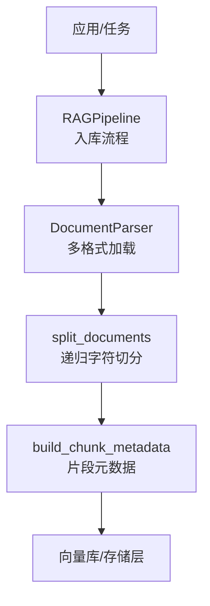
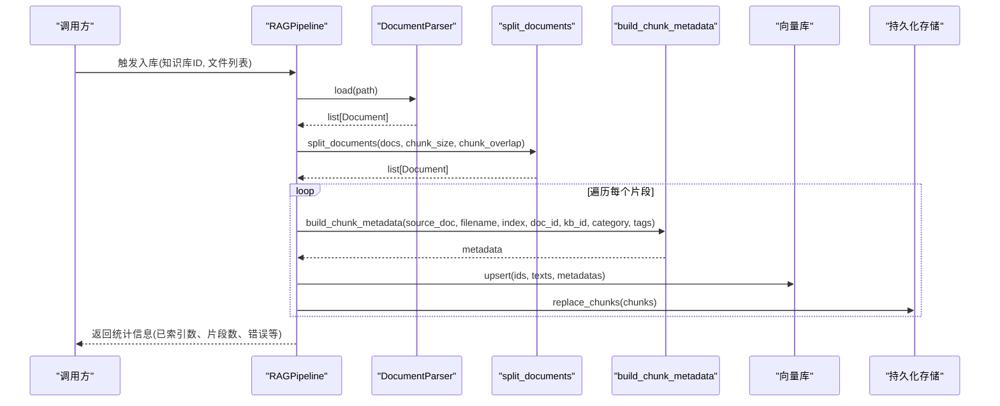
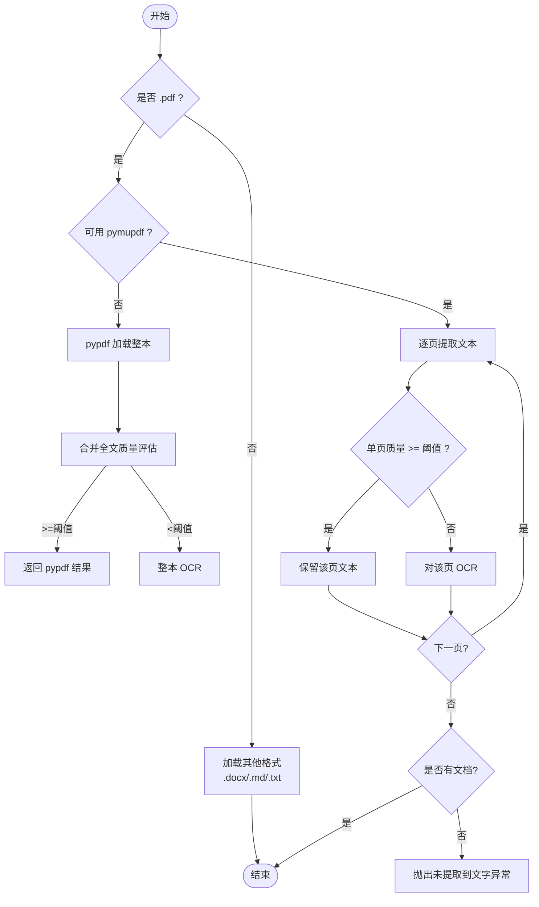
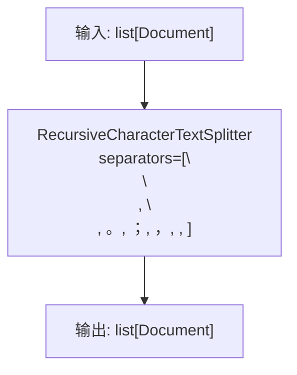
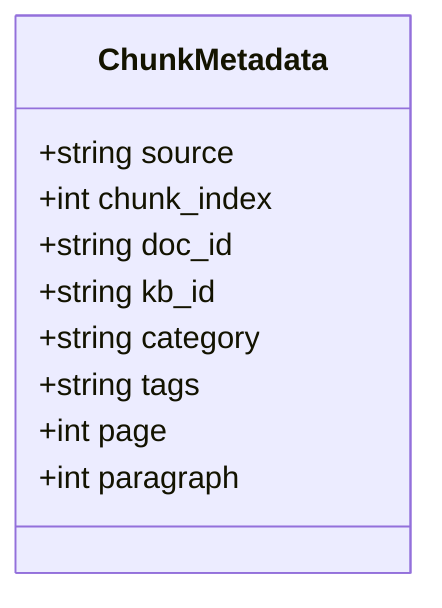
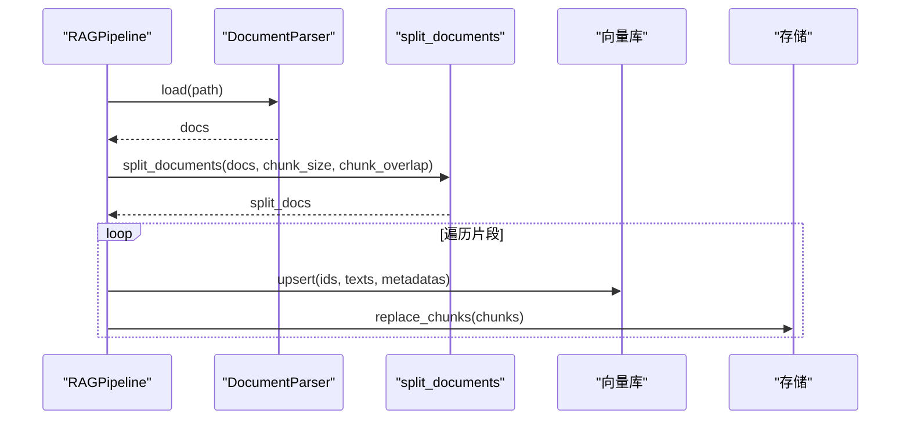
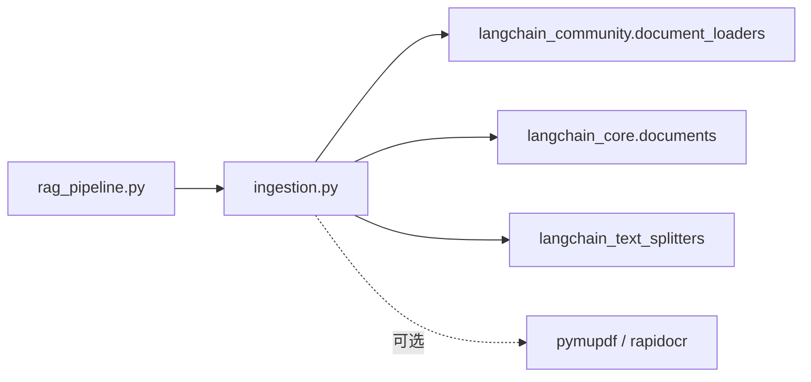

# 文档处理模块

<cite>
**本文引用的文件**
- [ingestion.py](file://ingestion.py)
- [rag_pipeline.py](file://rag_pipeline.py)
- [config.py](file://config.py)
- [test_ingestion.py](file://tests/test_ingestion.py)
</cite>

## 目录
1. [简介](#简介)
2. [项目结构](#项目结构)
3. [核心组件](#核心组件)
4. [架构总览](#架构总览)
5. [详细组件分析](#详细组件分析)
6. [依赖关系分析](#依赖关系分析)
7. [性能与优化](#性能与优化)
8. [故障排查指南](#故障排查指南)
9. [结论](#结论)
10. [附录：配置与示例](#附录：配置与示例)

## 简介
本模块负责将原始文档（PDF、Word、Markdown、TXT）解析为可入库的文本片段，并构建用于检索与溯源的元数据。其关键能力包括：
- 多格式读取与文本提取
- PDF 智能质量评估与本地 OCR 回退
- 基于语义边界的递归切分与重叠窗口
- 统一的片段元数据构建（来源、页码、段落序号、分类标签等）
- 与 RAG 流水线集成，完成增量索引、版本控制与错误隔离

## 项目结构
与文档处理直接相关的代码集中在 ingestion.py，并在 rag_pipeline.py 中作为入库流程的一部分被调用；相关可调参数集中在 config.py。测试用例位于 tests/test_ingestion.py，覆盖质量阈值、页码归一化与混合 PDF 的 OCR 回退逻辑。

**图表来源**
- [rag_pipeline.py:354-418](file://rag_pipeline.py#L354-L418)
- [ingestion.py:24-190](file://ingestion.py#L24-L190)

**章节来源**
- [ingestion.py:1-216](file://ingestion.py#L1-L216)
- [rag_pipeline.py:340-418](file://rag_pipeline.py#L340-L418)
- [config.py:56-113](file://config.py#L56-L113)
- [test_ingestion.py:1-64](file://tests/test_ingestion.py#L1-L64)

## 核心组件
- DocumentParser：按后缀分发到不同加载器；PDF 逐页质量评估与 OCR 回退；支持注入替换以便测试。
- split_documents：使用递归字符切分器，优先在段落/句子边界切分，保留 page 等元数据。
- build_chunk_metadata：生成片段级元数据，统一页码从 0 起转为人类可读的 1 起，并附加来源、分类、标签等信息。
- AppConfig：集中管理 chunk_size、chunk_overlap 等切分与检索参数，支持环境变量覆盖。

**章节来源**
- [ingestion.py:24-190](file://ingestion.py#L24-L190)
- [ingestion.py:193-216](file://ingestion.py#L193-L216)
- [config.py:56-113](file://config.py#L56-L113)

## 架构总览
下图展示了从文件到可检索片段的完整链路：解析 → 切分 → 元数据构建 → 写入向量与存储。

**图表来源**
- [rag_pipeline.py:354-418](file://rag_pipeline.py#L354-L418)
- [ingestion.py:24-190](file://ingestion.py#L24-L190)
- [ingestion.py:193-216](file://ingestion.py#L193-L216)

## 详细组件分析

### DocumentParser：多格式解析与 PDF 智能回退
- 支持格式
  - PDF：优先使用 PyMuPDF 逐页提取文本；若缺失则回退到 pypdf；对每页进行可读性评估，低于阈值则对该页执行本地 OCR（PyMuPDF + RapidOCR）。
  - Word(.docx)：通过 Docx2txtLoader 加载。
  - Markdown(.md)：以 UTF-8 编码直接文本加载，保留原文。
  - 文本(.txt)：UTF-8 自动探测编码加载。
- PDF 质量评估
  - 基于可见字符集合，统计“可读”字符比例（中文、ASCII、拉丁文、数字、标点、日文假名等），与阈值比较决定是否走 OCR。
  - 阈值常量：PDF_TEXT_QUALITY_THRESHOLD = 0.85。
- OCR 回退
  - 当某页无文本或质量不达标时，渲染为 PNG 并使用 RapidOCR 识别，失败时抛出带上下文信息的异常。
- 错误处理
  - 不支持的文件类型抛出 ValueError。
  - 无法提取或识别任何文字时抛出 RuntimeError。
  - 缺少 OCR 依赖时提示安装命令并抛出 RuntimeError。

**图表来源**
- [ingestion.py:27-78](file://ingestion.py#L27-L78)
- [ingestion.py:104-175](file://ingestion.py#L104-L175)

**章节来源**
- [ingestion.py:24-175](file://ingestion.py#L24-L175)
- [test_ingestion.py:10-22](file://tests/test_ingestion.py#L10-L22)
- [test_ingestion.py:35-63](file://tests/test_ingestion.py#L35-L63)

### 智能切分算法：语义边界与重叠窗口
- 切分器：RecursiveCharacterTextSplitter
- 分隔符优先级：双换行、单换行、句号、分号、逗号、空格、空串兜底。
- 参数
  - chunk_size：目标片段大小（由配置提供）。
  - chunk_overlap：相邻片段的重叠长度，用于保持上下文连续性。
  - add_start_index：记录起始位置，便于调试与定位。
- 行为特点
  - 尽量在段落/句子边界切分，减少语义割裂。
  - 保留源文档的 page 等元数据，便于溯源。

**图表来源**
- [ingestion.py:178-190](file://ingestion.py#L178-L190)

**章节来源**
- [ingestion.py:178-190](file://ingestion.py#L178-L190)

### 元数据构建：来源、页码、分类与标签
- 字段
  - source：文件名，用于引用与展示。
  - chunk_index：片段序号（从 1 开始）。
  - doc_id：所属文档 ID。
  - kb_id：所属知识库 ID。
  - category：分类标签（可选）。
  - tags：标签（可选）。
  - page：页码（内部 0 起，对外转换为 1 起）。
  - paragraph：段落序号（同 chunk_index）。
- 用途
  - 支撑检索结果的可解释性与回溯。
  - 支持按文档限定检索与重排。

**图表来源**
- [ingestion.py:193-216](file://ingestion.py#L193-L216)

**章节来源**
- [ingestion.py:193-216](file://ingestion.py#L193-L216)
- [test_ingestion.py:25-32](file://tests/test_ingestion.py#L25-L32)

### 预处理流程：文本清洗、编码与特殊字符
- 编码处理
  - .md 固定 UTF-8；.txt 自动探测编码；.docx 由加载器处理；PDF 文本层由底层库解码。
- 文本清洗
  - PDF 逐页提取后 strip 空白；OCR 结果过滤空行并按行拼接。
  - 质量评估剔除空白字符，仅统计可见字符，避免噪声影响阈值判断。
- 特殊字符
  - 质量评估依据 Unicode 名称与范围判定“可读”，兼容中日韩字符与 ASCII。

**章节来源**
- [ingestion.py:27-38](file://ingestion.py#L27-L38)
- [ingestion.py:57-78](file://ingestion.py#L57-L78)
- [ingestion.py:104-122](file://ingestion.py#L104-L122)
- [ingestion.py:152-175](file://ingestion.py#L152-L175)

### 切分策略配置：chunk_size 与 chunk_overlap 调优
- 默认值
  - chunk_size：500
  - chunk_overlap：50
- 调整建议
  - 增大 chunk_size：适合长段落、连贯叙述，提升检索召回但可能降低精确度。
  - 减小 chunk_size：适合细粒度知识，提高精确度但可能丢失上下文。
  - 增大 chunk_overlap：增强跨片段语义连续性，代价是冗余增加与存储开销上升。
  - 结合业务场景与下游模型上下文窗口进行权衡。
- 配置方式
  - 通过环境变量覆盖：CHUNK_SIZE、CHUNK_OVERLAP。

**章节来源**
- [config.py:76-113](file://config.py#L76-L113)

### 与 RAG 流水线的集成
- 入库流程
  - 计算文件摘要，调用 parser.load 解析，再调用 split_documents 切分。
  - 对每个片段构建元数据，批量 upsert 到向量库，更新持久化存储中的 chunks 与计数。
  - 清理旧片段 ID，保证一致性。
- 错误隔离
  - 单个文件解析/切分异常不影响其他文件继续处理，最终汇总错误列表。

**图表来源**
- [rag_pipeline.py:354-418](file://rag_pipeline.py#L354-L418)
- [ingestion.py:24-190](file://ingestion.py#L24-L190)

**章节来源**
- [rag_pipeline.py:354-418](file://rag_pipeline.py#L354-L418)

## 依赖关系分析
- 外部库
  - langchain_community.document_loaders：Docx2txtLoader、PyPDFLoader、TextLoader
  - langchain_core.documents：Document
  - langchain_text_splitters：RecursiveCharacterTextSplitter
  - 可选：pymupdf、rapidocr（PDF OCR）
- 耦合点
  - DocumentParser 与加载器强耦合，但通过后缀路由与异常处理降低风险。
  - 切分与元数据构建解耦，便于独立测试与替换。
  - 与 RAGPipeline 通过函数式接口交互，职责清晰。

**图表来源**
- [ingestion.py:13-15](file://ingestion.py#L13-L15)
- [rag_pipeline.py:354-418](file://rag_pipeline.py#L354-L418)

**章节来源**
- [ingestion.py:13-15](file://ingestion.py#L13-L15)
- [rag_pipeline.py:354-418](file://rag_pipeline.py#L354-L418)

## 性能与优化
- PDF 处理
  - 优先逐页提取，避免整本合并导致的误判；对低质量页单独 OCR，减少无效计算。
  - OCR 分辨率设为 2 倍，平衡识别率与 CPU 耗时。
- 切分与存储
  - 合理设置 chunk_size 与 chunk_overlap，控制冗余与上下文连续性。
  - 批量 upsert 与 replace_chunks，减少 I/O 次数。
- 资源与容错
  - 缺失依赖时给出明确安装提示，避免静默失败。
  - 单文件异常不影响整体入库进度，便于问题定位与重试。

[本节为通用指导，无需特定文件引用]

## 故障排查指南
- 无法识别文件格式
  - 现象：抛出“不支持的文件类型”。
  - 处理：确认文件扩展名是否在支持列表中（.pdf/.md/.txt/.docx）。
- PDF 文本不可读且未安装 OCR
  - 现象：抛出“本地 OCR 依赖未安装”并提示安装命令。
  - 处理：安装 pymupdf、rapidocr、onnxruntime。
- PDF 整本无内容
  - 现象：抛出“未能从 xxx 提取或识别出文字”。
  - 处理：检查 PDF 是否为纯图片扫描且 OCR 失败；尝试调整 OCR 环境或更换引擎。
- 切分后片段过短或过长
  - 现象：检索效果不佳。
  - 处理：调整 CHUNK_SIZE 与 CHUNK_OVERLAP，观察检索指标变化。
- 页码显示不一致
  - 现象：内部页码从 0 开始，对外展示从 1 开始。
  - 处理：这是预期设计，确保上层展示逻辑使用构建后的元数据。

**章节来源**
- [ingestion.py:27-31](file://ingestion.py#L27-L31)
- [ingestion.py:124-150](file://ingestion.py#L124-L150)
- [ingestion.py:152-175](file://ingestion.py#L152-L175)
- [ingestion.py:193-216](file://ingestion.py#L193-L216)

## 结论
该文档处理模块提供了健壮的多格式解析、智能 PDF 质量评估与本地 OCR 回退、语义友好的递归切分以及完善的片段元数据构建。通过与 RAG 流水线的紧密集成，实现了高效、可追溯、可扩展的文档入库能力。通过合理的 chunk_size 与 chunk_overlap 调优，可在不同业务场景下取得良好的检索效果。

[本节为总结性内容，无需特定文件引用]

## 附录：配置与示例

### 配置项说明（节选）
- chunk_size：文本片段目标大小，默认 500，可通过环境变量 CHUNK_SIZE 覆盖。
- chunk_overlap：片段重叠长度，默认 50，可通过环境变量 CHUNK_OVERLAP 覆盖。
- top_k：最终返回片段数，默认 5，可通过环境变量 RETRIEVAL_TOP_K 覆盖。
- fusion_pool：混合检索候选池大小，默认 12，可通过环境变量 RETRIEVAL_FUSION_POOL 覆盖。
- relevance_threshold：相关性门槛，默认 0.3，可通过环境变量 RETRIEVAL_RELEVANCE_THRESHOLD 覆盖。
- mmr_enabled / mmr_lambda：MMR 去重开关与权重，可通过环境变量 RETRIEVAL_MMR_ENABLED、RETRIEVAL_MMR_LAMBDA 覆盖。
- embedding_batch_size：向量化批大小，默认 16，上限 20，可通过环境变量 EMBEDDING_BATCH_SIZE 覆盖。

**章节来源**
- [config.py:56-113](file://config.py#L56-L113)

### 典型处理流程示例（步骤级）
- 解析 PDF
  - 使用 DocumentParser.load 加载 PDF；若某页质量低于阈值，则对该页执行 OCR。
  - 参考路径：[ingestion.py:27-78](file://ingestion.py#L27-L78)、[ingestion.py:104-175](file://ingestion.py#L104-L175)
- 切分与元数据
  - 使用 split_documents 进行递归切分；使用 build_chunk_metadata 构建片段元数据。
  - 参考路径：[ingestion.py:178-216](file://ingestion.py#L178-L216)
- 入库与存储
  - 在 RAGPipeline 中调用上述方法，批量 upsert 向量并更新存储。
  - 参考路径：[rag_pipeline.py:354-418](file://rag_pipeline.py#L354-L418)

**章节来源**
- [ingestion.py:27-216](file://ingestion.py#L27-L216)
- [rag_pipeline.py:354-418](file://rag_pipeline.py#L354-L418)