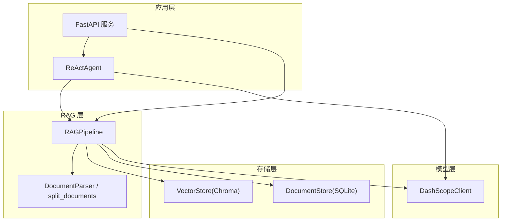
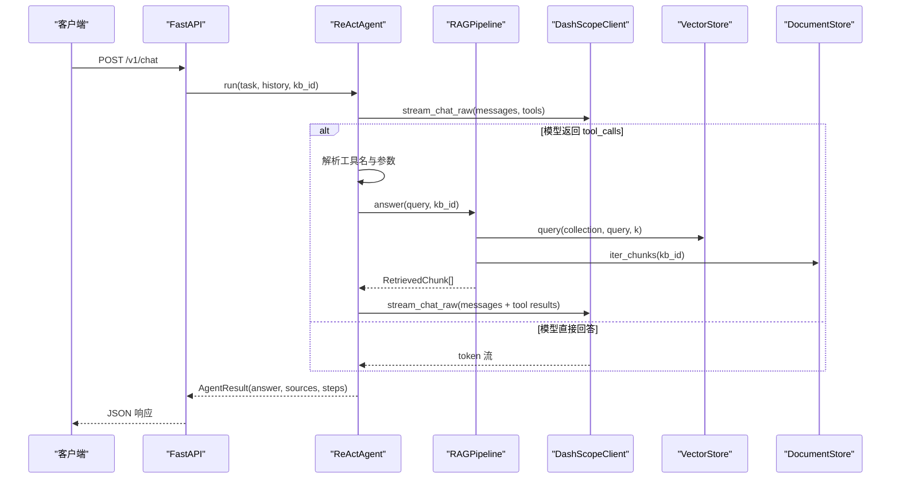
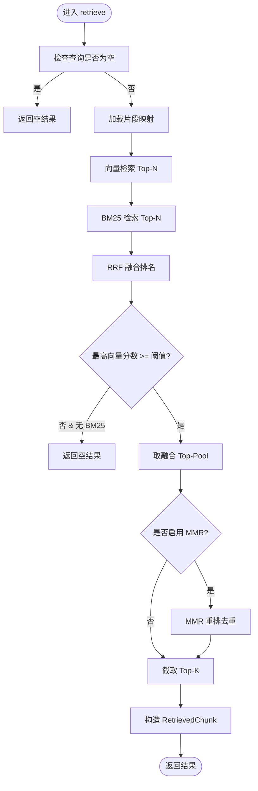
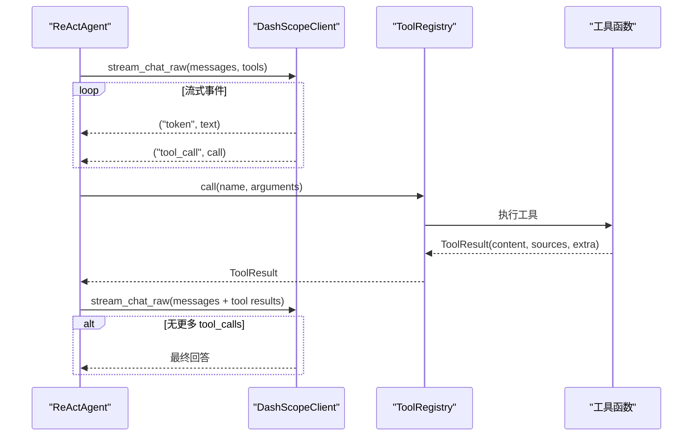
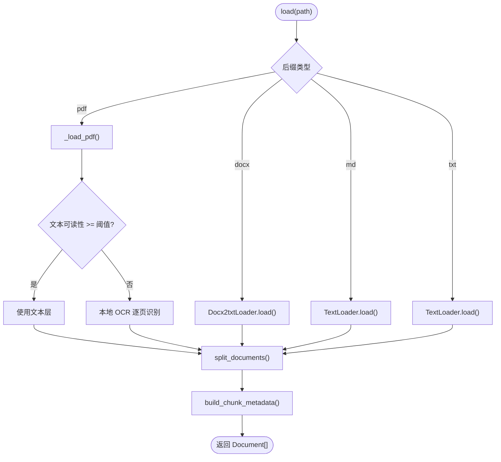
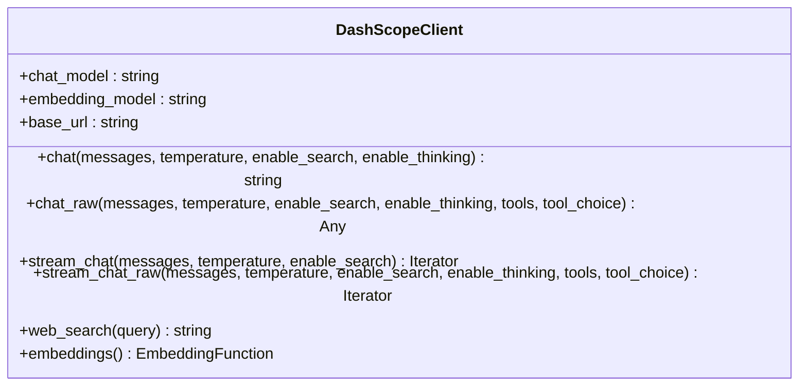
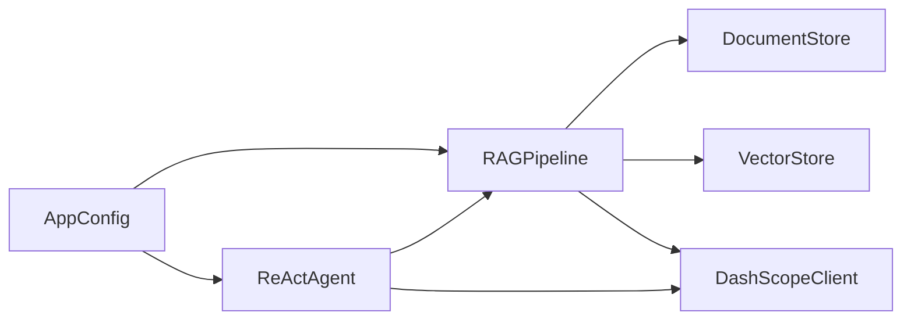

# 核心模块

<cite>
**本文引用的文件**
- [rag_pipeline.py](file://rag_pipeline.py)
- [react_agent.py](file://react_agent.py)
- [ingestion.py](file://ingestion.py)
- [llm_client.py](file://llm_client.py)
- [vector_store.py](file://vector_store.py)
- [store.py](file://store.py)
- [config.py](file://config.py)
- [api.py](file://api.py)
- [test_retrieval.py](file://tests/test_retrieval.py)
</cite>

## 目录
1. [简介](#简介)
2. [项目结构](#项目结构)
3. [核心组件](#核心组件)
4. [架构总览](#架构总览)
5. [详细组件分析](#详细组件分析)
6. [依赖关系分析](#依赖关系分析)
7. [性能考量](#性能考量)
8. [故障排查指南](#故障排查指南)
9. [结论](#结论)
10. [附录](#附录)

## 简介
本技术文档聚焦于项目的核心模块，系统性说明 RAG 管线与 Agent 系统的实现细节：混合检索算法（向量 + BM25 融合、RRF 排序、MMR 去重）、查询改写机制、上下文构建策略；Agent 的 Function Calling 实现、工具注册表设计、多步循环执行逻辑；文档解析模块对 PDF/Word/Markdown/TXT 的多格式处理与智能切分；以及 LLM 客户端封装的流式对话、Function Calling 支持与错误处理机制。文档提供代码级流程图与时序图，并给出 API 调用模式与配置项说明，帮助读者快速理解与扩展系统。

## 项目结构
项目采用“按功能分层”的组织方式：
- RAG 管线：负责知识库管理、增量入库、混合检索、问答生成
- Agent：基于 Function Calling 的多步推理与工具调用
- 文档解析：PDF/Word/Markdown/TXT 解析与智能切分
- 向量存储：Chroma 封装，支持批量 upsert、条件删除、相似度查询、取回向量
- 元数据存储：SQLite 持久化知识库、文档、片段与版本信息
- LLM 客户端：统一封装百炼 OpenAI 兼容接口，支持 chat/chat_raw/stream_chat/stream_chat_raw
- 配置：集中环境变量驱动的配置类
- API：FastAPI 服务层暴露 REST 接口

图表来源
- [api.py:34-57](file://api.py#L34-L57)
- [rag_pipeline.py:196-219](file://rag_pipeline.py#L196-L219)
- [react_agent.py:144-161](file://react_agent.py#L144-L161)
- [vector_store.py:38-59](file://vector_store.py#L38-L59)
- [store.py:123-138](file://store.py#L123-L138)
- [llm_client.py:22-46](file://llm_client.py#L22-L46)

章节来源
- [api.py:1-204](file://api.py#L1-L204)
- [rag_pipeline.py:1-792](file://rag_pipeline.py#L1-L792)
- [react_agent.py:1-567](file://react_agent.py#L1-L567)
- [ingestion.py:1-216](file://ingestion.py#L1-L216)
- [vector_store.py:1-255](file://vector_store.py#L1-L255)
- [store.py:1-470](file://store.py#L1-L470)
- [llm_client.py:1-322](file://llm_client.py#L1-L322)
- [config.py:1-113](file://config.py#L1-L113)

## 核心组件
- RAG 管线：提供知识库创建/删除、文档上传与版本管理、增量入库、混合检索、查询改写、带引用回答等能力
- Agent：通过工具注册表将 RAG、天气、联网搜索、数据库查询等工具以 JSON Schema 暴露给 LLM，进行多步循环推理
- 文档解析：按后缀选择加载器，PDF 文本质量评估与本地 OCR 回退，递归字符切分保留页码与段落信息
- 向量存储：Chroma 集合管理，批量嵌入写入、条件删除、相似度查询、取回原始向量用于 MMR
- 元数据存储：SQLite 多表结构，支持知识库、文档、版本、片段、键值配置，WAL 模式与锁保护并发安全
- LLM 客户端：统一封装 chat/chat_raw/stream_chat/stream_chat_raw，支持 Function Calling、联网搜索、token 用量记录与错误包装
- 配置：集中读取环境变量，控制切分、检索、重排、历史长度、Agent 最大步骤等关键参数

章节来源
- [rag_pipeline.py:196-792](file://rag_pipeline.py#L196-L792)
- [react_agent.py:93-246](file://react_agent.py#L93-L246)
- [ingestion.py:24-190](file://ingestion.py#L24-L190)
- [vector_store.py:38-149](file://vector_store.py#L38-L149)
- [store.py:31-470](file://store.py#L31-L470)
- [llm_client.py:22-299](file://llm_client.py#L22-L299)
- [config.py:56-113](file://config.py#L56-L113)

## 架构总览
下图展示从用户请求到最终回答的端到端流程，包括 RAG 检索与 Agent 工具调用的交互。

图表来源
- [api.py:185-199](file://api.py#L185-L199)
- [react_agent.py:250-370](file://react_agent.py#L250-L370)
- [rag_pipeline.py:590-666](file://rag_pipeline.py#L590-L666)
- [vector_store.py:100-126](file://vector_store.py#L100-L126)
- [store.py:425-442](file://store.py#L425-L442)
- [llm_client.py:203-278](file://llm_client.py#L203-L278)

## 详细组件分析

### RAG 管线：混合检索、查询改写与上下文构建
- 混合检索
  - 向量检索：使用 VectorStore.query 获取 Top-N 候选，计算余弦相似度得分
  - BM25 检索：基于 utils.retrieval.BM25Index 构建词项索引，top() 返回关键词命中
  - RRF 融合：reciprocal_rank_fusion 将两份排名合并为统一分数，只看排名不看得分尺度
  - MMR 去重：可选启用，根据 lambda 平衡相关性与多样性，避免重复片段
  - 相关性门槛：若最佳向量相似度低于阈值且无 BM25 命中，则视为无相关内容
- 查询改写
  - 多轮对话时，使用 LLM 将追问题改写为独立明确的问题，失败或异常长时退回原问题
- 上下文构建
  - 将检索到的片段组装为“来源+内容”的块，按 token 预算选取前若干块，限制历史消息长度，减少无关上下文稀释注意力
- 增量入库
  - SHA-256 判重，索引配置变化时全量重建；先写新向量再清理旧片段 id，保证一致性

图表来源
- [rag_pipeline.py:439-523](file://rag_pipeline.py#L439-L523)
- [vector_store.py:100-126](file://vector_store.py#L100-L126)
- [test_retrieval.py:40-80](file://tests/test_retrieval.py#L40-L80)

章节来源
- [rag_pipeline.py:439-523](file://rag_pipeline.py#L439-L523)
- [rag_pipeline.py:566-588](file://rag_pipeline.py#L566-L588)
- [rag_pipeline.py:590-666](file://rag_pipeline.py#L590-L666)
- [rag_pipeline.py:306-435](file://rag_pipeline.py#L306-L435)
- [test_retrieval.py:40-80](file://tests/test_retrieval.py#L40-L80)

### Agent 系统：Function Calling、工具注册表与多步循环
- 工具注册表
  - ToolRegistry 维护工具名称、描述、JSON Schema 与函数实现
  - specs() 输出 OpenAI 兼容 tools 列表；call(name, arguments) 执行工具并返回 ToolResult
- 内置工具
  - search_knowledge_base：调用 RAGPipeline.answer 获取带引用的答案
  - search_web：通过 DashScopeClient.web_search 获取联网信息
  - get_weather：调用 Open-Meteo 获取城市天气
  - query_database：只读 SQLite 查询，首关键字软校验 + 只读连接双重保护
- 多步循环
  - ReActAgent.run_stream 使用 stream_chat_raw 接收 token 与 tool_call 事件
  - 聚合 tool_calls，执行工具后将 observation 回填 messages，直到模型直接回答或达到最大步骤
  - 事件流包含 tool_start/tool_end/step/token/done/error，便于 UI 渲染

图表来源
- [react_agent.py:93-142](file://react_agent.py#L93-L142)
- [react_agent.py:165-246](file://react_agent.py#L165-L246)
- [react_agent.py:272-370](file://react_agent.py#L272-L370)
- [llm_client.py:203-278](file://llm_client.py#L203-L278)

章节来源
- [react_agent.py:93-142](file://react_agent.py#L93-L142)
- [react_agent.py:165-246](file://react_agent.py#L165-L246)
- [react_agent.py:272-370](file://react_agent.py#L272-L370)
- [react_agent.py:373-470](file://react_agent.py#L373-L470)

### 文档解析模块：多格式处理与智能切分
- 支持格式
  - PDF：优先用 PyMuPDF 提取文本层，逐页质量评估；低于阈值则切换本地 OCR（PyMuPDF + RapidOCR）
  - Word(.docx)：Docx2txtLoader 加载
  - Markdown(.md)：TextLoader 直接读取
  - TXT：TextLoader 自动检测编码
- 智能切分
  - RecursiveCharacterTextSplitter 按段落/句子边界切分，保留 page 与 paragraph 元数据
- 元数据构建
  - build_chunk_metadata 生成 source/page/paragraph/doc_id/kb_id/category/tags 等字段，便于引用与定位

图表来源
- [ingestion.py:24-78](file://ingestion.py#L24-L78)
- [ingestion.py:104-175](file://ingestion.py#L104-L175)
- [ingestion.py:178-216](file://ingestion.py#L178-L216)

章节来源
- [ingestion.py:24-78](file://ingestion.py#L24-L78)
- [ingestion.py:104-175](file://ingestion.py#L104-L175)
- [ingestion.py:178-216](file://ingestion.py#L178-L216)

### LLM 客户端封装：流式对话、Function Calling 与错误处理
- 流式对话
  - stream_chat：yield (type, content)，支持 reasoning/content 两类事件
  - stream_chat_raw：yield ("token", str) 与 ("tool_call", dict)，累积 tool_calls 后统一产出
- Function Calling
  - chat_raw 与 stream_chat_raw 支持 tools 与 tool_choice，返回 message.tool_calls
- 错误处理
  - safe_error 包装异常，隐藏冗长堆栈，保留可排障原因
  - 所有外部调用捕获异常并转换为 RuntimeError，便于上层统一处理

图表来源
- [llm_client.py:22-299](file://llm_client.py#L22-L299)

章节来源
- [llm_client.py:22-299](file://llm_client.py#L22-L299)

## 依赖关系分析
- RAGPipeline 依赖：
  - DocumentStore：知识库/文档/片段/版本管理
  - VectorStore：向量集合操作
  - DashScopeClient：聊天、流式、Function Calling、联网搜索
  - utils.retrieval：BM25Index、reciprocal_rank_fusion、mmr_rerank
- ReActAgent 依赖：
  - RAGPipeline：作为工具之一（search_knowledge_base）
  - DashScopeClient：流式 Function Calling
  - ToolRegistry：工具注册与执行
- 配置 AppConfig：
  - 控制 chunk_size/chunk_overlap/top_k/fusion_pool/relevance_threshold/mmr_enabled/mmr_lambda/query_rewrite_enabled/history_max_tokens/rag_context_max_tokens/agent_max_steps/embedding_batch_size

图表来源
- [config.py:56-113](file://config.py#L56-L113)
- [rag_pipeline.py:196-219](file://rag_pipeline.py#L196-L219)
- [react_agent.py:144-161](file://react_agent.py#L144-L161)

章节来源
- [config.py:56-113](file://config.py#L56-L113)
- [rag_pipeline.py:196-219](file://rag_pipeline.py#L196-L219)
- [react_agent.py:144-161](file://react_agent.py#L144-L161)

## 性能考量
- 向量化批大小：默认 EMBEDDING_BATCH_SIZE=16，避免超过模型单次上限导致报错
- 检索池大小：RETRIEVAL_FUSION_POOL 控制融合候选数，过大增加计算开销，过小降低召回
- 相关性阈值：RETRIEVAL_RELEVANCE_THRESHOLD 防止低相关检索污染上下文
- MMR 去重：RETRIEVAL_MMR_ENABLED=true 可减少重复片段，提升上下文利用率
- 历史与上下文长度：HISTORY_MAX_TOKENS 与 RAG_CONTEXT_MAX_TOKENS 控制输入长度，降低延迟与成本
- Agent 最大步骤：AGENT_MAX_STEPS 限制工具调用轮数，防止无限循环

章节来源
- [config.py:90-113](file://config.py#L90-L113)
- [rag_pipeline.py:439-523](file://rag_pipeline.py#L439-L523)
- [rag_pipeline.py:590-666](file://rag_pipeline.py#L590-L666)
- [react_agent.py:272-370](file://react_agent.py#L272-L370)

## 故障排查指南
- 未配置密钥
  - 现象：抛出“未配置 DASHSCOPE_API_KEY”
  - 处理：复制 .env.example 为 .env 并填写有效密钥
- base_url 格式错误
  - 现象：抛出“base_url 格式不正确，应以 /compatible-mode/v1 结尾”
  - 处理：修正环境变量 DASHSCOPE_BASE_URL
- 向量库为空或无命中
  - 现象：retrieve 返回空结果
  - 处理：确认已执行 ingest；调整 RETRIEVAL_FUSION_POOL 与 RETRIEVAL_RELEVANCE_THRESHOLD
- BM25 兜底命中
  - 现象：向量无命中但 BM25 强命中仍返回结果
  - 处理：这是预期行为，确保查询包含精确术语
- 工具执行失败
  - 现象：tool_end 中 observation 包含“工具执行失败”
  - 处理：检查工具参数与外部服务可用性；Agent 会尝试换参数重试或直接回答
- 数据库只读限制
  - 现象：query_database 拒绝非 SELECT/PRAGMA/EXPLAIN/WITH 语句
  - 处理：仅使用只读 SQL；如需写入请通过其他途径

章节来源
- [llm_client.py:59-86](file://llm_client.py#L59-L86)
- [llm_client.py:94-170](file://llm_client.py#L94-L170)
- [rag_pipeline.py:439-523](file://rag_pipeline.py#L439-L523)
- [react_agent.py:373-470](file://react_agent.py#L373-L470)

## 结论
本项目在 RAG 与 Agent 两个核心模块上实现了工程化落地：RAG 管线通过向量 + BM25 混合检索、RRF 融合与 MMR 去重，兼顾语义与关键词匹配；查询改写与上下文构建有效控制输入长度与噪声；Agent 通过工具注册表与多步循环实现真正的 Function Calling 推理；文档解析支持多格式与智能切分；LLM 客户端封装了流式对话与错误处理。整体架构清晰、可扩展性强，适合企业知识库场景的快速部署与迭代。

## 附录
- API 调用模式（示例）
  - 创建知识库：POST /v1/kbs，请求体 {name, description}
  - 上传文档：POST /v1/kbs/{kb_id}/documents，multipart 表单 file/category/tags
  - 触发入库：POST /v1/kbs/{kb_id}/ingest
  - 列出文档：GET /v1/kbs/{kb_id}/documents
  - 知识库统计：GET /v1/kbs/{kb_id}/stats
  - 删除文档：DELETE /v1/documents/{doc_id}
  - 对话问答：POST /v1/chat，请求体 {question, history, kb_id}

章节来源
- [api.py:103-199](file://api.py#L103-L199)