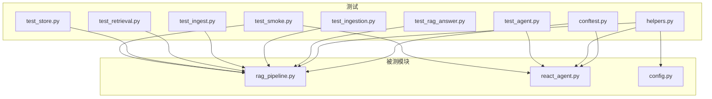
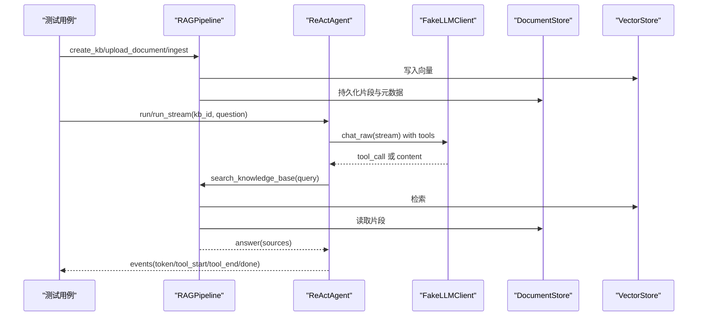
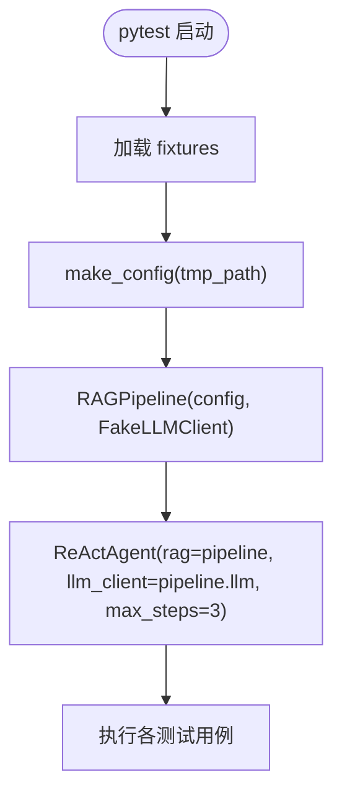
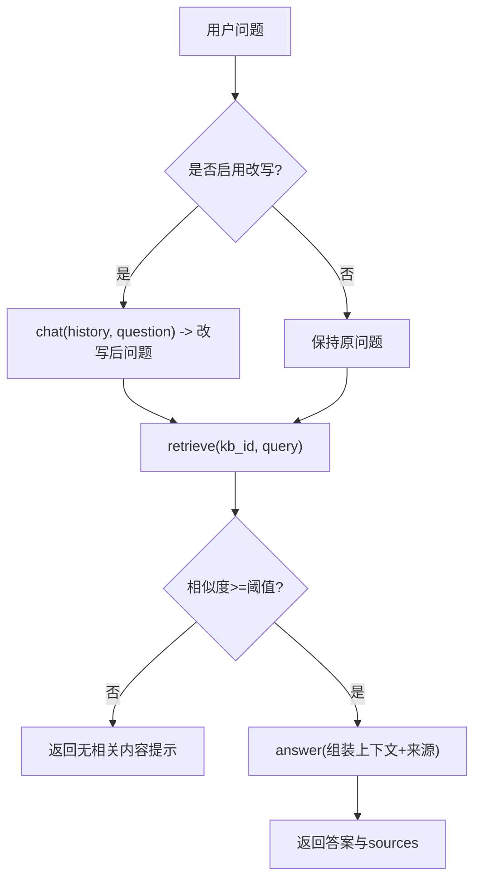
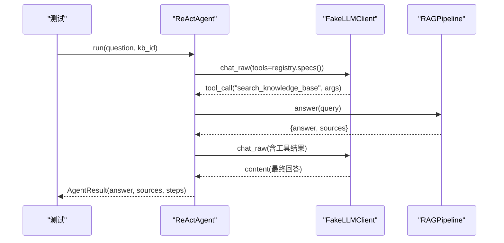
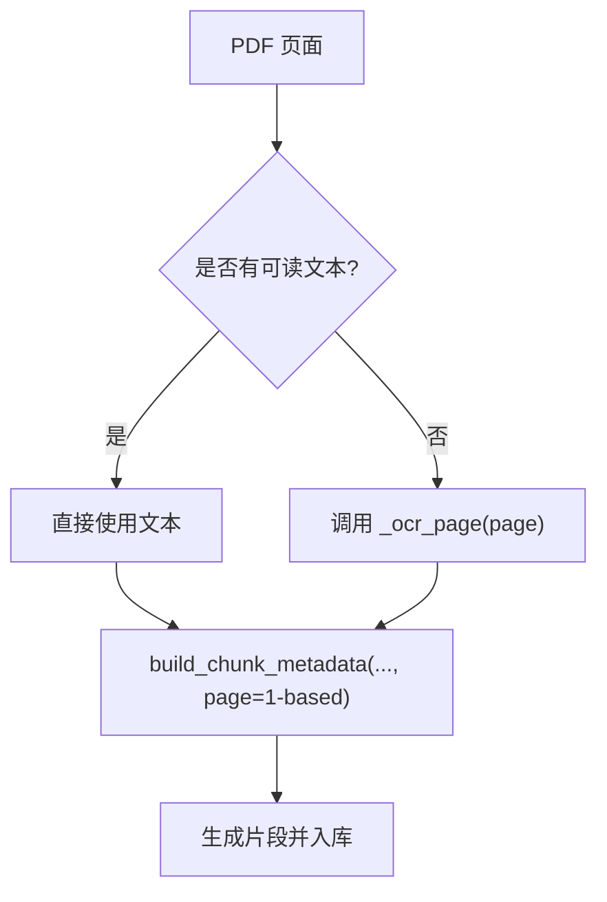
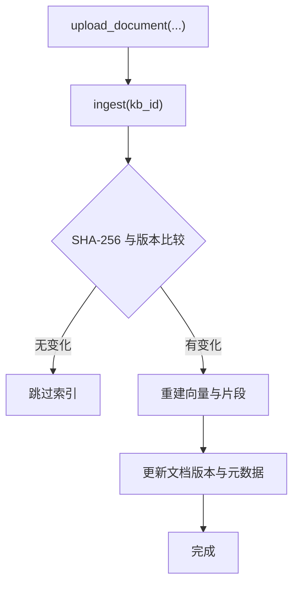
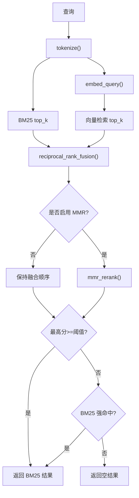
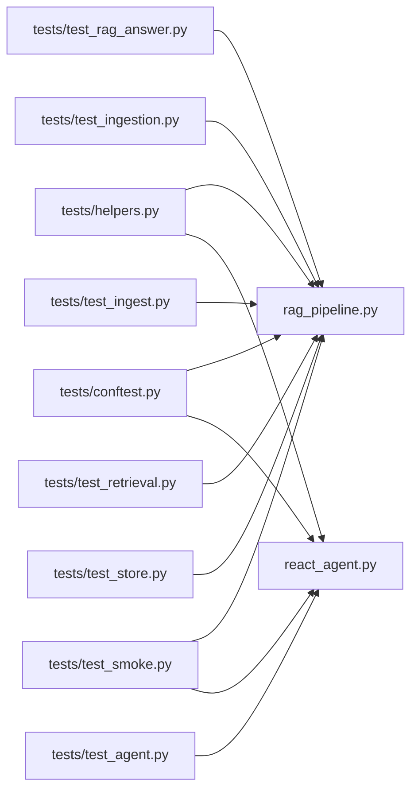

# 单元测试

<cite>
**本文引用的文件**
- [tests/conftest.py](file://tests/conftest.py)
- [tests/helpers.py](file://tests/helpers.py)
- [tests/test_agent.py](file://tests/test_agent.py)
- [tests/test_rag_answer.py](file://tests/test_rag_answer.py)
- [tests/test_ingestion.py](file://tests/test_ingestion.py)
- [tests/test_ingest.py](file://tests/test_ingest.py)
- [tests/test_retrieval.py](file://tests/test_retrieval.py)
- [tests/test_smoke.py](file://tests/test_smoke.py)
- [tests/test_store.py](file://tests/test_store.py)
- [rag_pipeline.py](file://rag_pipeline.py)
- [react_agent.py](file://react_agent.py)
- [config.py](file://config.py)
- [pyproject.toml](file://pyproject.toml)
- [.github/workflows/ci.yml](file://.github/workflows/ci.yml)
</cite>

## 目录
1. [简介](#简介)
2. [项目结构](#项目结构)
3. [核心组件](#核心组件)
4. [架构总览](#架构总览)
5. [详细组件分析](#详细组件分析)
6. [依赖关系分析](#依赖关系分析)
7. [性能考量](#性能考量)
8. [故障排查指南](#故障排查指南)
9. [结论](#结论)
10. [附录](#附录)

## 简介
本文件面向测试工程师与开发者，系统化说明本项目的 pytest 测试框架使用方法、测试架构设计以及 46 个单元测试的组织方式。重点覆盖：
- Mock 策略：FakeLLMClient、FakeEmbeddings、工具桩等
- 测试数据管理：临时目录、知识库隔离、增量入库验证
- 用例设计模式：RAG 问答、Agent 功能、文档解析与切分、混合检索、SQLite 存储
- 环境配置、断言方法、覆盖率与持续集成流程

## 项目结构
测试代码位于 tests/ 目录下，按功能域划分：
- conftest.py：pytest 夹具，提供 pipeline 与 agent 实例
- helpers.py：测试公共设施（假 LLM、假嵌入、配置构造、上传与入库辅助）
- test_rag_answer.py：RAG 问答链路（引用来源、阈值、查询改写、多库隔离）
- test_agent.py：Agent 工具注册表、function calling、流式输出、天气工具
- test_ingestion.py：文档解析与切分（质量阈值、页码归一化、OCR 回退）
- test_ingest.py：入库链路（增量索引、版本控制、配置变更触发重建、旧文件迁移）
- test_retrieval.py：混合检索（分词、BM25、RRF、MMR、向量兜底）
- test_store.py：SQLite 文档库（知识库、文档版本、片段、元数据）
- test_smoke.py：端到端冒烟测试（上传→入库→检索→问答→删除）

图表来源
- [tests/conftest.py:12-22](file://tests/conftest.py#L12-L22)
- [tests/helpers.py:136-166](file://tests/helpers.py#L136-L166)
- [rag_pipeline.py:196-200](file://rag_pipeline.py#L196-L200)
- [react_agent.py:144-157](file://react_agent.py#L144-L157)
- [config.py:56-87](file://config.py#L56-L87)

章节来源
- [tests/conftest.py:1-23](file://tests/conftest.py#L1-L23)
- [tests/helpers.py:1-166](file://tests/helpers.py#L1-L166)
- [rag_pipeline.py:1-200](file://rag_pipeline.py#L1-L200)
- [react_agent.py:1-200](file://react_agent.py#L1-L200)
- [config.py:1-113](file://config.py#L1-L113)

## 核心组件
- FakeLLMClient：可脚本化的假 LLM，支持 chat/chat_raw/stream_chat/stream_chat_raw/web_search/embeddings；通过 script 列表驱动 tool_call 与最终回答，便于精确控制 Agent 行为。
- FakeEmbeddings：确定性稀疏嵌入（n-gram 词袋），用于离线验证 RAG 全链路逻辑，不依赖网络与真实模型。
- make_config：基于 tmp_path 生成 AppConfig，设置合理的默认值（如 relevance_threshold=0.05、agent_max_steps=3），保证测试稳定且快速。
- upload_text / ingest_all：便捷封装 RAGPipeline 的上传与入库，简化用例准备。

章节来源
- [tests/helpers.py:16-134](file://tests/helpers.py#L16-L134)
- [tests/helpers.py:136-166](file://tests/helpers.py#L136-L166)
- [tests/conftest.py:12-22](file://tests/conftest.py#L12-L22)

## 架构总览
测试围绕“RAG 管线 + Agent”的双层架构展开：
- RAG 管线负责知识库管理、增量入库、混合检索（向量+BM25）、查询改写与带引用问答
- Agent 基于 Function Calling 实现工具选择与多步循环，支持流式事件输出

图表来源
- [tests/conftest.py:12-22](file://tests/conftest.py#L12-L22)
- [tests/helpers.py:73-134](file://tests/helpers.py#L73-L134)
- [rag_pipeline.py:196-200](file://rag_pipeline.py#L196-L200)
- [react_agent.py:144-200](file://react_agent.py#L144-L200)

## 详细组件分析

### 测试夹具与基础设施
- pipeline 夹具：使用 make_config(tmp_path) 与 FakeLLMClient 构造 RAGPipeline，确保每次测试独立、可重复
- agent 夹具：复用 pipeline 的 llm，并注入 ReActAgent，限制 max_steps=3 以加速测试

图表来源
- [tests/conftest.py:12-22](file://tests/conftest.py#L12-L22)
- [tests/helpers.py:136-157](file://tests/helpers.py#L136-L157)

章节来源
- [tests/conftest.py:1-23](file://tests/conftest.py#L1-L23)
- [tests/helpers.py:136-166](file://tests/helpers.py#L136-L166)

### RAG 问答测试（引用来源、阈值、改写、多库隔离）
- 引用来源：验证 answer 返回 sources，且 citation 包含文件名
- 相关性阈值：无关问题被拦截，返回“没有检索到”
- 查询改写：启用 rewrite 时调用 chat 改写历史上下文中的问题
- 多知识库隔离：不同 kb 的 chunks 与统计相互独立

图表来源
- [tests/test_rag_answer.py:15-49](file://tests/test_rag_answer.py#L15-L49)
- [rag_pipeline.py:42-78](file://rag_pipeline.py#L42-L78)

章节来源
- [tests/test_rag_answer.py:1-113](file://tests/test_rag_answer.py#L1-L113)
- [rag_pipeline.py:159-193](file://rag_pipeline.py#L159-L193)

### Agent 功能测试（工具注册表、Function Calling、流式输出、天气工具）
- 工具注册表：register/specs/names/call 的完整生命周期
- Function Calling：通过 FakeMessage/FakeToolCall 模拟 LLM 的工具调用序列
- 最大轮数：达到 max_steps 后停止并提示
- 天气工具：用 monkeypatch 替换 urlopen，构造地理编码与天气响应
- 流式事件：run_stream 产出 tool_start/tool_end/token/done，验证真流式输出

图表来源
- [tests/test_agent.py:11-53](file://tests/test_agent.py#L11-L53)
- [react_agent.py:93-142](file://react_agent.py#L93-L142)
- [react_agent.py:165-200](file://react_agent.py#L165-L200)

章节来源
- [tests/test_agent.py:1-159](file://tests/test_agent.py#L1-L159)
- [react_agent.py:1-200](file://react_agent.py#L1-L200)

### 文档处理测试（解析、切分、质量阈值、OCR 回退）
- 文本质量：中文正常文本得分高于阈值，CID 乱码低于阈值
- 页码归一化：构建 chunk 元数据时页码从 1 开始
- OCR 回退：对空白/扫描页单独走 OCR，不再整本丢弃

图表来源
- [tests/test_ingestion.py:10-33](file://tests/test_ingestion.py#L10-L33)
- [tests/test_ingestion.py:35-64](file://tests/test_ingestion.py#L35-L64)

章节来源
- [tests/test_ingestion.py:1-64](file://tests/test_ingestion.py#L1-L64)

### 入库链路测试（增量索引、版本控制、配置变更、旧文件迁移）
- 增量索引：重复 inges t 无变化时返回“已是最新”
- 文件变更：同名文件重传自动升版本，向量与片段同步更新
- 配置变更：索引配置不一致时强制全量重建
- 旧文件迁移：历史遗留文档迁移至 default 知识库

图表来源
- [tests/test_ingest.py:9-49](file://tests/test_ingest.py#L9-L49)
- [tests/test_ingest.py:52-75](file://tests/test_ingest.py#L52-L75)

章节来源
- [tests/test_ingest.py:1-75](file://tests/test_ingest.py#L1-L75)

### 混合检索测试（分词、BM25、RRF、MMR、向量兜底）
- 分词：中英文混合正确切分
- BM25：关键词命中优先
- RRF：融合排序符合预期
- MMR：在低 λ 下倾向多样性
- 向量兜底：当向量相似度低于阈值但 BM25 强命中时，仍返回结果

图表来源
- [tests/test_retrieval.py:12-81](file://tests/test_retrieval.py#L12-L81)

章节来源
- [tests/test_retrieval.py:1-81](file://tests/test_retrieval.py#L1-L81)

### SQLite 存储测试（知识库、文档版本、片段、元数据）
- 知识库创建与列举
- 重复名称抛出异常
- 文档版本递增与 SHA 更新
- 片段替换与删除
- 元数据读写
- 软删除文档

章节来源
- [tests/test_store.py:1-69](file://tests/test_store.py#L1-L69)

### 端到端冒烟测试
- 离线跑通：上传→入库→检索→问答→Agent 工具调用→删除，验证全链路连通性

章节来源
- [tests/test_smoke.py:1-46](file://tests/test_smoke.py#L1-L46)

## 依赖关系分析
- 测试夹具依赖 helpers 提供的 FakeLLMClient、make_config
- 测试用例依赖被测模块 rag_pipeline 与 react_agent
- 配置集中由 config.AppConfig 提供，测试通过 make_config 注入临时路径与参数

图表来源
- [tests/conftest.py:12-22](file://tests/conftest.py#L12-L22)
- [tests/helpers.py:136-166](file://tests/helpers.py#L136-L166)
- [rag_pipeline.py:196-200](file://rag_pipeline.py#L196-L200)
- [react_agent.py:144-200](file://react_agent.py#L144-L200)

章节来源
- [tests/conftest.py:1-23](file://tests/conftest.py#L1-L23)
- [tests/helpers.py:1-166](file://tests/helpers.py#L1-L166)
- [rag_pipeline.py:1-200](file://rag_pipeline.py#L1-L200)
- [react_agent.py:1-200](file://react_agent.py#L1-L200)

## 性能考量
- 使用 FakeEmbeddings 与 FakeLLMClient 避免网络与模型开销，提升测试速度
- 降低 relevance_threshold 与禁用 MMR，减少误判与计算成本
- 限制 agent.max_steps=3，缩短 Agent 循环时间
- 使用 tmp_path 隔离数据，避免磁盘 I/O 污染

[本节为通用指导，无需具体文件来源]

## 故障排查指南
- 向量检索为空：检查相关性阈值与 BM25 兜底逻辑，确认 retrieve 是否触发 fallback
- Agent 未调用工具：确认 FakeLLMClient.script 中是否包含 tool_calls，以及 registry 是否正确注册
- 流式输出异常：检查 run_stream 事件类型序列，确保 token 与 done 事件存在
- 入库无变化：确认文件内容或配置是否真正改变，必要时强制重建

章节来源
- [tests/test_retrieval.py:64-81](file://tests/test_retrieval.py#L64-L81)
- [tests/test_agent.py:30-53](file://tests/test_agent.py#L30-L53)
- [tests/test_agent.py:115-138](file://tests/test_agent.py#L115-L138)
- [tests/test_ingest.py:9-49](file://tests/test_ingest.py#L9-L49)

## 结论
本项目测试体系以 pytest 为核心，通过 FakeLLMClient 与 FakeEmbeddings 实现完全离线、可复现的测试环境。测试覆盖 RAG 问答、Agent 工具链、文档解析与入库、混合检索与存储等关键路径，配合 CI 流水线保障质量。建议后续补充覆盖率报告与更丰富的边界用例，进一步提升健壮性。

[本节为总结性内容，无需具体文件来源]

## 附录

### 测试环境配置
- pytest 配置：testpaths 指向 tests，关闭警告
- 运行命令：pytest
- 环境变量：AppConfig.from_env 支持覆盖默认参数（如 EMBEDDING_BATCH_SIZE、RETRIEVAL_RELEVANCE_THRESHOLD 等）

章节来源
- [pyproject.toml:1-4](file://pyproject.toml#L1-L4)
- [config.py:89-113](file://config.py#L89-L113)

### 测试数据准备
- 使用 tmp_path 作为数据根目录，避免污染本地文件系统
- 通过 upload_text 与 ingest_all 快速准备知识库与索引
- 多知识库隔离：每个 kb 拥有独立的向量集合与统计

章节来源
- [tests/conftest.py:12-22](file://tests/conftest.py#L12-L22)
- [tests/helpers.py:160-166](file://tests/helpers.py#L160-L166)
- [tests/test_rag_answer.py:52-64](file://tests/test_rag_answer.py#L52-L64)

### 断言方法
- 答案与来源：assert result["answer"] 与 assert result["sources"]
- 工具调用：assert result.steps[0]["tool"] == "..."
- 流式事件：assert event["type"] in {"tool_start","tool_end","token","done"}
- 阈值与兜底：assert chunks 或 assert "没有检索到"

章节来源
- [tests/test_rag_answer.py:15-33](file://tests/test_rag_answer.py#L15-L33)
- [tests/test_agent.py:30-53](file://tests/test_agent.py#L30-L53)
- [tests/test_agent.py:115-138](file://tests/test_agent.py#L115-L138)
- [tests/test_retrieval.py:64-81](file://tests/test_retrieval.py#L64-L81)

### 覆盖率要求与质量保证
- 覆盖率：建议在 CI 中启用 pytest-cov，设定最低覆盖率阈值（例如 80%）
- 代码质量：ruff 静态检查与 mypy 类型检查已在 CI 中执行
- 回归保障：冒烟测试覆盖端到端主路径

章节来源
- [.github/workflows/ci.yml:20-33](file://.github/workflows/ci.yml#L20-L33)
- [pyproject.toml:5-27](file://pyproject.toml#L5-L27)

### 持续集成配置
- 触发条件：push 到 main 与 pull_request
- 步骤：安装依赖、lint、类型检查、运行 pytest、离线评估
- 超时：20 分钟

章节来源
- [.github/workflows/ci.yml:1-34](file://.github/workflows/ci.yml#L1-L34)