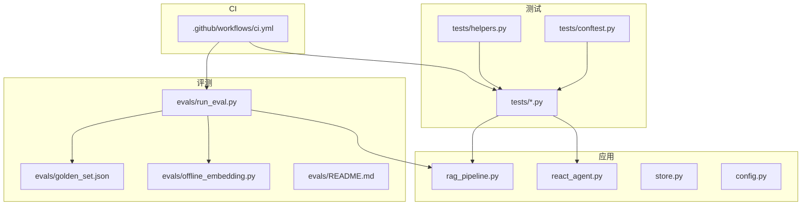
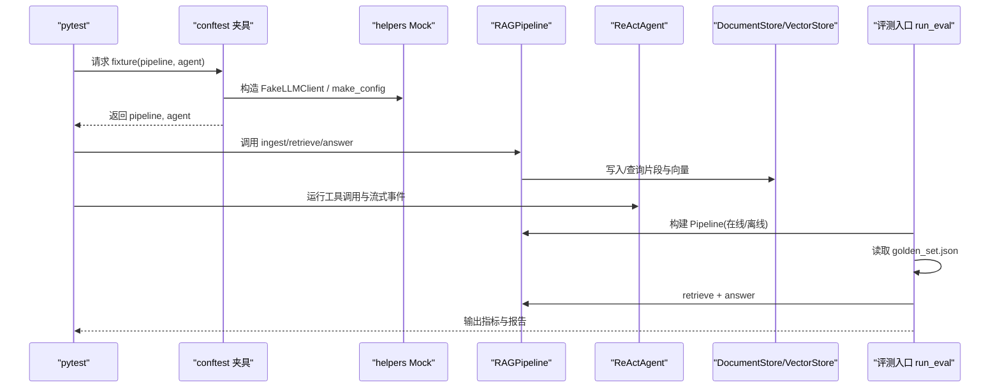
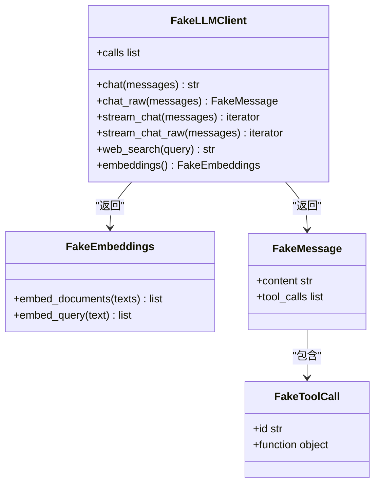
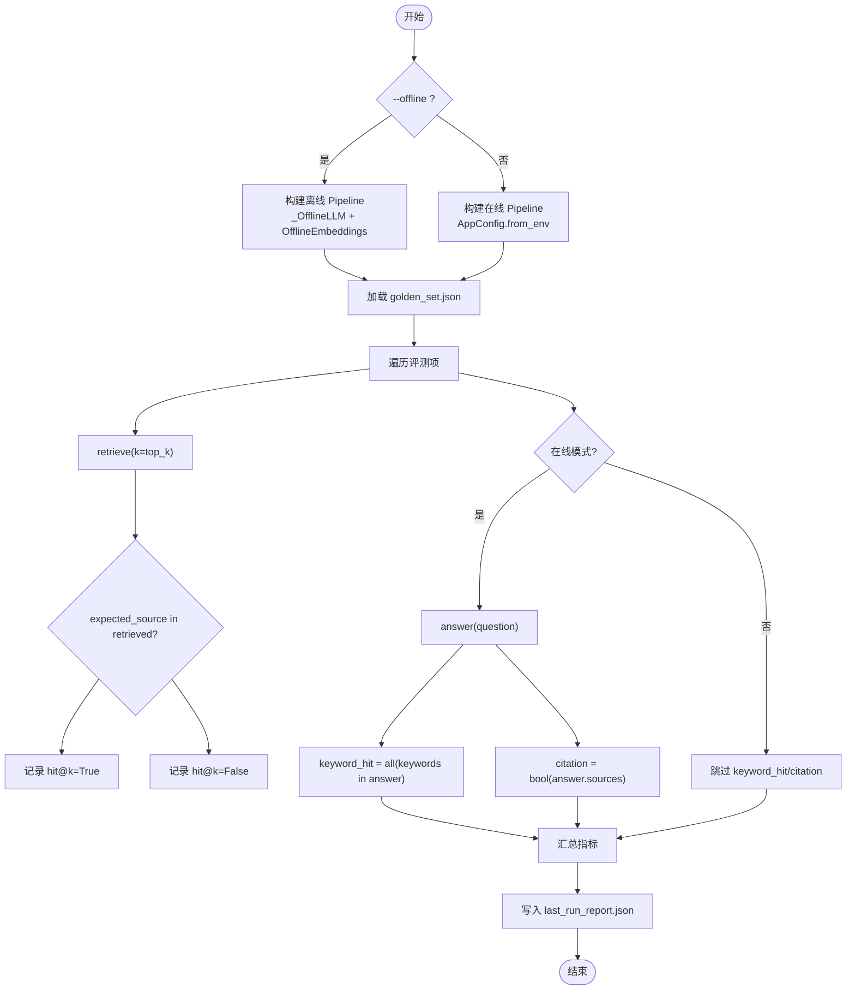
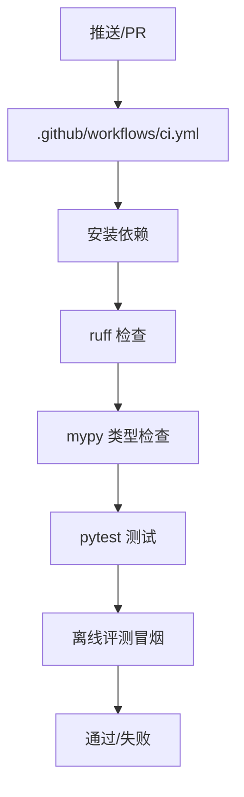
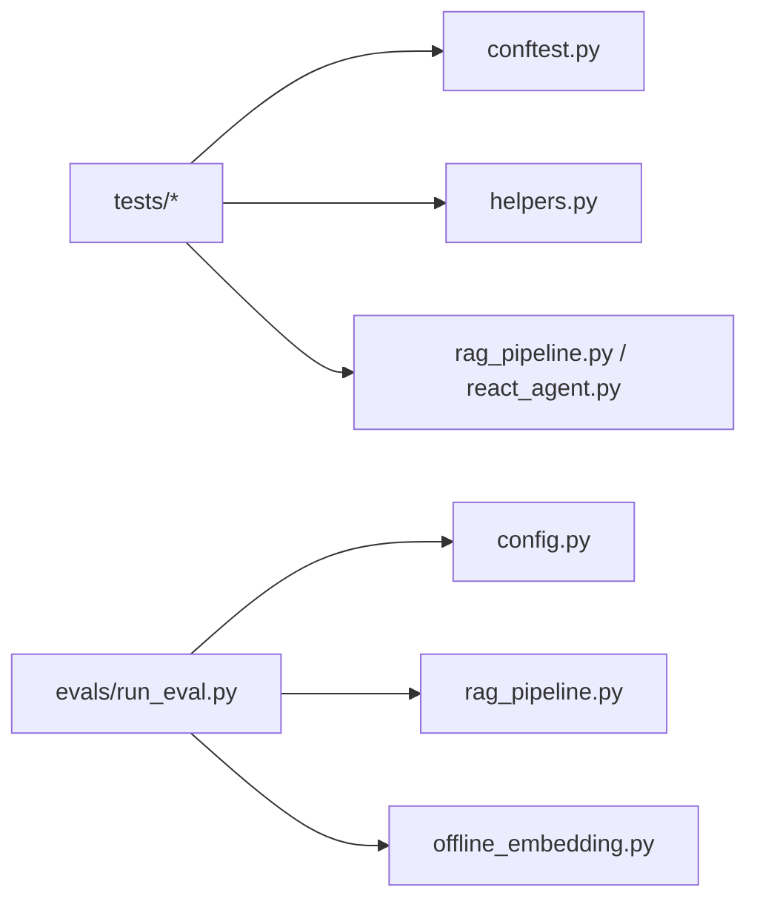

# 测试与评测

<cite>
**本文引用的文件**
- [tests/conftest.py](file://tests/conftest.py)
- [tests/helpers.py](file://tests/helpers.py)
- [tests/test_agent.py](file://tests/test_agent.py)
- [tests/test_context.py](file://tests/test_context.py)
- [tests/test_ingest.py](file://tests/test_ingest.py)
- [tests/test_ingestion.py](file://tests/test_ingestion.py)
- [tests/test_rag_answer.py](file://tests/test_rag_answer.py)
- [tests/test_retrieval.py](file://tests/test_retrieval.py)
- [tests/test_smoke.py](file://tests/test_smoke.py)
- [tests/test_store.py](file://tests/test_store.py)
- [evals/README.md](file://evals/README.md)
- [evals/run_eval.py](file://evals/run_eval.py)
- [evals/offline_embedding.py](file://evals/offline_embedding.py)
- [evals/golden_set.json](file://evals/golden_set.json)
- [.github/workflows/ci.yml](file://.github/workflows/ci.yml)
- [config.py](file://config.py)
- [pyproject.toml](file://pyproject.toml)
- [requirements-dev.txt](file://requirements-dev.txt)
</cite>

## 目录
1. [简介](#简介)
2. [项目结构](#项目结构)
3. [核心组件](#核心组件)
4. [架构总览](#架构总览)
5. [详细组件分析](#详细组件分析)
6. [依赖关系分析](#依赖关系分析)
7. [性能考虑](#性能考虑)
8. [故障排查指南](#故障排查指南)
9. [结论](#结论)
10. [附录](#附录)

## 简介
本文件面向“RAG 与 Agent”项目的测试与评测体系，系统化说明：
- 单元测试架构设计：pytest 夹具、Mock 策略、测试数据管理；
- Golden Set 评测体系：离线评测与在线评测两种模式的使用方法；
- 评测指标定义与计算方法：hit@k、关键词命中率、可溯源率等；
- 测试用例编写指南、评测脚本使用方法、结果分析方法；
- CI/CD 集成配置与质量保证流程。

## 项目结构
仓库采用分层组织：
- tests：基于 pytest 的单元测试与冒烟测试，集中使用 conftest 夹具与 helpers 中的 Mock 组件；
- evals：Golden Set 评测入口 run_eval.py，配套 golden_set.json、离线嵌入实现 offline_embedding.py 与使用说明 README.md；
- 根目录：应用代码（pipeline、agent、store、vector store、配置等）；
- .github/workflows：CI 流水线，包含 lint、类型检查、测试与离线评测冒烟；
- pyproject.toml：pytest、ruff、mypy 配置；
- requirements-dev.txt：开发依赖（pytest、ruff、mypy）。

**图表来源**
- [tests/conftest.py:12-22](file://tests/conftest.py#L12-L22)
- [tests/helpers.py:16-157](file://tests/helpers.py#L16-L157)
- [evals/run_eval.py:94-173](file://evals/run_eval.py#L94-L173)
- [evals/offline_embedding.py:16-50](file://evals/offline_embedding.py#L16-L50)
- [config.py:56-112](file://config.py#L56-L112)
- [.github/workflows/ci.yml:8-33](file://.github/workflows/ci.yml#L8-L33)

**章节来源**
- [pyproject.toml:1-41](file://pyproject.toml#L1-L41)
- [requirements-dev.txt:1-6](file://requirements-dev.txt#L1-L6)
- [.github/workflows/ci.yml:1-34](file://.github/workflows/ci.yml#L1-L34)

## 核心组件
- 测试夹具与 Mock：
  - conftest 提供 pipeline 与 agent 夹具，统一注入 FakeLLMClient 与临时目录配置；
  - helpers 提供 FakeEmbeddings、FakeLLMClient、make_config、upload_text、ingest_all 等工具，确保测试确定性、隔离性与可重复性。
- 评测入口：
  - run_eval.py 支持 --offline 与在线模式，读取 golden_set.json，构建 RAGPipeline，执行检索与回答，输出 hit@k、keyword_hit、citation 等指标到 last_run_report.json。
- 配置中心：
  - config.AppConfig 集中管理切分、检索、重排、上下文预算、Agent 步数等参数，支持环境变量覆盖，便于测试与生产一致化。

**章节来源**
- [tests/conftest.py:12-22](file://tests/conftest.py#L12-L22)
- [tests/helpers.py:16-157](file://tests/helpers.py#L16-L157)
- [evals/run_eval.py:94-173](file://evals/run_eval.py#L94-L173)
- [config.py:56-112](file://config.py#L56-L112)

## 架构总览
下图展示测试与评测如何围绕 RAGPipeline 与 ReActAgent 展开，并通过 Mock 与 Golden Set 实现稳定验证。

**图表来源**
- [tests/conftest.py:12-22](file://tests/conftest.py#L12-L22)
- [tests/helpers.py:73-157](file://tests/helpers.py#L73-L157)
- [evals/run_eval.py:94-173](file://evals/run_eval.py#L94-L173)

## 详细组件分析

### 单元测试架构与 Mock 策略
- 夹具设计：
  - pipeline 夹具通过 make_config 指定临时目录与低阈值，避免真实模型依赖；
  - agent 夹具复用 pipeline 并设置最大步骤，保证工具调用循环可控。
- Mock 策略：
  - FakeLLMClient：提供 chat/chat_raw/stream_chat/stream_chat_raw/web_search/embeddings 等接口，支持脚本化消息序列与固定回答；
  - FakeEmbeddings：基于词袋与中文 bigram 的确定性稀疏向量，用于离线验证检索链路；
  - FakeMessage/FakeToolCall：模拟 LLM 的工具调用与内容输出，便于断言工具链路与流式事件。
- 测试数据管理：
  - 所有测试使用 tmp_path 隔离存储，避免跨用例污染；
  - upload_text/ingest_all 封装上传与入库，简化用例编写。

**图表来源**
- [tests/helpers.py:16-157](file://tests/helpers.py#L16-L157)

**章节来源**
- [tests/conftest.py:12-22](file://tests/conftest.py#L12-L22)
- [tests/helpers.py:16-157](file://tests/helpers.py#L16-L157)

### 评测体系（Golden Set）
- 模式选择：
  - 离线模式：使用 OfflineEmbeddings 与 _OfflineLLM，不调用真实 API，仅验证链路；
  - 在线模式：从环境变量加载 AppConfig，使用真实 DashScope Embedding/LLM。
- 指标计算：
  - hit@k：期望来源是否出现在 Top-k 检索结果中；
  - keyword_hit：回答是否包含预期关键词（仅在线）；
  - citation：回答是否附带引用来源（仅在线）。
- 输入数据：
  - golden_set.json 定义问题、期望来源与关键词；
  - sample_docs 提供示例文档用于入库。
- 输出报告：
  - last_run_report.json 包含 mode、golden_set_size、metrics、items。

**图表来源**
- [evals/run_eval.py:38-98](file://evals/run_eval.py#L38-L98)
- [evals/run_eval.py:105-140](file://evals/run_eval.py#L105-L140)
- [evals/run_eval.py:143-173](file://evals/run_eval.py#L143-L173)
- [evals/offline_embedding.py:16-50](file://evals/offline_embedding.py#L16-L50)

**章节来源**
- [evals/README.md:1-24](file://evals/README.md#L1-L24)
- [evals/run_eval.py:1-179](file://evals/run_eval.py#L1-L179)
- [evals/golden_set.json:1-23](file://evals/golden_set.json#L1-L23)
- [evals/offline_embedding.py:1-51](file://evals/offline_embedding.py#L1-L51)

### 关键测试用例分类与职责
- 入库链路（test_ingest.py）：
  - 增量索引、文档版本、配置变更触发全量重建、旧文件迁移、删除清理；
- 解析与切分（test_ingestion.py）：
  - 文本质量阈值、页码归一化、混合 PDF OCR 回退；
- 检索与重排（test_retrieval.py）：
  - 分词、BM25、RRF、MMR、向量低于阈值时的 BM25 兜底；
- 问答与提示（test_rag_answer.py）：
  - 引用来源、相关性阈值拦截、查询改写、多知识库隔离、来源提示限制检索、防幻觉提示；
- 上下文预算（test_context.py）：
  - 历史截断与片段裁剪保持块完整性；
- Agent 工具与流式（test_agent.py）：
  - 工具注册表、function calling 循环、参数解析、最大轮数、天气工具、数据库只读、流式事件顺序与 token 真实性；
- 端到端冒烟（test_smoke.py）：
  - 上传→入库→检索→问答→删除全链路验证。

**章节来源**
- [tests/test_ingest.py:9-75](file://tests/test_ingest.py#L9-L75)
- [tests/test_ingestion.py:10-64](file://tests/test_ingestion.py#L10-L64)
- [tests/test_retrieval.py:12-81](file://tests/test_retrieval.py#L12-L81)
- [tests/test_rag_answer.py:15-113](file://tests/test_rag_answer.py#L15-L113)
- [tests/test_context.py:9-34](file://tests/test_context.py#L9-L34)
- [tests/test_agent.py:11-159](file://tests/test_agent.py#L11-L159)
- [tests/test_smoke.py:12-46](file://tests/test_smoke.py#L12-L46)

### 评测指标定义与计算方法
- hit@k：
  - 定义：期望来源是否在 Top-k 检索结果中出现；
  - 计算：对每个评测项，若 expected_source ∈ retrieved_sources，则该项命中为真；最终指标为命中项占比。
- keyword_hit：
  - 定义：回答是否包含全部预期关键词；
  - 计算：在线模式下，all(k in answer for k in keywords)；最终指标为命中项占比。
- citation：
  - 定义：回答是否附带引用来源；
  - 计算：在线模式下，bool(answer.sources)；最终指标为命中项占比。

上述指标由 run_eval.py 在 summarize 中聚合，并写入 last_run_report.json。

**章节来源**
- [evals/run_eval.py:105-140](file://evals/run_eval.py#L105-L140)
- [evals/README.md:13-21](file://evals/README.md#L13-L21)

### 测试用例编写指南
- 使用 fixtures：
  - 通过 pipeline/agent 夹具快速获得已注入 Mock 的实例；
- 使用 helpers：
  - make_config 指定临时目录与低阈值；
  - upload_text/ingest_all 简化文档上传与入库；
  - FakeLLMClient.script 控制 LLM 行为，便于断言工具调用与流式事件；
- 断言要点：
  - 检索：chunks 非空、来源匹配、阈值拦截；
  - 问答：sources 存在、答案符合预期、无幻觉提示；
  - Agent：工具名称、参数、最大步骤、流式事件类型与 token 拼接；
  - 存储：版本号、元数据、软删除、片段替换与删除。

**章节来源**
- [tests/conftest.py:12-22](file://tests/conftest.py#L12-L22)
- [tests/helpers.py:136-166](file://tests/helpers.py#L136-L166)
- [tests/test_agent.py:30-159](file://tests/test_agent.py#L30-L159)
- [tests/test_rag_answer.py:15-113](file://tests/test_rag_answer.py#L15-L113)
- [tests/test_store.py:15-69](file://tests/test_store.py#L15-L69)

### 评测脚本使用方法
- 离线模式：
  - 命令：python evals/run_eval.py --offline；
  - 特点：使用 OfflineEmbeddings，不调用真实 API，适合快速验证链路。
- 在线模式：
  - 命令：python evals/run_eval.py；
  - 要求：配置 .env 中的 API Key，使用真实 DashScope Embedding/LLM。
- 结果位置：
  - evals/last_run_report.json，包含 mode、golden_set_size、metrics、items。

**章节来源**
- [evals/README.md:5-21](file://evals/README.md#L5-L21)
- [evals/run_eval.py:143-173](file://evals/run_eval.py#L143-L173)

### 结果分析方法
- 查看 last_run_report.json：
  - metrics.hit@k：整体检索命中率；
  - metrics.keyword_hit：在线模式下回答关键词命中率；
  - metrics.citation：在线模式下可溯源率；
  - items：逐项问题、top_k、retrieved_sources、answer_preview 等细节。
- 结合 golden_set.json：
  - 定位未命中项，分析 retrieved_sources 与 expected_source 差异；
  - 调整 top_k、融合池大小、阈值或提示词以优化效果。

**章节来源**
- [evals/run_eval.py:163-173](file://evals/run_eval.py#L163-L173)
- [evals/golden_set.json:1-23](file://evals/golden_set.json#L1-L23)

### CI/CD 集成与质量保证流程
- 触发条件：push 到 main、任意 pull_request；
- 步骤：
  - 安装依赖（requirements-dev.txt）；
  - 代码风格检查（ruff check）；
  - 类型检查（mypy）；
  - 运行测试（pytest）；
  - 离线评测冒烟（python evals/run_eval.py --offline）。
- 配置位置：
  - .github/workflows/ci.yml；
  - pyproject.toml 中 pytest/ruff/mypy 选项。

**图表来源**
- [.github/workflows/ci.yml:8-33](file://.github/workflows/ci.yml#L8-L33)
- [pyproject.toml:1-41](file://pyproject.toml#L1-L41)
- [requirements-dev.txt:1-6](file://requirements-dev.txt#L1-L6)

**章节来源**
- [.github/workflows/ci.yml:1-34](file://.github/workflows/ci.yml#L1-L34)
- [pyproject.toml:1-41](file://pyproject.toml#L1-L41)
- [requirements-dev.txt:1-6](file://requirements-dev.txt#L1-L6)

## 依赖关系分析
- 测试对应用模块的依赖：
  - tests 通过 conftest/fixtures 注入 RAGPipeline 与 ReActAgent；
  - helpers 提供 FakeLLMClient、FakeEmbeddings、make_config 等，降低耦合；
  - 评测入口 run_eval.py 依赖 AppConfig、RAGPipeline、OfflineEmbeddings。
- 外部依赖：
  - 在线评测需要 DashScope API Key；
  - 离线评测不依赖外部服务，具备强稳定性。

**图表来源**
- [tests/conftest.py:12-22](file://tests/conftest.py#L12-L22)
- [tests/helpers.py:16-157](file://tests/helpers.py#L16-L157)
- [evals/run_eval.py:94-173](file://evals/run_eval.py#L94-L173)
- [config.py:56-112](file://config.py#L56-L112)

**章节来源**
- [tests/conftest.py:12-22](file://tests/conftest.py#L12-L22)
- [tests/helpers.py:16-157](file://tests/helpers.py#L16-L157)
- [evals/run_eval.py:94-173](file://evals/run_eval.py#L94-L173)
- [config.py:56-112](file://config.py#L56-L112)

## 性能考虑
- 离线评测使用确定性伪向量，避免网络开销，适合频繁回归；
- 在线评测受限于 API 速率与成本，建议批量 embedding 与合理 top_k/fusion_pool；
- 测试中使用低阈值与较小 chunk_size，提高断言稳定性与速度；
- MMR 去重与 RRF 融合可在召回多样性与相关性间平衡，需根据数据集调参。

[本节为通用指导，不直接分析具体文件]

## 故障排查指南
- 离线评测报错“不调用大模型”：
  - 原因：使用了 _OfflineLLM 的 chat 等方法；
  - 解决：去掉 --offline 运行在线评测，或在评测逻辑中仅使用 embeddings。
- 在线评测无法连接 API：
  - 检查 .env 中 API Key 是否正确；
  - 确认网络可达与配额充足。
- 测试失败：
  - 确认 tmp_path 隔离有效，避免共享状态；
  - 检查 FakeLLMClient.script 是否与预期工具调用一致；
  - 核对阈值与 top_k 配置是否符合场景。

**章节来源**
- [evals/run_eval.py:38-72](file://evals/run_eval.py#L38-L72)
- [tests/helpers.py:73-157](file://tests/helpers.py#L73-L157)

## 结论
本项目构建了完善的测试与评测体系：
- 通过 pytest 夹具与 Mock 实现高内聚、低耦合的单元测试；
- Golden Set 评测提供离线与在线两种模式，指标清晰、结果可追溯；
- CI/CD 将 lint、类型检查、测试与离线评测纳入质量门禁；
- 建议在持续迭代中扩展 RAGAS 等自动评测能力，并按知识库/文档类型分组统计，进一步提升评估粒度与可解释性。

[本节为总结，不直接分析具体文件]

## 附录
- 常用命令：
  - 运行测试：pytest；
  - 离线评测：python evals/run_eval.py --offline；
  - 在线评测：python evals/run_eval.py（需 .env 配置）。
- 配置文件：
  - pyproject.toml：pytest/ruff/mypy 选项；
  - config.py：环境变量覆盖的运行参数。

**章节来源**
- [pyproject.toml:1-41](file://pyproject.toml#L1-L41)
- [config.py:56-112](file://config.py#L56-L112)
- [evals/README.md:5-21](file://evals/README.md#L5-L21)