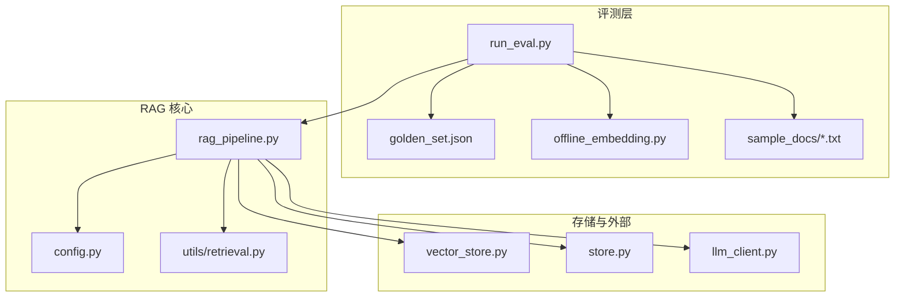
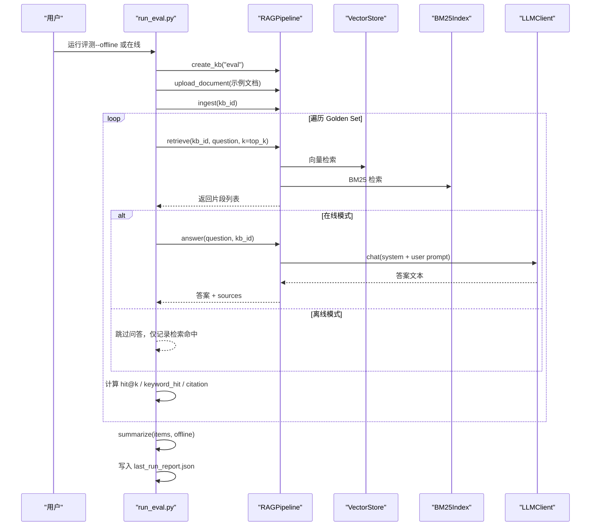
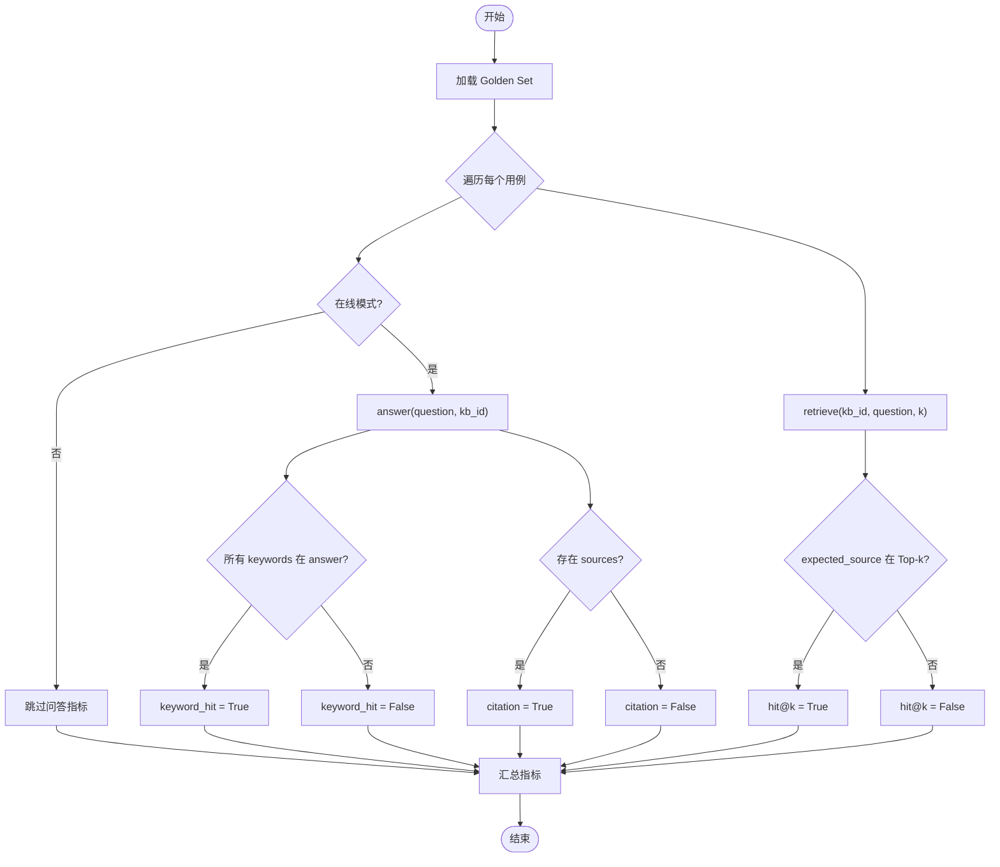
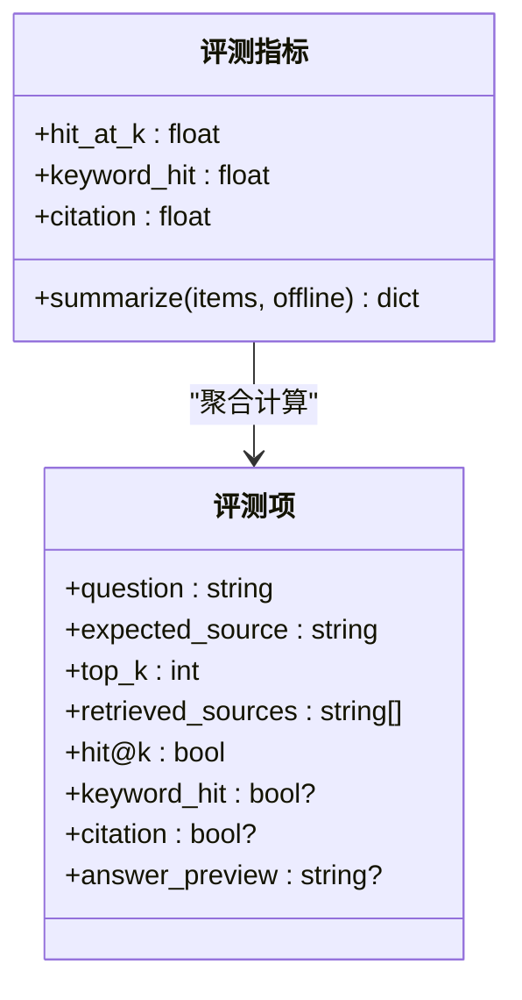
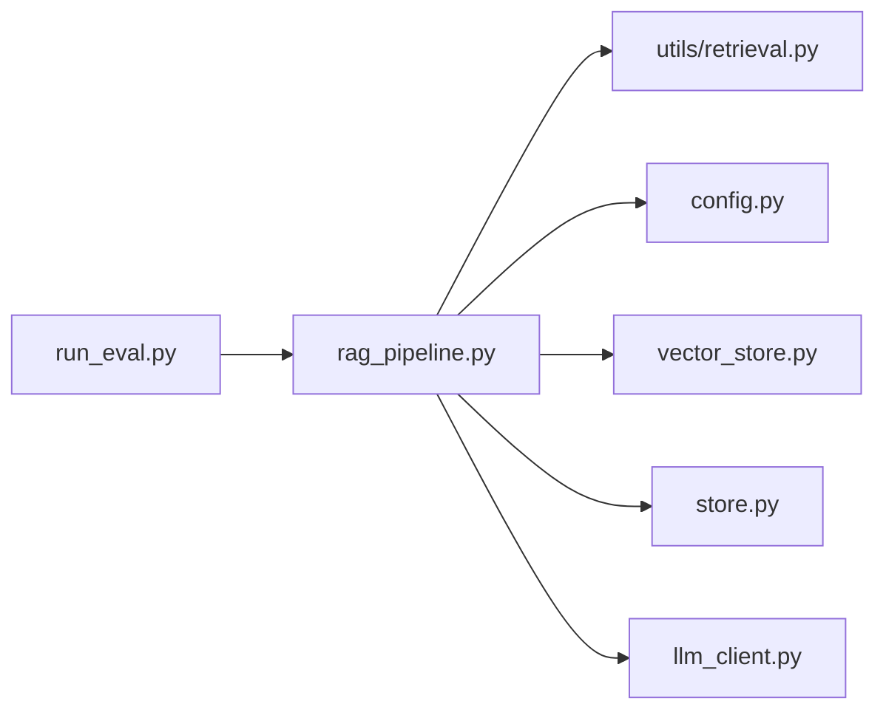

# 评测体系

<cite>
**本文引用的文件**
- [evals/README.md](file://evals/README.md)
- [evals/golden_set.json](file://evals/golden_set.json)
- [evals/run_eval.py](file://evals/run_eval.py)
- [evals/offline_embedding.py](file://evals/offline_embedding.py)
- [rag_pipeline.py](file://rag_pipeline.py)
- [config.py](file://config.py)
- [utils/retrieval.py](file://utils/retrieval.py)
- [tests/test_rag_answer.py](file://tests/test_rag_answer.py)
- [tests/test_retrieval.py](file://tests/test_retrieval.py)
- [tests/helpers.py](file://tests/helpers.py)
</cite>

## 目录
1. [简介](#简介)
2. [项目结构](#项目结构)
3. [核心组件](#核心组件)
4. [架构总览](#架构总览)
5. [详细组件分析](#详细组件分析)
6. [依赖关系分析](#依赖关系分析)
7. [性能与基准](#性能与基准)
8. [故障排查指南](#故障排查指南)
9. [结论](#结论)
10. [附录](#附录)

## 简介
本评测体系围绕 Golden Set（黄金集）对 RAG 的检索与回答质量进行量化评估，支持离线与在线两种评测模式：
- 离线模式：使用确定性伪向量与占位 LLM，无需 API Key，用于快速验证评测链路和回归测试。
- 在线模式：调用真实 Embedding 与大模型问答，输出更贴近生产环境的指标。

评测指标包括：
- hit@k：期望来源是否出现在 Top-k 检索结果中（检索召回能力）。
- keyword_hit：回答是否包含预期关键词（回答内容覆盖度，仅在线模式）。
- citation：回答是否附带引用来源（可溯源性，仅在线模式）。

评测结果统一写入 evals/last_run_report.json，便于持续集成、报告归档与简历/README 展示。

**章节来源**
- [evals/README.md:1-24](file://evals/README.md#L1-L24)
- [evals/run_eval.py:1-14](file://evals/run_eval.py#L1-L14)

## 项目结构
评测相关代码集中在 evals 目录，配合核心 RAG 管线与工具模块完成端到端评测：
- evals：评测入口、Golden Set、离线嵌入实现、示例文档。
- rag_pipeline.py：RAG 管线门面，提供知识库管理、入库、混合检索、问答等能力。
- utils/retrieval.py：混合检索工具（分词、BM25、RRF、MMR）。
- config.py：集中配置，环境变量驱动。
- tests：单元测试与辅助设施，验证检索与问答行为。

**图表来源**
- [evals/run_eval.py:94-178](file://evals/run_eval.py#L94-L178)
- [rag_pipeline.py:196-792](file://rag_pipeline.py#L196-L792)
- [utils/retrieval.py:1-148](file://utils/retrieval.py#L1-L148)
- [config.py:56-113](file://config.py#L56-L113)

**章节来源**
- [evals/run_eval.py:94-178](file://evals/run_eval.py#L94-L178)
- [rag_pipeline.py:196-792](file://rag_pipeline.py#L196-L792)
- [utils/retrieval.py:1-148](file://utils/retrieval.py#L1-L148)
- [config.py:56-113](file://config.py#L56-L113)

## 核心组件
- 评测入口 run_eval.py：加载 Golden Set，构建评测知识库，执行检索与问答，计算指标并生成报告。
- Golden Set golden_set.json：定义问题、期望来源、关键词等评测用例。
- 离线嵌入 offline_embedding.py：基于关键词与中文 bigram 的稀疏向量，用于无 API 环境下的链路验证。
- RAG 管线 rag_pipeline.py：提供检索（向量+BM25+RRF+MMR）、问答（带引用）、查询改写、上下文裁剪等功能。
- 检索工具 utils/retrieval.py：中文分词、BM25 索引、RRF 融合、MMR 重排。
- 配置 config.py：集中化参数与环境变量映射，控制切分、检索、重排等行为。

**章节来源**
- [evals/run_eval.py:101-178](file://evals/run_eval.py#L101-L178)
- [evals/golden_set.json:1-23](file://evals/golden_set.json#L1-L23)
- [evals/offline_embedding.py:1-51](file://evals/offline_embedding.py#L1-L51)
- [rag_pipeline.py:437-666](file://rag_pipeline.py#L437-L666)
- [utils/retrieval.py:34-148](file://utils/retrieval.py#L34-L148)
- [config.py:56-113](file://config.py#L56-L113)

## 架构总览
评测流程从 Golden Set 出发，依次执行入库、检索、问答与指标汇总，最终输出结构化报告。

**图表来源**
- [evals/run_eval.py:143-178](file://evals/run_eval.py#L143-L178)
- [rag_pipeline.py:437-666](file://rag_pipeline.py#L437-L666)
- [utils/retrieval.py:48-148](file://utils/retrieval.py#L48-L148)

**章节来源**
- [evals/run_eval.py:143-178](file://evals/run_eval.py#L143-L178)
- [rag_pipeline.py:437-666](file://rag_pipeline.py#L437-L666)

## 详细组件分析

### Golden Set 评测机制
- 数据组织：每个条目包含 question、expected_source、keywords、可选 top_k。
- 评测流程：
  - 检索阶段：对每个问题执行 retrieve，提取 retrieved_sources，判断 expected_source 是否在 Top-k 中，得到 hit@k。
  - 问答阶段（在线）：调用 answer，检查 answer 是否包含 keywords（keyword_hit），以及是否存在 sources（citation）。
- 结果汇总：按条目统计指标并计算整体比率，写入 last_run_report.json。

**图表来源**
- [evals/run_eval.py:105-140](file://evals/run_eval.py#L105-L140)
- [evals/golden_set.json:1-23](file://evals/golden_set.json#L1-L23)

**章节来源**
- [evals/run_eval.py:105-140](file://evals/run_eval.py#L105-L140)
- [evals/golden_set.json:1-23](file://evals/golden_set.json#L1-L23)

### 离线评测模式
- 目的：无需 API Key，使用确定性伪向量与占位 LLM，验证评测链路本身。
- 关键实现：
  - _OfflineLLM：仅提供 embeddings，chat/stream 等方法抛出异常，避免误用。
  - OfflineEmbeddings：基于关键词与中文 bigram 的稀疏向量，适合同一文档内检索。
  - 配置：降低相关性阈值、关闭 MMR、禁用查询改写，适配伪向量特性。
- 适用场景：CI 快速回归、本地开发调试、无网络环境验证。

**章节来源**
- [evals/run_eval.py:38-98](file://evals/run_eval.py#L38-L98)
- [evals/offline_embedding.py:1-51](file://evals/offline_embedding.py#L1-L51)

### 在线评测模式
- 目的：使用真实 DashScope Embedding 与 LLM，评估端到端检索与回答质量。
- 关键实现：
  - build_pipeline：通过 AppConfig.from_env 读取环境变量，构造 RAGPipeline。
  - 指标扩展：在线模式下计算 keyword_hit 与 citation。
- 前置条件：需配置 .env（API Key 等），确保服务可用。

**章节来源**
- [evals/run_eval.py:94-98](file://evals/run_eval.py#L94-L98)
- [config.py:89-113](file://config.py#L89-L113)

### 评测指标定义与计算
- hit@k：若 expected_source 出现在 retrieve 返回的 Top-k 来源列表中，则命中为真；整体指标为命中率。
- keyword_hit：在线模式下，若 answer 包含所有 keywords，则命中为真；整体指标为命中率。
- citation：在线模式下，若 answer 返回 sources 非空，则可溯源为真；整体指标为可溯源率。

**图表来源**
- [evals/run_eval.py:105-140](file://evals/run_eval.py#L105-L140)

**章节来源**
- [evals/run_eval.py:105-140](file://evals/run_eval.py#L105-L140)

### 评测数据集构建与测试用例设计原则
- 数据来源：evals/sample_docs 中的示例文档（如产品介绍、报销制度）。
- Golden Set 设计：
  - 覆盖多类问题（产品功能、流程规范、数值标准等）。
  - 明确 expected_source 与 keywords，便于自动化判定。
  - 支持 per-item top_k 覆盖不同检索深度。
- 设计原则：
  - 可重复：问题与关键词稳定，便于趋势对比。
  - 可解释：每个用例对应一个业务知识点，便于定位问题。
  - 可扩展：新增用例只需追加 JSON 条目。

**章节来源**
- [evals/golden_set.json:1-23](file://evals/golden_set.json#L1-L23)
- [evals/README.md:1-24](file://evals/README.md#L1-L24)

### 评测脚本使用方法
- 离线模式：
  - 命令：python evals/run_eval.py --offline
  - 特点：无需 API Key，仅验证链路，输出 hit@k。
- 在线模式：
  - 命令：python evals/run_eval.py
  - 特点：需要 .env 配置 API Key，输出 hit@k、keyword_hit、citation。
- 结果位置：evals/last_run_report.json，包含 mode、metrics、items 等字段。

**章节来源**
- [evals/README.md:5-21](file://evals/README.md#L5-L21)
- [evals/run_eval.py:143-178](file://evals/run_eval.py#L143-L178)

### 结果分析与可视化建议
- 基础分析：
  - 查看 last_run_report.json 中的 metrics 与 items，统计各指标比例。
  - 针对失败用例，检查 retrieved_sources 与 answer_preview，定位检索或问答问题。
- 可视化建议：
  - 柱状图：各指标随版本变化趋势（hit@k、keyword_hit、citation）。
  - 堆叠图：按文档类型分组统计命中率。
  - 散点图：向量分数 vs BM25 分数，观察融合效果。
- 质量评估报告：
  - 自动生成摘要：mode、golden_set_size、metrics。
  - 逐条明细：question、expected_source、retrieved_sources、answer_preview。

[本节为概念性指导，不直接分析具体文件]

### 性能基准测试
- 检索性能：
  - 混合检索（向量+BM25+RRF+MMR）在 utils/retrieval.py 中实现，关注 top_k 与 fusion_pool 对延迟的影响。
  - 通过 tests/test_retrieval.py 验证 BM25 兜底、RRF 融合、MMR 多样性选择。
- 问答性能：
  - 在线模式下，answer 方法涉及上下文裁剪与历史截断，影响 token 成本与首字延迟。
  - 可通过 config.py 调整 history_max_tokens、rag_context_max_tokens。
- 基准建议：
  - 固定 Golden Set 规模，记录每次运行的耗时与指标。
  - 对比不同 top_k、fusion_pool、mmr_lambda 的效果。

**章节来源**
- [utils/retrieval.py:48-148](file://utils/retrieval.py#L48-L148)
- [tests/test_retrieval.py:1-81](file://tests/test_retrieval.py#L1-L81)
- [rag_pipeline.py:564-666](file://rag_pipeline.py#L564-L666)
- [config.py:56-113](file://config.py#L56-L113)

## 依赖关系分析
评测脚本依赖 RAG 管线与检索工具，形成清晰的层次：
- 评测层：run_eval.py 负责编排评测流程。
- 核心层：rag_pipeline.py 提供检索与问答能力。
- 工具层：utils/retrieval.py 提供 BM25、RRF、MMR。
- 配置层：config.py 集中参数。
- 存储层：vector_store.py、store.py 管理向量与元数据。
- 外部层：llm_client.py 对接大模型服务。

**图表来源**
- [evals/run_eval.py:31-36](file://evals/run_eval.py#L31-L36)
- [rag_pipeline.py:19-39](file://rag_pipeline.py#L19-L39)

**章节来源**
- [evals/run_eval.py:31-36](file://evals/run_eval.py#L31-L36)
- [rag_pipeline.py:19-39](file://rag_pipeline.py#L19-L39)

## 性能与基准
- 检索优化：
  - 混合检索结合语义与词面优势，RRF 融合提升鲁棒性，MMR 重排增强多样性。
  - BM25 兜底机制避免低相似度误杀精确匹配。
- 问答优化：
  - 历史截断与上下文裁剪控制 token 成本，减少长对话带来的注意力分散。
  - 系统提示词约束幻觉，要求严格基于检索资料并标注来源。
- 基准建议：
  - 固定评测集，记录不同配置下的指标与耗时。
  - 对比离线与在线模式的差异，识别瓶颈环节。

[本节为通用性能讨论，不直接分析具体文件]

## 故障排查指南
- 离线模式报错：
  - 现象：调用 chat/stream 等方法抛出异常。
  - 原因：离线模式不支持真实 LLM 调用。
  - 解决：去掉 --offline 或使用在线模式。
- 检索为空：
  - 现象：retrieve 返回空列表。
  - 可能原因：相关性阈值过高、知识库未入库、查询无关。
  - 解决：调整 relevance_threshold、确认 ingested、优化查询。
- 问答无来源：
  - 现象：answer 返回 sources 为空。
  - 可能原因：检索结果为空或低于阈值。
  - 解决：检查 retrieve 结果、调整 top_k/fusion_pool。
- 指标不稳定：
  - 现象：keyword_hit/citation 波动。
  - 可能原因：LLM 输出随机性、上下文长度限制。
  - 解决：固定 temperature、增加上下文预算、扩大评测集。

**章节来源**
- [evals/run_eval.py:38-72](file://evals/run_eval.py#L38-L72)
- [rag_pipeline.py:437-666](file://rag_pipeline.py#L437-L666)
- [tests/test_rag_answer.py:15-113](file://tests/test_rag_answer.py#L15-L113)

## 结论
本评测体系以 Golden Set 为核心，提供离线与在线两种模式，覆盖检索召回、回答覆盖与可溯源性等关键维度。通过模块化设计与集中配置，评测过程可复现、可扩展，并易于集成到 CI 流程。未来可接入 RAGAS 等端到端自动评测框架，进一步提升评估的全面性与客观性。

[本节为总结性内容，不直接分析具体文件]

## 附录
- 常用命令：
  - 离线评测：python evals/run_eval.py --offline
  - 在线评测：python evals/run_eval.py
- 结果文件：evals/last_run_report.json
- 扩展方向：
  - 接入 RAGAS（faithfulness、answer relevancy、context precision）。
  - 按知识库/文档类型分组统计。
  - 增加更多业务场景的 Golden Set 用例。

[本节为补充信息，不直接分析具体文件]