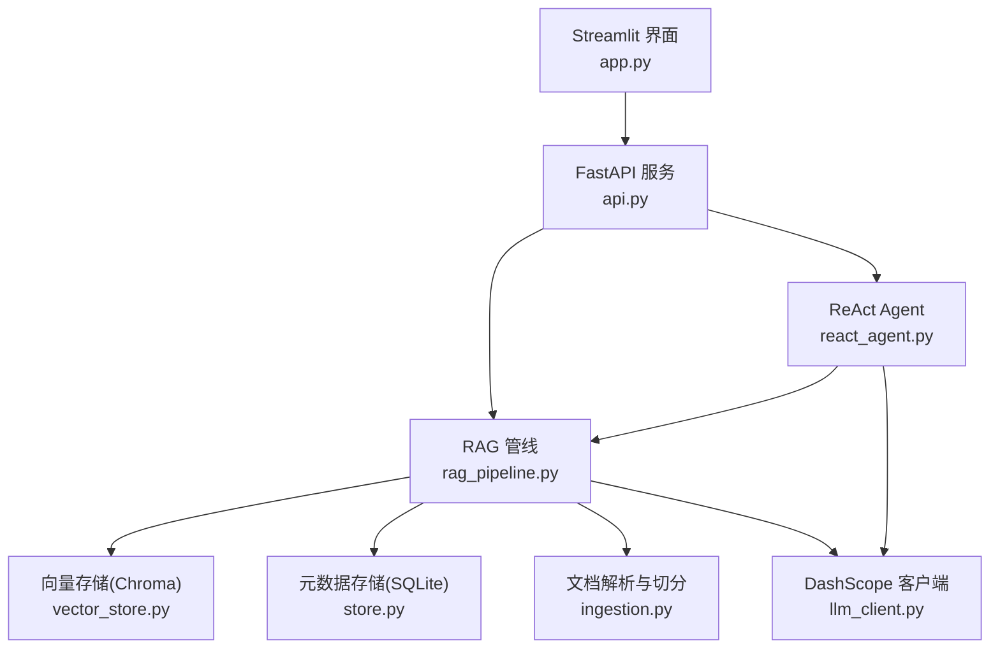
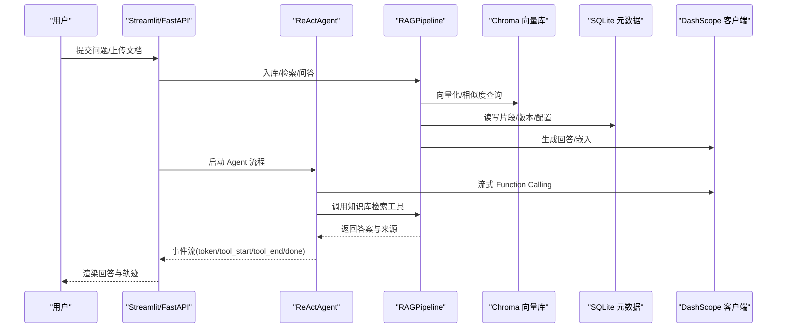
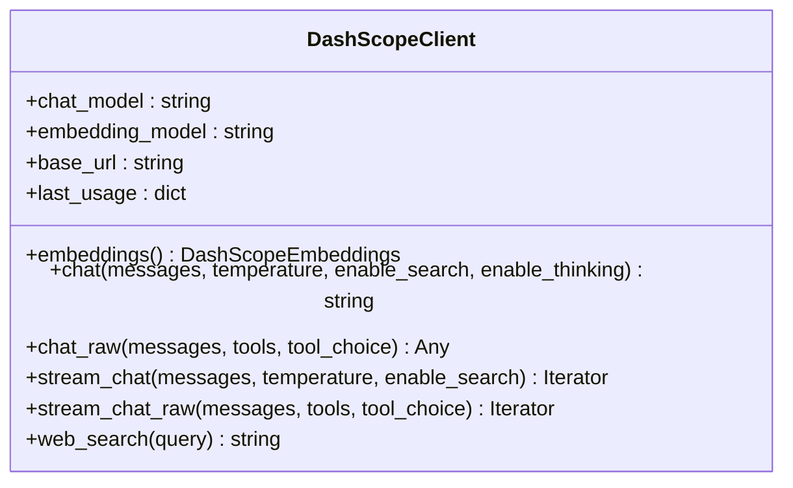
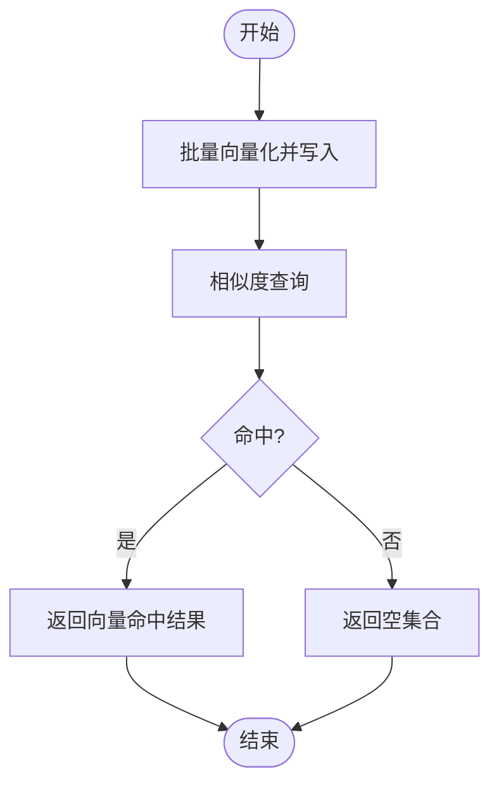
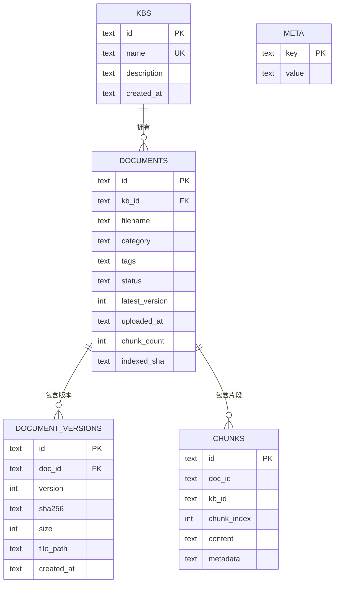
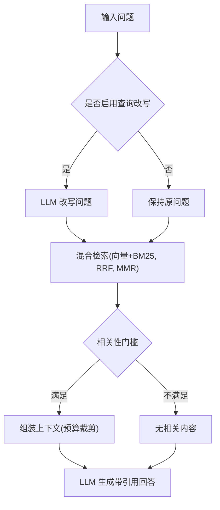
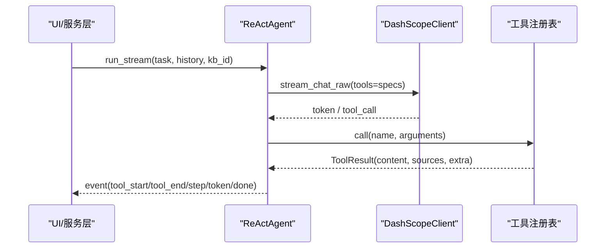
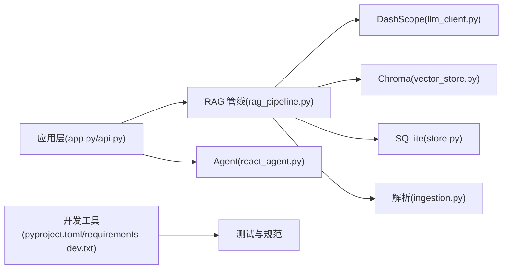

# 技术选型与集成

<cite>
**本文引用的文件**
- [README.md](file://README.md)
- [pyproject.toml](file://pyproject.toml)
- [requirements.txt](file://requirements.txt)
- [config.py](file://config.py)
- [llm_client.py](file://llm_client.py)
- [vector_store.py](file://vector_store.py)
- [store.py](file://store.py)
- [rag_pipeline.py](file://rag_pipeline.py)
- [react_agent.py](file://react_agent.py)
- [ingestion.py](file://ingestion.py)
- [api.py](file://api.py)
- [app.py](file://app.py)
- [requirements-dev.txt](file://requirements-dev.txt)
</cite>

## 目录
1. [简介](#简介)
2. [项目结构](#项目结构)
3. [核心组件](#核心组件)
4. [架构总览](#架构总览)
5. [详细组件分析](#详细组件分析)
6. [依赖关系分析](#依赖关系分析)
7. [性能考量](#性能考量)
8. [故障排查指南](#故障排查指南)
9. [结论](#结论)
10. [附录](#附录)

## 简介
本技术选型与集成文档面向“智能文档助手（RAG + Agent）”项目，系统采用 LangChain 生态进行 LLM 应用开发，ChromaDB 作为向量数据库，SQLite 用于元数据存储，DashScope API 提供大模型与 Embedding 服务，Streamlit 构建 Web 界面，FastAPI 提供 REST 服务。文档重点说明各技术组件的集成方式、版本兼容性要求、配置方法、扩展点设计（可插拔工具注册表、可替换 LLM 客户端、可扩展文档解析器），以及部署环境要求与依赖管理策略。

## 项目结构
项目以功能分层组织：
- 入口与交互层：Streamlit 前端 app.py，FastAPI 服务 api.py
- 业务编排层：RAGPipeline rag_pipeline.py，ReActAgent react_agent.py
- 数据与存储层：VectorStore vector_store.py（Chroma），DocumentStore store.py（SQLite）
- 模型与检索层：DashScopeClient llm_client.py，Ingestion ingestion.py（文档解析与切分）
- 配置与工具：config.py，utils/logger.py，evals/ 评测脚本
- 依赖与工程化：requirements.txt，requirements-dev.txt，pyproject.toml

图表来源
- [app.py:1-352](file://app.py#L1-L352)
- [api.py:1-204](file://api.py#L1-L204)
- [rag_pipeline.py:1-792](file://rag_pipeline.py#L1-L792)
- [react_agent.py:1-567](file://react_agent.py#L1-L567)
- [vector_store.py:1-255](file://vector_store.py#L1-L255)
- [store.py:1-470](file://store.py#L1-L470)
- [ingestion.py:1-216](file://ingestion.py#L1-L216)
- [llm_client.py:1-322](file://llm_client.py#L1-L322)

章节来源
- [README.md:1-171](file://README.md#L1-L171)
- [pyproject.toml:1-41](file://pyproject.toml#L1-L41)

## 核心组件
- DashScope 客户端：封装对话、流式对话、Function Calling、Embedding，统一 OpenAI 兼容接口，支持联网搜索能力开关与思考模式开关。
- 向量存储：基于 Chroma 持久化客户端，按知识库隔离 collection，支持批量 upsert、条件删除、相似度查询、取回向量用于 MMR 重排。
- 元数据存储：SQLite WAL 模式，多表结构管理知识库、文档、版本、片段与键值配置；支持软删除与增量索引标记。
- RAG 管线：整合入库、混合检索（向量+BM25，RRF 融合，可选 MMR）、查询改写、带引用问答与上下文预算控制。
- ReAct Agent：工具注册表 + Function Calling 多步循环 + 流式事件输出；内置知识库检索、天气查询、联网搜索、只读数据库查询等工具。
- 文档解析：PDF/Word/Markdown/TXT 解析，PDF 文本质量评估与本地 OCR 兜底，递归字符切分并生成片段元数据。
- 配置中心：集中读取环境变量与默认值，冻结配置对象，避免运行时被意外修改。

章节来源
- [llm_client.py:1-322](file://llm_client.py#L1-L322)
- [vector_store.py:1-255](file://vector_store.py#L1-L255)
- [store.py:1-470](file://store.py#L1-L470)
- [rag_pipeline.py:1-792](file://rag_pipeline.py#L1-L792)
- [react_agent.py:1-567](file://react_agent.py#L1-L567)
- [ingestion.py:1-216](file://ingestion.py#L1-L216)
- [config.py:1-113](file://config.py#L1-L113)

## 架构总览
系统由三层构成：
- 交互与服务层：Streamlit 提供交互式界面，FastAPI 暴露 REST 接口，均通过 RAGPipeline 与 ReActAgent 调用后端能力。
- 业务编排层：RAGPipeline 负责知识库管理、增量入库、混合检索与问答；ReActAgent 负责工具选择与多步执行。
- 数据与模型层：Chroma 存储向量，SQLite 存储元数据，DashScope 提供 LLM 与 Embedding。

图表来源
- [app.py:1-352](file://app.py#L1-L352)
- [api.py:1-204](file://api.py#L1-L204)
- [react_agent.py:1-567](file://react_agent.py#L1-L567)
- [rag_pipeline.py:1-792](file://rag_pipeline.py#L1-L792)
- [vector_store.py:1-255](file://vector_store.py#L1-L255)
- [store.py:1-470](file://store.py#L1-L470)
- [llm_client.py:1-322](file://llm_client.py#L1-L322)

## 详细组件分析

### 大模型与嵌入：DashScope 客户端
- 职责：统一封装 DashScope 的对话、流式对话、Function Calling、Embedding，以及联网搜索能力；记录 token 用量；对外抛出可读错误。
- 关键特性：
  - 通过 OpenAI 兼容接口调用，支持 base_url、模型名、思考模式开关。
  - 流式函数调用聚合 tool_calls，供 Agent 回填执行。
  - Embedding 使用 LangChain 的 DashScopeEmbeddings，便于与 VectorStore 对接。
- 配置项：DASHSCOPE_API_KEY、DASHSCOPE_BASE_URL、DASHSCOPE_CHAT_MODEL、DASHSCOPE_EMBEDDING_MODEL、DASHSCOPE_ENABLE_THINKING。

图表来源
- [llm_client.py:1-322](file://llm_client.py#L1-L322)

章节来源
- [llm_client.py:1-322](file://llm_client.py#L1-L322)

### 向量存储：Chroma 封装
- 职责：为每个知识库维护独立 collection，提供批量 upsert、条件删除、相似度查询、获取原始向量用于 MMR。
- 关键特性：
  - 使用余弦距离空间，相似度 = 1 - distance。
  - 支持重置客户端连接以避免内存索引过期。
  - 内置 MockEmbedding 用于离线演示与测试。
- 配置项：chroma_dir、embedding_fn、batch_size。

图表来源
- [vector_store.py:1-255](file://vector_store.py#L1-L255)

章节来源
- [vector_store.py:1-255](file://vector_store.py#L1-L255)

### 元数据存储：SQLite
- 职责：管理知识库、文档、版本、片段与配置；支持 WAL 模式与并发安全访问。
- 关键特性：
  - 表结构清晰：kbs、documents、document_versions、chunks、meta。
  - 软删除与增量索引标记（indexed_sha）。
  - 迁移与升级：自动补列与兼容旧库。
- 配置项：db_path。

图表来源
- [store.py:1-470](file://store.py#L1-L470)

章节来源
- [store.py:1-470](file://store.py#L1-L470)

### RAG 管线：混合检索与问答
- 职责：知识库管理、增量入库、混合检索（向量+BM25，RRF 融合，可选 MMR）、查询改写、带引用问答。
- 关键特性：
  - 增量入库：SHA-256 判重，索引配置变化触发全量重建。
  - 混合检索：向量 Top-N 与 BM25 Top-N 做 RRF 融合，MMR 去重，相关性门槛过滤。
  - 上下文预算：历史与上下文块按 token 预算裁剪。
- 配置项：chunk_size、chunk_overlap、top_k、fusion_pool、relevance_threshold、mmr_enabled、mmr_lambda、query_rewrite_enabled、history_max_tokens、rag_context_max_tokens、agent_max_steps、embedding_batch_size。

图表来源
- [rag_pipeline.py:1-792](file://rag_pipeline.py#L1-L792)

章节来源
- [rag_pipeline.py:1-792](file://rag_pipeline.py#L1-L792)

### ReAct Agent：工具注册表与多步循环
- 职责：将工具以 JSON Schema 交给模型，模型自主选择工具并多步执行；流式输出事件驱动 UI。
- 关键特性：
  - 工具注册表：新增工具只需实现函数并用装饰器注册，无需改动循环逻辑。
  - 内置工具：知识库检索、天气查询、联网搜索、只读数据库查询。
  - 流式事件：tool_start、tool_end、step、token、done、error。
- 配置项：max_steps（来自 AppConfig.agent_max_steps）。

图表来源
- [react_agent.py:1-567](file://react_agent.py#L1-L567)
- [llm_client.py:1-322](file://llm_client.py#L1-L322)

章节来源
- [react_agent.py:1-567](file://react_agent.py#L1-L567)

### 文档解析与切分
- 职责：将 PDF/Word/Markdown/TXT 转换为可入库的文本片段；PDF 文本质量评估与本地 OCR 兜底；递归字符切分并生成片段元数据。
- 关键特性：
  - 支持多种格式，PDF 优先文本层提取，质量低于阈值则切换本地 OCR。
  - 切分参数可配置（chunk_size、chunk_overlap）。
  - 片段元数据包含来源、页码/段落、分类与标签，便于引用展示。

章节来源
- [ingestion.py:1-216](file://ingestion.py#L1-L216)

### 配置与环境变量
- 职责：集中读取环境变量并提供默认值，冻结配置对象，避免运行中被意外修改。
- 关键配置项：
  - 数据路径：data_dir、chroma_dir、db_path
  - 切分与检索：chunk_size、chunk_overlap、top_k、fusion_pool、relevance_threshold、mmr_enabled、mmr_lambda
  - 对话与上下文：query_rewrite_enabled、history_max_tokens、rag_context_max_tokens
  - Agent：agent_max_steps
  - 嵌入：embedding_batch_size（受 DashScope 单次上限约束）
  - 页面 Logo：LOGO_PATH

章节来源
- [config.py:1-113](file://config.py#L1-L113)
- [README.md:93-114](file://README.md#L93-L114)

## 依赖关系分析
- 运行时依赖：LangChain、ChromaDB、DashScope、OpenAI SDK、Streamlit、FastAPI、Uvicorn、文档解析与 OCR 相关库、中文分词与检索工具、dotenv 等。
- 开发依赖：pytest、ruff、mypy，配合 pyproject.toml 中的测试路径、代码规范与类型检查配置。
- 版本兼容性：requirements.txt 中明确各包主版本范围，确保稳定运行；pyproject.toml 指定 Python 目标版本与源码扫描范围。

图表来源
- [requirements.txt:1-21](file://requirements.txt#L1-L21)
- [requirements-dev.txt:1-6](file://requirements-dev.txt#L1-L6)
- [pyproject.toml:1-41](file://pyproject.toml#L1-L41)

章节来源
- [requirements.txt:1-21](file://requirements.txt#L1-L21)
- [requirements-dev.txt:1-6](file://requirements-dev.txt#L1-L6)
- [pyproject.toml:1-41](file://pyproject.toml#L1-L41)

## 性能考量
- 向量批处理：VectorStore 支持 batch_size 控制，避免一次性过大导致内存或 API 限流。
- 混合检索优化：RRF 融合提升召回质量，MMR 增强多样性；相关性门槛减少无关内容进入上下文。
- 上下文预算：历史与上下文块按 token 预算裁剪，降低首字延迟与成本。
- 增量入库：SHA-256 判重与索引配置签名，避免重复计算；后台线程异步索引不阻塞聊天。
- 并发与锁：API 层使用全局锁串行化 SQLite/Chroma 访问，避免单机并发冲突。

[本节为通用指导，不直接分析具体文件]

## 故障排查指南
- 未配置 API Key：DashScope 客户端会抛出明确错误提示，需复制 .env.example 为 .env 并填写密钥。
- base_url 格式错误：必须以 /compatible-mode/v1 结尾，否则拒绝创建客户端。
- 向量库异常：VectorStore 在 upsert/query/delete 时捕获异常并返回空结果或错误信息，建议检查 chroma_dir 与 embedding_fn。
- 文档解析失败：PDF 文本不可读且缺少 OCR 依赖时会抛出安装提示；Word/Markdown/TXT 不支持后缀会报错。
- 数据库访问异常：SQLite 使用 WAL 与 busy_timeout，若仍超时请检查并发写入与磁盘权限。
- 工具执行失败：Agent 工具异常会被包装为 ToolResult 并回填给模型，以便重试或直接回答；日志可通过 AgentTraceLogger 查看。

章节来源
- [llm_client.py:297-322](file://llm_client.py#L297-L322)
- [vector_store.py:1-255](file://vector_store.py#L1-L255)
- [ingestion.py:1-216](file://ingestion.py#L1-L216)
- [react_agent.py:1-567](file://react_agent.py#L1-L567)

## 结论
本项目以 LangChain 生态为基础，结合 ChromaDB、SQLite、DashScope、Streamlit 与 FastAPI，构建了企业级知识库问答与 Agent 能力的原型。通过集中配置、增量入库、混合检索与可插拔工具注册表，系统在可靠性、可配置性与可扩展性方面具备良好基础。后续阶段可平滑迁移到 PostgreSQL、引入任务队列与观测体系，进一步提升多租户与平台化能力。

[本节为总结，不直接分析具体文件]

## 附录
- 部署环境要求：Python 3.10+，阿里云 DashScope API Key；首次启动会自动导入 data/docs 根目录遗留示例文档至默认知识库。
- 依赖管理策略：使用 requirements.txt 锁定运行时依赖，requirements-dev.txt 包含开发与测试依赖；pyproject.toml 配置 pytest、ruff、mypy 行为。
- 配置方法：通过环境变量或 .env 覆盖所有可调参数，无需修改代码；详见 README 配置表与 config.py 的 from_env 方法。

章节来源
- [README.md:25-91](file://README.md#L25-L91)
- [README.md:93-114](file://README.md#L93-L114)
- [requirements.txt:1-21](file://requirements.txt#L1-L21)
- [requirements-dev.txt:1-6](file://requirements-dev.txt#L1-L6)
- [pyproject.toml:1-41](file://pyproject.toml#L1-L41)
- [config.py:89-113](file://config.py#L89-L113)