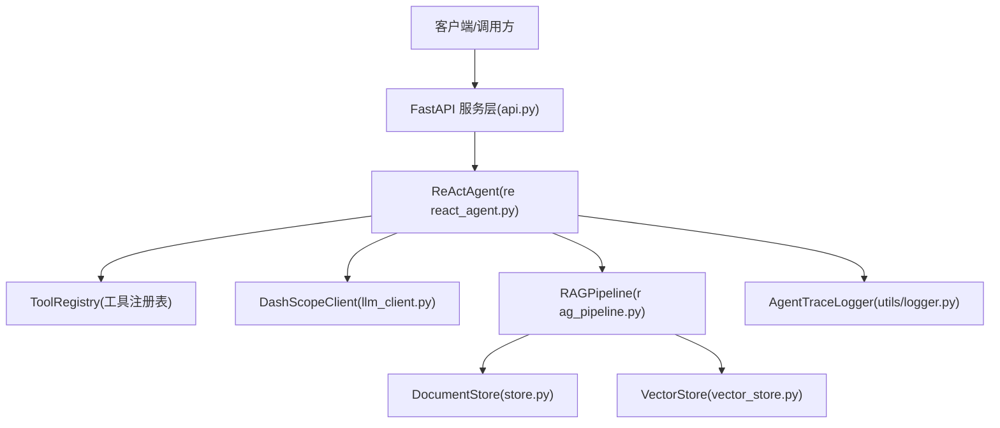
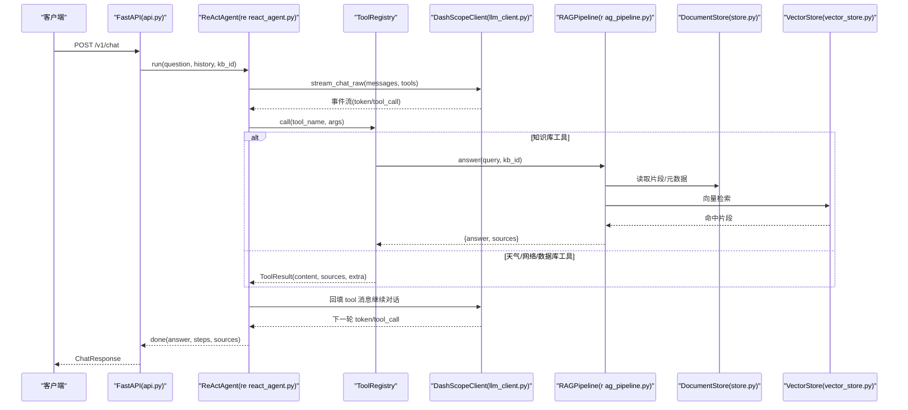
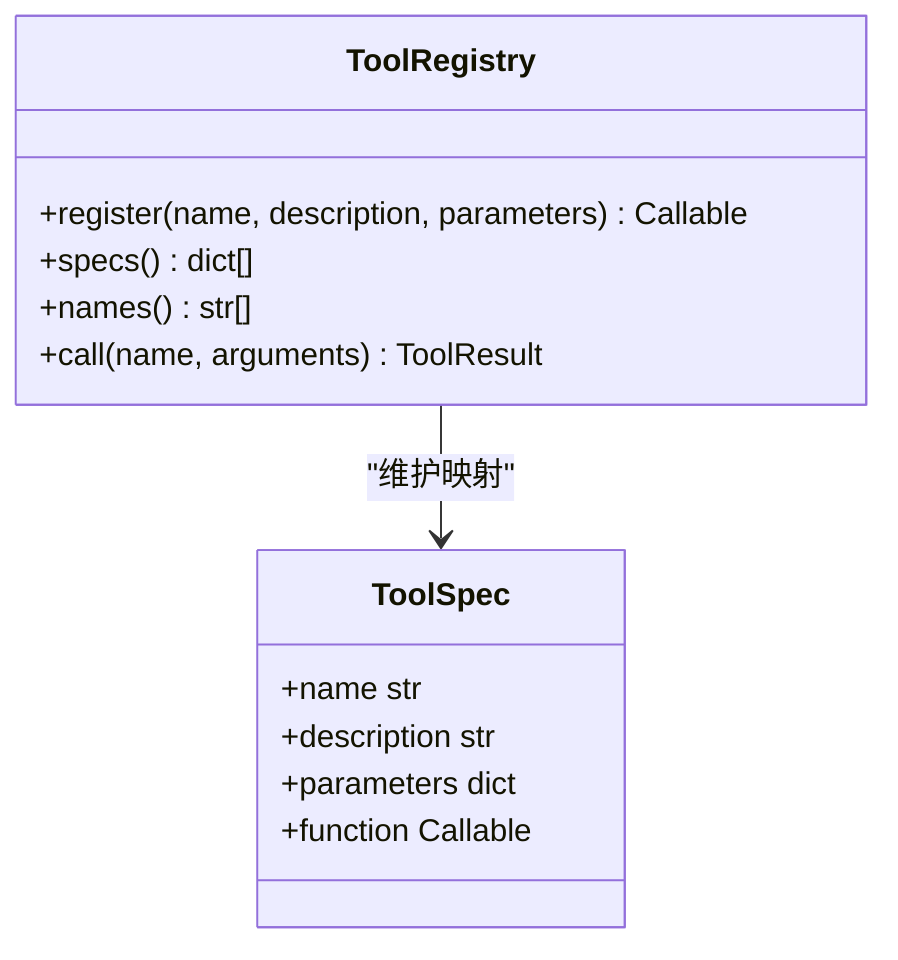
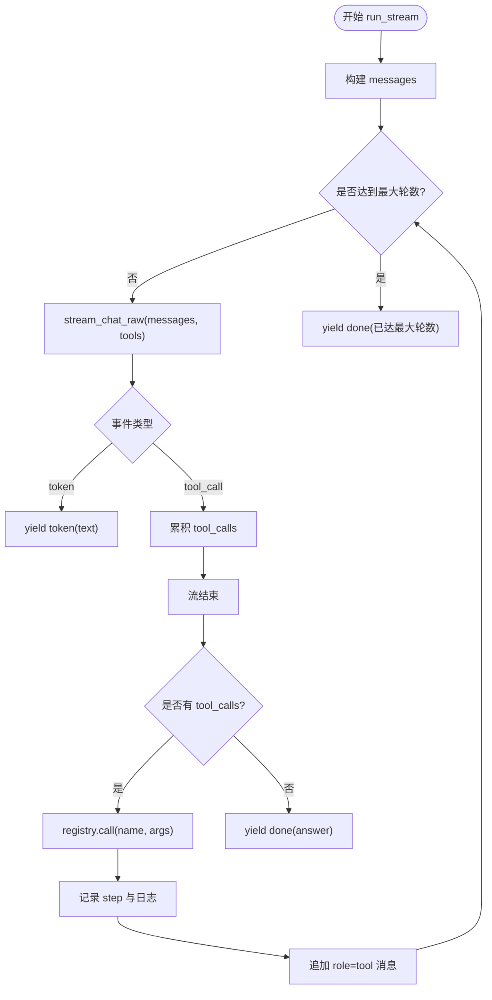
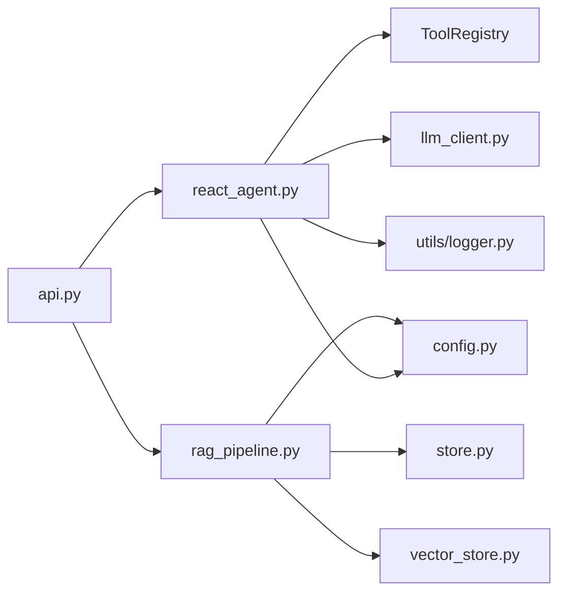

# Agent执行流程

<cite>
**本文引用的文件**
- [react_agent.py](file://react_agent.py)
- [rag_pipeline.py](file://rag_pipeline.py)
- [llm_client.py](file://llm_client.py)
- [config.py](file://config.py)
- [api.py](file://api.py)
- [utils/logger.py](file://utils/logger.py)
- [store.py](file://store.py)
- [vector_store.py](file://vector_store.py)
- [tests/test_agent.py](file://tests/test_agent.py)
</cite>

## 目录
1. [简介](#简介)
2. [项目结构](#项目结构)
3. [核心组件](#核心组件)
4. [架构总览](#架构总览)
5. [详细组件分析](#详细组件分析)
6. [依赖关系分析](#依赖关系分析)
7. [性能考量](#性能考量)
8. [故障排查指南](#故障排查指南)
9. [结论](#结论)
10. [附录：自定义工具开发与调试](#附录自定义工具开发与调试)

## 简介
本文件面向“Function Calling Agent”的多步任务处理流程，系统性说明工具选择策略、参数解析与验证、工具执行监控、结果处理与循环控制；并覆盖工具注册机制、事件流处理、异常恢复策略，以及自定义工具开发指南与调试方法。该实现以 ReAct 思想驱动：模型根据用户问题选择工具、执行工具、将结果回填给模型，直到模型给出最终回答或达到最大轮数。

## 项目结构
- 入口与服务层：FastAPI 暴露 REST API，统一路由到 RAGPipeline 与 ReActAgent。
- Agent 核心：ReActAgent 负责多步循环、工具注册表、事件流输出。
- LLM 客户端：DashScopeClient 提供聊天、流式聊天、Function Calling 流式接口与联网搜索。
- RAG 管线：RAGPipeline 提供知识库管理、文档入库、混合检索与带引用问答。
- 存储与向量：SQLite 元数据与片段存储；Chroma 向量库封装。
- 配置与日志：集中配置项；线程安全的 JSONL 轨迹日志与 token 估算。

图表来源
- [api.py:185-199](file://api.py#L185-L199)
- [react_agent.py:144-371](file://react_agent.py#L144-L371)
- [llm_client.py:203-278](file://llm_client.py#L203-L278)
- [rag_pipeline.py:196-697](file://rag_pipeline.py#L196-L697)
- [store.py:123-470](file://store.py#L123-L470)
- [vector_store.py:38-148](file://vector_store.py#L38-L148)
- [utils/logger.py:12-46](file://utils/logger.py#L12-L46)

章节来源
- [api.py:1-204](file://api.py#L1-L204)
- [react_agent.py:1-567](file://react_agent.py#L1-L567)
- [rag_pipeline.py:1-792](file://rag_pipeline.py#L1-L792)
- [llm_client.py:1-322](file://llm_client.py#L1-L322)
- [config.py:1-113](file://config.py#L1-L113)
- [store.py:1-470](file://store.py#L1-L470)
- [vector_store.py:1-255](file://vector_store.py#L1-L255)
- [utils/logger.py:1-76](file://utils/logger.py#L1-L76)

## 核心组件
- ReActAgent：实现 Function Calling 多步循环、工具注册与调用、事件流输出、结果聚合。
- ToolRegistry：声明式工具注册（名称、描述、JSON Schema），生成 OpenAI tools 格式并按名调用。
- DashScopeClient：OpenAI 兼容的聊天、流式聊天、Function Calling 流式事件、联网搜索。
- RAGPipeline：知识库 CRUD、增量入库、混合检索（向量+BM25）、带引用问答。
- DocumentStore：SQLite 持久化知识库、文档、片段、版本与元数据。
- VectorStore：Chroma 向量库封装，支持批量 upsert、查询、MMR 所需向量获取。
- AgentTraceLogger：线程安全 JSONL 轨迹日志，记录每步 thought_summary、tool、args、observation、cost_estimate。

章节来源
- [react_agent.py:69-142](file://react_agent.py#L69-L142)
- [react_agent.py:144-371](file://react_agent.py#L144-L371)
- [llm_client.py:22-299](file://llm_client.py#L22-L299)
- [rag_pipeline.py:196-697](file://rag_pipeline.py#L196-L697)
- [store.py:123-470](file://store.py#L123-L470)
- [vector_store.py:38-148](file://vector_store.py#L38-L148)
- [utils/logger.py:12-46](file://utils/logger.py#L12-L46)

## 架构总览
下图展示一次 Agent 请求从 API 进入，到 LLM 选择工具、执行工具、回填结果、直至最终回答的完整序列。

图表来源
- [api.py:185-199](file://api.py#L185-L199)
- [react_agent.py:272-371](file://react_agent.py#L272-L371)
- [llm_client.py:203-278](file://llm_client.py#L203-L278)
- [rag_pipeline.py:590-667](file://rag_pipeline.py#L590-L667)
- [store.py:425-442](file://store.py#L425-L442)
- [vector_store.py:100-127](file://vector_store.py#L100-L127)

## 详细组件分析

### 工具注册机制
- 使用装饰器 @registry.register(name, description, parameters) 注册工具函数，内部维护 ToolSpec（名称、描述、JSON Schema、函数）。
- specs() 生成 OpenAI 兼容 tools 列表，供 LLM 选择。
- call(name, arguments) 按名查找并调用，返回 ToolResult；未知工具或异常会返回友好提示，便于模型自行重试或降级回答。

图表来源
- [react_agent.py:85-142](file://react_agent.py#L85-L142)

章节来源
- [react_agent.py:93-142](file://react_agent.py#L93-L142)

### 工具选择策略
- 通过向 LLM 传入 tools=registry.specs()，让模型基于用户问题决定调用哪个工具及参数。
- 温度设置为较低值（0.2）以减少随机性，提高工具选择的稳定性。
- 若模型未返回 tool_calls，则视为直接回答，结束本轮。

章节来源
- [react_agent.py:272-326](file://react_agent.py#L272-L326)
- [llm_client.py:203-278](file://llm_client.py#L203-L278)

### 参数解析与验证
- _parse_arguments 对模型返回的工具参数进行容错解析：去除 markdown 代码块包裹、尝试 JSON 解析，失败时返回空字典，避免中断流程。
- 工具函数的 JSON Schema 由注册时提供，用于指导模型生成正确参数；运行时不做强类型校验，但异常会被捕获并反馈给模型。

章节来源
- [react_agent.py:493-504](file://react_agent.py#L493-L504)
- [react_agent.py:130-142](file://react_agent.py#L130-L142)

### 工具执行监控与事件流
- run_stream 产生事件：tool_start、tool_end、step、token、done、error。
- 每个工具调用前后分别产出 tool_start 与 tool_end，中间包含 step 记录（步骤号、工具名、参数、观察结果、成本估算）。
- token 事件逐字输出，降低首字延迟；done 事件携带最终答案。
- 所有步骤通过 AgentTraceLogger 写入 JSONL，便于回放与审计。

图表来源
- [react_agent.py:272-371](file://react_agent.py#L272-L371)
- [utils/logger.py:20-46](file://utils/logger.py#L20-L46)

章节来源
- [react_agent.py:272-371](file://react_agent.py#L272-L371)
- [utils/logger.py:12-46](file://utils/logger.py#L12-L46)

### 结果处理与循环控制
- 每轮结束后，若模型未再调用工具，则将其生成的最终回答作为 done 返回。
- 若达到 max_steps（默认来自 AppConfig.agent_max_steps），则终止并提示未完成。
- 工具结果内容被截断至固定长度（TOOL_OBSERVATION_MAX_CHARS），防止长响应稀释注意力。

章节来源
- [react_agent.py:250-271](file://react_agent.py#L250-L271)
- [react_agent.py:368-371](file://react_agent.py#L368-L371)
- [config.py:56-113](file://config.py#L56-L113)

### 内置工具与能力
- search_knowledge_base：调用 RAGPipeline.answer，返回带引用的答案与来源。
- search_web：通过 DashScopeClient.web_search 获取实时信息。
- get_weather：调用 Open-Meteo 地理编码与预报接口，格式化输出当前天气与当日预报。
- query_database：只读 SQLite 查询（仅允许 SELECT/PRAGMA/EXPLAIN/WITH），限制行数与输出长度。

章节来源
- [react_agent.py:165-246](file://react_agent.py#L165-L246)
- [react_agent.py:373-471](file://react_agent.py#L373-L471)
- [llm_client.py:283-294](file://llm_client.py#L283-L294)

### RAG 管线集成
- RAGPipeline.answer 在知识库存在时执行混合检索（向量+BM25，RRF 融合，可选 MMR 重排），组装上下文后生成带引用回答。
- 无知识库或无需检索时走 chat 路径，直接通用问答。
- 历史消息与上下文均按 token 预算截断，避免过长导致性能下降与注意力分散。

章节来源
- [rag_pipeline.py:590-697](file://rag_pipeline.py#L590-L697)
- [rag_pipeline.py:439-524](file://rag_pipeline.py#L439-L524)
- [rag_pipeline.py:159-194](file://rag_pipeline.py#L159-L194)

### 存储与向量
- DocumentStore：SQLite 管理知识库、文档、片段、版本与元数据；WAL 模式与 busy_timeout 提升并发安全性。
- VectorStore：Chroma 向量库封装，支持批量 upsert、条件删除、相似度查询、获取原始向量（用于 MMR）。

章节来源
- [store.py:123-470](file://store.py#L123-L470)
- [vector_store.py:38-148](file://vector_store.py#L38-L148)

## 依赖关系分析
- API 层依赖 ReActAgent 与 RAGPipeline，统一鉴权与错误处理。
- ReActAgent 依赖 ToolRegistry、DashScopeClient、RAGPipeline、AgentTraceLogger。
- RAGPipeline 依赖 DocumentStore、VectorStore、LLMClient 协议（DashScopeClient 实现）。
- 配置集中于 AppConfig，所有可调参数通过环境变量注入。

图表来源
- [api.py:185-199](file://api.py#L185-L199)
- [react_agent.py:144-371](file://react_agent.py#L144-L371)
- [rag_pipeline.py:196-697](file://rag_pipeline.py#L196-L697)
- [config.py:56-113](file://config.py#L56-L113)

章节来源
- [api.py:1-204](file://api.py#L1-L204)
- [react_agent.py:1-567](file://react_agent.py#L1-L567)
- [rag_pipeline.py:1-792](file://rag_pipeline.py#L1-L792)
- [config.py:1-113](file://config.py#L1-L113)

## 性能考量
- 流式输出：stream_chat_raw 边到边 yield token，显著降低首字延迟。
- 工具结果截断：限制 observation 长度，避免上下文膨胀。
- 历史与上下文截断：truncate_history 与 fit_context_indices 按 token 预算保留最近且放得下的内容。
- 混合检索优化：向量 Top-N 与 BM25 Top-N 经 RRF 融合，可选 MMR 去重，减少冗余。
- 批量嵌入：VectorStore 分批 upsert，避免单次过大请求。
- 只读数据库：query_database 使用只读连接与白名单 SQL，保障安全与稳定。

[本节为通用性能讨论，不直接分析具体文件]

## 故障排查指南
- 模型调用失败：stream_chat_raw 捕获异常并抛出 RuntimeError，上层可转换为 HTTP 500；safe_error 隐藏冗长堆栈，保留可读原因。
- 工具执行异常：ToolRegistry.call 捕获异常并返回 ToolResult 错误文本，模型有机会重试或直接回答。
- 天气查询不可用：_weather 捕获异常并返回友好提示；可通过环境变量替换 URL 或添加重试逻辑。
- 数据库不存在或权限不足：query_database 检查 db_path 与只读约束，返回明确错误。
- 知识库为空：RAGPipeline.answer 在无相关片段时返回提示，建议换问法或补充资料。

章节来源
- [llm_client.py:297-299](file://llm_client.py#L297-L299)
- [react_agent.py:307-311](file://react_agent.py#L307-L311)
- [react_agent.py:130-142](file://react_agent.py#L130-L142)
- [react_agent.py:373-436](file://react_agent.py#L373-L436)
- [react_agent.py:443-471](file://react_agent.py#L443-L471)
- [rag_pipeline.py:590-667](file://rag_pipeline.py#L590-L667)

## 结论
该 Function Calling Agent 以 ReAct 循环为核心，结合工具注册表与流式事件，实现了“模型选工具→执行→回填→再决策”的多步任务处理。通过 RAG 混合检索与只读数据库等内置工具，Agent 能高效完成知识问答、联网搜索、天气查询与本地数据查询等任务。配置集中、日志可追踪、异常可恢复，适合企业级智能助手场景。

[本节为总结性内容，不直接分析具体文件]

## 附录：自定义工具开发与调试

### 开发指南
- 定义工具函数：接收参数，返回 ToolResult（content、sources、extra）。
- 注册工具：使用 @registry.register(name, description, parameters) 装饰，参数为 JSON Schema，用于指导模型生成正确参数。
- 示例参考：search_knowledge_base、get_weather、search_web、query_database 的实现位置。

章节来源
- [react_agent.py:165-246](file://react_agent.py#L165-L246)
- [react_agent.py:69-83](file://react_agent.py#L69-L83)

### 调试方法
- 事件流调试：run_stream 输出 tool_start、tool_end、step、token、done、error，便于定位每步行为。
- 轨迹日志：AgentTraceLogger 记录每步的 thought_summary、tool、args、observation、cost_estimate，便于回放与分析。
- 单元测试：tests/test_agent.py 提供了工具注册、参数解析、最大轮数、天气工具桩测试等用例，可用于快速验证新工具。

章节来源
- [react_agent.py:272-371](file://react_agent.py#L272-L371)
- [utils/logger.py:12-46](file://utils/logger.py#L12-L46)
- [tests/test_agent.py:11-67](file://tests/test_agent.py#L11-L67)